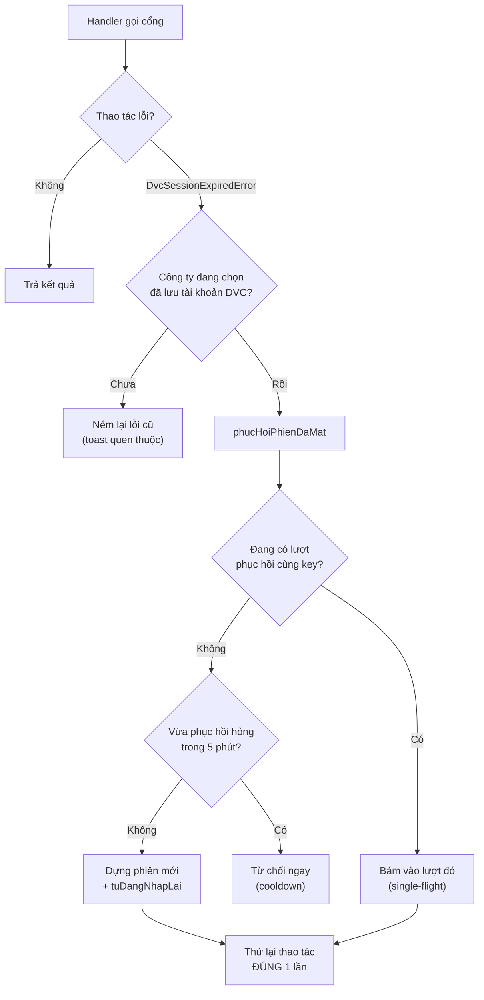

# Thay đổi module Dịch vụ công (DVC) — 08/2026

> Tài liệu mô tả toàn bộ thay đổi đang nằm trên nhánh `dev_fe` (chưa commit) của module **Dịch vụ
> công** — proxy tới cổng `dichvucong.gdt.gov.vn`. Viết để người review hiểu **vì sao** từng thay
> đổi tồn tại, không chỉ *nó làm gì*.

**Phạm vi:** 21 file sửa + 6 file mới, chia thành 7 nhóm. Ba nhóm đầu là tính năng, nhóm 4 thêm mẫu
tờ khai, nhóm 5 dọn dẹp, nhóm 6 là kết quả của một lượt `/code-review` + `/simplify`, nhóm 7 vá lỗi
đồng bộ.

---

## 0. Bối cảnh: phiên cổng DVC hoạt động thế nào

Cổng DVC không mở CORS và xác thực bằng **cookie phiên** (`JSESSIONID` + token CSRF trong thẻ meta),
nên `be_maxv` phải đứng giữa làm proxy. Backend giữ phiên trong một `Map` **nằm trong RAM tiến
trình**, khóa là một UUID gọi là `key` — FE cầm `key` này và gửi kèm mọi lời gọi sau đó.

Từ đó sinh ra **hai kiểu "chết phiên" hoàn toàn khác nhau**, và đây là nền tảng để hiểu nhóm 1:

| Kiểu chết | Biểu hiện | Phiên RAM | Cứu bằng |
|---|---|---|---|
| Cổng đá phiên giữa chừng | Cổng trả `302`/`401` | Vẫn còn, kèm `credential` | `voiTuDangNhapLai` (đã có sẵn) |
| Phiên biến mất khỏi RAM | `DvcSessionExpiredError` | **Mất hẳn**, mất luôn `credential` | `voiPhienTuPhucHoi` (**nhóm 1**) |

Kiểu 2 xảy ra khi quá `SESSION_DANG_NHAP_TTL_MS` (30 phút không thao tác) hoặc **BE vừa restart**.

---

## 1. Tự đăng nhập lại khi phiên RAM mất hẳn

### 1.1. Vấn đề

Quá 30 phút không thao tác (hoặc BE restart) là người dùng nhận toast đỏ *"Phiên captcha đã hết
hạn. Vui lòng lấy mã captcha mới rồi đăng nhập lại."* và phải mở dialog gõ lại tài khoản — dù mật
khẩu cổng **đã được lưu mã hóa** trong `DonVi.dvcPassword*` và backend hoàn toàn đủ khả năng tự đăng
nhập lại.

### 1.2. Cách làm



Điểm mấu chốt: phiên mới được **gắn vào đúng `key` mà FE đang giữ**, nên không phải đổi contract
API, FE không cần biết gì đã xảy ra.

> `key` chỉ là *tên gọi* phiên trong `Map`, không phải thứ cổng dùng để xác thực — cổng xác thực
> bằng cookie bên trong phiên. Vì vậy thay ruột phiên mà giữ nguyên tên là hợp lệ.

### 1.3. Vì sao `voiPhienTuPhucHoi` nằm ở CONTROLLER, không ở service

Chỉ tầng controller mới có `request` để biết **người dùng là ai** và **công ty đang chọn là công ty
nào** — tức là chỉ ở đó mới đọc được tài khoản đã lưu **đúng chủ**.

Service **không được phép** tự suy tài khoản từ `key`. Nếu suy thì `key` lại trở thành thứ tự cấp
quyền, đúng cái lỗ hổng mục 6.1 sinh ra để bịt.

**File:** `be_maxv/src/services/client/dich_vu_cong/gdt-dvc.service.ts`,
`be_maxv/src/controllers/client/dich_vu_cong/gdt-dvc.controller.ts`

---

## 2. Giữ khóa phiên qua F5

Trước đây `dvcKeyTheoMst` nằm trong `useState` của `DvcPage` — **F5 là mất sạch**. Điều đó khiến
nhóm 1 gần như vô dụng: BE sẵn sàng tự đăng nhập lại nhưng không còn `key` nào để gắn phiên mới vào.

**Hai nhóm này phải đi cùng nhau mới có tác dụng thật.**

### 2.1. Vì sao `localStorage` chứ không `sessionStorage`

Module HĐĐT tương ứng (`GdtSessionProvider`) dùng `sessionStorage`. Ở đây cố ý làm khác:

- Token GDT sống ~5 phút → giữ qua tab mới cũng vô nghĩa.
- Khóa DVC nay **chết không sao** — BE tự dựng lại phiên cho đúng khóa đó. Sống qua lần mở lại
  trình duyệt nghĩa là sáng mở máy bấm "Đồng bộ" là chạy luôn.

Khóa được xóa khi **đăng xuất** (`clearDvcKeys` trong `AppHeader`, đặt cạnh `clearGdtSession`) — vì
`localStorage` sống qua cả lần đóng trình duyệt, máy dùng chung không được để lại khóa người trước.

**File:** `hdđt_maxv/src/features/dich_vu_cong/dvcKeyStore.ts` *(mới)*,
`hdđt_maxv/src/pages/dich_vu_cong/DvcPage.tsx`, `hdđt_maxv/src/components/AppHeader.tsx`

---

## 3. Đổi cột mở dialog "Xem tờ khai"

Chỗ bấm chuyển từ cột **Tên thủ tục hành chính** sang **Tờ khai / Phụ lục**.

Kèm theo một sửa **bắt buộc**: điều kiện `bamDuoc` phải xét thêm ô có giá trị hay không.
`dvc_ho_so.to_khai` được lưu `null` khi cổng không trả, mà ô rỗng vẫn bọc `<Link>` thì ra một **link
vô hình** — không thấy gì để bấm nhưng vẫn là vùng bấm được.

**File:** `hdđt_maxv/src/features/dich_vu_cong/config.ts`,
`hdđt_maxv/src/features/dich_vu_cong/components/BangHoSo.tsx`

> Hai cột này về sau được co hẹp lại cho đỡ kéo rộng bảng — xem 7octies.

---

## 4. Mẫu tờ khai 05/KK-TNCN

Trước đây chỉ mẫu **01/GTGT** có layout mẫu in; mọi mẫu khác rơi vào nhánh `raw` — chỉ liệt kê tên
thẻ XML thô kèm cảnh báo *"chưa có layout riêng"*, tức là ngõ cụt với người dùng.

### 4.1. Nhận diện mẫu — 3 nguồn, xét theo thứ tự tin cậy

```ts
const loai =
  MAU_THEO_MA_TKHAI[maTKhai ?? ""] ?? doTenMau(maMauHoSo) ?? doTenMau(tenTKhai) ?? "raw";
```

| Ưu tiên | Nguồn | Vì sao |
|---|---|---|
| 1 | `<maTKhai>` trong XML | Mã máy cổng gán, chắc chắn nhất |
| 2 | Ô cột "Tờ khai" (`dvc_ho_so.to_khai`) | Chính chuỗi người dùng **nhìn thấy** trên bảng |
| 3 | `<tenTKhai>` trong XML | Lưới an toàn khi hồ sơ chưa lưu ô "Tờ khai" |

Xét **từng nguồn riêng** chứ không nối thành một chuỗi rồi dò: nối lại là mọi nguồn có trọng số bằng
nhau, thứ tự ưu tiên trên trở thành không hiện thực được.

Dò chuỗi dùng `\b` hai đầu (`/\b05\/KK-TNCN\b/i`) chứ không `includes` — cột *"Tờ khai / Phụ lục"*
đúng như tên gọi **có thể liệt kê nhiều thứ**.

### 4.2. Độ tin cậy KHÔNG đồng đều — đọc kỹ trước khi sửa

| Mức | Trường | Trạng thái |
|---|---|---|
| Đã đối chiếu | `tenTKhai`, `moTaBMau`, kỳ tính thuế, `tenNNT`, `mst`, `nguoiKy`, `ngayKy`, chữ ký số | Dùng chung khối `TTinChung` của mọi tờ khai TCT, xác nhận trên XML 01/GTGT thật trong test |
| Suy từ quy ước | Chỉ tiêu `ct16`..`ct32` | Mã trên mẫu in chạy đúng [16]..[32]; **chưa** đối chiếu chéo bằng số học như đã làm với 01/GTGT |
| **Chưa đối chiếu** | Địa chỉ [06]–[11], đại lý thuế [12]–[14], ô [15] | Thử vài tên thẻ ứng viên; **không trúng thì ô để TRỐNG** |

Ô trống là kiểu hỏng **nhìn ra được**. Vì vậy các tên thẻ *trần* (`email`, `fax`, `dthoai`,
`dchiTSo`) đã bị loại bỏ: bảng thẻ gộp cả tài liệu nên tên trần rất dễ vớ đúng giá trị của **khối
đại lý thuế** rồi hiện lên như thể là của người nộp thuế — số liệu sai trên một bản sao tờ khai thì
không ai nhìn ra.

> **Để chốt 100%:** cần một file XML 05/KK-TNCN thật (bấm "Tải file" trên đúng dòng đó). Khi có,
> sửa đúng một chỗ — `layChiTietTncn05` — là xong, và bổ sung `maTKhai` thật vào `MAU_THEO_MA_TKHAI`.

**File:** `ToKhaiTNCN05Form.tsx` *(mới)*, `toKhaiXml.ts`, `api/dvc.ts`, `ToKhaiXmlDialog.tsx`,
`dvc-dong-bo.service.ts`, `__tests__/toKhaiXml.test.ts`

---

## 5. Dọn scaffolding debug

Gỡ trọn cụm theo dõi tạm (đều đã đánh dấu `TODO(tạm)`): field `viTuDongDangNhapLaiLuc`, hàm
`laVuaTuDongDangNhapLai`, field response `_tuDongDangNhapLai`, toast `[DEBUG]` bên FE, và 12 dòng
`console.log`. Warning `no-console` giảm **106 → 94**.

Hệ quả phụ đáng chú ý: `DialogDongBo` không còn phải ép kiểu
`log as unknown as { _tuDongDangNhapLai?: boolean }` — response giờ khớp đúng type khai báo.

---

## 6. Kết quả /code-review + /simplify

### 6.1. Rò rỉ giữa tenant (nghiêm trọng)

**Vấn đề:** `requireSession(key)` chỉ tra `key` trong `Map` rồi trả phiên — `DvcSession` **không lưu
công ty chủ sở hữu**. Người dùng B (JWT hợp lệ của mình, có module `dvc`) gọi:

```
GET /api/v1/dvc/ho-so/tai-lieu-dkem?key=<key_cua_A>&maHoSo=<ho_so_cua_A>
```

…là nhận dữ liệu cổng của công ty A. Endpoint đó không đọc cache, đi thẳng ra cổng.

Đây là lỗ **có sẵn từ trước**, nhưng nhóm 2 làm nó tệ hơn: khóa giờ nằm trên đĩa, đọc được bằng
console trên máy dùng chung — trước đây nó chết theo tab.

**Cách vá:**

```ts
function requireSession({ key, donViId }: DvcPhien): DvcSession {
  sweepExpiredSessions();
  const session = getSession(key);
  // Sai chủ -> đối xử ĐÚNG NHƯ "không có phiên": không tiết lộ khóa đó có tồn tại hay không.
  if (!session || session.donViId !== donViId) throw new DvcSessionExpiredError();
  return session;
}
```

Đổi kiểu tham số (`string` → `DvcPhien`) thay vì thêm tham số tùy chọn là **cố ý**: TypeScript ép
sửa đủ **10 điểm gọi**, không chỗ nào sót được.

Thêm `RE_KHOA_PHIEN` chặn khóa không phải UUID — `phucHoiPhienDaMat` là chỗ **duy nhất** ghi vào kho
phiên bằng khóa **client gửi lên**, khác mọi chỗ khác (server tự sinh `randomUUID()`).

### 6.2. Single-flight khi phục hồi

BE restart lúc trang đang mở vài dialog → nhiều request cùng phát hiện phiên chết → **mỗi request mở
một lượt đăng nhập THẬT** cho cùng tài khoản, ghi đè phiên của nhau trong `sessions`, và lượt nào
hỏng trước còn `clearSession` **xóa mất phiên lượt kia vừa dựng xong**.

Đã gộp các lượt trùng khóa qua `dangPhucHoi: Map<string, Promise<void>>`.

### 6.3. Cooldown + FE bỏ khóa chết

Phục hồi hỏng thì trước đây **không ai ghi nhận** — request kế tiếp lặp lại nguyên vòng 3 lượt × 3
request. Cộng với `retry: 1` của TanStack Query: **một lần mở dialog = tới 18 request lên cổng**.
Đúng rủi ro khóa tài khoản mà code gốc đã cảnh báo.

- **BE:** `phucHoiHongLuc` — hỏng thì nghỉ 5 phút mới cho thử lại. Map này được dọn kèm trong
  `sweepExpiredSessions` (khóa theo UUID nên không tự co lại).
- **BE:** thêm mã `DVC_AUTO_LOGIN_FAILED` vào thân lỗi qua helper `thanLoi`.
- **FE:** `ApiError` mang thêm `code`; `DvcPage.boKhoaNeuPhienChet` bỏ khóa của MST đang chọn.
  So bằng **mã** chứ không dò câu chữ tiếng Việt — đổi lời thông báo là FE lặng lẽ hết nhận ra.

Nối cho **cả 4 dialog**. Vì TanStack Query v5 **bỏ `onError` trên `useQuery`**, phải theo dõi lỗi
bằng effect — tách hook `useBaoPhienChet` thay vì chép 3 lần:

| Dialog | Nối ở đâu |
|---|---|
| Đồng bộ | `useMutation.onError` |
| Thông báo | `useQuery` **+** catch của nút tải file |
| Xem tờ khai | `useQuery` |
| Tệp đính kèm | `useQuery` |

> **Bẫy:** `boKhoaNeuPhienChet` là dep của effect trong hook. Để là hàm thường thì mỗi render sinh
> hàm mới → effect chạy lại mỗi render → người dùng ăn một tràng toast cho cùng một lỗi. `useCallback`
> ở đây **không phải để tối ưu** mà là điều kiện đúng đắn — đừng gỡ vì tưởng thừa.

### 6.4. Dọn chất lượng

| Việc | Tác dụng |
|---|---|
| `mauInFormat.ts` + `mauInChung.tsx` *(mới)* | Gỡ ~90 dòng trùng giữa 2 form; `ToKhaiGtgt01Form` giảm 78 dòng |
| `bangTheLa()` | Quét thẻ **một lượt** thay vì ~40 lượt quét toàn văn bản mỗi lần bóc |
| `thongTinChungToKhai()` | 11 dòng bóc khối `TTinChung` về một chỗ; hai interface `extends` nó |
| `layMoiCt<T>()` | Gộp 2 bản, nhận predicate lọc dải, dùng `RE_CT_GTGT01` đã đặt tên |
| `matKhauDvcDaGiaiMa()` | Gộp khối giải mã dùng chung cho `getCredential` và `taiKhoanDvcDaLuu` |
| `CAN_KHO_RONG` map | Thêm mẫu mà quên khai khổ dialog → **lỗi biên dịch**, không im lặng render khổ hẹp |

Tách 2 file (`mauInFormat.ts` cho hàm, `mauInChung.tsx` cho component) vì quy tắc `react-refresh`
không cho một file vừa export component vừa export hàm.

### 6.5. Bốn lỗi hiển thị đã sửa

1. **Chữ `NaN` in lên mẫu tờ khai** — `Number("1.234.567")` ra `NaN`, lọt qua mọi guard của
   `fmtSoTien`. Lỗi này có ở **cả** mẫu 01/GTGT sẵn có, nay guard `Number.isFinite` phủ cả hai.
2. **Khung trắng gắt ở dark mode** — hộp "Mẫu số" dùng `text.primary` (trắng nguyên chất ở dark),
   trong khi bảng ngay dưới dùng `divider`. Đã thống nhất về `divider`.
3. **Ô "Chỉ tiêu" lệch** — sót `verticalAlign` khi `sx` lặp trên 5 `TableCell`/hàng. Đã đưa quy tắc
   chung lên `TableRow`.
4. **Dòng "Ký điện tử bởi:" cụt lủn** — có `SigningTime` mà không moi được `CN=` thì in ra nhãn
   trống. Mỗi dòng nay tự kiểm dữ liệu của mình.

Thêm ngữ nghĩa `dl`/`dt`/`dd` cho khối [04]–[15] (trình đọc màn hình), khớp mẫu 01/GTGT.

---

## 7. Vá lỗi đồng bộ

Ba lỗi đầu (7.1–7.3) trước đây nằm ở mục "việc CHƯA làm" — đã chẩn đoán nhưng chưa vá.
7.4 lộ ra khi chạy đồng bộ THẬT; 7.5 là cùng lớp lỗi với 7.1 ở một cột khác.

### 7.1. File thông báo nhị phân không lưu được

**Vấn đề:** `dvc_tai_lieu.noi_dung` khai `@db.Text`, nhưng file thông báo cổng trả **không phải lúc
nào cũng là XML** — có cả PDF/ZIP. Code ghi bằng `bytes.toString("utf8")` nên Postgres chặn cả dòng:
`invalid byte sequence for encoding "UTF8": 0x00`.

Hậu quả có hai tầng, tầng thứ hai dễ bỏ sót: trong `dongBoChiTietHoSo` lỗi ghi bị nuốt thành
`console.warn`, nhưng ở `luuFileThongBaoVaoCache` (người dùng tự bấm tải) nó ném ra tới handler và
thành **400 "Tải file thông báo thất bại"** — file đã tải xong từ cổng rồi vẫn không tới tay người
dùng, chỉ vì lỗi *ghi cache*.

**Cách vá — hướng B (thêm cột, giữ cột cũ):**

| Cột | Vai trò |
|---|---|
| `noi_dung_bin Bytes?` | Nguyên byte file. Mọi lượt ghi từ nay vào đây. |
| `content_type String?` | MIME cổng khai. **Bắt buộc** — không suy được từ byte, mà `layFileThongBaoDaLuu` trước đây hardcode `application/xml` cho MỌI thông báo, kể cả PDF. |
| `noi_dung String?` *(cũ)* | Chỉ còn để **đọc** dữ liệu đã cache. Không ghi mới. |

Không đổi kiểu cột tại chỗ vì tenant DB đồng bộ bằng `prisma db push --accept-data-loss`
(`sync-tenants.ts:37`): Postgres không cast được `text` → `bytea` nên push sẽ **DROP** cột, xóa sạch
thông báo đã cache trên **mọi** tenant. Đọc ưu tiên `noi_dung_bin`, không có mới rơi về cột Text cũ.

Dòng cache cũ không có `content_type` → đoán theo đuôi `ten_file` (`doanContentType`), không trúng
thì `application/octet-stream`: trình duyệt tải về, thay vì mở sai kiểu. FE **không phải sửa gì** —
`taiThongBao.ts` vốn đã suy đuôi file từ `blob.type` qua `duoiTuContentType`, nó chỉ chưa bao giờ
nhận được content-type đúng từ nhánh cache.

Kèm một sửa nhỏ bắt buộc: `layDanhSachThongBaoDaLuu` thêm `select` — nó chỉ cần tiêu đề/ngày gửi,
mà kéo cả dòng nghĩa là kéo luôn từng file PDF về rồi vứt đi.

### 7.2. `da_dong_bo` set sai chỗ

**Vấn đề:** cờ được set **trước** vòng tải thông báo — nằm chung khối `update` với xml — mà lỗi
thông báo lại bị nuốt. Hồ sơ mang cờ "trọn vẹn" dù thiếu thông báo → lượt sau rơi vào nhánh
`da_co_san`, **không bao giờ thử lại** → thông báo thiếu vĩnh viễn.

Có đường thứ hai tệ hơn, phát hiện khi đọc lại code: khối `update` đó nằm trong `Promise.all` cùng
`layDanhSachThongBao`. `Promise.all` **không rollback** — nhánh ghi DB commit xong trong khi nhánh
gọi cổng ném lỗi, nên cờ dính lại kể cả khi cả `dongBoChiTietHoSo` thất bại.

**Cách vá:** tách làm hai. Khối `Promise.all` chỉ còn ghi xml (vô hại nếu nhánh kia lỗi — xml tải
được thì cache là đúng). `da_dong_bo: true` chuyển xuống **sau** vòng tải thông báo và chỉ chạy khi
không thông báo nào hỏng.

`dongBoChiTietHoSo` nay trả `{ thongBaoLoi }` để `dongBoHoSo` tính hồ sơ dở dang vào `loi` thay vì
im lặng — đúng nghĩa dòng "N hồ sơ lỗi, sẽ bù ở lượt sau" mà lịch sử đồng bộ vẫn hiển thị. Comment
`da_dong_bo` trong schema cũng sửa lại cho khớp code (bản cũ khai cả "tệp đính kèm", thứ chưa từng
được đồng bộ).

> Về sau (7septies) hàm này trả luôn **danh sách** thông báo hỏng chứ không chỉ số lượng, để có cái mà
> bù ở cuối lượt.

> **Đánh đổi đã biết:** thông báo hỏng VĨNH VIỄN (cổng luôn lỗi cho đúng `idTbao` đó) sẽ khiến hồ sơ
> không bao giờ đạt `da_dong_bo`, tức lượt đồng bộ nào cũng tải lại xml + danh sách + thử lại thông
> báo hỏng đó. Đây là đánh đổi **cố ý** — thà lặp việc còn hơn im lặng mất dữ liệu — và giống hệt
> cách hồ sơ lỗi tải xml vẫn được thử lại từ trước. Nhóm 7.3 giới hạn thiệt hại: các lượt lặp đó nay
> đi qua pacer. Nếu về sau thấy phiền, cách sửa là đếm số lần thử trên `dvc_tai_lieu` rồi bỏ cuộc
> sau N lượt, **không** phải quay lại bật cờ sớm.

### 7.3. Không có điều nhịp gọi cổng

**Vấn đề:** `dvcSend` không nghỉ giây nào giữa các call, dù docblock ngay trong chính file đó ghi
*"Cổng chặn tần suất khá gắt — gọi liên tiếp vài lần là dính 429"*. Một lượt đồng bộ gọi ~4 request
cho **mỗi** hồ sơ.

**Cách vá:** dùng lại `gdtPacer` sẵn có, thêm làn `dvc` với **hàng đợi riêng**.

- **Hàng đợi riêng** vì đây là host khác (`dichvucong` ≠ `hoadondientu`): xếp chung thì một lượt
  đồng bộ HĐĐT hàng trăm call sẽ chặn đứng thao tác Dịch vụ công, mà hai cổng chẳng liên quan gì tới
  rate-limit của nhau.
- **Concurrency = 1 và không được nâng.** Đây là ràng buộc *đúng sai*, không phải lịch sự: mọi call
  DVC của một công ty dùng chung một phiên, và `dvcSend` ghi cookie xoay vòng **ngược vào** phiên đó
  sau mỗi lượt. Hai call song song là hai lượt giành nhau một bộ cookie.
- `reportRateLimited` chỉ bắn khi **429** hoặc lỗi tầng fetch (timeout/bị cắt). 302/401 là chuyện
  phiên, 5xx là lỗi cổng — phạt nhịp ở đó là oan, cùng lý lẽ đã ghi ở `fetchListPagePaced`.

> **Bẫy đã tránh:** bọc `schedule` quanh cả `dvcSend` sẽ **deadlock** nếu về sau có hàm nào gọi lồng
> — vòng bơm chạy tuần tự sẽ tự chờ chính nó. Ranh giới đặt đúng ở lượt `fetch`, chỗ lá của cây gọi.

### 7.4. `fileType` của cổng là ĐUÔI, không phải MIME — phát hiện khi chạy đồng bộ thật

Lượt đồng bộ thật đầu tiên ghi ra `content_type = "xml"`. Đó không phải MIME.

Nguồn: gói tệp JSON của cổng trả `{fileName, fileType, content}`, và `docTepTuResponse` gán thẳng
`contentType = goiTep.fileType`. Cổng khai `fileType` bằng **đuôi file**.

Lỗi này **có sẵn** ở đường tải trực tiếp — `reply.type("xml")` sinh header `Content-Type: xml` vô
nghĩa. Nhưng 7.1 làm nó nặng thêm theo hai hướng: giá trị rác nay được **lưu lại** thành vĩnh viễn,
và với PDF thì `fileType = "pdf"` khiến `duoiTuContentType` bên FE không khớp, rơi về mặc định và
lưu PDF thành `.xml` — đúng cái kiểu hỏng mà 7.1 sinh ra để dẹp.

**Vá:** `chuanHoaMime()` trong `gdt-dvc.service.ts` — có `/` thì coi như đã là MIME, không thì tra
bảng đuôi→MIME, không nhận ra thì `application/octet-stream`. Dùng ở ba chỗ: `docTepTuResponse`
(nguồn), `layFileThongBaoDaLuu` (chuẩn hóa cả giá trị đã lỡ lưu), và `doanContentType` (dòng cache
cũ chưa có cột).

> Đây là lý do phải chạy đồng bộ **thật** chứ không dừng ở test đơn vị: cả typecheck, lint lẫn 7
> test mới đều xanh trong khi cột vẫn đang ghi giá trị rác.

### 7.5. `dvc_ho_so.xml_to_khai` — cùng khuôn 7.1

Cột tờ khai mắc **y hệt** lỗi 7.1, chỉ khác một cột: `@db.Text` + `bytes.toString("utf8")`. Chưa nổ
vì `taiXmlHoSoThuc` bóc XML ra khỏi gói ZIP nên gần như luôn là văn bản — nhưng hàm đó **có nhánh dự
phòng trả nguyên bytes** khi response không phải ZIP hợp lệ, trúng nhánh đó là lặp lại `22021`.

Vá theo đúng khuôn: `xml_to_khai_bin Bytes?` + `content_type`, giữ `xml_to_khai` Text để đọc bản cũ.

Điểm KHÁC 7.1 — và là chỗ nguy hiểm hơn: bảng tìm kiếm chính (`timHoSoDaDongBo`) đọc cột này rồi bóc
chỉ tiêu bằng regex (`layChiTieuToKhaiGtgt`) cho **mọi** dòng. Từ khi cột nhận được cả nhị phân, một
hồ sơ trả PDF mà cứ `toString("utf8")` sẽ cho chuỗi rác — regex vẫn chạy, vẫn có thể vớ trúng thứ gì
đó, và cột chỉ tiêu trên bảng **hiện số bịa**. Nên có `xmlToKhaiDangChuoi()`: chỉ giải mã khi MIME
thật sự là XML, còn lại trả `null` để ô trống. Ô trống là kiểu hỏng nhìn ra được; số sai thì không.

> `layChiTietToKhai` (dialog "Xem tờ khai") KHÔNG cần guard này: gặp file lạ nó rơi về nhánh `raw`
> liệt kê thẻ thô — xấu nhưng người dùng nhìn ra ngay, không phải im lặng sai.

**File:** `prisma/tenant/schema.prisma`, `dvc-dong-bo.service.ts`, `gdt-dvc.service.ts`,
`hddt/gdtPacer.ts`, `__tests__/gdtPacer.test.ts`, `__tests__/dvcTaiLieu.test.ts` *(mới)*

---

## 7bis. Toast tiến độ đồng bộ (góc dưới phải)

Yêu cầu: một toast góc dưới phải có thanh tiến độ cho lượt đồng bộ ở trang Dịch vụ công.

### Vì sao phải đổi cả backend

Đồng bộ DVC vốn chạy **blocking** — FE gọi một phát, BE chạy hết rồi mới trả về. Không có kênh nào
để vẽ tiến độ. Thêm nữa, từ khi có điều nhịp (7.3) một hồ sơ tốn ~4 giây, nên vài chục hồ sơ là
hàng phút giữ nguyên một HTTP request — chạm ngưỡng timeout mặc định của IIS/nginx.

Nên chuyển sang **chạy nền + poll**, đúng khuôn `update-run` đã chạy ổn bên HĐĐT.

### Vòng đời chạy nền tách thành helper dùng chung

`taoKhoLuotChayNen<T>` (`services/shared/luotChayNen.ts`) — phần nhỏ nhưng sai nhiều nhất của mọi
luồng nền: lượt mới thay lượt cũ, lượt cũ kết thúc muộn đè mất trạng thái lượt mới, `work` ném lỗi
làm `active` treo vĩnh viễn. HĐĐT `startUpdateRunWith` nay gọi helper này thay vì tự làm; đường HĐĐT
được `gdtUpdateRun.test.ts` che nên đổi ruột mà không sợ lặng lẽ hỏng.

### Backend

- `DvcDongBoTienDo`: `tongHoSo`, `daXong`, `daCoSan`, `dongBoXong`, `loi`, `maHoSoDangLam`, `code`.
  `tongHoSo` biết ngay sau lượt tra cứu nên thanh xác định được mẫu số rất sớm; `0` = còn đang tra
  cứu, FE hiện thanh vô định (vẽ 0% ở đó là nói dối rằng đã bắt đầu mà chưa xong hồ sơ nào).
- `POST /dvc/dong-bo` chuyển sang mở lượt rồi trả tiến độ ngay (**đo được 4ms**); thêm
  `GET /dvc/dong-bo/tien-do`. Khóa lượt là `donViId` -> không có đường xem lượt của công ty khác.
- `dongBoHoSo` nhận thêm `tienDo?` + `daBiThay?`; bộ đếm cập nhật trong khối `finally` của vòng lặp
  chứ không cuối `try` — nhánh `continue` của hồ sơ đã có sẵn thoát sớm, để ngoài là thanh tiến độ
  đứng im đúng ở những lượt chạy nhanh nhất.
- `voiPhienTuPhucHoi` nhận `NguCanhPhucHoi` thay vì `request`: closure chạy nền sống hàng phút sau
  khi response đã đi, giữ nguyên `request` trong đó là giữ luôn cả socket/body. Cùng lý lẽ
  `startUpdateRun` bên HĐĐT rút sẵn `dbName`/`gdtToken` trước khi mở lượt.

> **Bẫy đã bịt:** mã `DVC_AUTO_LOGIN_FAILED` trước đây về FE trong `ApiError.code` và
> `boKhoaNeuPhienChet` dùng nó để bỏ khóa phiên chết (6.3). Chạy nền rồi thì không còn `ApiError`
> nào — mã nằm trong `DvcDongBoTienDo.code`. Không mang theo là cơ chế bỏ khóa lặng lẽ hết tác dụng.
> `DvcPage` nay tách `boKhoaNeuMaPhienChet(code)` cho cả hai đường vào dùng chung.

### Frontend

- `theoDoiDongBoDvc.tsx` — poll 2s, một toast cập nhật dần, khuôn `pollUpdateRunToast`.
  `position: "bottom-right"` đặt trên **từng toast**, không đổi `ToastContainer`: toast này sống
  hàng phút còn mọi toast khác là thông báo tức thời 3 giây, để chung một góc thì cái đang chạy bị
  đẩy lên xuống hoặc che mất.
- `ToastTienDoDongBo.tsx` tách riêng vì `react-refresh/only-export-components` — cùng lý do đã tách
  `mauInChung.tsx` khỏi `mauInFormat.ts`. Thanh dùng `color="inherit"` để ăn theo màu chữ toast
  (`ToastContainer` chạy `theme="colored"`, màu primary cố định sẽ chìm).
- `DvcPage` sở hữu việc theo dõi (nó giữ `activeMst` + khóa phiên); `DialogDongBo` chỉ bàn giao lượt
  vừa mở qua `onDaBatDauDongBo`, và khóa nút khi `dangDongBoNen`.
- Mở trang mà BE còn lượt đang chạy -> nối lại. Đóng dialog/rời trang giữa chừng không mất gì.

> **Hai lỗi tự soát ra và đã sửa trước khi xong:** (1) ghi `activeMstRef.current` trong lúc render —
> `react-hooks/refs` bắt được; (2) vòng theo dõi là đơn luồng, nên đổi công ty giữa chừng thì effect
> nối lại chạy đúng lúc vòng cũ còn đang ngủ giữa hai nhịp poll, bị cờ chặn rồi **không bao giờ thử
> lại** — lượt của công ty mới có chạy cũng không ai hiện. Vòng cũ nay báo `khiXong(null)` để chỗ
> gọi dò lại.

### Quy tắc góc toast, áp cho cả module hóa đơn

Sau khi toast DVC xuống góc dưới phải thì mỗi nơi tự khai `position` là kiểu về sau chỉnh một chỗ rồi
tưởng đã chỉnh hết. Gom thành `lib/toastChayNen.ts` với đúng một quy tắc:

> Thông báo của **lượt chạy nền** nằm góc **dưới phải**; mọi thông báo tức thời giữ nguyên góc trên
> phải (mặc định `ToastContainer`). Lý do tách: toast lượt nền sống hàng phút, thông báo thường tự
> tắt sau 3 giây — để chung một góc thì cái đang chạy bị đám kia đẩy lên xuống hoặc che mất.

`position` đặt trên TỪNG toast, không đổi `ToastContainer` — đổi ở container là kéo cả thông báo tức
thời xuống theo, mất luôn chỗ tách.

Áp cho bốn luồng chạy nền: đồng bộ DVC, đồng bộ hóa đơn (`SyncInvoiceDialog` — toast tóm tắt theo
chiều, "đã gửi yêu cầu dừng", "đã đồng bộ xong danh sách"), tải chi tiết (`pollDetailRunToast`), và
"Cập nhật từ Thuế điện tử" (`pollUpdateRunToast`).

KHÔNG áp cho các `toast.loading` tải file một lần (`ThongBaoDialog`, `ExportFileDialog`,
`InvoiceListTabs`, `taiFileHoSo`): chúng chỉ sống vài giây, đúng loại thông báo tức thời. Cũng không
áp cho "Đã xóa dòng lịch sử đồng bộ" — đó là CRUD, không thuộc lượt chạy nào.

**File:** `lib/toastChayNen.ts` *(mới)*, `services/shared/luotChayNen.ts` *(mới)*, `hddt/gdt.service.ts`, `dvc-dong-bo.service.ts`,
`gdt-dvc.controller.ts`, `gdt-dvc.route.ts`, `__tests__/luotChayNen.test.ts` *(mới)*,
`__tests__/dvcDongBoRun.test.ts` *(mới)*, `theoDoiDongBoDvc.tsx` *(mới)*,
`components/ToastTienDoDongBo.tsx` *(mới)*, `DialogDongBo.tsx`, `DvcPage.tsx`, `api/dvc.ts`,
`hddt/components/SyncInvoiceDialog.tsx`, `hddt/api/invoiceDetail.ts`, `hddt/api/updateRun.ts`

---

## 7ter. Đồng bộ chỉ lấy được 10 hồ sơ đầu

### Triệu chứng và bằng chứng

Đồng bộ cả năm 2026 cho MST 0106200129 trả đúng **10** hồ sơ. Nới khoảng ngày ra 2 năm rồi 7 năm
vẫn **đúng 10 dòng**, ngày nộp min/max không đổi — nghĩa là 10 không phải số hồ sơ thật.

HTML cổng trả nói thẳng:

```
Trang [1] / totalPage=2  -  Tổng số bản ghi: 16
onChangePage(1,10)   onChangePage(2,10)   »
```

Công ty có **16** hồ sơ, cổng chia **2 trang × 10**, code chỉ đọc trang 1 -> **mất 6 hồ sơ**. Tệ nhất
là im lặng: lịch sử ghi `tong=10 ... loi=0`, "xong, không lỗi", trong khi thiếu 37% dữ liệu.

Nguyên nhân: `guiTraCuuHoSo` không gửi `page`/`size` (cổng mặc định `1`/`10`), và `parseBangHoSo`
chỉ đọc `<table>`, không hề biết có khối phân trang bên cạnh.

### Cách vá

Hàm `onChangePage` trong trang `/tchs` cho biết cơ chế — cùng endpoint, thêm hai tham số:

```js
params.set('page', currentPage);  // 1-based
params.set('size', pageSize);
htmx.ajax('GET', base_url + 'ho-so/search?' + params.toString(), ...)
```

Hai lớp:

1. **Xin `size=100` ngay lượt đầu** — phần lớn khoảng ngày gói gọn một request (mỗi lượt tốn 1
   captcha + 1 request, nên tiết kiệm được là đáng).
2. **Vẫn lặp trang theo `totalPage`** bóc từ HTML (`bocPhanTrang`), phòng khi cổng ép `size` về 10.

`bocPhanTrang` trả `null` (không phải `0`) khi không đọc được: `0` là "cổng nói không có bản ghi
nào", `null` là "không biết" — lẫn hai cái là báo thiếu dữ liệu oan.

### Chống trùng, vì hỏng ngược lại còn khó thấy hơn

Vòng lặp **không tin `page` chạy đúng**. Nếu cổng lờ tham số đó (đổi tên, đổi cơ chế) thì trang 2
trả lại y hệt trang 1; cứ nối vào là ra 20 dòng cho 16 bản ghi — sai theo hướng ngược lại và khó
phát hiện hơn cả lỗi cũ. Nên lọc trùng theo ô "Mã hồ sơ", và trang nào không thêm được dòng mới thì
dừng luôn. Kèm trần `MAX_TRANG = 50` cho khỏi quay vô tận.

### Đối chiếu để không tái diễn kiểu hỏng im lặng

`traCuuHoSo` trả kèm `tongSoBanGhi` cổng khai. `dongBoHoSo` so với số dòng gộp được; lệch thì ghi
lịch sử `partial` với `dien_giai` "CHƯA lấy hết: cổng khai còn N hồ sơ nữa". Cùng tinh thần 7.2:
thiếu dữ liệu phải hiện ra, không được báo "xong".

> Nút "Tìm kiếm" thường KHÔNG gọi cổng (nó đọc `dvc_ho_so` trong DB), nên chỉ bị ảnh hưởng gián
> tiếp — cache thiếu vì đồng bộ thiếu. Vá đồng bộ là đủ.

**File:** `hoSoHtml.ts`, `gdt-dvc.service.ts`, `dvc-dong-bo.service.ts`,
`__tests__/dvcPhanTrang.test.ts` *(mới)*

---

## 7quater. /code-review + /simplify trên nhóm 7 (vá lỗi đồng bộ)

Một lượt `/code-review` rồi bốn agent `/simplify` chạy song song (reuse, simplification, efficiency,
altitude) trên toàn bộ diff của nhóm 7.

### Blocker: lượt nền giữ `PrismaClient` qua ngưỡng sweeper

`tenantClient` chỉ refresh `lastUsed` **bên trong** `getTenantDb`; query qua một client đang cầm thì
không. Sweeper đóng pool sau 10 phút idle, mà lượt đồng bộ nền thường là thứ *duy nhất* đụng tenant
đó — phút thứ 10 pool chết, mọi `upsert` còn lại rơi vào `catch` từng hồ sơ thành `loi++`, rồi
`ghiLichSuDongBo` cũng chết nên không có dòng lịch sử nào.

Repo **đã có sẵn** `resolveTenantDbName` với docblock nói đúng cái bẫy này. Vá theo khuôn
`runDetailFetch`: truyền `dbName`, `const db = () => getTenantDb(dbName)` ở mỗi lần chạm DB.

Trước nhóm 7 lỗi này không với tới được — request blocking timeout trước, và đồng bộ bị chặn ở 10
hồ sơ (~30s). Chính hai việc của nhóm 7 mở đường cho nó.

### Bảy lỗi khác đã xác minh và vá

| Vấn đề | Vá |
|---|---|
| `nguCanhTuRequest` vẫn đóng gói `request` trong thunk — đúng cái docblock của nó nói là để tránh | Chụp ba chuỗi (`donViId`/`userId`/`role`) ra trước |
| Cổng đổi markup → `totalPage` lẫn `tongSoBanGhi` cùng `null` → dừng ở trang 1 **và** cơ chế đối chiếu tắt theo | Trang đầy thì xin tiếp bất kể pager; cảnh báo khi không bóc được |
| `thieuHoSo` chỉ nằm trong `dvc_dong_bo_log` → lấy 500/1200 vẫn hiện toast **xanh** | Đưa vào ô tiến độ, toast chuyển **vàng** |
| `daBiThay` không tới `dongBoChiTietHoSo` → lượt đã bị thay vẫn đốt 1 call cổng MỖI thông báo, mà làn `dvc` nối đuôi nên lượt mới phải chờ hết | Kiểm ngay đầu vòng thông báo |
| `voiPhienTuPhucHoi` bọc cả lượt → mất phiên ở hồ sơ 400/500 là **phát lại từ đầu**, bộ đếm cộng dồn vượt `tongHoSo`, thanh tiến độ > 100% | Chỉ bọc pha tra cứu |
| `dangTheoDoi` là boolean → lượt thứ hai chỉ bị *bỏ*, không phân biệt được. Bấm Đồng bộ sau khi quay lại trang: lượt mới không có toast, nút **kẹt disabled tới khi F5** | Lưu `startedAt` của lượt đang bám; hỏi "đã bám đúng lượt này chưa" thay vì "có ai đang chạy không" |
| `closeButton: false` của hằng dùng chung không được khôi phục ở hai chỗ gọi cũ → toast kết quả luồng hóa đơn **không đóng được** | Xuất HÀM `batDauToastNen`/`ketThucToastNen` giữ cả hai nửa hợp đồng |

Cái cuối đáng nhớ: hằng dùng chung mà trông cậy vào việc mỗi nơi nhớ truyền thì **hỏng ngay trong
lượt viết ra nó**. Quy ước là sai độ sâu; cơ chế phải tự ép.

### Dọn dẹp

- `daXong` **suy ra được** (`daCoSan + dongBoXong + loi`) → bỏ. Chính trường thừa đó đẻ ra khối
  `finally` và bản tăng tay ở nhánh `!maHoSo`; bỏ trường là bỏ cả hai chỗ vá.
- `tienDo`/`daBiThay` từ tùy chọn thành **bắt buộc** (một caller, luôn truyền) → mất 5 guard `if`.
- Kho lượt chạy nhận hook `khiLoi` → hai caller khỏi phải bọc `work` chỉ để chạm vào lỗi, và câu
  `loiMacDinh` hết bị chép lần thứ hai. `MA_LOI_TU_DANG_NHAP_HONG` dời về cạnh lớp lỗi nó mô tả.
- `khoiTao` đổi thành `Omit<T, keyof LuotChayNen>` → kiểu **chặn** việc caller tự khai
  `active`/`startedAt` rồi bị ghi đè (ba bản khởi tạo chết).
- Kho lượt chạy dọn lượt đã xong sau 15 phút (hoãn chứ không xóa ngay — FE đọc chính lượt đã kết
  thúc để hiện kết quả).
- FE: `POLL_NEN_MS`, `MAX_POLL_NEN_HONG`, `nghiMs`, câu báo mất kết nối gom về `toastChayNen.ts`.
  Câu đó trước có **ba biến thể** trôi khác nhau ("mở lại tab" / "trang" / "cửa sổ này").
- **`pollDetailRunToast` không hề có dung sai lỗi poll** — một nhịp mạng chập là báo đỏ trong khi BE
  vẫn chạy. Đúng kiểu phân kỳ do chép vòng lặp ba lần mà chỉ hai bản được vá. Đã thêm.
- Toast chỉ vẽ lại khi số liệu ĐỔI (pha tra cứu đứng im hàng chục giây).
- `page`/`size` chuyển sang type nội bộ `TraCuuTrangQuery` — trước đó lộ ra mặt ngoài và bị ghi đè
  âm thầm. `tick()`/`deferred()` gom về `__tests__/_helpers.ts` (đang có ba bản y hệt).

### Còn một khe hẹp, cố ý để lại

`gopCacTrangHoSo` chỉ hạ cỡ trang khi có **bằng chứng** cổng ép (pager đọc được và nói còn nhiều
trang). Hiệu chuẩn vô điều kiện từ số dòng trang 1 sẽ bắt mọi lượt tra cứu trả thêm 1 captcha + 1
request để biết đã hết — trang đầu ngắn là trường hợp thường. Đổi lại: cổng vừa ép cỡ trang VỪA đổi
markup pager thì lượt dừng sớm, chỉ còn dòng cảnh báo làm dấu vết. Hai test khoá cả hai chiều.

**File:** `services/shared/luotChayNen.ts`, `hoSoHtml.ts`, `gdt-dvc.service.ts`,
`dvc-dong-bo.service.ts`, `gdt-dvc.controller.ts`, `hddt/gdt.service.ts`, `lib/toastChayNen.ts`,
`theoDoiDongBoDvc.tsx`, `ToastTienDoDongBo.tsx`, `DvcPage.tsx`, `DialogDongBo.tsx`, `api/dvc.ts`,
`hddt/api/updateRun.ts`, `hddt/api/invoiceDetail.ts`, `__tests__/_helpers.ts` *(mới)*,
`__tests__/dvcGopTrang.test.ts` *(mới)*

---

## 7quinquies. Ghép nguồn thứ hai: API Thuế điện tử (ETAX)

Cổng có HAI nguồn hồ sơ. Tab "Dịch vụ công" chỉ chứa tờ khai nộp **từ 01/07/2025**; tờ khai nộp
**trước** mốc đó nằm ở tab "Thuế điện tử" (cổng gọi là ETAX). Trước lượt này app chỉ lấy nguồn đầu,
nên mọi hồ sơ cũ đơn giản là không tồn tại với người dùng.

Thiết kế đầy đủ: `docs/superpowers/specs/2026-08-24-dvc-ghep-api-thue-dien-tu-design.md`.

### Định tuyến

`< 01/07/2025` → ETAX; `>= 01/07/2025` → DVC. Khoảng **vắt qua mốc** bị cắt đôi và gọi **cả hai**
(`chiaDoanTheoNguon`) — định tuyến theo mỗi ngày bắt đầu là mất trọn nửa kia, im lặng.

### Bốn endpoint, hai nguồn

| | DVC | ETAX |
|---|---|---|
| Tra cứu | `GET /ho-so/search?…` | `POST /tchs/thuedientu` (form, `_csrf` trong body) |
| Chi tiết | `/tchs/files/detail/{ma}?loai=` | `…?loai=ETAX` |
| Tải tờ khai | `POST /tchs/downloadhoso` | `POST /tchs/downloadhoso-tdt?loaiTraCuu=ETAX` |
| Tải thông báo | `POST /tchs/downloadthongbao` | `POST /tchs/downloadthongbao-tdt?loaiTraCuu=ETAX` |

Thân request giống hệt nhau, nên ba hàm tải dùng lại nguyên — chỉ tham số hoá URL qua bảng
`DUONG_DAN`. Bảng đó cũng sinh luôn `Referer`, nên Referer của ETAX **tự** mang `?loai=ETAX`; tách
rời hai nửa đó là kiểu sửa một chỗ rồi cổng từ chối bằng lỗi không nói lên điều gì.

### Năm chỗ khác buộc phải xử lý riêng

1. **`idTbao` phải giữ CHUỖI.** Trình duyệt của cổng gửi số trần, và id 17 chữ số vượt
   `Number.MAX_SAFE_INTEGER`: `11320250320068493` → `...492`. Mẫu curl tình cờ là số chẵn nên chạy
   được — chép theo là hỏng với mọi id lẻ.
2. **Captcha sai báo bằng HTTP 400**, không phải HTML → `laLoiCaptchaTdt`. Và cổng dùng chữ thứ ba
   cho cùng một lỗi: *"Mã captcha không chính xác"* (hai tab kia nói "Mã xác nhận/xác thực").
3. **Pager khác markup** — `Trang <span>1</span>/ <span>1</span> — Tổng số…`, không có
   `id="totalPage"`. `bocPhanTrang` nay thử hai dạng.
4. **Bộ cột khác**, thiếu hẳn "Tên TTHC" → `chuanHoaBangTheoNguon` đổi tên về chuẩn DVC, gọi NGAY
   trong callback lấy trang (xem 7sexies — gọi sau vòng gộp làm chống trùng câm).
5. **Thông báo khác CẤU TRÚC, không phải khác markup.** DVC có modal liệt kê từng thông báo; ETAX
   chỉ có MỘT link tải cả gói, `data-id` chính là mã hồ sơ, bấm vào trả một ZIP chứa N file XML.
   Đã chốt: giữ nguyên một gói (`parseThongBaoTdt` trả tối đa một mục, `ngayGui` để TRỐNG thay vì
   bịa — ngày nằm trong từng XML bên trong gói).

### Ràng buộc thứ tự — chỗ tốn công nhất

Cổng giữ state phía server cho ETAX: trang chi tiết và lượt tải **chỉ mở được sau khi đã tra cứu
ETAX trong cùng phiên**, và **một lượt tra cứu DVC xen vào giữa sẽ xoá state đó**.

Đo thực tế: gộp hết rồi mới chạy chi tiết → **cả 10 hồ sơ ETAX lỗi**; xử lý trọn từng đoạn ngay sau
lượt tra cứu của nó → **10/10 xong**. Nên `dongBoHoSo` chạy xen kẽ theo đoạn.

Giá phải trả: `tongHoSo` lớn dần theo đoạn thay vì biết ngay từ đầu, nên mẫu số thanh tiến độ nhích
một lần khi sang đoạn thứ hai. Thà vậy còn hơn mất trọn một nguồn.

**File:** `nguonTheoNgay.ts` *(mới)*, `gdt-dvc.service.ts`, `hoSoHtml.ts`, `dvc-dong-bo.service.ts`,
`prisma/tenant/schema.prisma`, và 5 file test mới (`dvcNguon`, `dvcNguonTheoNgay`, `dvcGopNguon`,
`dvcLoiCaptchaTdt`, `dvcThongBaoTdt`)

---

## 7sexies. /code-review + /simplify trên nguồn ETAX

Bốn agent `/simplify` rồi một lượt `/code-review` chạy trên diff ETAX. Hai lượt bắt được ba lỗi
mà test, typecheck và cả một lần đồng bộ thật đều KHÔNG lộ ra.

### Lỗ nặng nhất: chống trùng của TDT hoàn toàn vô hiệu

`traCuuHoSo` đưa bảng **thô** cho `gopCacTrangHoSo`, còn chuẩn hoá tên cột xảy ra ở tầng trên, **sau
khi phân trang xong**. Nên trong vòng gộp, `maHoSoCuaDong` tìm `"Mã hồ sơ"` trong khi bảng ETAX gọi
cột đó là `"Mã giao dịch"` → `-1` → mọi dòng mã rỗng → `daThay` không bao giờ được điền.

Đo bằng `layTrang` giả trả cùng 3 dòng cho mọi trang:

```
TDT thô      -> số dòng gộp: 9
Đã chuẩn hoá -> số dòng gộp: 3
```

Hậu quả nếu cổng lờ tham số `page`: các trang nối thêm bản sao tới khi `rows.length >= tongSoBanGhi`,
nên **`thieuHoSo` tính ra 0** và lịch sử ghi "250 hồ sơ, 0 lỗi, 0 thiếu" trong khi 240 hồ sơ chưa
bao giờ được lấy. Đúng lớp lỗi mà `thieuHoSo` sinh ra để chặn.

Lượt đồng bộ thật không lộ ra vì khoảng ngày thử nghiệm chỉ có một trang. **Vá:** chuẩn hoá ngay
trong callback lấy trang, kèm test hồi quy dùng header kiểu ETAX.

### Hai chỗ mất dữ liệu âm thầm khác

| Vấn đề | Vá |
|---|---|
| `guiTraCuuTdt` đặt `nguonTraCuuCuoi = "tdt"` trên **mọi 2xx**, trước khi đọc thân. Cổng trả 200 kèm mảnh báo lỗi captcha (nhánh DVC đã phải phòng) là cả đoạn ETAX biến mất lặng lẽ, **và** cửa kiểm tải file bị lừa theo | Thêm `laLoiCaptcha(html)` cho nhánh TDT |
| `parseThongBaoTdt` trả rỗng bị hiểu là "hồ sơ không có thông báo" → vòng thông báo không chạy → `da_dong_bo=true` → mọi lượt sau bỏ qua → **gói ZIP mất vĩnh viễn**. Với ETAX rỗng nghĩa là regex hỏng, vì mọi trang chi tiết đều có đúng một link | Ném `DvcKhongBocDuocThongBaoTdtError` để thành `loi++` và tự bù |

### Cửa kiểm chặn chết chính tính năng nó bảo vệ

`chanThieuTraCuuTdt` (thêm ở lượt trước để lỗi thứ tự phiên không còn vô danh) hoá ra **từ chối
100%** ở đường tải theo yêu cầu: không handler nào của controller tra cứu cổng cả (`GET /dvc/ho-so`
đọc DB), nên phiên người dùng không bao giờ có `nguonTraCuuCuoi === "tdt"`. Hồ sơ ETAX chưa kịp
cache — vd lượt đồng bộ bị thay giữa chừng — vĩnh viễn không tải được.

Thêm `baoDamPhienTdt`: tự tra cứu lại đúng một hồ sơ khi cần. Trong lượt đồng bộ nó không tốn gì (cờ
đã đúng sẵn); chỉ đường cache-miss trả giá 1 captcha + 1 request. Xác minh từ phiên hoàn toàn mới:

```
layNguonHoSoDaLuu -> tdt
taiXmlHoSo (phien chua tra cuu): 6661 byte | application/xml
layDanhSachThongBao: 1 muc | idTbao=tdt:11320250320068364
taiThongBao: 8210 byte | application/zip
```

### Dọn dẹp

- **Cột `Nguồn` giả bị xoá hẳn.** Nó đang *giặt một biến qua kho chuỗi*: `d.nguon` có sẵn trong
  scope, ghi vào mọi dòng `string[][]`, đọc lại bằng tra tên cột, rồi `as` về kiểu cũ kèm
  `|| "dvc"`. Hệ quả: cột giả theo `raw` **xuống DB và viết lại mỗi lượt**, phá đúng tính chất
  "raw là dòng nguyên bản cổng trả" mà docblock của chính hàm đó viện dẫn. `gopBangHaiNguon` thu về
  `chuanHoaBangTheoNguon(bang, nguon)` — kiến trúc xen kẽ vốn cấm hai bảng cùng tồn tại.
- **Đường tra cứu gộp còn một hàm** phân nhánh bằng tham số `nguon`, đồng bộ với phía tải. Lúc gộp
  lộ ra bản TDT đã **âm thầm bỏ thử lại lỗi tạm thời** (một timeout lẻ giết cả đoạn, mà mất một đoạn
  là mất trọn nguồn) và **bỏ nhánh `q.captcha`** dù docblock vẫn hứa.
- `voiTuDangNhapLai` hạ xuống bọc **từng trang**: phiên chết ở trang 5 nay chỉ lấy lại trang 5, thay
  vì 29 call paced cho phần việc đáng 10.
- Khoá cache thông báo TDT thêm tiền tố `tdt:` — `data-id` của ETAX chính là mã hồ sơ, mà cả hai
  nguồn đều sinh chuỗi 17 chữ số nên dùng chung `dvc_tai_lieu(loai, khoa)` là có ngày đè nhau.
- Tách `dongBoMotDoan`; đối chiếu `thieuHoSo` **theo từng đoạn** (cộng dồn rồi trừ một lần thì đoạn
  thừa và đoạn thiếu triệt tiêu nhau); `NGAY_CUOI_TDT` suy từ `MOC_TDT`; chặn ngày không phải
  `yyyy-mm-dd`; `NguonHoSo` về module lá; `oTheoTieuDe` gom từ ba bản.

### Ba thứ cố ý bỏ qua

- **Bỏ lượt GET trang chi tiết ETAX** (~33% call của nửa ETAX — `data-id` chính là `maHoSo` đã có).
  Nhưng đó là cách DUY NHẤT biết hồ sơ không có gói thông báo; bỏ đi thì hồ sơ như vậy thử tải mãi
  mãi. Muốn lấy phải biết cổng trả gì khi rỗng.
- **Bỏ qua đoạn TDT nếu lượt trước đã phủ** — đóng băng `trang_thai` của hồ sơ cũ, là đổi hành vi.
- **Gộp N update tuần tự cho hồ sơ đã có sẵn** — lỗi có sẵn, ngoài phạm vi diff.

Reviewer cũng audit đủ 8 đường tiêu thụ tiền tố `tdt:` và xác nhận không rò ra wire — chỉ lọt vào
tên file người dùng tải về, để lại vì chỉ là thẩm mỹ.

---

## 7septies. Tự bù thông báo tải lỗi ở cuối lượt

Trước: một thông báo dính `429` là hồ sơ giữ `da_dong_bo=false`, lịch sử ghi `partial`, và **người
dùng phải bấm Đồng bộ lần nữa**.

Nay lượt đồng bộ tự thử lại ngay khi chạy xong mọi đoạn.

**Vì sao có cơ hội thành công, không phải may rủi:** pacer nhân đôi khoảng cách mỗi lần dính 429
(trần 15s) và chỉ co lại dần khi trót lọt. Tới cuối lượt làn `dvc` đã tự giãn, nên lượt bù chạy ở
nhịp chậm hơn hẳn lúc vừa hỏng.

**Bù đúng thứ hỏng.** `dongBoChiTietHoSo` trả về danh sách `ThongBaoHong` thay vì một con số, nên
lượt bù chỉ gọi lại `taiThongBao` cho từng cái — 1 call/thông báo, không tải lại xml + trang chi
tiết + mọi thông báo đã có.

**Đúng MỘT lượt bù.** 429 kéo dài thì lặp mãi có thể ngốn hàng chục phút trong khi người dùng đang
ngồi chờ, còn hỏng vĩnh viễn thì lặp bao nhiêu cũng vô ích. Còn sót thì giữ nguyên hành vi cũ.

**Hồ sơ nào bù sạch mới bật `da_dong_bo=true`** và chuyển bộ đếm từ `loi` sang `dongBoXong`, để lịch
sử nói đúng kết cục cuối chứ không phải kết cục giữa chừng. Nguồn ETAX tự lo được nhờ
`baoDamPhienTdt`.

**Toast** thêm `dangBuLai`: hiện "Đang tải lại N thông báo lỗi…" và thanh quay về vô định — không
thì nó treo ở "26/26" hàng chục giây mà người dùng không biết máy đang làm gì.

> **Cái giá:** lượt bù tốn thêm thời gian NGAY trong lần bấm đó. Với 429 nặng, pacer có thể đang ở
> 15s/call nên bù 5 thông báo là thêm ~75 giây sau khi thanh đã đầy. Đổi lại là không phải bấm lại.
> Muốn nhanh hơn thì chuyển thành nút "Tải lại phần thiếu" trên toast.

**File:** `dvc-dong-bo.service.ts`, `api/dvc.ts`, `ToastTienDoDongBo.tsx`, `theoDoiDongBoDvc.tsx`

---

## 7octies. Co hẹp hai cột chữ dài của bảng hồ sơ

Mọi ô dữ liệu đang đặt `whiteSpace: "nowrap"`, nên tên thủ tục và tên tờ khai — dài ngắn tuỳ tháng —
kéo bảng rộng ra và đẩy các cột số ra khỏi tầm nhìn.

Thêm cờ `rongToiDa?: number` vào `CotBang`, khai theo đúng lối `action`/`clickable`/`format` sẵn có:
cột co hẹp mới sau này chỉ cần đặt cờ, không phải sửa vòng render. Áp cho **Tên thủ tục hành chính**
(260px) và **Tờ khai / Phụ lục** (240px); mọi cột khác giữ `nowrap` — cho số tiền/ngày/mã xuống dòng
chỉ làm dòng so le mà chẳng hẹp thêm bao nhiêu.

Cắt còn 2 dòng kèm "…" chứ không xuống dòng tự do: tên TTHC đầy đủ ở 260px có thể thành 4–5 dòng,
lúc đó bảng hết xấu ngang lại xấu dọc. Chữ bị cắt không mất — ô co hẹp gắn thêm `title` nên rê chuột
là thấy đủ (chỉ ô co hẹp, gắn cho mọi ô thì tooltip nhảy loạn khi rê ngang bảng).

### Chỗ dễ sai: clamp phải nằm trên phần tử chứa CHỮ

Đặt `-webkit-line-clamp` lên chính `TableCell` là hỏng ở cột "Tờ khai / Phụ lục". Cột đó bọc nội dung
trong `Link component="button"`, mà **một nút là hộp inline nguyên khối** — với ô làm khối clamp thì
nó chỉ đếm là MỘT dòng, nên không cắt gì cả, và `overflow: hidden` của ô lại xén ngang thân chữ
**không có dấu "…"**. Cột chữ thuần thì đẹp, cột bấm được thì cụt lủn.

Nên clamp nằm ở phần tử trong cùng: gộp vào `sx` của `Link` khi ô bấm được, bọc `<Box component="span">`
khi là chữ thuần. Đúng cho cả hai ca.

> Đây là suy luận CSS, **chưa có số đo**: pane trình duyệt không chạy JS với `file://` nên bỏ lượt
> đo. Cấu trúc đã chọn đúng ở cả hai trường hợp nên không phụ thuộc vào ca mơ hồ, nhưng hai con số
> 260/240px và mức cắt 2 dòng là ước lượng — nhìn màn hình thật mới chốt được.

Tiện thể gỡ `CotBang.width`: khai trong kiểu, đặt `width: 60` cho cột STT, mà `BangHoSo` chưa bao giờ
đọc tới. Trường chết, để lại chỉ làm người sau tưởng nó có tác dụng.

**File:** `features/dich_vu_cong/config.ts`, `features/dich_vu_cong/components/BangHoSo.tsx`

---

## 8. Bảng file

### 8.1. Backend

| File | Nhóm |
|---|---|
| `services/client/dich_vu_cong/gdt-dvc.service.ts` | 1, 5, 6.x, 7.3, 7.4, 7quinquies, 7sexies |
| `services/client/dich_vu_cong/dvc-dong-bo.service.ts` | 4, 6.1, 7.1, 7.2, 7.4, 7.5, 7quinquies, 7sexies, 7septies |
| `services/client/dich_vu_cong/hoSoHtml.ts` | 7ter, 7quinquies, 7sexies |
| `services/client/dich_vu_cong/nguonTheoNgay.ts` *(mới)* | 7quinquies, 7sexies |
| `controllers/client/dich_vu_cong/gdt-dvc.controller.ts` | 1, 4, 5, 6.1, 6.3, 6.4, 7quater, 7sexies |
| `routes/dich_vu_cong/gdt-dvc.route.ts` | 7bis |
| `services/shared/luotChayNen.ts` *(mới)* | 7bis, 7quater |
| `services/client/dich_vu_cong/toKhaiXml.ts` | 4, 6.4, 6.5 |
| `prisma/tenant/schema.prisma` | 7.1, 7.2, 7.5, 7quinquies |
| `services/client/hddt/gdt.service.ts` | 7bis, 7quater |
| `services/client/hddt/gdtPacer.ts` | 7.3 |
| `__tests__/_helpers.ts` *(mới)* | 7quater |
| `__tests__/toKhaiXml.test.ts` | 4 (+7) |
| `__tests__/gdtPacer.test.ts` | 7.3 (+3) |
| `__tests__/dvcTaiLieu.test.ts` *(mới)* | 7.1, 7.4, 7.5 (12) |
| `__tests__/{luotChayNen,dvcDongBoRun}.test.ts` *(mới)* | 7bis (13) |
| `__tests__/{dvcPhanTrang,dvcGopTrang}.test.ts` *(mới)* | 7ter, 7quinquies, 7sexies (19) |
| `__tests__/{dvcNguon,dvcNguonTheoNgay,dvcChuanHoaNguon,dvcLoiCaptchaTdt,dvcThongBaoTdt}.test.ts` *(mới)* | 7quinquies, 7sexies (24) |
| `scripts/test-dvc-ocr.ts`, `scripts/test-onnx.ts` | 6.1 (theo `getCaptcha`) |

### 8.2. Frontend

| File | Nhóm |
|---|---|
| `features/dich_vu_cong/dvcKeyStore.ts` *(mới)* | 2, 6.3 |
| `features/dich_vu_cong/useBaoPhienChet.ts` *(mới)* | 6.3 |
| `features/dich_vu_cong/components/ToKhaiTNCN05Form.tsx` *(mới)* | 4, 6.5 |
| `features/dich_vu_cong/components/mauInChung.tsx` *(mới)* | 6.4 |
| `features/dich_vu_cong/components/mauInFormat.ts` *(mới)* | 6.4 |
| `pages/dich_vu_cong/DvcPage.tsx` | 2, 6.3, 7bis, 7quater |
| `features/dich_vu_cong/components/ToKhaiGtgt01Form.tsx` | 6.4, 6.5 |
| `features/dich_vu_cong/components/ToKhaiXmlDialog.tsx` | 4, 6.3, 6.4 |
| `features/dich_vu_cong/components/DialogDongBo.tsx` | 5, 6.3, 7bis, 7quater |
| `features/dich_vu_cong/components/ThongBaoDialog.tsx` | 6.3 |
| `features/dich_vu_cong/components/TaiLieuDinhKemDialog.tsx` | 6.3 |
| `features/dich_vu_cong/components/BangHoSo.tsx` | 3, 7octies |
| `features/dich_vu_cong/config.ts` | 3, 7octies, gỡ tab "Thuế điện tử" |
| `features/dich_vu_cong/api/dvc.ts` | 4, 7bis, 7quater, 7septies |
| `components/AppHeader.tsx` | 2 |
| `lib/http.ts` | 6.3 |
| `features/dich_vu_cong/theoDoiDongBoDvc.tsx` *(mới)* | 7bis, 7quater, 7septies |
| `features/dich_vu_cong/components/ToastTienDoDongBo.tsx` *(mới)* | 7bis, 7quater, 7septies |
| `lib/toastChayNen.ts` *(mới)* | 7bis, 7quater |
| `features/hddt/api/updateRun.ts`, `features/hddt/api/invoiceDetail.ts` | 7bis, 7quater |
| `features/hddt/components/SyncInvoiceDialog.tsx` | 7bis |

---

## 9. Trạng thái kiểm chứng

| Lệnh | Kết quả |
|---|---|
| `be_maxv` — `npm run typecheck` | sạch |
| `be_maxv` — `npm run lint` | 0 errors (102 warning `no-console` — toàn bộ là log chẩn đoán cố ý) |
| `hdđt_maxv` — `npm run build` / `npm run lint` | sạch |
| Giao diện (7octies) | **chưa nhìn mắt** — typecheck/lint/build sạch, nhưng bề rộng 260/240px và mức cắt 2 dòng là ước lượng, cần xem trên màn hình thật |
| `npx tsx --test src/__tests__/*.test.ts` | **168/173 pass** |

Chi tiết các file test của module này:

| File test | Nhóm | Kết quả |
|---|---|---|
| `toKhaiXml` | 4 | 13/13 |
| `gdtPacer` | 7.3 | 8/8 (5 cũ + 3 làn `dvc`) |
| `dvcTaiLieu` *(mới)* | 7.1, 7.4, 7.5 | 12/12 |
| `luotChayNen` *(mới)* | 7bis, 7quater | 8/8 |
| `dvcDongBoRun` *(mới)* | 7bis | 5/5 |
| `gdtUpdateRun` (đổi ruột ở 7quater) | 7bis | 6/6 — không hồi quy |
| `dvcPhanTrang` *(mới)* | 7ter, 7quinquies | 8/8 |
| `dvcGopTrang` *(mới)* | 7ter, 7sexies | 11/11 |
| `dvcNguon` *(mới)* | 7quinquies | 4/4 |
| `dvcNguonTheoNgay` *(mới)* | 7quinquies, 7sexies | 6/6 |
| `dvcChuanHoaNguon` *(mới)* | 7quinquies, 7sexies | 5/5 |
| `dvcLoiCaptchaTdt` *(mới)* | 7quinquies | 4/4 |
| `dvcThongBaoTdt` *(mới)* | 7quinquies, 7sexies | 5/5 |
| `adminOwner` | — | **0/5** — xem ghi chú dưới |

> `adminOwner.test.ts` là **integration test**: nó `buildApp()` thật và gọi `sysPrisma`, nên cần
> Postgres đã seed. Không có DB thì cả 4 subtest trả `401` thay vì `200/403`. Lỗi này có sẵn, không
> liên quan DVC — cũng là lý do bảng kiểm chứng lượt trước chỉ liệt kê các test thuần logic.

**Đã chạy trên môi trường thật** (`localhost:5432`, 9 tenant):

| Việc | Kết quả |
|---|---|
| `npm run sync:tenants` | 9/9 tenant, chạy hai lần (7.1/7.5 rồi 7quinquies). Cả năm cột mới có mặt; **dữ liệu cũ còn nguyên** (9 dòng `noi_dung`, 10 dòng `xml_to_khai`, 16 dòng tự nhận `nguon='dvc'`) |
| Vòng đời nhị phân trên Postgres thật (transaction rollback) | Tái hiện đúng lỗi cũ `22021 invalid byte sequence for encoding "UTF8": 0x00`; đường mới ghi/đọc lại **22 byte khớp từng byte**, giữ `application/pdf`; nhánh fallback dòng Text cũ đọc được; 0 dòng sót sau rollback |
| Đồng bộ THẬT lên cổng (MST 0106200129, 29/07/2026) | `tong=2 co_san=1 xong=1 loi=0` — đăng nhập tự động OCR captcha ngay lần 1; hồ sơ bị ép `da_dong_bo=false` được bù đúng rồi bật cờ lại **sau** vòng thông báo; 2 thông báo ghi vào `noi_dung_bin` (5300B, 5282B) với `content_type=application/xml` |
| Nhịp gọi cổng (7.3) | 6 call cổng trong 4,1s ≈ 5 khoảng × sàn 800ms — pacer đang chi phối thời lượng, đúng như thiết kế |
| Lượt chạy nền + tiến độ (7bis) | POST trả về sau **4ms**; poll thấy `tongHoSo=0` (vô định) → `0/10` → `1/10` → `10/10`, kết thúc `moi=2 co_san=8 loi=0`, không lỗi |
| Phân trang (7ter) | Trước: 3 khoảng ngày rộng dần đều trả đúng 10 dòng. Sau: `traCuuHoSo` trả **16 dòng, khớp `tongSoBanGhi=16` cổng khai, 0 dòng trùng**; đồng bộ `tong=16 moi=6 co_san=10 loi=0`, DB đi từ 10 → **16 hồ sơ** |
| Hai nguồn (7quinquies) | Đồng bộ 01/01/2025–31/12/2026: `tong=26` (10 ETAX + 16 DVC), kết thúc `co_san=26 loi=0 thieu=0`, log `done`. DB: `dvc=16, tdt=10`; tài liệu thông báo `dvc: 31 dòng (application/xml)`, `tdt: 10 dòng (application/zip)` |
| Tải theo yêu cầu từ phiên MỚI (7sexies) | `taiXmlHoSo` 6661 byte `application/xml`, `taiThongBao` 8210 byte `application/zip` — trước bản vá đường này hỏng 100% |
| Tự bù cuối lượt (7septies) | Ép cả 41 thông báo hỏng một lần: `loi` đếm ngược 20→13, `xong` tăng 6→13 trong pha bù. Lượt sạch sau đó gặp **một lỗi 429 thật** và tự khỏi: `[80s] loi=1` → `[83s] loi=0 xong=26`, log `done` thay vì `partial` |
| Đồng bộ THẬT lần 2, sau 7.5 (hồ sơ 01/GTGT) | `xong=1 loi=0`; `xml_to_khai_bin=7184B` + `content_type=application/xml`, **10/10 dòng `xml_to_khai` cũ còn nguyên**; `layFileHoSoDaLuu` đọc lại đúng `<?xml version="1.0" encoding="UTF-8"?>`; bảng tìm kiếm giữ nguyên 10 dòng × 24 cột khi trộn dòng cũ (Text) với dòng mới (Bytes) |

> **Nhánh nhị phân nay đã được chứng minh bằng FILE THẬT.** Lúc viết 7.1 chưa có hồ sơ nào mang
> thông báo PDF/ZIP nên chỉ chứng minh được bằng bytes tự dựng. Nguồn ETAX (7quinquies) trả thông
> báo dưới dạng **gói ZIP** — 10 dòng `application/zip` trong `dvc_tai_lieu` là bằng chứng đường
> `noi_dung_bin` chạy đúng với dữ liệu nhị phân thật của cổng.

---

## 10. Việc CHƯA làm — đọc trước khi merge

### 10.1. Chưa test được ràng buộc tenant

`sessions` là private và mọi đường vào đều gọi cổng thật, nên **không có seam** để viết unit test
cho "khóa công ty A + JWT công ty B → từ chối". Mới xác nhận bằng đọc code + typecheck. Muốn test
thật phải mở seam inject `fetch`.

### 10.2. Mẫu 05/KK-TNCN chưa chốt tên thẻ

Xem mục 4.2 — cần một file XML thật.

---

## 11. Lưu ý khi deploy

> **PHẢI chạy `npm run sync:tenants` trước khi deploy code mới.** Nhóm 7.1, 7.5 và 7quinquies thêm
> năm cột — `dvc_tai_lieu.noi_dung_bin` + `.content_type`, `dvc_ho_so.xml_to_khai_bin` +
> `.content_type` + `.nguon` — vào **mọi** DB tenant.
>
> Bốn cột đầu nullable, `nguon` là `NOT NULL DEFAULT 'dvc'`, và mọi cột Text cũ đều giữ nguyên — nên
> `prisma db push` ở đây **không xóa gì**. Vẫn nên soi kỹ diff nó in ra trước khi xác nhận, vì
> script chạy với `--accept-data-loss`.
>
> **Chạy TRƯỚC khi deploy, không phải sau.** Tenant nào chưa có cột là `layNguonHoSoDaLuu` và lượt
> ghi hồ sơ đều chết vì "column does not exist" — hỏng **toàn bộ** đường tải DVC của tenant đó, chứ
> không riêng phần ETAX.

> **Mọi phiên DVC đang có sẽ mất hiệu lực** sau lần restart đầu tiên: phiên cũ không mang `donViId`
> nên `requireSession` từ chối. Người dùng cần đăng nhập cổng lại **một lần**. Đây là hệ quả bắt
> buộc của mục 6.1, không phải lỗi.

> **`.env.production` đang THIẾU `GDT_CRED_ENC_KEY`.** `config/env.ts` chọn file env theo `NODE_ENV`
> (production → `.env.production`, còn lại → `.env.local`, file này đã có khóa). Thiếu khóa thì
> `getKey()` trả `null`, kéo theo **toàn bộ tính năng lưu/điền sẵn mật khẩu cổng thuế và tự đăng
> nhập lại DVC im lặng không hoạt động** — đây là kiểu "tắt mềm" cố ý nên rất dễ bị bỏ sót.
> Sinh khóa: `openssl rand -base64 32` (phải giải base64 ra đúng 32 byte). Khóa production phải
> **khác** khóa dev và **không** được commit.

**Thứ tự khuyến nghị:** hai việc còn lại ở mục 10 đều KHÔNG chặn merge — chúng là thiếu kiểm chứng,
không phải lỗi đã biết.
