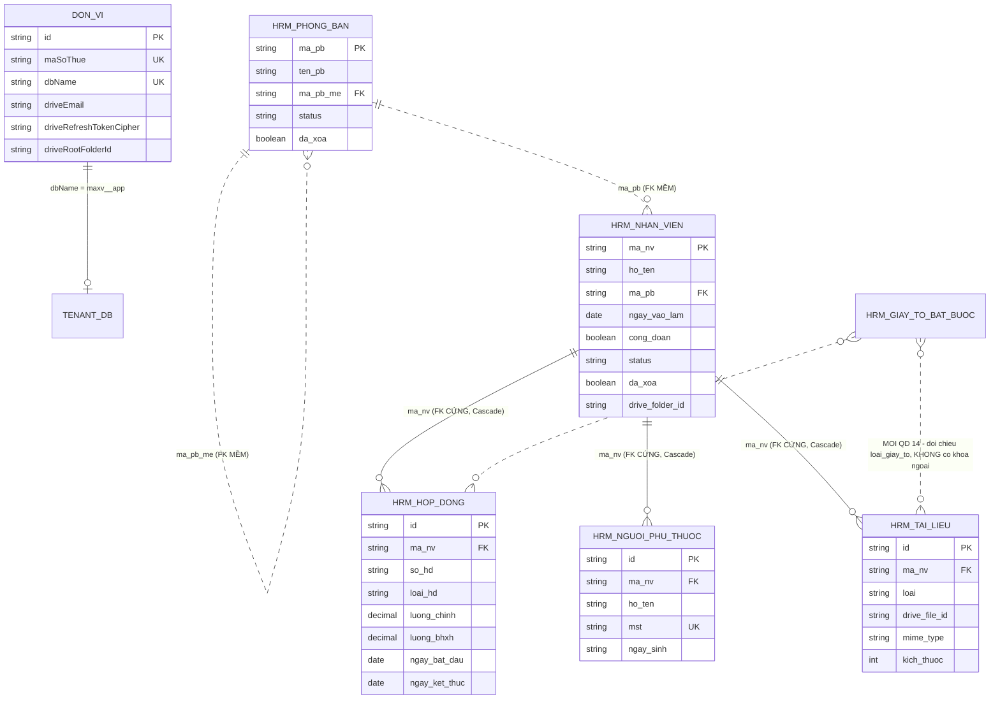

# HRM — DATA MODEL (PostgreSQL + Prisma 7, multi-tenant)

> Mọi bảng/cột/ràng buộc dưới đây được **trích từ schema thật**, kèm `file:line`. Phần
> "chưa có ở tầng DB" nằm riêng ở Mục 7–8 và chỉ là **ĐỀ XUẤT** — vòng thiết kế này
> **KHÔNG chạy migration**.

**Cập nhật 2026-09-07 (đợt chốt nghiệp vụ 16/16).** Ba việc thay đổi so với bản trước:
> 1. **Hai migration hết trạng thái chờ BA:** M-07 (`so_hd` duy nhất) mở khóa bởi QĐ #4, M-09 (mã số thuế người phụ thuộc duy nhất toàn tenant) mở khóa bởi QĐ #7. **Hai cái này phải gộp chung MỘT đợt rà dữ liệu** — cùng kiểu rủi ro, cùng cần dừng dịch vụ, rà hai lần là phiền khách hai lần.
> 2. **M-01 đổi khóa loại trừ**: thêm `loai_hd` theo QĐ #1, vì hai hợp đồng khác loại giờ được phép chạy song song.
> 3. **Ba thay đổi cấu trúc mới**: cột `ngay_nghi_viec` (QĐ #3), cột `ngay_het_han` (QĐ #14) và bảng `hrm_giay_to_bat_buoc` (QĐ #14). Xem M-10, M-11, M-12.
>
> Nguồn nghiệp vụ: `docs/hrm/srs/hrm-spec.md` Mục 5 và `docs/hrm/CONTEXT_SUMMARY.md` Mục 6.1.

---

## 1. Phân vùng dữ liệu (bảng nào ở DB nào)

| Vùng | File schema | Database vật lý | Bảng liên quan HRM |
|:---|:---|:---|:---|
| **Control plane (sys)** | `be_maxv/prisma/sys/schema.prisma` | `maxv2_sys` (1 DB duy nhất) | `don_vi` (model `DonVi`), `don_vi_access`, `users`, `subscriptions` |
| **Tenant (mỗi công ty 1 DB)** | `be_maxv/prisma/tenant/schema.prisma` | `maxv_<MST>_app` | `hrm_phong_ban`, `hrm_nhan_vien`, `hrm_hop_dong`, `hrm_nguoi_phu_thuoc`, `hrm_tai_lieu` |

- Tên DB tenant lấy từ `don_vi.dbName` (`sys/schema.prisma:108`, `@unique`), format `maxv_<MST>_app`.
- Kết nối tenant: `getTenantDb(dbName)` → `PrismaPg(tenantUrl(dbName), { schema: 'public' })`
  (`helpers/tenantClient.ts:28-38`), pool cache theo `dbName`, tự đóng sau 10 phút không dùng.
- **Không có cột `tenant_id` trong bảng `hrm_*`** — cô lập bằng **DB riêng**, không bằng cột lọc.
  Hệ quả: không có nguy cơ quên `WHERE tenant_id = ?`, nhưng cũng **không** truy vấn chéo công ty được.
  Xem `ADR-006`.

> ⚠️ Tài liệu cũ ghi DB tenant là `db_<MST>`. Đúng phải là **`maxv_<MST>_app`** (`utils/dbName.ts`,
> comment `sys/schema.prisma:108`).

---

## 2. `don_vi` (DB `maxv2_sys`) — phần liên quan HRM

Model Prisma: `DonVi` (`sys/schema.prisma:60-119`), `@@map("don_vi")`.

| Cột | Kiểu | Null | Ràng buộc | Nghĩa |
|:---|:---|:---:|:---|:---|
| `id` | `String` | Không | **PK**, `@default(uuid())` | Định danh công ty |
| `maSoThue` | `String` | Không | **`@unique`** | MST — 1 MST = 1 công ty |
| `slug` | `String` | Không | `@unique` | |
| `tenDonVi` | `String` | Không | | Dùng dựng tên thư mục Drive |
| `dbName` | `String?` | **Có** | **`@unique`** | `maxv_<MST>_app`; `null` = chưa provisioning xong |
| `status` | `TenantStatus` | Không | `@default(PROVISIONING)` | `ARCHIVED` bị loại khỏi mọi truy vấn quyền |
| `ownerId` | `String` | Không | **FK** → `User.id`, `onDelete: Cascade` | |
| `driveEmail` | `String?` | Có | | Tài khoản Google đang kết nối |
| `driveRootFolderId` | `String?` | Có | | ID thư mục `maxv/<MST> - <tên>`; lưu **ID** chứ không tra theo tên |
| `driveRefreshTokenCipher` | `String?` | Có | | Refresh token **AES-256-GCM** (base64) |
| `driveRefreshTokenIv` | `String?` | Có | | IV 12 byte (base64) |
| `driveRefreshTokenTag` | `String?` | Có | | GCM auth tag (base64) |

**Bất biến (giữ ở tầng service, KHÔNG có CHECK ở DB):** 3 cột `driveRefreshToken*` luôn **cùng null
hoặc cùng có giá trị**. Ghi ở `luuKetNoiDrive` (`taiLieuDrive.service.ts:109-120`), xóa ở
`ngatKetNoiDrive` (`:163-175`). Đọc mà thiếu bất kỳ cột nào ⇒ coi như chưa kết nối (`:193-199`).

**Index:** `@@index([ownerId])`. `maSoThue`, `slug`, `dbName` có unique index ngầm.

> ⚠️ Tài liệu cũ ghi kiểu `VarChar(64)` / `VarChar(32)` / `Text` cho các cột này. Schema thật
> **không khai `@db.VarChar` nào** cho `DonVi` ⇒ Postgres dùng `text`. Đã sửa ở bảng trên.

---

## 3. `hrm_phong_ban` (DB tenant)

`tenant/schema.prisma:835-852`

| Cột | Kiểu Prisma | Kiểu Postgres | Null | Default | Nghĩa |
|:---|:---|:---|:---:|:---|:---|
| `ma_pb` | `String @id` | `varchar(24)` | Không | — | **PK**. `PB01`, `PB01.01`… |
| `ten_pb` | `String` | `varchar(254)` | Không | — | |
| `ma_pb_me` | `String?` | `varchar(24)` | Có | `null` | Phòng ban cha. `null` = gốc |
| `ghi_chu` | `String?` | `varchar(512)` | Có | `null` | |
| `status` | `String` | `varchar(1)` | Không | `'1'` | `1` hoạt động, `0` ngừng |
| `da_xoa` | `Boolean` | `boolean` | Không | `false` | **Xóa mềm** |
| `datetime0` | `DateTime` | `timestamp(3)` | Không | `now()` | Ngày tạo |
| `datetime2` | `DateTime` | `timestamp(3)` | Không | `now()` | Ngày sửa — **`@default(now())`, KHÔNG phải `@updatedAt`**; service phải tự gán `datetime2: new Date()` mỗi lần update |

**Index:** `@@index([ma_pb_me])` (`:851`) + PK index trên `ma_pb`.

**Ràng buộc THIẾU ở tầng DB (cố ý, xử lý ở service):**

| Ràng buộc | Nơi thực thi hiện tại | Rủi ro nếu ghi ngoài service |
|:---|:---|:---|
| `ma_pb_me` phải tồn tại | `assertPhongBanMeHopLe` (`phongBan.service.ts:65-81`) | Cây trỏ vào mã không tồn tại |
| `ma_pb_me != ma_pb` | `:70-72` | Nút tự trỏ vào mình |
| Không tạo chu trình A→B→A | `assertKhongVongLap` (`:89-110`) | Truy vấn đệ quy treo |
| Không xóa khi còn con / còn NV | `deletePhongBan` (`:239-262`) | Tham chiếu chết |

> **Vì sao không đặt FK tự tham chiếu `ma_pb_me` → `ma_pb`?** Schema chọn tham chiếu **mềm** cho
> cặp `hrm_phong_ban.ma_pb_me` và `hrm_nhan_vien.ma_pb` (comment `phongBan.validator.ts:46-50`).
> Đề xuất bổ sung FK: Mục 8, M-04.

---

## 4. `hrm_nhan_vien` (DB tenant)

`tenant/schema.prisma:855-918`

| Cột | Kiểu Prisma | Kiểu Postgres | Null | Default | Ghi chú |
|:---|:---|:---|:---:|:---|:---|
| `ma_nv` | `String @id` | `varchar(24)` | Không | — | **PK**, `NV0001`… hoặc mã người dùng tự đặt |
| `ho_ten` | `String` | `varchar(254)` | Không | — | |
| `ngay_sinh` | `DateTime?` | `date` | Có | `null` | |
| `so_cccd` | `String?` | `varchar(20)` | Có | `null` | **KHÔNG unique** — hồ sơ nhập dần, nhiều NV chưa có CCCD (`:861`) |
| `mst_ca_nhan` | `String?` | `varchar(20)` | Có | `null` | Soát `MST_REGEX` ở validator, **không** ràng buộc DB |
| `dien_thoai` | `String?` | `varchar(20)` | Có | `null` | |
| `email` | `String?` | `varchar(254)` | Có | `null` | **KHÔNG unique** |
| `dia_chi` | `String?` | `varchar(500)` | Có | `null` | |
| `gioi_tinh` | `String?` | `varchar(8)` | Có | `null` | `nam`\|`nu`\|`khac` — enum **chỉ ở Zod**, DB không ép |
| `ma_pb` | `String?` | `varchar(24)` | Có | `null` | Tham chiếu **mềm** tới `hrm_phong_ban.ma_pb` |
| `chuc_vu` | `String?` | `varchar(100)` | Có | `null` | Chữ tự do |
| `cap_bac` | `String?` | `varchar(64)` | Có | `null` | Chữ tự do |
| `ngay_vao_lam` | `DateTime` | `date` | **Không** | — | Ngày vào làm **ĐẦU TIÊN**, không đổi khi ký HĐ mới |
| `mien_cham_cong` | `Boolean` | `boolean` | Không | `false` | |
| `cong_doan` | `Boolean` | `boolean` | Không | `true` | Bị service ép `false` **một chiều** khi ký HĐ khoán |
| `so_tai_khoan` | `String?` | `varchar(30)` | Có | `null` | |
| `ten_tai_khoan` | `String?` | `varchar(100)` | Có | `null` | |
| `ngan_hang` | `String?` | `varchar(128)` | Có | `null` | Chữ tự do (danh sách chỉ gợi ý ở FE) |
| `ghi_chu` | `String?` | `varchar(2000)` | Có | `null` | |
| `status` | `String` | `varchar(1)` | Không | `'1'` | `1` đang làm, `0` đã nghỉ |
| `da_xoa` | `Boolean` | `boolean` | Không | `false` | **Xóa mềm** — tách khỏi `status` |
| `datetime0` / `datetime2` | `DateTime` | `timestamp(3)` | Không | `now()` | `datetime2` **không** tự cập nhật |
| `drive_folder_id` | `String?` | `varchar(64)` | Có | `null` | ID thư mục Drive riêng, tạo lười lúc tải file đầu tiên |

**Index:** `@@index([ma_pb])` (`:916`), `@@index([so_cccd])` (`:917`), PK trên `ma_nv`.

**Quan hệ con (Prisma `1-N`, đều có FK cứng, đều `onDelete: Cascade, onUpdate: Cascade`):**
`nguoi_phu_thuoc`, `tai_lieu`, `hop_dong` (`:912-914`).

### 4.1. Vì sao KHÔNG còn 7 cột bản sao hợp đồng

Các cột `so_hop_dong`, `loai_hop_dong`, `kieu_luong`, `ngay_hieu_luc_toi`, `bhxh`, `tncn`
(và `luong_chinh`) **đã bỏ 2026-09-05** (`:872-881`). Hai lý do trong comment schema:

1. "Hiện hành" phụ thuộc **ngày hôm nay**, mà bản sao chỉ được tính lại khi có người **ghi** hợp
   đồng — hợp đồng ký trước cho tương lai, tới ngày hiệu lực không có thao tác ghi nào để cập nhật.
2. Form nhân viên ghi thẳng vào mấy cột đó, âm thầm đè giá trị suy ra từ hợp đồng.

Thay thế: `hopDongHienHanhTheoNv()` tính lúc đọc (`hopDong.service.ts:124-149`).

> 🚨 **Comment lỗi thời cần sửa (Backend):** docblock của model `hrm_hop_dong`
> (`tenant/schema.prisma:956-959`) vẫn viết *"QUAN HỆ VỚI 7 CỘT HỢP ĐỒNG TRÊN `hrm_nhan_vien`:
> bảng này là NGUỒN SỰ THẬT, mấy cột kia là BẢN SAO… Mọi đường ghi vào bảng này BẮT BUỘC gọi
> `dongBoHopDongHienHanh()` ở cuối, trong cùng transaction"*.
> **Đã kiểm chứng:** 7 cột đó không còn (`:872-881`), và hàm `dongBoHopDongHienHanh` **không tồn
> tại ở bất kỳ đâu trong repo**. Comment này mâu thuẫn trực tiếp với `:875-876` cách đó 80 dòng và
> sẽ khiến dev tiếp theo đi tìm một hàm không có. Tương tự, docblock `hrm_tai_lieu` (`:1000-1002`)
> nói *"Giai đoạn này CHỈ lưu thông tin giấy tờ nhập tay… lúc đó thêm cột con trỏ"* trong khi các
> cột `drive_file_id`/`ten_file`/`mime_type`/`kich_thuoc` **đã có** ngay dưới đó (`:1010-1013`).
> Đề xuất: M-08 (Mục 8) — sửa comment, **không đổi cấu trúc**.

---

## 5. `hrm_hop_dong` (DB tenant)

`tenant/schema.prisma:960-990`

| Cột | Kiểu Prisma | Kiểu Postgres | Null | Default | Ghi chú |
|:---|:---|:---|:---:|:---|:---|
| `id` | `String @id` | `varchar(64)` | Không | — | **PK**, UUID sinh ở service (`randomUUID()`) |
| `ma_nv` | `String` | `varchar(24)` | Không | — | **FK** → `hrm_nhan_vien.ma_nv` |
| `so_hd` | `String` | `varchar(100)` | Không | — | **KHÔNG unique** |
| `loai_hd` | `String` | `varchar(24)` | Không | — | **Chữ tự do**, không enum. 5 giá trị gợi ý ở FE |
| `kieu_luong` | `String` | `varchar(8)` | Không | — | `gross`\|`net` — enum chỉ ở Zod |
| `luong_chinh` | `Decimal` | `numeric(18,2)` | Không | `0` | Lương thỏa thuận của **chính hợp đồng này** |
| `luong_bhxh` | `Decimal` | `numeric(18,2)` | Không | `0` | Mức đóng BHXH |
| `ngay_bat_dau` | `DateTime` | `date` | **Không** | — | |
| `ngay_ket_thuc` | `DateTime?` | `date` | Có | `null` | **`null` = không xác định thời hạn** |
| `trich_bhxh` | `Boolean` | `boolean` | Không | `true` | |
| `tinh_tncn` | `Boolean` | `boolean` | Không | `true` | |
| `ghi_chu` | `String?` | `varchar(512)` | Có | `null` | |
| `datetime0` / `datetime2` | `DateTime` | `timestamp(3)` | Không | `now()` | `datetime0` **được dùng làm tiêu chí sắp xếp phụ**, xem dưới |

**FK:** `nhan_vien` → `hrm_nhan_vien.ma_nv`, `onDelete: Cascade`, `onUpdate: Cascade` (`:987`).
**Index:** `@@index([ma_nv])` (`:989`), PK trên `id`.

### 5.1. Thứ tự sắp xếp chuẩn (KHÔNG được đổi tùy tiện)

`sapXepHopDong = [{ngay_bat_dau: desc}, {datetime0: desc}, {id: desc}]` (`hopDong.service.ts:114-118`).

`ngay_bat_dau` **không duy nhất** — hai hợp đồng cùng ngày bắt đầu là chuyện tạo được. Sắp theo mỗi
`ngay_bat_dau` thì Postgres trả thứ tự tùy ý, và MVCC còn đẩy dòng vừa sửa xuống cuối heap: **sửa
mỗi ô ghi chú của hợp đồng B cũng đủ làm "hợp đồng hiện hành" nhảy từ A sang B**. Hai tiêu chí phụ
là để kết quả **ổn định**, không phải trang trí.

### 5.2. Chỉ mục hỗ trợ truy vấn "hợp đồng hiện hành"

Truy vấn nóng nhất (`hopDongHienHanhTheoNv`): `WHERE ma_nv IN (...) ORDER BY ngay_bat_dau DESC,
datetime0 DESC, id DESC`. Index hiện tại `([ma_nv])` chỉ giúp lọc, **không** giúp sắp xếp.
Đề xuất index phủ: M-05 (Mục 8).

### 5.3. Chồng lấn khoảng ngày — HIỆN KHÔNG CÓ RÀNG BUỘC NÀO

> **Mức đã chốt (QĐ #1 + QĐ #6, BR-hrm-022 và BR-hrm-026):** chống chồng lấn kiểm theo **cặp (`ma_nv`, `loai_hd`)**, không phải chỉ `ma_nv` — một hợp đồng lao động chính và một hợp đồng khoán được phép chạy song song. Khoảng ngày dùng kiểu **đóng ở cả hai đầu** `'[]'`, vì hợp đồng đúng một ngày (bắt đầu trùng kết thúc) giờ là hợp lệ; dùng khoảng nửa mở thì hợp đồng một ngày có độ dài bằng không và lọt qua mọi phép kiểm giao cắt.

| Lớp | Trạng thái |
|:---|:---|
| Zod validator | Chỉ soát `ngay_ket_thuc > ngay_bat_dau` **trong cùng 1 bản ghi** (`hopDong.validator.ts:67-78`) và `ngay_bat_dau > ngay_chot` ở `/doi` (`:105-111`) |
| Service pre-check | ❌ **Không có** ở `createHopDong` (`:185-193`) và `updateHopDong` (`:196-218`) |
| Ràng buộc DB | ❌ **Không có** |

Hệ quả đo được: tạo `NV0001` với `[2026-01-01, 2026-03-31]` rồi tạo tiếp `[2026-02-15, 2026-05-15]`
đều trả **201**. Vi phạm `BR-03.3`. Xem `ADR-002` và migration đề xuất M-01/M-02.

---

## 6. `hrm_nguoi_phu_thuoc` và `hrm_tai_lieu` (DB tenant)

### 6.1. `hrm_nguoi_phu_thuoc` — `tenant/schema.prisma:923-951`

| Cột | Kiểu Prisma | Kiểu Postgres | Null | Ghi chú |
|:---|:---|:---|:---:|:---|
| `id` | `String @id` | `varchar(64)` | Không | **PK**, UUID |
| `ma_nv` | `String` | `varchar(24)` | Không | **FK** → `hrm_nhan_vien` |
| `ho_ten` | `String` | `varchar(200)` | Không | Họ tên NGƯỜI PHỤ THUỘC |
| `quan_he` | `String?` | `varchar(50)` | Có | Chữ tự do (ông bà, cháu… vẫn hợp lệ theo luật TNCN) |
| `ngay_sinh` | `String?` | `varchar(10)` | Có | **Kiểu CHỮ `dd/MM/yyyy`**, KHÔNG parse Date — hồ sơ NPT nhiều khi chỉ nhớ áng chừng |
| `so_cccd` | `String?` | `varchar(20)` | Có | |
| `mst` | `String?` | `varchar(20)` | Có | MST cá nhân của người phụ thuộc |
| `dien_thoai` | `String?` | `varchar(20)` | Có | |
| `dia_chi` | `String?` | `varchar(255)` | Có | |
| `dk_tu_thang`, `dk_den_thang` | `Int?` | `integer` | Có | 1..12 — **chỉ Zod soát**, DB không CHECK |
| `dk_tu_nam`, `dk_den_nam` | `Int?` | `integer` | Có | 2000..2100 — chỉ Zod soát |
| `datetime0` / `datetime2` | `DateTime` | `timestamp(3)` | Không | |

**FK:** `onDelete: Cascade, onUpdate: Cascade` (`:943`).
**Unique:** **`@@unique([ma_nv, mst])`** (`:949`) — đây là ràng buộc nghiệp vụ **cứng duy nhất** của
cả module HRM. Trùng ⇒ tính giảm trừ gia cảnh hai lần ⇒ **sai thuế TNCN mà không có gì báo**.
Postgres coi mỗi `NULL` là khác nhau ⇒ hồ sơ chưa có MST vẫn nhập được nhiều dòng (đúng ý).
**Index:** `@@index([ma_nv])` (`:950`).

**KHÔNG lưu `ten_nv`** — join lúc đọc từ `hrm_nhan_vien` (`nguoiPhuThuoc.service.ts:74-82`), tránh
dữ liệu trùng lặp lệch khi nhân viên đổi tên.

### 6.2. `hrm_tai_lieu` — `tenant/schema.prisma:998-1026`

| Cột | Kiểu Prisma | Kiểu Postgres | Null | Ghi chú |
|:---|:---|:---|:---:|:---|
| `id` | `String @id` | `varchar(64)` | Không | **PK**, UUID |
| `ma_nv` | `String` | `varchar(24)` | Không | **FK** → `hrm_nhan_vien` |
| `loai` | `String` | `varchar(50)` | Không | **Chữ tự do**: `cccd`, `ho_chieu`, `bang_cap`, `chung_chi`, `so_yeu_ly_lich`… Cố ý không enum (hồ sơ thật còn giấy khám sức khỏe, sổ BHXH, quyết định bổ nhiệm…) |
| `so_hieu` | `String?` | `varchar(64)` | Có | `null` vì có loại không mang số hiệu |
| `ngay_cap` | `DateTime?` | `date` | Có | |
| `noi_cap` | `String?` | `varchar(254)` | Có | |
| `ghi_chu` | `String?` | `varchar(512)` | Có | |
| `drive_file_id` | `String?` | `varchar(64)` | Có | Con trỏ file trên Drive công ty. `null` = chưa đính file |
| `ten_file` | `String?` | `varchar(254)` | Có | Lưu để danh sách hiện được mà không gọi Drive từng dòng |
| `mime_type` | `String?` | `varchar(128)` | Có | |
| `kich_thuoc` | `Int?` | `integer` | Có | Byte |
| `datetime0` / `datetime2` | `DateTime` | `timestamp(3)` | Không | |

**FK:** `onDelete: Cascade, onUpdate: Cascade` (`:1023`). **Index:** `@@index([ma_nv])` (`:1025`).

**Bất biến (service giữ, DB không):** 4 cột `drive_file_id`/`ten_file`/`mime_type`/`kich_thuoc`
luôn cùng `null` hoặc cùng có giá trị (`dinhKemFile` `:351-360`, `goFile` `:421-430`).

---

## 7. Xóa mềm, cascade, và mâu thuẫn giữa hai cơ chế

### 7.1. Bảng nào xóa mềm, bảng nào xóa cứng

| Bảng | Cơ chế | Lý do | Bằng chứng |
|:---|:---|:---|:---|
| `hrm_phong_ban` | **Mềm** (`da_xoa`) | `ma_pb` đã nằm trên chứng từ kế toán; cấp lại mã = gán lịch sử đơn vị này sang đơn vị khác | `phongBan.service.ts:264-267` |
| `hrm_nhan_vien` | **Mềm** (`da_xoa`) | Bảng lương/chấm công khóa theo `ma_nv`; cấp lại = gán dữ liệu người cũ cho người mới | `nhanVien.service.ts:238-241` |
| `hrm_hop_dong` | **Cứng** | PK là UUID, không có chuyện cấp lại mã | `hopDong.service.ts:290` |
| `hrm_nguoi_phu_thuoc` | **Cứng** | như trên | `nguoiPhuThuoc.service.ts:165` |
| `hrm_tai_lieu` | **Cứng** | như trên | `taiLieu.service.ts:133` |

`da_xoa` **tách khỏi `status`** một cách cố ý (`:900-903`): "đã nghỉ việc" là dữ liệu nhân sự thật
(còn quyết toán thuế, còn trong báo cáo), khác hẳn "nhập nhầm nên xóa". Gộp chung thì người nhập
nhầm nằm lại trong báo cáo nhân sự mãi mãi.

### 7.2. `onDelete: Cascade` có mâu thuẫn với xóa mềm không?

**Không mâu thuẫn, nhưng dễ hiểu nhầm — phải nói rõ:**

- `onDelete: Cascade` chỉ chạy khi có `DELETE` **thật** trên `hrm_nhan_vien`. API HRM
  **không bao giờ** phát lệnh đó (chỉ `UPDATE da_xoa = true`) ⇒ **cascade thực tế không bao giờ
  kích hoạt qua API**.
- Việc "ẩn theo" là do **mọi truy vấn con đều lọc `nhan_vien: { da_xoa: false }`**:
  `hopDong.service.ts:172-174`, `nguoiPhuThuoc.service.ts:59-61`, `taiLieu.service.ts:55-57`,
  và cả trong `findFirst` của update/delete từng bản ghi con.
- Cascade vẫn **cần giữ**: nó là lưới an toàn cho các đường xóa cứng ngoài API (script dọn dữ liệu,
  `DROP`/`DELETE` thủ công, xóa công ty), và nó thực thi được **ở mọi đường ghi**, không chỉ đường
  đi qua service.

**Rủi ro thật của mô hình này (phải biết):**

| # | Rủi ro | Hệ quả | Xử lý |
|:---:|:---|:---|:---|
| R1 | Ẩn-theo phụ thuộc **kỷ luật code**: thêm 1 truy vấn mới mà quên `nhan_vien: { da_xoa: false }` là lộ dữ liệu hồ sơ đã xóa | Rò dữ liệu im lặng | Quy ước bắt buộc ở `dev-notes.md`; đề xuất helper `chuaXoa()` dùng chung |
| R2 | `so_npt` ở `GET /nhan-vien` đếm NPT **không** lọc gì (`nhanVien.service.ts:113`) — nhưng vì chỉ map cho nhân viên chưa xóa nên không lộ | Không | Đã an toàn |
| R3 | **File Drive không bị dọn** khi xóa mềm nhân viên **và** khi xóa cứng tài liệu | File mồ côi vĩnh viễn trên Drive khách | `ADR-004` |
| R4 | Không có đường nào **khôi phục** bản ghi đã xóa mềm (không có API, không có màn hình) | Xóa nhầm = phải vào DB | Đề xuất: endpoint khôi phục hoặc chấp nhận có chủ ý (OQ) |
| R5 | Xóa cứng nhân viên bằng tay ở DB sẽ **cuốn theo toàn bộ hợp đồng** (dữ liệu lương lịch sử) mà không cảnh báo | Mất dữ liệu quyết toán | Cấm xóa cứng; ghi vào `dev-notes.md` |

---

## 8. Ràng buộc còn thiếu & MIGRATION ĐỀ XUẤT

> ⚠️ **KHÔNG chạy migration ở vòng này.** Toàn bộ mục này là đề xuất để BA/Backend duyệt.

### 8.0. Cơ chế áp ràng buộc cho DB tenant — SỬA 2026-09-07

> **Bản trước mô tả sai cơ chế** và mọi runbook bên dưới từng dựa vào đó. Bản cũ viết *"phải `prisma migrate dev --create-only` rồi thêm SQL tay vào `migration.sql`"* — cách đó chỉ áp dụng cho **control plane**, không áp dụng cho tenant.

**Sự thật đã kiểm chứng:**

| | Control plane | Tenant |
|:---|:---|:---|
| Thư mục migration | `be_maxv/prisma/sys/migrations/` **có** | `be_maxv/prisma/tenant/` **chỉ có `schema.prisma`** — không có `migrations/` |
| Cách áp schema | `prisma migrate deploy` (`package.json` scripts `migrate:sys*`) | `prisma db push --accept-data-loss`, chạy vòng lặp qua từng `DonVi.dbName` (`src/scripts/sync-tenants.ts:36-38`) và lúc cấp DB mới (`src/services/shared/provisioning.service.ts:72-79`) |
| Có lịch sử migration không | Có | **Không** — `db push` chỉ đồng bộ trạng thái, không ghi vết |

**Hệ quả bắt buộc cho M-01, M-07, M-09, M-10, M-11, M-12:**

1. **Không có `migration.sql` nào để chèn SQL tay.** `EXCLUDE`, `CHECK`, `CREATE EXTENSION` phải nằm trong một **script riêng** chạy **sau** mỗi lần `db push`, ví dụ `src/scripts/apply-hrm-constraints.ts`, lặp qua `DonVi.dbName` giống hệt `sync-tenants.ts`.

2. **Script phải idempotent.** `db push` chạy lại bất cứ lúc nào, nên script áp ràng buộc phải chịu được việc chạy nhiều lần: `CREATE EXTENSION IF NOT EXISTS`, `CREATE INDEX IF NOT EXISTS`, và với `ALTER TABLE … ADD CONSTRAINT` thì bắt SQLSTATE `42710` (duplicate_object) rồi bỏ qua.

3. **Phải đo xem `db push` có xóa ràng buộc tay hay không — TRƯỚC khi đặt cược vào lớp phòng thủ DB.** Prisma quản lý index và unique constraint theo `schema.prisma`, nên thứ nó không biết rất có thể bị drop ở lần push kế tiếp. `EXCLUDE`/`CHECK` thì Prisma không mô tả được, khả năng cao được giữ, **nhưng đây là suy luận chưa đo**. Bắt buộc chạy thử trên một DB tenant nháp: áp ràng buộc → `db push` lại → kiểm `pg_constraint`. Nếu bị xóa thì `ADR-002` mất lớp phòng thủ thứ hai và phải đổi phương án.

4. **Tenant MỚI hiện sẽ không có ràng buộc nào.** `provisionTenant` chỉ `CREATE DATABASE` + `db push`, **không** `CREATE EXTENSION`, **không** SQL tay (`provisioning.service.ts:60-79`). Đã kiểm: các DB tenant hiện có **chưa cài `btree_gist`** (chỉ có `plpgsql`), tuy extension **có sẵn** trong `pg_available_extensions`. Phải chèn `applyTenantConstraints(dbName)` vào ngay sau `pushTenantSchema` trong cùng luồng cấp DB, lỗi thì đánh dấu công ty `FAILED` thay vì để DB nửa vời.

5. **`db push --accept-data-loss` không dừng lại hỏi.** Với các cột mới ở M-10/M-11 thì vô hại (thêm cột nullable), nhưng đây là lý do **không** được dùng `db push` để đổi kiểu hay bỏ cột ở tenant có dữ liệu thật.

| Mã | Ràng buộc / thay đổi | Bảng | Mức | ADR |
|:---|:---|:---|:---:|:---|
| **M-01** | `EXCLUDE USING gist` chống chồng lấn hợp đồng theo cặp (`ma_nv`, **nhóm nghiệp vụ**) | `hrm_hop_dong` | 🚨 Cao | `ADR-002` |
| **M-02** | Index phục vụ pre-check chồng lấn | `hrm_hop_dong` | 🚨 Cao | `ADR-002` |
| **M-03** | Cột audit `user_id0` / `user_id2` | 5 bảng `hrm_*` | ⚠️ TB | `ADR-004` |
| **M-04** | FK cứng `ma_pb` / `ma_pb_me` | `hrm_nhan_vien`, `hrm_phong_ban` | ℹ️ Thấp | — |
| **M-05** | Index phủ cho truy vấn hợp đồng hiện hành | `hrm_hop_dong` | ⚠️ TB | `ADR-002` |
| **M-06** | Index lọc theo `da_xoa`/`status` | `hrm_nhan_vien` | ℹ️ Thấp | — |
| **M-07** | `@@unique([so_hd])` | `hrm_hop_dong` | 🚨 Cao — ✅ **đã chốt QĐ #4** | BR-hrm-056 |
| **M-08** | Sửa comment lỗi thời trong schema | `hrm_hop_dong`, `hrm_tai_lieu` | ⚠️ TB (nợ tài liệu) | — |
| **M-09** | `EXCLUDE USING gist` trên (`mst`, **khoảng kỳ giảm trừ**) | `hrm_nguoi_phu_thuoc` | 🚨 Cao — ✅ **đã chốt QĐ #7 + #19** | BR-hrm-030 |
| **M-10** | Cột `ngay_nghi_viec` | `hrm_nhan_vien` | 🚨 Cao — ✅ **đã chốt QĐ #3** | BR-hrm-054 |
| **M-11** | Cột `ngay_het_han` | `hrm_tai_lieu` | ⚠️ TB — ✅ **đã chốt QĐ #14** | BR-hrm-062 |
| **M-12** | Bảng mới `hrm_giay_to_bat_buoc` | tenant (bảng thứ 6) | ⚠️ TB — ✅ **đã chốt QĐ #14** | BR-hrm-063 |
| **M-13** | Cột `xemLuong` trên `DonViAccess` | **`maxv2_sys`** (control plane) | 🚨 Cao — ✅ **đã chốt QĐ #8** | `ADR-007` |
| **M-14** | Bảng con `hrm_tai_lieu_file`, bỏ 4 cột con trỏ file khỏi `hrm_tai_lieu` | tenant | 🚨 Cao — ✅ **đã chốt QĐ #21** | BR-hrm-037 |

> **Thứ tự bắt buộc:** M-07 và M-09 **đi chung một đợt**. Cả hai đều là ràng buộc duy nhất áp lên dữ liệu đang chạy, cả hai đều làm migration **fail** nếu tenant đã có dữ liệu trùng, và cả hai đều cần rà + dọn tay + báo khách trước. Tách ra làm hai lần là bắt khách dừng dịch vụ hai lần cho cùng một loại việc.
>
> M-01 phải đi cùng lượt với việc thay `setUTCHours` bằng `homNayVN()` trong `doiHopDong` (BUG-HRM-07). Sửa một trong hai thì hai hàm bất đồng bảy tiếng mỗi ngày.

### M-01 — `EXCLUDE USING gist` (chống chồng lấn hợp đồng)

```sql
-- Extension chuẩn trong contrib của PostgreSQL, cần để dùng toán tử `=` trên cột
-- varchar bên trong index GiST.
CREATE EXTENSION IF NOT EXISTS btree_gist;

-- Một nhân viên KHÔNG được có 2 hợp đồng giao nhau về khoảng ngày.
-- ngay_ket_thuc NULL = vô thời hạn -> quy về 'infinity'.
-- Kiểu khoảng '[]' (đóng hai đầu): hợp đồng cũ kết thúc 31/03 và hợp đồng mới bắt đầu
-- 31/03 BỊ COI LÀ CHỒNG LẤN — đúng nghiệp vụ (một ngày không thuộc hai hợp đồng).
-- SỬA THEO QĐ #1, #6 và #18 (BR-hrm-022): khóa loại trừ gồm NHÓM nghiệp vụ, KHÔNG phải
-- nhãn `loai_hd` thô. Lý do: `loai_hd` là chữ tự do và ba nhãn (khong_xac_dinh / xac_dinh /
-- thoi_vu) đều thuộc CÙNG một nhóm hợp đồng lao động — khóa theo nhãn thì một người có ba
-- hợp đồng lao động chồng nhau, mỗi cái một nhãn, và Payroll cộng ba mức lương (BUG-HRM-27).
CREATE OR REPLACE FUNCTION hrm_nhom_hd(loai text)
RETURNS text LANGUAGE sql IMMUTABLE AS $$
  SELECT CASE lower(btrim(loai))
           WHEN 'thu_viec' THEN 'thu_viec'
           WHEN 'khoan'    THEN 'hdvc'
           ELSE 'hdld'
         END;
$$;

ALTER TABLE "hrm_hop_dong" ADD CONSTRAINT "hrm_hop_dong_khong_chong_lan"
  EXCLUDE USING gist (
    "ma_nv" WITH =,
    hrm_nhom_hd("loai_hd") WITH =,
    daterange("ngay_bat_dau", COALESCE("ngay_ket_thuc", 'infinity'::date), '[]') WITH &&
  );
```

> ✅ **Đã chạy thật trên PostgreSQL (2026-09-07), toàn bộ trong một giao dịch rồi ROLLBACK — không ghi gì vào cơ sở dữ liệu.** Kết quả: cú pháp `EXCLUDE USING gist` với **biểu thức hàm** làm phần tử khóa là hợp lệ; và ba hành vi nghiệp vụ đúng như thiết kế — hợp đồng khoán chạy song song hợp đồng lao động **được nhận**; hợp đồng `xac_dinh` chồng hợp đồng `khong_xac_dinh` **bị chặn** (cùng nhóm); nhãn `Khoan` viết hoa chồng `khoan` **vẫn bị chặn**, vì `hrm_nhom_hd` đã `lower(btrim(...))` bên trong. Nghĩa là ràng buộc ở tầng cơ sở dữ liệu **an toàn ngay cả trước khi** tầng kiểm dữ liệu được sửa để chuẩn hóa — việc chuẩn hóa vẫn nên làm, nhưng để dữ liệu lưu sạch chứ không phải để bịt lỗ.

**Bắt buộc làm trước khi áp:** quét dữ liệu đang có, vì constraint sẽ **từ chối tạo** nếu đã tồn
tại dòng vi phạm (rất có thể có, do code chưa bao giờ chặn):

```sql
-- Chạy trên TỪNG DB tenant. Trả về các cặp hợp đồng đang chồng lấn.
SELECT a.ma_nv, a.id AS id_a, a.so_hd AS hd_a, a.ngay_bat_dau, a.ngay_ket_thuc,
       b.id AS id_b, b.so_hd AS hd_b, b.ngay_bat_dau, b.ngay_ket_thuc
FROM hrm_hop_dong a
JOIN hrm_hop_dong b
  ON a.ma_nv = b.ma_nv AND hrm_nhom_hd(a.loai_hd) = hrm_nhom_hd(b.loai_hd) AND a.id < b.id
 AND daterange(a.ngay_bat_dau, COALESCE(a.ngay_ket_thuc, 'infinity'::date), '[]')
  && daterange(b.ngay_bat_dau, COALESCE(b.ngay_ket_thuc, 'infinity'::date), '[]')
ORDER BY a.ma_nv, a.loai_hd, a.ngay_bat_dau;
```

**Chiến lược triển khai multi-tenant** (điểm khác biệt lớn nhất so với bản tham khảo 1 DB):
migration phải chạy **trên mọi DB `maxv_<MST>_app`**. Trình tự an toàn:

1. Chạy câu quét trên **toàn bộ** tenant, xuất danh sách vi phạm cho từng công ty.
2. Bật **pre-check ở service trước** (M-01a, chỉ code, không migration) — chặn sinh thêm dữ liệu bẩn.
3. Nghiệp vụ dọn dữ liệu cũ (BA/kế toán quyết cách chốt ngày), tenant nào sạch thì áp constraint tenant đó.
4. Tenant chưa dọn xong: **hoãn** constraint, ghi lại trong sổ theo dõi. Không được để migration
   fail giữa chừng làm tenant khác không lên được.

**Mã lỗi Prisma khi vi phạm:** SQLSTATE gốc là **`23P01` (`exclusion_violation`)**. Prisma
**không** map mã này thành `P2002` — bản tham khảo đã đo thật và thấy nó về dưới dạng lỗi generic
với SQLSTATE nằm sâu trong `error.meta`. ⇒ **Bắt lỗi phải đối chiếu TÊN CONSTRAINT**
(`hrm_hop_dong_khong_chong_lan`) trong `error.message`, **không** dựa vào `error.code`. Phải có
test tích hợp thật xác nhận, không suy đoán (xem `ADR-002` Mục Hệ quả).

### M-02 / M-05 — Index cho hợp đồng

```sql
-- M-02: phục vụ pre-check chồng lấn (WHERE ma_nv = ? AND khoảng ngày giao nhau)
CREATE INDEX IF NOT EXISTS "hrm_hop_dong_ma_nv_ngay_bat_dau_idx"
  ON "hrm_hop_dong" ("ma_nv", "ngay_bat_dau");

-- M-05: phủ đúng ORDER BY của hopDongHienHanhTheoNv
CREATE INDEX IF NOT EXISTS "hrm_hop_dong_hien_hanh_idx"
  ON "hrm_hop_dong" ("ma_nv", "ngay_bat_dau" DESC, "datetime0" DESC, "id" DESC);
```

Prisma tương đương: `@@index([ma_nv, ngay_bat_dau])`. Bản `DESC` nhiều cột phải viết SQL tay.
Ghi chú: index `@@index([ma_nv])` hiện có trở thành **thừa** khi có M-02 (tiền tố trùng) — có thể
bỏ, nhưng ưu tiên **giữ lại** ở đợt này để giảm rủi ro.

### M-03 — Cột audit

```sql
ALTER TABLE "hrm_phong_ban"       ADD COLUMN "user_id0" varchar(64), ADD COLUMN "user_id2" varchar(64);
ALTER TABLE "hrm_nhan_vien"       ADD COLUMN "user_id0" varchar(64), ADD COLUMN "user_id2" varchar(64);
ALTER TABLE "hrm_hop_dong"        ADD COLUMN "user_id0" varchar(64), ADD COLUMN "user_id2" varchar(64);
ALTER TABLE "hrm_nguoi_phu_thuoc" ADD COLUMN "user_id0" varchar(64), ADD COLUMN "user_id2" varchar(64);
ALTER TABLE "hrm_tai_lieu"        ADD COLUMN "user_id0" varchar(64), ADD COLUMN "user_id2" varchar(64);
```

Nullable để không phải backfill. Helper `currentUserId(req)` (`resolveTenantDb.ts:72-74`) **đã có
sẵn**, chỉ chưa được HRM dùng. Nghiệp vụ cần: lương và giảm trừ gia cảnh là dữ liệu có thể bị sửa
lén, hiện **không truy được ai sửa**.

### M-04 — FK cứng cho phòng ban (tùy chọn)

```sql
ALTER TABLE "hrm_nhan_vien" ADD CONSTRAINT "hrm_nhan_vien_ma_pb_fkey"
  FOREIGN KEY ("ma_pb") REFERENCES "hrm_phong_ban"("ma_pb") ON DELETE RESTRICT ON UPDATE CASCADE;
ALTER TABLE "hrm_phong_ban" ADD CONSTRAINT "hrm_phong_ban_ma_pb_me_fkey"
  FOREIGN KEY ("ma_pb_me") REFERENCES "hrm_phong_ban"("ma_pb") ON DELETE RESTRICT ON UPDATE CASCADE;
```

**Trade-off:** được bảo vệ ở mọi đường ghi, nhưng vì xóa là **xóa mềm** nên `ON DELETE RESTRICT`
gần như không bao giờ kích hoạt ⇒ lợi ích thực tế chỉ là chặn `ma_pb` trỏ vào mã không tồn tại.
Phải quét dữ liệu mồ côi trước khi áp. **Ưu tiên thấp**, không chặn đợt này.

### M-09 — Người phụ thuộc: duy nhất mã số thuế CÓ XÉT KỲ giảm trừ (✅ đã chốt QĐ #7 + QĐ #19)

Ràng buộc hiện tại `@@unique([ma_nv, mst])` chỉ chặn trùng **trong cùng một nhân viên**. Hai nhân viên khác nhau vẫn khai được cùng một người phụ thuộc ⇒ giảm trừ gia cảnh tính hai lần ⇒ **sai thuế thu nhập cá nhân, không có gì cảnh báo** (`BUG-HRM-05`, 🔴 Critical).

> **Bản trước của mục này tự mâu thuẫn** và đã được sửa: bảng migration ghi "đã chốt, unique toàn tenant" trong khi thân mục vẫn giữ tiêu đề *"vì sao phải chờ BA"* rồi kết luận **"không đề xuất H1"** — tức khuyến nghị ngược với điều đã chốt, ngay trong mục đã dán nhãn đã chốt. Vòng phản biện độc lập 2026-09-07 bắt được, và **QĐ #19 giải bằng cách chọn H3**, đúng hướng mà kiến trúc vốn cho là đúng nghiệp vụ nhất.

**Chốt: H3 — ràng buộc loại trừ trên (mã số thuế, khoảng kỳ giảm trừ).** Luật thuế nói mỗi người phụ thuộc chỉ được giảm trừ cho một người nộp thuế **tại một thời điểm**; unique phẳng bỏ mất vế "tại một thời điểm" nên **chặn oan** ca chuyển người kê khai giữa năm — vợ chồng cùng công ty, hoặc người kê khai cũ đã nghỉ việc.

**Quy bốn cột tháng/năm thành khoảng ngày.** Kỳ đăng ký lưu ở `dk_tu_thang` / `dk_tu_nam` / `dk_den_thang` / `dk_den_nam` (đều nullable). Quy ước:

* Thiếu kỳ bắt đầu ⇒ coi như `-infinity`; thiếu kỳ kết thúc ⇒ `infinity`.
* Kỳ tính theo **tháng, đóng ở cả hai đầu**: kết thúc tháng 6 và bắt đầu tháng 6 là **giao nhau**, vì trong tháng đó cả hai người nộp thuế đều được giảm trừ.

```sql
CREATE EXTENSION IF NOT EXISTS btree_gist;

-- Hàm quy kỳ đăng ký thành khoảng ngày nửa mở theo tháng: [đầu tháng bắt đầu, đầu tháng sau tháng kết thúc)
-- Dùng nửa mở '[)' ở tầng ngày để diễn tả khoảng ĐÓNG ở tầng tháng.
CREATE OR REPLACE FUNCTION hrm_ky_npt(tu_thang int, tu_nam int, den_thang int, den_nam int)
RETURNS daterange LANGUAGE sql IMMUTABLE AS $$
  SELECT daterange(
    CASE WHEN tu_nam IS NULL THEN '-infinity'::date
         ELSE make_date(tu_nam, COALESCE(tu_thang, 1), 1) END,
    CASE WHEN den_nam IS NULL THEN 'infinity'::date
         ELSE (make_date(den_nam, COALESCE(den_thang, 12), 1) + interval '1 month')::date END,
    '[)'
  );
$$;

-- Hai người phụ thuộc cùng mã số thuế KHÔNG được có kỳ giảm trừ giao nhau, trong phạm vi 1 công ty.
-- Bỏ qua dòng chưa có mã số thuế (WHERE mst IS NOT NULL) — đúng ý hiện tại: chỉ chặn khi đã biết mã.
ALTER TABLE "hrm_nguoi_phu_thuoc" DROP CONSTRAINT "hrm_nguoi_phu_thuoc_ma_nv_mst_key";
ALTER TABLE "hrm_nguoi_phu_thuoc" ADD CONSTRAINT "hrm_npt_mst_khong_trung_ky"
  EXCLUDE USING gist (
    "mst" WITH =,
    hrm_ky_npt("dk_tu_thang","dk_tu_nam","dk_den_thang","dk_den_nam") WITH &&
  ) WHERE ("mst" IS NOT NULL);
```

**Quét dữ liệu vi phạm TRƯỚC — câu quét phải xét kỳ, không chỉ đếm mã số thuế:**

```sql
SELECT a.mst,
       a.ma_nv AS ma_nv_a, a.id AS id_a,
       b.ma_nv AS ma_nv_b, b.id AS id_b,
       na.da_xoa AS a_da_xoa, nb.da_xoa AS b_da_xoa
FROM hrm_nguoi_phu_thuoc a
JOIN hrm_nguoi_phu_thuoc b ON a.mst = b.mst AND a.id < b.id
JOIN hrm_nhan_vien na ON na.ma_nv = a.ma_nv
JOIN hrm_nhan_vien nb ON nb.ma_nv = b.ma_nv
WHERE a.mst IS NOT NULL
  AND hrm_ky_npt(a.dk_tu_thang,a.dk_tu_nam,a.dk_den_thang,a.dk_den_nam)
   && hrm_ky_npt(b.dk_tu_thang,b.dk_tu_nam,b.dk_den_thang,b.dk_den_nam)
ORDER BY a.mst;
```

Cột `a_da_xoa` / `b_da_xoa` là bắt buộc: BR-hrm-030 chốt **bỏ qua** dòng thuộc nhân viên đã xóa mềm, nên hai dòng vi phạm mà một bên thuộc hồ sơ đã xóa thì **không phải dọn**. Câu quét cũ chỉ `GROUP BY mst` nên vừa báo thừa (không xét kỳ) vừa báo thiếu bối cảnh (không biết dòng nào thuộc hồ sơ đã xóa).

> ⚠️ **Vế "bỏ qua nhân viên đã xóa mềm" chưa nằm được trong ràng buộc trên.** `da_xoa` ở bảng nhân viên, ràng buộc loại trừ không tham chiếu bảng khác được. Hai cách: (a) nhân bản cờ `da_xoa` xuống `hrm_nguoi_phu_thuoc` bằng trigger rồi thêm vào mệnh đề `WHERE`; (b) chấp nhận ràng buộc ở tầng cơ sở dữ liệu **chặt hơn** luật nghiệp vụ, và phép kiểm ở tầng ứng dụng mới là nơi bỏ qua hồ sơ đã xóa. **Đề xuất (b)** cho đợt này — đơn giản hơn, và hệ quả xấu nhất chỉ là một ca hiếm bị chặn kèm thông báo chung chung; đổi lại không phải nuôi trigger đồng bộ. Ghi thành nợ kỹ thuật.

> ✅ **Đã chạy thật trên PostgreSQL (2026-09-07), rồi ROLLBACK.** Hàm `hrm_ky_npt` và ràng buộc loại trừ kèm mệnh đề `WHERE (mst IS NOT NULL)` đều hợp lệ về cú pháp. Ba hành vi nghiệp vụ đúng như thiết kế: hai kỳ **nối tiếp** (A tới hết tháng 6, B từ tháng 7) **được nhận** — đúng ca chuyển người kê khai giữa năm mà QĐ #19 muốn mở; hai kỳ **giao nhau ở tháng 6** **bị chặn**; dòng **chưa có mã số thuế** **được nhận** nhiều lần.

**Prisma không mô tả được ràng buộc này**, nên nó nằm trong script áp ràng buộc chung (Mục 8.0), không nằm trong `schema.prisma`. Bắt lỗi vi phạm phải theo **tên ràng buộc** `hrm_npt_mst_khong_trung_ky`, giống cách làm ở M-01.
### M-10 — Cột `ngay_nghi_viec` trên `hrm_nhan_vien` (✅ đã chốt QĐ #3)

Ghi nhận nghỉ việc bắt buộc kèm ngày nghỉ, và ngày đó dùng để tự chốt hợp đồng (BR-hrm-054, BR-hrm-055). Hiện `hrm_nhan_vien` chỉ có `status` — biết người đó **đã nghỉ** nhưng không biết **nghỉ từ bao giờ**, nên phân hệ Lương không có mốc cắt kỳ.

```sql
ALTER TABLE "hrm_nhan_vien" ADD COLUMN "ngay_nghi_viec" date;

-- Ngày nghỉ không được sớm hơn ngày vào làm (BR-hrm-054, E-hrm-053).
-- Viết dạng chịu được NULL để không chặn dòng đang làm việc.
ALTER TABLE "hrm_nhan_vien" ADD CONSTRAINT "hrm_nhan_vien_ngay_nghi_sau_ngay_vao"
  CHECK ("ngay_nghi_viec" IS NULL OR "ngay_nghi_viec" >= "ngay_vao_lam");
```

**Cột phải để NULL được, và KHÔNG bù dữ liệu cũ.** Nhân viên đang mang `status = '0'` từ trước đợt này không có ngày nghỉ và **không có nguồn nào để suy ra** — đoán bằng `datetime2` hay bằng ngày kết thúc hợp đồng đều là bịa một dữ kiện nhân sự. Hệ quả phải viết vào mã đọc: **`status = '0'` mà `ngay_nghi_viec` rỗng là trạng thái hợp lệ của dữ liệu cũ**; ràng buộc "bắt buộc" của BR-hrm-054 áp ở tầng ứng dụng **khi chuyển trạng thái**, không phải là `NOT NULL` ở tầng DB. Đặt `NOT NULL` có điều kiện theo `status` là ép bù dữ liệu bịa cho mọi tenant.

### M-11 — Cột `ngay_het_han` trên `hrm_tai_lieu` (✅ đã chốt QĐ #14)

```sql
ALTER TABLE "hrm_tai_lieu" ADD COLUMN "ngay_het_han" date;

-- Bằng ngày cấp là HỢP LỆ (BR-hrm-062): có loại giấy tờ chỉ có giá trị trong ngày cấp.
ALTER TABLE "hrm_tai_lieu" ADD CONSTRAINT "hrm_tai_lieu_han_sau_ngay_cap"
  CHECK ("ngay_het_han" IS NULL OR "ngay_cap" IS NULL OR "ngay_het_han" >= "ngay_cap");

-- Phục vụ danh sách cảnh báo hạn (FR-hrm-041): quét theo ngày hết hạn tăng dần,
-- bỏ qua dòng không có hạn.
CREATE INDEX IF NOT EXISTS "hrm_tai_lieu_ngay_het_han_idx"
  ON "hrm_tai_lieu" ("ngay_het_han") WHERE "ngay_het_han" IS NOT NULL;
```

`NULL` mang nghĩa **giấy tờ không có hạn**, không phải "chưa biết hạn" (BR-hrm-062). Hai chuyện đó hiện không phân biệt được và đợt này chấp nhận như vậy — nếu sau này cần phân biệt thì phải thêm một cột cờ riêng, đừng mượn `NULL` mang hai nghĩa.

### M-12 — Bảng mới `hrm_giay_to_bat_buoc` (✅ đã chốt QĐ #14)

Danh mục **bộ giấy tờ bắt buộc theo loại hợp đồng**, khai riêng cho từng công ty (BR-hrm-063). Đây là bảng thứ 6 của nhóm `hrm_*` trong DB tenant.

```prisma
model hrm_giay_to_bat_buoc {
  id String @id @db.VarChar(64) // uuid sinh ở service, cùng cách với hrm_tai_lieu

  /// Loại hợp đồng áp bộ giấy tờ này. CHỮ TỰ DO (≤24) để khớp hrm_hop_dong.loai_hd —
  /// bảng hợp đồng cố ý không ép enum, bảng này ép enum thì lệch nhau ngay.
  loai_hd String @db.VarChar(24)

  /// Loại giấy tờ. CHỮ TỰ DO (≤50) để khớp hrm_tai_lieu.loai. Đối chiếu đủ/thiếu là
  /// so khớp đúng chuỗi này với hrm_tai_lieu.loai.
  loai_giay_to String @db.VarChar(50)

  /// false = giấy tờ nên có nhưng không tính vào chỉ báo thiếu hồ sơ (BR-hrm-064 bước 2).
  bat_buoc Boolean @default(true)

  ghi_chu String? @db.VarChar(512)

  datetime0 DateTime @default(now())
  datetime2 DateTime @default(now())

  @@unique([loai_hd, loai_giay_to])
  @@index([loai_hd])
}
```

Ba điểm phải đọc kỳ trước khi hiện thực:

1. **Danh mục rỗng là trạng thái hợp lệ và là mặc định.** Hệ thống **không** cài sẵn nội dung cho bất kỳ công ty nào — công ty chưa khai thì không ai bị coi là thiếu hồ sơ (BR-hrm-063). Nội dung cụ thể chưa ai chốt (OQ-hrm-13), nên seed sẵn là bịa quy định nhân sự thay khách.
2. **Không có khóa ngoại tới `loai_hd`.** `hrm_hop_dong.loai_hd` là chữ tự do, không có bảng danh mục loại hợp đồng, nên không có gì để trỏ tới. Hệ quả chấp nhận: khai bộ giấy tờ cho một loại hợp đồng không ai dùng thì dòng đó vô hại nhưng vô dụng, và không có gì báo.
3. **Chỉ báo đủ/thiếu tính lúc đọc, không lưu cột.** Không thêm cột `ho_so_du` vào `hrm_nhan_vien` — cùng bài học với 7 cột bản sao hợp đồng đã bị xóa (Mục 4.1): giá trị phụ thuộc "hôm nay" và phụ thuộc danh mục, mà bản sao chỉ được tính lại khi có người ghi. Ràng buộc kèm theo: chỉ báo cho **cả danh sách** phải lấy trong một lượt truy vấn, không truy vấn theo từng dòng (FR-hrm-040). Đây là chỗ dễ sinh N+1 nhất của cả phân hệ.

### M-13 — Cột `xemLuong` trên `DonViAccess` (control plane) — ✅ đã chốt QĐ #8

**Đây là migration DUY NHẤT của đợt này chạm control plane, không phải tenant.** Nó đi theo cơ chế khác hẳn M-01…M-12: `maxv2_sys` **có** thư mục `prisma/sys/migrations/` và dùng `prisma migrate deploy` (`package.json` scripts `migrate:sys*`), nên viết được bằng Prisma DSL bình thường, chạy **một lần**, không phải lặp qua từng tenant.

```prisma
model DonViAccess {
  id        String   @id @default(uuid())
  userId    String
  donViId   String
  xemLuong  Boolean  @default(false) // MỚI — QĐ #8: quyền xem dữ liệu lương, phạm vi (user, công ty)
  createdAt DateTime @default(now())
  // … quan hệ và @@unique([userId, donViId]) giữ nguyên
}
```

**Vì sao đặt ở đây chứ không phải bảng riêng:** khóa duy nhất của bảng đã là cặp (`userId`, `donViId`) — đúng phạm vi mà quyền cần. Tách bảng riêng chỉ để chứa một cờ boolean là thêm một join cho mọi request mà không được gì.

> 🚨 **Không được ship cột này một mình.** `setEmployeeAccess` (`be_maxv/src/services/client/company.service.ts:384-394`) là **replace-set**: `deleteMany({ userId })` rồi `createMany`. Giữ nguyên cách ghi đó thì mỗi lần chủ tài khoản sửa danh sách công ty của một nhân viên là **xóa sạch cờ `xemLuong`** đã cấp — âm thầm, không lỗi, không log. Migration cột và việc đổi `setEmployeeAccess` sang `upsert` theo cặp khóa **phải đi cùng một lần ship**.

**Đọc cờ ở đâu:** trong đúng truy vấn của `resolveTenantInfo` (`helpers/resolveTenantDb.ts`), thêm `select` cờ này ra — request HRM nào cũng đã gọi hàm đó rồi nên **không tốn thêm round-trip**. **Cấm** nhét vào JWT: token sống 15 phút và không đối chiếu DB, thu hồi quyền sẽ trễ 15 phút im lặng (xem `ADR-007`).

**Dữ liệu đang chạy — ✅ đã chốt QĐ #17 (BR-hrm-069): giữ nguyên người cũ, siết người mới.** Cột mang mặc định `false`, nhưng migration **phải kèm một bước chuyển dữ liệu cấp quyền cho toàn bộ bản ghi đang tồn tại**:

```sql
-- Chạy NGAY SAU khi thêm cột, trong cùng một migration.
-- Không có bước này thì mọi kế toán đang làm việc mất màn hợp đồng trong ngày triển khai.
UPDATE "don_vi_access" SET "xemLuong" = true;
```

Từ thời điểm đó trở đi, mọi bản ghi phân quyền **mới** nhận `false` theo mặc định của cột và phải được cấp riêng. Chủ tài khoản thu hồi dần cho người không cần.

### M-14 — Một giấy tờ giữ NHIỀU file scan (✅ đã chốt QĐ #21)

Hiện `hrm_tai_lieu` giữ con trỏ file bằng **bốn cột đơn** (`drive_file_id`, `ten_file`, `mime_type`, `kich_thuoc`) nên một dòng giấy tờ chỉ ôm được một file. Thực tế căn cước có hai mặt, bằng cấp và hợp đồng giấy có nhiều trang. Cách chữa tạm bằng "mỗi ảnh một dòng" đã thử và **sai bản chất**: danh sách hiện ba dòng cùng tên "CCCD", người đọc không biết đó là một giấy tờ hay ba.

```prisma
model hrm_tai_lieu_file {
  id         String @id @db.VarChar(64) // uuid sinh ở service
  tai_lieu_id String @db.VarChar(64)

  drive_file_id String @db.VarChar(64)
  ten_file      String @db.VarChar(254)
  mime_type     String @db.VarChar(128)
  kich_thuoc    Int    // byte

  /// Giữ thứ tự hiển thị ổn định. KHÔNG sắp theo `datetime0`: hai file tải lên trong cùng một
  /// mili-giây sẽ đảo chỗ giữa các lần đọc, và "mặt trước / mặt sau" nhảy qua nhảy lại.
  thu_tu    Int      @default(0)
  datetime0 DateTime @default(now())

  tai_lieu hrm_tai_lieu @relation(fields: [tai_lieu_id], references: [id], onDelete: Cascade, onUpdate: Cascade)

  @@index([tai_lieu_id])
}
```

Trên `hrm_tai_lieu`: **bỏ** bốn cột `drive_file_id` / `ten_file` / `mime_type` / `kich_thuoc`, **thêm** quan hệ `files hrm_tai_lieu_file[]`.

#### 🚨 THỨ TỰ BẮT BUỘC — làm sai là mất dữ liệu thật

Đã đo trên môi trường phát triển: **7 dòng giấy tờ, 6 dòng đang đính file** ở 3 tenant. Schema tenant áp bằng `prisma db push --accept-data-loss` (Mục 8.0), nghĩa là **bỏ cột trong `schema.prisma` rồi push là Postgres DROP COLUMN ngay, sáu con trỏ file biến mất và không dựng lại được** — file vẫn nằm trên Drive của khách nhưng không còn gì trỏ tới.

Bốn bước, **không được đảo**:

1. **Thêm model mới vào `schema.prisma`, GIỮ NGUYÊN bốn cột cũ.** Chạy `npm run sync:tenants` → bảng con được tạo, không cột nào bị bỏ.
2. **Chạy script chuyển dữ liệu một lần** (`npm run hrm:chuyen-file`): với mỗi dòng có `drive_file_id` khác rỗng, chèn một dòng vào `hrm_tai_lieu_file` (`thu_tu = 0`). Script **idempotent** — chạy lại không nhân đôi, kiểm bằng cặp (`tai_lieu_id`, `drive_file_id`).
3. **Đối chiếu**: số dòng `hrm_tai_lieu_file` phải **bằng** số dòng `hrm_tai_lieu` có `drive_file_id` khác rỗng, trên **từng** tenant. Lệch một dòng thì dừng, không đi tiếp.
4. **Chỉ khi bước 3 khớp** mới bỏ bốn cột khỏi `schema.prisma` và chạy `sync:tenants` lần hai.

> ✅ **ĐÃ THỰC HIỆN XONG trên môi trường phát triển ngày 2026-09-08.** Bốn bước chạy đúng trình tự; đối soát bước 3 khớp (nguồn 3 = đích 3); dữ liệu 4 cột được sao lưu ra tệp JSON trước khi bỏ. Sau bước 4: **4 cột đã xóa trên 10/10 tenant, 6 dòng file trong bảng con nguyên vẹn**.
>
> 🔬 **Đo được một điều còn treo từ BUG-HRM-30**: *"chưa ai đo xem `db push` có xóa ràng buộc tạo tay không"*. Nay đã đo — sau lần `sync:tenants` này, **cả hai ràng buộc loại trừ `hrm_hop_dong_khong_chong_lan` và `hrm_npt_mst_khong_trung_ky` còn nguyên trên 10/10 tenant**. Prisma không mô tả được `EXCLUDE` nên nó không quản lý và không drop. Điều này **chỉ đúng cho `EXCLUDE`**; index và unique constraint thì Prisma có quản lý, vẫn phải chạy lại `hrm:constraints` sau mỗi `sync:tenants` như runbook đã ghi.
>
> **Production chưa migrate.** Script `hrm:chuyen-file` đã chuyển sang đọc bằng SQL thuần nên chạy được ở cả hai trạng thái schema — tenant còn cột thì chuyển, tenant đã bỏ cột thì báo "đã chuyển đủ" và dừng.

> Bước 3 không phải thủ tục cho đẹp. `db push` không hỏi lại và không có đường lùi; đây là **lần duy nhất** phát hiện được sai sót trước khi dữ liệu mất hẳn.

#### Hệ quả kéo theo

* **Chỉ báo hồ sơ đủ/thiếu (BR-hrm-064) không đổi** — nó xét *có dòng giấy tờ hay không*, không xét file. Vẫn đúng sau thay đổi này.
* **Xóa dòng giấy tờ** phải xóa **mọi** file trên Drive chứ không phải một (BR-hrm-039). Khóa ngoại `onDelete: Cascade` dọn dòng trong cơ sở dữ liệu, nhưng **file trên Drive thì Postgres không biết** — service vẫn phải tự gọi Drive cho từng file trước khi xóa dòng.
* **Không thêm ràng buộc duy nhất trên `drive_file_id`.** Google có thể cấp lại id cho file khác sau khi xóa, và một ràng buộc như vậy sẽ chặn oan mà không bảo vệ được gì.

### M-06 — Index lọc danh sách nhân viên

```sql
CREATE INDEX IF NOT EXISTS "hrm_nhan_vien_da_xoa_status_idx"
  ON "hrm_nhan_vien" ("da_xoa", "status");
```

Chỉ đáng làm khi 1 tenant vượt ~2.000 nhân viên. Ghi lại để không phải nghĩ lại.

---

## 9. Transaction boundary & mức cô lập

| Thao tác | Có `$transaction`? | Phạm vi | Bằng chứng |
|:---|:---:|:---|:---|
| `createHopDong` | ✅ | kiểm NV + create + luật công đoàn | `hopDong.service.ts:187-191` |
| `updateHopDong` | ✅ | tìm + update + luật công đoàn | `:201-216` |
| `doiHopDong` | ✅ | kiểm NV + tìm HĐ cũ + chốt + tạo mới + luật công đoàn | `:229-268` |
| `deleteHopDong` | ✅ | tìm + delete | `:277-291` |
| `createTaiLieu` | ✅ | kiểm NV + create | `taiLieu.service.ts:91-94` |
| `createPhongBan` / `updatePhongBan` / `deletePhongBan` | ❌ | Chuỗi kiểm-tra-rồi-ghi **không** nguyên tử | `phongBan.service.ts` |
| `createNhanVien` / `updateNhanVien` / `deleteNhanVien` | ❌ | như trên | `nhanVien.service.ts` |
| `createNguoiPhuThuoc` / `updateNguoiPhuThuoc` | ❌ | như trên | `nguoiPhuThuoc.service.ts:117-151` |
| `updateTaiLieu` / `deleteTaiLieu` | ❌ | như trên | `taiLieu.service.ts` |
| Thao tác Drive (`dinhKemFile`, `goFile`, `luuKetNoiDrive`) | ❌ | **Bắt buộc không**: có lời gọi HTTP ra ngoài, giữ transaction mở qua mạng là giữ khóa DB theo tốc độ Google | `taiLieuDrive.service.ts` |

**Mức cô lập:** tất cả dùng **mặc định của PostgreSQL = `READ COMMITTED`**. Không chỗ nào set
`isolationLevel`.

**Hệ quả cần biết:** `READ COMMITTED` **không** chặn được lớp bài toán "đọc rồi ghi" của HRM:

| Bài toán | Vì sao `READ COMMITTED` không đủ |
|:---|:---|
| Chồng lấn hợp đồng | Hai transaction cùng `SELECT` thấy "không chồng lấn", cả hai cùng `INSERT` — không dòng nào bị hai bên cùng ghi nên không có xung đột để phát hiện |
| Sinh mã `NV0001` | Hai transaction cùng đọc snapshot mã đang có, cùng tính ra `NV0010` |
| Chống trùng MST người phụ thuộc | **Được cứu** nhờ `@@unique([ma_nv, mst])` — đây là ví dụ đúng của "ràng buộc DB là chốt cuối" |

**Kết luận thiết kế:** nâng lên `SERIALIZABLE` cho `hop-dong` là **không nên** (phải xử lý
retry `40001` ở mọi nơi gọi, chi phí cao, và vẫn phải viết pre-check để có thông báo tử tế).
Đúng hướng là **ràng buộc khai báo ở DB** (M-01) + pre-check để có thông báo đẹp. Xem `ADR-002`.

---

## 10. Sơ đồ quan hệ



> Đường nét đứt (`||..o{`) = tham chiếu **mềm** (không có FK ở DB). Đường liền (`||--o{`) = FK cứng.
> `HRM_NGUOI_PHU_THUOC.mst` gắn nhãn UK là để nhắc `@@unique([ma_nv, mst])` (unique **cặp**, không
> phải unique riêng cột `mst`).

---

## 11. Data retention, sao lưu, khôi phục

| Hạng mục | Trạng thái hiện tại | Ghi chú |
|:---|:---|:---|
| **Xóa mềm** | Không có thời hạn dọn; dòng `da_xoa = true` nằm lại **vĩnh viễn** | Cố ý (mã không được cấp lại), nhưng cần chính sách — **OQ-ARCH-07** |
| **Khôi phục** | Không có API/màn hình nào | Chỉ can thiệp DB được |
| **File scan** | Nằm trên **Drive của khách**, MAXV **không** giữ bản sao | Mất tài khoản Google = mất file, MAXV không khôi phục được. Đã ghi rõ ở `sys/schema.prisma:92-94` |
| **Sao lưu DB tenant** | Theo chính sách hạ tầng chung (ngoài phạm vi tài liệu này) | Số lượng DB = số công ty ⇒ backup phải quét động, không hard-code |
| **Xóa công ty** | `destroyCompany` xóa **cứng** (DROP DATABASE) | Toàn bộ HRM của công ty mất theo. Có `evictTenantDb` gỡ pool trước khi DROP (`tenantClient.ts:45-50`) |
| **Dữ liệu cá nhân** | CCCD, MST, ảnh scan, số tài khoản ngân hàng, lương | Cần chính sách lưu trữ/xóa sau khi nghỉ việc — **OQ-ARCH-06/07** |
| **File scan khi xóa mềm nhân viên** | Giữ nguyên trên Drive, **không** đụng tới | ✅ **Đã chốt QĐ #13** — lý do: còn phải tra cứu quyết toán thuế các năm sau. **Chưa đặt thời hạn lưu trữ**; chính sách xóa cứng và thời hạn nằm ngoài phạm vi đợt này, ghi nhận thành nợ kỹ thuật |
| **File scan khi xóa dòng giấy tờ** | Phải xóa luôn file trên Drive | ✅ **Đã chốt QĐ #12** (BR-hrm-039) — xóa theo kiểu cố hết sức, ghi log khi Drive báo lỗi nhưng **không** để lỗi Drive chặn việc xóa dòng. Hiện mã chưa làm (BUG-HRM-10) |
| **Nhật ký thao tác** | Ghi người thao tác cho đúng 5 nhóm ở BR-hrm-066 | ✅ **Đã chốt QĐ #15** — dùng cơ chế `writeLog` sẵn có, **không** phát sinh bảng mới, **không** lưu giá trị trước/sau. Xem M-03: cột audit `user_id0`/`user_id2` là hướng khác, cân nhắc bỏ để khỏi làm hai cơ chế song song |

---

## 12. Đối soát data-model cũ ↔ schema thật

| # | Nội dung bản cũ | Schema thật | Kết luận |
|:---:|:---|:---|:---:|
| 1 | DB tenant tên `db_<MST>` | `maxv_<MST>_app` | ❌ Đã sửa |
| 2 | `don_vi.id` = `VarChar(64)`, `maSoThue` = `VarChar(32)`, `driveRefreshTokenCipher` = `Text` | Không khai `@db.*` ⇒ `text` | ❌ Đã sửa |
| 3 | Thiếu `driveRefreshTokenIv` / `driveRefreshTokenTag` | Có, và **bắt buộc** cho AES-GCM | ❌ Đã bổ sung |
| 4 | `hrm_hop_dong` — mô tả cột đúng | Đúng | ✅ |
| 5 | Không nói `datetime2` là `@default(now())` chứ không phải `@updatedAt` | Đúng như vậy ⇒ service phải tự gán | ❌ Đã bổ sung |
| 6 | Không nói `ma_pb`/`ma_pb_me` là FK **mềm** | Không có `@relation` | ❌ Đã bổ sung |
| 7 | Không nêu thiếu ràng buộc chồng lấn / unique `so_hd` / cột audit | Đúng là thiếu | ❌ Đã bổ sung (Mục 8) |
| 8 | `@@unique([ma_nv, mst])`, các `@@index` | Khớp | ✅ |
| 9 | `hrm_nhan_vien` không còn cột hợp đồng | Khớp | ✅ |
| 10 | Không nêu mâu thuẫn cảm nhận giữa `Cascade` và xóa mềm | Cần giải thích | ❌ Đã bổ sung (Mục 7.2) |

---

## Tham chiếu

- `be_maxv/prisma/tenant/schema.prisma:834-1026` — 5 model `hrm_*`
- `be_maxv/prisma/sys/schema.prisma:60-119` — `DonVi`
- `docs/hrm/architecture/api-contract.md` · `docs/hrm/architecture/adr/`
- `docs/hrm/srs/hrm-erd.md` (BA)
