# HRM — SƠ ĐỒ QUAN HỆ THỰC THỂ (ERD)

Nguồn sự thật: `be_maxv/prisma/tenant/schema.prisma` dòng 834-1030 (các model `hrm_*`) và `be_maxv/prisma/sys/schema.prisma` (model `DonVi`, phần cột Drive). Mọi thuộc tính không đánh dấu đều đối chiếu 1-1 với schema thật tại thời điểm cập nhật.

**Cập nhật 2026-09-08 (bổ sung Cấu hình mặc định, Ca làm việc và Ngày lễ).** Các phần tử đánh `[MỚI]` hoặc `[SỬA]` là **yêu cầu nghiệp vụ đặc tả trong SRS**, sinh ra từ các quyết định nghiệp vụ và thiết kế nền tảng lịch trình/chấm công/lương (tham chiếu `docs/nestjs/hr/` và `implementation_plan.md`). Cụ thể bổ sung 3 thực thể nền tảng: `hrm_general_settings` (Singleton `DEFAULT`), `hrm_work_shifts` (Mã `CA01`-`CA99`), `hrm_holidays` (Lịch ngày lễ), cùng với cấu trúc `hrm_tai_lieu_file` (QĐ #21 - nhiều file scan cho một giấy tờ).

---

## 1. Hai không gian lưu trữ

| Không gian | Cơ sở dữ liệu | Chứa gì trong phạm vi HRM |
|---|---|---|
| Control plane | `maxv2_sys` | Bảng `DonVi` (`don_vi`): mã số thuế, tên công ty, `dbName`, và bộ 3 cột token Google Drive đã mã hóa (`driveRefreshTokenCipher` / `driveRefreshTokenIv` / `driveRefreshTokenTag`), `driveEmail`, `driveRootFolderId`. |
| Tenant | `maxv_<MST>_app` (giá trị `DonVi.dbName`) | 7 bảng nhân sự cốt lõi: `hrm_phong_ban`, `hrm_nhan_vien`, `hrm_hop_dong`, `hrm_nguoi_phu_thuoc`, `hrm_tai_lieu`, `hrm_tai_lieu_file` (QĐ #21: nhiều file scan đính kèm), `hrm_giay_to_bat_buoc` (danh mục giấy tờ theo loại HĐ). **`[MỚI]`** thêm 3 bảng nền tảng hệ thống: `hrm_general_settings` (cấu hình mặc định toàn tenant, Singleton `id = 'DEFAULT'`), `hrm_work_shifts` (danh mục ca làm việc, tự cấp mã `CA01`..`CA99`), `hrm_holidays` (lịch ngày lễ & nghỉ bù quốc gia/nội bộ). |

Hai không gian nằm ở hai kết nối Prisma khác nhau nên **không có khóa ngoại vật lý** nối chúng. Liên kết duy nhất là logic: `DonVi.dbName` chọn ra DB tenant, còn `DonVi.driveRootFolderId` là gốc cây thư mục chứa file scan của mọi `hrm_tai_lieu` trong tenant đó.

---

## 2. Sơ đồ tổng thể

```mermaid
erDiagram
    DON_VI ||..o{ HRM_TAI_LIEU : "kho Drive chứa file scan, khác DB nên không có khóa ngoại"
    DON_VI ||..o{ HRM_NHAN_VIEN : "gốc cây thư mục Drive của từng nhân viên"

    HRM_PHONG_BAN ||--o{ HRM_PHONG_BAN : "phòng ban cha - con, tham chiếu mềm qua ma_pb_me"
    HRM_PHONG_BAN ||..o{ HRM_NHAN_VIEN : "nhân viên thuộc phòng ban, tham chiếu mềm qua ma_pb"

    HRM_NHAN_VIEN ||--o{ HRM_HOP_DONG : "một nhân viên nhiều hợp đồng theo thời gian"
    HRM_NHAN_VIEN ||--o{ HRM_NGUOI_PHU_THUOC : "một nhân viên nhiều người phụ thuộc"
    HRM_NHAN_VIEN ||--o{ HRM_TAI_LIEU : "một nhân viên nhiều giấy tờ"
    HRM_TAI_LIEU ||--o{ HRM_TAI_LIEU_FILE : "một giấy tờ nhiều file scan đính kèm (QĐ 21)"

    HRM_HOP_DONG }o..o{ HRM_GIAY_TO_BAT_BUOC : "khớp mềm theo loai_hd, quyết định nhân viên phải có giấy tờ gì"
    HRM_TAI_LIEU }o..o{ HRM_GIAY_TO_BAT_BUOC : "khớp mềm theo loại giấy tờ, dùng đối chiếu hồ sơ đủ hay thiếu"

    HRM_GENERAL_SETTINGS ||..o{ HRM_HOP_DONG : "tham chiếu tỷ lệ BHXH, trần lương, giảm trừ thuế khi tính toán"
    HRM_WORK_SHIFTS ||..o{ HRM_NHAN_VIEN : "nền tảng phân ca làm việc sau này"
    HRM_HOLIDAYS ||..o{ HRM_WORK_SHIFTS : "nền tảng tính công và hệ số làm việc ngày lễ sau này"

    DON_VI {
        string id PK "khóa chính công ty trong DB sys"
        string maSoThue "mã số thuế, dùng đặt tên thư mục Drive"
        string tenDonVi "tên công ty, dùng đặt tên thư mục Drive"
        string dbName "tên DB tenant, rỗng khi chưa cấp DB"
        string driveEmail "email tài khoản Google đang kết nối, rỗng khi chưa nối"
        string driveRefreshTokenCipher "refresh token đã mã hóa AES-256-GCM, rỗng khi chưa nối"
        string driveRefreshTokenIv "vector khởi tạo của bản mã"
        string driveRefreshTokenTag "thẻ xác thực của bản mã"
        string driveRootFolderId "ID thư mục maxv-MST-tên công ty trên Drive, tạo lười"
    }

    HRM_PHONG_BAN {
        string ma_pb PK "mã phòng ban, tối đa 24 ký tự, không sửa được sau khi tạo"
        string ten_pb "tên phòng ban, bắt buộc, tối đa 254 ký tự"
        string ma_pb_me FK "mã phòng ban cha, rỗng nghĩa là phòng ban gốc"
        string ghi_chu "ghi chú tùy chọn, tối đa 512 ký tự"
        string status "1 đang hoạt động, 0 ngừng hoạt động, mặc định 1"
        boolean da_xoa "xóa mềm, mặc định false, giữ dòng để mã không bị cấp lại"
        datetime datetime0 "thời điểm tạo"
        datetime datetime2 "thời điểm sửa gần nhất"
    }

    HRM_NHAN_VIEN {
        string ma_nv PK "mã nhân viên, tối đa 24 ký tự, không sửa được sau khi tạo"
        string ho_ten "họ và tên, bắt buộc, tối đa 254 ký tự"
        date ngay_sinh "ngày sinh, tùy chọn"
        string so_cccd "số CCCD, tùy chọn, tối đa 20 ký tự, KHÔNG duy nhất"
        string mst_ca_nhan "mã số thuế cá nhân, tùy chọn, 10 hoặc 12 số"
        string dien_thoai "số điện thoại, tùy chọn, tối đa 20 ký tự"
        string email "email, tùy chọn, đúng định dạng, tối đa 254 ký tự"
        string dia_chi "địa chỉ, tùy chọn, tối đa 500 ký tự"
        string gioi_tinh "nam hoặc nu hoặc khac, tùy chọn"
        string ma_pb FK "mã phòng ban, tham chiếu mềm, rỗng nghĩa là chưa gán"
        string chuc_vu "chức vụ, chữ tự do, tối đa 100 ký tự"
        string cap_bac "cấp bậc, chữ tự do, tối đa 64 ký tự"
        date ngay_vao_lam "ngày vào làm đầu tiên, BẮT BUỘC, không đổi khi ký hợp đồng mới"
        boolean mien_cham_cong "miễn chấm công, mặc định false"
        boolean cong_doan "đoàn viên công đoàn, mặc định true, bị ép false khi ký hợp đồng khoán"
        string so_tai_khoan "số tài khoản ngân hàng, tối đa 30 ký tự"
        string ten_tai_khoan "tên chủ tài khoản, tối đa 100 ký tự"
        string ngan_hang "ngân hàng, chữ tự do, tối đa 128 ký tự"
        string ghi_chu "ghi chú, tối đa 2000 ký tự"
        string status "1 đang làm, 0 đã nghỉ, mặc định 1"
        date ngay_nghi_viec "MOI - ngày làm việc cuối cùng, bắt buộc khi chuyển sang đã nghỉ, không sớm hơn ngay_vao_lam"
        boolean da_xoa "xóa mềm, mặc định false"
        string drive_folder_id "ID thư mục riêng trên Drive, tạo lười lúc tải file đầu tiên"
        datetime datetime0 "thời điểm tạo"
        datetime datetime2 "thời điểm sửa gần nhất"
    }

    HRM_HOP_DONG {
        string id PK "định danh sinh tự động, không mang nghĩa nghiệp vụ"
        string ma_nv FK "mã nhân viên, khóa ngoại cứng, xóa cứng nhân viên thì xóa theo"
        string so_hd "SUA - số hợp đồng, bắt buộc, tối đa 100 ký tự, DUY NHẤT trong toàn tenant"
        string loai_hd "khong_xac_dinh hoặc xac_dinh hoặc thu_viec hoặc thoi_vu hoặc khoan"
        string kieu_luong "gross hoặc net"
        decimal luong_chinh "SUA - lương thỏa thuận VND, bắt buộc và phải lớn hơn 0"
        decimal luong_bhxh "SUA - lương đóng BHXH VND, phải lớn hơn 0 khi trich_bhxh bằng true"
        date ngay_bat_dau "ngày hiệu lực, bắt buộc"
        date ngay_ket_thuc "SUA - ngày hết hạn, phải bằng hoặc sau ngay_bat_dau, rỗng nghĩa là không xác định thời hạn"
        boolean trich_bhxh "có trích đóng BHXH, mặc định true"
        boolean tinh_tncn "có tính thuế TNCN, mặc định true"
        string ghi_chu "ghi chú, tối đa 512 ký tự"
        datetime datetime0 "thời điểm tạo, dùng làm tiêu chí sắp xếp phụ"
        datetime datetime2 "thời điểm sửa gần nhất"
    }

    HRM_NGUOI_PHU_THUOC {
        string id PK "định danh sinh tự động"
        string ma_nv FK "mã nhân viên, khóa ngoại cứng"
        string ho_ten "họ tên người phụ thuộc, bắt buộc, tối đa 200 ký tự"
        string quan_he "quan hệ với nhân viên, chữ tự do, tối đa 50 ký tự"
        string ngay_sinh "ngày sinh dạng CHỮ dd-MM-yyyy, không phải kiểu ngày"
        string so_cccd "số CCCD người phụ thuộc, tối đa 20 ký tự"
        string mst "SUA - mã số thuế người phụ thuộc, DUY NHẤT trong toàn tenant chứ không chỉ trong một nhân viên"
        string dien_thoai "số điện thoại, tối đa 20 ký tự"
        string dia_chi "địa chỉ, tối đa 255 ký tự"
        int dk_tu_thang "tháng bắt đầu giảm trừ, 1 đến 12"
        int dk_tu_nam "năm bắt đầu giảm trừ, 2000 đến 2100"
        int dk_den_thang "tháng kết thúc giảm trừ, 1 đến 12"
        int dk_den_nam "năm kết thúc giảm trừ, 2000 đến 2100"
        datetime datetime0 "thời điểm tạo"
        datetime datetime2 "thời điểm sửa gần nhất"
    }

    HRM_GIAY_TO_BAT_BUOC {
        string id PK "MOI - định danh sinh tự động"
        string loai_hd "MOI - loại hợp đồng áp dụng, chữ tự do, cùng miền giá trị với hrm_hop_dong.loai_hd"
        string loai_giay_to "MOI - loại giấy tờ cần có, chữ tự do, cùng miền giá trị với hrm_tai_lieu.loai"
        boolean bat_buoc "MOI - true là thiếu thì tính vào chỉ báo thiếu, false là chỉ nhắc"
        string ghi_chu "MOI - ghi chú, ví dụ căn cứ pháp lý"
        datetime datetime0 "thời điểm tạo"
        datetime datetime2 "thời điểm sửa gần nhất"
    }

    HRM_TAI_LIEU {
        string id PK "định danh sinh tự động"
        string ma_nv FK "mã nhân viên, khóa ngoại cứng"
        string loai "loại giấy tờ, chữ tự do, bắt buộc, tối đa 50 ký tự"
        string so_hieu "số hiệu giấy tờ, tùy chọn, tối đa 64 ký tự, KHÔNG duy nhất"
        date ngay_cap "ngày cấp, tùy chọn, hiện KHÔNG chặn ngày tương lai"
        date ngay_het_han "MOI - ngày hết hạn giấy tờ, tùy chọn, phải bằng hoặc sau ngay_cap, rỗng nghĩa là không có hạn"
        string noi_cap "nơi cấp, tùy chọn, tối đa 254 ký tự"
        string ghi_chu "ghi chú, tối đa 512 ký tự"
        datetime datetime0 "thời điểm tạo"
        datetime datetime2 "thời điểm sửa gần nhất"
    }

    HRM_TAI_LIEU_FILE {
        string id PK "MOI (QĐ 21) - định danh sinh tự động CUID"
        string tai_lieu_id FK "khóa ngoại cứng tới hrm_tai_lieu"
        string drive_file_id "ID file scan trên Google Drive"
        string ten_file "tên file gốc"
        string mime_type "kiểu file (image/pdf)"
        int kich_thuoc "dung lượng file theo byte (trần 10MB)"
        int thu_tu "thứ tự hiển thị file trong giấy tờ"
        datetime datetime0 "thời điểm tải lên"
        datetime datetime2 "thời điểm sửa gần nhất"
    }

    HRM_GENERAL_SETTINGS {
        string id PK "DEFAULT - Singleton, khóa chính cố định duy nhất"
        enum standardWorkingDaysMethod "FIXED_26, FIXED_24, ACTUAL_MONTH (mặc định FIXED_26)"
        enum saturdayPolicy "FULL_DAY, HALF_DAY, OFF (mặc định HALF_DAY)"
        enum sundayPolicy "FULL_DAY, HALF_DAY, OFF (mặc định OFF)"
        decimal standardHoursPerDay "giờ công chuẩn/ngày (1.0-24.0h, mặc định 8.0)"
        int baseAnnualLeaveDays "phép năm cơ bản (Điều 113 BLLĐ: mặc định 12)"
        int seniorityYearsForExtraDay "năm thâm niên thêm 1 ngày phép (Điều 114 BLLĐ: 5)"
        decimal otRateWeekdayDay "hệ số OT ngày thường ban ngày % (Điều 98 BLLĐ: 150)"
        decimal otRateWeekdayNight "hệ số OT ngày thường ban đêm % (200)"
        decimal otRateWeekendDay "hệ số OT cuối tuần ban ngày % (200)"
        decimal otRateWeekendNight "hệ số OT cuối tuần ban đêm % (270)"
        decimal otRateHolidayDay "hệ số OT ngày lễ ban ngày % (300)"
        decimal otRateHolidayNight "hệ số OT ngày lễ ban đêm % (390)"
        int maxOtHoursPerMonth "trần OT tháng giờ (Điều 107 BLLĐ: 40)"
        int warningOtHoursPerYear "mốc cảnh báo OT năm giờ (Điều 107 BLLĐ: 200)"
        int maxOtHoursPerYear "trần OT năm đặc thù giờ (Điều 107 BLLĐ: 300)"
        decimal baseSalary "lương cơ sở VND (NĐ 73/2024: 2.340.000)"
        decimal regionMinSalary "lương tối thiểu Vùng I VND (NĐ 74/2024: 4.960.000)"
        decimal insuranceEmployeeSocial "BHXH nhân viên đóng % (8.0)"
        decimal insuranceEmployeeHealth "BHYT nhân viên đóng % (1.5)"
        decimal insuranceEmployeeUnemployment "BHTN nhân viên đóng % (1.0)"
        decimal insuranceCompanySocial "BHXH doanh nghiệp đóng % (17.5)"
        decimal insuranceCompanyHealth "BHYT doanh nghiệp đóng % (3.0)"
        decimal insuranceCompanyUnemployment "BHTN doanh nghiệp đóng % (1.0)"
        decimal unionFeeEmployeeRate "đoàn phí đoàn viên % (1.0)"
        decimal unionFeeMaxAmount "trần đoàn phí tối đa VND (10% cơ sở: 234.000)"
        decimal unionFeeCompanyRate "kinh phí công đoàn DN đóng % (2.0)"
        decimal personalDeduction "giảm trừ bản thân VND (NQ 954/2020: 11.000.000)"
        decimal dependentDeduction "giảm trừ người phụ thuộc VND (NQ 954/2020: 4.400.000)"
        jsonb taxBrackets "biểu thuế TNCN 7 bậc, khoang = ngưỡng trên lũy kế"
        datetime createdAt "thời điểm tạo"
        datetime updatedAt "thời điểm sửa gần nhất"
    }

    HRM_WORK_SHIFTS {
        string id PK "định danh sinh tự động UUID/CUID"
        string code UK "mã ca duy nhất toàn tenant (CA01..CA99)"
        string name "tên ca làm việc (1-100 ký tự)"
        string startTime "giờ bắt đầu định dạng 24h HH:mm"
        string endTime "giờ kết thúc định dạng 24h HH:mm"
        int breakMinutes "số phút nghỉ giữa ca (>= 0, mặc định 0)"
        enum status "ACTIVE (đang dùng), INACTIVE (ngừng dùng)"
        datetime createdAt "thời điểm tạo"
        datetime updatedAt "thời điểm sửa gần nhất"
    }

    HRM_HOLIDAYS {
        string id PK "định danh sinh tự động UUID/CUID"
        date date "ngày nghỉ lễ YYYY-MM-DD"
        string name "tên ngày lễ (1-150 ký tự, unique cùng date)"
        enum type "NATIONAL, LUNAR, COMPANY, COMPENSATORY"
        boolean isAnnual "lặp lại hàng năm (LUNAR/COMPENSATORY bắt buộc false)"
        boolean isPaid "nghỉ hưởng nguyên lương (Điều 112 BLLĐ, mặc định true)"
        string note "ghi chú thêm (tùy chọn, tối đa 500 ký tự)"
        datetime createdAt "thời điểm tạo"
        datetime updatedAt "thời điểm sửa gần nhất"
    }
```

Ký hiệu: `||--o{` là khóa ngoại **cứng** ở tầng cơ sở dữ liệu; `||..o{` và `}o..o{` là tham chiếu **mềm** (chỉ ứng dụng kiểm, cơ sở dữ liệu không ràng buộc). Chú thích bắt đầu bằng `MOI` hoặc `SUA` là yêu cầu nghiệp vụ mới chốt trong SRS, **chưa có trong schema**.

Quan hệ giữa `HRM_GIAY_TO_BAT_BUOC` với hai bảng kia là **khớp theo chuỗi tự do**, không phải khóa ngoại: danh mục ghi `loai_hd` và `loai_giay_to` dạng chữ, rồi đối chiếu với `hrm_hop_dong.loai_hd` và `hrm_tai_lieu.loai` khi tính chỉ báo đủ/thiếu (BR-hrm-064). Hệ quả trực tiếp: nhập lệch một ký tự là hệ thống hiểu thành hai loại khác nhau, nên ô nhập loại giấy tờ phải gợi ý sẵn giá trị đã có trong danh mục (BR-hrm-034).

---

## 3. Ràng buộc toàn vẹn thật trong schema

| Ràng buộc | Bảng | Ý nghĩa nghiệp vụ |
|---|---|---|
| Khóa chính `ma_pb` | `hrm_phong_ban` | Mã phòng ban là khóa nghiệp vụ do người dùng đọc được, cố định trọn đời. |
| Khóa chính `ma_nv` | `hrm_nhan_vien` | Mã nhân viên là khóa nghiệp vụ, mọi bảng con và các phân hệ lương/chấm công sau này đều trỏ vào đây. |
| ~~`@@unique([ma_nv, mst])`~~ | `hrm_nguoi_phu_thuoc` | **Ràng buộc hiện tại, phải thay.** Chỉ chặn trùng trong phạm vi một nhân viên, nên cùng một mã số thuế vẫn đăng ký được cho hai nhân viên khác nhau. |
| `[SỬA]` duy nhất theo `mst` **trên toàn tenant** | `hrm_nguoi_phu_thuoc` | Mỗi người phụ thuộc chỉ được tính giảm trừ gia cảnh cho **một** người nộp thuế (BR-hrm-030). PostgreSQL coi các `NULL` là khác nhau nên hồ sơ chưa có mã số thuế vẫn nhập được nhiều dòng. **Phải rà và dọn dữ liệu trùng ở mọi tenant trước khi chạy migration.** |
| `[MỚI]` duy nhất theo `so_hd` **trên toàn tenant** | `hrm_hop_dong` | Số hợp đồng là số trên chứng từ giấy, hai hợp đồng cùng số là dữ liệu mâu thuẫn (BR-hrm-056). Cùng loại rủi ro dữ liệu với dòng trên — gộp chung một đợt rà. |
| `[MỚI]` loại trừ khoảng ngày theo `(ma_nv, loai_hd)` | `hrm_hop_dong` | Hai hợp đồng **cùng loại** của cùng một nhân viên không được chồng lấn thời gian; khoảng ngày phải **đóng ở cả hai đầu mút** để hợp đồng một ngày không lọt lưới (BR-hrm-022, BR-hrm-026). Hai hợp đồng **khác loại** được chạy song song. |
| `[MỚI]` duy nhất theo `(loai_hd, loai_giay_to)` | `hrm_giay_to_bat_buoc` | Mỗi cặp loại hợp đồng và loại giấy tờ chỉ khai một lần trong một công ty (BR-hrm-063). |
| `[MỚI]` Singleton `id = 'DEFAULT'` | `hrm_general_settings` | Bảng Singleton lưu thiết lập chung toàn tenant, luôn luôn chỉ có đúng một bản ghi `DEFAULT` (BR-hrm-070). |
| `[MỚI]` duy nhất theo `code` **trên toàn tenant** | `hrm_work_shifts` | Mã ca làm việc `CA01`-`CA99` duy nhất toàn tenant, sinh tự động bằng gap scanning (BR-hrm-074). |
| `[MỚI]` duy nhất theo `(date, name)` | `hrm_holidays` | Lịch ngày lễ không bị trùng lặp tên ngày lễ trong cùng một ngày sau khi trim (BR-hrm-078). |
| `onDelete: Cascade` | `hrm_hop_dong`, `hrm_nguoi_phu_thuoc`, `hrm_tai_lieu` | Chỉ kích hoạt khi **xóa cứng** nhân viên. Nghiệp vụ hiện tại chỉ xóa mềm nên cascade không bao giờ chạy trong luồng thường. |
| `onDelete: Cascade` | `hrm_tai_lieu_file` | Xóa giấy tờ `hrm_tai_lieu` tự động xóa các dòng file scan con trong DB (BR-hrm-039). |
| `onUpdate: Cascade` | 3 bảng con và `hrm_tai_lieu_file` | Đổi mã khóa ngoại sẽ kéo theo bản ghi con. |
| `@@index([ma_pb_me])` | `hrm_phong_ban` | Duyệt cây phòng ban theo cha. |
| `@@index([ma_pb])`, `@@index([so_cccd])` | `hrm_nhan_vien` | Lọc theo phòng ban và tra theo số CCCD. |
| `@@index([ma_nv])` | 3 bảng con | Lấy lịch sử hợp đồng / danh sách người phụ thuộc / danh sách giấy tờ theo nhân viên. |
| `@@index([tai_lieu_id])` | `hrm_tai_lieu_file` | Lấy danh sách file đính kèm theo từng giấy tờ hồ sơ. |
| `@@index([date])` | `hrm_holidays` | Tra cứu ngày lễ theo khoảng thời gian nhanh chóng phục vụ chấm công. |

**Không có ràng buộc duy nhất** trên: `hrm_nhan_vien.so_cccd`, `hrm_nhan_vien.mst_ca_nhan`, `hrm_nhan_vien.email`, `hrm_tai_lieu.so_hieu`. Đây là quyết định có chủ đích (hồ sơ nhập dần, nhiều người chưa có giấy tờ) — xem BR-hrm-014 và BR-hrm-032 trong `hrm-spec.md`. Riêng `hrm_hop_dong.so_hd` **đã ra khỏi danh sách này** từ QĐ #4 — xem BR-hrm-056.

---

## 4. Các điểm cần đọc kỹ trước khi thiết kế tiếp

1. **`hrm_nhan_vien` KHÔNG còn cột bản sao hợp đồng.** Bảy cột `so_hop_dong`, `loai_hop_dong`, `kieu_luong`, `ngay_hieu_luc_toi`, `bhxh`, `tncn` đã bị bỏ ngày 2026-09-05. Sáu trường cùng tên trong phản hồi API là **giá trị tính lúc đọc** từ `hrm_hop_dong`, không phải cột trong bảng. Docblock của model `hrm_hop_dong` trong schema vẫn còn câu "QUAN HỆ VỚI 7 CỘT HỢP ĐỒNG TRÊN `hrm_nhan_vien`… BẮT BUỘC gọi `dongBoHopDongHienHanh()`" — câu đó đã lỗi thời, hàm `dongBoHopDongHienHanh()` không còn tồn tại trong mã nguồn.

2. **`ma_pb` là tham chiếu mềm, không phải khóa ngoại.** Cơ sở dữ liệu không chặn nhân viên trỏ vào phòng ban không tồn tại; toàn bộ việc chặn nằm ở tầng ứng dụng (`assertPhongBanTonTai`, `deletePhongBan`). Kéo theo: bất kỳ đường ghi mới nào vào `hrm_nhan_vien.ma_pb` cũng phải tự kiểm, không được trông chờ cơ sở dữ liệu.

3. **File scan không nằm trong cơ sở dữ liệu.** `hrm_tai_lieu` quản lý thông tin giấy tờ, còn file scan được lưu ở bảng con `hrm_tai_lieu_file` với con trỏ `drive_file_id` (QĐ #21). Nội dung file nằm trên Google Drive của chính công ty khách. Khi xóa giấy tờ, hệ thống gọi Drive xóa file theo kiểu cố hết sức, lỗi Drive không chặn việc xóa dòng (BR-hrm-039). Ngược lại, **xóa mềm nhân viên vẫn cố ý không đụng tới file** — hồ sơ người đã nghỉ còn phải tra khi quyết toán thuế (A-hrm-10).

4. **`ngay_nghi_viec` là cột mới, không phải trường tính lúc đọc.** Trạng thái `status = 0` cho biết người đó đã nghỉ, nhưng không cho biết nghỉ **ngày nào** — mà phân hệ Lương cần đúng con số đó để cắt kỳ, và luồng nghỉ việc cần nó để chốt hợp đồng trong cùng giao dịch (BR-hrm-054, BR-hrm-055). Không suy ra được từ `ngay_ket_thuc` của hợp đồng, vì hợp đồng có thể đã kết thúc trước đó vì lý do khác.

5. **`hrm_giay_to_bat_buoc` là danh mục, không phải dữ liệu nghiệp vụ phát sinh.** Bảng rỗng là trạng thái hợp lệ và là trạng thái khởi đầu của mọi công ty — hệ thống **không** gieo sẵn dòng nào. Chỉ báo hồ sơ đủ/thiếu (`ho_so_du`, `giay_to_thieu` trong phản hồi nhân viên) và trạng thái hạn giấy tờ (`trang_thai_han` trong phản hồi tài liệu) đều là **giá trị tính lúc đọc**, không phải cột — cùng nguyên tắc đã áp cho sáu trường hợp đồng hiện hành.

6. **`hrm_general_settings` là Singleton cấu hình toàn tenant.** Bảng chỉ tồn tại đúng 1 dòng với khóa chính `id = 'DEFAULT'`, không bao giờ phát sinh dòng thứ hai. Trường JSONB `taxBrackets` lưu **biểu thuế TNCN 7 bậc** chuẩn Điều 22 Luật Thuế TNCN (BR-hrm-081), cho phép đổi số bậc khi pháp luật thay đổi mà không cần migration DDL. Hệ thống tự khởi tạo (Self-healing) nếu phát hiện bảng rỗng.
   - **Ngữ nghĩa `khoang` (chốt 2026-09-08, BR-hrm-080): là ngưỡng trên lũy kế của thu nhập tính thuế trong tháng, KHÔNG phải độ rộng bậc.** Ngữ nghĩa này giống nhau ở cả ba nơi — cột JSONB, nội dung API và ô nhập trên giao diện — **cấm quy đổi ngầm**. Bậc cuối là **bậc mở**, không có ngưỡng trên; cách mã hóa "không có ngưỡng trên" do Architect chốt và ghi trong `architecture/api-contract.md`.

7. **`hrm_work_shifts` tự động tính `isOvernight` và `workingHours`.** Khi tạo hoặc cập nhật ca làm việc, hệ thống tự động xác định `isOvernight = true` nếu `endTime <= startTime` (ca qua đêm). Giờ công chuẩn `workingHours` bằng tổng thời gian ca trừ đi `breakMinutes` quy đổi ra giờ (làm tròn 2 chữ số thập phân). Mã ca `CA01`-`CA99` được sinh tự động theo thuật toán quét lỗ trống (gap scanning) và không cho sửa sau khi tạo. Bật cảnh báo nếu `workingHours > 12.0h` (BR-hrm-076).

8. **`hrm_holidays` phân biệt ngày cố định dương lịch, âm lịch và ngày nghỉ bù.** Cờ `isAnnual = true` áp dụng cho các ngày lễ cố định theo dương lịch (Tết Dương lịch 01/01, Giải phóng miền Nam 30/04, Quốc tế Lao động 01/05, Quốc khánh 02/09). Các ngày âm lịch (Tết Nguyên Đán, Giỗ Tổ Hùng Vương) và ngày nghỉ bù (`COMPENSATORY` theo Điều 111 khoản 3 BLLĐ) bắt buộc `isAnnual = false` và được sinh tự động theo từng năm cụ thể qua endpoint `POST /holidays/quick-generate` tra cứu sẵn từ 2024 đến 2030 (BR-hrm-077, BR-hrm-079).
