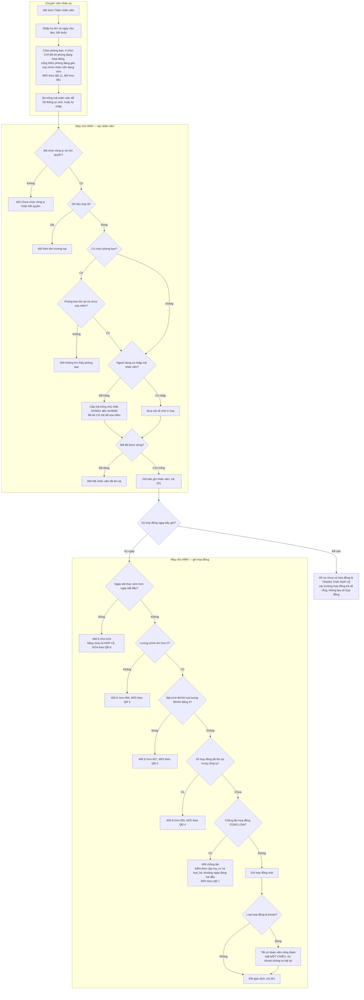
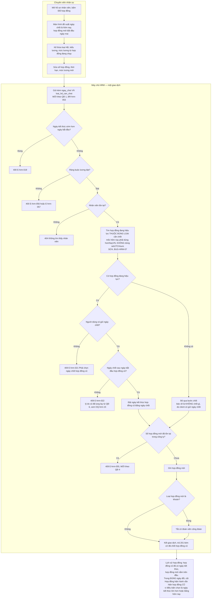
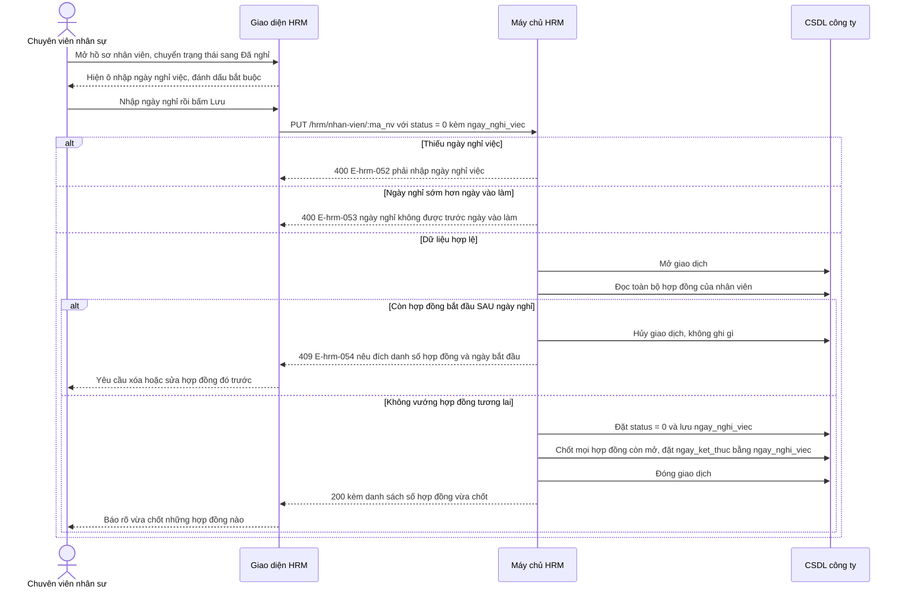
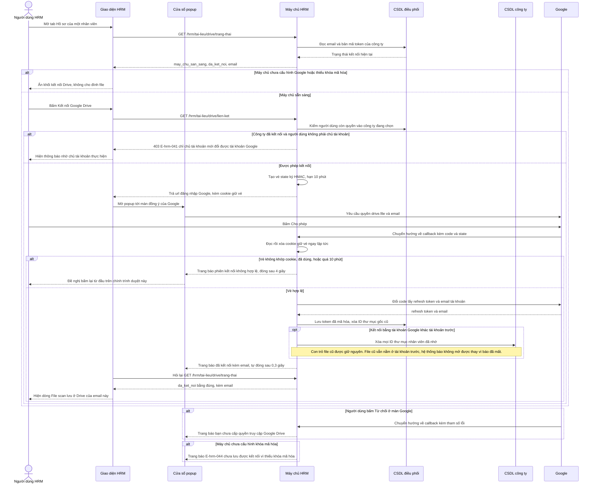
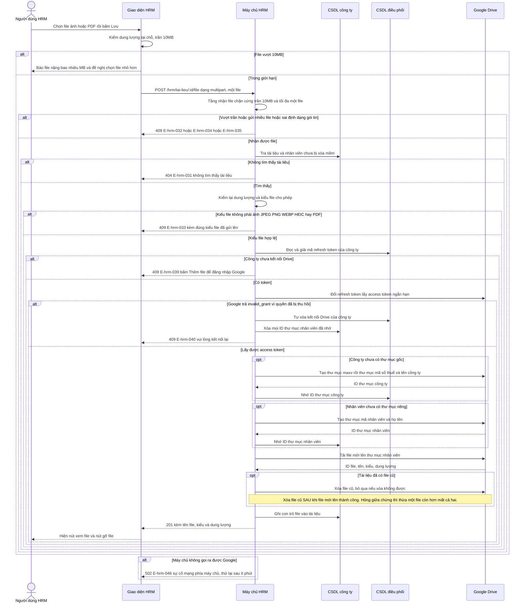
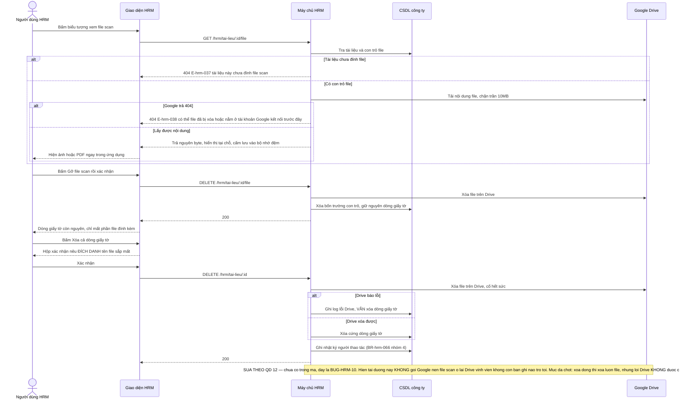
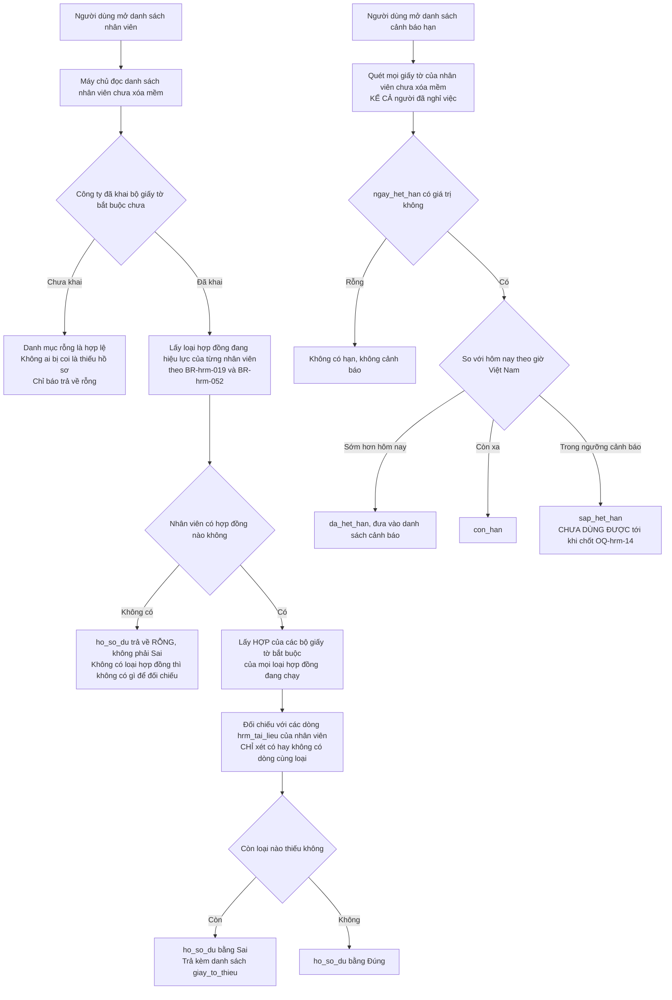

# HRM — Flows

**Cập nhật 2026-09-07 (đợt chốt nghiệp vụ 16/16).** Phần đánh `[MỚI — QĐ n]` hoặc `[SỬA THEO QĐ n]` là luồng **đã chốt nhưng chưa có trong mã**. Quyết định gốc ghi ở Mục 6.1 của `docs/hrm/CONTEXT_SUMMARY.md`.

> **Mọi sơ đồ trong tài liệu này là Mermaid nhúng trực tiếp trong `.md`.** Theo chính sách hiện hành (`.claude/rules/diagram-selection.md`), phân hệ không sinh file đồ họa rời `.svg` / `.puml` / `.png` và không gọi PlantUML. Hai luồng swimlane trước đây dựng bằng PlantUML đã được chuyển sang Mermaid `flowchart` có lane thể hiện bằng `subgraph`.

## Flow: Tạo hồ sơ nhân viên và ký hợp đồng đầu tiên (Swimlane)

**Trigger**: Chuyên viên nhân sự bấm "Thêm nhân viên" trong màn Danh mục nhân viên.
**Related UC**: UC-hrm-03, UC-hrm-06
**Related FR**: FR-hrm-006, FR-hrm-007, FR-hrm-008, FR-hrm-016
**Related BR**: BR-hrm-003, BR-hrm-004, BR-hrm-016, BR-hrm-017, BR-hrm-025, BR-hrm-026 `[SỬA THEO QĐ 6]`, BR-hrm-022 `[SỬA THEO QĐ 1]`, BR-hrm-056 `[MỚI — QĐ 4]`, BR-hrm-057 `[MỚI — QĐ 5]`, BR-hrm-058 `[MỚI — QĐ 5]`, BR-hrm-061 `[MỚI — QĐ 11]`
**Related E**: E-hrm-003, E-hrm-006, E-hrm-009, E-hrm-016, E-hrm-017, E-hrm-019, E-hrm-055, E-hrm-056, E-hrm-057

> Các bước đánh `MỚI`/`SỬA` là hành vi **đã chốt nhưng chưa có trong mã** — đầu việc cho kỹ sư, không phải mô tả hiện trạng.

Bốn điểm nghiệp vụ then chốt của luồng này:

1. **Tạo nhân viên và ký hợp đồng là hai lần ghi tách rời**, không nằm chung một giao dịch. Hồ sơ nhân viên chưa có hợp đồng là trạng thái hợp lệ và các trường hợp đồng hiện hành trả về rỗng, không bịa số hợp đồng tạm.
2. **Kiểm trùng mã nhân viên không lọc cờ đã xóa mềm** — mã của người đã xóa vẫn bị coi là đã dùng, để bảng lương và chấm công cũ không bị gán sang người mới.
3. **Sinh mã và ghi bản ghi không nằm trong cùng giao dịch** (`nhanVien.service.ts:176-192`), nên hai người tạo cùng lúc vẫn có khe đâm vào nhau ở khóa chính.
4. **Luật công đoàn chỉ chạy một chiều**: ký hợp đồng khoán thì tắt cờ đoàn viên; rời khỏi khoán không tự bật lại vì đó là quyết định của người lao động.

**Bốn điểm bổ sung sau đợt chốt, chưa có trong mã và chưa có trong hình:**

5. **Ô chọn phòng ban ẩn phòng đã ngừng hoạt động** `[MỚI — QĐ 11]`, trừ đúng phòng đang gán của chính nhân viên đang sửa (BR-hrm-061). Máy chủ **cố ý không** chặn `status = 0`, vì chặn ở máy chủ thì hồ sơ của người thuộc phòng đã đóng sẽ không sửa được nữa.
6. **Bước ghi hợp đồng có thêm ba phép kiểm** `[MỚI — QĐ 1, 4, 5]`: trùng số hợp đồng trong cả công ty (BR-hrm-056, E-hrm-055), lương chính phải lớn hơn 0 (BR-hrm-057, E-hrm-056), và lương BHXH phải lớn hơn 0 khi bật trích BHXH (BR-hrm-058, E-hrm-057).
7. **Kiểm chồng lấn theo cặp (`ma_nv`, `loai_hd`)** `[MỚI — QĐ 1]`, không phải chỉ theo `ma_nv` — hợp đồng lao động chính và hợp đồng khoán được chạy song song (BR-hrm-022).
8. **Hợp đồng đúng một ngày là hợp lệ** `[SỬA THEO QĐ 6]` (BR-hrm-026), nên phép kiểm chồng lấn phải dùng khoảng ngày đóng ở cả hai đầu, nếu không hợp đồng một ngày lọt lưới.

---

## Flow: Đổi hợp đồng lao động (Swimlane)

**Trigger**: Chuyên viên nhân sự bấm "Đổi hợp đồng" trong tab Lịch sử hợp đồng của một nhân viên.
**Related UC**: UC-hrm-08
**Related FR**: FR-hrm-018, FR-hrm-019
**Related BR**: BR-hrm-019, BR-hrm-021, BR-hrm-023, BR-hrm-024, BR-hrm-025, BR-hrm-052, BR-hrm-053 `[MỚI — QĐ 1]`, BR-hrm-056 `[MỚI — QĐ 4]`, BR-hrm-057 `[MỚI — QĐ 5]`
**Related E**: E-hrm-016, E-hrm-019, E-hrm-020, E-hrm-021, E-hrm-022, E-hrm-055, E-hrm-056, E-hrm-057

Ba điểm dễ hiểu sai:

1. **Màn hình không gửi mã hợp đồng cũ, nhưng BẮT BUỘC gửi LOẠI hợp đồng cần chốt** `[MỚI — QĐ 1]`. Máy chủ vẫn tự tìm hợp đồng đang hiệu lực để chốt (vì màn hình có thể đang xem dữ liệu cũ), nhưng tìm **trong đúng loại người dùng chỉ định** (`loai_hd_can_chot`, BR-hrm-053). Từ khi hai hợp đồng khác loại được phép chạy song song, `findFirst` không kèm loại là mơ hồ đúng kiểu lỗi âm thầm: đổi hợp đồng chính lại chốt mất hợp đồng khoán.
2. **Trong đúng ngày đổi, cột "Hợp đồng hiện hành" vẫn hiện hợp đồng CŨ** — điều kiện chọn là `ngay_ket_thuc >= hôm nay`, mà ngày chốt mặc định chính là hôm nay. Hợp đồng mới lên hiện hành từ ngày kế tiếp.
3. **Hai mốc "hôm nay" lệch nhau.** Nhánh tìm hợp đồng cũ trong `doiHopDong` dùng nửa đêm theo lịch UTC (`hopDong.service.ts:233-234`), còn nhánh chọn hợp đồng hiện hành dùng nửa đêm theo giờ Việt Nam (`homNayVN()`). Từ 00:00 đến 06:59 giờ Việt Nam, hai chỗ hiểu khác nhau một ngày. **Phải sửa cùng lượt với luật chống chồng lấn** — sửa một trong hai thì hai hàm bất đồng bảy tiếng mỗi ngày, sinh ra lỗi khó lần hơn lỗi đang có.
4. **Hợp đồng mới cũng phải qua ba phép kiểm mới** `[MỚI — QĐ 4, 5]`: trùng số hợp đồng toàn công ty, lương chính lớn hơn 0, lương BHXH lớn hơn 0 khi bật trích BHXH. Còn một điểm **chưa chốt**: từ khi hợp đồng một ngày được cho phép (QĐ 6), lý do cũ của BR-hrm-024b không còn đúng — `ngay_chot` có được **bằng** `ngay_bat_dau` của hợp đồng đang hiệu lực không? Xem OQ-hrm-15, đợt này giữ nguyên hành vi cũ.

---

## Flow: Ghi nhận nhân viên nghỉ việc và tự chốt hợp đồng `[MỚI — QĐ 3]`

**Trigger**: Chuyên viên nhân sự mở hồ sơ nhân viên và chuyển trạng thái sang Đã nghỉ.
**Related UC**: UC-hrm-05
**Related FR**: FR-hrm-036, FR-hrm-010
**Related BR**: BR-hrm-010, BR-hrm-054, BR-hrm-055
**Related E**: E-hrm-052, E-hrm-053, E-hrm-054
**Trạng thái**: chưa có trong mã — cột `ngay_nghi_viec` và toàn bộ luồng này là yêu cầu mới.

Bốn điểm nghiệp vụ then chốt:

1. **Ba việc nằm trong MỘT giao dịch** (BR-hrm-055): đổi trạng thái, lưu ngày nghỉ, chốt hợp đồng. Chốt được hợp đồng mà không đổi được trạng thái — hoặc ngược lại — là để lại dữ liệu nửa vời không có gì báo, và phân hệ Lương sẽ đọc trúng đúng phần sai.
2. **"Hợp đồng còn mở" nghĩa là `ngay_ket_thuc` rỗng hoặc muộn hơn ngày nghỉ.** Hợp đồng đã kết thúc trước ngày nghỉ thì để nguyên, không kéo dài ra.
3. **Ngày nghỉ ở tương lai là hợp lệ** (BR-hrm-054) — báo trước nghỉ việc là chuyện thường. Hệ quả: hợp đồng vừa bị chốt vẫn **đang hiệu lực** cho tới hết ngày đó, và nhân viên đã mang trạng thái Đã nghỉ trong khi vẫn còn hợp đồng chạy. Phân hệ Lương phải xử lý được cặp trạng thái này.
4. **Phản hồi phải liệt kê hợp đồng đã chốt** (FR-hrm-036). Hệ thống vừa tự sửa dữ liệu hợp đồng của người dùng; làm âm thầm thì lần sau họ mở lịch sử hợp đồng ra và không hiểu vì sao ngày kết thúc bị đổi.

**Chiều ngược lại chưa chốt** — đưa nhân viên từ Đã nghỉ trở lại Đang làm thì xử lý `ngay_nghi_viec` và các hợp đồng đã bị tự chốt ra sao? Xem OQ-hrm-12.

**Một khoảng trống đáng lưu ý:** luồng này **tự sửa `ngay_ket_thuc` của hợp đồng** nhưng không nằm trong năm nhóm thao tác phải ghi nhật ký ở BR-hrm-066. Đây là hệ quả của việc QĐ 15 liệt kê đúng năm nhóm và không nhóm nào phủ trường hợp này.

---

## Flow: Liên kết Google Drive cấp công ty qua OAuth

**Trigger**: Người dùng bấm "Kết nối Google Drive" (hoặc bấm "Thêm file scan" khi công ty chưa kết nối).
**Related UC**: UC-hrm-11
**Related FR**: FR-hrm-027, FR-hrm-028, FR-hrm-029
**Related BR**: BR-hrm-040, BR-hrm-041, BR-hrm-043, BR-hrm-045 `[SỬA THEO QĐ 10]`, BR-hrm-047
**Related E**: E-hrm-041, E-hrm-043, E-hrm-044, E-hrm-047, E-hrm-048, E-hrm-049, E-hrm-050, E-hrm-051

**Lý do popup thay vì chuyển hướng cả trang**: chuyển hướng làm trang tải lại và mất luôn file người dùng vừa chọn, buộc chọn lại từ đầu.

**Vì sao callback được miễn đăng nhập**: Google điều hướng trình duyệt từ tên miền khác về, nên cookie phiên (SameSite Strict) không được gửi kèm; nếu bắt đăng nhập thì popup chỉ nhận về JSON 401 và không bao giờ đóng. Danh tính công ty lấy từ vé state đã ký HMAC kèm hạn dùng, và vé bị khóa vào đúng trình duyệt đã xin nó bằng một cookie riêng dùng một lần.

**Siết quyền kết nối lần đầu** `[SỬA THEO QĐ 10]` — **chưa có trong mã, đây là BUG-HRM-11.** Hiện `taiLieu.controller.ts:148-151` chỉ chặn khi công ty **đã** kết nối, nên bất kỳ ai vào được công ty cũng nối kho tài liệu của **cả công ty** vào Drive **cá nhân** của họ. Mức đã chốt: cả ba việc — nối lần đầu, đổi tài khoản, ngắt kết nối — **chỉ `OWNER`** (BR-hrm-045, E-hrm-059). Sau khi đã nối thì mọi người có quyền vào công ty vẫn tải lên, xem và gỡ file bình thường; siết là siết ở việc **chọn Drive của ai**, không phải ở việc dùng.

Phải **sửa giao diện cùng lượt với máy chủ**: người không phải chủ tài khoản không được thấy nút "Kết nối Google Drive" rồi bấm vào và nhận 403. Giao diện hiện thẳng thông báo nhờ chủ tài khoản liên kết Drive.

---

## Flow: Tải file scan lên Drive của công ty

**Trigger**: Người dùng chọn file trong form Hồ sơ giấy tờ và bấm Lưu.
**Related UC**: UC-hrm-12
**Related FR**: FR-hrm-030, FR-hrm-031
**Related BR**: BR-hrm-035, BR-hrm-036, BR-hrm-037, BR-hrm-042
**Related E**: E-hrm-031, E-hrm-032, E-hrm-033, E-hrm-034, E-hrm-035, E-hrm-036, E-hrm-039, E-hrm-040, E-hrm-045, E-hrm-046

---

## Flow: Xem, gỡ file scan và xóa bản ghi giấy tờ

**Trigger**: Người dùng bấm biểu tượng xem file, bấm gỡ file, hoặc bấm xóa dòng giấy tờ.
**Related UC**: UC-hrm-13
**Related FR**: FR-hrm-032, FR-hrm-033, FR-hrm-034
**Related BR**: BR-hrm-038, BR-hrm-039 `[SỬA THEO QĐ 12]`, BR-hrm-048, BR-hrm-062 `[MỚI — QĐ 14]`, BR-hrm-066 `[MỚI — QĐ 15]`
**Related E**: E-hrm-031, E-hrm-037, E-hrm-038

**Vì sao lấy nội dung file qua máy chủ thay vì trỏ thẻ ảnh thẳng vào API**: thẻ ảnh tự đi một yêu cầu nằm ngoài lớp gọi API chung, nên khi phiên hết hạn nó chỉ nhận 401 và hiện hình vỡ, không kích hoạt được cơ chế tự làm mới phiên rồi thử lại.

---

## Flow: Chỉ báo hồ sơ đủ/thiếu và cảnh báo hạn giấy tờ `[MỚI — QĐ 14]`

**Trigger**: Người dùng mở danh sách nhân viên, mở chi tiết một nhân viên, hoặc mở danh sách cảnh báo hạn giấy tờ.
**Related FR**: FR-hrm-038, FR-hrm-039, FR-hrm-040, FR-hrm-041
**Related BR**: BR-hrm-062, BR-hrm-063, BR-hrm-064, BR-hrm-065
**Related E**: E-hrm-060, E-hrm-061
**Trạng thái**: chưa có trong mã — bảng `hrm_giay_to_bat_buoc` và cột `ngay_het_han` đều là yêu cầu mới.

Ba điểm nghiệp vụ then chốt:

1. **Hai chỉ báo tách rời, không gộp** (BR-hrm-064). Hồ sơ đủ/thiếu chỉ xét **có hay không có dòng** giấy tờ; không xét dòng đó đã đính file scan chưa, cũng không xét còn hạn hay đã hết hạn. Một nhân viên có thể vừa đủ hồ sơ vừa có giấy tờ đã hết hạn — hai câu hỏi khác nhau, hai chỉ báo khác nhau.
2. **Lấy HỢP chứ không lấy giao** khi nhân viên có nhiều hợp đồng đang chạy: mỗi hợp đồng đều phát sinh nghĩa vụ hồ sơ của riêng nó.
3. **Ngưỡng "sắp hết hạn" chưa chốt** (OQ-hrm-14). Tới khi có ngưỡng, hệ thống **chỉ** phân biệt còn hạn và đã hết hạn; **không** được tự đặt một con số mặc định rồi cảnh báo theo nó.

**Ràng buộc hiệu năng**: chỉ báo cho cả danh sách phải lấy trong **một lượt truy vấn**, không truy vấn theo từng dòng (FR-hrm-040, cùng ràng buộc với NFR-hrm-004). Đây là điểm dễ hỏng nhất của tính năng này: đối chiếu bộ giấy tờ bắt buộc cho từng nhân viên là công thức sinh N+1 rất tự nhiên.
