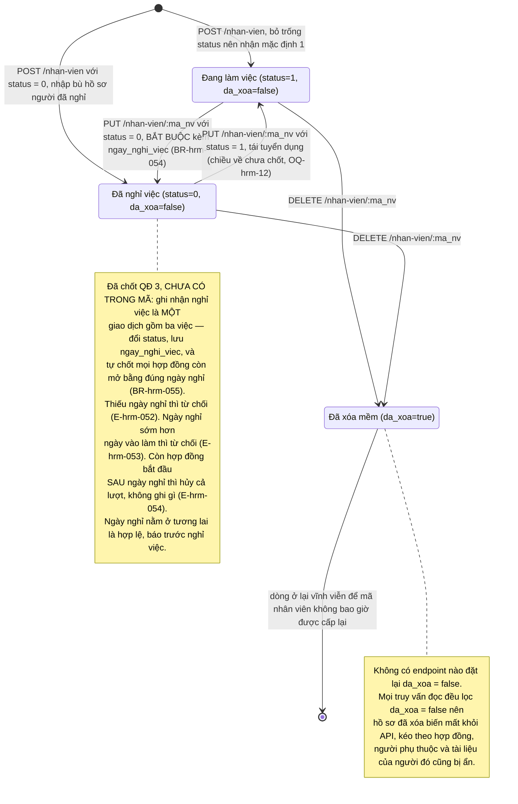
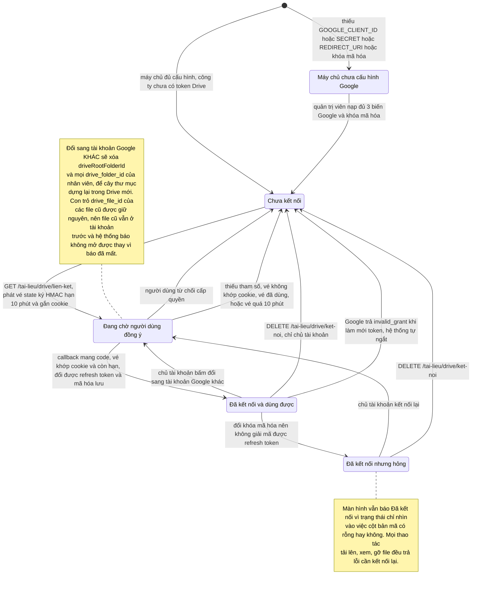
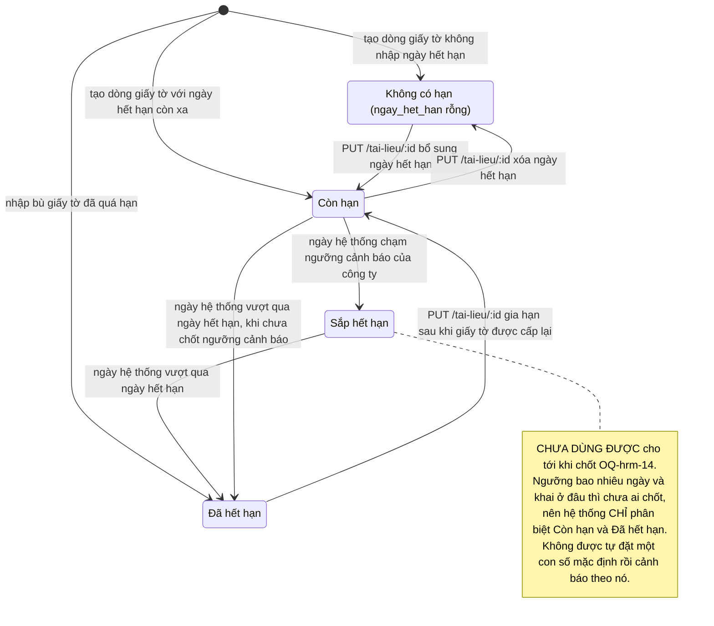
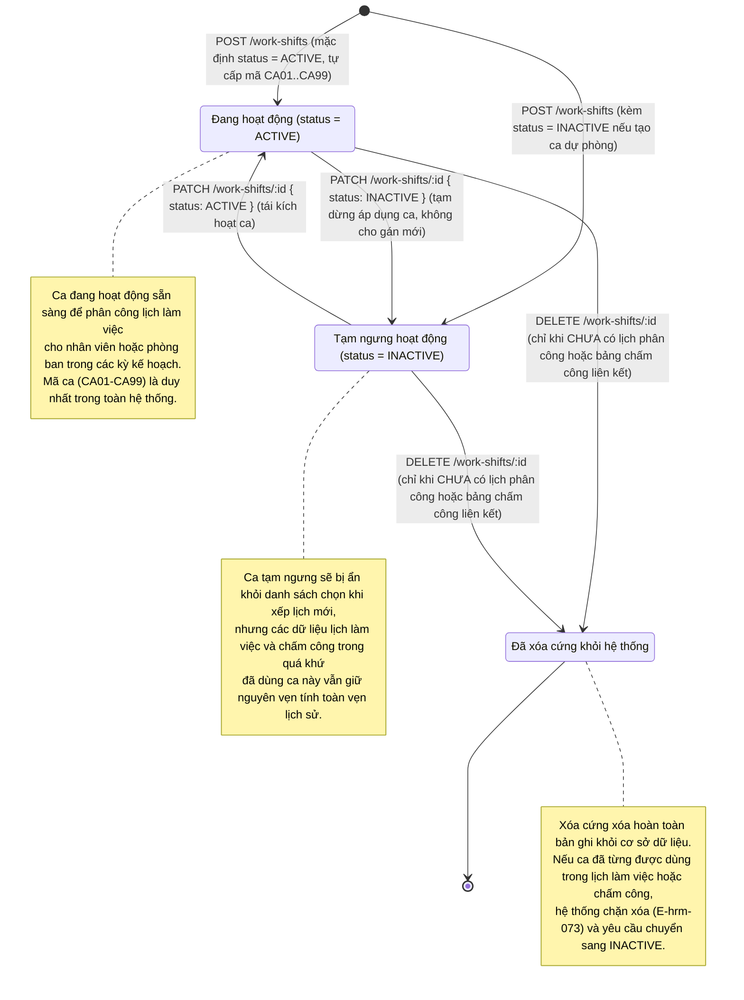
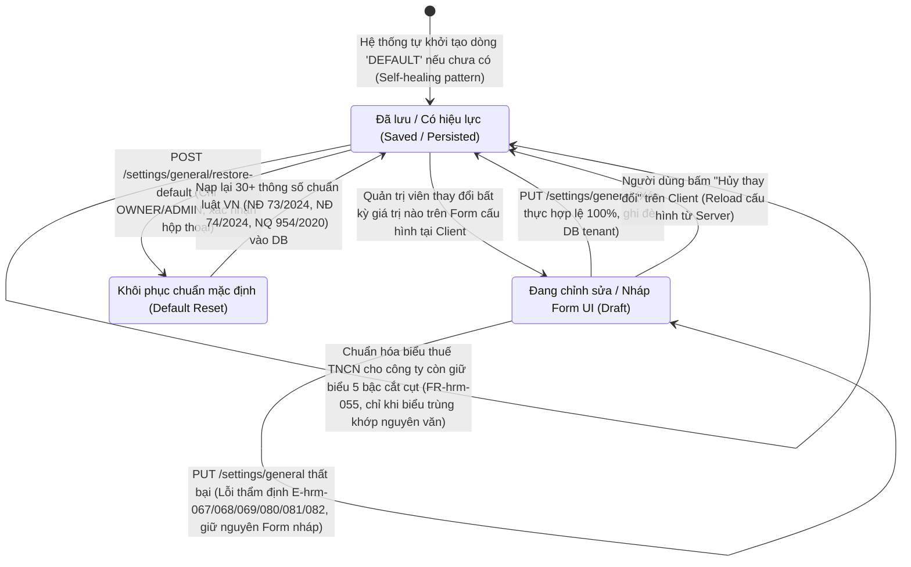

# HRM — VÒNG ĐỜI TRẠNG THÁI CÁC THỰC THỂ

Các thực thể của phân hệ HRM có vòng đời trạng thái bao gồm: **Nhân viên**, **Hợp đồng lao động**, **Liên kết Google Drive của công ty**, **Ca làm việc (WorkShift)** và **Cấu hình mặc định (GeneralSetting)**. Phòng ban, Người phụ thuộc, Tài liệu và Ngày lễ chỉ có cặp trạng thái tồn tại/đã xóa nên không cần sơ đồ phức tạp — mô tả nằm trong bảng cuối trang.

Mọi trạng thái dưới đây được đối chiếu chuẩn hóa từ mã nguồn và kế hoạch nâng cấp hạ tầng HRM (WorkShift, GeneralSetting, Holiday).

**Cập nhật 2026-09-08 (bổ sung cụm Cấu hình mặc định, Ca làm việc và Ngày lễ).** Phần đánh `[MỚI — QĐ n]`, `[SỬA THEO QĐ n]` hoặc `[MỚI — WorkShift/GeneralSetting]` là **vòng đời đã chốt trong tài liệu đặc tả nghiệp vụ SRS** — làm căn cứ hiện thực hóa cho Architect và Backend/Frontend. Quyết định gốc ghi ở Mục 6.1 của `docs/hrm/CONTEXT_SUMMARY.md`. Chỗ nào hiện trạng và mức đã chốt khác nhau đều nói rõ cả hai.

---

## State: NhanVien

**Related entity**: NhanVien (`hrm_nhan_vien`)
**Related BR**: BR-hrm-010, BR-hrm-011, BR-hrm-012, BR-hrm-013, BR-hrm-054 `[MỚI — QĐ 3]`, BR-hrm-055 `[MỚI — QĐ 3]`
**Nguồn mã**: `be_maxv/src/services/client/hrm/nhanVien.service.ts` (createNhanVien dòng 170-194, updateNhanVien dòng 197-217, deleteNhanVien dòng 227-243), `be_maxv/src/validators/hrm/nhanVien.validator.ts` dòng 74.

Trạng thái nhân viên là **tích của hai trục độc lập**: `status` (`1` đang làm / `0` đã nghỉ) và `da_xoa` (`false` / `true`). Schema tách hai cột có chủ đích: "đã nghỉ việc" là dữ liệu nhân sự thật (còn quyết toán thuế, còn trong báo cáo), "đã xóa" là hồ sơ nhập nhầm.

### Hệ quả lan tỏa khi vào trạng thái Đã xóa mềm

| Bản ghi con | Điều thực sự xảy ra | Nguồn mã |
|---|---|---|
| Hợp đồng | Vẫn nằm trong cơ sở dữ liệu, bị ẩn khỏi mọi truy vấn vì `listHopDong` lọc `nhan_vien.da_xoa = false` | `hopDong.service.ts:172-174` |
| Người phụ thuộc | Vẫn nằm trong cơ sở dữ liệu, bị ẩn vì `listNguoiPhuThuoc` lọc tương tự. `deleteNhanVien` trả về `so_npt_an_theo` để màn hình nói rõ ẩn bao nhiêu người | `nguoiPhuThuoc.service.ts:59-61`, `nhanVien.service.ts:237-242` |
| Tài liệu | Vẫn nằm trong cơ sở dữ liệu, bị ẩn. **File scan trên Google Drive không bị đụng tới** và cũng không có gì báo | `taiLieu.service.ts:55-57` |
| Đếm nhân viên của phòng ban | Cột `so_nv` giảm ngay (đếm `da_xoa = false` và `status = 1`); guard chặn xóa phòng ban cũng thôi tính người đã xóa | `phongBan.service.ts:138-142, 239-245` |

### Invalid transitions

| Từ | Sang | Vì sao không được |
|---|---|---|
| Đã xóa mềm | Đang làm việc / Đã nghỉ việc | Không có endpoint khôi phục. Mọi `findFirst` đều kèm `da_xoa: false` nên bản ghi đã xóa không còn tra được qua API. |
| Bất kỳ | Đổi `ma_nv` tại chỗ | `nhanVienUpdateSchema` bỏ hẳn trường `ma_nv`. Mã nhân viên là khóa mà bảng lương và chấm công sau này trỏ vào; đổi tại chỗ là bỏ lại dữ liệu mồ côi. |
| Đã xóa mềm | Tái sử dụng `ma_nv` cho người khác | `createNhanVien` cố ý **không** lọc `da_xoa` khi kiểm trùng mã, nên mã của người đã xóa vẫn bị coi là đã dùng. |

---

## State: HopDong

**Related entity**: HopDong (`hrm_hop_dong`)
**Related BR**: BR-hrm-018, BR-hrm-019, BR-hrm-020, BR-hrm-021, BR-hrm-022 `[SỬA THEO QĐ 1 và 6]`, BR-hrm-024, BR-hrm-026 `[SỬA THEO QĐ 6]`, BR-hrm-029, BR-hrm-052, BR-hrm-053 `[MỚI — QĐ 1]`, BR-hrm-055 `[MỚI — QĐ 3]`, BR-hrm-056 `[MỚI — QĐ 4]`
**Nguồn mã**: `be_maxv/src/services/client/hrm/hopDong.service.ts` (homNayVN dòng 61-66, chonHopDongHienHanh dòng 93-104, doiHopDong dòng 224-273), `be_maxv/src/validators/hrm/hopDong.validator.ts` dòng 67-112.

Bảng `hrm_hop_dong` **không có cột trạng thái**. Trạng thái là giá trị **suy ra lúc đọc** bằng cách so `ngay_bat_dau` / `ngay_ket_thuc` với ngày hôm nay theo giờ Việt Nam. Hệ quả quan trọng: hợp đồng đổi trạng thái **do thời gian trôi**, không do ai bấm nút — không có thao tác ghi nào đánh dấu việc đó.

### Sáu điểm dễ hiểu sai về vòng đời hợp đồng

1. **Ngày đổi hợp đồng, hợp đồng CŨ vẫn là hợp đồng hiện hành.** `doiHopDong` đặt `ngay_ket_thuc = ngay_chot`, mà mặc định màn hình đề xuất `ngay_chot` là hôm nay và hợp đồng mới bắt đầu ngày mai (`ThayDoiHopDongDialog.tsx` dòng 61-73). Điều kiện chọn hợp đồng hiện hành là `ngay_ket_thuc >= hôm nay`, nên suốt ngày hôm đó hợp đồng cũ vẫn thắng. Hợp đồng mới chỉ lên hiện hành từ ngày kế tiếp.

2. **Hai mốc "hôm nay" khác nhau đang cùng tồn tại.** `chonHopDongHienHanh` dùng `homNayVN()` (cộng 7 giờ rồi lấy nửa đêm UTC), còn `doiHopDong` dùng `new Date()` rồi `setUTCHours(0,0,0,0)` (`hopDong.service.ts:233-234`) — đúng cách làm mà chính docblock của `homNayVN()` cảnh báo không được dùng. Từ 00:00 đến 06:59 giờ Việt Nam, hai chỗ hiểu "hôm nay" lệch nhau một ngày.

3. **Hiện trạng: không có gì chặn hai hợp đồng cùng đang hiệu lực.** Không có kiểm tra chồng lấn ở `createHopDong` (dòng 185-193) lẫn `updateHopDong` (dòng 196-218). Chỉ riêng đường `/hop-dong/doi` mới ràng buộc `ngay_bat_dau > ngay_chot` ở tầng validator. Gọi thẳng `POST /hop-dong` hai lần cùng khoảng thời gian là tạo được hai hợp đồng chồng nhau.
   **Mức đã chốt `[SỬA THEO QĐ 1]`:** chặn chồng lấn theo cặp (`ma_nv`, `loai_hd`) — hai hợp đồng **khác loại** được phép chạy song song, hai hợp đồng **cùng loại** thì không (BR-hrm-022). Kéo theo: `doiHopDong` bắt buộc nhận thêm `loai_hd_can_chot` để biết chốt hợp đồng thuộc loại nào, nếu không thì đổi hợp đồng chính lại vô tình chốt mất hợp đồng khoán đang chạy song song (BR-hrm-053).

4. **Xóa hợp đồng là xóa cứng, không xác nhận nghiệp vụ.** `deleteHopDong` xóa dòng khỏi cơ sở dữ liệu, kể cả hợp đồng đang hiệu lực và kể cả hợp đồng đã dùng để chốt lương kỳ trước. Không có bản lưu, không có nhật ký.
   **Mức đã chốt `[MỚI — QĐ 15]`:** vẫn xóa cứng, nhưng phải ghi nhật ký **người thao tác** (BR-hrm-066). Đợt này **không** lưu ảnh chụp giá trị trước và sau, nên xóa xong vẫn không dựng lại được nội dung hợp đồng — nhật ký chỉ trả lời được "ai xóa, lúc nào", không trả lời được "xóa mất cái gì".

5. **Hợp đồng đúng một ngày là hợp lệ `[SỬA THEO QĐ 6]`.** `ngay_ket_thuc` được phép **bằng** `ngay_bat_dau` (BR-hrm-026) — hợp đồng khoán một ngày, hợp đồng thời vụ ngắn là chuyện có thật. Hệ quả dễ bỏ sót: luật chống chồng lấn phải dùng khoảng ngày **đóng ở cả hai đầu**; dùng khoảng nửa mở thì hợp đồng một ngày có độ dài bằng không và **lọt hết mọi phép kiểm giao cắt**.

6. **Số hợp đồng là duy nhất trong cả công ty `[MỚI — QĐ 4]`.** Không phải duy nhất theo nhân viên (BR-hrm-056, E-hrm-055). Đây là ràng buộc mới trên dữ liệu đang chạy: phải rà và dọn số hợp đồng trùng ở **mọi tenant** trước khi bật, gộp chung một đợt với ràng buộc mã số thuế người phụ thuộc.

### Invalid transitions

| Từ | Sang | Vì sao không được |
|---|---|---|
| Bất kỳ | Trạng thái "tạm dừng" / "đã hủy" | Bảng không có cột trạng thái. Muốn dừng hợp đồng thì kéo `ngay_ket_thuc` về, không có cách nào khác. |
| Bất kỳ | Đổi `ma_nv` sang nhân viên khác | `hopDongUpdateSchema` bỏ trường `ma_nv`. Muốn chuyển thì xóa rồi tạo lại để có vết. |
| Bị ẩn theo nhân viên đã xóa mềm | Bất kỳ | Không endpoint nào của hợp đồng đọc/ghi được bản ghi thuộc nhân viên `da_xoa = true`; phải khôi phục nhân viên trước, mà chức năng đó chưa có. |
| Đã xóa cứng | Bất kỳ | Không hoàn tác được. |
| Chưa hiệu lực | Đang hiệu lực bằng thao tác thủ công | Không có nút "kích hoạt". Chỉ có cách sửa `ngay_bat_dau` về quá khứ, tức là sửa dữ liệu chứ không phải chuyển trạng thái. |

---

## State: LienKetDrive

**Related entity**: DonVi (`maxv2_sys.don_vi`, nhóm cột `drive*`)
**Related BR**: BR-hrm-040, BR-hrm-043, BR-hrm-045, BR-hrm-046, BR-hrm-047
**Nguồn mã**: `be_maxv/src/services/client/hrm/taiLieuDrive.service.ts` (trangThaiDrive dòng 70-80, luuKetNoiDrive dòng 83-132, ngatKetNoiDrive dòng 163-175, layTokenDonVi dòng 177-217, accessTokenCuaDonVi dòng 231-244), `be_maxv/src/controllers/client/hrm/taiLieu.controller.ts` (driveLienKet dòng 141-156, driveCallback dòng 189-267, driveNgatKetNoi dòng 276-286).

Liên kết Drive là trạng thái **cấp công ty**, không phải cấp người dùng. Toàn bộ file scan hồ sơ nhân sự của công ty phụ thuộc vào trạng thái này.

### Ai được làm gì

| Chuyển trạng thái | Vai trò được phép | Nguồn mã |
|---|---|---|
| Chưa kết nối sang Đang chờ đồng ý (kết nối **lần đầu**) | **Hiện trạng:** mọi người dùng có quyền vào công ty (`OWNER`, `OWNER_EMPLOYEE`). **Đã chốt `[SỬA THEO QĐ 10]`: chỉ `OWNER`** (BR-hrm-045, E-hrm-059) | `taiLieu.controller.ts:148-151` — chỉ chặn khi `da_ket_noi = true`, đây chính là BUG-HRM-11 |
| Đã kết nối sang Đang chờ đồng ý (**đổi** tài khoản) | Chỉ `OWNER` | `taiLieu.controller.ts:149-151`, thông điệp `DRIVE_DOI_TAI_KHOAN_CHI_OWNER` |
| Đã kết nối sang Chưa kết nối (ngắt tay) | Chỉ `OWNER` | `taiLieu.controller.ts:281-283`, thông điệp `DRIVE_NGAT_CHI_OWNER` |
| Đã kết nối sang Chưa kết nối (tự ngắt) | Hệ thống, khi Google trả đúng mã `invalid_grant` | `taiLieuDrive.service.ts:238-241` |

### Invalid transitions

| Từ | Sang | Vì sao không được |
|---|---|---|
| Chưa kết nối | Đã kết nối | Bắt buộc đi qua màn đồng ý của Google. Không có đường nào nạp thẳng refresh token vào hệ thống. |
| Đang chờ đồng ý | Đã kết nối, dùng lại vé cũ | Cookie giữ vé bị xóa ngay ở đầu callback, trước mọi nhánh trả về. Mỗi vé đi được đúng một lần, từ đúng một trình duyệt. |
| Đã kết nối | Chưa kết nối, do người không phải chủ tài khoản | Bị chặn 403 trước khi chạm dữ liệu. |
| Đã kết nối | Chưa kết nối, do Google trả 4xx bất kỳ | Cố ý chỉ bám mã `invalid_grant`. Bắt theo cả dải 4xx thì một lần gõ nhầm `GOOGLE_CLIENT_SECRET` sẽ xóa token của **mọi** công ty. |
| Bất kỳ | Xóa `drive_file_id` của tài liệu cũ | `quenThuMucNhanVien` cố ý chỉ dọn ID thư mục, giữ nguyên con trỏ file để không xóa mất dấu vết công ty từng đính giấy tờ gì. |

---

## State: HanGiayTo `[MỚI — QĐ 14]`

**Related entity**: TaiLieu (`hrm_tai_lieu`, cột mới `ngay_het_han`)
**Related BR**: BR-hrm-062, BR-hrm-064, BR-hrm-065
**Nguồn**: chưa có trong mã — cột `ngay_het_han` và toàn bộ vòng đời này là yêu cầu mới chốt ngày 2026-09-07.

Trạng thái hạn của giấy tờ **không có cột lưu**: nó được tính lúc đọc bằng cách so `ngay_het_han` với hôm nay theo giờ Việt Nam, đúng cùng mốc mà hợp đồng đang dùng (BR-hrm-021). Giống hợp đồng, giấy tờ đổi trạng thái **do thời gian trôi**, không do ai bấm nút.

### Quan hệ với chỉ báo hồ sơ đủ/thiếu

Hai chỉ báo này **cố ý tách rời** (BR-hrm-064): hồ sơ đủ/thiếu chỉ xét **có hay không có dòng** giấy tờ theo bộ bắt buộc, không xét dòng đó còn hạn hay đã hết hạn, cũng không xét đã đính file scan chưa. Một nhân viên hoàn toàn có thể vừa **đủ hồ sơ** vừa có giấy tờ **đã hết hạn** — đó là hai câu hỏi khác nhau nên phải hiện thành hai chỉ báo khác nhau. Gộp lại thì người dùng thấy báo thiếu hồ sơ, mở ra đếm thấy đủ dòng, không hiểu vì sao.

Nhân viên **chưa có hợp đồng nào** thì chỉ báo hồ sơ đủ/thiếu trả về **rỗng**, không phải Sai — không có loại hợp đồng thì không có bộ giấy tờ nào để đối chiếu. Danh sách cảnh báo hạn giấy tờ tính trên **mọi nhân viên chưa xóa mềm, kể cả người đã nghỉ việc**: giấy tờ của người đã nghỉ vẫn còn dùng khi quyết toán.

---

## State: CaLamViec `[MỚI — WorkShift]`

**Related entity**: CaLàmViệc (`hrm_work_shifts`)
**Related BR**: BR-hrm-074, BR-hrm-075, BR-hrm-076
**Related FR**: FR-hrm-048, FR-hrm-049, FR-hrm-050
**Nguồn**: Thiết kế nền tảng lịch trình và ca làm việc (tham chiếu `docs/nestjs/hr` và `implementation_plan.md`).

Ca làm việc có vòng đời quản lý tính khả dụng qua thuộc tính `status` (`ACTIVE`: Đang hoạt động / `INACTIVE`: Tạm ngưng) và xóa cứng (`DELETE`). Ca làm việc là đơn vị cơ sở cho việc xếp lịch làm việc (`hrm_work_schedules`) và chấm công (`hrm_attendances`) sau này.

### Các chuyển đổi trạng thái của Ca làm việc

| Từ trạng thái | Sang trạng thái | Thao tác / API | Điều kiện & Nghiệp vụ |
|---|---|---|---|
| Khởi tạo | Đang hoạt động (`ACTIVE`) | `POST /work-shifts` | Nhập đủ tên ca, giờ bắt đầu/kết thúc, nghỉ giữa ca. Hệ thống tự quét lỗ trống cấp mã `CA01`-`CA99` (BR-hrm-074, đạt trần 99 ca trả lỗi 400 E-hrm-078) và tính `isOvernight`, `workingHours` (BR-hrm-075, BR-hrm-076). Mặc định `status = "ACTIVE"`. |
| Khởi tạo | Tạm ngưng (`INACTIVE`) | `POST /work-shifts` | Như trên, nhưng người dùng truyền tường minh `status = "INACTIVE"`. |
| Đang hoạt động | Tạm ngưng (`INACTIVE`) | `PATCH /work-shifts/:id` | Body `{ status: "INACTIVE" }`. Không cho phép gán ca này vào các ca làm việc mới trong tương lai. |
| Tạm ngưng | Đang hoạt động (`ACTIVE`) | `PATCH /work-shifts/:id` | Body `{ status: "ACTIVE" }`. Ca xuất hiện trở lại trong danh mục chọn ca làm việc. |
| Bất kỳ | Đã xóa cứng | `DELETE /work-shifts/:id` | Chỉ cho phép xóa khi ca chưa có ràng buộc khóa ngoại tới lịch phân ca hoặc bảng chấm công. Nếu đã phát sinh dữ liệu, trả lỗi 409 `E-hrm-073`. |

### Invalid transitions

| Từ | Sang | Vì sao không được |
|---|---|---|
| Bất kỳ | Đổi `code` tại chỗ | Trường `code` được hệ thống bảo vệ, không cho phép cập nhật trong `workShiftUpdateSchema` (BR-hrm-074) nhằm tránh xung đột dữ liệu lịch sử. |
| Đã xóa cứng | Bất kỳ | Đã xóa khỏi DB không thể phục hồi. Mã `CAxx` bị giải phóng có thể được cấp lại cho ca mới tạo sau này theo cơ chế gap scanning. |
| Đang hoạt động / Tạm ngưng | Đã xóa cứng | Bị chặn nếu ca đã liên kết với phân công lịch làm việc hoặc bảng chấm công (E-hrm-073). Bắt buộc phải dùng `status = "INACTIVE"` để ẩn ca thay vì xóa. |

---

## State: CauHinhMacDinh `[MỚI — GeneralSetting]`

**Related entity**: CauHinhMacDinh (`hrm_general_settings`, Singleton `id = "DEFAULT"`)
**Related BR**: BR-hrm-070, BR-hrm-071, BR-hrm-072, BR-hrm-073, BR-hrm-080, BR-hrm-081, BR-hrm-082, BR-hrm-083
**Related FR**: FR-hrm-045, FR-hrm-046, FR-hrm-047, FR-hrm-055
**Nguồn**: Thiết kế cấu hình mặc định nền tảng HRM (tham chiếu `docs/nestjs/hr` và `implementation_plan.md`).

Bảng `hrm_general_settings` tuân thủ mô hình **Singleton Record** với khóa chính duy nhất cố định `id = "DEFAULT"`. Bảng này luôn có đúng một bản ghi trong cơ sở dữ liệu tenant.
Vòng đời trạng thái phản ánh sự phối hợp giữa Client UI Form State và Server Persisted State:

### Các chuyển đổi trạng thái của Cấu hình mặc định

| Từ trạng thái | Sang trạng thái | Thao tác / API | Điều kiện & Nghiệp vụ |
|---|---|---|---|
| Khởi tạo | Đã lưu (`SAVED`) | `GET /settings/general` | Nếu DB chưa có bản ghi `DEFAULT`, tự động tạo bản ghi mẫu chuẩn pháp luật Việt Nam (Self-healing pattern, BR-hrm-070). |
| Đã lưu | Đang sửa (`DRAFT`) | Client UI event | Quản trị viên thay đổi các trường cấu hình trên màn hình quản trị (chưa gửi request lưu). |
| Đang sửa | Đã lưu (`SAVED`) | `PUT /settings/general` | Gửi toàn bộ hoặc một phần các tham số cấu hình. Máy chủ thẩm định: giờ công 1.0–24.0h (BR-hrm-071), lương cơ sở/vùng > 0 (BR-hrm-072), và — nếu nội dung gửi lên có biểu thuế — toàn vẹn cấu trúc biểu thuế theo BR-hrm-082 (tối thiểu 2 bậc · ngưỡng lũy kế tăng nghiêm ngặt · thuế suất tăng nghiêm ngặt · bậc cuối là bậc mở). Lưu thành công chuyển về `SAVED` và ghi nhật ký kiểm toán (BR-hrm-066 nhóm 6). |
| Đang sửa | Đã lưu (`SAVED`) **kèm cảnh báo** | `PUT /settings/general` | Biểu thuế hợp lệ về cấu trúc nhưng **khác biểu chuẩn 7 bậc**: vẫn lưu (200), phản hồi kèm `warning: "CANH_BAO_BIEU_THUE_LECH_CHUAN"`, giao diện hiện dải cảnh báo (BR-hrm-083). Cảnh báo **không** là một trạng thái riêng — bản ghi vẫn ở `SAVED`. |
| Đang sửa | Đang sửa (`DRAFT`) | `PUT /settings/general` (Lỗi) | Thẩm định thất bại: `E-hrm-067` giờ công chuẩn sai dải · `E-hrm-068` lương cơ sở/vùng $\le 0$ · `E-hrm-069` thuế suất không tăng nghiêm ngặt · `E-hrm-080` ngưỡng lũy kế không tăng nghiêm ngặt · `E-hrm-081` biểu thuế dưới 2 bậc · `E-hrm-082` bậc cuối không phải bậc mở. Máy chủ từ chối, form giữ nguyên dữ liệu nháp và hiển thị lỗi tương ứng tại từng trường. |
| Đang sửa | Đã lưu (`SAVED`) | Bấm nút "Hủy thay đổi" (Client) | Hủy bỏ toàn bộ dữ liệu đang sửa trên form, tải lại dữ liệu `SAVED` từ máy chủ. |
| Đã lưu / Đang sửa | Khôi phục mặc định (`SAVED`) | `POST /settings/general/restore-default` | Hộp xác nhận phải nêu rõ thao tác **ghi đè cả biểu thuế công ty đã tự đặt**. Reset toàn bộ cấu hình về chuẩn: Lương cơ sở 2.340.000đ (NĐ 73/2024), Lương tối thiểu Vùng 1 4.960.000đ (NĐ 74/2024), Giảm trừ bản thân 11tr / NPT 4.4tr (NQ 954/2020), và **biểu thuế 7 bậc** chuẩn Điều 22 Luật Thuế TNCN — 5tr/5% · 10tr/10% · 18tr/15% · 32tr/20% · 52tr/25% · 80tr/30% · bậc mở/35% (BR-hrm-070, BR-hrm-081). Ghi nhật ký kiểm toán (BR-hrm-066 nhóm 6). |
| Đã lưu | Đã lưu (`SAVED`) | Chuẩn hóa biểu thuế TNCN (FR-hrm-055) | Thao tác dọn dữ liệu một lượt cho các công ty còn giữ **nguyên văn** biểu 5 bậc cắt cụt do hệ thống tự nạp trước 2026-09-08. **Chỉ** ghi đè khi biểu trùng khớp nguyên văn; công ty đã tự chỉnh biểu thì giữ nguyên và chỉ được liệt kê ra. Chạy lại nhiều lần cho cùng kết quả. |

### Invalid transitions

| Từ | Sang | Vì sao không được |
|---|---|---|
| Bất kỳ | Tạo mới thêm bản ghi cấu hình khác | `POST /settings/general` không tồn tại. Bảng là Singleton chỉ chấp nhận duy nhất bản ghi có `id = "DEFAULT"`. |
| Bất kỳ | Xóa bản ghi cấu hình (`DELETE`) | Không có API xóa cấu hình (`DELETE /settings/general`). Cấu hình là thực thể bắt buộc để mọi phân hệ lương và chấm công hoạt động; chỉ có thể Khôi phục mặc định chứ không được xóa. |
| Bất kỳ | Cập nhật cấu hình bởi vai trò không phải `ADMIN`/`OWNER` | Người dùng vai trò `OWNER_EMPLOYEE` hoặc nhân viên thông thường chỉ có quyền ĐỌC (`GET`), cố tình gọi `PUT` hoặc `POST /restore-default` sẽ nhận lỗi 403 Forbidden (`E-hrm-077`). |
| `SAVED` | `SAVED` với biểu thuế còn hở khoảng thu nhập | Bậc cuối phải là **bậc mở** phủ hết phần vượt (BR-hrm-082 điều kiện 4, `E-hrm-082`). Một biểu để hở khoảng trên cùng nghĩa là thu nhập cao không có thuế suất nào áp — sai bản chất thuế lũy tiến từng phần, không phải một cấu hình hợp lệ. |
| `SAVED` | `SAVED` với biểu thuế do FR-hrm-055 ghi đè lên biểu công ty tự chỉnh | Thao tác chuẩn hóa **không được** ghi đè cấu hình có chủ đích của công ty; chỉ ghi đè biểu trùng khớp nguyên văn biểu cũ do hệ thống tự nạp. |

---

## Các thực thể chỉ có vòng đời tồn tại/đã xóa

| Thực thể | Vòng đời | Ghi chú |
|---|---|---|
| Phòng ban | Đang hoạt động (`status = 1`) hoặc Ngừng hoạt động (`status = 0`), cả hai đều có thể chuyển sang Đã xóa mềm (`da_xoa = true`) | Xóa mềm bị chặn khi còn phòng ban con chưa xóa hoặc còn nhân viên chưa xóa (kể cả người đã nghỉ). Đổi `status` sang `0` **không** bị chặn dù phòng ban còn nhân viên — mức đã chốt giữ nguyên chỗ này, máy chủ vẫn không chặn, nhưng giao diện phải hỏi xác nhận nêu đích danh số người còn thuộc phòng ban (BR-hrm-060) `[MỚI — QĐ 11]`. **Hiện trạng sai cần sửa:** phòng ban `status = 0` vẫn hiện trong ô chọn của form nhân viên; mức đã chốt là **ẩn đi, trừ đúng phòng đang gán của chính nhân viên đang sửa** — thiếu vế trừ này thì sửa tên một người thuộc phòng đã ngừng hoạt động là âm thầm xóa mất phòng ban của họ (BR-hrm-061) `[MỚI — QĐ 11]`. |
| Người phụ thuộc | Tồn tại hoặc đã xóa cứng | Xóa cứng vì khóa chính là định danh sinh tự động, không có chuyện cấp lại mã. Bị ẩn theo khi nhân viên bị xóa mềm. |
| Tài liệu | Tồn tại chưa đính file (`drive_file_id` rỗng) hoặc Tồn tại đã đính file, cả hai đều có thể xóa cứng. Trục hạn giấy tờ là **độc lập** với trục này — xem `State: HanGiayTo` | Gỡ file đưa bản ghi về trạng thái chưa đính file và **có** xóa file trên Drive. **Hiện trạng sai:** xóa cả bản ghi thì **không** xóa file trên Drive, file thành mồ côi (BUG-HRM-10). **Mức đã chốt `[SỬA THEO QĐ 12]`:** xóa dòng thì xóa luôn file trên Drive theo kiểu cố hết sức, ghi log khi Drive báo lỗi nhưng **không** để lỗi Drive chặn việc xóa dòng; hộp xác nhận phải nêu đích danh tên file sắp mất (BR-hrm-039). |
| Ngày lễ (`hrm_holidays`) | Tồn tại hoặc đã xóa cứng (`DELETE /holidays/:id`) | Quản trị ngày nghỉ lễ của công ty và quốc gia (hỗ trợ `NATIONAL`, `LUNAR`, `COMPANY`, `COMPENSATORY`). Có cờ `isAnnual`: nếu `true` (dương lịch) thì tự động lặp lại qua các năm; nếu `false` (âm lịch `LUNAR` hoặc ngày nghỉ bù `COMPENSATORY` theo Điều 111 khoản 3 BLLĐ) thì chỉ áp dụng cho năm cụ thể của `date` (BR-hrm-077). Ràng buộc duy nhất `@@unique([date, name])` chống trùng ngày và tên sau khi trim (BR-hrm-078). Thao tác "Tạo nhanh 11 ngày lễ chuẩn VN" (`POST /holidays/quick-generate`) tự động tính toán lịch âm cho các năm từ 2024 đến 2030 và bỏ qua các ngày đã tồn tại (`skipDuplicates`) (BR-hrm-079). |

