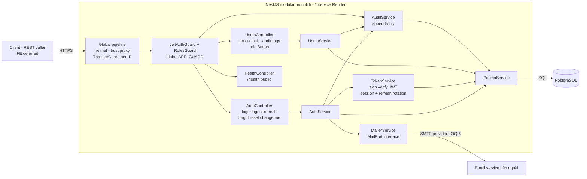
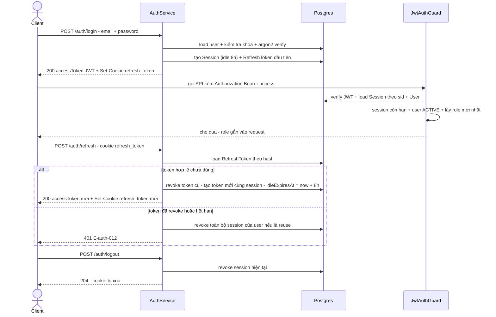

# Auth — Architecture

## 1. Tổng quan

Feature auth chạy trên nền Backend NestJS 12 hiện có (TypeScript strict, ESM, `@nestjs/config`, vitest, oxlint), deploy Render free tier dưới dạng **modular monolith** — 1 service, 1 database. Không microservices, không Redis, không message queue (quy mô nhỏ, Render free; refresh token và mọi trạng thái phiên lưu Postgres — Render free restart/spin-down mất RAM nên không đặt state in-memory).

Các quyết định nền đã chốt: **PostgreSQL + Prisma** (ADR-001), **JWT access 15 phút + session server-side + refresh token rotation** (ADR-002), **argon2id** (ADR-003), **zod + ZodValidationPipe tự viết** (ADR-004). Frontend hoãn — API contract hoàn chỉnh để FE dùng sau (xem `auth-api-contract.md`).

## 2. Kiến trúc tổng thể



Điểm mấu chốt:

- **Mọi request nghiệp vụ** đi qua chuỗi: helmet → trust proxy → ThrottlerGuard (chống flood theo IP) → JwtAuthGuard (xác thực) → RolesGuard (phân quyền) → Controller.
- **Phiên đăng nhập** là bản ghi `Session` trong Postgres (bảng + cơ chế xem `auth-data-model.md`). Access token chỉ là JWT ngắn hạn (15 phút) trỏ vào session qua claim `sid` — nhờ đó thu hồi phiên (đăng xuất, đổi mật khẩu, phát hiện reuse) có hiệu lực **tức thì** đúng NFR-auth-005/BR-auth-009, không phụ thuộc RAM.
- **Audit log** append-only qua `AuditService` — service duy nhất được ghi `AuditLog`, mọi module gọi qua nó để không sót sự kiện (BR-auth-010).

## 3. Module boundaries

```
Backend/src/
  main.ts                        # helmet, trust proxy, global prefix? (không — giữ /health ở gốc), listen PORT
  app.module.ts                  # imports: ConfigModule (đã có), ThrottlerModule, PrismaModule, AuthModule, UsersModule, HealthModule-ish (controllers hiện có)
  config/
    configuration.ts             # mở rộng: đọc env auth vào AppConfig (đã có port/env)
    env.schema.ts                # zod schema validate env lúc boot — fail fast
  common/
    decorators/
      public.decorator.ts        # @Public() — đánh dấu endpoint bỏ qua JwtAuthGuard
      roles.decorator.ts         # @Roles(Role.ADMIN, ...) — khai báo vai trò được phép
      current-user.decorator.ts  # @CurrentUser() — lấy {id, role, sessionId} từ request
    guards/
      jwt-auth.guard.ts          # verify JWT + load Session/User, gia hạn idle
      roles.guard.ts             # so vai trò, log PERMISSION_DENIED (E-auth-011)
    pipes/
      zod-validation.pipe.ts     # ZodValidationPipe — validate body/query theo schema zod
    filters/
      http-exception.filter.ts   # exception filter toàn cục — chuẩn hoá error response (shape JSON thống nhất)
  prisma/
    prisma.module.ts             # global
    prisma.service.ts            # PrismaClient wrapper, onModuleInit + graceful shutdown
  audit/
    audit.module.ts
    audit.service.ts             # write-only API: log(event, {userId, email, reason, sessionId, ip, detail})
  mailer/
    mailer.module.ts
    mailer.port.ts               # interface MailerPort — gửi link đặt lại mật khẩu
    smtp-mailer.service.ts       # impl nodemailer theo SMTP_* env; MAIL_TRANSPORT=console → log link (chỉ dev)
  auth/
    auth.module.ts
    auth.controller.ts           # /auth/*
    auth.service.ts              # nghiệp vụ login/logout/refresh/forgot/reset/change (lockout, anti-enumeration)
    token.service.ts             # sinh/xoay refresh token, sign/verify access JWT
  users/
    users.module.ts
    users.controller.ts          # /admin/users/:id/lock, /unlock; GET /admin/audit-logs
    users.service.ts             # khóa/mở khóa thủ công (BR-auth-008)
  health.controller.ts           # đã có — GET /health public
Backend/prisma/
  schema.prisma                  # nguồn: auth-data-model.md
  seed.ts                        # seed Admin đầu tiên (idempotent)
  migrations/                    # prisma migrate dev
```

| Module | Trách nhiệm | Không làm |
|---|---|---|
| `PrismaModule` | Kết nối DB dùng chung, global | Nghiệp vụ |
| `AuditModule` | Ghi AuditLog append-only, 1 API write duy nhất | Đọc/truy vấn (truy vấn thuộc UsersModule admin) |
| `MailerModule` | Gửi email qua interface `MailerPort` | Sinh token, quyết định nghiệp vụ |
| `AuthModule` | Login/logout/refresh/forgot/reset/change, lockout tự động, anti-enumeration, sinh token | CRUD người dùng, khóa thủ công |
| `UsersModule` | Khóa/mở khóa thủ công (FR-auth-013), tra cứu audit log (US-008) | Tạo/sửa/xóa user — thuộc module quản lý người dùng tương lai (OQ-8) |
| `common/` | Guard, decorator, pipe, exception filter dùng chung | Nghiệp vụ |

Ràng buộc module: `AuthModule`/`UsersModule` gọi `AuditService` và `MailerPort`, KHÔNG gọi trực tiếp `nodemailer` hay viết thẳng vào `AuditLog` từ chỗ khác. Tạo/sửa/xóa người dùng + gán vai trò nằm ngoài scope auth (OQ-8) — khi module quản lý người dùng ra đời sẽ dùng chung `PrismaModule` + `AuditModule`.

## 4. Auth flow — vòng đời access/refresh token



Nguyên tắc vận hành token:

| Thành phần | Giá trị | Lý do |
|---|---|---|
| Access token | JWT HS256, TTL 15 phút, claims `sub` (userId), `sid` (sessionId), `role`, `iat`, `exp`, `iss`, `aud` | Ngắn hạn để thu hồi có hiệu lực gần-tức-thì; `role` trong JWT chỉ để tham chiếu — RolesGuard đọc role **từ DB** mỗi request nên đổi vai trò có hiệu lực ngay |
| Refresh token | chuỗi ngẫu nhiên 48 byte base64url, DB chỉ lưu SHA-256 hash | Rò DB không lộ token dùng được |
| Refresh delivery | HttpOnly Secure SameSite=Lax cookie `refresh_token`, `Path=/auth`, Max-Age 480 phút | Chống XSS lấy trộm refresh; FE sau này served same-origin từ chính service Render nên không vướng CORS (chi tiết + lý do ở contract Mục 3) |
| Session idle | `idleExpiresAt` = now + 8h, gia hạn lười: chỉ UPDATE khi còn < 4h | Đúng BR-auth-004 idle timeout, giảm số write |
| Rotation | mỗi lần refresh revoke token cũ, phát token mới cùng session | Token cũ bị dùng lại → reuse signal |
| Reuse detection | refresh token đã revoked bị đưa ra dùng → revoke toàn bộ session của user + audit `SESSION_REUSE` | Chống token theft, đúng hệ quả E-auth-012 (ghi log dùng phiên đã thu hồi) |
| Thu hồi | logout → revoke session hiện tại; đổi/đặt lại mật khẩu → revoke toàn bộ session **trừ session đang đổi** (BR-auth-009) nhờ `sid` | Hiệu lực tức thì vì guard tra DB mỗi request |
| Tài khoản không ACTIVE | guard từ chối request (401 E-auth-012) khi user ≠ ACTIVE | Khóa/vô hiệu hóa có hiệu lực với phiên đang sống luôn |

Ghi chú cạnh case: khi user bị khóa/vô hiệu giữa phiên, guard trả E-auth-012 ("Phiên đăng nhập đã hết hạn...") — FE sẽ dẫn user về màn login, nơi login trả đúng E-auth-002/E-auth-003 theo trạng thái. Wording chỗ này là xấp xỉ chấp nhận được, ghi rõ trong contract Mục 6.

## 5. Authorization model

- 4 vai trò cố định: `ADMIN`, `HR`, `ACCOUNTANT`, `EMPLOYEE` — Postgres enum (ADR-data: xem `auth-data-model.md` Mục 3), 1 user 1 vai trò (BR-auth-007).
- Chuỗi guard trên mọi request (trừ `@Public`): **ThrottlerGuard → JwtAuthGuard → RolesGuard**.
  - `JwtAuthGuard` đăng ký global qua `APP_GUARD`; endpoint công khai đánh dấu `@Public()`: `/health`, `/auth/login`, `/auth/refresh`, `/auth/forgot-password`, `/auth/reset-password`, `/auth/logout`.
  - `RolesGuard` đọc `@Roles(...)` trên handler; thiếu decorator = mọi vai trò đã đăng nhập đều qua. Từ chối → 403 E-auth-011 + audit `PERMISSION_DENIED` (FR-auth-012).
- Ma trận "chức năng × vai trò" chi tiết thuộc các phân hệ nghiệp vụ sau; auth chỉ cung cấp cơ chế `@Roles` + role trên user.

## 6. Security design

| Chủ đề | Quyết định | Tham chiếu |
|---|---|---|
| Password hashing | argon2id qua `@node-rs/argon2` (prebuilt binary cho alpine), tham số m=19MiB t=2 p=1, lưu PHC string | ADR-003 |
| Timing attack | email không tồn tại vẫn chạy argon2 verify trên **dummy hash** chuẩn bị lúc boot → thời gian phản hồi như nhau (NFR-auth-004) | ADR-003 |
| Anti-enumeration | login + forgot-password trả response/message thống nhất bất kể email tồn tại; quota email đếm theo địa chỉ **bất kể có tồn tại** để 429 không thành oracle | contract Mục 6 |
| Rate limiting | `@nestjs/throttler` global 100 req/phút/IP; login 10/phút/IP; forgot-password 5/phút/IP; riêng quota gửi mail 3/giờ/email (NFR-auth-008) xử lý trong service theo địa chỉ email | cấu hình env dưới |
| Proxy | `app.set('trust proxy', 1)` — Render đặt service sau proxy, không bật thì req.ip sai và throttler/cookie Secure hoạt động sai | main.ts |
| Security headers | `helmet()` mặc định | main.ts |
| Token storage | DB lưu hash (SHA-256) của refresh/reset token; JWT secret ≥ 32 byte random từ env | ADR-002 |
| Audit log | 15 loại sự kiện (superset của 10 loại FR-auth-014 — thêm các event thất bại theo BR-auth-010 + reuse + auto-unlock + PASSWORD_RESET_FAILED); KHÔNG chứa mật khẩu/token/link (NFR-auth-003); `reason` phân loại, `detail` jsonb chỉ chứa dữ liệu không nhạy cảm (vd lý do khóa thủ công BR-auth-008) | data-model Mục 5 |
| CORS | Mặc định đóng; mở khi FE ra đời — nếu FE same-origin (Nest serve static) không cần CORS; nếu khác origin: `CORS_ORIGIN` env + cookie `SameSite=None` (đã phân tích ở contract Mục 3) | contract Mục 3 |

## 7. Cấu hình môi trường (env vars — input cho DevOps)

| Biến | Bắt buộc | Mặc định dev | Ghi chú |
|---|---|---|---|
| `DATABASE_URL` | ✅ | `postgresql://hrm:hrm@db:5432/hrm_accounting` | Prisma; dev qua service `db` trong docker-compose |
| `JWT_ACCESS_SECRET` | ✅ | — | ≥ 32 byte random (`openssl rand -base64 48`); thiếu → boot fail qua env schema |
| `JWT_ACCESS_EXPIRES` | — | `15m` | TTL access token |
| `SESSION_IDLE_MINUTES` | — | `480` | BR-auth-004: 8 giờ |
| `RESET_TOKEN_TTL_HOURS` | — | `24` | BR-auth-005 |
| `LOCKOUT_THRESHOLD` | — | `5` | BR-auth-001 |
| `LOCKOUT_WINDOW_MINUTES` | — | `15` | Cửa sổ đếm sai liên tiếp |
| `LOCKOUT_DURATION_MINUTES` | — | `15` | Thời hạn khóa tạm |
| `RESET_EMAIL_HOURLY_LIMIT` | — | `3` | NFR-auth-008 |
| `MAIL_TRANSPORT` | — | `smtp` | `console` chỉ cho dev — in link ra log thay vì gửi |
| `SMTP_HOST` / `SMTP_PORT` / `SMTP_USER` / `SMTP_PASS` / `MAIL_FROM` | ✅ khi `MAIL_TRANSPORT=smtp` | — | Provider chờ OQ-6 |
| `RESET_LINK_BASE_URL` | ✅ | — | Tiền tố link đặt lại, vd `https://hrm-accounting.onrender.com/reset-password` |
| `ADMIN_INITIAL_EMAIL` / `ADMIN_INITIAL_PASSWORD` / `ADMIN_INITIAL_NAME` | ✅ khi seed | — | Seed Admin đầu tiên; password phải đạt BR-auth-003, seed kiểm tra |
| `CORS_ORIGIN` | — | — | Bật khi FE khác origin |
| `THROTTLE_TTL_MS` / `THROTTLE_LIMIT` | — | `60000` / `100` | Global per IP |
| `NODE_ENV`, `PORT` | đã có | `8000` | Hiện trạng |

Mọi số nghiệp vụ trên là **env-configurable nhưng mặc định bám đúng BR/NFR** — đổi giá trị là việc cấu hình, không đổi hành vi (khớp A-2 trong spec).

## 8. Cơ sở hạ tầng dev + migration + seed

**docker-compose dev (đề xuất sửa `docker-compose.yml`)** — backend engineer áp dụng:

```yaml
services:
  db:
    image: postgres:17-alpine
    environment:
      POSTGRES_USER: hrm
      POSTGRES_PASSWORD: hrm
      POSTGRES_DB: hrm_accounting
    ports:
      - "5432:5432"
    volumes:
      - pgdata:/var/lib/postgresql/data
    healthcheck:
      test: ["CMD-SHELL", "pg_isready -U hrm -d hrm_accounting"]
      interval: 5s
      timeout: 3s
      retries: 10
  api:
    build: ./Backend
    ports:
      - "8000:8000"
    environment:
      DATABASE_URL: postgresql://hrm:hrm@db:5432/hrm_accounting
      # JWT_ACCESS_SECRET, SMTP_*... cung cấp qua .env.development / env của dev
    depends_on:
      db:
        condition: service_healthy
    restart: unless-stopped
    healthcheck: # giữ nguyên healthcheck hiện có
      test: ["CMD", "wget", "-qO-", "http://127.0.0.1:8000/health"]
      interval: 30s
      timeout: 3s
      start_period: 10s
      retries: 3
volumes:
  pgdata:
```

Chọn `postgres:17-alpine`: major ổn định, Prisma hỗ trợ đầy đủ, image alpine khớp pattern hiện có.

**Migration strategy (Prisma Migrate):**

- Dev: `npx prisma migrate dev --name <tên>` — sinh migration + regenerate client; schema.prisma trong repo là nguồn thật.
- Deploy Render: start command chạy `npx prisma migrate deploy && node dist/main.js` — migrate deploy chỉ áp migration đã commit, an toàn cho production, không tương tác. Free tier chạy 1 instance nên không có race giữa các instance đang migrate.
- Không tự generate migration trên production; `prisma db push` KHÔNG dùng (không có lịch sử migration).

**Seed Admin đầu tiên** (trả lời OQ-7 — chốt phương án seed):

- `Backend/prisma/seed.ts` chạy bằng `npx prisma db seed` (khai báo trong package.json `prisma.seed`), **idempotent**: `upsert` theo email — Admin đã tồn tại thì bỏ qua, không ghi đè mật khẩu.
- Đọc `ADMIN_INITIAL_EMAIL`/`ADMIN_INITIAL_PASSWORD`/`ADMIN_INITIAL_NAME`; mật khẩu hash argon2id cùng code path với app (không hash riêng lệch tham số); validate chính sách BR-auth-003 trước khi seed, vi phạm → fail với thông báo rõ.
- Render: chạy seed 1 lần thủ công từ shell sau migrate đầu tiên (hoặc gộp vào start command với guard "chỉ khi chưa có user nào") — quyết định chi tiết để DevOps, ràng buộc: KHÔNG seed mỗi lần deploy bằng mật khẩu mới.

## 9. Traceability — FR → module/component

| FR | Component | Ghi chú kỹ thuật |
|---|---|---|
| FR-auth-001 | `AuthService.login`, `TokenService` | mở Session + 2 token |
| FR-auth-002 | `AuthService.login` + dummy-verify | message thống nhất E-auth-001 |
| FR-auth-003 | `AuthService.login` | kiểm tra LOCKED trước verify, DISABLED sau verify |
| FR-auth-004 | `AuditService` | LOGIN_SUCCESS/LOGIN_FAILURE + reason |
| FR-auth-005 | `AuthService.logout` | idempotent, luôn 204 |
| FR-auth-006 | `JwtAuthGuard` (gia hạn lười) + `TokenService.refresh` | idle 8h BR-auth-004 |
| FR-auth-007 | `AuthService.forgotPassword` | response thống nhất E-auth-005 |
| FR-auth-008 | `AuthService.forgotPassword` + `MailerPort` | revoke link cũ, TTL 24h |
| FR-auth-009 | `AuthService.resetPassword` | revoke session + link + reset counter |
| FR-auth-010/011 | `AuthService.changePassword` | giữ session hiện tại, revoke phần còn lại |
| FR-auth-012 | `RolesGuard` + `@Roles` + `AuditService` | PERMISSION_DENIED → E-auth-011 |
| FR-auth-013 | lockout trong `AuthService.login` + `UsersService.lock/unlock` | BR-auth-001, BR-auth-008 |
| FR-auth-014 | `AuditService` + model `AuditLog` | append-only, 12 tháng (NFR-auth-006, OQ-9) |

## 10. Ghi chú kỹ thuật cho user (không sửa spec)

1. **BR-auth-004 (phiên 8h idle) hiện thực đúng** bằng session sliding window; access token 15 phút là chi tiết kỹ thuật trong suốt với nghiệp vụ — user vẫn "hoạt động liên tục không bị văng".
2. **BR-auth-009 "trừ phiên đang thực hiện thao tác đổi"** hiện thực qua claim `sid`: đổi mật khẩu revoke mọi session trừ session mang `sid` đó. Kết quả: user đổi xong vẫn đứng yên trên thiết bị hiện tại, thiết bị khác bị đăng xuất.
3. **E-auth-012 cho case giữa phiên**: user bị khóa/vô hiệu giữa phiên nhận wording "hết hạn" từ guard (E-auth-002/003 chỉ có ở màn login). Chấp nhận được; nếu muốn wording riêng thì phải bổ sung mã lỗi mới vào spec.
4. **DB production trên Render**: free Postgres của Render hết hạn sau ~30 ngày — cần quyết định DB production thật (Render paid / Supabase / Neon / self-host) trước khi auth lên production. Đây là mục DevOps, ngoài scope tài liệu này nhưng nêu rõ để không bị động.
5. **NFR-auth-007 (cảnh báo sự cố auth)**: hiện chưa có monitoring/alerting ngoài health endpoint — đề xuất ít nhất theo dõi `GET /health` của Render + log error; hệ thống alert đầy đủ là mục DevOps.
6. OQ-6 (nhà cung cấp email) chưa chốt — `MailerPort` cách ly nên chọn provider sau không phải sửa nghiệp vụ.

## References

- [[docs/auth/srs/auth-spec.md|Auth SRS]] — nguồn yêu cầu
- [[docs/auth/architecture/auth-api-contract.md|Auth API Contract]]
- [[docs/auth/architecture/auth-data-model.md|Auth Data Model]]
- [[docs/auth/srs/auth-erd.md|Auth ERD]]
- ADR-001…004 trong `docs/auth/architecture/adr/`
- OWASP Authentication Cheat Sheet, OWASP Password Storage Cheat Sheet
