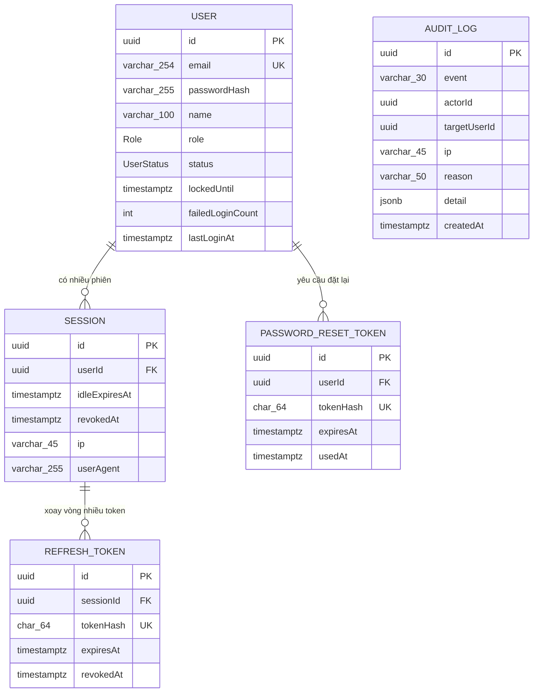

# Auth — Data Model

Data model cho feature auth. Mô tả nghiệp vụ từng bảng ở các Mục 2–6, schema Prisma đầy đủ (nguồn backend engineer copy vào `Backend/prisma/schema.prisma`) ở Mục 8. ERD trực quan xem [[docs/auth/srs/auth-erd.md|Auth ERD]].

Quy ước chung:

- Mọi bảng dùng **cột PK `id String @id @default(uuid(4)) @db.Uuid`** — UUID do app sinh qua Prisma default, tránh lộ số đếm tuần tự.
- Mọi timestamp là `DateTime @db.Timestamptz(3)` — UTC, múi giờ do tầng hiển thị xử lý.
- Audit fields mỗi bảng nghiệp vụ: `createdAt` (bắt buộc), `updatedAt` (bắt buộc, Prisma `@updatedAt`). Bảng append-only (AuditLog) chỉ có `createdAt`.
- Tên bảng/model viết PascalCase singular (`User`, `Session`); cột camelCase, Prisma `@map` sang snake_case ở DB — giữ schema.prisma gọn và DB convention Postgres chuẩn.

## 1. Tổng quan 5 bảng

| Bảng | Mục đích nghiệp vụ | Phục vụ FR/BR chính |
|------|--------------------|---------------------|
| `User` | Tài khoản người dùng: email, password hash, vai trò, trạng thái, đếm sai liên tiếp | FR-auth-001…013, BR-auth-001/003/006/007/008 |
| `Session` | Phiên đăng nhập server-side — nguồn thật của trạng thái "đang đăng nhập" | FR-auth-001/005/006, BR-auth-004/009, NFR-auth-005 |
| `RefreshToken` | Token xoay vòng dùng để kéo dài/gia hạn phiên (lưu hash) | FR-auth-006, BR-auth-004 |
| `PasswordResetToken` | Token một lần đặt lại mật khẩu qua email (lưu hash, TTL 24h) | FR-auth-007…009, BR-auth-005 |
| `AuditLog` | Nhật ký xác thực append-only, 15 loại sự kiện | FR-auth-014, BR-auth-010, NFR-auth-003/006 |

Không tạo bảng `Role` — vai trò là **Postgres enum** (lý do + trade-off ở Mục 3). Không tạo bảng `LoginAttempt` riêng — lockout đếm từ cột trên `User` + `AuditLog` (trade-off ở Mục 7).

## 2. `User`

Tài khoản đăng nhập. Không tự đăng ký (A-1 trong spec) — user được tạo bởi seed admin đầu tiên; sau này bởi module quản lý người dùng (OQ-8).

| Field | Type | Constraint | Nullable | Mục đích |
|-------|------|-----------|----------|----------|
| `id` | `uuid` | PK, default `uuid(4)` | ✗ | Định danh |
| `email` | `varchar(254)` | UNIQUE, NOT NULL | ✗ | Đăng nhập; luôn lưu lowercase + trim (chuẩn hoá ở tầng service trước khi ghi) |
| `passwordHash` | `varchar(255)` | NOT NULL | ✗ | Chuỗi PHC của argon2id (ADR-003) — không bao giờ trả ra API |
| `name` | `varchar(100)` | NOT NULL | ✗ | Tên hiển thị |
| `role` | `Role` (enum) | NOT NULL, default `EMPLOYEE` | ✗ | 1 user 1 vai trò (BR-auth-007) |
| `status` | `UserStatus` (enum) | NOT NULL, default `ACTIVE` | ✗ | `ACTIVE` / `LOCKED` / `DISABLED` |
| `lockedUntil` | `timestamptz(3)` | — | ✓ | Hạn khóa tạm (BR-auth-001). `null` = không khóa. Chỉ có ý nghĩa khi `status = LOCKED` |
| `failedLoginCount` | `integer` | NOT NULL, default `0` | ✗ | Số lần sai **liên tiếp** hiện tại — reset về 0 khi login đúng / đổi / đặt lại mật khẩu / Admin mở khóa |
| `lastLoginAt` | `timestamptz(3)` | — | ✓ | Lần đăng nhập thành công gần nhất (hiển thị ở `/auth/me`) |
| `createdAt` | `timestamptz(3)` | NOT NULL, default `now()` | ✗ | Audit |
| `updatedAt` | `timestamptz(3)` | NOT NULL, `@updatedAt` | ✗ | Audit |

**Indexes:**

| Index | Loại | Lý do |
|-------|------|-------|
| `(email)` | UNIQUE | Lookup login + chống trùng email (FR-auth-001) |

**Trạng thái `status` — quan hệ với `lockedUntil` / `failedLoginCount`:**

| Status | Ý nghĩa | `lockedUntil` | Đặt bởi |
|--------|---------|---------------|---------|
| `ACTIVE` | Đăng nhập bình thường | `null` | default / reset sau unlock |
| `LOCKED` | Khóa tạm | lockout tự động: `now + 15 phút` (BR-auth-001); khóa thủ công Admin: `null` (không tự mở) | login service / `/admin/users/:id/lock` |
| `DISABLED` | Vô hiệu hóa vĩnh viễn | `null` (bỏ qua) | `/admin/users/:id/lock` với `permanent = true` |

Ghi chú: khóa thủ công không TTL dùng chung status `LOCKED` với `lockedUntil = null` — phân biệt với lockout tự động nhờ giá trị `lockedUntil`. Đăng nhập khi `LOCKED` và `lockedUntil > now` → `E-auth-002`; khi `LOCKED` và `lockedUntil <= now` → service tự mở khóa (set `ACTIVE`, reset counter) rồi xử lý login bình thường (auto-unlock, BR-auth-001 hết hạn). `DISABLED` → `E-auth-003`, chỉ Admin mở được.

## 3. `Role` — enum hay bảng?

**Chốt: Postgres enum `Role` với 4 giá trị `ADMIN` / `HR` / `ACCOUNTANT` / `EMPLOYEE` — KHÔNG tạo bảng Role.**

Trade-off:

| Phương án | Ưu | Nhược |
|-----------|-----|-------|
| **Enum** ✓ | Đơn giản, type-safe ở cả DB + Prisma client (không join khi guard load role); BR-auth-007 cố định 4 vai trò, không có UI CRUD vai trò; guard so sánh trực tiếp | Thêm/xóa vai trò cần migration |
| Bảng `Role` + join | CRUD vai trò không cần migration; gắn metadata (mô tả) | Thêm 1 bảng + relation chỉ để đọc 1 chuỗi mỗi request; không có yêu cầu nghiệp vụ nào cần CRUD vai trò (1 user 1 vai trò cố định — BR-auth-007) |

Nhược "cần migration khi thêm vai trò" chấp nhận được: thêm vai trò là sự kiện nghiệp vụ hiếm và là thay đổi code anyway (mỗi vai trò cần `@Roles` + logic phân hệ tương ứng). Khi 2FA/social login (OQ-1/OQ-2) ra đời, enum này không ảnh hưởng — chúng bổ sung phương thức xác thực, không đổi mô hình vai trò.

## 4. `Session` + `RefreshToken`

Hai bảng phục vụ vòng đời phiên (ADR-002: session server-side + JWT access ngắn hạn trỏ vào session).

### 4.1 `Session`

Bản ghi "đang đăng nhập" — nguồn thật; access token chỉ là vé ngắn hạn trỏ vào đây qua claim `sid`. Logout / đổi mật khẩu / khóa user = thao tác trên bảng này → hiệu lực tức thì vì JwtAuthGuard tra DB mỗi request (NFR-auth-005, BR-auth-009).

| Field | Type | Constraint | Nullable | Mục đích |
|-------|------|-----------|----------|----------|
| `id` | `uuid` | PK | ✗ | Định danh; đồng thời là claim `sid` trong access token |
| `userId` | `uuid` | FK → `User.id`, ON DELETE CASCADE, NOT NULL | ✗ | Chủ phiên |
| `idleExpiresAt` | `timestamptz(3)` | NOT NULL, index | ✗ | Hạn idle — BR-auth-004: now + 8h, gia hạn lười (chỉ UPDATE khi còn < 4h) |
| `revokedAt` | `timestamptz(3)` | — | ✓ | Thời điểm thu hồi. `null` = phiên còn sống. Logout/reset-password/khóa user/reuse-detection set cột này |
| `ip` | `varchar(45)` | — | ✓ | IP lúc đăng nhập (IPv6 tối đa 45 ký tự) — phục vụ audit/tra cứu phiên |
| `userAgent` | `varchar(255)` | — | ✓ | User-Agent lúc đăng nhập (cắt 255) — hiển thị "phiên của bạn ở thiết bị nào" |
| `createdAt` | `timestamptz(3)` | NOT NULL, default `now()` | ✗ | Audit |

**Indexes:**

| Index | Loại | Lý do |
|-------|------|-------|
| `(userId)` | B-tree | Guard load session theo user; revoke "toàn bộ session của user" |
| `(idleExpiresAt)` | B-tree | Dọn phiên hết hạn định kỳ (cleanup job) |
| `(revokedAt)` | B-tree (partial WHERE NULL ở migration SQL nếu cần) | Lọc phiên còn sống |

**Vòng đời `Session` (khớp `auth-states.md`):** tạo lúc login → sống (`revokedAt = null`) → hết hạn idle (`idleExpiresAt` quá khứ, guard từ chối) hoặc bị thu hồi (`revokedAt` set). Phiên hết hạn/thu hồi không xóa ngay — cleanup job xóa bản ghi quá hạn > 30 ngày (dọn dẹp, không phải nghiệp vụ).

### 4.2 `RefreshToken`

Token xoay vòng (rotation). Lưu **SHA-256 hash** của token — rò DB không lộ token dùng được (ADR-002).

| Field | Type | Constraint | Nullable | Mục đích |
|-------|------|-----------|----------|----------|
| `id` | `uuid` | PK | ✗ | Định danh |
| `sessionId` | `uuid` | FK → `Session.id`, ON DELETE CASCADE, NOT NULL, index | ✗ | Phiên sở hữu token |
| `tokenHash` | `char(64)` | UNIQUE, NOT NULL | ✗ | SHA-256 hex (64 ký tự) của token raw — lookup duy nhất khi refresh |
| `expiresAt` | `timestamptz(3)` | NOT NULL, index | ✗ | Hạn token = `createdAt + 8h` (cùng idle window BR-auth-004) |
| `revokedAt` | `timestamptz(3)` | — | ✓ | Thời điểm xoay/thu hồi. `null` = token còn dùng được. Rotation set `revokedAt` cho token cũ; token đã revoked bị dùng lại = reuse signal |
| `createdAt` | `timestamptz(3)` | NOT NULL, default `now()` | ✗ | Audit |

**Indexes:**

| Index | Loại | Lý do |
|-------|------|-------|
| `(tokenHash)` | UNIQUE | Lookup refresh theo hash — path nóng nhất |
| `(sessionId)` | B-tree | Xoay token / revoke theo phiên |

**Luật rotation (FR-auth-006):** refresh hợp lệ → `revokedAt = now` cho token cũ + insert token mới cùng `sessionId`, `expiresAt = now + 8h` + gia hạn `Session.idleExpiresAt` (lazy). Token cũ xuất hiện lại → **reuse detection**: revoke toàn bộ Session của user + audit `SESSION_REUSE` (E-auth-012).

## 5. `PasswordResetToken`

Token một lần đặt lại mật khẩu qua email (FR-auth-007…009, BR-auth-005 TTL 24h). Lưu hash như RefreshToken.

| Field | Type | Constraint | Nullable | Mục đích |
|-------|------|-----------|----------|----------|
| `id` | `uuid` | PK | ✗ | Định danh |
| `userId` | `uuid` | FK → `User.id`, ON DELETE CASCADE, NOT NULL, index | ✗ | Người yêu cầu |
| `tokenHash` | `char(64)` | UNIQUE, NOT NULL | ✗ | SHA-256 hex của token raw trong link email |
| `expiresAt` | `timestamptz(3)` | NOT NULL, index | ✗ | `createdAt + 24h` (BR-auth-005) |
| `usedAt` | `timestamptz(3)` | — | ✓ | Thời điểm dùng. `null` = chưa dùng |
| `createdAt` | `timestamptz(3)` | NOT NULL, default `now()` | ✗ | Audit — cũng là mốc đếm quota 3 email/giờ (NFR-auth-008) |

**Indexes:** `(tokenHash)` UNIQUE · `(userId)` · `(expiresAt)` (cleanup).

**Luật nghiệp vụ:** yêu cầu mới → revoke (set `usedAt = now` cho) mọi token cũ chưa dùng của user — chỉ 1 link hợp lệ tại 1 thời điểm (FR-auth-008). Dùng thành công → mark `usedAt` + revoke session + reset `failedLoginCount` (FR-auth-009). Token hết hạn/dùng rồi → `E-auth-007`. Cleanup job xóa token quá hạn > 30 ngày.

## 6. `AuditLog`

Nhật ký xác thực append-only (FR-auth-014, BR-auth-010). 15 loại event liệt kê trong `auth-api-contract.md` Mục 7. `AuditService` là writer duy nhất; KHÔNG có update/delete trong code.

| Field | Type | Constraint | Nullable | Mục đích |
|-------|------|-----------|----------|----------|
| `id` | `uuid` | PK | ✗ | Định danh |
| `event` | `AuditEvent` (enum 15 giá trị) | NOT NULL, index | ✗ | Loại sự kiện |
| `actorId` | `uuid` | — | ✓ | Người thực hiện hành động (login user, admin khóa). `null` = sự kiện hệ thống hoặc hành động thất bại không xác thực được |
| `actorEmail` | `varchar(254)` | — | ✓ | Email lúc sự kiện xảy ra — denormalize cố ý: user có thể bị xóa/sửa email sau này, log vẫn đọc được |
| `targetUserId` | `uuid` | — | ✓ | User bị tác động (vd Admin khóa user X → target = X). Bằng `actorId` với sự kiện tự thao tác |
| `targetEmail` | `varchar(254)` | — | ✓ | Denormalize như `actorEmail` |
| `sessionId` | `uuid` | — | ✓ | Phiên liên quan (nếu có) — truy vết phiên bị revoke |
| `ip` | `varchar(45)` | — | ✓ | IP nguồn |
| `userAgent` | `varchar(255)` | — | ✓ | Trình duyệt/thiết bị |
| `reason` | `varchar(50)` | — | ✓ | Phân loại lỗi ngắn (enum-string, vd `INVALID_PASSWORD`, `ACCOUNT_LOCKED`, `EMAIL_NOT_FOUND` — bảng value ở contract Mục 7) |
| `detail` | `jsonb` | — | ✓ | Dữ liệu bổ sung KHÔNG nhạy cảm (`attemptNumber`, `path`, `requiredRole`, `lockedUntil`…). NFR-auth-003: không chứa password/token/link |
| `createdAt` | `timestamptz(3)` | NOT NULL, default `now()`, index | ✗ | Thời điểm sự kiện — append-only, không `updatedAt` |

**Indexes:**

| Index | Loại | Lý do |
|-------|------|-------|
| `(createdAt)` | B-tree DESC | Query mặc định `/admin/audit-logs` sort mới nhất + cursor pagination |
| `(event)` | B-tree | Lọc theo loại sự kiện |
| `(actorId)` | B-tree | Lọc theo người thực hiện |
| `(targetUserId)` | B-tree | Lọc theo người bị tác động |

**Retention:** giữ tối thiểu 12 tháng (NFR-auth-006, OQ-9 — chốt phương án lưu đủ 12 tháng, xóa/c.archive sau đó là quyết định vận hành sau). KHÔNG dùng `ON DELETE CASCADE` từ User — `actorId`/`targetUserId` là tham chiếu **logic** (không FK) để xóa user không mất log. Cả 2 cột chỉ là UUID trần + index; toàn vẹn do tầng service đảm bảo khi ghi.

## 7. LoginAttempt — có cần bảng riêng?

**Chốt: KHÔNG tạo bảng `LoginAttempt`.** Lockout 5 sai/15 phút (BR-auth-001) hiện thực bằng 2 nguồn có sẵn:

| Nguồn | Vai trò trong lockout |
|-------|-----------------------|
| `User.failedLoginCount` | Đếm sai liên tiếp — atomic `UPDATE ... SET failedLoginCount = failedLoginCount + 1` trong transaction login, nhanh, 1 row/user |
| `AuditLog` (`LOGIN_FAILURE`, `ACCOUNT_LOCKED_AUTO`) | Lịch sử đầy đủ từng lần sai — tra cứu/điều tra khi cần; không dùng để đếm real-time |

Trade-off với phương án bảng riêng `LoginAttempt(email, ip, createdAt)`:

| | Dùng `failedLoginCount` + AuditLog ✓ | Bảng `LoginAttempt` riêng |
|---|---|---|
| Lockout real-time | 1 UPDATE trên row User đã load sẵn — rẻ | Thêm INSERT + COUNT query mỗi lần login |
| Window "15 phút" | Reset counter khi login đúng/khóa/mở khóa; cửa sổ tính theo `lockedUntil` khi khóa + timestamp của `ACCOUNT_LOCKED_AUTO` | Đếm `COUNT WHERE createdAt > now - 15m` — chính xác hơn với window trượt |
| Điều tra | Đủ (AuditLog có từng lần sai + ip + reason) | Giống AuditLog → trùng lặp dữ liệu |
| Bảng/table growth | Không thêm | Thêm 1 bảng write-hot giống AuditLog |

Sự khác biệt duy nhất là chính xác cửa sổ trượt giữa các lần sai rời rạc — với ngưỡng 5 sai và Render free (traffic nhỏ), khác biệt không đáng kể so với chi phí bảng + query thêm. Mã lockout tự động (`ACCOUNT_LOCKED_AUTO`) ghi vào AuditLog kèm `lockedUntil` trong `detail` để truy vết. Nếu sau này cần phân tích brute-force theo IP chi tiết (nhiều email từ 1 IP), khi đó thêm bảng riêng — mở rộng không phá schema hiện tại.

## 8. Schema Prisma dự thảo (copy vào `Backend/prisma/schema.prisma`)

```prisma
// ============================================================
// HRM-Accounting — Auth data model
// Nguồn: docs/auth/architecture/auth-data-model.md
// Database: PostgreSQL (ADR-001) — Prisma 6.x
// ============================================================

generator client {
  provider = "prisma-client-js"
}

datasource db {
  provider = "postgresql"
  url      = env("DATABASE_URL")
}

// ---------- Enums ----------

enum Role {
  ADMIN
  HR
  ACCOUNTANT
  EMPLOYEE
}

enum UserStatus {
  ACTIVE
  LOCKED
  DISABLED
}

enum AuditEvent {
  LOGIN_SUCCESS
  LOGIN_FAILURE
  LOGIN_FAILURE_LOCKED
  LOGIN_FAILURE_DISABLED
  LOGOUT
  PASSWORD_RESET_REQUESTED
  PASSWORD_RESET_COMPLETED
  PASSWORD_CHANGED
  PASSWORD_CHANGE_FAILED
  ACCOUNT_LOCKED_AUTO
  ACCOUNT_LOCKED_MANUAL
  ACCOUNT_UNLOCKED_MANUAL
  PERMISSION_DENIED
  SESSION_REUSE
}

// ---------- Models ----------

model User {
  id               String     @id @default(uuid()) @db.Uuid
  email            String     @unique @db.VarChar(254)
  passwordHash     String     @db.VarChar(255)
  name             String     @db.VarChar(100)
  role             Role       @default(EMPLOYEE)
  status           UserStatus @default(ACTIVE)
  lockedUntil      DateTime?  @db.Timestamptz(3)
  failedLoginCount Int        @default(0)
  lastLoginAt      DateTime?  @db.Timestamptz(3)
  createdAt        DateTime   @default(now()) @db.Timestamptz(3)
  updatedAt        DateTime   @updatedAt @db.Timestamptz(3)

  sessions            Session[]
  refreshTokens       RefreshToken[]
  passwordResetTokens PasswordResetToken[]

  @@map("users")
}

model Session {
  id            String    @id @default(uuid()) @db.Uuid
  userId        String    @db.Uuid
  idleExpiresAt DateTime  @db.Timestamptz(3)
  revokedAt     DateTime? @db.Timestamptz(3)
  ip            String?   @db.VarChar(45)
  userAgent     String?   @db.VarChar(255)
  createdAt     DateTime  @default(now()) @db.Timestamptz(3)

  user          User          @relation(fields: [userId], references: [id], onDelete: Cascade)
  refreshTokens RefreshToken[]

  @@index([userId])
  @@index([idleExpiresAt])
  @@index([revokedAt])
  @@map("sessions")
}

model RefreshToken {
  id        String    @id @default(uuid()) @db.Uuid
  sessionId String    @db.Uuid
  tokenHash String    @unique @db.Char(64)
  expiresAt DateTime  @db.Timestamptz(3)
  revokedAt DateTime? @db.Timestamptz(3)
  createdAt DateTime  @default(now()) @db.Timestamptz(3)

  session Session @relation(fields: [sessionId], references: [id], onDelete: Cascade)

  @@index([sessionId])
  @@index([expiresAt])
  @@map("refresh_tokens")
}

model PasswordResetToken {
  id        String    @id @default(uuid()) @db.Uuid
  userId    String    @db.Uuid
  tokenHash String    @unique @db.Char(64)
  expiresAt DateTime  @db.Timestamptz(3)
  usedAt    DateTime? @db.Timestamptz(3)
  createdAt DateTime  @default(now()) @db.Timestamptz(3)

  user User @relation(fields: [userId], references: [id], onDelete: Cascade)

  @@index([userId])
  @@index([expiresAt])
  @@map("password_reset_tokens")
}

model AuditLog {
  id           String     @id @default(uuid()) @db.Uuid
  event        AuditEvent @db.VarChar(30)
  actorId      String?    @db.Uuid
  actorEmail   String?    @db.VarChar(254)
  targetUserId String?    @db.Uuid
  targetEmail  String?    @db.VarChar(254)
  sessionId    String?    @db.Uuid
  ip           String?    @db.VarChar(45)
  userAgent    String?    @db.VarChar(255)
  reason       String?    @db.VarChar(50)
  detail       Json?
  createdAt    DateTime   @default(now()) @db.Timestamptz(3)

  @@index([createdAt(sort: Desc)])
  @@index([event])
  @@index([actorId])
  @@index([targetUserId])
  @@map("audit_logs")
}
```

Ghi chú schema:

- `@map("users")` v.v. — tên bảng snake_case plural ở DB (Postgres convention); model Prisma giữ PascalCase singular.
- `AuditLog.actorId`/`targetUserId` **không có relation/FK** — cố ý (Mục 6): xóa user không mất log (append-only). Toàn vẹn do service đảm bảo.
- `onDelete: Cascade` cho Session/RefreshToken/PasswordResetToken: xóa user thì dọn sạch token phiên — hợp lý vì đây là dữ liệu phiên, không phải dữ liệu lịch sử pháp lý (AuditLog mới là).
- Prisma không hỗ trợ partial index trong DSL (phiên bản 6.x) — index `(revokedAt)` dùng B-tree thường; query hot luôn kèm điều kiện thời gian nên hiệu năng đủ. Tinh chỉnh sau nếu đo được vấn đề.
- Mỗi lần refresh sinh 1 row RefreshToken mới + revoke row cũ → bảng tăng trưởng theo hoạt động; cleanup job (xóa token hết hạn/thu hồi > 30 ngày) giữ kích thước ổn định. Job chạy cron trong app (`@nestjs/schedule`) — chi tiết implementation để backend engineer.

## 9. Sơ đồ quan hệ



`AUDIT_LOG` đứng độc lập trong diagram — không vẽ line tới `USER` vì tham chiếu logic không FK (Mục 6).

## References

- [[docs/auth/srs/auth-spec.md|Auth SRS]] — FR/NFR/BR nguồn
- [[docs/auth/srs/auth-erd.md|Auth ERD]] — sơ đồ quan hệ
- [[docs/auth/architecture/auth-architecture.md|Auth Architecture]] — module boundaries + token lifecycle
- [[docs/auth/architecture/auth-api-contract.md|Auth API Contract]] — endpoint + audit event list
- [[docs/auth/architecture/adr/ADR-001-postgresql-prisma.md|ADR-001 PostgreSQL + Prisma]]
- [[docs/auth/architecture/adr/ADR-002-auth-strategy.md|ADR-002 Auth Strategy]] — session server-side + rotation
