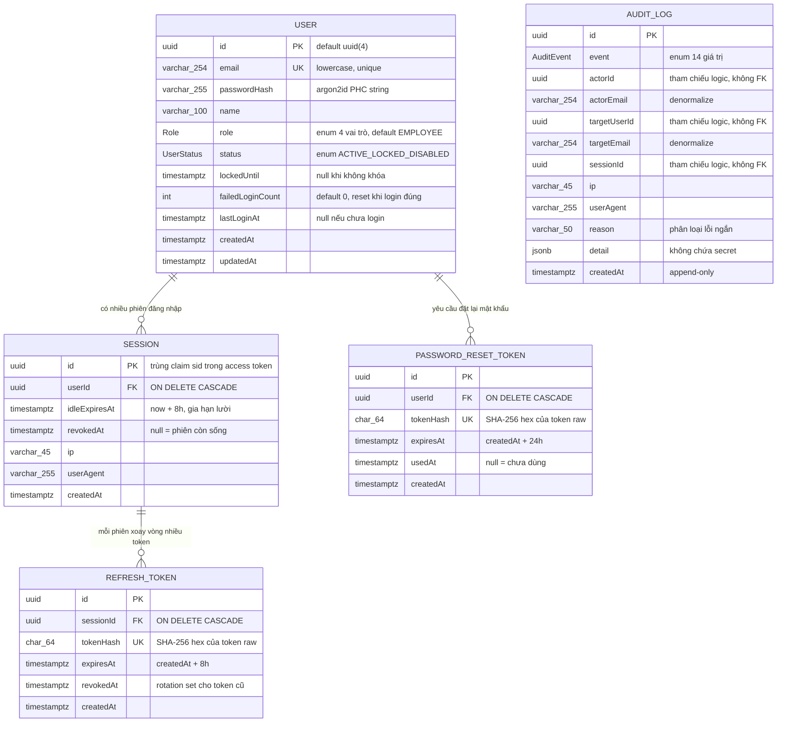

# Auth — ERD

Sơ đồ quan hệ thực thể cho data model auth. Bảng mô tả chi tiết + schema Prisma nguồn ở [[docs/auth/architecture/auth-data-model.md|Auth Data Model]].

Ghi chú đọc diagram:

- **AUDIT_LOG đứng độc lập** — `actorId`/`targetUserId`/`sessionId` là tham chiếu **logic** (không FK) để xóa User không mất log (append-only, giữ 12 tháng theo NFR-auth-006). Line tới USER không vẽ để phản ánh đúng DB.
- **Role / UserStatus / AuditEvent** là enum Postgres, không phải bảng — vẽ trong attribute block (chi tiết giá trị enum ở data-model Mục 3 + 8).
- **Cardinality:** 1 User có nhiều Session; 1 Session có nhiều RefreshToken (rotation); 1 User có nhiều PasswordResetToken nhưng chỉ token mới nhất chưa dùng còn hợp lệ (yêu cầu mới revoke token cũ — FR-auth-008).
