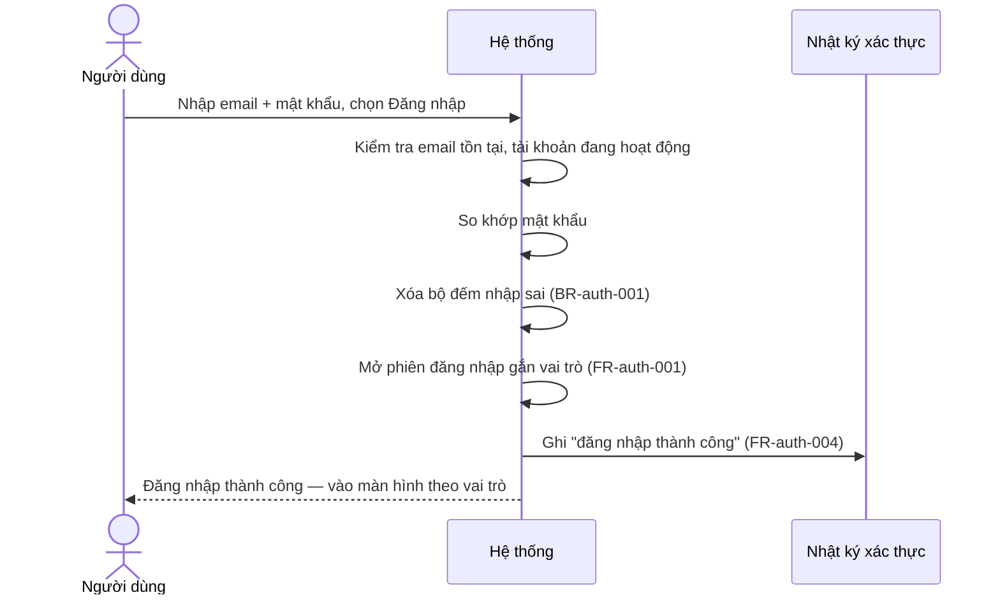
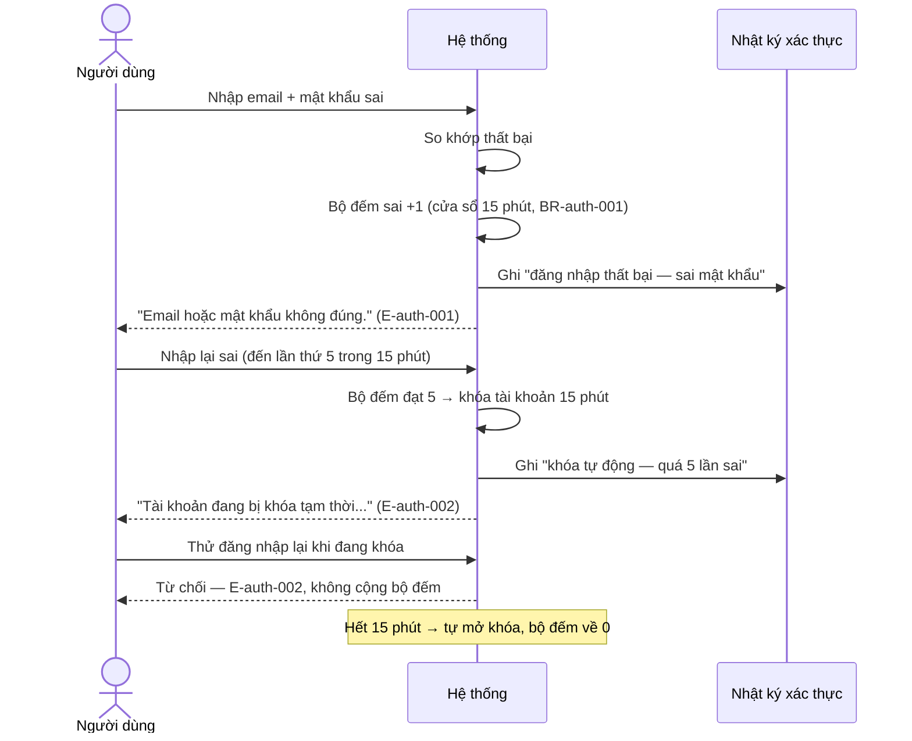
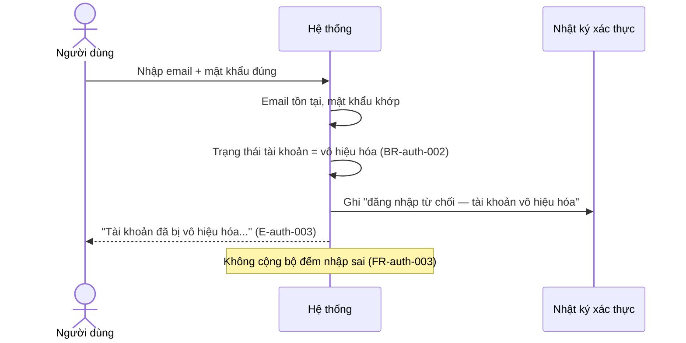
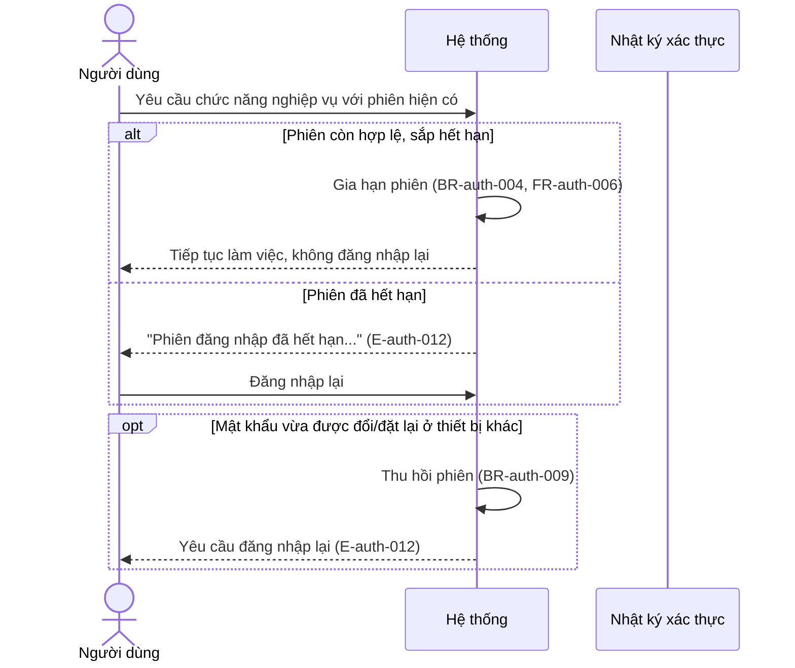
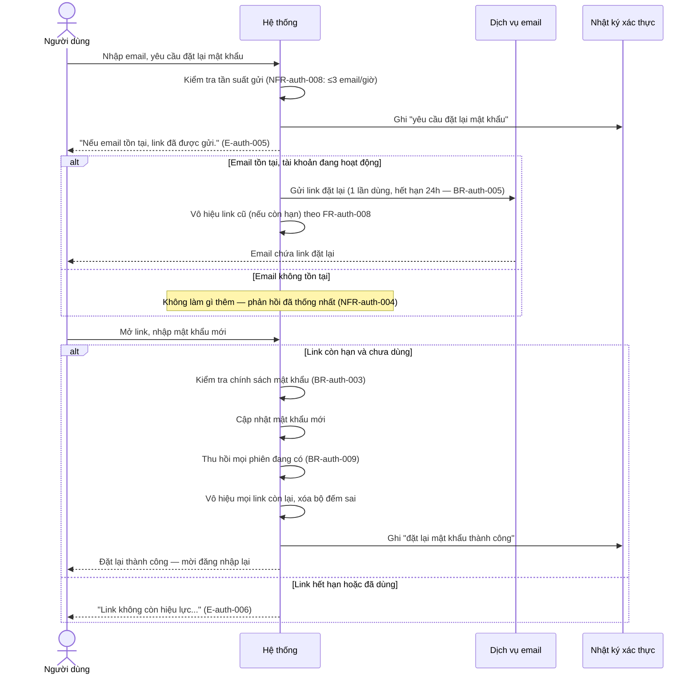
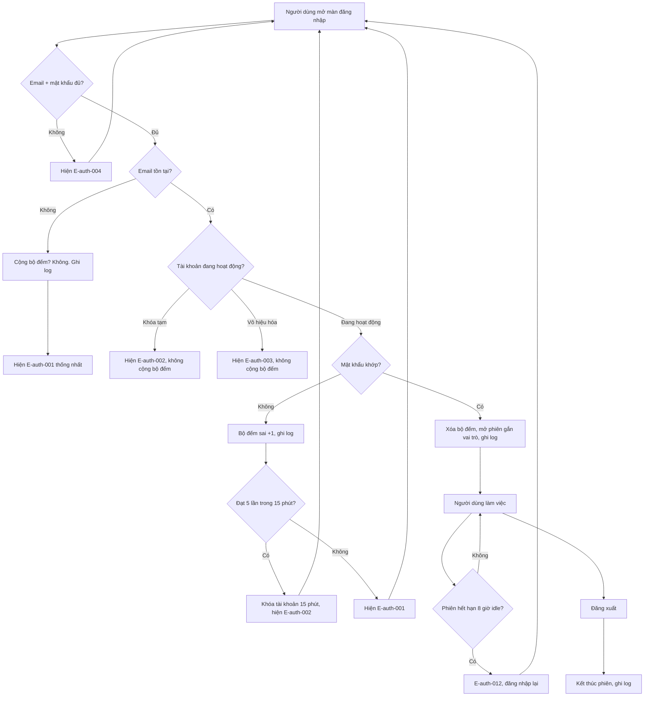
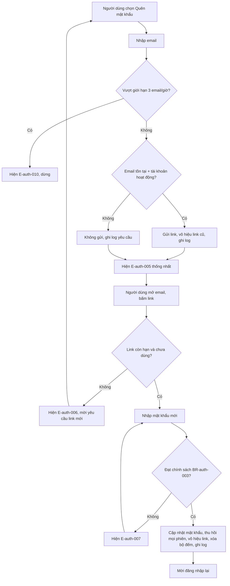

# Auth — Flows (Sequence & Activity)

Các luồng tương tác giữa người dùng và hệ thống cho feature auth. Giá trị số bám [[docs/auth/srs/auth-spec.md|Auth SRS]] (BR-auth-001, BR-auth-004, BR-auth-005).

## Flow: Đăng nhập thành công

## Flow: Đăng nhập sai mật khẩu dẫn đến khóa tài khoản

## Flow: Đăng nhập khi tài khoản bị vô hiệu hóa

## Flow: Làm mới phiên đăng nhập

## Flow: Đặt lại mật khẩu qua email

## Flow: Hoạt động xác thực (Activity tổng hợp)

## Flow: Khôi phục mật khẩu (Activity)

