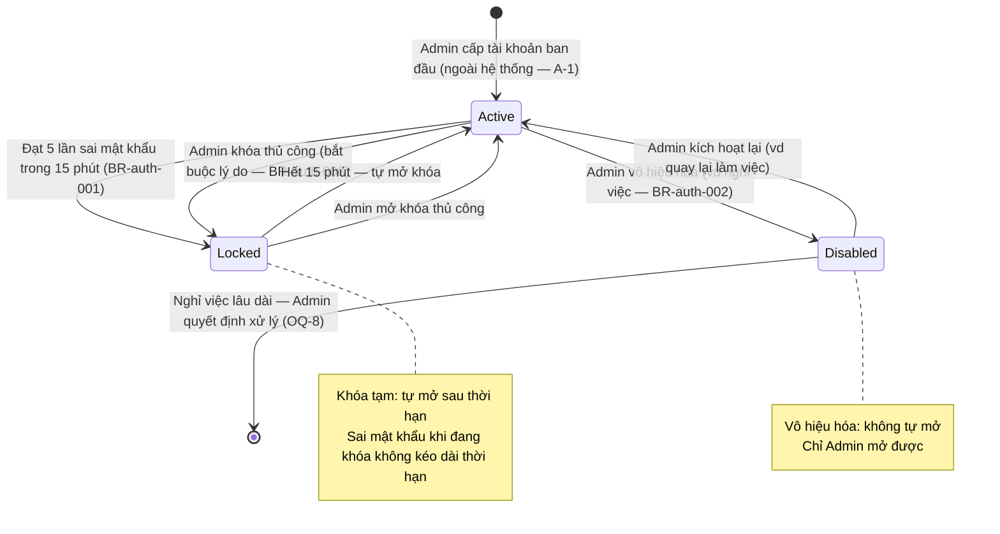
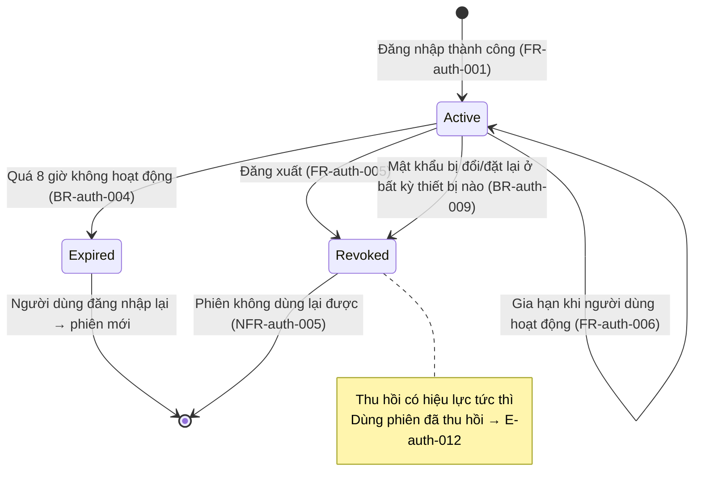

# Auth — States (State Diagrams)

Vòng đời của Tài khoản và Phiên đăng nhập. Trigger bám [[docs/auth/srs/auth-spec.md|Auth SRS]] (FR-auth-013, BR-auth-001, BR-auth-002, BR-auth-004).

## State: Tài khoản

Trạng thái:

| Trạng thái | Ý nghĩa | Ai mở được |
|-----------|---------|-----------|
| Active | Đang hoạt động — đăng nhập bình thường | — |
| Locked | Khóa tạm do sai mật khẩu lặp lại hoặc Admin khóa | Tự mở khi hết hạn, hoặc Admin |
| Disabled | Vô hiệu hóa do Admin quyết định | Chỉ Admin |

## State: Phiên đăng nhập

Trạng thái:

| Trạng thái | Ý nghĩa | Chuyển tiếp được phép |
|-----------|---------|----------------------|
| Active | Đang hiệu lực, được gia hạn khi hoạt động | Revoked, Expired |
| Expired | Hết hạn do quá thời gian idle | Kết thúc (đăng nhập lại tạo phiên mới) |
| Revoked | Thu hồi do đăng xuất hoặc đổi/đặt lại mật khẩu | Kết thúc — không khôi phục |
