# Payroll Data — Mô hình Dữ liệu: Dữ liệu Tính Lương (Payroll Input Data Model)

Tài liệu này định nghĩa chi tiết mô hình dữ liệu quan hệ (Entity-Relationship Diagram, Prisma Schema mở rộng, PostgreSQL DDL Constraints, Enums, Composite Indexes, và Cascading Rules) cho phân hệ **Dữ liệu tính lương** (`du_lieu_tinh_luong`).

---

## 1. Sơ đồ Quan hệ Thực thể Tổng thể (Entity Relationship Diagram)

Mô hình dữ liệu tuân thủ triết lý **Domain-Driven Hybrid Catalog** (ADR-001):
- Tái sử dụng danh mục `SalaryItem` (`PERIODIC_BONUS` và `COMMISSION_PERCENTAGE`) từ phân hệ Cài đặt lương để tránh trùng lặp cấu hình thuế & bảo hiểm.
- Thiết lập 4 danh mục chuyên biệt (`KpiItem`, `PieceworkProduct`, `DiligenceViolationType`, `SalaryAdjustmentItem`) do có thuộc tính nghiệp vụ đặc thù (trọng số, đơn vị tính, chiều bù/trừ, cách phạt).
- Quản lý 8 bảng bản ghi chi tiết theo chu kỳ tính lương (`PayrollPeriod`) và nhân viên (`Employee`).
- Chốt kết quả tính toán đóng băng vào bảng tổng hợp `PayrollSheetLine` khi kỳ lương đạt trạng thái `LOCKED`.

```mermaid
erDiagram
    %% Core Master & Periods
    User ||--o{ PayrollPeriod : "locked_by / approved_by"
    Employee ||--o{ AttendanceRecord : "cham_cong"
    Employee ||--o{ OvertimeRecord : "tang_ca"
    Employee ||--o{ KpiRecord : "kpi"
    Employee ||--o{ BonusRecord : "thuong"
    Employee ||--o{ PieceworkRecord : "luong_sp"
    Employee ||--o{ CommissionRecord : "luong_pt"
    Employee ||--o{ DiligenceRecord : "chuyen_can"
    Employee ||--o{ SalaryAdjustmentRecord : "bu_tru"
    Employee ||--o{ PayrollSheetLine : "nhan_luong"

    PayrollPeriod ||--o{ AttendanceRecord : "chua"
    PayrollPeriod ||--o{ OvertimeRecord : "chua"
    PayrollPeriod ||--o{ KpiRecord : "chua"
    PayrollPeriod ||--o{ BonusRecord : "chua"
    PayrollPeriod ||--o{ PieceworkRecord : "chua"
    PayrollPeriod ||--o{ CommissionRecord : "chua"
    PayrollPeriod ||--o{ DiligenceRecord : "chua"
    PayrollPeriod ||--o{ SalaryAdjustmentRecord : "chua"
    PayrollPeriod ||--o{ PayrollSheetLine : "chot_snapshot"

    %% Master Catalogs
    KpiItem ||--o{ KpiRecord : "dinh_nghia"
    PieceworkProduct ||--o{ PieceworkRecord : "don_gia_snapshot"
    SalaryItem ||--o{ BonusRecord : "loai_thuong (PERIODIC_BONUS)"
    SalaryItem ||--o{ CommissionRecord : "loai_hoa_hong (COMMISSION_PERCENTAGE)"
    DiligenceViolationType ||--o{ DiligenceRecord : "quy_dinh_loi"
    SalaryAdjustmentItem ||--o{ SalaryAdjustmentRecord : "quy_dinh_khoan"

    %% Entity Details
    PayrollPeriod {
        Uuid id PK
        VarChar code UK "2026-08"
        VarChar name
        Int month
        Int year
        Date startDate
        Date endDate
        PayrollPeriodStatus status "DRAFT..ARCHIVED"
        Uuid lockedByUserId FK "Nullable"
        DateTime lockedAt "Nullable"
        Uuid approvedByUserId FK "Nullable"
        DateTime approvedAt "Nullable"
        DateTime createdAt
        DateTime updatedAt
    }

    AttendanceRecord {
        Uuid id PK
        Uuid periodId FK
        Uuid employeeId FK
        Date workDate "YYYY-MM-DD"
        AttendanceType attendanceType
        Decimal actualHours "0.00 - 24.00"
        Decimal workDayValue "0.00 - 1.00"
        VarChar note
        DateTime createdAt
        DateTime updatedAt
    }

    OvertimeRecord {
        Uuid id PK
        Uuid periodId FK
        Uuid employeeId FK
        OvertimeType otType
        Decimal hours "> 0"
        Decimal ratePercent "150.00 .. 390.00"
        Decimal convertedHours "hours * ratePercent / 100"
        VarChar note
        DateTime createdAt
        DateTime updatedAt
    }

    KpiItem {
        Uuid id PK
        VarChar code UK "KPI01..KPI99"
        VarChar name
        VarChar unit
        Int defaultWeight "0 .. 100"
        CatalogStatus status "ACTIVE, INACTIVE"
        DateTime createdAt
        DateTime updatedAt
    }

    KpiRecord {
        Uuid id PK
        Uuid periodId FK
        Uuid employeeId FK
        Uuid kpiItemId FK
        Int weight ">= 0"
        Decimal targetValue "> 0"
        Decimal actualValue
        Decimal completionRate "actual / target * 100"
        VarChar note
        DateTime createdAt
        DateTime updatedAt
    }

    BonusRecord {
        Uuid id PK
        Uuid periodId FK
        Uuid employeeId FK
        Uuid salaryItemId FK "SalaryItem (PERIODIC_BONUS)"
        Int amount "VND >= 0"
        VarChar note
        DateTime createdAt
        DateTime updatedAt
    }

    PieceworkProduct {
        Uuid id PK
        VarChar code UK "SP01..SP99"
        VarChar name
        VarChar unit
        Int unitPrice "VND >= 0"
        CatalogStatus status "ACTIVE, INACTIVE"
        DateTime createdAt
        DateTime updatedAt
    }

    PieceworkRecord {
        Uuid id PK
        Uuid periodId FK
        Uuid employeeId FK
        Uuid productId FK
        Int unitPrice "Snapshot don gia VND"
        Decimal quantity ">= 0"
        Int totalAmount "unitPrice * quantity"
        VarChar note
        DateTime createdAt
        DateTime updatedAt
    }

    CommissionRecord {
        Uuid id PK
        Uuid periodId FK
        Uuid employeeId FK
        Uuid salaryItemId FK "SalaryItem (COMMISSION_PERCENTAGE)"
        Int baseAmount "Doanh so co so VND >= 0"
        Decimal commissionRate "Snapshot ty le % (0..100)"
        Int totalAmount "baseAmount * rate / 100"
        VarChar note
        DateTime createdAt
        DateTime updatedAt
    }

    DiligenceViolationType {
        Uuid id PK
        VarChar code UK "CC01..CC99"
        VarChar name
        DiligenceDeductionMethod deductionMethod "theo_gio, theo_lan, mat_toan_bo"
        Int penaltyRate "VND"
        CatalogStatus status "ACTIVE, INACTIVE"
        DateTime createdAt
        DateTime updatedAt
    }

    DiligenceRecord {
        Uuid id PK
        Uuid periodId FK
        Uuid employeeId FK
        Uuid violationTypeId FK
        Date violationDate
        Decimal violationHours "0.00 .. 24.00"
        VarChar note
        DateTime createdAt
        DateTime updatedAt
    }

    SalaryAdjustmentItem {
        Uuid id PK
        VarChar code UK "BT01..BT99"
        VarChar name
        AdjustmentDirection direction "tru, bu"
        CatalogStatus status "ACTIVE, INACTIVE"
        DateTime createdAt
        DateTime updatedAt
    }

    SalaryAdjustmentRecord {
        Uuid id PK
        Uuid periodId FK
        Uuid employeeId FK
        Uuid adjustmentItemId FK
        Int amount "So tien duong VND > 0"
        VarChar note
        DateTime createdAt
        DateTime updatedAt
    }

    PayrollSheetLine {
        Uuid id PK
        Uuid periodId FK
        Uuid employeeId FK
        VarChar employeeCode
        VarChar fullName
        VarChar departmentName
        VarChar positionName
        ContractType contractType
        SalaryType salaryType
        Int dependentCount
        Int baseSalaryMonthly
        Decimal standardWorkDays
        Decimal actualWorkDays
        Decimal otConvertedHours
        Int otAmount
        Int proratedWorkSalary
        Int pieceworkSalary
        Int bonusSalary
        Int kpiSalary
        Int commissionSalary
        Int diligenceSalary
        Int grossIncome
        Int taxableIncome
        Int insuranceSalaryBase
        Int employeeInsuranceDeduction
        Int companyInsuranceExpense
        Int employeeUnionFee
        Int companyUnionExpense
        Int adjustmentNetAmount "Duong: Bi tru, Am: Nhan them"
        Int personalIncomeTax
        Int netTakeHomeSalary "Thuc linh (co the am)"
        Int totalCompanyCost
        DateTime createdAt
        DateTime updatedAt
    }
```



---

## 2. Định nghĩa Enums

```prisma
// ============================================================
// HRM-Accounting — Enums phân hệ Dữ liệu tính lương
// ============================================================

/// Vòng đời 6 trạng thái của Kỳ tính lương (BR-dltl-001, du_lieu_tinh_luong-states.md)
enum PayrollPeriodStatus {
  DRAFT          // Đang soạn thảo, mở toàn quyền chỉnh sửa 8 phân hệ
  PENDING_REVIEW // Đã gửi đối soát, chờ Kế toán trưởng duyệt
  LOCKED         // Đã khóa sổ, dữ liệu 8 phân hệ đóng băng (Immutable), snapshot bảng lương được chốt
  APPROVED       // Ban Giám Đốc ký duyệt, sẵn sàng giải ngân
  PAID           // Đã thanh toán chuyển khoản ngân hàng & phát hành phiếu lương cá nhân
  ARCHIVED       // Đã lưu trữ kế toán & quyết toán năm, bất biến vĩnh viễn
}

/// 8 loại ngày công theo chuẩn chấm công doanh nghiệp (SRS Mục 3.1)
enum AttendanceType {
  lam_viec   // Làm việc cả ngày (1.0 công)
  nua_ngay   // Làm việc nửa ngày (0.5 công)
  cong_tac   // Đi công tác hưởng 100% lương (1.0 công)
  nghi_phep  // Nghỉ phép năm hưởng lương (1.0 công)
  nghi_le    // Nghỉ lễ/tết hưởng lương (1.0 công)
  om         // Nghỉ ốm đau hưởng chế độ BHXH (0 công doanh nghiệp)
  khong_luong// Nghỉ việc riêng không hưởng lương (0 công)
  khac       // Nghỉ lý do khác (0 công)
}

/// 6 loại làm thêm giờ theo Điều 98 & 107 Bộ luật Lao động 2019 (SRS Mục 3.2)
enum OvertimeType {
  ngay_thuong_ngay // Ngày thường - Ban ngày (hệ số snapshot mặc định 150%)
  ngay_thuong_dem  // Ngày thường - Ban đêm (hệ số snapshot mặc định 200%)
  chu_nhat_ngay    // Nghỉ hàng tuần - Ban ngày (hệ số snapshot mặc định 200%)
  chu_nhat_dem     // Nghỉ hàng tuần - Ban đêm (hệ số snapshot mặc định 270%)
  ngay_le_ngay     // Nghỉ lễ/tết - Ban ngày (hệ số snapshot mặc định 300%)
  ngay_le_dem      // Nghỉ lễ/tết - Ban đêm (hệ số snapshot mặc định 390%)
}

/// Phương thức khấu trừ lỗi chuyên cần (SRS Mục 3.7)
enum DiligenceDeductionMethod {
  theo_gio    // Trừ theo số giờ vi phạm: mucTru * soGio (đi trễ, về sớm)
  theo_lan    // Trừ cố định theo số lần vi phạm: mucTru (quên chấm công, sai đồng phục)
  mat_toan_bo // Mất toàn bộ khoản phụ cấp chuyên cần trong kỳ (nghỉ không phép)
}

/// Chiều điều chỉnh của khoản ứng - bù trừ lương (SRS Mục 3.8)
enum AdjustmentDirection {
  tru // Khấu trừ: Tạm ứng lương, phạt nội quy, trừ tiền ăn
  bu  // Cộng bù: Truy lĩnh kỳ trước, hoàn trả chênh lệch bảo hiểm/công đoàn
}

/// Trạng thái hoạt động của danh mục (KPI, Sản phẩm, Chuyên cần, Bù trừ)
enum CatalogStatus {
  ACTIVE   // Đang sử dụng
  INACTIVE // Ngừng sử dụng
}
```

---

## 3. Định nghĩa Models Prisma Chi tiết

```prisma
// ============================================================
// HRM-Accounting — Models phân hệ Dữ liệu tính lương (du_lieu_tinh_luong)
// Bổ sung vào Backend/prisma/schema.prisma
// ============================================================

/// 1. Kỳ tính lương (PayrollPeriod)
model PayrollPeriod {
  id                String              @id @default(uuid()) @db.Uuid
  /// Mã kỳ lương — duy nhất, định dạng YYYY-MM (ví dụ "2026-08")
  code              String              @unique @db.VarChar(20)
  name              String              @db.VarChar(100)
  month             Int
  year              Int
  startDate         DateTime            @db.Date
  endDate           DateTime            @db.Date
  status            PayrollPeriodStatus @default(DRAFT)

  lockedByUserId    String?             @db.Uuid
  lockedAt          DateTime?           @db.Timestamptz(3)
  approvedByUserId  String?             @db.Uuid
  approvedAt        DateTime?           @db.Timestamptz(3)

  createdAt         DateTime            @default(now()) @db.Timestamptz(3)
  updatedAt         DateTime            @updatedAt @db.Timestamptz(3)

  lockedByUser      User?               @relation("PayrollPeriodLockedBy", fields: [lockedByUserId], references: [id], onDelete: SetNull)
  approvedByUser    User?               @relation("PayrollPeriodApprovedBy", fields: [approvedByUserId], references: [id], onDelete: SetNull)

  attendanceRecords   AttendanceRecord[]
  overtimeRecords     OvertimeRecord[]
  kpiRecords          KpiRecord[]
  bonusRecords        BonusRecord[]
  pieceworkRecords    PieceworkRecord[]
  commissionRecords   CommissionRecord[]
  diligenceRecords    DiligenceRecord[]
  adjustmentRecords   SalaryAdjustmentRecord[]
  payrollSheetLines   PayrollSheetLine[]

  @@index([status])
  @@index([year, month])
  @@map("payroll_periods")
}

/// 2. Bảng Chấm công chi tiết theo ngày (AttendanceRecord)
model AttendanceRecord {
  id             String         @id @default(uuid()) @db.Uuid
  periodId       String         @db.Uuid
  employeeId     String         @db.Uuid
  workDate       DateTime       @db.Date
  attendanceType AttendanceType
  /// Số giờ thực tế làm việc trong ngày (0.00 đến 24.00)
  actualHours    Decimal        @default(8.00) @db.Decimal(4, 2)
  /// Giá trị công quy đổi trong ngày (0.00 đến 1.00, ví dụ 0.5 hoặc 1.0)
  workDayValue   Decimal        @default(1.00) @db.Decimal(3, 2)
  note           String?        @db.VarChar(500)

  createdAt      DateTime       @default(now()) @db.Timestamptz(3)
  updatedAt      DateTime       @updatedAt @db.Timestamptz(3)

  period         PayrollPeriod  @relation(fields: [periodId], references: [id], onDelete: Cascade)
  employee       Employee       @relation(fields: [employeeId], references: [id], onDelete: Cascade)

  /// Mỗi nhân viên chỉ có duy nhất 1 bản ghi chấm công cho một ngày cụ thể trong kỳ
  @@unique([periodId, employeeId, workDate])
  @@index([periodId, employeeId])
  @@index([workDate])
  @@map("attendance_records")
}

/// 3. Bảng Tăng ca ngoài giờ (OvertimeRecord)
model OvertimeRecord {
  id             String        @id @default(uuid()) @db.Uuid
  periodId       String        @db.Uuid
  employeeId     String        @db.Uuid
  otType         OvertimeType
  /// Tổng số giờ làm thêm thực tế trong tháng theo loại (> 0)
  hours          Decimal       @db.Decimal(5, 2)
  /// Hệ số làm thêm snapshot từ GeneralSetting tại thời điểm áp dụng (150.00 - 390.00)
  ratePercent    Decimal       @db.Decimal(5, 2)
  /// Giờ quy đổi = hours * ratePercent / 100
  convertedHours Decimal       @db.Decimal(6, 2)
  note           String?       @db.VarChar(500)

  createdAt      DateTime      @default(now()) @db.Timestamptz(3)
  updatedAt      DateTime      @updatedAt @db.Timestamptz(3)

  period         PayrollPeriod @relation(fields: [periodId], references: [id], onDelete: Cascade)
  employee       Employee      @relation(fields: [employeeId], references: [id], onDelete: Cascade)

  /// Trong 1 kỳ lương, một nhân viên chỉ có 1 dòng duy nhất cho mỗi loại tăng ca (giờ được cộng dồn)
  @@unique([periodId, employeeId, otType])
  @@index([periodId, employeeId])
  @@map("overtime_records")
}

/// 4. Danh mục Chỉ tiêu KPI (KpiItem)
model KpiItem {
  id            String        @id @default(uuid()) @db.Uuid
  code          String        @unique @db.VarChar(20)
  name          String        @db.VarChar(200)
  unit          String        @db.VarChar(50)
  defaultWeight Int           @default(100)
  status        CatalogStatus @default(ACTIVE)

  createdAt     DateTime      @default(now()) @db.Timestamptz(3)
  updatedAt     DateTime      @updatedAt @db.Timestamptz(3)

  records       KpiRecord[]

  @@index([status])
  @@map("kpi_items")
}

/// 5. Bảng Đánh giá KPI nhân viên theo kỳ (KpiRecord)
model KpiRecord {
  id             String        @id @default(uuid()) @db.Uuid
  periodId       String        @db.Uuid
  employeeId     String        @db.Uuid
  kpiItemId      String        @db.Uuid
  weight         Int           @default(100)
  targetValue    Decimal       @db.Decimal(12, 2)
  actualValue    Decimal       @db.Decimal(12, 2)
  /// Tỷ lệ hoàn thành = actualValue / targetValue * 100
  completionRate Decimal       @db.Decimal(6, 2)
  note           String?       @db.VarChar(500)

  createdAt      DateTime      @default(now()) @db.Timestamptz(3)
  updatedAt      DateTime      @updatedAt @db.Timestamptz(3)

  period         PayrollPeriod @relation(fields: [periodId], references: [id], onDelete: Cascade)
  employee       Employee      @relation(fields: [employeeId], references: [id], onDelete: Cascade)
  kpiItem        KpiItem       @relation(fields: [kpiItemId], references: [id], onDelete: Restrict)

  /// Trong 1 kỳ lương, một nhân viên không được trùng chỉ tiêu KPI
  @@unique([periodId, employeeId, kpiItemId])
  @@index([periodId, employeeId])
  @@index([kpiItemId])
  @@map("kpi_records")
}

/// 6. Bảng Thưởng nhân viên theo kỳ (BonusRecord)
/// Tái sử dụng SalaryItem (loại PERIODIC_BONUS)
model BonusRecord {
  id           String        @id @default(uuid()) @db.Uuid
  periodId     String        @db.Uuid
  employeeId   String        @db.Uuid
  salaryItemId String        @db.Uuid
  /// Mức tiền thưởng (VND, số nguyên >= 0)
  amount       Int           @default(0)
  note         String?       @db.VarChar(500)

  createdAt    DateTime      @default(now()) @db.Timestamptz(3)
  updatedAt    DateTime      @updatedAt @db.Timestamptz(3)

  period       PayrollPeriod @relation(fields: [periodId], references: [id], onDelete: Cascade)
  employee     Employee      @relation(fields: [employeeId], references: [id], onDelete: Cascade)
  salaryItem   SalaryItem    @relation(fields: [salaryItemId], references: [id], onDelete: Restrict)

  /// Trong 1 kỳ lương, một nhân viên chỉ có 1 dòng cho mỗi khoản thưởng
  @@unique([periodId, employeeId, salaryItemId])
  @@index([periodId, employeeId])
  @@index([salaryItemId])
  @@map("bonus_records")
}

/// 7. Danh mục Sản phẩm / Công việc khoán (PieceworkProduct)
model PieceworkProduct {
  id        String        @id @default(uuid()) @db.Uuid
  code      String        @unique @db.VarChar(20)
  name      String        @db.VarChar(200)
  unit      String        @db.VarChar(50)
  unitPrice Int           @default(0)
  status    CatalogStatus @default(ACTIVE)

  createdAt DateTime      @default(now()) @db.Timestamptz(3)
  updatedAt DateTime      @updatedAt @db.Timestamptz(3)

  records   PieceworkRecord[]

  @@index([status])
  @@map("piecework_products")
}

/// 8. Bảng Lương sản phẩm nghiệm thu theo kỳ (PieceworkRecord)
model PieceworkRecord {
  id          String           @id @default(uuid()) @db.Uuid
  periodId    String           @db.Uuid
  employeeId  String           @db.Uuid
  productId   String           @db.Uuid
  /// Đơn giá snapshot theo kỳ (cho phép điều chỉnh độc lập không ảnh hưởng danh mục)
  unitPrice   Int
  /// Số lượng sản phẩm nghiệm thu hoàn thành (>= 0, cho phép số lẻ tối đa 2 chữ số)
  quantity    Decimal          @db.Decimal(10, 2)
  /// Thành tiền = round(unitPrice * quantity)
  totalAmount Int
  note        String?          @db.VarChar(500)

  createdAt   DateTime         @default(now()) @db.Timestamptz(3)
  updatedAt   DateTime         @updatedAt @db.Timestamptz(3)

  period      PayrollPeriod    @relation(fields: [periodId], references: [id], onDelete: Cascade)
  employee    Employee         @relation(fields: [employeeId], references: [id], onDelete: Cascade)
  product     PieceworkProduct @relation(fields: [productId], references: [id], onDelete: Restrict)

  /// Trong 1 kỳ lương, một nhân viên chỉ có 1 dòng cho mỗi loại sản phẩm
  @@unique([periodId, employeeId, productId])
  @@index([periodId, employeeId])
  @@index([productId])
  @@map("piecework_records")
}

/// 9. Bảng Lương phần trăm / Hoa hồng doanh số theo kỳ (CommissionRecord)
/// Tái sử dụng SalaryItem (loại COMMISSION_PERCENTAGE)
model CommissionRecord {
  id             String        @id @default(uuid()) @db.Uuid
  periodId       String        @db.Uuid
  employeeId     String        @db.Uuid
  salaryItemId   String        @db.Uuid
  /// Doanh số cơ sở làm căn cứ tính hoa hồng (VND >= 0)
  baseAmount     Int
  /// Tỷ lệ hoa hồng snapshot theo kỳ (0.00% đến 100.00%)
  commissionRate Decimal       @db.Decimal(5, 2)
  /// Thành tiền = round(baseAmount * commissionRate / 100)
  totalAmount    Int
  note           String?       @db.VarChar(500)

  createdAt      DateTime      @default(now()) @db.Timestamptz(3)
  updatedAt      DateTime      @updatedAt @db.Timestamptz(3)

  period         PayrollPeriod @relation(fields: [periodId], references: [id], onDelete: Cascade)
  employee       Employee      @relation(fields: [employeeId], references: [id], onDelete: Cascade)
  salaryItem     SalaryItem    @relation(fields: [salaryItemId], references: [id], onDelete: Restrict)

  /// Trong 1 kỳ lương, một nhân viên chỉ có 1 dòng cho mỗi khoản hoa hồng
  @@unique([periodId, employeeId, salaryItemId])
  @@index([periodId, employeeId])
  @@index([salaryItemId])
  @@map("commission_records")
}

/// 10. Danh mục Loại vi phạm chuyên cần (DiligenceViolationType)
model DiligenceViolationType {
  id              String                   @id @default(uuid()) @db.Uuid
  code            String                   @unique @db.VarChar(20)
  name            String                   @db.VarChar(200)
  deductionMethod DiligenceDeductionMethod
  /// Mức phạt tiền VND cho mỗi giờ vi phạm hoặc mỗi lần vi phạm
  penaltyRate     Int                      @default(0)
  status          CatalogStatus            @default(ACTIVE)

  createdAt       DateTime                 @default(now()) @db.Timestamptz(3)
  updatedAt       DateTime                 @updatedAt @db.Timestamptz(3)

  records         DiligenceRecord[]

  @@index([status])
  @@map("diligence_violation_types")
}

/// 11. Bảng Vi phạm Chuyên cần theo kỳ (DiligenceRecord)
model DiligenceRecord {
  id              String                 @id @default(uuid()) @db.Uuid
  periodId        String                 @db.Uuid
  employeeId      String                 @db.Uuid
  violationTypeId String                 @db.Uuid
  violationDate   DateTime               @db.Date
  /// Số giờ vi phạm (nếu áp dụng phương thức theo_gio)
  violationHours  Decimal?               @db.Decimal(4, 2)
  note            String?                @db.VarChar(500)

  createdAt       DateTime               @default(now()) @db.Timestamptz(3)
  updatedAt       DateTime               @updatedAt @db.Timestamptz(3)

  period          PayrollPeriod          @relation(fields: [periodId], references: [id], onDelete: Cascade)
  employee        Employee               @relation(fields: [employeeId], references: [id], onDelete: Cascade)
  violationType   DiligenceViolationType @relation(fields: [violationTypeId], references: [id], onDelete: Restrict)

  /// Cho phép lặp loại vi phạm nhưng bắt buộc phải khác ngày
  @@unique([periodId, employeeId, violationTypeId, violationDate])
  @@index([periodId, employeeId])
  @@index([violationTypeId])
  @@index([violationDate])
  @@map("diligence_records")
}

/// 12. Danh mục Khoản ứng - bù trừ lương (SalaryAdjustmentItem)
model SalaryAdjustmentItem {
  id        String              @id @default(uuid()) @db.Uuid
  code      String              @unique @db.VarChar(20)
  name      String              @db.VarChar(200)
  direction AdjustmentDirection
  status    CatalogStatus       @default(ACTIVE)

  createdAt DateTime            @default(now()) @db.Timestamptz(3)
  updatedAt DateTime            @updatedAt @db.Timestamptz(3)

  records   SalaryAdjustmentRecord[]

  @@index([direction])
  @@index([status])
  @@map("salary_adjustment_items")
}

/// 13. Bảng Chi tiết Ứng - Bù trừ theo kỳ (SalaryAdjustmentRecord)
model SalaryAdjustmentRecord {
  id               String               @id @default(uuid()) @db.Uuid
  periodId         String               @db.Uuid
  employeeId       String               @db.Uuid
  adjustmentItemId String               @db.Uuid
  /// Số tiền nhập luôn là số dương (VND > 0). Chiều cộng/trừ quy định bởi danh mục cha.
  amount           Int
  note             String?              @db.VarChar(500)

  createdAt        DateTime             @default(now()) @db.Timestamptz(3)
  updatedAt        DateTime             @updatedAt @db.Timestamptz(3)

  period           PayrollPeriod        @relation(fields: [periodId], references: [id], onDelete: Cascade)
  employee         Employee             @relation(fields: [employeeId], references: [id], onDelete: Cascade)
  adjustmentItem   SalaryAdjustmentItem @relation(fields: [adjustmentItemId], references: [id], onDelete: Restrict)

  /// Trong 1 kỳ lương, một nhân viên chỉ có 1 dòng cho mỗi khoản bù trừ
  @@unique([periodId, employeeId, adjustmentItemId])
  @@index([periodId, employeeId])
  @@index([adjustmentItemId])
  @@map("salary_adjustment_records")
}

/// 14. Bảng Lương Tổng hợp Snapshot (PayrollSheetLine)
/// Chốt số liệu đóng băng (Immutable) khi kỳ lương chuyển sang LOCKED
model PayrollSheetLine {
  id                          String        @id @default(uuid()) @db.Uuid
  periodId                    String        @db.Uuid
  employeeId                  String        @db.Uuid

  /// Thông tin nhân sự snapshot tại thời điểm chốt sổ
  employeeCode                String        @db.VarChar(20)
  fullName                    String        @db.VarChar(200)
  departmentName              String?       @db.VarChar(200)
  positionName                String?       @db.VarChar(100)
  contractType                ContractType
  salaryType                  SalaryType
  dependentCount              Int           @default(0)

  /// Dữ liệu đầu vào công & OT
  baseSalaryMonthly           Int           @default(0)
  standardWorkDays            Decimal       @db.Decimal(4, 2)
  actualWorkDays              Decimal       @db.Decimal(4, 2)
  otConvertedHours            Decimal       @db.Decimal(6, 2)

  /// 8 thành phần thu nhập phát sinh trong kỳ
  otAmount                    Int           @default(0)
  proratedWorkSalary          Int           @default(0)
  pieceworkSalary             Int           @default(0)
  bonusSalary                 Int           @default(0)
  kpiSalary                   Int           @default(0)
  commissionSalary            Int           @default(0)
  diligenceSalary             Int           @default(0)
  grossIncome                 Int           @default(0)

  /// Giảm trừ & Nghĩa vụ thuế
  taxableIncome               Int           @default(0)
  insuranceSalaryBase         Int           @default(0)
  employeeInsuranceDeduction  Int           @default(0)
  companyInsuranceExpense     Int           @default(0)
  employeeUnionFee            Int           @default(0)
  companyUnionExpense         Int           @default(0)

  /// Bù trừ & Thực lĩnh
  /// adjustmentNetAmount: Số dương = Tổng trừ vượt trội, Số âm = Tổng bù nhận thêm
  adjustmentNetAmount         Int           @default(0)
  personalIncomeTax           Int           @default(0)
  /// netTakeHomeSalary: Thực lĩnh có thể nhận giá trị âm khi tạm ứng lớn hơn lương
  netTakeHomeSalary           Int           @default(0)
  totalCompanyCost            Int           @default(0)

  createdAt                   DateTime      @default(now()) @db.Timestamptz(3)
  updatedAt                   DateTime      @updatedAt @db.Timestamptz(3)

  period                      PayrollPeriod @relation(fields: [periodId], references: [id], onDelete: Cascade)
  employee                    Employee      @relation(fields: [employeeId], references: [id], onDelete: Cascade)

  @@unique([periodId, employeeId])
  @@index([periodId])
  @@index([employeeId])
  @@map("payroll_sheet_lines")
}
```

---

## 4. Tương thích Quan hệ Ngược trên Models hiện có

Để hoàn thiện quan hệ hai chiều của Prisma, các models hiện có trong `Backend/prisma/schema.prisma` được bổ sung các trường quan hệ:

```prisma
// Trong model User:
model User {
  // ... fields hiện có
  lockedPayrollPeriods   PayrollPeriod[] @relation("PayrollPeriodLockedBy")
  approvedPayrollPeriods PayrollPeriod[] @relation("PayrollPeriodApprovedBy")
}

// Trong model Employee:
model Employee {
  // ... fields hiện có
  attendanceRecords      AttendanceRecord[]
  overtimeRecords        OvertimeRecord[]
  kpiRecords             KpiRecord[]
  bonusRecords           BonusRecord[]
  pieceworkRecords       PieceworkRecord[]
  commissionRecords      CommissionRecord[]
  diligenceRecords       DiligenceRecord[]
  adjustmentRecords      SalaryAdjustmentRecord[]
  payrollSheetLines      PayrollSheetLine[]
}

// Trong model SalaryItem:
model SalaryItem {
  // ... fields hiện có
  bonusRecords           BonusRecord[]
  commissionRecords      CommissionRecord[]
}
```

---

## 5. PostgreSQL DDL Ràng buộc Bổ sung (Check Constraints & Triggers)

Do Prisma DSL không hỗ trợ khai báo trực tiếp câu lệnh `CHECK` constraint và partial unique indexes, các quy tắc bảo vệ toàn vẹn dữ liệu tài chính bắt buộc phải được xuất vào file SQL Migration (`Backend/prisma/migrations/XXXXXXXXXXXXXX_add_payroll_data_module/migration.sql`):

```sql
-- ============================================================
-- 1. Ràng buộc Chấm công & Tăng ca
-- ============================================================

-- Giờ công trong ngày từ 0.00 đến 24.00; công quy đổi từ 0.00 đến 1.00
ALTER TABLE "attendance_records"
  ADD CONSTRAINT "chk_attendance_hours_valid"
  CHECK ("actual_hours" >= 0.00 AND "actual_hours" <= 24.00);

ALTER TABLE "attendance_records"
  ADD CONSTRAINT "chk_attendance_day_value_valid"
  CHECK ("work_day_value" >= 0.00 AND "work_day_value" <= 1.00);

-- Giờ làm thêm phải > 0; hệ số OT phải >= 100%
ALTER TABLE "overtime_records"
  ADD CONSTRAINT "chk_overtime_hours_positive"
  CHECK ("hours" > 0.00);

ALTER TABLE "overtime_records"
  ADD CONSTRAINT "chk_overtime_rate_valid"
  CHECK ("rate_percent" >= 100.00 AND "rate_percent" <= 500.00);

-- ============================================================
-- 2. Ràng buộc KPI, Sản phẩm, Thưởng & Hoa hồng
-- ============================================================

-- Mục tiêu KPI phải > 0 để tránh chia cho 0
ALTER TABLE "kpi_records"
  ADD CONSTRAINT "chk_kpi_target_positive"
  CHECK ("target_value" > 0.00);

ALTER TABLE "kpi_records"
  ADD CONSTRAINT "chk_kpi_weight_non_negative"
  CHECK ("weight" >= 0);

-- Tiền thưởng không âm
ALTER TABLE "bonus_records"
  ADD CONSTRAINT "chk_bonus_amount_non_negative"
  CHECK ("amount" >= 0);

-- Lương sản phẩm: đơn giá >= 0, số lượng >= 0, thành tiền >= 0
ALTER TABLE "piecework_records"
  ADD CONSTRAINT "chk_piecework_unit_price_non_negative"
  CHECK ("unit_price" >= 0);

ALTER TABLE "piecework_records"
  ADD CONSTRAINT "chk_piecework_quantity_non_negative"
  CHECK ("quantity" >= 0.00);

ALTER TABLE "piecework_records"
  ADD CONSTRAINT "chk_piecework_total_non_negative"
  CHECK ("total_amount" >= 0);

-- Lương phần trăm: Doanh số cơ sở >= 0, tỷ lệ 0..100%, thành tiền >= 0
ALTER TABLE "commission_records"
  ADD CONSTRAINT "chk_commission_base_non_negative"
  CHECK ("base_amount" >= 0);

ALTER TABLE "commission_records"
  ADD CONSTRAINT "chk_commission_rate_range"
  CHECK ("commission_rate" >= 0.00 AND "commission_rate" <= 100.00);

ALTER TABLE "commission_records"
  ADD CONSTRAINT "chk_commission_total_non_negative"
  CHECK ("total_amount" >= 0);

-- ============================================================
-- 3. Ràng buộc Chuyên cần & Bù trừ lương
-- ============================================================

-- Mức phạt chuyên cần không âm
ALTER TABLE "diligence_violation_types"
  ADD CONSTRAINT "chk_diligence_penalty_non_negative"
  CHECK ("penalty_rate" >= 0);

ALTER TABLE "diligence_records"
  ADD CONSTRAINT "chk_diligence_hours_range"
  CHECK ("violation_hours" IS NULL OR ("violation_hours" >= 0.00 AND "violation_hours" <= 24.00));

-- Tiền ứng bù trừ người dùng nhập LUÔN DƯƠNG (> 0), dấu do danh mục quyết định
ALTER TABLE "salary_adjustment_records"
  ADD CONSTRAINT "chk_adjustment_amount_strictly_positive"
  CHECK ("amount" > 0);

-- ============================================================
-- 4. Case-Insensitive Unique Indexes cho Tên Danh mục (Active status)
-- ============================================================

CREATE UNIQUE INDEX "idx_kpi_items_name_ci_active"
  ON "kpi_items" (lower(trim("name")))
  WHERE "status" = 'ACTIVE';

CREATE UNIQUE INDEX "idx_piecework_products_name_ci_active"
  ON "piecework_products" (lower(trim("name")))
  WHERE "status" = 'ACTIVE';

CREATE UNIQUE INDEX "idx_diligence_types_name_ci_active"
  ON "diligence_violation_types" (lower(trim("name")))
  WHERE "status" = 'ACTIVE';

CREATE UNIQUE INDEX "idx_adjustment_items_name_ci_active"
  ON "salary_adjustment_items" (lower(trim("name")), "direction")
  WHERE "status" = 'ACTIVE';
```

---

## 6. Chiến lược Khóa Ngoại (Foreign Key Cascading Strategy)

Bảng phân loại hành vi Khóa ngoại đảm bảo an toàn tài chính tuyệt đối:

| Bảng con | Bảng cha tham chiếu | Cột Khóa ngoại (FK) | Hành động OnDelete | Cơ chế bảo vệ & Rationale |
|---|---|---|---|---|
| `attendance_records` | `payroll_periods` | `period_id` | **CASCADE** | Xóa kỳ lương nháp (`DRAFT`) sẽ dọn sạch toàn bộ ma trận chấm công phụ thuộc. |
| `attendance_records` | `employees` | `employee_id` | **CASCADE** | Xóa cứng nhân viên (chỉ xảy ra ở môi trường test) sẽ dọn sạch dữ liệu công. |
| `overtime_records` | `payroll_periods` | `period_id` | **CASCADE** | Kỳ nháp bị xóa thì dữ liệu tăng ca của kỳ xóa theo. |
| `kpi_records` | `kpi_items` | `kpi_item_id` | **RESTRICT** | **Cấm xóa chỉ tiêu KPI** nếu đang có bản ghi đánh giá tham chiếu. Phải đổi sang `INACTIVE`. |
| `bonus_records` | `salary_items` | `salary_item_id` | **RESTRICT** | **Cấm xóa khoản thưởng** trong Danh mục khi đang có dòng thưởng của nhân viên. |
| `piecework_records` | `piecework_products` | `product_id` | **RESTRICT** | **Cấm xóa sản phẩm** trong Danh mục khi đã phát sinh bản ghi nghiệm thu. |
| `commission_records` | `salary_items` | `salary_item_id` | **RESTRICT** | **Cấm xóa khoản lương phần trăm** khi đã có bản ghi hoa hồng kỳ lương. |
| `diligence_records` | `diligence_violation_types` | `violation_type_id` | **RESTRICT** | **Cấm xóa loại lỗi chuyên cần** khi đã có nhân viên bị ghi nhận vi phạm. |
| `salary_adjustment_records` | `salary_adjustment_items` | `adjustment_item_id` | **RESTRICT** | **Cấm xóa khoản bù trừ** khi đã có nhân viên phát sinh tạm ứng/bù trừ. |
| `payroll_sheet_lines` | `payroll_periods` | `period_id` | **CASCADE** | Xóa kỳ lương nháp dọn dẹp các dòng tính thử. Kỳ `LOCKED` chặn xóa ở Service Layer. |
| `payroll_periods` | `users` | `locked_by_user_id` | **SET NULL** | Người dùng thực hiện khóa kỳ bị vô hiệu hóa/xóa tài khoản không làm mất kỳ lương. |
| `payroll_periods` | `users` | `approved_by_user_id` | **SET NULL** | Người duyệt bị xóa tài khoản không làm mất lịch sử kỳ lương đã duyệt. |

---

## 7. Đánh giá Hiệu năng Truy vấn & Kế hoạch Phân vùng Dữ liệu (Performance & Scalability)

### 7.1 Composite Index Optimization
Mọi bảng chi tiết của 8 phân hệ đều được đánh chỉ mục kép `@@index([periodId, employeeId])`. Điều này tối ưu hóa tuyệt đối 2 mẫu truy vấn quan trọng nhất:
1. **Truy vấn tổng hợp theo kỳ của toàn bộ công ty**: `WHERE period_id = :periodId` (quét index prefix `period_id` cực nhanh, $O(\log N)$).
2. **Truy vấn xem phiếu lương cá nhân của một nhân sự**: `WHERE period_id = :periodId AND employee_id = :employeeId` (truy xuất chính xác bản ghi đơn lẻ, $O(1)$).

### 7.2 Đánh giá Dung lượng Lưu trữ (Capacity Planning)
Giả định một doanh nghiệp quy mô trung bình lớn (**500 nhân viên**):
- **Bảng Chấm công (`attendance_records`)**: Áp dụng cơ chế lưu trữ Delta/Override (chỉ lưu các ngày có sai lệch so với lịch chuẩn: nghỉ phép, ốm, đi trễ, làm nửa ngày ~ 10% tổng ngày công).
  $$\text{Bản ghi/tháng} \approx 500 \times 31 \times 10\% \approx 1.550 \text{ records/tháng} \approx 18.600 \text{ records/năm}$$
- **7 Phân hệ còn lại**: Bình quân mỗi nhân viên có 1 - 3 dòng mỗi phân hệ trong tháng:
  $$\text{Bản ghi/tháng} \approx 500 \times 2 \times 7 \approx 7.000 \text{ records/tháng} \approx 84.000 \text{ records/năm}$$
- **Bảng Tổng hợp (`payroll_sheet_lines`)**: Chốt cứng 500 dòng/tháng = 6.000 dòng/năm.

*Kết luận*: Với tổng số lượng bản ghi khoảng **~110.000 bản ghi/năm**, PostgreSQL hoàn toàn xử lý mượt mà trong bộ nhớ RAM (In-Memory Buffer Cache) mà không cần phân vùng vật lý trong 5 năm đầu tiên.

### 7.3 Chiến lược Phân vùng Tương lai (Future Partitioning Strategy)
Khi quy mô doanh nghiệp vượt quá **5.000 nhân viên** (> 1.200.000 bản ghi/năm), bảng `attendance_records` và `payroll_sheet_lines` có thể chuyển sang kỹ thuật **PostgreSQL Declarative Table Partitioning theo `LIST (period_id)` hoặc `RANGE (work_date)`**:
- Mỗi quý hoặc mỗi năm tạo 1 partition riêng biệt.
- Tác vụ khóa sổ kỳ lương (`LOCK`) sẽ tự động chuyển partition tương ứng sang chế độ `READ ONLY` ở cấp tablespace.
