# Sơ đồ Thực thể Dữ liệu (Entity-Relationship Diagram - ERD) — Dữ liệu Tính Lương

> **Tài liệu**: Thiết kế Cơ sở Dữ liệu Quan hệ & ERD (Data Architecture Specification)  
> **Phân hệ**: Dữ liệu tính lương (`du_lieu_tinh_luong`)  
> **Ngày lập**: 2026-09-06  
> **Trạng thái**: Chốt nghiệm thu SRS  

---

## 1. Sơ đồ Thực thể Quan hệ Tổng thể (Mermaid ERD)

```mermaid
erDiagram
    %% Core HR & Settings (Entities hiện có)
    PayrollPeriod ||--o{ AttendanceRecord : "chứa"
    PayrollPeriod ||--o{ OvertimeRecord : "chứa"
    PayrollPeriod ||--o{ KpiRecord : "chứa"
    PayrollPeriod ||--o{ BonusRecord : "chứa"
    PayrollPeriod ||--o{ PieceworkRecord : "chứa"
    PayrollPeriod ||--o{ CommissionRecord : "chứa"
    PayrollPeriod ||--o{ DiligenceRecord : "chứa"
    PayrollPeriod ||--o{ SalaryAdjustmentRecord : "chứa"
    PayrollPeriod ||--o{ PayrollSheetLine : "chốt snapshot"

    Employee ||--o{ AttendanceRecord : "thuộc về"
    Employee ||--o{ OvertimeRecord : "thuộc về"
    Employee ||--o{ KpiRecord : "thuộc về"
    Employee ||--o{ BonusRecord : "thuộc về"
    Employee ||--o{ PieceworkRecord : "thuộc về"
    Employee ||--o{ CommissionRecord : "thuộc về"
    Employee ||--o{ DiligenceRecord : "thuộc về"
    Employee ||--o{ SalaryAdjustmentRecord : "thuộc về"
    Employee ||--o{ PayrollSheetLine : "nhận lương"

    %% Danh mục (Catalogs)
    KpiItem ||--o{ KpiRecord : "định nghĩa"
    SalaryItem ||--o{ BonusRecord : "loại thưởng (PERIODIC_BONUS)"
    PieceworkProduct ||--o{ PieceworkRecord : "nghiệm thu"
    SalaryItem ||--o{ CommissionRecord : "loại hoa hồng (COMMISSION_PERCENTAGE)"
    DiligenceViolationType ||--o{ DiligenceRecord : "quy định lỗi"
    SalaryAdjustmentItem ||--o{ SalaryAdjustmentRecord : "quy định khoản bù trừ"

    User ||--o{ PayrollPeriod : "khóa/duyệt"

    %% Định nghĩa bảng
    PayrollPeriod {
        uuid id PK
        varchar_20 code UK "Ví dụ: 2026-08"
        varchar_100 name
        int month
        int year
        date start_date
        date end_date
        enum status "DRAFT, PENDING_REVIEW, LOCKED, APPROVED, PAID, ARCHIVED"
        uuid locked_by_user_id FK
        timestamptz locked_at
        uuid approved_by_user_id FK
        timestamptz approved_at
    }

    AttendanceRecord {
        uuid id PK
        uuid period_id FK
        uuid employee_id FK
        date work_date "YYYY-MM-DD"
        enum attendance_type "lam_viec, nua_ngay, cong_tac, nghi_phep, nghi_le, om, khong_luong, khac"
        decimal actual_hours "0.0 - 24.0"
        decimal work_day_value "0.0 - 1.0 (ví dụ 0.5, 1.0)"
        varchar_500 note
    }

    OvertimeRecord {
        uuid id PK
        uuid period_id FK
        uuid employee_id FK
        enum ot_type "ngay_thuong_ngay, ngay_thuong_dem, chu_nhat_ngay, chu_nhat_dem, ngay_le_ngay, ngay_le_dem"
        decimal hours "Số giờ OT thực tế"
        decimal rate_percent "Hệ số OT snapshot (150%, 200%, 300%...)"
        decimal converted_hours "hours * rate_percent / 100"
        varchar_500 note
    }

    KpiItem {
        uuid id PK
        varchar_20 code UK "KPI01, KPI02..."
        varchar_200 name
        varchar_50 unit "đồng, đơn, %, giờ..."
        int default_weight "Trọng số mặc định"
        enum status "ACTIVE, INACTIVE"
    }

    KpiRecord {
        uuid id PK
        uuid period_id FK
        uuid employee_id FK
        uuid kpi_item_id FK
        int weight "Trọng số áp dụng"
        decimal target_value "Mục tiêu giao (> 0)"
        decimal actual_value "Thực thi đạt được"
        decimal completion_rate "actual / target * 100"
    }

    BonusRecord {
        uuid id PK
        uuid period_id FK
        uuid employee_id FK
        uuid salary_item_id FK "SalaryItem (PERIODIC_BONUS)"
        int amount "Số tiền thưởng (VND >= 0)"
        varchar_500 note
    }

    PieceworkProduct {
        uuid id PK
        varchar_20 code UK "SP01, SP02..."
        varchar_200 name
        varchar_50 unit "cái, kiện, đơn, bộ..."
        int unit_price "Đơn giá niêm yết (VND)"
        enum status "ACTIVE, INACTIVE"
    }

    PieceworkRecord {
        uuid id PK
        uuid period_id FK
        uuid employee_id FK
        uuid product_id FK
        int unit_price "Đơn giá snapshot cho kỳ này"
        decimal quantity "Số lượng nghiệm thu (>= 0)"
        int total_amount "unit_price * quantity"
        varchar_500 note
    }

    CommissionRecord {
        uuid id PK
        uuid period_id FK
        uuid employee_id FK
        uuid salary_item_id FK "SalaryItem (COMMISSION_PERCENTAGE)"
        int base_amount "Doanh số cơ sở (VND)"
        decimal commission_rate "Tỷ lệ hoa hồng snapshot (%)"
        int total_amount "base_amount * commission_rate / 100"
        varchar_500 note
    }

    DiligenceViolationType {
        uuid id PK
        varchar_20 code UK "CC01, CC02..."
        varchar_200 name
        enum deduction_method "theo_gio, theo_lan, mat_toan_bo"
        int penalty_rate "Mức phạt mỗi giờ hoặc mỗi lần (VND)"
        enum status "ACTIVE, INACTIVE"
    }

    DiligenceRecord {
        uuid id PK
        uuid period_id FK
        uuid employee_id FK
        uuid violation_type_id FK
        date violation_date "Ngày xảy ra vi phạm"
        decimal violation_hours "Số giờ trễ/về sớm (nếu có)"
        varchar_500 note
    }

    SalaryAdjustmentItem {
        uuid id PK
        varchar_20 code UK "BT01, BT02..."
        varchar_200 name
        enum direction "tru (Khấu trừ), bu (Cộng bù)"
        enum status "ACTIVE, INACTIVE"
    }

    SalaryAdjustmentRecord {
        uuid id PK
        uuid period_id FK
        uuid employee_id FK
        uuid adjustment_item_id FK
        int amount "Số tiền luôn dương (VND > 0)"
        varchar_500 note
    }

    PayrollSheetLine {
        uuid id PK
        uuid period_id FK
        uuid employee_id FK
        varchar_20 employee_code
        varchar_200 full_name
        varchar_200 department_name
        varchar_100 position_name
        varchar_50 contract_type
        varchar_20 salary_type "GROSS, NET"
        int dependent_count
        int base_salary_monthly
        decimal standard_work_days
        decimal actual_work_days
        decimal ot_converted_hours
        int ot_amount
        int prorated_work_salary
        int piecework_salary
        int bonus_salary
        int kpi_salary
        int commission_salary
        int diligence_salary
        int gross_income
        int taxable_income
        int insurance_salary_base
        int employee_insurance_deduction
        int company_insurance_expense
        int employee_union_fee
        int company_union_expense
        int adjustment_net_amount "Dương = Bị trừ, Âm = Nhận thêm"
        int personal_income_tax
        int net_take_home_salary "Thực lĩnh"
        int total_company_cost "Tổng quỹ lương công ty"
    }
```

---

## 2. Từ điển Dữ liệu Chi tiết (Data Dictionary)

### 2.1. Bảng `payroll_periods` (Quản lý Kỳ Lương)
- **Mục đích**: Đại diện cho một chu kỳ tính lương (thường là theo tháng), kiểm soát trạng thái dữ liệu và vòng đời khóa sổ.
- **Ràng buộc**:
  + `code`: `UNIQUE` (ví dụ `2026-08`), không trùng lặp kỳ.
  + `status`: Enum gồm `DRAFT`, `PENDING_REVIEW`, `LOCKED`, `APPROVED`, `PAID`, `ARCHIVED`. Default: `DRAFT`.
  + `locked_by_user_id`: FK -> `users.id`, `onDelete: SetNull`.
  + `approved_by_user_id`: FK -> `users.id`, `onDelete: SetNull`.
- **Chỉ mục (Indexes)**:
  + `INDEX (status)`
  + `INDEX (year, month)`

### 2.2. Bảng `attendance_records` (Chi tiết Chấm công)
- **Mục đích**: Lưu trữ ma trận chấm công ngày của nhân viên trong kỳ (chỉ lưu các ô có ghi nhận hoặc điều chỉnh).
- **Ràng buộc**:
  + `UNIQUE (period_id, employee_id, work_date)`: Mỗi nhân viên chỉ có 1 bản ghi chấm công cho một ngày cụ thể trong kỳ.
  + `period_id`: FK -> `payroll_periods.id`, `onDelete: Cascade`.
  + `employee_id`: FK -> `employees.id`, `onDelete: Cascade`.
  + `actual_hours`: `CHECK (actual_hours >= 0 AND actual_hours <= 24.0)`.
  + `work_day_value`: `CHECK (work_day_value >= 0 AND work_day_value <= 1.0)`.
- **Chỉ mục**:
  + `INDEX (period_id, employee_id)`
  + `INDEX (work_date)`

### 2.3. Bảng `overtime_records` (Chi tiết Tăng ca)
- **Mục đích**: Lưu số giờ làm thêm ngoài giờ theo 6 phân loại.
- **Ràng buộc**:
  + `UNIQUE (period_id, employee_id, ot_type)`: Một nhân viên trong kỳ chỉ có 1 dòng cho mỗi loại tăng ca (giờ được cộng gộp).
  + `hours`: `CHECK (hours > 0)`.
  + `rate_percent`: Hệ số snapshot từ `GeneralSetting` lúc tạo dòng (ví dụ `150.00`, `200.00`).
  + `converted_hours`: Cột sinh tự động hoặc tính toán `hours * rate_percent / 100`.
- **Chỉ mục**:
  + `INDEX (period_id, employee_id)`

### 2.4. Bảng `kpi_items` & `kpi_records` (Chỉ tiêu & Kết quả Đánh giá KPI)
- **`kpi_items`** (Danh mục):
  + `code`: `UNIQUE` (mã tự sinh `KPI01`, `KPI02`).
  + `name`: Tên chỉ tiêu (ví dụ: Doanh số ký mới, Tỷ lệ lỗi sản phẩm).
  + `status`: `ACTIVE`, `INACTIVE`.
- **`kpi_records`** (Chi tiết nhân viên):
  + `UNIQUE (period_id, employee_id, kpi_item_id)`: Một nhân viên trong kỳ không bị lặp chỉ tiêu.
  + `target_value`: `CHECK (target_value > 0)`.
  + `weight`: `CHECK (weight >= 0)`.
  + `completion_rate`: Lưu snapshot tỷ lệ phần trăm hoàn thành.

### 2.5. Bảng `bonus_records` (Chi tiết Thưởng)
- **Mục đích**: Ghi nhận các khoản tiền thưởng của nhân viên trong kỳ.
- **Ràng buộc**:
  + `salary_item_id`: FK -> `salary_items.id`, `onDelete: Restrict` (bắt buộc phải là loại `PERIODIC_BONUS`).
  + `UNIQUE (period_id, employee_id, salary_item_id)`: Trong 1 kỳ, nhân viên không nhận 2 dòng cùng một khoản thưởng.
  + `amount`: `CHECK (amount >= 0)`.

### 2.6. Bảng `piecework_products` & `piecework_records` (Lương Sản Phẩm Nghiệm Thu)
- **`piecework_products`** (Danh mục sản phẩm):
  + `code`: `UNIQUE` (`SP01`, `SP02`).
  + `unit`: Đơn vị tính (`cái`, `kiện`, `đơn`, `bộ`...).
  + `unit_price`: Đơn giá chuẩn công ty (VND).
- **`piecework_records`** (Chi tiết kỳ lương):
  + `unit_price`: Snapshot đơn giá của kỳ, cho phép override độc lập mà không ảnh hưởng danh mục.
  + `quantity`: Số lượng hoàn thành `CHECK (quantity >= 0)`.
  + `total_amount`: `CHECK (total_amount >= 0)`.
  + `UNIQUE (period_id, employee_id, product_id)`.

### 2.7. Bảng `commission_records` (Lương Phần Trăm / Hoa Hồng)
- **Mục đích**: Ghi nhận hoa hồng theo tỷ lệ phần trăm doanh số.
- **Ràng buộc**:
  + `salary_item_id`: FK -> `salary_items.id`, `onDelete: Restrict` (loại `COMMISSION_PERCENTAGE`).
  + `base_amount`: Doanh số cơ sở `CHECK (base_amount >= 0)`.
  + `commission_rate`: Tỷ lệ hoa hồng snapshot `CHECK (commission_rate >= 0 AND commission_rate <= 100)`.
  + `total_amount`: `CHECK (total_amount >= 0)`.
  + `UNIQUE (period_id, employee_id, salary_item_id)`.

### 2.8. Bảng `diligence_violation_types` & `diligence_records` (Lương Chuyên Cần)
- **`diligence_violation_types`** (Danh mục lỗi):
  + `code`: `UNIQUE` (`CC01`, `CC02`).
  + `deduction_method`: Enum (`theo_gio`, `theo_lan`, `mat_toan_bo`).
  + `penalty_rate`: Mức phạt (VND) mỗi giờ hoặc mỗi lần vi phạm.
- **`diligence_records`** (Chi tiết vi phạm):
  + `UNIQUE (period_id, employee_id, violation_type_id, violation_date)`: Cho phép lặp loại lỗi nhưng khác ngày.
  + `violation_date`: Ngày vi phạm (`YYYY-MM-DD`).

### 2.9. Bảng `salary_adjustment_items` & `salary_adjustment_records` (Ứng - Bù Trừ)
- **`salary_adjustment_items`** (Danh mục khoản bù trừ):
  + `code`: `UNIQUE` (`BT01`, `BT02`).
  + `direction`: Enum (`tru` = Khấu trừ, `bu` = Cộng bù).
- **`salary_adjustment_records`** (Chi tiết bù trừ):
  + `amount`: Luôn là số dương `CHECK (amount > 0)`. Chiều bù/trừ suy luận từ danh mục.
  + `UNIQUE (period_id, employee_id, adjustment_item_id)`.

### 2.10. Bảng `payroll_sheet_lines` (Bảng Lương Tổng Hợp Snapshot 18 Cột)
- **Mục đích**: Lưu trữ snapshot kết quả tính toán chi tiết của từng nhân viên khi kỳ lương được **Khóa sổ (`LOCKED`)**.
- **Tính chất**: Hoàn toàn đóng băng (Immutable), đọc trực tiếp khi lập phiếu lương và chuyển khoản ngân hàng.
- **Ràng buộc**:
  + `UNIQUE (period_id, employee_id)`.
  + `net_take_home_salary`: Cho phép nhận giá trị âm (trường hợp tạm ứng vượt lương).

---

## 3. Chiến lược Khóa ngoại & Cascading Rules

| Bảng quan hệ | Bảng cha | Khóa ngoại (FK) | Hành động OnDelete | Giải thích nghiệp vụ |
|---|---|---|---|---|
| `attendance_records` | `payroll_periods` | `period_id` | **CASCADE** | Xóa kỳ nháp thì xóa sạch dữ liệu chấm công của kỳ đó. |
| `attendance_records` | `employees` | `employee_id` | **CASCADE** | Nhân viên bị xóa cứng (chỉ khi test/chưa có ràng buộc) thì dữ liệu lương xóa theo. |
| `overtime_records` | `payroll_periods` | `period_id` | **CASCADE** | Xóa kỳ nháp -> xóa chi tiết tăng ca kỳ đó. |
| `bonus_records` | `salary_items` | `salary_item_id` | **RESTRICT** | Không được xóa khoản thưởng trong Danh mục khi đã có dòng thưởng của nhân viên tham chiếu. |
| `piecework_records` | `piecework_products` | `product_id` | **RESTRICT** | Không được xóa sản phẩm trong Danh mục khi đã có kỳ lương nghiệm thu sản phẩm đó. |
| `commission_records` | `salary_items` | `salary_item_id` | **RESTRICT** | Không được xóa khoản lương hoa hồng trong Danh mục khi đã có bản ghi hoa hồng kỳ lương. |
| `diligence_records` | `diligence_violation_types` | `violation_type_id` | **RESTRICT** | Không được xóa loại vi phạm khi đã có nhân viên bị ghi nhận lỗi vi phạm. |
| `salary_adjustment_records` | `salary_adjustment_items` | `adjustment_item_id` | **RESTRICT** | Không được xóa khoản bù trừ khi đã có nhân viên có khoản bù trừ đó trong kỳ. |
| `payroll_sheet_lines` | `payroll_periods` | `period_id` | **CASCADE** | Xóa kỳ nháp -> xóa bảng tính lương nháp. Kỳ đã LOCKED thì chặn xóa ở Service Layer. |
