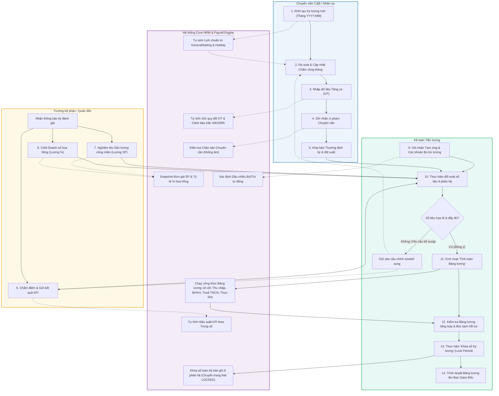
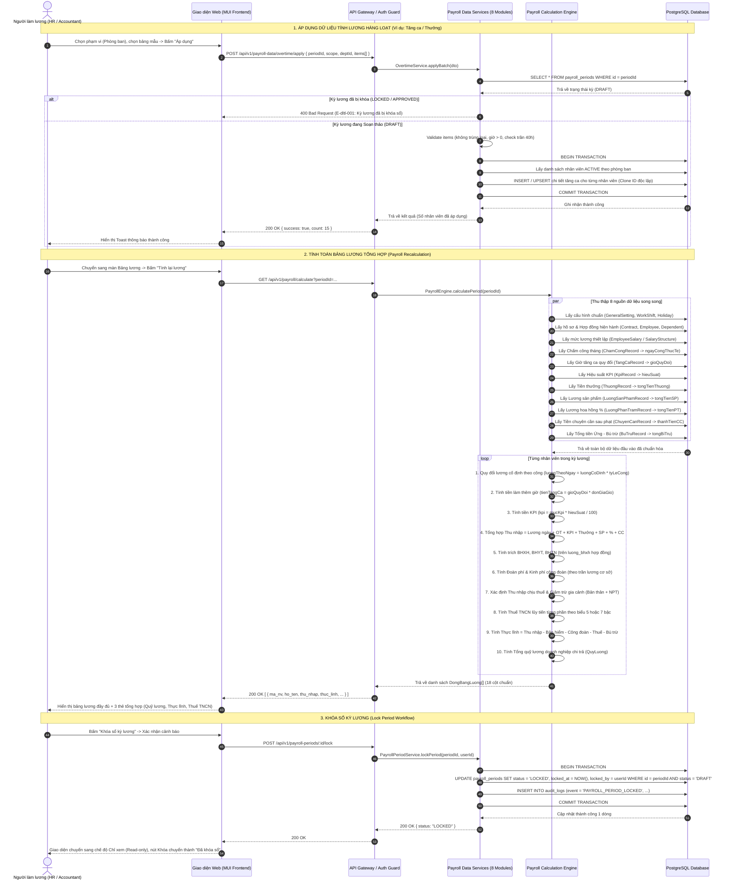

# Sơ đồ Luồng Nghiệp vụ (Flow Diagrams) — Dữ liệu Tính Lương

> **Tài liệu**: Đặc tả Luồng Nghiệp vụ & Giao tiếp (Activity / Swimlane / Sequence)  
> **Phân hệ**: Dữ liệu tính lương (`du_lieu_tinh_luong`)  
> **Ngày lập**: 2026-09-06  
> **Trạng thái**: Chốt nghiệm thu SRS  

---

## 1. Sơ đồ Hoạt động Phân làn (Swimlane / Activity Diagram)

Quy trình tổng hợp 8 phân hệ dữ liệu tính lương và tính lương định kỳ hàng tháng giữa 4 tác nhân: **HR / C&B**, **Trưởng bộ phận / Quản đốc**, **Kế toán tiền lương**, và **Hệ thống tự động**.

---

## 2. Sơ đồ Tuần tự Giao tiếp Hệ thống (Sequence Diagram)

Quy trình giao tiếp API giữa **Frontend UI**, **API Gateway / Controllers**, **8 Phân hệ Dữ liệu Lương (Payroll Data Services)**, **Payroll Engine (Bộ tính toán)**, và **PostgreSQL Database**.

