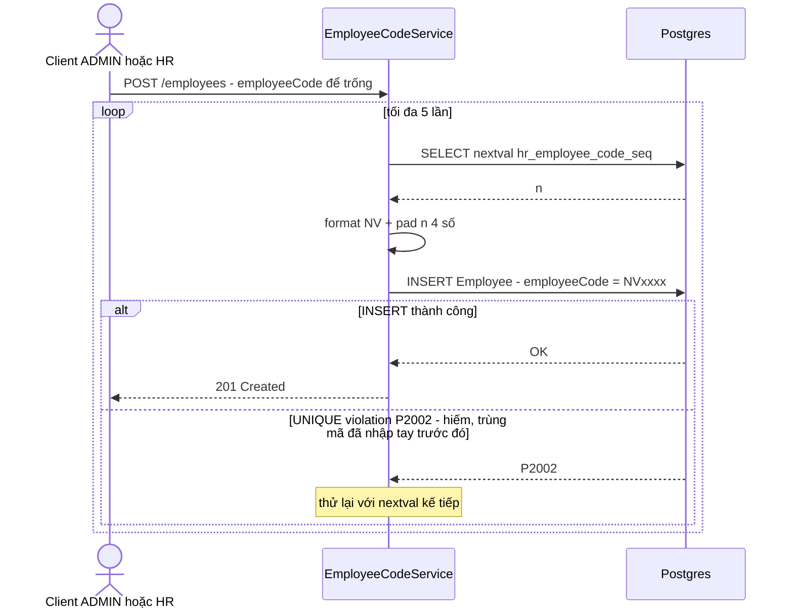

# ADR-001 — Sinh Mã NV tự động an toàn concurrency

## Context

BR-hr-001: Mã NV bắt buộc duy nhất toàn hệ thống; người dùng có thể tự nhập HOẶC để trống để hệ thống tự sinh. A-hr-1 đề xuất định dạng `NV` + 4 chữ số tăng dần (vd `NV0001`), chờ xác nhận OQ-hr-1 — định dạng này KHÔNG phải điểm cần quyết ở ADR này (đó là quyết định của BA), chỉ **cơ chế sinh số tăng dần duy nhất dưới điều kiện nhiều request đồng thời** là vấn đề kiến trúc/kỹ thuật cần giải quyết ở đây.

Cách làm ngây thơ `SELECT COUNT(*) + 1` có race condition kinh điển: 2 request tạo Nhân viên đồng thời cùng đọc `COUNT(*) = 40`, cùng tính ra `NV0041`, request thứ 2 ghi đè hoặc bị lỗi unique tuỳ thời điểm — không đảm bảo tính duy nhất một cách đáng tin cậy. Đây đúng là lớp bug đã được lưu ý tránh ở feature auth (lockout counter `User.failedLoginCount` dùng atomic `UPDATE ... SET x = x + 1` thay vì đọc rồi tính lại) — cùng một bài học: không dùng "đọc số hiện tại rồi +1" khi có khả năng đồng thời.

Ràng buộc: Prisma schema DSL (bản đang dùng trong repo) chỉ hỗ trợ `@default(autoincrement())` gắn liền vào 1 CỘT của model — giá trị đó chỉ được biết SAU khi INSERT (do DB sinh), không dùng được để tạo chuỗi `employeeCode` (vd `NV0001`) TRƯỚC khi ghi, vì `employeeCode` chính là cột cần lưu giá trị đã format sẵn, không phải một cột số nguyên trần.

## Decision

**Kết hợp 2 cơ chế:**

1. **Postgres `SEQUENCE` độc lập** (`hr_employee_code_seq`, tạo bằng raw SQL trong migration — không qua Prisma DSL) làm nguồn cấp số atomic. Flow tạo Nhân viên khi để trống Mã NV:
   - `SELECT nextval('hr_employee_code_seq')` → số nguyên `n`.
   - Format `employeeCode = 'NV' + pad(n, 4, '0')`.
   - `INSERT Employee` với `employeeCode` đã format.
2. **Retry-on-conflict** (tối đa 5 lần): nếu `INSERT` thất bại vì vi phạm UNIQUE(`employeeCode`) (Prisma error `P2002`) — trường hợp hiếm khi người dùng đã NHẬP TAY đúng giá trị mà sequence sắp/đang sinh ra — lấy `nextval()` kế tiếp và thử lại. Hết 5 lần vẫn lỗi → coi là lỗi hệ thống (500), không tạo mã lỗi nghiệp vụ riêng (xác suất gần như không xảy ra trong vận hành thực tế).

Khi người dùng NHẬP TAY Mã NV (không để trống): bỏ qua sequence, `INSERT` thẳng với giá trị nhập; UNIQUE constraint tự chống trùng → `P2002` → `E-hr-008`.

## Alternatives

| Phương án | Mô tả | Ưu | Nhược | Kết luận |
|---|---|---|---|---|
| **A. `SEQUENCE` + retry-on-conflict** ✓ | Như Decision ở trên | `nextval()` atomic tự nhiên (Postgres đảm bảo không 2 caller nào nhận cùng giá trị, kể cả không có transaction/lock tường minh); không cần lock tay; đơn giản, ít code | Có thể có khoảng hở số (gap) nếu 1 lần `nextval()` bị "đốt" do request sau đó fail vì lý do khác (validate lỗi...) — `nextval()` không rollback theo transaction | **Chọn** — gap chấp nhận được vì A-hr-1 chỉ yêu cầu "tăng dần, duy nhất", không yêu cầu liên tục tuyệt đối |
| B. Bảng counter riêng + `SELECT ... FOR UPDATE` | Bảng `hr_counters(key, value)`, lock dòng trong transaction, tăng dần, insert Employee cùng transaction | Không có gap (rollback transaction thì counter cũng rollback theo) | Thêm 1 bảng mới; mọi request tạo Nhân viên bị SERIALIZE qua lock trên cùng 1 dòng (request sau phải đợi request trước commit) — cổ chai (bottleneck) nếu tăng tần suất tạo Nhân viên đồng thời; phức tạp hơn để implement đúng (`$queryRaw` + `$transaction` thủ công, Prisma không có API bậc cao cho `SELECT FOR UPDATE`) | Không chọn — độ phức tạp không tương xứng lợi ích ở quy mô 1 công ty (tạo Nhân viên là thao tác admin tần suất thấp, không phải hot path như login) |
| C. `SELECT COUNT(*) + 1` (naive) | Đếm số dòng hiện có rồi +1 | Đơn giản nhất, không cần sequence/bảng phụ | **Race condition thật** — 2 request đồng thời có thể tính ra cùng 1 số; đây chính xác là bug class task yêu cầu tránh | **Loại bỏ tường minh** — không đảm bảo tính đúng đắn dưới concurrency |
| D. UUID/random thay vì số tăng dần | Sinh mã ngẫu nhiên duy nhất (vd `NV` + 6 ký tự random) | Không cần sequence, không có gap concept | Không thoả A-hr-1 (yêu cầu rõ "tăng dần") — đổi lại business rule mà chưa trao đổi với BA | Không chọn — ngoài phạm vi được phép tự quyết (A-hr-1 đã đề xuất "tăng dần") |

## Trade-offs

- **Nhận:** `hr_employee_code_seq` không thể tạo qua Prisma schema DSL thuần — cần 1 dòng SQL tay trong migration (`CREATE SEQUENCE ...`), phá vỡ một phần "schema.prisma là nguồn thật duy nhất" (ADR-001 của auth) cho riêng đối tượng DB này. Chấp nhận được vì đây là ngoại lệ nhỏ, có tài liệu hoá rõ (xem `hr-data-model.md` Mục 9), không lặp lại pattern này cho các nhu cầu khác nếu không cần thiết.
- **Nhận:** Số Mã NV có thể có khoảng hở (không liên tục tuyệt đối) — đã phân tích ở Alternatives, chấp nhận được theo đúng yêu cầu A-hr-1.
- **Đổi lấy:** Tính đúng đắn (correctness) dưới concurrency được đảm bảo bởi nguyên lý DB (sequence atomic), không phụ thuộc vào lock tường minh hay logic retry phức tạp ở tầng ứng dụng — dễ kiểm chứng, dễ test, không có cổ chai hiệu năng.

## Consequences

- Backend Engineer cần thêm 1 bước thủ công khi tạo migration: `prisma migrate dev --create-only` rồi tự thêm dòng `CREATE SEQUENCE IF NOT EXISTS hr_employee_code_seq START WITH 1 INCREMENT BY 1;` vào file `migration.sql` trước khi áp dụng (chi tiết: `hr-data-model.md` Mục 9). Đây là bước dễ quên khi review PR — nên thêm comment nhắc trong chính migration hoặc trong PR checklist.
- `EmployeeCodeService` (module riêng, không lẫn vào `EmployeesService`) chịu trách nhiệm toàn bộ logic `nextval()` + format + retry loop — dễ unit test độc lập (mock Prisma `$queryRaw`).
- Nếu sau này cần rollback/xoá sequence (hiếm khi cần), thao tác thủ công tương ứng là `DROP SEQUENCE IF EXISTS hr_employee_code_seq;` — không có cơ chế down-migration tự động (nhất quán với cách dự án xử lý migration hiện tại — forward-only, xem `auth-architecture.md` Mục 8).
- Không ảnh hưởng tới quyết định định dạng Mã NV (`NV0001` hay khác) — nếu BA đổi định dạng (OQ-hr-1), chỉ cần đổi hàm format trong `EmployeeCodeService`, không đổi cơ chế sequence/retry.

## Update 2026-09-05 — tương thích với tách Hợp đồng (`Contract`) và `$transaction`

Sau khi Hợp đồng tách thành entity riêng (A-hr-6, `hr-spec.md` Mục 6.4) và BR-hr-014 buộc tạo Nhân viên+Hợp đồng đầu tiên trong 1 `$transaction` ([[docs/hr/architecture/adr/ADR-003-employee-contract-atomic-creation.md|ADR-003]]), `EmployeeCodeService.generateAndCreate()` **không cần sửa đổi gì** — hàm vốn đã nhận callback `attempt(code)` tuỳ ý, nơi gọi (`EmployeesService.create()`) chỉ cần truyền `tx.employee.create` (transaction client) thay vì `prisma.employee.create` như trước. `nextval()` vẫn luôn gọi qua client NGOÀI transaction (`this.prisma.$queryRaw`, không phải `tx.$queryRaw`) — đúng tinh thần ban đầu của ADR này: sinh số từ sequence là thao tác atomic độc lập, không cần và không nên phụ thuộc vào transaction bao ngoài. Quyết định gốc của ADR-001 (sequence + retry) không đổi.
