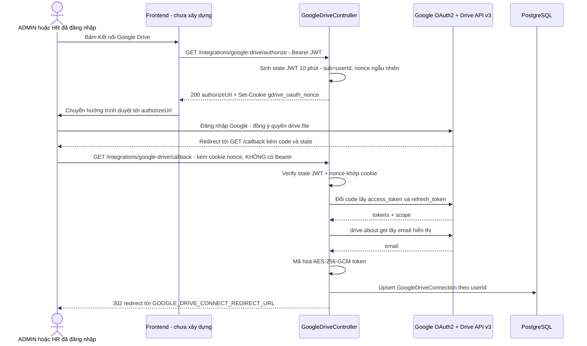

# HR — API Contract

API contract cho Phòng ban/Nhân viên/Hợp đồng/Người phụ thuộc/Tài liệu + tích hợp Google Drive. Base URL, format JSON, error envelope **dùng chung với auth**.

> **Cập nhật 2026-09-05 (breaking change có chủ đích — xem `hr-spec.md` A-hr-6):** tách "Hợp đồng" khỏi `Employee`. `POST /employees` đổi request/response shape; 4 endpoint Hợp đồng mới (Mục 5); `Department`/`Dependent` không đổi.

> **Cập nhật 2026-09-05 (đợt 2 — Tài liệu + Google Drive, OQ-hr-25 Cách hiểu 2):** thêm 7 endpoint Tài liệu (Mục 11) + 4 endpoint tích hợp Google Drive (Mục 12) — tổng endpoint HR/Integrations từ 19 lên **30**. Đây là lần ĐẦU TIÊN module này có endpoint `multipart/form-data` (upload file) và endpoint `@Public()` (OAuth callback, browser redirect không có Bearer header) — 2 điểm khác biệt kỹ thuật so với 19 endpoint JSON-thuần trước đó. Rationale đầy đủ: [[docs/hr/architecture/adr/ADR-004-google-drive-integration.md|ADR-004]].

Quy ước (không đổi so với bản trước):

- Mọi endpoint yêu cầu `Authorization: Bearer <access_token>` — **NGOẠI LỆ DUY NHẤT MỚI:** `GET /integrations/google-drive/callback` (Mục 12.3, `@Public()`, xác thực bằng `state` JWT + cookie thay vì Bearer, vì đây là điểm browser redirect từ Google, không phải lời gọi API JSON thông thường).
- Timestamp trả về ISO 8601 UTC.
- **Trường "Ngày" thật** (`dateOfBirth` của Employee; `effectiveFrom`/`effectiveTo` thuộc Contract; `issueDate`/`expiryDate` thuộc Document — MỚI) nhận/trả **ISO-8601 date string** `YYYY-MM-DD`.
- **`Dependent.dateOfBirth`** là chuỗi tự do, KHÔNG ép ISO (A-hr-7).
- Mọi response lỗi theo shape `{ error: { code, message, fields? } }`.
- **MỚI:** `PUT /documents/:id/file` là endpoint DUY NHẤT nhận `Content-Type: multipart/form-data` — mọi endpoint khác (kể cả 6 endpoint Document/Integration còn lại) vẫn `application/json`.

## 1. Tổng quan endpoint

| # | Method | Path | Phân quyền | FR liên quan |
|---|--------|------|------------|---------------|
| 1 | `POST` | `/departments` | `ADMIN`, `HR` | FR-hr-001 |
| 2 | `GET` | `/departments` | `ADMIN`, `HR`, `ACCOUNTANT` | FR-hr-002 |
| 3 | `GET` | `/departments/:id` | `ADMIN`, `HR`, `ACCOUNTANT` | FR-hr-002 |
| 4 | `PATCH` | `/departments/:id` | `ADMIN`, `HR` | FR-hr-003 |
| 5 | `DELETE` | `/departments/:id` | `ADMIN`, `HR` | FR-hr-004, BR-hr-008 |
| 6 | `POST` | `/employees` | `ADMIN`, `HR` | FR-hr-005, FR-hr-007, FR-hr-016 — tạo Nhân viên KÈM Hợp đồng đầu tiên, all-or-nothing (BR-hr-014) |
| 7 | `GET` | `/employees` | `ADMIN`, `HR`, `ACCOUNTANT` | FR-hr-008 |
| 8 | `GET` | `/employees/:id` | `ADMIN`, `HR`, `ACCOUNTANT` | FR-hr-008 |
| 9 | `PATCH` | `/employees/:id` | `ADMIN`, `HR` | FR-hr-009 |
| 10 | `DELETE` | `/employees/:id` | `ADMIN`, `HR` | FR-hr-010 |
| 11 | `POST` | `/employees/:employeeId/contracts` | `ADMIN`, `HR` | FR-hr-017 — thêm Hợp đồng cho Nhân viên đã tồn tại |
| 12 | `GET` | `/employees/:employeeId/contracts` | `ADMIN`, `HR`, `ACCOUNTANT` | FR-hr-018 — lịch sử Hợp đồng |
| 13 | `GET` | `/contracts/:id` | `ADMIN`, `HR`, `ACCOUNTANT` | FR-hr-018 |
| 14 | `PATCH` | `/contracts/:id` | `ADMIN`, `HR` | FR-hr-019 — sửa Hợp đồng, bao gồm chấm dứt sớm |
| 15 | `POST` | `/dependents` | `ADMIN`, `HR` | FR-hr-011 |
| 16 | `GET` | `/employees/:employeeId/dependents` | `ADMIN`, `HR`, `ACCOUNTANT` | FR-hr-012 |
| 17 | `GET` | `/dependents/:id` | `ADMIN`, `HR`, `ACCOUNTANT` | FR-hr-012 |
| 18 | `PATCH` | `/dependents/:id` | `ADMIN`, `HR` | FR-hr-013 |
| 19 | `DELETE` | `/dependents/:id` | `ADMIN`, `HR` | FR-hr-013 |
| 20 | `POST` | `/employees/:employeeId/documents` | `ADMIN`, `HR` | **MỚI** FR-hr-020 — tạo Tài liệu (JSON, KHÔNG kèm file) |
| 21 | `GET` | `/employees/:employeeId/documents` | `ADMIN`, `HR`, `ACCOUNTANT` | **MỚI** FR-hr-021 — danh sách Tài liệu theo Nhân viên |
| 22 | `GET` | `/documents/:id` | `ADMIN`, `HR`, `ACCOUNTANT` | **MỚI** FR-hr-021 |
| 23 | `PATCH` | `/documents/:id` | `ADMIN`, `HR` | **MỚI** FR-hr-022 — CHỈ metadata, KHÔNG đụng file |
| 24 | `DELETE` | `/documents/:id` | `ADMIN`, `HR` | **MỚI** FR-hr-022 — xoá bản ghi + best-effort xoá file Drive |
| 25 | `PUT` | `/documents/:id/file` | `ADMIN`, `HR` | **MỚI** — upload/thay file đính kèm (`multipart/form-data`), yêu cầu đã kết nối Google Drive |
| 26 | `DELETE` | `/documents/:id/file` | `ADMIN`, `HR` | **MỚI (P2 — có thể triển khai sau)** — gỡ file đính kèm, giữ nguyên metadata |
| 27 | `GET` | `/integrations/google-drive/authorize` | `ADMIN`, `HR` | **MỚI** — lấy URL consent Google |
| 28 | `GET` | `/integrations/google-drive/callback` | `@Public()` (state JWT + cookie nonce) | **MỚI** — nhận `code` từ Google, đổi token, lưu kết nối |
| 29 | `GET` | `/integrations/google-drive/connection` | `ADMIN`, `HR` | **MỚI** — trạng thái kết nối CỦA CHÍNH user đang gọi |
| 30 | `DELETE` | `/integrations/google-drive/connection` | `ADMIN`, `HR` | **MỚI** — ngắt kết nối CỦA CHÍNH user đang gọi |
| 31 | `GET` | `/settings/general` | `ADMIN`, `HR`, `ACCOUNTANT` | **MỚI (Đợt 5)** FR-hr-024 — xem cấu hình mặc định (Singleton) |
| 32 | `PUT` | `/settings/general` | `ADMIN` | **MỚI (Đợt 5)** FR-hr-025, AC-hr-22 — cập nhật cấu hình mặc định |
| 33 | `POST` | `/settings/general/restore-default` | `ADMIN` | **MỚI (Đợt 5)** FR-hr-026, AC-hr-22 — khôi phục cấu hình mặc định |
| 34 | `POST` | `/work-shifts` | `ADMIN`, `HR` | **MỚI (Đợt 5)** FR-hr-027 — tạo ca làm việc |
| 35 | `GET` | `/work-shifts` | `ADMIN`, `HR`, `ACCOUNTANT` | **MỚI (Đợt 5)** FR-hr-028 — danh sách ca làm việc |
| 36 | `GET` | `/work-shifts/:id` | `ADMIN`, `HR`, `ACCOUNTANT` | **MỚI (Đợt 5)** FR-hr-028 — chi tiết ca làm việc |
| 37 | `PATCH` | `/work-shifts/:id` | `ADMIN`, `HR` | **MỚI (Đợt 5)** FR-hr-029 — cập nhật ca làm việc |
| 38 | `DELETE` | `/work-shifts/:id` | `ADMIN`, `HR` | **MỚI (Đợt 5)** FR-hr-030 — xóa ca làm việc |
| 39 | `POST` | `/holidays` | `ADMIN`, `HR` | **MỚI (Đợt 5)** FR-hr-031 — tạo ngày lễ |
| 40 | `GET` | `/holidays` | `ADMIN`, `HR`, `ACCOUNTANT` | **MỚI (Đợt 5)** FR-hr-032 — danh sách ngày lễ (lọc theo năm/lặp lại) |
| 41 | `GET` | `/holidays/:id` | `ADMIN`, `HR`, `ACCOUNTANT` | **MỚI (Đợt 5)** FR-hr-032 — chi tiết ngày lễ |
| 42 | `PATCH` | `/holidays/:id` | `ADMIN`, `HR` | **MỚI (Đợt 5)** FR-hr-033 — cập nhật ngày lễ |
| 43 | `DELETE` | `/holidays/:id` | `ADMIN`, `HR` | **MỚI (Đợt 5)** FR-hr-033 — xóa ngày lễ |
| 44 | `POST` | `/holidays/quick-generate` | `ADMIN`, `HR` | **MỚI (Đợt 5)** FR-hr-032, BR-hr-028 — tạo nhanh 11 ngày lễ chuẩn VN |

**KHÔNG có `DELETE /contracts/:id`** (giữ nguyên quyết định trước — Scope SRS Mục 3 không liệt kê "xoá" cho Hợp đồng, mục đích tái cấu trúc là lưu lịch sử đầy đủ).

**RBAC tổng quan:** Create/Update Department/Employee/Contract/Dependent/Document/WorkShift/Holiday → `ADMIN`+`HR`; Read (list+detail) cả 8 entity/tính năng → `ADMIN`+`HR`+`ACCOUNTANT`; Delete Department/Employee/Dependent/Document/WorkShift/Holiday → `ADMIN`+`HR`. **Riêng Cấu hình mặc định (`/settings/general` PUT & RESTORE-DEFAULT): CHỈ `ADMIN`** (AC-hr-22, bảo vệ tham số toàn công ty). 4 endpoint tích hợp Google Drive (27-30, trừ callback) → CHỈ `ADMIN`+`HR`. `EMPLOYEE` không có quyền trên toàn bộ 44 endpoint.

## 2. Phân trang / lọc / sắp xếp — quy ước chung

Không đổi so với bản trước: **offset-based pagination** cho mọi danh sách (Department/Employee/Contract/Dependent/Document).

**Query param chung mọi endpoint `GET` danh sách:**

| Param | Type | Default | Rule |
|---|---|---|---|
| `page` | int | 1 | ≥ 1 |
| `pageSize` | int | 20 | 1–100 |
| `sortBy` | string | tuỳ endpoint | allow-list riêng từng endpoint |
| `sortOrder` | `asc` \| `desc` | tuỳ endpoint | Department mặc định `asc` theo `name`; Employee/Dependent mặc định `desc` theo `createdAt`; Contract mặc định `desc` theo `effectiveFrom`; **Document mặc định `desc` theo `createdAt`** (giống Employee/Dependent — Tài liệu mới thêm gần đây lên đầu, hữu ích khi vừa upload xong muốn thấy ngay) |

**Response envelope chung:** không đổi (`items`/`page`/`pageSize`/`total`/`totalPages`).

## 3. Department

*(Không đổi so với bản thiết kế trước — giữ nguyên nội dung.)*

### 3.1 `POST /departments`

**Phân quyền:** `ADMIN`, `HR` · **FR:** FR-hr-001

**Request body:**

| Field | Type | Bắt buộc | Rule |
|---|---|---|---|
| `code` | string | ✅ | 1–20 ký tự, trim |
| `name` | string | ✅ | 1–200 ký tự, trim |
| `description` | string | — | ≤ 500 ký tự |

**Xử lý:** `status` mặc định `ACTIVE`. Trùng `code` → `E-hr-015` (400).

**Response 201:**

```json
{
  "id": "b2f1...",
  "code": "DP006",
  "name": "Phòng Marketing",
  "description": null,
  "status": "ACTIVE",
  "createdAt": "2026-09-05T02:00:00.000Z",
  "updatedAt": "2026-09-05T02:00:00.000Z"
}
```

**Status codes:** 201 · 400 (`VALIDATION_FAILED`, `E-hr-015`) · 401 · 403 · 429.

---

### 3.2 `GET /departments`

**Phân quyền:** `ADMIN`, `HR`, `ACCOUNTANT` · **FR:** FR-hr-002

**Query params (ngoài `page`/`pageSize`):** `status` (`ACTIVE`\|`INACTIVE`, bỏ trống = tất cả) · `search` (contains `code`/`name`) · `sortBy` (`code`\|`name`\|`createdAt`, default `name`).

**Status codes:** 200 · 400 · 401 · 403 · 429.

---

### 3.3 `GET /departments/:id`

**Response 200:** `DepartmentResponse`. **404:** `NOT_FOUND` — `"Không tìm thấy phòng ban."`.

---

### 3.4 `PATCH /departments/:id`

**Request body** (optional, `code` KHÔNG có trong schema): `name` (1–200 nếu có mặt) · `description` (≤500, `null` để xoá) · `status`.

**Status codes:** 200 · 400 · 401 · 403 · 404 · 429.

---

### 3.5 `DELETE /departments/:id`

Hard delete CHỈ khi chưa từng gắn Employee. Pre-check `count` → `E-hr-014` nhanh; FK `onDelete: Restrict` là lớp bảo vệ race-condition thật.

**Status codes:** 204 · 400 (`E-hr-014`) · 401 · 403 · 404 · 429.

## 4. Employee (bỏ 8 field hợp đồng, thêm `contract` lồng khi tạo + `currentContract` trong response)

### 4.1 `POST /employees` — tạo Nhân viên KÈM Hợp đồng đầu tiên (BR-hr-014, all-or-nothing)

**Phân quyền:** `ADMIN`, `HR` · **FR:** FR-hr-005, FR-hr-007, FR-hr-016

**Request body — field Nhân viên (root):**

| Field | Type | Bắt buộc | Rule | Mã lỗi structural |
|---|---|---|---|---|
| `employeeCode` | string | — | 1–20 ký tự nếu có; để trống → auto-gen (ADR-001) | — |
| `fullName` | string | ✅ | 1–200 ký tự | `E-hr-001` |
| `dateOfBirth` | date (`YYYY-MM-DD`) | — | — | — |
| `nationalId` | string | — | ≤ 20 | — |
| `taxCode` | string | — | ≤ 20 | — |
| `phone` | string | — | ≤ 20 | — |
| `email` | string | — | ≤ 254, format email nếu có | — |
| `address` | string | — | ≤ 500 | — |
| `gender` | `MALE`\|`FEMALE`\|`OTHER` | — | enum | — |
| `departmentId` | uuid | — | phải tồn tại nếu có (service-layer) | `E-hr-007` |
| `position` | string | — | ≤ 100 | — |
| `isTimekeepingExempt` | boolean | — | bỏ trống → `null` | — |
| `bankAccountNumber` | string | — | ≤ 30 | — |
| `bankAccountName` | string | — | ≤ 100 | — |
| `bankName` | string | — | ≤ 150, free-text | — |
| `note` | string | — | ≤ 2000 | — |

**Request body — object `contract` (bắt buộc phải có, LỒNG bên trong body — BR-hr-014):**

| Field (`contract.*`) | Type | Bắt buộc | Rule | Mã lỗi gốc (xem cách "bọc" ở dưới) |
|---|---|---|---|---|
| `contract.contractNumber` | string | ✅ | 1–100 | `E-hr-002` |
| `contract.contractType` | `PROBATION`\|`LABOR_CONTRACT`\|`SERVICE_CONTRACT` | ✅ | enum | `E-hr-003` |
| `contract.salaryType` | `GROSS`\|`NET` | ✅ | enum | `E-hr-004` |
| `contract.baseSalary` | integer | ✅ | phải là số nguyên; phải > 0 (Rule 1) | `E-hr-017` (thiếu/sai kiểu) / `E-hr-018` (≤ 0) |
| `contract.socialInsuranceSalary` | integer | ✅ khi `hasSocialInsurance` = true (mặc định true) | phải > 0 nếu có | `E-hr-019` (thiếu khi bắt buộc) / `E-hr-018` (≤ 0) |
| `contract.effectiveFrom` | date | ✅ | — | `E-hr-005` |
| `contract.effectiveTo` | date | — | phải SAU `effectiveFrom` nếu có (Rule 1) | `E-hr-006` |
| `contract.hasSocialInsurance` | boolean | — | bỏ trống → `true` (BR-hr-005) | — |
| `contract.hasPersonalIncomeTax` | boolean | — | bỏ trống → `true` (BR-hr-005) | — |
| `contract.hasUnionFee` | boolean | — | bỏ trống → `null`; **LUÔN ép `false`** nếu `contractType = SERVICE_CONTRACT` (BR-hr-004, ghi đè im lặng) | — |

**Cách chọn `error.code` top-level — quy tắc ĐẶC BIỆT cho endpoint này (khác mọi endpoint khác trong tài liệu này):** bất kỳ vi phạm nào ở phía `contract.*` đều khiến top-level `error.code = E-hr-021`. Xem chi tiết đầy đủ Mục 7 Rule 4.

**Validation order đầy đủ:**

1. **Structural (Rule 2 — zod):** parse theo schema lồng. Chọn `error.code`: có ≥1 key bắt đầu bằng `contract.` → `E-hr-021`; else có key `fullName` → `E-hr-001`; else `VALIDATION_FAILED`.
2. **Service-layer (Rule 1):** `departmentId` tồn tại (E-hr-007, không bọc) → `contract.effectiveTo > effectiveFrom` (bọc E-hr-021) → `contract.baseSalary > 0` (bọc) → `socialInsuranceSalary` bắt buộc có điều kiện (bọc) → `employeeCode` trùng (E-hr-008, không bọc).
3. **Transaction (BR-hr-014 — [[docs/hr/architecture/adr/ADR-003-employee-contract-atomic-creation.md|ADR-003]]):** mở `$transaction`, tạo `Employee` rồi `Contract`.

**Response 201 — `EmployeeResponse` (xem Mục 4.3) + field `contract` bổ sung CHỈ riêng response này:**

```json
{
  "id": "3fa2...",
  "employeeCode": "NV0008",
  "fullName": "Trần Thị C",
  "departmentId": null,
  "department": null,
  "isTimekeepingExempt": null,
  "currentContract": {
    "id": "c9a1...",
    "contractNumber": "HĐLĐ-002/2026",
    "contractType": "LABOR_CONTRACT",
    "salaryType": "GROSS",
    "baseSalary": 15000000,
    "socialInsuranceSalary": 15000000,
    "effectiveFrom": "2026-09-05",
    "effectiveTo": null,
    "hasSocialInsurance": true,
    "hasPersonalIncomeTax": true,
    "hasUnionFee": true,
    "terminationReason": null,
    "isCurrent": true,
    "createdAt": "2026-09-05T02:00:00.000Z",
    "updatedAt": "2026-09-05T02:00:00.000Z"
  },
  "createdAt": "2026-09-05T02:00:00.000Z",
  "updatedAt": "2026-09-05T02:00:00.000Z"
}
```

**Status codes:** 201 · 400 (`VALIDATION_FAILED`, `E-hr-001`, `E-hr-007`, `E-hr-008`, `E-hr-021`) · 401 · 403 · 429.

---

### 4.2 `GET /employees`

**Phân quyền:** `ADMIN`, `HR`, `ACCOUNTANT` · **FR:** FR-hr-008

**Query params (ngoài `page`/`pageSize`):** `employeeCode` (contains) · `fullName` (contains) · `departmentId` (exact) · `contractType` (lọc theo Hợp đồng HIỆN HÀNH) · `position` (contains) · `sortBy` (`employeeCode`\|`fullName`\|`createdAt`, default `createdAt`).

**Technical constraint — lọc `contractType` qua quan hệ:**

```
where.contracts = {
  some: {
    contractType: query.contractType,
    effectiveFrom: { lte: now },
    OR: [{ effectiveTo: null }, { effectiveTo: { gte: now } }],
  },
}
```

**Response 200:** envelope chuẩn, `items` là mảng `EmployeeResponse` (Mục 4.3), đầy đủ trường (NFR-hr-003).

---

### 4.3 `GET /employees/:id`

**Response 200 — `EmployeeResponse`:**

```json
{
  "id": "3fa2...",
  "employeeCode": "NV0007",
  "fullName": "Nguyễn Văn A",
  "dateOfBirth": "1990-05-20",
  "nationalId": "001090012345",
  "taxCode": null,
  "phone": "0901234567",
  "email": null,
  "address": null,
  "gender": "MALE",
  "departmentId": "b2f1...",
  "department": { "id": "b2f1...", "code": "DP002", "name": "phòng sản xuất" },
  "position": "Trưởng nhóm",
  "isTimekeepingExempt": null,
  "currentContract": {
    "id": "c9a1...",
    "contractNumber": "HĐLĐ-001/2026",
    "contractType": "LABOR_CONTRACT",
    "salaryType": "GROSS",
    "baseSalary": 15000000,
    "socialInsuranceSalary": 15000000,
    "effectiveFrom": "2026-01-01",
    "effectiveTo": null,
    "hasSocialInsurance": true,
    "hasPersonalIncomeTax": true,
    "hasUnionFee": true,
    "terminationReason": null,
    "isCurrent": true,
    "createdAt": "2026-01-01T00:00:00.000Z",
    "updatedAt": "2026-01-01T00:00:00.000Z"
  },
  "bankAccountNumber": "0123456789",
  "bankAccountName": "NGUYEN VAN A",
  "bankName": "Vietcombank",
  "note": null,
  "createdAt": "2026-01-01T00:00:00.000Z",
  "updatedAt": "2026-01-01T00:00:00.000Z"
}
```

`department` là `null` khi `departmentId` là `null`. `currentContract` là `null` khi Nhân viên đang trong khoảng "hở" giữa 2 Hợp đồng. **Response này KHÔNG nhúng danh sách `documents`** — gọi riêng `GET /employees/:id/documents` (Mục 11.2), cùng lý do đã áp dụng cho `contracts` (tránh payload phình to khi 1 Nhân viên có nhiều bản ghi liên quan).

**Response 404:** `NOT_FOUND` — `"Không tìm thấy nhân viên."`.

---

### 4.4 `PATCH /employees/:id`

**Phân quyền:** `ADMIN`, `HR` · **FR:** FR-hr-009

**Request body:** CHỈ còn field thuần Nhân viên (không đổi so với bản trước).

**Status codes:** 200 · 400 (`VALIDATION_FAILED`, `E-hr-007`) · 401 · 403 · 404 · 429.

---

### 4.5 `DELETE /employees/:id`

**Xử lý:** hard delete — Dependent, Contract **VÀ Document** (MỚI) liên quan bị xoá theo (`onDelete: Cascade` ở DB cho cả 3 quan hệ). Nghĩa là **xoá 1 Nhân viên xoá theo TOÀN BỘ lịch sử Hợp đồng và Tài liệu của người đó** — OQ-hr-4 (mở rộng phạm vi lần 2 sau khi thêm Tài liệu) vẫn đang mở.

**Lưu ý QUAN TRỌNG về file Drive khi xoá Nhân viên:** xoá `Employee` chỉ xoá bản ghi `Document` trong Postgres (Prisma Cascade) — **KHÔNG tự động xoá file tương ứng trên Google Drive cá nhân của người đã upload** (Cascade là cơ chế DB thuần, không gọi được API bên ngoài). Đây là hành vi CHẤP NHẬN ĐƯỢC theo thiết kế (file mồ côi trên Drive cá nhân của HR/Admin, không tốn tài nguyên hệ thống, người đó có thể tự dọn nếu muốn) — xem ADR-004 Mục "Rủi ro Drive cá nhân phân tán". Nếu BA sau này yêu cầu dọn file khi xoá Nhân viên, cần thêm 1 bước gọi Google API TRƯỚC khi xoá Employee (không thể làm SAU vì Cascade sẽ xoá luôn dữ liệu `driveFileId` cần để biết xoá file nào).

**Response 204:** không body. **404** `NOT_FOUND`.

**Status codes:** 204 · 401 · 403 · 404 · 429.

## 5. Contract

*(Không đổi so với bản thiết kế trước — giữ nguyên nội dung.)*

### 5.1 `POST /employees/:employeeId/contracts`

**Phân quyền:** `ADMIN`, `HR` · **FR:** FR-hr-017

**Request body:** giống hệt object `contract` ở Mục 4.1 (không lồng, root-level).

| Field | Type | Bắt buộc | Mã lỗi |
|---|---|---|---|
| `contractNumber` | string | ✅ (1–100) | `E-hr-002` |
| `contractType` | enum | ✅ | `E-hr-003` |
| `salaryType` | enum | ✅ | `E-hr-004` |
| `baseSalary` | integer | ✅ | `E-hr-017` / `E-hr-018` |
| `socialInsuranceSalary` | integer | ✅ khi `hasSocialInsurance` = true | `E-hr-019` / `E-hr-018` |
| `effectiveFrom` | date | ✅ | `E-hr-005` |
| `effectiveTo` | date | — | `E-hr-006` |
| `hasSocialInsurance` | boolean | — (default `true`) | — |
| `hasPersonalIncomeTax` | boolean | — (default `true`) | — |
| `hasUnionFee` | boolean | — (ép `false` khi `SERVICE_CONTRACT`) | — |

**Validation order:** Structural → `:employeeId` tồn tại (404) → `effectiveTo > effectiveFrom` → `baseSalary > 0` → `socialInsuranceSalary` điều kiện → BR-hr-013 chồng lấn (`E-hr-020`).

**Status codes:** 201 · 400 (`VALIDATION_FAILED`, `E-hr-005`..`E-hr-006`, `E-hr-017`..`E-hr-020`) · 401 · 403 · 404 · 429.

---

### 5.2 `GET /employees/:employeeId/contracts`

**Phân quyền:** `ADMIN`, `HR`, `ACCOUNTANT` · **FR:** FR-hr-018. `sortBy` chỉ `effectiveFrom` (default), `sortOrder` default `desc`.

**Status codes:** 200 · 400 · 401 · 403 · 404 · 429.

---

### 5.3 `GET /contracts/:id`

**Response 200:** `ContractResponse`. **404:** `"Không tìm thấy hợp đồng."`.

---

### 5.4 `PATCH /contracts/:id`

**Request body:** mọi field Mục 5.1 optional + `terminationReason` (string, ≤500, nullable). `employeeId` KHÔNG có trong schema. Kiểm tra lại BR-hr-013 loại trừ chính bản ghi `:id`.

**Status codes:** 200 · 400 (`VALIDATION_FAILED`, `E-hr-006`, `E-hr-018`..`E-hr-020`) · 401 · 403 · 404 · 429.

**Bắt lỗi `EXCLUDE` constraint:** xem ghi chú kỹ thuật ở bản gốc (dự kiến `PrismaClientKnownRequestError` code `P2004`, verify bằng test tích hợp thật, fallback map về `E-hr-020`).

## 6. Dependent

*(Không đổi so với bản thiết kế trước.)*

### 6.1 `POST /dependents`

**Phân quyền:** `ADMIN`, `HR` · **FR:** FR-hr-011

| Field | Type | Bắt buộc | Rule | Mã lỗi |
|---|---|---|---|---|
| `employeeId` | uuid | ✅ | phải là Nhân viên đang tồn tại | `E-hr-009` / `NOT_FOUND` |
| `fullName` | string | ✅ | 1–200 | `E-hr-010` |
| `relationship` | string | — | ≤ 50 | — |
| `dateOfBirth` | string | — | ≤ 20, KHÔNG ép định dạng | — |
| `nationalId` | string | — | ≤ 20 | — |
| `taxCode` | string | — | ≤ 20 | — |
| `phone` | string | — | ≤ 20 | — |
| `address` | string | — | ≤ 255 | — |
| `taxReliefFromMonth`/`ToMonth` | int | — | 1–12 | `E-hr-011` |
| `taxReliefFromYear`/`ToYear` | int | — | 2000–2100 | `E-hr-012` |

**Status codes:** 201 · 400 · 401 · 403 · 404 · 429.

---

### 6.2 `GET /employees/:employeeId/dependents` · 6.3 `GET /dependents/:id` · 6.4 `PATCH /dependents/:id` · 6.5 `DELETE /dependents/:id`

Không đổi.

## 7. Quy tắc chọn `error.code` khi validate nhiều field cùng lúc

- **Rule 1 — Business/DB check (LUÔN mã cụ thể):** `E-hr-006`, `E-hr-007`, `E-hr-008`, `E-hr-013`, `E-hr-014`, `E-hr-015`, `E-hr-018`, `E-hr-019`, `E-hr-020`, `E-hr-025`, `E-hr-026` (MỚI — Document).
- **Rule 2 — Structural validation (zod, generic `VALIDATION_FAILED` trừ khi field có mã riêng):** `E-hr-001..005`, `E-hr-009..012`, `E-hr-017`, `E-hr-022..024` (MỚI — Document).
- **Rule 3 — Permission/session:** `E-hr-016` = `E-auth-011`; phiên hết hạn = `E-auth-012`.
- **Rule 4 — chỉ áp dụng cho `POST /employees` (Mục 4.1):** bất kỳ vi phạm Rule 1/2 nào ở phía `contract.*` đều "bọc" top-level `error.code` thành `E-hr-021`.
- **Rule 5 — MỚI, riêng cho Google Drive integration (Mục 12):** lỗi liên quan OAuth/Drive API (chưa kết nối, Google lỗi, file không hợp lệ...) dùng namespace RIÊNG `E-gdrive-NNN` (Mục 8.2) — KHÔNG lẫn vào dãy `E-hr-NNN`, vì đây là lỗi tầng **kỹ thuật/tích hợp** (Architecture-defined), không phải lỗi nghiệp vụ HR có nguồn từ SRS Error Matrix. Nguyên tắc này giống cách `VALIDATION_FAILED`/`NOT_FOUND` là "platform code" nằm ngoài dãy `E-hr-NNN`.

## 8. Error code reference

### 8.1 `E-hr-NNN` (nghiệp vụ HR, nguồn SRS Mục 10)

| Mã | HTTP | Wording (nguyên văn SRS Mục 10) | Rule |
|---|---|---|---|
| `E-hr-001` | 400 | "Họ và tên không được để trống." | 2 |
| `E-hr-002` | 400 | "Số hợp đồng không được để trống." | 2 |
| `E-hr-003` | 400 | "Vui lòng chọn Loại hợp đồng." | 2 |
| `E-hr-004` | 400 | "Vui lòng chọn Kiểu lương (Gross/Net)." | 2 |
| `E-hr-005` | 400 | "Ngày bắt đầu không được để trống." | 2 |
| `E-hr-006` | 400 | "Ngày kết thúc phải sau Ngày bắt đầu." | 1 |
| `E-hr-007` | 400 | "Phòng ban không tồn tại. Vui lòng chọn phòng ban hợp lệ." | 1 |
| `E-hr-008` | 400 | "Mã NV đã tồn tại. Vui lòng chọn mã khác hoặc để trống để hệ thống tự sinh." | 1 |
| `E-hr-009` | 400 | "Vui lòng chọn Nhân viên." | 2 |
| `E-hr-010` | 400 | "Họ tên người phụ thuộc không được để trống." | 2 |
| `E-hr-011` | 400 | "Tháng phải từ 1 đến 12." | 2 |
| `E-hr-012` | 400 | "Năm phải từ 2000 đến 2100." | 2 |
| `E-hr-013` | 400 | "Khoảng đăng ký giảm trừ không hợp lệ: mốc bắt đầu phải trước mốc kết thúc." | 1 |
| `E-hr-014` | 400 | "Không thể xoá phòng ban đang có nhân viên. Hãy chuyển sang Ngừng hoạt động hoặc chuyển nhân viên sang phòng ban khác trước." | 1 |
| `E-hr-015` | 400 | "Mã phòng ban đã tồn tại." | 1 |
| `E-hr-016` | 403 | "Bạn không có quyền thực hiện chức năng này." | 3 — hiện thực qua `E-auth-011` |
| `E-hr-017` | 400 | "Lương chính không được để trống." | 2 |
| `E-hr-018` | 400 | "Lương phải là số dương." | 1 |
| `E-hr-019` | 400 | "Lương đóng BHXH không được để trống khi có trích đóng BHXH." | 1 |
| `E-hr-020` | 400 | "Khoảng thời gian hợp đồng bị trùng với một hợp đồng khác đã có của nhân viên này." | 1 |
| `E-hr-021` | 400 | "Không thể tạo nhân viên vì thông tin hợp đồng đi kèm không hợp lệ." | 4 (bọc — chỉ `POST /employees`) |
| `E-hr-022` | 400 | "Vui lòng chọn Nhân viên." | 2 — **MỚI (Document)**, KHÔNG dùng thực tế ở `POST /employees/:employeeId/documents` (route nested, `employeeId` lấy từ path, tồn tại → 404 nếu sai — xem ghi chú Mục 11.1). Giữ mã này cho nhất quán SRS/mở khả năng dùng lại nếu sau này có route dạng body giống `Dependent` |
| `E-hr-023` | 400 | "Vui lòng chọn Loại tài liệu." | 2 |
| `E-hr-024` | 400 | "Số hiệu không được để trống." | 2 |
| `E-hr-025` | 400 | "Ngày cấp không được lớn hơn ngày hiện tại." | 1 |
| `E-hr-026` | 400 | "Ngày hết hạn phải sau Ngày cấp." | 1 |

**QUAN TRỌNG cho Backend Engineer:** wording `E-hr-005`/`E-hr-006` **đã đổi so với `Backend/src/common/hr-errors.ts` hiện tại trong code** (code hiện có đang giữ wording cũ từ thiết kế Employee-embedded trước đây). `hr-errors.ts` cần: sửa lại 2 string này, thêm `E-hr-017`..`E-hr-026`, và mở rộng `hrNotFound()` để nhận thêm 2 entity mới: `'hợp đồng'` (đã cần từ đợt trước, vẫn chưa áp dụng trong code) và **`'tài liệu'`** (MỚI, đợt này).

### 8.2 `E-gdrive-NNN` (MỚI — kỹ thuật/tích hợp Google Drive, KHÔNG có nguồn SRS Error Matrix)

> Đây là "platform code" giống `VALIDATION_FAILED`/`NOT_FOUND`/`RATE_LIMITED` — do Architecture định nghĩa vì SRS (BA) không mô tả chi tiết cơ chế OAuth/Drive API. Xem [[docs/hr/architecture/adr/ADR-004-google-drive-integration.md|ADR-004]] cho rationale đầy đủ mỗi mã.

| Mã | HTTP | Message | Khi nào |
|---|---|---|---|
| `E-gdrive-001` | 400 | "Chưa kết nối Google Drive. Vui lòng kết nối tài khoản Google Drive trước khi tải lên tài liệu." | Gọi `PUT /documents/:id/file` nhưng user hiện tại chưa có `GoogleDriveConnection` |
| `E-gdrive-002` | 400 | "Không thể xác thực với Google. Vui lòng thử kết nối lại." | `state` JWT sai/hết hạn/nonce không khớp cookie, hoặc đổi `code` lấy token thất bại, hoặc Google không trả `refresh_token` |
| `E-gdrive-003` | 502 | "Google Drive đang gặp sự cố hoặc tạm thời không phản hồi. Vui lòng thử lại sau." | Lỗi 5xx/timeout/network từ Google API lúc upload/xoá/tạo folder — **502 khác quy ước 400 dùng cho lỗi nghiệp vụ**, giúp Frontend phân biệt "lỗi hệ thống ngoài, thử lại sau" với "lỗi input, sửa lại" |
| `E-gdrive-004` | 404 | "Không tìm thấy tệp trên Google Drive hoặc bạn không còn quyền truy cập tệp này." | Google trả 404/403 khi thao tác 1 file cụ thể (vd user đã tự xoá file khỏi Drive) |
| `E-gdrive-005` | 400 | "Loại tệp không được hỗ trợ. Chỉ chấp nhận ảnh (JPG/PNG/WEBP) hoặc PDF." | MIME type không nằm trong allow-list |
| `E-gdrive-006` | 400 | "Kích thước tệp vượt quá giới hạn cho phép (tối đa {N}MB)." | File lớn hơn `GOOGLE_DRIVE_UPLOAD_MAX_MB` (mặc định 15) |
| `E-gdrive-007` | 400 | "Vui lòng chọn tệp để tải lên." | `PUT /documents/:id/file` không có phần `file` trong multipart body |
| `E-gdrive-008` | 400 | "Google trả về lỗi hoặc bạn đã từ chối cấp quyền truy cập Google Drive." | Google redirect callback với `?error=access_denied` thay vì `code` |

**Platform codes (không đổi):**

| Code | HTTP | Message | Khi nào |
|---|---|---|---|
| `VALIDATION_FAILED` | 400 | "Dữ liệu không hợp lệ." | Structural lỗi ≥1 field không map được sang mã cụ thể duy nhất |
| `NOT_FOUND` | 404 | `"Không tìm thấy {phòng ban\|nhân viên\|hợp đồng\|người phụ thuộc\|tài liệu}."` | `:id`/`:employeeId` không tồn tại — **MỚI: thêm "tài liệu" vào danh sách entity** |
| `E-auth-011` | 403 | (dùng chung) | = `E-hr-016` |
| `E-auth-012` | 401 | (dùng chung) | Phiên hết hạn |
| `RATE_LIMITED` | 429 | (dùng chung) | ThrottlerGuard toàn cục |

## 9. Idempotency

Không đổi kết luận: không thiết kế idempotency-key cho 30 endpoint (CRUD/tích hợp admin, không phải giao dịch tài chính có double-submit risk nghiêm trọng). `DELETE` gần-idempotent theo REST chuẩn. **Ghi chú riêng cho `PUT /documents/:id/file`:** gọi lại nhiều lần với file khác nhau sẽ THAY THẾ file trước đó (semantics PUT chuẩn — "đặt lại toàn bộ trạng thái file đính kèm"), không phải lỗi — đây là hành vi CHỦ Ý cho phép "sửa nhầm thì upload lại".

## 10. Validation rules tổng hợp (tra cứu nhanh)

| Field | Rule |
|---|---|
| `Department.code` | 1–20 ký tự, unique, immutable |
| `Department.name` | 1–200 ký tự |
| `Employee.fullName` | 1–200 ký tự |
| `Employee.employeeCode` (nhập tay) | 1–20 ký tự, unique |
| `Contract.contractNumber` | 1–100 ký tự, KHÔNG unique (OQ-hr-2) |
| `Contract.baseSalary` | integer > 0 (BR-hr-012) |
| `Contract.socialInsuranceSalary` | integer > 0, bắt buộc khi `hasSocialInsurance = true` (BR-hr-012) |
| `Contract.effectiveTo` | phải sau `effectiveFrom` nếu có (BR-hr-003) |
| `Contract` khoảng hiệu lực | KHÔNG được chồng lấn với Hợp đồng khác CÙNG Nhân viên (BR-hr-013) |
| `Dependent.fullName` | 1–200 ký tự |
| `Dependent.taxReliefFromMonth`/`ToMonth` | 1–12 |
| `Dependent.taxReliefFromYear`/`ToYear` | 2000–2100 |
| `Dependent` khoảng ĐK | mốc từ ≤ mốc đến khi cả 2 có giá trị (BR-hr-009) |
| `Document.documentType` | 1–100 ký tự, free-text (KHÔNG whitelist backend — Mục 12.1 `hr-data-model.md`) |
| `Document.documentNumber` | 1–50 ký tự, KHÔNG unique (BR-hr-018) |
| `Document.issueDate` | không ở tương lai nếu có (BR-hr-016) |
| `Document.expiryDate` | phải sau `issueDate` nếu cả 2 có giá trị (BR-hr-017) |
| `Document` file đính kèm | ≤ `GOOGLE_DRIVE_UPLOAD_MAX_MB` (mặc định 15MB), MIME ∈ {image/jpeg, image/png, image/webp, application/pdf} |

## 11. Document (MỚI — FR-hr-020..023, tích hợp Google Drive OQ-hr-25 Cách hiểu 2)

**Quyết định thiết kế quan trọng — tách metadata (JSON) khỏi file (multipart) thành 2 nhóm endpoint, KHÁC brief ban đầu đề xuất gộp file vào `POST` tạo Tài liệu:**

- FR-hr-020 quy định rõ file đính kèm là **tuỳ chọn** — 1 Document hợp lệ có thể không bao giờ có file. Gộp `multipart/form-data` vào endpoint tạo chính sẽ buộc MỌI client (kể cả trường hợp không đính kèm file — trường hợp hoàn toàn hợp lệ và phổ biến) phải dùng multipart thay vì JSON đơn giản, phức tạp hoá 90% trường hợp để phục vụ 1 tính năng tuỳ chọn.
- Tách riêng giữ 15/19 endpoint HR gốc + `POST/PATCH/GET/DELETE /documents` (Mục 11.1-11.5) đồng nhất 100% JSON — Backend Engineer copy nguyên khuôn mẫu `Dependent`/`Contract` đã có, KHÔNG cần học multipart cho phần này.
- Toàn bộ độ phức tạp "lạ" (multipart, gọi Google API, mã hoá/refresh token) cô lập vào ĐÚNG 2 endpoint (`PUT`/`DELETE /documents/:id/file`, Mục 11.6-11.7) — dễ test, dễ khoanh vùng lỗi.
- Route tạo Document dùng kiểu NESTED `/employees/:employeeId/documents` (giống `Contract`, KHÁC `Dependent` phẳng) vì cùng lý do đã áp dụng cho Contract: đây LUÔN là hành động "thêm Tài liệu CHO một Nhân viên cụ thể đã xác định trước từ ngữ cảnh" (mở từ trang chi tiết Nhân viên).

### 11.1 `POST /employees/:employeeId/documents` — tạo Tài liệu (metadata, KHÔNG kèm file)

**Phân quyền:** `ADMIN`, `HR` · **FR:** FR-hr-020

**Request body:**

| Field | Type | Bắt buộc | Rule | Mã lỗi |
|---|---|---|---|---|
| `documentType` | string | ✅ | 1–100 ký tự, trim | `E-hr-023` |
| `documentNumber` | string | ✅ | 1–50 ký tự, trim | `E-hr-024` |
| `issueDate` | date (`YYYY-MM-DD`) | — | không ở tương lai (Rule 1) | `E-hr-025` |
| `issuingAuthority` | string | — | ≤ 200 | — |
| `expiryDate` | date | — | phải sau `issueDate` nếu cả 2 có (Rule 1) | `E-hr-026` |
| `note` | string | — | ≤ 2000 | — |

**`employeeId` lấy từ path param, KHÔNG có trong body** (route nested, giống Contract Mục 5.1) — vì vậy `E-hr-022`/`E-hr-009` KHÔNG áp dụng ở endpoint này; thay vào đó `:employeeId` không tồn tại → 404 `NOT_FOUND` (`"Không tìm thấy nhân viên."`), kiểm tra TRƯỚC structural validation của body (giống thứ tự đã dùng cho `POST /employees/:employeeId/contracts`).

**Validation order:** `:employeeId` tồn tại (404) → Structural zod (`documentType`→`E-hr-023`, `documentNumber`→`E-hr-024`) → `issueDate <= today` nếu có (`E-hr-025`) → `expiryDate > issueDate` nếu cả 2 có (`E-hr-026`).

**Response 201 — `DocumentResponse`** (field `file` = `null` vì chưa upload):

```json
{
  "id": "d1a2...",
  "employeeId": "3fa2...",
  "documentType": "CCCD/CMND",
  "documentNumber": "001099012345",
  "issueDate": "2020-05-10",
  "issuingAuthority": "Cục Cảnh sát QLHC về TTXH",
  "expiryDate": "2035-05-10",
  "note": null,
  "file": null,
  "createdAt": "2026-09-05T02:00:00.000Z",
  "updatedAt": "2026-09-05T02:00:00.000Z"
}
```

**Status codes:** 201 · 400 (`VALIDATION_FAILED`, `E-hr-023`, `E-hr-024`, `E-hr-025`, `E-hr-026`) · 401 · 403 · 404 (Nhân viên không tồn tại) · 429.

---

### 11.2 `GET /employees/:employeeId/documents` — danh sách Tài liệu theo Nhân viên

**Phân quyền:** `ADMIN`, `HR`, `ACCOUNTANT` · **FR:** FR-hr-021

Path param `employeeId` phải tồn tại → 404 nếu không. **Query params:** `page`, `pageSize`, `documentType` (contains, lọc theo Loại tài liệu — FR-hr-021), `sortBy` (`createdAt`\|`issueDate`, default `createdAt`), `sortOrder` (default `desc`).

**Response 200:** envelope chuẩn, `items` là mảng `DocumentResponse`. Không rút gọn field (NFR-hr-003 — quyền Read của ACCOUNTANT giữ nguyên ma trận cũ theo quyết định user 2026-09-05, không siết thêm cho Tài liệu).

**Status codes:** 200 · 400 · 401 · 403 · 404 (Nhân viên không tồn tại) · 429.

---

### 11.3 `GET /documents/:id`

**Phân quyền:** `ADMIN`, `HR`, `ACCOUNTANT`

**Response 200 — `DocumentResponse`** (có file đính kèm):

```json
{
  "id": "d1a2...",
  "employeeId": "3fa2...",
  "documentType": "CCCD/CMND",
  "documentNumber": "001099012345",
  "issueDate": "2020-05-10",
  "issuingAuthority": "Cục Cảnh sát QLHC về TTXH",
  "expiryDate": "2035-05-10",
  "note": null,
  "file": {
    "driveFileId": "1AbCdEfGhIjKlMnOp",
    "webViewLink": "https://drive.google.com/file/d/1AbCdEfGhIjKlMnOp/view",
    "fileName": "cccd-mat-truoc.jpg",
    "mimeType": "image/jpeg",
    "sizeBytes": 2456789,
    "uploadedBy": { "id": "u1...", "name": "Nguyễn HR", "email": "hr@company.com" },
    "uploadedAt": "2026-09-05T03:00:00.000Z"
  },
  "createdAt": "2026-09-05T02:00:00.000Z",
  "updatedAt": "2026-09-05T03:00:00.000Z"
}
```

**404:** `NOT_FOUND` — `"Không tìm thấy tài liệu."`.

---

### 11.4 `PATCH /documents/:id` — sửa metadata (KHÔNG đụng file)

**Phân quyền:** `ADMIN`, `HR` · **FR:** FR-hr-022

**Request body:** mọi field Mục 11.1 optional. `employeeId` KHÔNG có trong schema (không hỗ trợ chuyển Tài liệu sang Nhân viên khác — giống lý do `Dependent.employeeId` không sửa được). Ngữ nghĩa `null` = xoá / vắng mặt = giữ nguyên cho field nullable (`issueDate`/`issuingAuthority`/`expiryDate`/`note`); `documentType`/`documentNumber` nếu có mặt trong body phải là chuỗi không rỗng (không cho `null` vì NOT NULL ở DB).

**Không đụng 7 field `drive*`/`fileUploadedAt`/`uploadedByUserId`** — muốn đổi file, gọi `PUT /documents/:id/file` (Mục 11.6).

**Status codes:** 200 · 400 (`VALIDATION_FAILED`, `E-hr-023`, `E-hr-024`, `E-hr-025`, `E-hr-026`) · 401 · 403 · 404 · 429.

---

### 11.5 `DELETE /documents/:id` — xoá cả bản ghi

**Phân quyền:** `ADMIN`, `HR` · **FR:** FR-hr-022

**Xử lý (thứ tự bắt buộc — xem ADR-004 Mục "Thứ tự ghi khi thao tác cắt qua DB + Google API"):**

1. Nếu `driveFileId` khác `null`: best-effort gọi Google xoá file, dùng `GoogleDriveConnection` của **`uploadedByUserId`** (KHÔNG phải user đang gọi API) — thất bại (đã disconnect, file đã bị xoá tay, lỗi mạng...) chỉ log, KHÔNG chặn bước 2.
2. Xoá bản ghi `Document` trong Postgres (luôn thực hiện, bất kể bước 1 thành/bại).

Không ảnh hưởng Nhân viên hay các Document khác (FR-hr-022).

**Response 204:** không body. **404** `NOT_FOUND`.

**Status codes:** 204 · 401 · 403 · 404 · 429.

---

### 11.6 `PUT /documents/:id/file` — upload/thay file đính kèm

**Phân quyền:** `ADMIN`, `HR`

**Content-Type:** `multipart/form-data` — **DUY NHẤT endpoint này trong toàn bộ HR/Integrations dùng multipart.**

**Request:** 1 field file duy nhất, tên `file` (binary). Không có field text nào khác trong multipart body — mọi metadata (`documentType`, `documentNumber`...) đã có sẵn từ lúc tạo Document (Mục 11.1) hoặc sửa qua Mục 11.4.

**Validation order:**

1. `:id` (Document) tồn tại → 404 `NOT_FOUND` (`"Không tìm thấy tài liệu."`) nếu không.
2. Có phần `file` trong multipart body → thiếu thì `E-gdrive-007` (400).
3. MIME type ∈ {`image/jpeg`, `image/png`, `image/webp`, `application/pdf`} → sai thì `E-gdrive-005` (400).
4. Kích thước ≤ `GOOGLE_DRIVE_UPLOAD_MAX_MB` (mặc định 15MB, cấu hình qua env) → vượt thì `E-gdrive-006` (400). **Kỹ thuật:** validate CHÍNH XÁC ở service layer sau khi multer nạp buffer vào RAM (`memoryStorage`), KHÔNG dựa vào message mặc định của multer's `limits.fileSize` (khác message/format của contract này) — multer's `limits.fileSize` chỉ nên đặt như một ngưỡng AN TOÀN kỹ thuật rộng hơn (vd 20MB) để chặn abuse trước khi buffer nạp hết vào RAM.
5. `GoogleDriveConnection` của **user đang gọi API hiện tại** (`req.user.userId` — KHÁC bước xoá file cũ ở dưới) tồn tại → thiếu thì `E-gdrive-001` (400).
6. Đảm bảo Drive folder tồn tại (search-or-create, cache `driveFolderId`; tự tạo lại nếu Google báo folder không còn — self-healing, xem ADR-004).
7. Upload file MỚI lên Drive của user đang gọi (`drive.files.create`) → lỗi Google (5xx/timeout) → `E-gdrive-003` (502); lỗi 404/403 cụ thể → `E-gdrive-004` (404).
8. Cập nhật `Document`: `driveFileId`/`driveWebViewLink`/`driveFileName`/`driveFileMimeType`/`driveFileSizeBytes`/`fileUploadedAt` = now, `uploadedByUserId` = user đang gọi (CHUYỂN quyền sở hữu tham chiếu sang người vừa upload, kể cả khi khác người đã upload lần trước).
9. **CHỈ SAU KHI bước 8 thành công:** nếu Document TRƯỚC ĐÓ đã có `driveFileId` cũ (đang thay thế file) → best-effort xoá file CŨ, dùng `GoogleDriveConnection` của **`uploadedByUserId` CŨ** (người đã upload file đang bị thay thế — KHÔNG PHẢI user đang gọi API hiện tại, vì 2 người có thể khác nhau và Drive API không cho phép user A xoá file trong Drive của user B). Nếu connection đó không còn tồn tại (đã disconnect) → bỏ qua, chỉ log — file cũ trở thành mồ côi trên Drive của người upload trước, chấp nhận được.

**Thứ tự upload-mới-trước, xoá-cũ-sau (bước 7-9) là CHỦ Ý** — nếu làm ngược lại (xoá cũ trước) mà bước upload mới thất bại, `Document` sẽ trỏ tới 1 file KHÔNG CÒN TỒN TẠI (broken reference, tệ hơn nhiều so với việc tạm thời có file cũ mồ côi không ai tham chiếu).

**Response 200 — `DocumentResponse`** (đầy đủ, `file` khác `null`).

**Status codes:** 200 · 400 (`E-gdrive-001`, `E-gdrive-005`, `E-gdrive-006`, `E-gdrive-007`) · 401 · 403 · 404 (Document hoặc file trên Drive không tồn tại — `E-gdrive-004`) · 429 · 502 (`E-gdrive-003`).

---

### 11.7 `DELETE /documents/:id/file` — gỡ file đính kèm, giữ nguyên metadata (P2 — có thể triển khai sau)

**Phân quyền:** `ADMIN`, `HR`

**Mức độ ưu tiên:** không nằm trong 5 FR cốt lõi của Document (FR-hr-020..023) — bổ sung cho ĐẦY ĐỦ CRUD file, có thể HOÃN sang đợt sau nếu áp lực thời gian mà không chặn go-live phần còn lại (Mục 11.6 `PUT` đã cho phép "sửa nhầm thì upload lại", chỉ thiếu khả năng "gỡ hẳn không thay").

**Xử lý:** best-effort xoá file trên Drive (dùng connection của `uploadedByUserId`, cùng nguyên tắc Mục 11.5/11.6) → UPDATE `Document`, set cả 6 field `drive*`/`fileUploadedAt`/`uploadedByUserId` về `null`, GIỮ NGUYÊN mọi field metadata khác.

**Response 200 — `DocumentResponse`** (`file: null`). **404** nếu Document không tồn tại.

**Status codes:** 200 · 401 · 403 · 404 · 429.

## 12. Google Drive Integration (MỚI — hạ tầng kỹ thuật, ADR-004)

### 12.1 Tổng quan luồng kết nối (OAuth2 Authorization Code)



Chi tiết cơ chế `state`/nonce/mã hoá: xem [[docs/hr/architecture/adr/ADR-004-google-drive-integration.md|ADR-004]].

### 12.2 `GET /integrations/google-drive/authorize`

**Phân quyền:** `ADMIN`, `HR` (Bearer JWT bình thường, không khác gì 26 endpoint JSON khác)

**Request:** không có params.

**Xử lý:**
1. Sinh `state` = JWT ký bằng `JWT_ACCESS_SECRET` (tái dùng secret sẵn có — KHÔNG thêm secret mới, phân biệt mục đích qua claim `aud: 'google-drive-connect'`), `sub = req.user.userId`, `nonce` ngẫu nhiên, hết hạn sau 10 phút.
2. Set cookie `gdrive_oauth_nonce` (httpOnly, secure, sameSite=lax, path=`/integrations/google-drive`, maxAge 10 phút) chứa cùng `nonce` — dùng để đối chiếu ở bước callback (chống OAuth authorization-code-injection, xem ADR-004).
3. Build URL: `https://accounts.google.com/o/oauth2/v2/auth` với `client_id`, `redirect_uri=GOOGLE_REDIRECT_URI`, `response_type=code`, `scope=https://www.googleapis.com/auth/drive.file`, `access_type=offline`, `prompt=consent` (LUÔN ép hiện màn hình đồng ý để Google LUÔN trả `refresh_token`, kể cả khi user đã từng kết nối trước đó), `state`.

**Response 200:**

```json
{ "authorizeUrl": "https://accounts.google.com/o/oauth2/v2/auth?client_id=...&state=..." }
```

**Status codes:** 200 · 401 · 403 · 429.

---

### 12.3 `GET /integrations/google-drive/callback`

**Phân quyền:** `@Public()` — KHÔNG có `@Roles()`. Đây là endpoint browser-redirect từ Google, KHÔNG có header `Authorization`. Uỷ quyền thực chất đã xảy ra ở bước `/authorize` (nơi `state` được PHÁT HÀNH cho đúng user đã qua `RolesGuard`) — callback chỉ VERIFY `state` đó, không kiểm tra role lần 2.

**Query params:** `code` (thành công) HOẶC `error` (user từ chối/Google lỗi) + `state` (luôn có mặt ở cả 2 trường hợp).

**Xử lý:**
1. Đọc cookie `gdrive_oauth_nonce`. Verify `state` JWT (chữ ký, hết hạn, `aud`) + `nonce` trong `state` khớp cookie → sai bất kỳ điều gì → `E-gdrive-002`, redirect `GOOGLE_DRIVE_CONNECT_REDIRECT_URL?connected=false&error=E-gdrive-002`.
2. Nếu có `error` (user từ chối consent) → `E-gdrive-008`, redirect tương tự với `error=E-gdrive-008`.
3. Đổi `code` lấy token (`oauth2Client.getToken`). Thiếu `refresh_token` trong response (trường hợp hiếm dù đã `prompt=consent`) → coi là lỗi, `E-gdrive-002`, KHÔNG lưu connection dở dang.
4. Gọi `drive.about.get({ fields: 'user(emailAddress,displayName)' })` lấy email hiển thị (best-effort — lỗi ở bước này KHÔNG chặn lưu connection, chỉ để `googleAccountEmail = null`).
5. Mã hoá access/refresh token (AES-256-GCM, `TOKEN_ENCRYPTION_KEY`).
6. `upsert` `GoogleDriveConnection` theo `userId` (từ `state.sub`) — ghi đè nếu đã tồn tại (cho phép đổi sang tài khoản Google khác mà không cần disconnect trước).
7. Xoá cookie `gdrive_oauth_nonce`.
8. `302` redirect tới `GOOGLE_DRIVE_CONNECT_REDIRECT_URL?connected=true`.

**Response:** LUÔN `302` (không trả JSON — đây là điểm browser-navigation, không phải lời gọi API JSON). Không có response body ý nghĩa cho client JSON.

**Status codes:** 302 (thành công hoặc thất bại — luôn redirect, KHÔNG trả 400/401/403/404/502 trực tiếp cho browser; lý do lỗi truyền qua query string `?error=` của URL đích).

---

### 12.4 `GET /integrations/google-drive/connection` — trạng thái kết nối của chính user đang gọi

**Phân quyền:** `ADMIN`, `HR`. **KHÔNG có tham số `:userId`** — luôn thao tác trên `req.user.userId` (JWT). Không có cách nào để ADMIN xem/quản lý kết nối Drive CÁ NHÂN của user khác qua endpoint này hay bất kỳ endpoint nào khác (khác biệt CÓ CHỦ ĐÍCH so với 29 endpoint còn lại — Mục 12.6).

**Response 200 (đã kết nối):**

```json
{
  "connected": true,
  "googleAccountEmail": "hr.nguyen@gmail.com",
  "scope": "https://www.googleapis.com/auth/drive.file",
  "connectedAt": "2026-09-01T02:00:00.000Z"
}
```

**Response 200 (chưa kết nối):** `{ "connected": false }` — KHÔNG phải 404, vì "chưa kết nối" là trạng thái hợp lệ, không phải lỗi.

**Status codes:** 200 · 401 · 403 · 429.

---

### 12.5 `DELETE /integrations/google-drive/connection` — ngắt kết nối

**Phân quyền:** `ADMIN`, `HR`. Thao tác trên `req.user.userId`.

**Xử lý:**
1. Nếu có connection: best-effort gọi `oauth2Client.revokeToken()` (revoke phía Google — không chặn nếu lỗi, chỉ log).
2. Xoá cứng bản ghi `GoogleDriveConnection`.

**Không ảnh hưởng** các `Document` đã có `driveFileId` từ trước — file vẫn tồn tại trên Drive, chỉ là hệ thống không còn upload/xoá được cho tới khi user kết nối lại (Mục 13.3 `hr-data-model.md`).

**Response 204:** không body (idempotent — gọi khi chưa từng kết nối cũng trả 204, không lỗi).

**Status codes:** 204 · 401 · 403 · 429.

### 12.6 Ghi chú kỹ thuật quan trọng (đọc trước khi implement)

1. **Không dùng `$transaction` Postgres cho bất kỳ thao tác nào ở Mục 11.6/11.7/12.3/12.5** — tất cả đều XEN GIỮA 1 lệnh gọi HTTP ra Google API. Giữ 1 DB transaction mở trong lúc chờ network call bên ngoài là phản pattern (giữ connection/lock không cần thiết, và Postgres transaction KHÔNG rollback được side-effect đã xảy ra ở Google). Thay vào đó dùng **thứ tự ghi + compensating action best-effort** (xem từng endpoint ở trên) — khác nguyên tắc "transaction Postgres" đã dùng cho ADR-003 (Employee+Contract), vì ở ĐÓ cả 2 lệnh ghi đều trong CÙNG Postgres nên có transaction thật; ở ĐÂY một phía là API bên ngoài nên không có lựa chọn atomic thật.
2. **"Ai xoá file dùng token của ai" — quy tắc cross-user quan trọng nhất:** mọi thao tác XOÁ một file ĐÃ TỒN TẠI trên Drive (Mục 11.5, 11.6 bước 9, 11.7) phải dùng `GoogleDriveConnection` của **`uploadedByUserId`** (chủ sở hữu Drive đang chứa file đó), KHÔNG PHẢI của `req.user` đang gọi API — vì Google Drive API không cho phép user A thao tác file nằm trong Drive cá nhân của user B. Ngược lại, mọi thao tác TẠO file MỚI (Mục 11.6 bước 7) luôn dùng connection của `req.user` (người đang thực hiện upload, file sẽ nằm trong Drive của chính họ).
3. **Refresh token an toàn dùng lại đồng thời** — không cần lock khi 2 request cùng lúc refresh access token của cùng 1 `GoogleDriveConnection`: refresh token của Google (khác refresh token TỰ CHẾ của feature auth, vốn ROTATE và tự thu hồi khi tái sử dụng) là credential dùng lại được nhiều lần, không tự vô hiệu hoá khi refresh song song — 2 access token mới sinh ra đều hợp lệ, ai ghi đè cột cache sau cùng cũng không sao (last-write-wins vô hại).
4. **Self-healing folder cache:** nếu Google trả lỗi "not found" khi dùng `driveFolderId` đã cache (user tự xoá folder khỏi Drive) → xoá cache (`driveFolderId = null`), chạy lại search-or-create, retry upload đúng 1 lần.
5. **`drive.file` scope tự giới hạn phạm vi tìm kiếm** — `files.list`/`files.create` dưới scope này CHỈ thấy/tạo được file do chính app tạo ra, không bao giờ "nhìn thấy" các file khác trong Drive cá nhân của user — đây chính là cơ chế Google đảm bảo tính "least privilege" của scope `drive.file`, không cần code tự giới hạn thêm.

---

## 13. Cấu hình mặc định (GeneralSetting — Singleton)

Quản lý bộ tham số tính công, tính lương, bảo hiểm, công đoàn và thuế TNCN toàn hệ thống. Áp dụng mô hình **Singleton** (`id = "DEFAULT"`).

### 13.1 `GET /settings/general` — xem cấu hình mặc định

**Phân quyền:** `ADMIN`, `HR`, `ACCOUNTANT`.

**Xử lý:**
- Tìm bản ghi `GeneralSetting` có `id = "DEFAULT"`.
- Nếu chưa có (chưa chạy seed), tự động tạo bản ghi với giá trị mặc định theo chuẩn luật và trả về.

**Response 200:**

```json
{
  "id": "DEFAULT",
  "workDayMethod": "FIXED_26",
  "saturdayPolicy": "HALF_DAY",
  "sundayPolicy": "OFF",
  "standardHoursPerDay": 8.0,
  "basePaidLeaveDays": 12,
  "seniorityYearsPerDay": 5,
  "otNormalDayPercent": 150.0,
  "otNormalNightPercent": 200.0,
  "otSundayDayPercent": 200.0,
  "otSundayNightPercent": 270.0,
  "otHolidayDayPercent": 300.0,
  "otHolidayNightPercent": 390.0,
  "otMonthlyLimitHours": 40,
  "otYearlyWarningHours": 200,
  "otYearlyLimitHours": 300,
  "baseSalary": 2340000,
  "regionMinSalary": 4960000,
  "socialInsuranceEmpPercent": 8.0,
  "healthInsuranceEmpPercent": 1.5,
  "unemploymentInsuranceEmpPercent": 1.0,
  "socialInsuranceCompPercent": 17.5,
  "healthInsuranceCompPercent": 3.0,
  "unemploymentInsuranceCompPercent": 1.0,
  "unionFeeEmpPercent": 1.0,
  "unionFeeBaseCap": 234000,
  "unionFeeCompPercent": 2.0,
  "personalDeduction": 11000000,
  "dependentDeduction": 4400000,
  "taxBrackets": [
    { "khoang": 5000000, "thueSuat": 5 },
    { "khoang": 10000000, "thueSuat": 10 },
    { "khoang": 18000000, "thueSuat": 15 },
    { "khoang": 32000000, "thueSuat": 20 },
    { "khoang": 52000000, "thueSuat": 25 }
  ],
  "createdAt": "2026-09-05T00:00:00.000Z",
  "updatedAt": "2026-09-05T00:00:00.000Z"
}
```

**Status codes:** 200 · 401 · 403 · 429.

---

### 13.2 `PUT /settings/general` — cập nhật cấu hình mặc định

**Phân quyền:** `ADMIN` (AC-hr-22 — chỉ ADMIN có quyền chỉnh sửa cấu hình toàn hệ thống; HR/ACCOUNTANT bị từ chối 403 `E-hr-016`).

**Request Body (các trường tuỳ chọn cập nhật từng phần):**

```json
{
  "workDayMethod": "ACTUAL",
  "saturdayPolicy": "FULL_DAY",
  "sundayPolicy": "OFF",
  "standardHoursPerDay": 8.0,
  "basePaidLeaveDays": 12,
  "seniorityYearsPerDay": 5,
  "otNormalDayPercent": 150.0,
  "otNormalNightPercent": 200.0,
  "otSundayDayPercent": 200.0,
  "otSundayNightPercent": 270.0,
  "otHolidayDayPercent": 300.0,
  "otHolidayNightPercent": 390.0,
  "otMonthlyLimitHours": 40,
  "otYearlyWarningHours": 200,
  "otYearlyLimitHours": 300,
  "baseSalary": 2340000,
  "regionMinSalary": 4960000,
  "socialInsuranceEmpPercent": 8.0,
  "healthInsuranceEmpPercent": 1.5,
  "unemploymentInsuranceEmpPercent": 1.0,
  "socialInsuranceCompPercent": 17.5,
  "healthInsuranceCompPercent": 3.0,
  "unemploymentInsuranceCompPercent": 1.0,
  "unionFeeEmpPercent": 1.0,
  "unionFeeBaseCap": 234000,
  "unionFeeCompPercent": 2.0,
  "personalDeduction": 11000000,
  "dependentDeduction": 4400000,
  "taxBrackets": [
    { "khoang": 5000000, "thueSuat": 5 },
    { "khoang": 10000000, "thueSuat": 10 },
    { "khoang": 18000000, "thueSuat": 15 },
    { "khoang": 32000000, "thueSuat": 20 },
    { "khoang": 52000000, "thueSuat": 25 }
  ]
}
```

**Validate:**
- `standardHoursPerDay`: trong khoảng `1..24` (BR-hr-020, E-hr-027).
- `baseSalary` > 0, `regionMinSalary` > 0 (BR-hr-021, E-hr-028).
- `taxBrackets`: danh sách hợp lệ, `thueSuat` bậc sau phải lớn hơn bậc trước (BR-hr-022, E-hr-029).

**Response 200:** Object `GeneralSetting` sau cập nhật.

**Status codes:** 200 · 400 (`E-hr-027`, `E-hr-028`, `E-hr-029`) · 401 · 403 (`E-hr-016`) · 429.

---

### 13.3 `POST /settings/general/restore-default` — khôi phục cấu hình chuẩn

**Phân quyền:** `ADMIN` (AC-hr-22).

**Request Body:** Rỗng `{}`.

**Xử lý:**
- Ghi đè toàn bộ tham số của bản ghi `"DEFAULT"` về giá trị gốc mặc định theo Bộ luật Lao động 2019 và Nghị quyết 954/2020/UBTVQH14.

**Response 200:** Object `GeneralSetting` sau khi khôi phục.

**Status codes:** 200 · 401 · 403 (`E-hr-016`) · 429.

---

## 14. Ca làm việc (WorkShift)

Quản lý danh mục ca làm việc trong doanh nghiệp.

### 14.1 `POST /work-shifts` — tạo ca làm việc

**Phân quyền:** `ADMIN`, `HR`.

**Request Body:**

```json
{
  "code": "CA01",
  "name": "Ca hành chính",
  "startTime": "08:00",
  "endTime": "17:00",
  "breakMinutes": 60,
  "status": "ACTIVE"
}
```

**Validate:**
- `code`: Tuỳ chọn. Nếu để trống, hệ thống tự động sinh theo mẫu `CA01`-`CA99` (BR-hr-023). Nếu nhập tay, kiểm tra trùng lặp (E-hr-033).
- `name`: Bắt buộc, tối đa 100 ký tự (E-hr-030).
- `startTime`, `endTime`: Bắt buộc, định dạng `HH:mm` (00:00 - 23:59) (BR-hr-024, E-hr-031).
- `breakMinutes`: Số nguyên ≥ 0 (mặc định 0) (BR-hr-025, E-hr-032).
- `status`: Enum `ShiftStatus` (`ACTIVE` hoặc `INACTIVE`, mặc định `ACTIVE`).

**Logic tự động tính (không lưu DB):**
- `isOvernight`: `endTime <= startTime`.
- `workingHours`: Nếu `isOvernight`: `((1440 - startMin + endMin) - breakMinutes) / 60`, ngược lại: `((endMin - startMin) - breakMinutes) / 60` (làm tròn 2 chữ số thập phân).

**Response 201:**

```json
{
  "id": "7b7a1518-a6fe-4d76-880c-033878b27346",
  "code": "CA01",
  "name": "Ca hành chính",
  "startTime": "08:00",
  "endTime": "17:00",
  "breakMinutes": 60,
  "status": "ACTIVE",
  "isOvernight": false,
  "workingHours": 8.0,
  "createdAt": "2026-09-05T00:00:00.000Z",
  "updatedAt": "2026-09-05T00:00:00.000Z"
}
```

**Status codes:** 201 · 400 (`E-hr-030`, `E-hr-031`, `E-hr-032`) · 401 · 403 · 409 (`E-hr-033`) · 429.

---

### 14.2 `GET /work-shifts` — danh sách ca làm việc

**Phân quyền:** `ADMIN`, `HR`, `ACCOUNTANT`.

**Query params:**
- `page`, `pageSize` (mặc định 1, 20).
- `search`: Chuỗi tìm kiếm theo tên hoặc mã ca.
- `status`: `ACTIVE` | `INACTIVE`.
- `sortBy`: `code` | `name` | `startTime` | `createdAt` (mặc định `code`).
- `sortOrder`: `asc` | `desc` (mặc định `asc`).

**Response 200:** Danh sách paginated bao gồm các trường tính toán `isOvernight` và `workingHours` cho từng ca.

---

### 14.3 `GET /work-shifts/:id` — chi tiết ca làm việc

**Phân quyền:** `ADMIN`, `HR`, `ACCOUNTANT`.

**Response 200:** Chi tiết ca làm việc kèm `isOvernight` và `workingHours`.

**Status codes:** 200 · 401 · 403 · 404.

---

### 14.4 `PATCH /work-shifts/:id` — cập nhật ca làm việc

**Phân quyền:** `ADMIN`, `HR`.

**Request Body (các trường tuỳ chọn):**
- `name`: string
- `startTime`: `HH:mm`
- `endTime`: `HH:mm`
- `breakMinutes`: int ≥ 0
- `status`: `ShiftStatus`
*(Lưu ý: Không cho phép sửa `code` sau khi tạo).*

**Response 200:** Ca làm việc sau cập nhật kèm `isOvernight` và `workingHours`.

**Status codes:** 200 · 400 (`E-hr-030`, `E-hr-031`, `E-hr-032`) · 401 · 403 · 404 · 429.

---

### 14.5 `DELETE /work-shifts/:id` — xoá ca làm việc

**Phân quyền:** `ADMIN`, `HR`.

**Xử lý:** Xoá cứng ca làm việc (FR-hr-030).

**Response 204:** Không body.

**Status codes:** 204 · 401 · 403 · 404 · 429.

---

## 15. Lịch ngày lễ (Holiday)

Quản lý danh sách ngày nghỉ lễ hưởng lương toàn công ty.

### 15.1 `POST /holidays` — tạo ngày lễ

**Phân quyền:** `ADMIN`, `HR`.

**Request Body:**

```json
{
  "date": "2026-01-01",
  "name": "Tết Dương lịch",
  "type": "NATIONAL",
  "isAnnual": true,
  "isPaid": true,
  "note": "Nghỉ 1 ngày hưởng nguyên lương"
}
```

**Validate:**
- `date`: Bắt buộc, chuỗi `YYYY-MM-DD` (E-hr-034).
- `name`: Bắt buộc, tối đa 150 ký tự (E-hr-034).
- `type`: Enum `HolidayType` (`NATIONAL`, `LUNAR`, `COMPANY`, mặc định `NATIONAL`).
- `isAnnual`: Boolean, mặc định `false`. Nếu `type === "LUNAR"`, bắt buộc `false` (BR-hr-026, E-hr-035).
- `isPaid`: Boolean, mặc định `true`.
- `note`: Chuỗi tuỳ chọn, tối đa 500 ký tự.
- Chống trùng lặp: Cặp `[date, name]` phải là duy nhất (BR-hr-027, E-hr-036).

**Response 201:**

```json
{
  "id": "e96fd2f4-839e-4e4f-b8eb-9d18b671a539",
  "date": "2026-01-01",
  "name": "Tết Dương lịch",
  "type": "NATIONAL",
  "isAnnual": true,
  "isPaid": true,
  "note": "Nghỉ 1 ngày hưởng nguyên lương",
  "createdAt": "2026-09-05T00:00:00.000Z",
  "updatedAt": "2026-09-05T00:00:00.000Z"
}
```

**Status codes:** 201 · 400 (`E-hr-034`, `E-hr-035`) · 401 · 403 · 409 (`E-hr-036`) · 429.

---

### 15.2 `GET /holidays` — danh sách ngày lễ

**Phân quyền:** `ADMIN`, `HR`, `ACCOUNTANT`.

**Query params:**
- `year`: Số nguyên (vd `2026`). Nếu truyền `year`, hệ thống lọc tất cả ngày lễ diễn ra trong năm đó HOẶC có `isAnnual = true`.
- `filter`: Enum lọc nhanh `THIS_YEAR` | `ANNUAL` | `ALL` (mặc định `THIS_YEAR`).
- `page`, `pageSize` (mặc định 1, 50).
- `sortBy`: `date` | `name` | `createdAt` (mặc định `date`).
- `sortOrder`: `asc` | `desc` (mặc định `asc`).

**Response 200:** Paginated list các ngày lễ phù hợp.

---

### 15.3 `GET /holidays/:id` — chi tiết ngày lễ

**Phân quyền:** `ADMIN`, `HR`, `ACCOUNTANT`.

**Response 200:** Chi tiết ngày lễ.

**Status codes:** 200 · 401 · 403 · 404.

---

### 15.4 `PATCH /holidays/:id` — cập nhật ngày lễ

**Phân quyền:** `ADMIN`, `HR`.

**Request Body (các trường tuỳ chọn):**
- `date`, `name`, `type`, `isAnnual`, `isPaid`, `note`.
- Tuân thủ validate BR-hr-026 và BR-hr-027.

**Response 200:** Ngày lễ sau cập nhật.

**Status codes:** 200 · 400 (`E-hr-034`, `E-hr-035`) · 401 · 403 · 404 · 409 (`E-hr-036`) · 429.

---

### 15.5 `DELETE /holidays/:id` — xoá ngày lễ

**Phân quyền:** `ADMIN`, `HR`.

**Response 204:** Không body.

**Status codes:** 204 · 401 · 403 · 404.

---

### 15.6 `POST /holidays/quick-generate` — tạo nhanh 11 ngày lễ chuẩn VN

**Phân quyền:** `ADMIN`, `HR`.

**Request Body:**

```json
{
  "year": 2026
}
```
*(Nếu không truyền `year`, mặc định lấy năm hiện tại).*

**Xử lý (BR-hr-028, A-hr-17, AC-hr-21):**
1. Lấy danh sách 11 ngày lễ chuẩn Việt Nam theo Điều 112 BLLĐ 2019 cho năm chỉ định (tính toán ngày dương lịch cho Tết Âm lịch và Giỗ Tổ Hùng Vương dựa trên bảng tra lịch âm chuẩn 2024-2030).
2. Tra cứu các ngày lễ đã tồn tại trong DB cho năm đó.
3. Chỉ tạo mới các ngày lễ còn thiếu (`skipDuplicates` / kiểm tra theo cặp `[date, name]`).
4. Trả về thống kê số lượng đã thêm mới và số lượng bị bỏ qua do đã có sẵn.

**Response 201:**

```json
{
  "year": 2026,
  "totalStandard": 11,
  "addedCount": 11,
  "skippedCount": 0,
  "items": [
    { "date": "2026-01-01", "name": "Tết Dương lịch", "type": "NATIONAL", "isAnnual": true, "isPaid": true },
    { "date": "2026-02-16", "name": "Nghỉ Tết Âm lịch (29 Tết)", "type": "LUNAR", "isAnnual": false, "isPaid": true },
    { "date": "2026-02-17", "name": "Nghỉ Tết Âm lịch (30 Tết)", "type": "LUNAR", "isAnnual": false, "isPaid": true },
    { "date": "2026-02-18", "name": "Tết Nguyên Đán (Mùng 1)", "type": "LUNAR", "isAnnual": false, "isPaid": true },
    { "date": "2026-02-19", "name": "Tết Nguyên Đán (Mùng 2)", "type": "LUNAR", "isAnnual": false, "isPaid": true },
    { "date": "2026-02-20", "name": "Tết Nguyên Đán (Mùng 3)", "type": "LUNAR", "isAnnual": false, "isPaid": true },
    { "date": "2026-04-26", "name": "Giỗ Tổ Hùng Vương (10/3 Âm lịch)", "type": "LUNAR", "isAnnual": false, "isPaid": true },
    { "date": "2026-04-30", "name": "Ngày Giải phóng miền Nam", "type": "NATIONAL", "isAnnual": true, "isPaid": true },
    { "date": "2026-05-01", "name": "Ngày Quốc tế Lao động", "type": "NATIONAL", "isAnnual": true, "isPaid": true },
    { "date": "2026-09-01", "name": "Nghỉ liền kề Quốc khánh", "type": "NATIONAL", "isAnnual": true, "isPaid": true },
    { "date": "2026-09-02", "name": "Ngày Quốc khánh", "type": "NATIONAL", "isAnnual": true, "isPaid": true }
  ]
}
```

**Status codes:** 201 · 400 · 401 · 403 · 429.

---

## References

- [[docs/hr/srs/hr-spec.md|HR SRS]] — FR/BR/Error Matrix nguồn, đặc biệt Mục 6.4, 6.5, 6.6, 6.7, 6.8, 8, 10, 12
- [[docs/hr/architecture/hr-architecture.md|HR Architecture]] — module boundaries, transaction boundary, bounded context Integrations
- [[docs/hr/architecture/hr-data-model.md|HR Data Model]] — schema + FK actions + EXCLUDE constraint + GeneralSetting/WorkShift/Holiday
- [[docs/hr/architecture/adr/ADR-001-employee-code-generation.md|ADR-001 Employee Code Generation]]
- [[docs/hr/architecture/adr/ADR-002-contract-overlap-prevention.md|ADR-002 Contract Overlap Prevention]]
- [[docs/hr/architecture/adr/ADR-003-employee-contract-atomic-creation.md|ADR-003 Employee+Contract Atomic Creation]]
- [[docs/hr/architecture/adr/ADR-004-google-drive-integration.md|ADR-004 Google Drive Integration]]
- [[docs/hr/architecture/adr/ADR-005-settings-and-work-schedule-foundations.md|ADR-005 Settings and Work Schedule Foundations]]
- [[docs/auth/architecture/auth-api-contract.md|Auth API Contract]] — error envelope + E-auth-011/012 dùng chung
