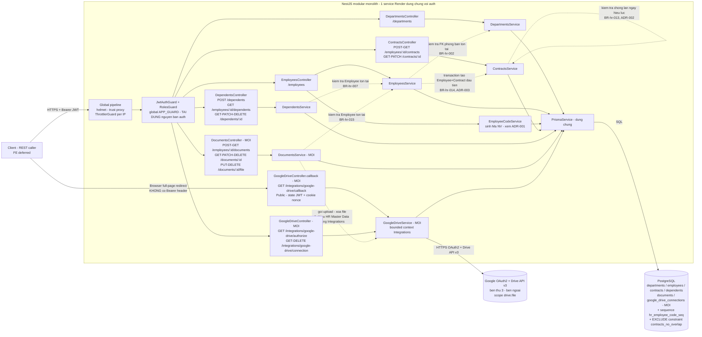

# HR — Architecture

> **Cập nhật 2026-09-05 (breaking change có chủ đích, A-hr-6):** "Hợp đồng" tách khỏi `Employee` thành entity `Contract` riêng, có lịch sử. Mục 2/3/4/5/7/9/10/11 dưới đây đã cập nhật theo. `Department`/`Dependent` không đổi.

> **Cập nhật 2026-09-05 (đợt 2 — Document + Google Drive integration, OQ-hr-25 Cách hiểu 2):** thêm entity `Document` (HR Master Data) và bounded context MỚI **"Integrations"** (`GoogleDriveConnection` + luồng OAuth + wrapper Drive API). Đây là tích hợp bên thứ 3 ĐẦU TIÊN của toàn dự án. Rationale đầy đủ: [[docs/hr/architecture/adr/ADR-004-google-drive-integration.md|ADR-004]]. Mục 1-11 GIỮ NGUYÊN SỐ THỨ TỰ (không renumber) vì `ADR-002`/`ADR-003`/`hr-data-model.md` đã tham chiếu cứng "Mục 5"/"Mục 4.1" của tài liệu này — mọi bổ sung chèn vào ĐÚNG Mục đã có, không thêm Mục mới ở cấp cao nhất.

## 1. Tổng quan

Module HR (Phòng ban, Nhân viên, Hợp đồng, Người phụ thuộc) là dữ liệu nền CRUD phần lớn thuần tuý — không webhook, không tích hợp bên ngoài (SRS Mục 13, đúng tại thời điểm viết ban đầu). Vì vậy kiến trúc ban đầu **không thêm service mới, không thêm hạ tầng mới** — chỉ mở rộng modular monolith NestJS hiện có (cùng service Render, cùng Postgres, cùng cơ chế auth/RBAC đã chạy production ở feature auth). Điểm khác CRUD thuần tuý: `POST /employees` (tạo Nhân viên kèm Hợp đồng đầu tiên) là thao tác 2-bảng nguyên tử (BR-hr-014, ADR-003), và Hợp đồng có 1 bất biến đa-bản-ghi (BR-hr-013, ADR-002).

**Thay đổi ở đợt này (Document + Google Drive):** khung "không tích hợp bên ngoài" ở trên KHÔNG còn đúng tuyệt đối — SRS Mục 6.5 (Tài liệu) và quyết định user 2026-09-05 (OQ-hr-25 Cách hiểu 2, qua AskUserQuestion trực tiếp) yêu cầu hệ thống chủ động upload file lên **Google Drive cá nhân của người dùng đang thao tác** qua Google Drive API thật. Đây là tích hợp bên thứ 3 ĐẦU TIÊN toàn dự án (auth hiện tại KHÔNG có OAuth nào). Cách xử lý: **không viết lại triết lý tổng thể "modular monolith"** — vẫn 1 service Render, vẫn 1 Postgres, vẫn tái dùng `JwtAuthGuard`/`RolesGuard` — nhưng thêm 1 bounded context MỚI "Integrations" (Mục 2) cô lập toàn bộ năng lực OAuth/gọi API ngoài, để 4 entity HR gốc (Department/Employee/Contract/Dependent) không bị ảnh hưởng gì. Quyết định kiến trúc đầy đủ: [[docs/hr/architecture/adr/ADR-004-google-drive-integration.md|ADR-004]].

Quyết định nền: tái dùng 100% cơ chế xác thực/phân quyền đã có (`JwtAuthGuard`, `RolesGuard`, `@Roles()`, enum `Role`, `@Public()`, cookie httpOnly pattern) — feature HR/Integrations **không tạo bảng Role mới, không tạo guard mới, không tạo cơ chế token mới** (kể cả `state` JWT của OAuth flow cũng tái dùng `JWT_ACCESS_SECRET` sẵn có, chỉ đổi claim `aud` — xem ADR-004).

## 2. Bounded context

| Bounded context | Sở hữu | Không sở hữu |
|---|---|---|
| **Identity & Access** (đã có — feature auth) | `User`, `Session`, `RefreshToken`, `PasswordResetToken`, `AuditLog`, enum `Role` | Dữ liệu nghiệp vụ HR, token OAuth bên thứ 3 |
| **HR Master Data** (module này) | `Department`, `Employee`, `Contract`, `Dependent`, `Document` (MỚI) | Tài khoản đăng nhập, phiên, audit chi tiết (OQ-hr-7 mở), cơ chế OAuth/token Google |
| **Integrations** (MỚI 2026-09-05) | `GoogleDriveConnection`, luồng OAuth2 (`/integrations/google-drive/*`), wrapper gọi Google Drive API v3 | Dữ liệu nghiệp vụ Document (đó vẫn thuộc HR Master Data — Integrations chỉ cung cấp NĂNG LỰC upload/xoá file, không sở hữu metadata Tài liệu) |

Ranh giới rõ theo A-hr-9/OQ-hr-9: **không có FK giữa `Employee` và `User`** — 1 nhân viên (hồ sơ nhân sự) và 1 tài khoản đăng nhập là 2 khái niệm độc lập. Quyết định này **không đổi** — 2 FK MỚI ở đợt này (`Document.uploadedByUserId → User`, `GoogleDriveConnection.userId → User`) không mâu thuẫn với A-hr-9 vì chúng phục vụ mục đích KHÁC hẳn (traceability "ai upload/ai sở hữu Drive nào" — gắn với TÀI KHOẢN ĐĂNG NHẬP đang thao tác, không phải với hồ sơ nhân sự nào).

**Đồ thị phụ thuộc giữa 3 bounded context (một chiều, vẫn acyclic — không đổi tính chất đã có):**

```
HR Master Data ──(gọi upload/xoá file)──> Integrations
HR Master Data ──(FK Document.uploadedByUserId)──> Identity & Access
Integrations   ──(FK GoogleDriveConnection.userId)──> Identity & Access
```

Không có chiều ngược nào (Identity & Access không import/biết gì về HR hay Integrations; Integrations không biết gì về HR ngoài việc BỊ GỌI bởi `DocumentsService`). Bốn entity Department/Employee/Contract/Dependent + Document gộp thành **một bounded context duy nhất** ("HR Master Data") vì chúng liên kết chặt và chia sẻ phần lớn ma trận phân quyền (SRS Mục 5) — tách `Document` ra riêng ở quy mô này là over-engineering. `GoogleDriveConnection` KHÔNG gộp vào "HR Master Data" dù chỉ phục vụ Document, vì bản chất kỹ thuật (OAuth/mã hoá secret/gọi API ngoài) khác hẳn "CRUD dữ liệu nhân sự" — xem ADR-004 Mục "Kiến trúc: module Integrations mới".

## 3. Kiến trúc tổng thể



Điểm mấu chốt:

- Mọi request HR/Integrations đi qua **cùng chuỗi guard** đã kiểm chứng ở auth: helmet → trust proxy → ThrottlerGuard → JwtAuthGuard → RolesGuard. **NGOẠI LỆ DUY NHẤT MỚI:** `GET /integrations/google-drive/callback` là endpoint `@Public()` ĐẦU TIÊN của module này — vì đây là điểm browser redirect từ Google, không có header `Authorization` (khác hẳn 29 endpoint JSON/multipart còn lại). Uỷ quyền cho endpoint này xảy ra Ở BƯỚC `/authorize` (state chỉ phát cho user đã qua RolesGuard) — xem ADR-004 Mục 2.
- **Toàn vẹn tham chiếu (FK) là nguồn đúng cuối cùng chống race condition** cho mọi thao tác THUẦN Postgres — không đổi. Với thao tác XEN GIỮA gọi Google API (upload/xoá file, kết nối/ngắt kết nối), nguyên tắc khác: **thứ tự ghi + compensating action best-effort** thay vì transaction DB (Mục 5, ADR-004 Mục 12.6 `hr-api-contract.md`) — vì HTTP call ra ngoài không thể nằm trong 1 Postgres transaction.
- `DocumentsService` gọi SANG `GoogleDriveService` (1 chiều, HR Master Data → Integrations) khi cần upload/xoá file — KHÔNG kế thừa/import chéo Controller, chỉ Service gọi Service (đúng nguyên tắc module boundary NestJS).
- Không có module nào khác trong app phụ thuộc ngược vào HR/Integrations (Auth/Users không import chúng) — quan hệ 1 chiều được giữ nguyên xuyên suốt cả 3 bounded context.

## 4. Module boundaries

```
Backend/src/hr/
  hr.module.ts                        # aggregate 8 sub-module (thêm settings, work-shifts, holidays 2026-09-05)
  departments/                        # (không đổi)
  employees/                          # (không đổi)
  contracts/                          # (không đổi)
  dependents/                         # (không đổi)
  documents/                          # (không đổi)
  settings/                           # MỚI 2026-09-05 (Đợt 5 — Cấu hình mặc định Singleton)
    general-settings.controller.ts    # GET /settings/general, PUT /settings/general, POST /settings/general/restore-default
    general-settings.service.ts       # Singleton logic (id = "DEFAULT"), validate quy tắc lương/công/thuế BR-hr-019..022
    dto/                              # update-general-setting.schema.ts
  work-shifts/                        # MỚI 2026-09-05 (Đợt 5 — Ca làm việc)
    work-shifts.controller.ts         # POST /work-shifts, GET /work-shifts, GET/PATCH/DELETE /work-shifts/:id
    work-shifts.service.ts            # Tự sinh mã CA01..CA99, tính isOvernight & workingHours động
    dto/                              # create-work-shift.schema.ts, update-work-shift.schema.ts, list-work-shifts-query.schema.ts
  holidays/                           # MỚI 2026-09-05 (Đợt 5 — Lịch ngày lễ)
    holidays.controller.ts            # POST /holidays, GET /holidays, GET/PATCH/DELETE /holidays/:id, POST /holidays/quick-generate
    holidays.service.ts               # CRUD ngày lễ, chống trùng lặp [date, name], tự sinh 11 ngày lễ chuẩn VN theo BLLĐ
    dto/                              # create-holiday.schema.ts, update-holiday.schema.ts, list-holidays-query.schema.ts, quick-generate-holiday.schema.ts
Backend/src/integrations/google-drive/  # MỚI 2026-09-05 — bounded context "Integrations",
                                         # KHÔNG nằm trong hr/ (xem ADR-004 Mục "Kiến trúc module")
  google-drive.module.ts
  google-drive.controller.ts          # /integrations/google-drive/* (4 endpoint, ADR-004 Mục 2)
  google-drive.service.ts             # OAuth flow (authorize/callback/disconnect) + wrapper
                                       # Drive API v3 (ensure-folder/upload/delete/về email)
  google-drive-oauth-state.ts         # sign/verify state JWT 10 phút (tái dùng JWT_ACCESS_SECRET,
                                       # aud khác) + set/verify cookie nonce
  token-encryption.service.ts         # AES-256-GCM encrypt/decrypt (TOKEN_ENCRYPTION_KEY)
Backend/src/common/
  hr-errors.ts                        # Mã lỗi E-hr-001..036 (Bao gồm E-hr-027..036 cho Cấu hình/Ca/Lễ)
  google-drive-errors.ts              # MỚI — GoogleDriveError + E-gdrive-001..008 (namespace
                                       # RIÊNG, KHÔNG thuộc E-hr-, xem hr-api-contract.md Mục 8.2)
  filters/http-exception.filter.ts    # Filter xử lý ngoại lệ đồng nhất (HrError, GoogleDriveError, HttpException)
Backend/prisma/
  schema.prisma                       # THÊM model GeneralSetting, WorkShift, Holiday; enums WorkDayMethod, DayPolicy, ShiftStatus, HolidayType
  migrations/                         # Migration add_settings_work_shifts_holidays (thuần Prisma DSL)
```

| Module | Trách nhiệm | Không làm |
|---|---|---|
| `DepartmentsModule` | CRUD + soft-delete Phòng ban | Không tự xoá cứng khi còn Employee tham chiếu |
| `EmployeesModule` | CRUD + tìm kiếm Nhân viên, sinh Mã NV, `$transaction` tạo kèm Hợp đồng đầu tiên | Không tạo/liên kết User, không tính lương |
| `ContractsModule` | CRUD (trừ Delete) Hợp đồng, chống chồng lấn | Không có endpoint xoá Hợp đồng; không tự tạo Employee |
| `DependentsModule` | CRUD Người phụ thuộc | Không suy diễn thêm nghiệp vụ thuế |
| `DocumentsModule` | CRUD metadata Tài liệu (FR-hr-020..023); điều phối gọi `GoogleDriveService` cho phần file | KHÔNG tự gọi Google API trực tiếp (luôn qua `GoogleDriveService`) |
| `GeneralSettingsModule` (MỚI) | Quản lý bản ghi cấu hình mặc định Singleton (`id = "DEFAULT"`), khôi phục chuẩn luật | Không can thiệp sửa đổi bảng lương đã chốt trong quá khứ |
| `WorkShiftsModule` (MỚI) | Quản lý ca làm việc, tự sinh mã ca `CAxx`, tự tính `workingHours` và `isOvernight` | Không quản lý phân ca cho từng nhân viên (đó là việc của module Chấm công) |
| `HolidaysModule` (MỚI) | Quản lý ngày nghỉ lễ, tự sinh 11 ngày lễ chuẩn VN theo Điều 112 BLLĐ (bảng tra âm lịch 2024-2030) | Không tự động tính lương ngày lễ (đó là việc của module Payroll) |
| `GoogleDriveModule` (Integrations) | Luồng OAuth2 trọn vẹn; mã hoá token; wrapper Drive API | KHÔNG biết gì về `Document`/`Employee` |
| `common/hr-errors.ts` | Mã lỗi E-hr-001..036 cho 8 entity HR Master Data | Không đụng `common/errors.ts` (auth) |
| `common/google-drive-errors.ts` (MỚI) | Mã lỗi E-gdrive-xxx cho toàn bộ luồng OAuth/Drive API | Không lẫn vào `hr-errors.ts` (khác bounded context, khác nguồn gốc — kỹ thuật thuần vs nghiệp vụ SRS) |

Lý do `DocumentsModule` nằm TRONG `hr.module.ts` (cùng 4 sub-module cũ) nhưng `GoogleDriveModule` đứng ĐỘC LẬP ở `Backend/src/integrations/`: `Document` là dữ liệu nghiệp vụ HR (cùng bounded context, cùng ma trận phân quyền phần lớn với 4 entity kia), trong khi `GoogleDriveConnection`/luồng OAuth là năng lực KỸ THUẬT không đặc thù riêng cho HR (xem ADR-004 để so sánh đầy đủ với phương án nhét chung).

## 5. Transaction boundary & consistency

**Nguyên tắc chốt (không đổi cho các thao tác THUẦN Postgres):** toàn vẹn dữ liệu do ràng buộc khai báo ở tầng database đảm bảo. **Nguyên tắc MỚI (thao tác XEN GIỮA gọi API ngoài):** KHÔNG dùng `$transaction` Postgres khi trong luồng xử lý có 1 lệnh gọi HTTP ra Google — giữ transaction/lock DB mở trong lúc chờ network là phản pattern, và Postgres không rollback được side-effect đã xảy ra ở Google (file đã upload không "tự biến mất" nếu DB rollback). Thay vào đó dùng **thứ tự ghi cố định + compensating action best-effort** — xem chi tiết từng endpoint ở `hr-api-contract.md` Mục 11.5-11.7, 12.3, 12.5.

| Thao tác | Có cần `$transaction`? | Vì sao |
|---|---|---|
| Tạo Phòng ban | Không | 1 INSERT, UNIQUE(code) tự chống trùng |
| Sửa Phòng ban | Không | 1 UPDATE |
| Xoá cứng Phòng ban | Không | 1 DELETE; FK `Restrict` chặn race |
| **Tạo Nhân viên KÈM Hợp đồng đầu tiên (`POST /employees`)** | **CÓ — `$transaction(async (tx) => {...})`** | BR-hr-014 xuyên 2 bảng CÙNG Postgres — xem [[docs/hr/architecture/adr/ADR-003-employee-contract-atomic-creation.md\|ADR-003]] |
| Sửa/Xoá Nhân viên | Không | 1 UPDATE/DELETE; cascade Contract/Dependent/**Document (MỚI)** ở tầng DB (`onDelete: Cascade` × 3 quan hệ) |
| Tạo Nhân viên (Mã NV auto-gen) | Không (retry loop) | `nextval()` atomic — ADR-001 |
| Thêm/Sửa Hợp đồng | Không | `EXCLUDE` constraint DB — ADR-002 |
| Tạo/Sửa/Xoá Người phụ thuộc | Không | FK employeeId bắt buộc |
| **Tạo/Sửa metadata Tài liệu (`POST`/`PATCH /documents`)** | **Không** | 1 INSERT/UPDATE thuần Postgres, KHÔNG đụng Google API — giống hệt Dependent |
| **Xoá bản ghi Tài liệu (`DELETE /documents/:id`)** | **Không (nhưng có thứ tự bắt buộc)** | Best-effort xoá file Drive TRƯỚC (dùng connection của `uploadedByUserId`) → xoá bản ghi Postgres SAU, bất kể bước 1 thành/bại — KHÔNG bọc `$transaction` vì bước 1 là API ngoài |
| **Upload/thay file Tài liệu (`PUT /documents/:id/file`)** | **KHÔNG dùng `$transaction` Postgres** | Thứ tự: upload file MỚI lên Drive (API ngoài) → UPDATE `Document` (Postgres) CHỈ SAU KHI upload thành công → best-effort xoá file CŨ (API ngoài, dùng connection của `uploadedByUserId` CŨ) SAU CÙNG. Nếu bước UPDATE Postgres lỗi sau khi đã upload thành công → compensating action: cố gắng xoá luôn file VỪA upload trước khi trả lỗi (giảm rủi ro mồ côi, không đảm bảo tuyệt đối) — xem ADR-004 |
| **Kết nối Google Drive (`/authorize` + `/callback`)** | **Không** | `/authorize` không đụng DB (chỉ ký JWT); `/callback` là 1 lệnh gọi Google (đổi code lấy token) rồi 1 `upsert` Postgres — không có bước Postgres nào PHỤ THUỘC bước Postgres khác cần atomic cùng nhau |
| **Ngắt kết nối Google Drive (`DELETE /integrations/google-drive/connection`)** | **Không** | Best-effort revoke token phía Google TRƯỚC → xoá cứng bản ghi Postgres SAU, bất kể bước 1 thành/bại |

**Nguyên tắc "thứ tự ghi khi xen API ngoài" (mới, áp dụng cho mọi thao tác động tới Google Drive):** LUÔN thực hiện side-effect KHÓ HOÀN TÁC HƠN trước — cụ thể, "tạo mới" (upload file mới) luôn đi trước "xoá cái cũ" (dù cũ hay mới cũ đều là Google API), và "gọi Google" luôn đi trước "ghi nhận kết quả vào Postgres" khi Postgres là bước ít rủi ro hơn, TRỪ trường hợp xoá bản ghi/kết nối — ở đó "gọi Google trước, xoá Postgres sau" để tránh mất dấu thông tin cần thiết (`driveFileId`, token) TRƯỚC KHI kịp gọi Google. Xem áp dụng cụ thể từng endpoint ở `hr-api-contract.md` Mục 11.6 (lý do đầy đủ: "upload-mới-trước, xoá-cũ-sau").

**Consistency requirement:** strong consistency cho MỌI dữ liệu Postgres (không đổi). Với dữ liệu file trên Google Drive: **eventual, best-effort** — hệ thống KHÔNG đảm bảo Postgres và Google Drive luôn đồng bộ tuyệt đối 100% (vd file mồ côi trên Drive sau khi Document bị xoá nhưng lệnh xoá Drive thất bại) — đây là đánh đổi CHẤP NHẬN ĐƯỢC có chủ đích (Mục 1 `hr-api-contract.md` Mục 11.5, ADR-004), khác hẳn yêu cầu "strong consistency" cho dữ liệu lương/BHXH/thuế (Postgres thuần) vì hậu quả của lệch pha (1 file thừa trên Drive cá nhân của ai đó) không nghiêm trọng như dữ liệu tài chính sai lệch.

## 6. Concurrency — sinh Mã NV tự động

*(Không đổi — xem [[docs/hr/architecture/adr/ADR-001-employee-code-generation.md|ADR-001]] cho chi tiết đầy đủ.)*

## 7. Authorization model (tái dùng nguyên bản auth)

- 4 vai trò cố định `ADMIN`/`HR`/`ACCOUNTANT`/`EMPLOYEE` — enum `Role` đã có, KHÔNG thêm giá trị mới.
- Ma trận phân quyền (SRS Mục 5, mở rộng cho Document theo quyết định user 2026-09-05 — GIỮ NGUYÊN ma trận cũ, không siết thêm cho ACCOUNTANT):

| Hành động | `@Roles(...)` |
|---|---|
| Create/Update Department, Employee, Contract, Dependent, **Document (MỚI)** | `@Roles(Role.ADMIN, Role.HR)` |
| Delete Department, Employee, Dependent, **Document (MỚI)** | `@Roles(Role.ADMIN, Role.HR)` |
| Read (list + detail) Department, Employee, Contract, Dependent, **Document (MỚI)** | `@Roles(Role.ADMIN, Role.HR, Role.ACCOUNTANT)` |
| **Upload/thay/xoá file Document (`PUT`/`DELETE /documents/:id/file`) — MỚI** | `@Roles(Role.ADMIN, Role.HR)` — KHÔNG có ACCOUNTANT (Read-only, không upload) |
| **`/integrations/google-drive/authorize`, `/connection` (GET+DELETE) — MỚI** | `@Roles(Role.ADMIN, Role.HR)` — KHÔNG có ACCOUNTANT (không bao giờ cần kết nối Drive cá nhân) |
| **`/integrations/google-drive/callback` — MỚI** | `@Public()`, KHÔNG có `@Roles()` nào — xem ghi chú dưới |

**Contract KHÔNG có dòng "Delete"** — không đổi (quyết định trước, xem `hr-api-contract.md` Mục 1).

- **E-hr-016 (không đủ quyền)** vẫn là cơ chế `E-auth-011` dùng chung — không đổi, mở rộng áp dụng tự nhiên cho `DocumentsController`.
- **Ghi chú riêng cho `/integrations/google-drive/callback`:** endpoint DUY NHẤT trong toàn bộ HR/Integrations có `@Public()` — bỏ qua `JwtAuthGuard` hoàn toàn vì đây là browser top-level redirect từ Google, KHÔNG mang header `Authorization`. `RolesGuard` (chạy sau `JwtAuthGuard` trong chuỗi `APP_GUARD`) vẫn chạy nhưng KHÔNG chặn gì (không có `@Roles()` gắn trên handler này → guard trả `true` ngay từ đầu, không kiểm tra `request.user` — xem `roles.guard.ts`). **Uỷ quyền thực chất xảy ra Ở BƯỚC `/authorize`** (nơi RolesGuard ĐÃ kiểm tra role trước khi phát `state`) — callback chỉ verify `state` đó hợp lệ/chưa hết hạn/nonce khớp cookie, KHÔNG kiểm tra role lần 2 (không có cách nào kiểm tra — không có Bearer token ở request này). Đây là mẫu hình chuẩn của OAuth callback, không phải lỗ hổng.
- **Điểm khác biệt AUTHORIZATION quan trọng của 4 endpoint Integrations so với 26 endpoint HR còn lại:** không có tham số `:userId`/`:id` nào cho phép ADMIN xem/quản lý kết nối Drive CÁ NHÂN của user KHÁC — cả 4 endpoint LUÔN thao tác trên `req.user.userId` (suy từ JWT của chính người gọi). Đây là credential cá nhân (Google account của riêng người đó), khác hẳn dữ liệu nghiệp vụ chia sẻ (Employee/Contract/Document — bất kỳ ADMIN/HR nào cũng sửa được record của bất kỳ ai khác tạo).
- **NFR-hr-003** (ẩn field nhạy cảm theo vai trò) tiếp tục thoả mãn tự động ở tầng endpoint cho `Document` — CẢ 3 vai trò Read (ADMIN/HR/ACCOUNTANT) đọc đầy đủ mọi trường kể cả `documentNumber` (CCCD/Hộ chiếu — PII nhạy cảm theo Nghị định 13/2023/NĐ-CP, NFR-hr-006) theo đúng quyết định user 2026-09-05 (giữ nguyên ma trận, không siết ACCOUNTANT) — không cần field-level masking riêng.

## 8. Error handling — mở rộng có kiểm soát (đợt 2: thêm nhánh thứ 3)

`HttpExceptionFilter` tiếp tục là đúng nơi để mở rộng:

- `common/hr-errors.ts`: thêm `E-hr-022`..`E-hr-026` (Document, wording đã có sẵn trong SRS Mục 10) + mở rộng `hrNotFound()` nhận thêm `'tài liệu'`.
- **File MỚI `common/google-drive-errors.ts`**: class `GoogleDriveError extends Error` + `GOOGLE_DRIVE_ERRORS` (map `E-gdrive-NNN` → message) + `GOOGLE_DRIVE_ERROR_STATUS` — **cấu trúc giống hệt `HrError`/`AuthError`** (copy pattern), KHÔNG kế thừa chung class với 2 class kia (giữ nguyên tinh thần cô lập theo bounded context đã áp dụng cho `HrError` vs `AuthError`).
- `HttpExceptionFilter.normalize()` thêm **nhánh thứ 3** `if (exception instanceof GoogleDriveError) {...}` — chèn NGAY SAU nhánh `HrError`, TRƯỚC nhánh `ThrottlerException`. Additive, không đụng 2 nhánh trước.
- Chi tiết đầy đủ mã lỗi: `hr-api-contract.md` Mục 8.1 (E-hr) và Mục 8.2 (E-gdrive, MỚI).

## 9. Integration, caching, queue, storage, observability

| Hạng mục | Quyết định | Lý do |
|---|---|---|
| **Tích hợp dịch vụ ngoài** | **CÓ — Google OAuth2 + Drive API v3 (MỚI 2026-09-05)** | Tích hợp bên thứ 3 ĐẦU TIÊN toàn dự án. Chi tiết đầy đủ: [[docs/hr/architecture/adr/ADR-004-google-drive-integration.md\|ADR-004]]. **Đã thay đổi so với kết luận ban đầu ("Không có") — ghi nhận rõ đây là điểm khác biệt lớn nhất của đợt cập nhật này** |
| Cache (Redis...) | Không thêm | Không đổi — Google API response không cần cache ở quy mô/tần suất upload hiện tại (thao tác admin, không phải hot path) |
| Message queue | Không cần | Upload file là thao tác đồng bộ (người dùng chờ kết quả ngay, giống upload ảnh đại diện thông thường) — không cần queue/background job ở quy mô này. Nếu sau này cần retry nền cho các lần Google API lỗi tạm thời, cân nhắc lại (không xây trước — YAGNI) |
| File storage (S3...) | Không thêm hạ tầng storage RIÊNG của hệ thống | Đúng theo quyết định user: file lưu ở Google Drive CÁ NHÂN người dùng, hệ thống chỉ lưu tham chiếu — KHÔNG cần S3/hạ tầng lưu trữ nào khác |
| Postgres extension | Không thêm mới ở đợt này | `Document`/`GoogleDriveConnection` không cần `EXCLUDE`/extension đặc biệt nào (khác `Contract`/ADR-002) — xem `hr-data-model.md` Mục 14 |
| Observability | Dùng chung `/health`; lỗi Google API không lường trước log qua `HttpExceptionFilter` (console.error), CỘNG THÊM: nên log riêng (console.warn, không phải console.error vì đây là best-effort, không phải lỗi nghiêm trọng) cho mọi lần compensating action thất bại (best-effort Drive delete lỗi) — để có dấu vết vận hành khi cần dọn file mồ côi thủ công sau này | Không có hạ tầng monitoring MỚI (chưa cần APM/Sentry ở quy mô này) — chỉ là kỷ luật logging bổ sung cho best-effort actions |

## 10. Technical constraints — lưu ý cho Backend Engineer

1-13. *(Không đổi — xem bản trước: wire format ngày ISO-8601, `Dependent.dateOfBirth` chuỗi tự do, "tên tham khảo" qua include, `isTimekeepingExempt`/`Contract.hasUnionFee` nullable, `Contract.contractNumber` không unique, mã phòng ban không ép regex, danh sách gợi ý Ngân hàng/Quan hệ là UI concern, OQ-hr-3/OQ-hr-4 vẫn mở, migration Mã NV/EXCLUDE không lặp lại, quy tắc `error.code` đặc biệt của `POST /employees`, filter `contractType` qua quan hệ, phạm vi `$transaction` giới hạn `EmployeesService.create()`, bộ test cũ 57 unit + 65 e2e cần rà soát lại.)*

14. **MỚI — 5 env var bắt buộc + 1 optional cho Google Drive integration:** `GOOGLE_CLIENT_ID`, `GOOGLE_CLIENT_SECRET`, `GOOGLE_REDIRECT_URI` (phải khớp CHÍNH XÁC redirect URI đã đăng ký trên Google Cloud Console), `TOKEN_ENCRYPTION_KEY` (base64 của đúng 32 byte, validate ở `env.schema.ts` theo đúng convention fail-fast hiện có — `superRefine` decode + kiểm tra độ dài byte), `GOOGLE_DRIVE_CONNECT_REDIRECT_URL` (base URL Frontend để `/callback` redirect về sau khi xử lý xong — CÙNG PATTERN `RESET_LINK_BASE_URL` đã có, bắt buộc dù Frontend module này CHƯA xây dựng, giống cách `RESET_LINK_BASE_URL` đã được yêu cầu từ trước). Optional: `GOOGLE_DRIVE_UPLOAD_MAX_MB` (default 15, dùng `intFromEnv` pattern có sẵn).
15. **MỚI — 4 package cần cài:** `google-auth-library` (OAuth2Client), `@googleapis/drive` (Drive v3 client, KHÔNG dùng gói `googleapis` umbrella — xem ADR-004 lý do), `multer` + `@types/multer` (peer dependency của `FileInterceptor`, `@nestjs/platform-express` đã có sẵn nhưng `multer` chưa nằm trong `package.json` hiện tại).
16. **MỚI — Multer PHẢI dùng `memoryStorage`, KHÔNG `diskStorage`:** buffer file chỉ tồn tại trong RAM, forward thẳng lên Google Drive API, KHÔNG BAO GIỜ ghi ra đĩa cục bộ VÀ KHÔNG BAO GIỜ lưu vào Postgres — khớp đúng yêu cầu gốc "không lưu các file scan đó vào DB", mở rộng thêm ý "cũng không lưu tạm ra đĩa server" (Render có ephemeral filesystem, container có thể recreate bất kỳ lúc nào — file tạm trên đĩa không đáng tin và không cần thiết).
17. **MỚI — `documentType` là free-text `varchar(100)`, TUYỆT ĐỐI KHÔNG phải Prisma enum** — dù có thể có tài liệu/brief tóm tắt gợi ý "enum: CCCD_CMND/PASSPORT/...", nguồn đúng là `hr-spec.md` NFR-hr-005 + A-hr-2 + A-hr-13 (free-text có gợi ý). Xem rationale đầy đủ `hr-data-model.md` Mục 12.1. Backend Engineer KHÔNG tự thêm `enum DocumentType` vào schema dù trực giác kỹ thuật có thể muốn vậy.
18. **MỚI — quy tắc "ai xoá file dùng token của ai" (dễ code sai nếu bỏ qua):** mọi thao tác XOÁ 1 file ĐÃ TỒN TẠI trên Drive (`DELETE /documents/:id`, bước xoá-file-cũ trong `PUT /documents/:id/file`, `DELETE /documents/:id/file`) PHẢI dùng `GoogleDriveConnection` của **`Document.uploadedByUserId`** (người đã upload file đó), KHÔNG PHẢI của `req.user` đang gọi API — vì Drive API không cho phép user A xoá file trong Drive cá nhân của user B. Chỉ riêng thao tác TẠO file MỚI mới dùng connection của `req.user`. Xem ví dụ đầy đủ `hr-api-contract.md` Mục 11.6.
19. **MỚI — `User` model (auth-data-model.md, KHÔNG thuộc bounded context HR) cần thêm 2 dòng quan hệ Prisma** (`uploadedDocuments Document[]`, `googleDriveConnection GoogleDriveConnection?`) — đây là thay đổi CƠ HỌC bắt buộc của Prisma cho quan hệ 2 chiều, KHÔNG phải thay đổi business logic của Auth. Backend Engineer khi sửa `schema.prisma` cần chạm vào block `model User` dù không đổi field nghiệp vụ nào của nó — xem `hr-data-model.md` Mục 8.
20. **MỚI — `hr-spec.md` Mục 4/6.5/16 (OQ-hr-25) vẫn hiển thị "chưa xác nhận"/khuyến nghị Cách hiểu 1 tại thời điểm viết tài liệu này** — ĐÃ LỖI THỜI so với quyết định user thực tế (Cách hiểu 2, qua AskUserQuestion 2026-09-05). Architect KHÔNG tự sửa `hr-spec.md` (ranh giới trách nhiệm BA/Architect, CLAUDE.md) — Backend Engineer/QA nên coi ADR-004 + tài liệu Architect (`hr-architecture.md`/`hr-api-contract.md`/`hr-data-model.md`) là NGUỒN ĐÚNG cho phần Document/Google Drive, không phải phần văn bản cũ trong `hr-spec.md`. Khuyến nghị BA cập nhật `hr-spec.md` ở đợt kế tiếp để đóng OQ-hr-25 chính thức.

## 11. Traceability — FR → module/component

| FR | Component | Ghi chú kỹ thuật |
|---|---|---|
| FR-hr-001..019 | *(không đổi — xem bản trước)* | |
| **FR-hr-020** | `DocumentsService.create` | **MỚI** — route nested `/employees/:employeeId/documents`, `:employeeId` tồn tại → 404 nếu không (BR-hr-015) |
| **FR-hr-021** | `DocumentsService.listByEmployee` / `findOne` | **MỚI** — filter `documentType` (contains, free-text) |
| **FR-hr-022** | `DocumentsService.update` / `remove` | **MỚI** — `remove` gọi `GoogleDriveService` best-effort xoá file TRƯỚC khi xoá bản ghi (Mục 5) |
| **FR-hr-023** | zod schema `create/update-document` | **MỚI** — E-hr-023/024/025/026 |
| *(không có FR riêng — kỹ thuật thuần)* | `GoogleDriveController` + `GoogleDriveService` | **MỚI** — ADR-004; không có FR nguồn SRS vì đây là hạ tầng, không phải yêu cầu nghiệp vụ trực tiếp |

## References

- [[docs/hr/srs/hr-spec.md|HR SRS]] — nguồn FR/NFR/BR/Error
- [[docs/hr/architecture/hr-api-contract.md|HR API Contract]]
- [[docs/hr/architecture/hr-data-model.md|HR Data Model]]
- [[docs/hr/architecture/adr/ADR-001-employee-code-generation.md|ADR-001 Employee Code Generation]]
- [[docs/hr/architecture/adr/ADR-002-contract-overlap-prevention.md|ADR-002 Contract Overlap Prevention]]
- [[docs/hr/architecture/adr/ADR-003-employee-contract-atomic-creation.md|ADR-003 Employee+Contract Atomic Creation]]
- [[docs/hr/architecture/adr/ADR-004-google-drive-integration.md|ADR-004 Google Drive Integration]]
- [[docs/auth/architecture/auth-architecture.md|Auth Architecture]] — cơ chế guard/token/cookie dùng chung
