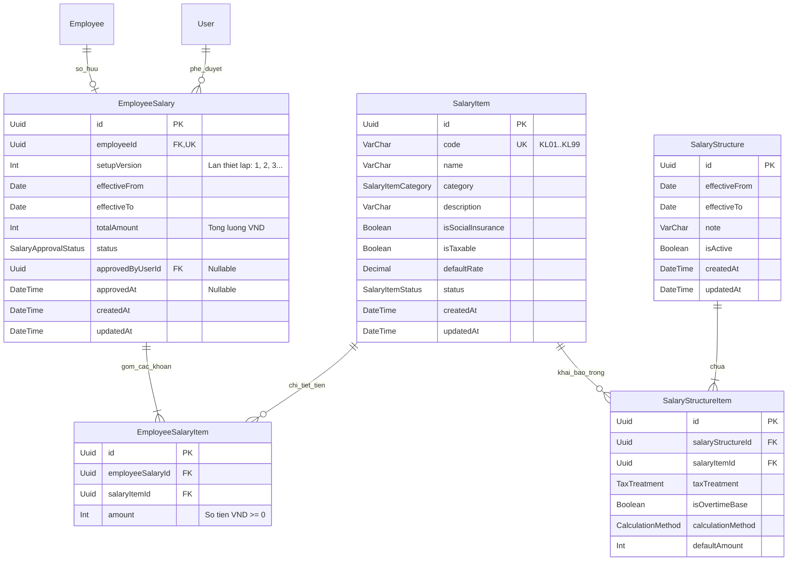

# HR — Mô hình Dữ liệu: Cài đặt lương (Salary Settings Data Model)

Tài liệu này định nghĩa chi tiết mô hình dữ liệu quan hệ (ERD, Prisma schema, PostgreSQL constraints, Enums, quan hệ FK và Indices) cho phân hệ **Cài đặt lương** (`SalarySettings`).

---

## 1. Sơ đồ Quan hệ Thực thể (Entity Relationship Diagram)



---

## 2. Định nghĩa Enums

```prisma
/// 7 loại khoản lương theo danh mục nghiệp vụ chuẩn
enum SalaryItemCategory {
  FIXED_ALLOWANCE       // Lương / Phụ cấp cố định (luong_phu_cap)
  BENEFIT_ALLOWANCE     // Lương hỗ trợ / phúc lợi: ăn ca, xăng xe, điện thoại (luong_ho_tro)
  DELIVERY_PIECEWORK    // Lương nghiệm thu: giao hàng, sản phẩm, đóng gói (luong_nghiem_thu)
  COMMISSION_PERCENTAGE // Lương phần trăm: hoa hồng doanh số (luong_phan_tram)
  KPI_PERFORMANCE       // Lương KPI: đánh giá hiệu quả công việc (luong_kpi)
  PERIODIC_BONUS        // Lương thưởng: lễ, tết, đột xuất (luong_thuong)
  ATTENDANCE_ALLOWANCE  // Lương chuyên cần (luong_chuyen_can)
}

/// Trạng thái hoạt động của khoản lương
enum SalaryItemStatus {
  ACTIVE   // Đang dùng ("1")
  INACTIVE // Ngừng dùng ("0")
}

/// Phân loại xử lý thuế TNCN trong cấu trúc lương
enum TaxTreatment {
  TAXABLE // Chịu thuế TNCN (tncn)
  EXEMPT  // Miễn thuế trong hạn mức (mien_thue)
}

/// Tiêu thức tính khoản thu nhập
enum CalculationMethod {
  MONTHLY_FIXED   // Cố định tháng (co_dinh_thang)
  ACTUAL_WORKDAYS // Theo ngày công thực tế (theo_ngay_cong)
  HOURLY          // Theo giờ làm việc (theo_gio)
  OUTPUT_BASED    // Theo sản lượng / doanh số (theo_san_luong)
}

/// Trạng thái phê duyệt mức lương nhân sự
enum SalaryApprovalStatus {
  DRAFT            // Nháp (nhap)
  PENDING_APPROVAL // Chờ duyệt (cho_duyet)
  APPROVED         // Đã duyệt (da_duyet)
  REJECTED         // Từ chối
}
```

---

## 3. Định nghĩa Prisma Models

Đoạn mã dưới đây được thiết kế sẵn sàng bổ sung vào `Backend/prisma/schema.prisma`:

```prisma
// ---------- Salary Settings Models ----------

/// Danh mục khoản lương & phụ cấp (BR-sal-001, BR-sal-002, BR-sal-003)
model SalaryItem {
  id                String             @id @default(uuid()) @db.Uuid
  /// Mã khoản tự sinh hoặc nhập tay: KL01..KL99
  code              String             @unique @db.VarChar(20)
  name              String             @db.VarChar(200)
  category          SalaryItemCategory
  description       String?            @db.VarChar(500)
  /// Tính vào gốc tiền lương đóng BHXH & kinh phí công đoàn
  isSocialInsurance Boolean            @default(false)
  /// Thuộc diện thu nhập chịu thuế TNCN
  isTaxable         Boolean            @default(true)
  /// Tỷ lệ % mặc định (dành riêng cho khoản hoa hồng/doanh thu)
  defaultRate       Decimal?           @db.Decimal(5, 2)
  status            SalaryItemStatus   @default(ACTIVE)
  createdAt         DateTime           @default(now()) @db.Timestamptz(3)
  updatedAt         DateTime           @updatedAt @db.Timestamptz(3)

  structureItems    SalaryStructureItem[]
  employeeItems     EmployeeSalaryItem[]

  @@index([category])
  @@index([status])
  @@map("salary_items")
}

/// Cấu trúc lương khung của doanh nghiệp theo kỳ hiệu lực
model SalaryStructure {
  id            String                @id @default(uuid()) @db.Uuid
  effectiveFrom DateTime              @db.Date
  effectiveTo   DateTime?             @db.Date
  note          String?               @db.VarChar(1000)
  isActive      Boolean               @default(true)
  createdAt     DateTime              @default(now()) @db.Timestamptz(3)
  updatedAt     DateTime              @updatedAt @db.Timestamptz(3)

  items         SalaryStructureItem[]

  @@index([isActive])
  @@map("salary_structures")
}

/// Bảng chi tiết từng dòng trong cấu trúc lương khung
model SalaryStructureItem {
  id                String            @id @default(uuid()) @db.Uuid
  salaryStructureId String            @db.Uuid
  salaryItemId      String            @db.Uuid

  taxTreatment      TaxTreatment      @default(TAXABLE)
  /// Tính vào đơn giá giờ làm việc tiêu chuẩn để tính tiền làm thêm giờ (tăng ca)
  isOvertimeBase    Boolean           @default(false)
  calculationMethod CalculationMethod @default(MONTHLY_FIXED)
  /// Số tiền lương/phụ cấp định mức gợi ý chuẩn (VND)
  defaultAmount     Int               @default(0)

  salaryStructure   SalaryStructure   @relation(fields: [salaryStructureId], references: [id], onDelete: Cascade)
  salaryItem        SalaryItem        @relation(fields: [salaryItemId], references: [id], onDelete: Restrict)

  @@unique([salaryStructureId, salaryItemId])
  @@index([salaryStructureId])
  @@index([salaryItemId])
  @@map("salary_structure_items")
}

/// Mức lương thiết lập cho từng nhân viên (Set lương)
model EmployeeSalary {
  id               String               @id @default(uuid()) @db.Uuid
  /// 1 nhân viên chỉ có 1 bản ghi cấu hình lương hiện hành
  employeeId       String               @unique @db.Uuid
  /// Số lần thiết lập / phiên bản (tăng dần 1, 2, 3...)
  setupVersion     Int                  @default(1)
  effectiveFrom    DateTime             @db.Date
  effectiveTo      DateTime?            @db.Date
  /// Tổng mức lương VND (= sum các khoản con)
  totalAmount      Int                  @default(0)
  status           SalaryApprovalStatus @default(PENDING_APPROVAL)

  approvedByUserId String?              @db.Uuid
  approvedAt       DateTime?            @db.Timestamptz(3)

  createdAt        DateTime             @default(now()) @db.Timestamptz(3)
  updatedAt        DateTime             @updatedAt @db.Timestamptz(3)

  employee         Employee             @relation(fields: [employeeId], references: [id], onDelete: Cascade)
  approvedByUser   User?                @relation("SalaryApprovedBy", fields: [approvedByUserId], references: [id], onDelete: SetNull)
  items            EmployeeSalaryItem[]

  @@index([employeeId])
  @@index([status])
  @@map("employee_salaries")
}

/// Chi tiết số tiền từng khoản của nhân viên
model EmployeeSalaryItem {
  id               String         @id @default(uuid()) @db.Uuid
  employeeSalaryId String         @db.Uuid
  salaryItemId     String         @db.Uuid
  /// Mức tiền áp dụng cho nhân viên (VND, >= 0)
  amount           Int            @default(0)

  employeeSalary   EmployeeSalary @relation(fields: [employeeSalaryId], references: [id], onDelete: Cascade)
  salaryItem       SalaryItem     @relation(fields: [salaryItemId], references: [id], onDelete: Restrict)

  @@unique([employeeSalaryId, salaryItemId])
  @@index([employeeSalaryId])
  @@index([salaryItemId])
  @@map("employee_salary_items")
}
```

> **Ghi chú quan hệ 2 chiều trên model `User`**:
> Khi thêm quan hệ `approvedByUser`, cần bổ sung trường đối ứng trên model `User`:
> `approvedSalaries EmployeeSalary[] @relation("SalaryApprovedBy")`

---

## 4. Ánh xạ (Mapping) với Frontend Types

| Database Field (Prisma) | Frontend Mock Type (`types.ts`) | Kiểu dữ liệu Frontend | Ghi chú chuyển đổi |
|---|---|---|---|
| `SalaryItem.code` | `KhoanLuong.ma_khoan` | `string` | `KL01`, `KL02`... |
| `SalaryItem.name` | `KhoanLuong.ten_khoan` | `string` | |
| `SalaryItem.category` | `KhoanLuong.loai` | `LoaiKhoanLuong` | Enum string lowercase |
| `SalaryItem.isSocialInsurance` | `KhoanLuong.tinh_bhxh` | `boolean` | |
| `SalaryItem.isTaxable` | `KhoanLuong.chiu_thue_tncn` | `boolean` | |
| `SalaryItem.status` | `KhoanLuong.status` | `TrangThai` | `"1"` (ACTIVE), `"0"` (INACTIVE) |
| `SalaryStructureItem.isOvertimeBase` | `DongCauTrucLuong.tang_ca` | `boolean` | |
| `SalaryStructureItem.taxTreatment` | `DongCauTrucLuong.phan_loai` | `PhanLoaiThue` | `"tncn"` / `"mien_thue"` |
| `SalaryStructureItem.calculationMethod`| `DongCauTrucLuong.tieu_thuc` | `TieuThucTinh` | `"co_dinh_thang"`, `"theo_ngay_cong"`... |
| `SalaryStructureItem.defaultAmount` | `DongCauTrucLuong.so_tien` | `number` | |
| `EmployeeSalary.setupVersion` | `SetLuongNhanVien.lan_thiet_lap`| `number` | Số lần thiết lập |
| `EmployeeSalary.status` | `SetLuongNhanVien.trang_thai` | `TrangThaiSetLuong` | `"nhap"`, `"cho_duyet"`, `"da_duyet"` |
| `EmployeeSalaryItem.amount` | `SetLuongNhanVien.khoan[ma]` | `Record<string, number>` | Map dạng object key-value |

---

## 5. Addendum — Round 2 Rà soát Độc lập (2026-09-06, Architect)

> Bổ sung sau khi BA Round 2 xác nhận qua code 2 gap nghiêm trọng (BR-sal-005, BR-sal-008) — xem `ADR-006` Addendum Mục A1-A3 cho lý do đầy đủ. Phần này chỉ ghi các thay đổi CẦN THIẾT lên schema/migration; Architect KHÔNG chạy migration (việc của Backend Engineer).

### 5.1 OQ-sal-01 (BR-sal-008) — KHÔNG có thay đổi schema

`Employee` **KHÔNG** thêm field mới. "Nhân viên đang làm việc" được suy luận từ `Contract` hiện có (`effectiveFrom`/`effectiveTo`) — xem ADR-006 Addendum Mục A1. Backend Engineer CHỈ cần sửa logic Service (`employee-salaries.service.ts`), KHÔNG cần `prisma migrate`.

### 5.2 OQ-sal-03 (BR-sal-005) — KHÔNG có thay đổi schema

Validate ở tầng Service trong `setSalary()` (đối chiếu `SalaryStructureItem` của cấu trúc `isActive = true`), không thêm bảng/cột/constraint. Xem ADR-006 Addendum Mục A2.

### 5.3 OQ-sal-02 (BR-sal-002) — CẦN migration MỚI: UNIQUE index case-insensitive cho `(category, name)`

Khuyến nghị (không chặn) — nếu Backend Engineer triển khai ở Round 2, cần 1 migration MỚI (KHÔNG sửa migration `20260906014946_add_salary_settings` đã áp dụng — nguyên tắc migration append-only, không sửa migration đã chạy trên môi trường dev/CI):

```sql
-- Migration mới, ví dụ tên: add_salary_item_name_ci_unique
CREATE UNIQUE INDEX "salary_items_category_name_ci_key"
  ON "salary_items" (category, lower(trim(name)));
```

- Không biểu diễn được bằng Prisma schema DSL (expression index) — thêm tay vào migration.sql, cùng tiền lệ `EXCLUDE` constraint của `Contract` (ADR-002). Khuyến nghị thêm comment trong `schema.prisma` tại model `SalaryItem` trỏ tới migration này (giống cách `Contract` đã ghi chú "EXCLUDE constraint — thêm tay vào migration.sql").
- Sau khi thêm, `SalaryItemsService.create()`/`update()` cần bắt lỗi vi phạm index và map về `E-sal-002` (409, giữ nguyên message hiện có) — verify THẬT bằng test tích hợp (không suy đoán mã lỗi Prisma, theo đúng bài học ADR-002 Mục Consequences).

### 5.4 ERD — không có entity mới, không đổi cardinality

Sơ đồ ERD Mục 1 của TÀI LIỆU NÀY giữ nguyên — cả 2 gap BR-sal-005/BR-sal-008 được giải quyết bằng LOGIC đọc dữ liệu hiện có (join `Contract`, join `SalaryStructureItem`), không cần entity/quan hệ mới. Xác nhận thêm: sơ đồ ERD Mục 1 ở đây CHƯA BAO GIỜ có entity `SALARY_APPROVAL_HISTORY` — khớp đúng code thật. Entity thừa `SALARY_APPROVAL_HISTORY` mà BA Round 2 phát hiện và đã xoá chỉ tồn tại ở sơ đồ ERD RIÊNG trong `salary-settings-spec.md` Mục 6 (lỗi tài liệu nội tại của bản spec, không liên quan tới tài liệu data-model này).
