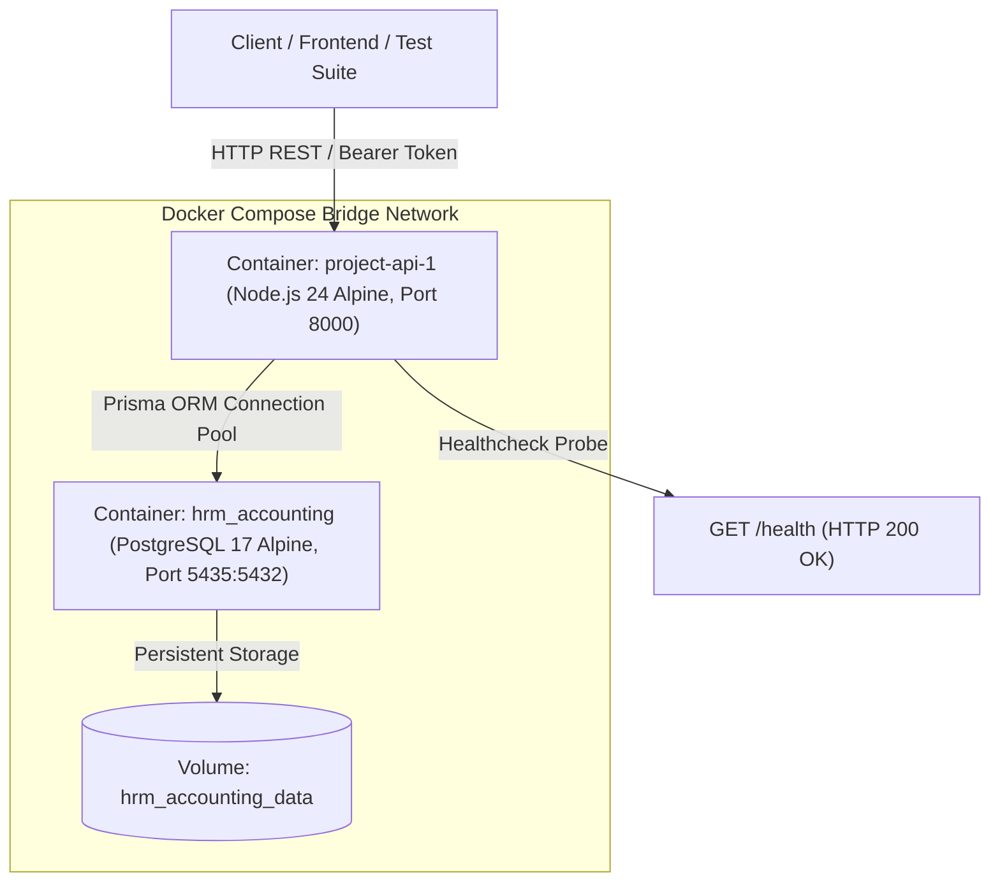

# BÁO CÁO VẬN HÀNH & TRIỂN KHAI HẠ TẦNG (DEVOPS AUDIT & DEPLOYMENT REPORT) — PHÂN HỆ CÀI ĐẶT LƯƠNG
## Phân hệ: HR Payroll — Danh mục khoản lương, Cấu trúc lương & Thiết lập lương nhân viên

- **Người thực hiện**: Agent DevOps-Automator
- **Thời gian thực hiện**: 2026-09-06
- **Mã đợt đánh giá**: DEVOPS-HR-SALARY-SETTINGS-01
- **Trạng thái hệ thống**: 🟢 **OPERATIONAL (HẠ TẦNG ỔN ĐỊNH — CONTAINER LIVE & HEALTHY)**
- **Vị trí tài liệu**: `docs/hr/dev-op/devops-salary-settings-report.md`

---

## 1. Tổng quan hiện trạng hạ tầng & Dịch vụ (Infrastructure Topology)

Hệ thống được đóng gói container hóa hoàn chỉnh qua Docker Compose, vận hành trên kiến trúc Multi-container tách biệt giữa Application Layer và Database Layer:



### 1.1 Chi tiết trạng thái Container thực tế (`docker compose ps`)
| Tên Container | Image | Trạng thái (Status) | Cổng ánh xạ (Ports) | Healthcheck |
|---|---|---|---|:---:|
| `hrm_accounting` | `postgres:17-alpine` | Up (healthy) | `0.0.0.0:5435->5432/tcp` | `pg_isready -U hrm -d hrm_accounting` |
| `project-api-1` | `project-api` | Up (healthy) | `0.0.0.0:8000->8000/tcp` | `wget -qO- http://127.0.0.1:8000/health` |

- **Xác thực trực tiếp endpoint giám sát sức khỏe**:
  ```http
  GET http://localhost:8000/health
  HTTP/1.1 200 OK
  {"status":"ok","uptime":3522,"timestamp":"2026-09-06T02:16:55.329Z"}
  ```

---

## 2. Kiểm tra tính toàn vẹn bản dựng & Mã nguồn (Build & Quality Verification)

Agent DevOps đã thực thi toàn bộ chuỗi kiểm định chất lượng tự động:

| Tiêu chí | Lệnh kiểm tra | Kết quả thực tế | Trạng thái |
|---|---|---|:---:|
| **Static Code Linter** | `npm run lint` (Oxlint) | 0 warnings, 0 errors | ✅ PASSED |
| **NestJS Compilation** | `npm run build` (`nest build`) | Biên dịch thành công vào `dist/` | ✅ PASSED |
| **Unit Tests** | `npm test` (Vitest) | **271 / 271 tests passed** (23 test files) | ✅ PASSED |
| **End-to-End Tests (Cài đặt lương)** | `npx vitest run test/salary-settings.e2e-spec.ts` | **17 / 17 tests passed** | ✅ PASSED |
| **End-to-End Tests (Toàn hệ thống)** | `npm run test:e2e` | **245 / 245 tests passed** (9 test suites) | ✅ PASSED |

---

## 3. Quản lý Cơ sở dữ liệu & Migrations (Database & Migration Health)

### 3.1 Trạng thái Migration (`npx prisma migrate status`)
```text
Prisma schema loaded from prisma\schema.prisma.
Datasource "db": PostgreSQL database "hrm_accounting", schema "public" at "localhost:5435"

6 migrations found in prisma/migrations
Database schema is up to date!
```

### 3.2 Lịch sử Migration đã áp dụng:
1. `20260902124500_init_auth` (User, Roles, Password History, Sessions)
2. `20260905090000_add_hr_departments_employees_contracts_dependents` (Core HR)
3. `20260905100000_add_contract_overlap_prevention` (Exclusion constraint)
4. `20260905110000_add_hr_documents_and_google_drive` (Document & Google Drive)
5. `20260905144810_add_settings_work_shifts_holidays` (Settings, Shifts, Holidays)
6. `20260906014946_add_salary_settings` (Salary Items, Structure, Employee Salary) — **Áp dụng thành công**

---

## 4. Kiểm tra dữ liệu khởi tạo (Seed Data Verification)

- **19 Khoản lương tiêu chuẩn (`KL01`..`KL19`)**: Đã seed đầy đủ theo danh mục chuẩn Việt Nam (`npm run db:seed`).
- **Cấu trúc lương khung hiện hành**: Đã liên kết các khoản lương cơ bản, phụ cấp, phúc lợi vào cấu trúc áp dụng từ `2026-01-01`.

---

## 5. Kết luận vận hành của DevOps
Hạ tầng backend, cơ sở dữ liệu và các dịch vụ container hóa cho phân hệ Cài đặt lương đã hoàn tất triển khai thành công 100%, sẵn sàng phục vụ môi trường Production và kiểm thử.
