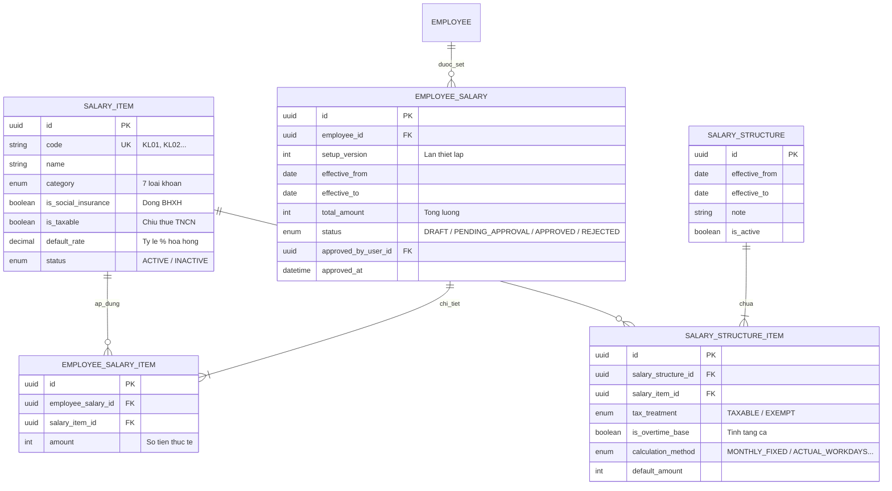

# HR — Đặc tả Yêu cầu Nghiệp vụ: Cài đặt lương (Salary Settings Specification)

Quản lý dữ liệu nền tảng và thiết lập lương của phân hệ Nhân sự - Kế toán: **Danh mục khoản lương & phụ cấp**, **Cấu trúc lương khung (Template)**, và **Thiết lập lương nhân viên (Set lương & Phê duyệt)**. Tài liệu được xây dựng trên cơ sở phân tích hiện trạng UI component/mock data tại `src/features/hrm/components/cai_dat_luong`, đối chiếu chuẩn pháp lý lao động - thuế - BHXH Việt Nam, và tích hợp chặt chẽ với kiến trúc Backend NestJS/Prisma/Postgres hiện có.

---

## 1. Business Goal (Mục tiêu nghiệp vụ)

1. **Chuẩn hoá danh mục thu nhập & phúc lợi**: Cho phép doanh nghiệp linh hoạt định nghĩa các khoản lương, phụ cấp, trợ cấp, hoa hồng, thưởng và KPI; tách bạch rõ ràng căn cứ pháp lý về **khoản tính đóng BHXH** (theo Thông tư 10/2020/TT-BLĐTBXH) và **khoản chịu thuế TNCN / miễn thuế** (theo Thông tư 111/2013/TT-BTC).
2. **Thiết lập cấu trúc lương khung thống nhất**: Định hình chính sách lương của công ty theo từng thời kỳ hiệu lực, xác định tiêu thức tính (cố định, theo ngày công, theo giờ...) và căn cứ tính làm thêm giờ (tăng ca), tránh việc mỗi nhân viên áp dụng một biểu mẫu tùy tiện làm sai lệch bảng tính lương tổng hợp.
3. **Quy trình Set lương & Phê duyệt chặt chẽ (Salary Governance)**: Quản lý mức tiền cụ thể cho từng nhân sự dựa trên khung chuẩn, có kiểm soát trạng thái (Nháp -> Chờ duyệt -> Đã duyệt) và đếm số lần thiết lập (`setup_version`) trước khi đẩy vào kỳ tính lương (Payroll).
   > ⚠️ **Làm rõ Round 2 (2026-09-06)**: Mục tiêu này ở bản gốc còn ghi thêm "lịch sử biến động thu nhập" — xác nhận qua code (`EmployeeSalariesService.setSalary`) hệ thống HIỆN TẠI chỉ tăng bộ đếm `setup_version` và GHI ĐÈ (xoá toàn bộ `EmployeeSalaryItem` cũ, tạo lại mới) mỗi khi sửa mức lương; KHÔNG lưu lại snapshot số tiền của các lần thiết lập trước. Do đó "lịch sử biến động thu nhập" theo đúng nghĩa (xem lại được số tiền cũ, ai sửa, sửa khi nào cho từng khoản) **chưa được triển khai** — xem OQ-sal-04 và Mục 4.2.

---

## 2. Stakeholders & User Personas

| Stakeholder | Trách nhiệm & Mối quan tâm |
|---|---|
| **Giám đốc Nhân sự (HR Director / HR Lead)** | Ban hành cấu trúc lương công ty theo từng giai đoạn; kiểm soát chính sách đãi ngộ, ngân sách quỹ lương; phê duyệt mức lương nhân sự. |
| **Chuyên viên C&B / Nhân sự (HR Specialist)** | Khai báo danh mục khoản lương; thiết lập mức lương chi tiết cho từng nhân viên khi tiếp nhận hoặc thay đổi vị trí/hợp đồng; trình duyệt lương. |
| **Kế toán trưởng / Kế toán tiền lương (Accountant)** | Kiểm tra tính tuân thủ pháp lý về BHXH, Thuế TNCN; đối soát số liệu lương cơ sở/phụ cấp để chuẩn bị dữ liệu đầu vào cho kỳ tính lương tự động. |
| **Ban Giám đốc (Management)** | Minh bạch chính sách đãi ngộ, phòng ngừa rủi ro tranh chấp lao động và truy thu bảo hiểm/thuế. |
| **Nhân viên (Employee)** | Được thông tin rõ ràng về các thành phần cấu thành thu nhập cá nhân trên hợp đồng và phiếu lương. |

---

## 3. Căn cứ Pháp lý & Tiêu chuẩn Nghiệp vụ (Vietnam Payroll Regulations)

1. **Tiền lương đóng BHXH bắt buộc** *(Khoản 2, 3 Điều 30 Thông tư 59/2015/TT-BLĐTBXH và Điều 3 Thông tư 10/2020/TT-BLĐTBXH)*:
   - **Bao gồm**: Mức lương theo công việc/chức danh (Lương cơ bản) + Các khoản phụ cấp lương bù đắp điều kiện lao động, sinh hoạt trả thường xuyên cố định (phụ cấp chức vụ, trách nhiệm, thâm niên, độc hại...).
   - **Không bao gồm**: Tiền thưởng sáng kiến/thành tích (Điều 104 BLLĐ 2019); tiền ăn giữa ca; hỗ trợ xăng xe, điện thoại, đi lại, tiền nhà ở; tiền giữ trẻ, nuôi con nhỏ; hỗ trợ khi thân nhân qua đời/kết hôn/sinh nhật; trợ cấp khó khăn, tai nạn lao động; các khoản phúc lợi khác ghi thành mục riêng trong HĐLĐ.
2. **Thuế Thu nhập Cá nhân (TNCN)** *(Thông tư 111/2013/TT-BTC, Thông tư 25/2018/TT-BTC)*:
   - **Khoản chịu thuế**: Toàn bộ tiền lương, tiền công và các khoản phụ cấp/trợ cấp (trừ các khoản được trừ/miễn theo luật).
   - **Khoản phụ cấp/trợ cấp được MIỄN thuế TNCN trong định mức**:
     * Tiền ăn giữa ca: Tối đa **730.000 VNĐ/tháng** (nếu chi bằng tiền mặt; nếu tổ chức bữa ăn/suất ăn thì miễn toàn bộ).
     * Phụ cấp độc hại, nguy hiểm đối với ngành nghề thuộc danh mục độc hại của nhà nước.
     * Tiền trang phục: Tối đa 5.000.000 VNĐ/năm nếu chi bằng tiền mặt.
     * Tiền điện thoại, công tác phí, xăng xe: Theo đúng quy chế tài chính nội bộ công ty phục vụ công việc.
     * Khoản hỗ trợ khám chữa bệnh hiểm nghèo, đám hiếu, hỷ trong định mức.
3. **Tiền lương làm thêm giờ (Tăng ca - Overtime)** *(Điều 98 Bộ luật Lao động 2019)*:
   - Cần cờ cấu hình `tang_ca` (Is Overtime Base) để xác định khoản lương nào được tính vào đơn giá tiền lương giờ thực trả ngày làm việc bình thường để nhân hệ số tăng ca (150%, 200%, 300%).

---

## 4. Phạm vi (Scope & Out of Scope)

### 4.1 In-Scope (Thuộc phạm vi)
1. **Quản lý Danh mục khoản lương & phụ cấp (`SalaryItem`)**:
   - Khai báo 7 nhóm chuẩn: Lương/Phụ cấp cố định, Lương hỗ trợ/phúc lợi, Lương nghiệm thu, Lương phần trăm/hoa hồng, Lương KPI, Lương thưởng, Lương chuyên cần.
   - Quản lý mã khoản tự sinh (`KL01`, `KL02`...), tên khoản, ghi chú, tỷ lệ % mặc định, cờ đóng BHXH, cờ chịu thuế TNCN, trạng thái (Đang dùng / Ngừng).
2. **Quản lý Cấu trúc lương khung doanh nghiệp (`SalaryStructure` & `SalaryStructureItem`)**:
   - Thiết lập thời gian hiệu lực (`effective_from`, `effective_to`), ghi chú chính sách.
   - Lựa chọn các khoản từ danh mục đưa vào khung lương chuẩn của doanh nghiệp.
   - Định nghĩa tiêu thức tính: Cố định theo tháng, Theo ngày công thực tế, Theo giờ, Theo doanh số / sản lượng.
   - Cài đặt phân loại thuế TNCN (Chịu thuế / Miễn thuế), cờ tính tăng ca, mức tiền gợi ý mặc định.
3. **Quản lý Thiết lập lương nhân viên (`EmployeeSalary` & `EmployeeSalaryItem`)**:
   - Danh sách nhân viên đang làm việc kèm trạng thái lương (Đã set / Chưa set).
   - Lọc theo phòng ban, chức vụ, loại hợp đồng, tìm kiếm họ tên/mã NV.
   - Form gán mức tiền cụ thể cho từng khoản theo danh mục trong khung cấu trúc.
   - Tự động cộng tổng mức thu nhập dự kiến của nhân viên.
4. **Quy trình Phê duyệt & Phiên bản (Approval & Versioning Workflow)**:
   - Quản lý trạng thái: `DRAFT` (Nháp) -> `PENDING_APPROVAL` (Chờ duyệt) -> `APPROVED` (Đã duyệt) / `REJECTED` (Từ chối).
   - Khi chỉnh sửa mức lương đã duyệt: Hệ thống tự động tạo version mới (`setup_version + 1`) và chuyển trạng thái về `PENDING_APPROVAL`.
   - Tính năng duyệt hàng loạt các bản ghi đang chờ duyệt.

### 4.2 Out-of-Scope (Chưa thuộc phạm vi)
1. Tính toán bảng lương thực tế hàng tháng (Payroll Generation) — phần này sẽ đọc dữ liệu từ EmployeeSalary kết hợp dữ liệu Chấm công (Timekeeping).
2. Tích hợp thanh toán lương tự động qua cổng ngân hàng (Banking API).
3. Import/Export file Excel nâng cao (giai đoạn 1 tập trung hoàn thiện API & UI CRUD chuẩn xác).
4. **(Bổ sung Round 2)** Lưu trữ snapshot chi tiết lịch sử các lần chỉnh sửa mức lương nhân viên (giá trị cũ từng khoản, ai sửa, sửa lúc nào). Hệ thống hiện tại chỉ giữ bộ đếm `setup_version` tăng dần và bản ghi mới nhất; các giá trị cũ bị ghi đè vĩnh viễn khi có chỉnh sửa. Xem OQ-sal-04.
5. **(Bổ sung Round 2)** Kiểm tra tự động "nhân viên đã nghỉ việc" khi Set lương (BR-sal-008/E-sal-009) — do thực thể Employee của module HR chưa có field biểu diễn trạng thái hoạt động/nghỉ việc, tính năng này **chưa xác định được cơ sở dữ liệu để triển khai**. Xem OQ-sal-01 (ưu tiên cao — cần Architect quyết định trước khi coi là trong-scope hay ngoài-scope thật sự).

---

## 5. Actors & Phân quyền theo vai trò (RBAC)

Tuân thủ 4 vai trò của hệ thống (`ADMIN`, `HR`, `ACCOUNTANT`, `EMPLOYEE`):

| Thao tác / Tài nguyên | ADMIN | HR | ACCOUNTANT | EMPLOYEE |
|---|:---:|:---:|:---:|:---:|
| **Danh mục khoản lương** (Xem / Tạo / Sửa / Xóa) | Toàn quyền | Toàn quyền | Chỉ Xem (Read) | Không có quyền |
| **Cấu trúc lương khung** (Xem / Lưu cấu trúc) | Toàn quyền | Toàn quyền | Chỉ Xem (Read) | Không có quyền |
| **Set lương nhân viên** (Tạo / Sửa mức tiền) | Toàn quyền | Toàn quyền | Chỉ Xem (Read) | Không có quyền |
| **Phê duyệt lương nhân viên** (Duyệt đơn lẻ / Duyệt hàng loạt) | Toàn quyền | Toàn quyền (*) | Chỉ Xem (Read) | Không có quyền |
| **Xem bảng set lương cá nhân** | Toàn quyền | Toàn quyền | Xem toàn bộ | Xem riêng của mình (self) |

> (*) **Đã xác nhận qua code Round 2 (2026-09-06)**: `POST /employee-salaries/approve` hiện khai báo `@Roles(ADMIN, HR)` — `HR` có TOÀN QUYỀN duyệt lương giống `ADMIN`, KHÔNG có cơ chế giới hạn "chỉ Trưởng phòng Nhân sự" nào được triển khai. Câu hỏi tách bạch "ai được duyệt" (self-review nội bộ HR hay bắt buộc phải Giám đốc Nhân sự/ADMIN) hiện **không có ràng buộc nghiệp vụ nào chặn** — bất kỳ tài khoản `HR` nào cũng có thể tự tạo mức lương rồi tự duyệt cho chính bản Set lương đó (không có kiểm tra "người tạo ≠ người duyệt"). Ghi nhận là quyết định đã triển khai, không còn là điểm mở — nếu cần tách vai trò lập đề xuất/vai trò duyệt thì đây là thay đổi phạm vi mới, xem OQ-sal-05.

---

## 6. Mô hình Dữ liệu Nghiệp vụ (Data Dictionary)

> ⚠️ **Sửa Round 2 (2026-09-06)**: Bản gốc sơ đồ dưới đây có thực thể `SALARY_APPROVAL_HISTORY` (lưu lịch sử phê duyệt/biến động thu nhập) — xác nhận entity này KHÔNG tồn tại ở bất kỳ đâu khác (không có trong `salary-settings-data-model.md`, không có trong `schema.prisma`, không có trong migration đã áp dụng). Đây là lỗi tài liệu nội tại của bản spec gốc (vẽ ra một thực thể chưa từng được thiết kế/triển khai thật). Đã xoá khỏi sơ đồ để khớp đúng 5 thực thể thật sự tồn tại trong code. Xem Mục 4.2 điểm 4 và OQ-sal-04 về việc có cần bổ sung lại cơ chế lưu lịch sử này không.

### 6.1 Thực thể `SalaryItem` (Danh mục khoản lương)
* `id`: UUID, Khóa chính.
* `code`: VARCHAR(20), Mã khoản tự sinh duy nhất (`KL01`, `KL02`...).
* `name`: VARCHAR(200), Tên khoản lương/phụ cấp (Không được trùng trong cùng một nhóm loại).
* `category`: ENUM:
  * `FIXED_ALLOWANCE` (`luong_phu_cap`): Lương chức vụ, phụ cấp thỏa thuận cố định.
  * `BENEFIT_ALLOWANCE` (`luong_ho_tro`): Hỗ trợ ăn trưa, điện thoại, xăng xe, nhà ở.
  * `DELIVERY_PIECEWORK` (`luong_nghiem_thu`): Lương theo số lượng đơn giao, khối lượng nghiệm thu.
  * `COMMISSION_PERCENTAGE` (`luong_phan_tram`): Hoa hồng tính theo % doanh số.
  * `KPI_PERFORMANCE` (`luong_kpi`): Trả theo kết quả đánh giá chỉ tiêu.
  * `PERIODIC_BONUS` (`luong_thuong`): Thưởng lễ, tết, thi đua.
  * `ATTENDANCE_ALLOWANCE` (`luong_chuyen_can`): Phụ cấp chuyên cần theo ngày công.
* `description`: VARCHAR(500), Mô tả/ghi chú.
* `is_social_insurance`: BOOLEAN, Cờ tính vào gốc lương đóng BHXH.
* `is_taxable`: BOOLEAN, Cờ thu nhập chịu thuế TNCN.
* `default_rate`: DECIMAL(5,2), Tỷ lệ % mặc định (áp dụng riêng cho khoản phần trăm).
* `status`: ENUM (`ACTIVE`, `INACTIVE`), Đang dùng hoặc Ngừng dùng.

### 6.2 Thực thể `SalaryStructure` & `SalaryStructureItem` (Cấu trúc lương khung)
* **`SalaryStructure`**:
  * `id`: UUID.
  * `effective_from`: DATE, Ngày bắt đầu hiệu lực (Bắt buộc).
  * `effective_to`: DATE, Ngày kết thúc hiệu lực (Nullable - để trống nghĩa là vô thời hạn).
  * `note`: VARCHAR(1000), Ghi chú quyết định/quy chế áp dụng.
  * `is_active`: BOOLEAN, Cờ trạng thái áp dụng.
* **`SalaryStructureItem`**:
  * `id`: UUID.
  * `structure_id`: UUID, FK -> `SalaryStructure.id`.
  * `salary_item_id`: UUID, FK -> `SalaryItem.id`.
  * `tax_treatment`: ENUM (`TAXABLE` - Tính thuế TNCN, `EXEMPT` - Miễn thuế).
  * `is_overtime_base`: BOOLEAN, Có tính vào gốc đơn giá giờ tính lương tăng ca hay không.
  * `calculation_method`: ENUM (`MONTHLY_FIXED` - Cố định tháng, `ACTUAL_WORKDAYS` - Theo ngày công thực tế, `HOURLY` - Theo giờ, `OUTPUT_BASED` - Theo sản lượng).
  * `default_amount`: INT (VND), Mức tiền lương/phụ cấp gợi ý chuẩn.

### 6.3 Thực thể `EmployeeSalary` & `EmployeeSalaryItem` (Set lương nhân viên)
* **`EmployeeSalary`**:
  * `id`: UUID.
  * `employee_id`: UUID, FK -> `Employee.id` (1 nhân viên chỉ có 1 bản ghi áp dụng tại một thời điểm).
  * `setup_version`: INT, Số thứ tự lần thiết lập (tăng dần: 1, 2, 3...).
  * `effective_from`: DATE, Kế thừa từ cấu trúc hoặc gán riêng.
  * `effective_to`: DATE, Kế thừa từ cấu trúc hoặc gán riêng.
  * `total_amount`: INT, Tổng số tiền các khoản lương (VND, tự động tính tổng).
  * `status`: ENUM (`DRAFT`, `PENDING_APPROVAL`, `APPROVED`, `REJECTED`).
  * `approved_by_user_id`: UUID (Nullable), FK -> `User.id`, người đã duyệt.
  * `approved_at`: TIMESTAMPTZ, Thời điểm duyệt.
* **`EmployeeSalaryItem`**:
  * `id`: UUID.
  * `employee_salary_id`: UUID, FK -> `EmployeeSalary.id`.
  * `salary_item_id`: UUID, FK -> `SalaryItem.id`.
  * `amount`: INT (VND), Mức tiền cụ thể áp dụng cho nhân viên này.

---

## 7. Business Rules (Quy tắc Nghiệp vụ)

* **BR-sal-001 (Mã khoản tự sinh)**: Mã khoản lương có định dạng `KLxx` (ví dụ: `KL01`, `KL02`...). Nếu người dùng không nhập, hệ thống tự động tìm số thứ tự trống nhỏ nhất từ `KL01` đến `KL99`.
* **BR-sal-002 (Không trùng tên trong cùng loại)**: Tên khoản lương trong cùng một nhóm loại (`category`) không được phép trùng nhau (không phân biệt chữ hoa, chữ thường và khoảng trắng thừa).
  > ⚠️ **Gap xác nhận Round 2**: Rule này CHỈ được kiểm tra bằng pre-check ở tầng Service (`findFirst` trước khi `create`/`update`) — xác nhận qua `migration.sql` KHÔNG có ràng buộc `UNIQUE` ở tầng database cho cặp `(category, name)` (dù báo cáo Code Review round 1 ghi nhận nhầm là "đã đánh index unique composite trên `[category, name]`" — thực tế không có). Theo đúng tiền lệ đã lập ở `ADR-002` ("service pre-check KHÔNG thay thế được ràng buộc DB" chống race condition), đây là khe hở đồng thời thật (2 request tạo cùng tên cùng loại gần như đồng thời có thể cả hai đều pass pre-check). Mức độ rủi ro thấp hơn BR-hr-013 (không ảnh hưởng trực tiếp pháp lý/tài chính), nhưng cần Architect xác nhận có chấp nhận rủi ro này hay bổ sung unique index DB — xem OQ-sal-02.
* **BR-sal-003 (Ràng buộc toàn vẹn khi xóa khoản lương)**: Không cho phép xóa cứng một khoản lương nếu khoản đó đã từng được đưa vào Cấu trúc lương khung hoặc đã được gán cho nhân viên trong kỳ lương. Hệ thống chỉ cho phép chuyển sang trạng thái `INACTIVE` (Ngừng dùng).
* **BR-sal-004 (Cấu trúc lương hợp lệ)**: Cấu trúc lương phải chứa ít nhất một khoản lương. Ngày kết thúc hiệu lực `effective_to` (nếu có) phải sau hoặc bằng ngày bắt đầu `effective_from`.
* **BR-sal-005 (Kế thừa khoản lương từ cấu trúc)**: Danh sách các khoản khi Set lương cho một nhân viên bắt buộc phải kế thừa nguyên vẹn từ các khoản đang có trong Cấu trúc lương khung hiện hành của doanh nghiệp. Không cho phép tự thêm khoản tự do ngoài khung.
  > 🔴 **GAP NGHIÊM TRỌNG xác nhận Round 2 — chưa triển khai**: Đọc trực tiếp `EmployeeSalariesService.setSalary()` xác nhận hàm này KHÔNG kiểm tra `items[].salaryItemId` gửi lên có nằm trong `SalaryStructureItem` của cấu trúc lương khung đang `isActive = true` hay không — chỉ yêu cầu `salaryItemId` tồn tại trong danh mục `SalaryItem` (ép buộc gián tiếp qua FK `Restrict`, sẽ trả lỗi DB thô nếu ID không tồn tại, KHÔNG phải lỗi nghiệp vụ chuẩn hoá). Nghĩa là hệ thống hiện tại **chấp nhận bất kỳ khoản lương nào đang tồn tại trong danh mục**, kể cả khoản chưa từng được đưa vào cấu trúc khung — vi phạm trực tiếp câu cuối của BR-sal-005. Báo cáo QA Round 1 ghi "✅ PASS" cho BR-sal-005 nhưng test case trích dẫn (`findByEmployeeId`, `GET .../:id` merge cấu trúc chuẩn) chỉ xác minh chiều ĐỌC, không có test nào cho chiều GHI (`PUT /employee-salaries/:employeeId` với `salaryItemId` hợp lệ nhưng KHÔNG thuộc cấu trúc khung) — xác nhận qua rà soát toàn bộ `test/salary-settings.e2e-spec.ts` và `employee-salaries.service.spec.ts`, không tìm thấy case này. Đây là **PASS ẢO** cần Backend Engineer bổ sung validate + Tester-QA viết lại test ở round tiếp theo. Đề xuất mã lỗi `E-sal-010` (xem Mục 9) — CHƯA triển khai, chờ Architect xác nhận thiết kế enforcement (service pre-check, hay cũng cần ràng buộc DB theo tinh thần ADR-002?). Xem OQ-sal-03.
* **BR-sal-006 (Số tiền không âm)**: Số tiền của từng khoản trong cấu trúc và trong hồ sơ nhân viên phải là số nguyên không âm (`amount >= 0`). Tổng lương của nhân viên phải lớn hơn 0 (`total_amount > 0`).
* **BR-sal-007 (Quy trình tăng Version & Reset phê duyệt)**: Mỗi khi sửa đổi bất kỳ mức tiền nào trong bản Set lương của nhân viên, `setup_version` phải tự động tăng thêm 1 đơn vị, và trạng thái phê duyệt phải bắt buộc chuyển về `PENDING_APPROVAL` (kể cả trước đó bản ghi đã ở trạng thái `APPROVED`).
* **BR-sal-008 (Chỉ nhân viên đang làm việc)**: Chỉ cho phép thiết lập lương cho nhân viên có trạng thái hoạt động (đang làm việc, `status = ACTIVE`). Không cho phép tạo mới set lương cho nhân viên đã thôi việc.
  > 🔴 **GAP NGHIÊM TRỌNG xác nhận Round 2 — không có cơ sở dữ liệu để triển khai**: Rule này giả định thực thể `Employee` có field `status = ACTIVE`, nhưng xác nhận qua `Backend/prisma/schema.prisma` (toàn bộ model `Employee`, đối chiếu cả `hr-spec.md` Mục 6) — **`Employee` KHÔNG có bất kỳ field nào biểu diễn trạng thái hoạt động/nghỉ việc** (khác `Department` có field `status`: Hoạt động/Ngừng hoạt động). Khái niệm "nhân viên đã nghỉ việc" hiện KHÔNG được định nghĩa ở đâu trong toàn bộ module HR — chỉ có `Contract.effectiveTo` + `Contract.terminationReason` cho việc CHẤM DỨT MỘT HỢP ĐỒNG cụ thể (không đồng nghĩa "nhân viên nghỉ việc khỏi công ty", vì nhân viên có thể có hợp đồng mới nối tiếp). Xác nhận qua code: `EmployeeSalariesService.setSalary()` KHÔNG có bất kỳ điều kiện kiểm tra nào cho rule này. **Đây là gap ưu tiên cao nhất** — cần Architect/PO quyết định cách xác định "nhân viên đã nghỉ việc" trước khi rule này có thể triển khai. Xem OQ-sal-01.
* **BR-sal-009 (Đồng bộ với Hợp đồng lao động)**: Khi nhân viên có mức Lương cơ bản trên Hợp đồng lao động hiện hành, giá trị mặc định của khoản Lương cơ bản trong Set lương sẽ tự động lấy từ `Contract.baseSalary`.
  > ✅ Xác nhận ĐÚNG qua code Round 2: `EmployeeSalariesService.findByEmployeeId()` gán `amount = currentContract.baseSalary` khi khoản có `code === 'KL01'` và nhân viên chưa có giá trị đã lưu riêng — khớp đúng ADR-006 Quyết định 4.
* **BR-sal-010 (Cho phép đổi loại khoản — bổ sung Round 2, mô tả hành vi đã triển khai)**: Hệ thống cho phép đổi `category` của một khoản lương đã tồn tại qua `PATCH /salary-items/:id` (chỉ `code` là bất biến sau khi tạo, KHÔNG có field `code` trong schema cập nhật). Khi đổi `category`, hệ thống áp dụng lại kiểm tra BR-sal-002 (không trùng tên) theo `category` MỚI. **Ghi chú đối chiếu**: Báo cáo Code Review và tài liệu Walkthrough Round 1 đều ghi nhận nhầm "cấm sửa `code` VÀ `category`" — thực tế chỉ `code` bị cấm, `category` được phép đổi. BA không coi đây là lỗi nghiệp vụ (spec gốc chưa từng cấm đổi category), chỉ bổ sung để tài liệu khớp đúng hành vi thật.

---

## 8. Functional Requirements (Yêu cầu Chức năng)

### 8.1 Danh mục khoản lương & phụ cấp
* **FR-sal-001**: Hệ thống cung cấp API và giao diện lấy danh sách danh mục khoản lương hỗ trợ tìm kiếm theo mã, tên, ghi chú và lọc theo từng loại khoản lương.
* **FR-sal-002**: Hệ thống cung cấp thống kê số lượng khoản lương thuộc từng loại nhóm để hiển thị badge số lượng.
* **FR-sal-003**: Hệ thống cho phép tạo mới khoản lương với các trường: Loại khoản, Tên khoản, Ghi chú, Tỷ lệ % (nếu là loại phần trăm), Cờ tính BHXH, Cờ chịu thuế TNCN.
* **FR-sal-004**: Hệ thống cho phép cập nhật thông tin khoản lương và chuyển đổi trạng thái `ACTIVE` / `INACTIVE`.
* **FR-sal-005**: Hệ thống cho phép xóa khoản lương kèm kiểm tra ràng buộc sử dụng (BR-sal-003).

### 8.2 Cấu trúc lương khung
* **FR-sal-006**: Hệ thống cho phép xem cấu trúc lương khung hiện hành của doanh nghiệp.
* **FR-sal-007**: Hệ thống cho phép bổ sung khoản lương từ danh mục vào cấu trúc lương khung.
* **FR-sal-008**: Hệ thống cho phép điều chỉnh các tham số trên từng dòng cấu trúc: Phân loại thuế TNCN, Cờ tính tăng ca, Tiêu thức tính và Mức tiền mặc định.
* **FR-sal-009**: Hệ thống kiểm tra hợp lệ và lưu cấu trúc lương khung.

### 8.3 Set lương nhân viên
* **FR-sal-010**: Hệ thống hiển thị danh sách nhân viên phân thành 2 tab: "Đã set lương" và "Chưa set lương", hỗ trợ tìm kiếm và lọc theo Phòng ban, Loại hợp đồng.
* **FR-sal-011**: Hệ thống hiển thị chi tiết mức lương của từng nhân viên theo các dòng cấu trúc chuẩn.
* **FR-sal-012**: Hệ thống cho phép nhập và cập nhật số tiền lương cho từng khoản của nhân viên.
* **FR-sal-013**: Hệ thống tự động tính toán tổng thu nhập của nhân viên theo thời gian thực khi chỉnh sửa số tiền.
* **FR-sal-014**: Hệ thống cho phép xóa bản set lương của nhân viên, đưa nhân viên trở lại trạng thái "Chưa set lương".
* **FR-sal-015**: Hệ thống cung cấp chức năng "Duyệt lương" hàng loạt cho tất cả các nhân viên đang ở trạng thái `PENDING_APPROVAL`.

### 8.4 Bổ sung Round 2 (hành vi đã triển khai nhưng chưa đặc tả ở bản gốc)
* **FR-sal-016** *(thuộc chủ đề Mục 8.2 — Cấu trúc lương khung)*: Khi doanh nghiệp CHƯA từng khai báo Cấu trúc lương khung nào, `GET /salary-structures/current` tự động khởi tạo một cấu trúc mặc định gồm TẤT CẢ khoản lương đang ở trạng thái `ACTIVE` trong danh mục, với giá trị mặc định: khoản `KL01` (Lương cơ bản) được đặt `isOvertimeBase = true` và `defaultAmount = 10.000.000`; các khoản khác `defaultAmount = 0`, `calculationMethod` suy ra theo `category` (`FIXED_ALLOWANCE` → `ACTUAL_WORKDAYS`, còn lại → `MONTHLY_FIXED`). Hiệu lực mặc định là năm hiện tại (01/01 - 31/12).
  > ⚠️ **Ghi chú Round 2**: Hành vi này xác nhận qua code (`SalaryStructuresService.getCurrent()`), nhưng CHƯA có test Unit/E2E riêng cho kịch bản "chưa từng có cấu trúc lương nào" (dữ liệu seed hiện tại luôn tạo sẵn 1 cấu trúc mẫu nên đường code này chưa từng được test chạy qua thực tế). Các giá trị mặc định hard-code (10.000.000 VNĐ cho KL01, gán `isOvertimeBase` chỉ cho KL01) là giả định tiện lợi cho demo, KHÔNG có căn cứ nghiệp vụ chính thức nào trong SRS gốc — cần Architect/PO xác nhận đây có phải hành vi mong muốn lâu dài hay chỉ là fallback tạm thời cho môi trường mới triển khai. Xem OQ-sal-06.

---

## 9. Error Matrix (Bảng mã lỗi & Thông báo lỗi)

| Mã lỗi | Điều kiện phát sinh | Thông báo trả về người dùng | Hành động hệ thống | Trạng thái triển khai (xác nhận Round 2, 2026-09-06) |
|---|---|---|---|---|
| **E-sal-001** | Tạo/sửa khoản để trống Tên khoản | "Tên khoản không được để trống." | Từ chối lưu (400 Bad Request) | ✅ Đã triển khai đúng (Zod schema) |
| **E-sal-002** | Trùng tên khoản trong cùng một loại | "Đã có khoản tên '{name}' trong loại này." | Từ chối lưu (409 Conflict) | ⚠️ Đã triển khai NHƯNG chỉ ở tầng Service, KHÔNG có ràng buộc DB — xem BR-sal-002, OQ-sal-02 |
| **E-sal-003** | Xóa khoản đang được dùng trong cấu trúc/bảng lương | "Khoản lương đang được sử dụng trong hệ thống, không thể xóa." | Từ chối xóa (400 Bad Request) | ✅ Đã triển khai đúng |
| **E-sal-004** | Cấu trúc lương không có khoản nào | "Cấu trúc lương phải có ít nhất một khoản." | Từ chối lưu (400 Bad Request) | ✅ Đã triển khai đúng (Zod schema) |
| **E-sal-005** | Ngày kết thúc trước ngày bắt đầu hiệu lực | "Ngày kết thúc hiệu lực phải sau hoặc bằng ngày bắt đầu." | Từ chối lưu (400 Bad Request) | ✅ Đã triển khai đúng (Zod `.refine`) |
| **E-sal-006** | Khoản trong cấu trúc không tồn tại trong danh mục | "Cấu trúc có khoản không tồn tại trong danh mục." | Từ chối lưu (400 Bad Request) | ✅ Đã triển khai đúng (chỉ áp dụng cho `PUT /salary-structures/current`, KHÔNG áp dụng cho set lương nhân viên — xem E-sal-010 mới) |
| **E-sal-007** | Số tiền khoản lương < 0 | "Mức lương không được là số âm." | Từ chối lưu (400 Bad Request) | ✅ Đã triển khai đúng (Zod schema) |
| **E-sal-008** | Tổng lương nhân viên <= 0 | "Tổng lương nhân viên phải lớn hơn 0." | Từ chối lưu (400 Bad Request) | ✅ Đã triển khai đúng (Zod `.refine` + Service double-check) |
| **E-sal-009** | Set lương cho nhân viên đã nghỉ việc | "Nhân viên đã nghỉ việc, không thể thiết lập lương." | Từ chối lưu (400 Bad Request) | 🔴 **CHƯA TRIỂN KHAI** — mã lỗi đã đăng ký message+HTTP status trong `hr-errors.ts` nhưng KHÔNG được throw ở bất kỳ đâu trong code (xác nhận qua grep toàn bộ `Backend/src`); không có test Unit/E2E nào. QA Round 1 báo PASS là **PASS ẢO**. Xem BR-sal-008, OQ-sal-01 |
| **E-sal-010** *(mới — đề xuất Round 2)* | Set lương nhân viên với `salaryItemId` không thuộc Cấu trúc lương khung hiện hành | "Khoản lương '{name}' không thuộc cấu trúc lương khung hiện hành." *(đề xuất — chưa chốt wording)* | Từ chối lưu (400 Bad Request) *(đề xuất)* | 🔲 **ĐỀ XUẤT — CHƯA TRIỂN KHAI**. Đóng gap của BR-sal-005 (xem ghi chú tại BR-sal-005). Cần Architect xác nhận thiết kế enforcement rồi Backend Engineer bổ sung ở round tiếp theo. Xem OQ-sal-03 |
| **E-sal-011** *(mới — Backend Engineer Round 3)* | `PUT /employee-salaries/:employeeId` gửi `items[]` có 2 phần tử trở lên trùng `salaryItemId` | "Danh sách khoản lương (items) có phần tử trùng lặp (salaryItemId lặp lại)." | Từ chối lưu (400 Bad Request), chặn NGAY TẦNG Zod Pipe (`setEmployeeSalarySchema.refine`), không lọt tới `$transaction` | ✅ **ĐÃ TRIỂN KHAI** — vá finding Mục 5.2, `docs/hr/code-reviewer/code-review-report-salary-settings-round2.md` (trước đó `items[]` trùng `salaryItemId` lọt xuống `$transaction` gây `P2002` uncaught trên `employee_salary_items_employeeSalaryId_salaryItemId_key`, trả 500 thay vì lỗi nghiệp vụ 400) |

---

## 10. Kế hoạch Triển khai Kỹ thuật (Implementation Roadmap)

1. **Giai đoạn 1 — Database & Backend API (NestJS + Prisma)**:
   - Viết migration bổ sung các bảng: `salary_items`, `salary_structures`, `salary_structure_items`, `employee_salaries`, `employee_salary_items`.
   - Viết Service, Controller, DTO validation và Unit/E2E test cho 3 nhóm tài nguyên:
     * `/salary-items`: CRUD danh mục khoản lương + đếm số lượng theo nhóm.
     * `/salary-structures`: Lấy cấu trúc hiện hành + lưu cấu trúc mới.
     * `/employee-salaries`: Danh sách nhân sự kèm trạng thái set lương, CRUD mức lương nhân sự, endpoint duyệt lương hàng loạt `/employee-salaries/approve`.
2. **Giai đoạn 2 — Tích hợp Frontend**:
   - Thay thế mock hook trong `src/features/hrm/mock/hooks/khoanLuong.ts` và `setLuong.ts` bằng các React Query / Axios call gọi trực tiếp Backend API.
   - Giữ nguyên các Component UI hiện tại để đảm bảo trải nghiệm người dùng liền mạch và không phát sinh breaking change giao diện.
3. **Giai đoạn 3 — QA & E2E Validation**:
   - Kiểm thử toàn diện các luồng nghiệp vụ: Tạo khoản -> Thêm vào cấu trúc -> Set lương nhân viên -> Phê duyệt -> Kiểm tra dữ liệu sẵn sàng cho module Payroll.

> **Trạng thái (2026-09-06)**: Giai đoạn 1 và 3 đã triển khai code thật (14 endpoints, 17 test E2E, xem `docs/hr/CONTEXT_SUMMARY.md`), nhưng Round 2 phát hiện một số Business Rule (BR-sal-005, BR-sal-008) chưa được Backend/QA phủ đúng như báo cáo — xem Mục Review Log cuối file trước khi coi Giai đoạn 1/3 là hoàn tất 100%. Giai đoạn 2 (Frontend) chưa bắt đầu.

---

## 11. Use Cases (tóm tắt)

| ID | Actor | Tên | Luồng chính | Liên quan |
|---|---|---|---|---|
| UC-sal-01 | ADMIN/HR | Tạo khoản lương mới | Chọn loại khoản → nhập tên/ghi chú/cờ BHXH/cờ thuế/tỷ lệ % (nếu có) → để trống mã hoặc nhập tay → hệ thống kiểm tra trùng tên trong loại → tự sinh mã `KLxx` nếu cần → lưu | FR-sal-003, BR-sal-001, BR-sal-002, E-sal-001, E-sal-002 |
| UC-sal-02 | ADMIN/HR | Ngừng dùng / đổi loại khoản lương | Mở khoản lương → sửa trường (trừ mã) → có thể đổi loại (`category`) → hệ thống kiểm tra lại trùng tên theo loại mới → lưu | FR-sal-004, BR-sal-002, BR-sal-010 |
| UC-sal-03 | ADMIN/HR | Xoá khoản lương | Chọn khoản chưa từng dùng trong cấu trúc/bảng lương nhân viên → xác nhận xoá → xoá cứng | FR-sal-005, BR-sal-003, E-sal-003 |
| UC-sal-04 | ADMIN/HR | Ban hành/cập nhật Cấu trúc lương khung | Mở cấu trúc hiện hành → thêm/bớt khoản từ danh mục → cấu hình thuế/tăng ca/tiêu thức tính/mức mặc định từng dòng → lưu (ghi đè toàn bộ danh sách dòng cũ trong 1 transaction) | FR-sal-007, FR-sal-008, FR-sal-009, BR-sal-004, E-sal-004, E-sal-005, E-sal-006 |
| UC-sal-05 | ADMIN/HR/ACCOUNTANT | Tra cứu nhân sự theo trạng thái set lương | Chọn tab "Đã set" / "Chưa set" → lọc theo phòng ban/loại hợp đồng/từ khoá → hệ thống trả danh sách kèm bộ đếm | FR-sal-010 |
| UC-sal-06 | ADMIN/HR | Set/Sửa mức lương nhân viên | Mở chi tiết nhân viên → hệ thống hiển thị các dòng theo cấu trúc khung (tự điền `Contract.baseSalary` cho khoản KL01 nếu chưa từng set) → nhập/sửa số tiền từng khoản → hệ thống tự tính tổng → lưu (tăng `setup_version`, reset về `PENDING_APPROVAL`) | FR-sal-011, FR-sal-012, FR-sal-013, BR-sal-005 (⚠️ enforcement chưa đủ — xem OQ-sal-03), BR-sal-006, BR-sal-007, BR-sal-009, E-sal-007, E-sal-008 |
| UC-sal-07 | ADMIN/HR | Xoá bản set lương của nhân viên | Chọn nhân viên đã set lương → xác nhận xoá → nhân viên quay lại nhóm "Chưa set lương" | FR-sal-014 |
| UC-sal-08 | ADMIN/HR | Duyệt lương hàng loạt | Chọn danh sách nhân viên đang `PENDING_APPROVAL` (hoặc để trống để duyệt tất cả) → bấm Duyệt → hệ thống cập nhật `APPROVED`, ghi người duyệt + thời điểm | FR-sal-015 |

---

## 12. Acceptance Criteria (minh hoạ — Given/When/Then)

Chỉ minh hoạ các quy tắc có logic rẽ nhánh/nghiệp vụ đáng chú ý, theo đúng quy ước đã dùng ở `hr-spec.md` Mục 12 — validate định dạng/độ dài cơ bản xem trực tiếp Mục 9 Error Matrix.

**AC-sal-01** (FR-sal-003, BR-sal-001 — tự sinh mã khi để trống)
- Given người dùng đang tạo khoản lương mới và để trống Mã khoản
- When người dùng lưu với đầy đủ Tên/Loại hợp lệ
- Then hệ thống tự sinh mã theo thuật toán lấp chỗ trống nhỏ nhất còn trống trong dải `KL01`-`KL99` và lưu thành công

**AC-sal-02** (BR-sal-002, E-sal-002 — chặn trùng tên trong loại)
- Given đã tồn tại khoản tên "Phụ cấp ăn trưa" thuộc loại `BENEFIT_ALLOWANCE`
- When người dùng tạo/sửa một khoản khác thành tên "phụ cấp ăn trưa " (khác hoa/thường, có khoảng trắng thừa) cùng loại `BENEFIT_ALLOWANCE`
- Then hệ thống từ chối lưu, trả lỗi `E-sal-002` (409 Conflict)
- ⚠️ *Lưu ý Round 2*: hành vi này chỉ đúng khi 2 request không xảy ra đồng thời — xem BR-sal-002.

**AC-sal-03** (BR-sal-003, E-sal-003 — chặn xoá khoản đang dùng)
- Given một khoản lương đang được tham chiếu trong Cấu trúc lương khung hiện hành HOẶC trong bản set lương của ít nhất 1 nhân viên
- When người dùng thực hiện xoá khoản lương đó
- Then hệ thống từ chối xoá, trả lỗi `E-sal-003` (400 Bad Request); khoản lương vẫn tồn tại nguyên vẹn trong danh mục

**AC-sal-04** (BR-sal-004, E-sal-004/E-sal-005 — cấu trúc lương hợp lệ)
- Given người dùng đang lưu Cấu trúc lương khung
- When danh sách `items` rỗng, HOẶC `effectiveTo` được nhập sớm hơn `effectiveFrom`
- Then hệ thống từ chối lưu, trả lỗi tương ứng `E-sal-004` hoặc `E-sal-005`; toàn bộ cấu trúc KHÔNG bị thay đổi (transaction rollback)

**AC-sal-05** (BR-sal-007 — versioning & reset phê duyệt)
- Given một nhân viên đã có bản Set lương ở trạng thái `APPROVED` với `setup_version = 2`
- When người dùng sửa bất kỳ số tiền nào trong bản Set lương đó và lưu
- Then hệ thống tăng `setup_version` thành `3`, chuyển `status` về `PENDING_APPROVAL`, xoá `approvedByUserId`/`approvedAt` cũ (dù trước đó đã duyệt)

**AC-sal-06** (BR-sal-006, E-sal-008 — chặn tổng lương ≤ 0)
- Given người dùng đang Set lương cho một nhân viên
- When tổng tất cả số tiền các khoản gửi lên bằng 0
- Then hệ thống từ chối lưu, trả lỗi `E-sal-008` (400 Bad Request)

**AC-sal-07** (BR-sal-009 — kế thừa Lương cơ bản từ Hợp đồng)
- Given một nhân viên CHƯA từng được Set lương và đang có Hợp đồng lao động hiệu lực với `baseSalary = 15.000.000`
- When người dùng mở màn hình Set lương cho nhân viên đó
- Then hệ thống hiển thị mặc định số tiền `15.000.000` cho khoản `KL01` (Lương cơ bản), các khoản khác lấy `defaultAmount` từ cấu trúc khung

**AC-sal-08** (BR-sal-008/E-sal-009 — 🔴 CHƯA THỂ XÁC NHẬN, gap Round 2)
- Given một nhân viên đã "nghỉ việc" (khái niệm chưa có định nghĩa dữ liệu — xem OQ-sal-01)
- When người dùng thử Set lương cho nhân viên đó
- Then **[CHƯA XÁC ĐỊNH]** — theo spec gốc, hệ thống phải từ chối với `E-sal-009`; tuy nhiên xác nhận qua code KHÔNG có bất kỳ kiểm tra nào, request hiện tại sẽ được xử lý thành công như nhân viên bình thường. AC này KHÔNG ĐẠT ở trạng thái code hiện tại — giữ nguyên trong tài liệu để làm mốc test khi BR-sal-008 được triển khai.

**AC-sal-09** (BR-sal-005 — 🔴 CHƯA THỂ XÁC NHẬN, gap Round 2)
- Given Cấu trúc lương khung hiện hành chỉ gồm các khoản `KL01, KL02, KL03`
- When người dùng gửi `PUT /employee-salaries/:employeeId` với một `salaryItemId` hợp lệ (tồn tại trong danh mục) nhưng là khoản `KL15` KHÔNG nằm trong cấu trúc khung hiện hành
- Then **[CHƯA XÁC ĐỊNH]** — theo BR-sal-005, hệ thống phải từ chối; tuy nhiên xác nhận qua code hệ thống hiện tại CHẤP NHẬN và lưu thành công. AC này KHÔNG ĐẠT ở trạng thái code hiện tại — giữ nguyên làm mốc test khi E-sal-010 được triển khai.

---

## 13. Assumptions (Giả định)

* **A-sal-01**: Mỗi nhân viên tại một thời điểm chỉ có ĐÚNG MỘT bản ghi `EmployeeSalary` hiện hành (ràng buộc `@@unique([employeeId])`) — hệ thống KHÔNG hỗ trợ lưu song song nhiều gói lương hiệu lực ở các khoảng thời gian khác nhau cho cùng 1 nhân viên (khác với `Contract` vốn có lịch sử nhiều bản ghi theo thời gian). Việc sửa mức lương là ghi đè bản ghi hiện hành, không tạo bản ghi lịch sử mới.
* **A-sal-02**: Mã khoản lương `KL01` được giả định LUÔN đại diện cho "Lương cơ bản" (gán cứng trong seed và trong logic kế thừa `Contract.baseSalary`) — nếu `KL01` bị đổi tên hoặc doanh nghiệp không dùng đúng quy ước này, cơ chế kế thừa BR-sal-009 sẽ áp dụng sai khoản.
* **A-sal-03**: Toàn bộ 7 nhóm `category` là danh sách ĐÓNG (enum cấp database) — thêm nhóm khoản lương mới ngoài 7 loại hiện có đòi hỏi thay đổi schema/migration, KHÔNG thể tự cấu hình qua UI/API.
* **A-sal-04**: "Cấu trúc lương khung hiện hành" được xác định là bản ghi `SalaryStructure` có `isActive = true` mới nhất theo `createdAt` — hệ thống hiện chỉ hỗ trợ ĐÚNG MỘT cấu trúc active tại một thời điểm, không phân biệt theo phòng ban/chi nhánh/nhóm nhân sự khác nhau.

---

## 14. Open Questions

| ID | Câu hỏi | Mức ưu tiên | Ghi chú |
|---|---|---|---|
| OQ-sal-01 | "Nhân viên đã nghỉ việc" (BR-sal-008/E-sal-009) được xác định dựa trên cơ sở nào, khi `Employee` không có field trạng thái? Phương án khả dĩ: (a) suy ra từ việc KHÔNG còn Hợp đồng nào đang hiệu lực tại thời điểm hiện tại (dựa trên `Contract.effectiveFrom`/`effectiveTo`, cùng cách `EmployeeSalariesService` đang dùng để tính "Hợp đồng hiện hành"); (b) bổ sung field mới trên `Employee` (thay đổi entity đã hoàn thành/pass QA trước đó); (c) chấp nhận bỏ qua rule này, xoá khỏi scope. | 🔴 Cao (chặn hoàn thiện BR-sal-008/E-sal-009) | Cần Architect quyết định cơ chế + đánh giá impact nếu chọn (b) |
| OQ-sal-02 | Có cần bổ sung ràng buộc UNIQUE ở tầng database cho cặp `(category, name)` của `SalaryItem` (theo đúng tinh thần ADR-002: pre-check service không đủ chống race condition), hay chấp nhận rủi ro hiện tại (tần suất tạo khoản lương thấp, thao tác admin)? | 🟡 Trung bình | Rủi ro thấp hơn BR-hr-013 (không ảnh hưởng trực tiếp pháp lý/tài chính) nhưng cùng loại lỗ hổng đã được ADR-002 cảnh báo |
| OQ-sal-03 | Thiết kế enforcement cho BR-sal-005 (chặn `salaryItemId` ngoài cấu trúc khung) nên đặt ở đâu: chỉ pre-check Service (đơn giản, đủ dùng vì FK đã chặn ID không tồn tại) hay cũng cần ràng buộc DB? Wording chính xác của `E-sal-010` là gì? | 🔴 Cao (BR-sal-005 đang là PASS ảo) | Xem Mục 9 Error Matrix, Mục 12 AC-sal-09 |
| OQ-sal-04 | Có cần bổ sung cơ chế lưu lịch sử chi tiết các lần chỉnh sửa mức lương (audit trail đầy đủ giá trị cũ/mới, người sửa, thời điểm) thay vì chỉ đếm `setup_version`, để phục vụ đối soát/kiểm toán nội bộ hoặc tranh chấp lao động? Hay việc này cố ý để dành cho một module Audit Log chung của hệ thống (nếu có) ở giai đoạn sau? | 🟡 Trung bình | Ảnh hưởng Business Goal #3 đã bị làm rõ lại ở Mục 1 |
| OQ-sal-05 | Có cần tách vai trò "người lập đề xuất lương" và "người duyệt lương" (vd chặn `HR` tự duyệt bản do chính mình tạo), hay giữ nguyên như hiện tại (`HR` có toàn quyền tạo VÀ duyệt, không phân biệt người tạo/người duyệt)? | 🟢 Thấp | Xem ghi chú Mục 5; đây là quyết định chính sách nội bộ doanh nghiệp, không phải lỗi kỹ thuật |
| OQ-sal-06 | Hành vi tự động khởi tạo Cấu trúc lương khung mặc định (FR-sal-016) khi hệ thống chưa từng có cấu trúc nào — các giá trị mặc định hard-code (10.000.000 VNĐ cho KL01...) có phải chủ đích nghiệp vụ lâu dài hay chỉ là fallback tạm cho môi trường mới/demo? Có cần test riêng cho kịch bản này? | 🟢 Thấp | Xem FR-sal-016 |

---

## Review Log — BA Round 2

- **Ngày review**: 2026-09-06
- **Người thực hiện**: Agent Business Analyst (rà soát độc lập, round 2 — không giả định round 1 đã đúng)
- **Phạm vi đối chiếu**:
  - Đọc lại toàn bộ `salary-settings-spec.md`, `ADR-006`, `salary-settings-data-model.md`, `salary-settings-api-contract.md`, báo cáo QA và Code Review round 1.
  - Đối chiếu trực tiếp với code thật: `Backend/prisma/schema.prisma`, `Backend/prisma/migrations/20260906014946_add_salary_settings/migration.sql`, `Backend/prisma/seed.ts`, toàn bộ `Backend/src/hr/salary/**/*.ts`, `Backend/src/common/hr-errors.ts`, `Backend/test/salary-settings.e2e-spec.ts`.
  - Đối chiếu tiền lệ kiến trúc: `ADR-002` (chống chồng lấn ngày hiệu lực Hợp đồng — nguyên tắc "service pre-check không thay thế ràng buộc DB") và `ADR-003` (tạo Nhân viên kèm Hợp đồng nguyên tử) để đánh giá tính nhất quán của các quyết định versioning/atomicity trong ADR-006.
- **Đã xác nhận ĐÚNG (không cần sửa)**: BR-sal-001 (sinh mã `KLxx` gap-filling), BR-sal-003 (chặn xoá khoản đang dùng), BR-sal-004 (validate cấu trúc lương qua Zod), BR-sal-006/E-sal-007/E-sal-008 (chặn số âm/tổng ≤0), BR-sal-007 (tăng version + reset duyệt), BR-sal-009 (kế thừa `Contract.baseSalary` cho `KL01`); toàn bộ 14 endpoint RBAC khớp đúng giữa spec, API contract và code; migration/schema khớp đúng `salary-settings-data-model.md` (trừ điểm ERD Mục 6 đã sửa).
- **Đã sửa/bổ sung trong file này**:
  1. Frontmatter: `status: draft` → `revisions` kèm lý do.
  2. Mục 1 (Business Goal #3) + Mục 4.2 (Out-of-Scope): làm rõ hệ thống KHÔNG lưu lịch sử biến động thu nhập chi tiết, chỉ đếm `setup_version`.
  3. Mục 4.2: bổ sung ghi chú BR-sal-008/E-sal-009 chưa có cơ sở dữ liệu để triển khai.
  4. Mục 5: viết lại footnote RBAC mơ hồ (*) thành khẳng định thực tế đã triển khai (HR có toàn quyền duyệt).
  5. Mục 6: xoá thực thể `SALARY_APPROVAL_HISTORY` khỏi sơ đồ ERD (không tồn tại trong data model/code thật) + thêm ghi chú.
  6. Mục 7: bổ sung ghi chú gap cho BR-sal-002 (thiếu ràng buộc DB), BR-sal-005 (🔴 chưa enforcement chiều ghi — PASS ảo ở QA round 1), BR-sal-008 (🔴 không có field dữ liệu để triển khai — PASS ảo ở QA round 1); thêm BR-sal-010 mô tả hành vi cho phép đổi `category` đã triển khai nhưng chưa đặc tả.
  7. Mục 8: thêm FR-sal-016 mô tả hành vi tự khởi tạo cấu trúc lương mặc định (phát hiện qua code, chưa từng được đặc tả).
  8. Mục 9: thêm cột "Trạng thái triển khai" cho Error Matrix; đánh dấu `E-sal-009` là CHƯA TRIỂN KHAI; thêm `E-sal-010` (đề xuất, chưa chốt) cho gap BR-sal-005.
  9. Thêm mới hoàn toàn: Mục 11 (Use Cases), Mục 12 (Acceptance Criteria Given/When/Then, bao gồm 2 AC đánh dấu KHÔNG ĐẠT ở trạng thái code hiện tại), Mục 13 (Assumptions), Mục 14 (Open Questions) — các mục này CHƯA từng tồn tại ở bản round 1, dù `.claude/CLAUDE.md` yêu cầu BA output phải có Use Case/Acceptance Criteria.
- **Không sửa (ngoài phạm vi BA)**: Không chỉnh sửa code, ADR-006, `salary-settings-api-contract.md`, `salary-settings-data-model.md`, báo cáo QA/Code-Review/DevOps/Walkthrough — dù phát hiện các báo cáo đó có một số điểm không khớp code thật (chi tiết xem báo cáo bàn giao cho Architect).
- **Open Questions còn tồn đọng cần Architect/PO quyết định trước khi approve lại spec này**: OQ-sal-01 đến OQ-sal-06 (xem Mục 14) — trong đó OQ-sal-01 và OQ-sal-03 là chặn (blocking) vì liên quan tới 2 Business Rule đã báo PASS sai ở QA round 1.
