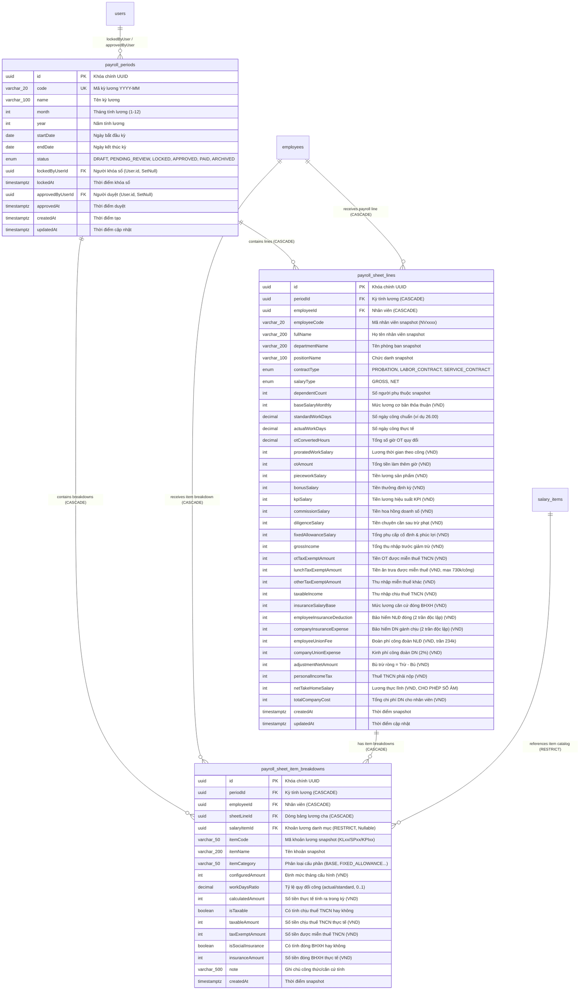

# Payroll Module — Mô hình Dữ liệu: Bảng Lương & Snapshot Cấu Phần (Payroll Data Model)

Tài liệu này định nghĩa chi tiết kiến trúc mô hình dữ liệu quan hệ cho phân hệ **Bảng lương & Bộ tính toán lương (`payroll`)**, bao gồm: Sơ đồ thực thể ERD, định nghĩa Prisma Schema mở rộng, các ràng buộc toàn vẹn PostgreSQL DDL Check Constraints, cơ chế Foreign Key Cascading/Restricting, chiến lược Composite Indexing và kế hoạch dung lượng (Capacity Planning).

---

## 1. Sơ đồ Quan hệ Thực thể Tổng thể (Entity-Relationship Diagram)

Mô hình dữ liệu thực hiện theo nguyên tắc **Snapshot Bất biến Đa tầng (Two-Tier Granular Snapshot Architecture)** đã được phê duyệt tại ADR-001:
1. **Tầng 1 (Dòng bảng lương tổng hợp `payroll_sheet_lines`)**: Lưu trữ toàn bộ 18 cột chuẩn mực cấp nhân viên khi kỳ lương đạt trạng thái `LOCKED`.
2. **Tầng 2 (Chi tiết cấu phần lương `payroll_sheet_item_breakdowns`)**: Lưu trữ snapshot chi tiết từng khoản thu nhập/khấu trừ con (phụ cấp ăn trưa, trách nhiệm, KPI, thưởng, hoa hồng, sản phẩm, lỗi chuyên cần, bù trừ). Đảm bảo tính minh bạch cho màn hình Lương hỗ trợ (`luong-ho-tro`), phiếu lương cá nhân (Payslip), và đối soát kiểm toán thuế/bảo hiểm.



---

## 2. Định nghĩa Mở rộng Prisma Schema (`schema.prisma`)

Dưới đây là đặc tả chi tiết mã nguồn Prisma DSL cần tích hợp vào file `Backend/prisma/schema.prisma`.

### 2.1. Cập nhật Model `PayrollSheetLine`

Mở rộng bảng `PayrollSheetLine` hiện có: bổ sung 4 cột tài chính chuyên biệt cho chính sách thuế và phụ cấp lương theo luật lao động Việt Nam (`BR-pay-001`, `BR-pay-003`, `BR-pay-004`) và thiết lập quan hệ 1-N tới bảng breakdown con:

```prisma
/// 14. Bảng Lương Tổng hợp Snapshot (PayrollSheetLine)
/// Chốt số liệu đóng băng (Immutable) khi kỳ lương chuyển sang LOCKED
model PayrollSheetLine {
  id                          String        @id @default(uuid()) @db.Uuid
  periodId                    String        @db.Uuid
  employeeId                  String        @db.Uuid

  /// Thông tin nhân sự snapshot tại thời điểm chốt sổ
  employeeCode                String        @db.VarChar(20)
  fullName                    String        @db.VarChar(200)
  departmentName              String?       @db.VarChar(200)
  positionName                String?       @db.VarChar(100)
  contractType                ContractType
  salaryType                  SalaryType
  dependentCount              Int           @default(0)

  /// Dữ liệu đầu vào công & OT
  baseSalaryMonthly           Int           @default(0)
  standardWorkDays            Decimal       @db.Decimal(4, 2)
  actualWorkDays              Decimal       @db.Decimal(4, 2)
  otConvertedHours            Decimal       @db.Decimal(6, 2)

  /// Các thành phần thu nhập phát sinh trong kỳ
  proratedWorkSalary          Int           @default(0)
  otAmount                    Int           @default(0)
  pieceworkSalary             Int           @default(0)
  bonusSalary                 Int           @default(0)
  kpiSalary                   Int           @default(0)
  commissionSalary            Int           @default(0)
  diligenceSalary             Int           @default(0)
  /// [BỔ SUNG MỚI - BR-pay-001]: Tổng phụ cấp cố định & phúc lợi tính theo công hoặc tháng
  fixedAllowanceSalary        Int           @default(0)
  grossIncome                 Int           @default(0)

  /// [BỔ SUNG MỚI - BR-pay-004]: Phần tiền làm thêm giờ cao hơn giờ chuẩn được miễn thuế TNCN
  otTaxExemptAmount           Int           @default(0)
  /// [BỔ SUNG MỚI - BR-pay-003]: Phần phụ cấp ăn trưa được miễn thuế (tối đa 730k theo ngày công)
  lunchTaxExemptAmount        Int           @default(0)
  /// [BỔ SUNG MỚI]: Các khoản miễn thuế TNCN hợp pháp khác (trang phục, công tác phí...)
  otherTaxExemptAmount        Int           @default(0)

  /// Giảm trừ & Nghĩa vụ thuế
  taxableIncome               Int           @default(0)
  insuranceSalaryBase         Int           @default(0)
  employeeInsuranceDeduction  Int           @default(0)
  companyInsuranceExpense     Int           @default(0)
  employeeUnionFee            Int           @default(0)
  companyUnionExpense         Int           @default(0)

  /// Bù trừ & Thực lĩnh
  /// adjustmentNetAmount: Số dương = Tổng trừ vượt trội, Số âm = Tổng bù nhận thêm
  adjustmentNetAmount         Int           @default(0)
  personalIncomeTax           Int           @default(0)
  /// netTakeHomeSalary: Thực lĩnh có thể nhận giá trị âm khi tạm ứng lớn hơn lương (BR-pay-008)
  netTakeHomeSalary           Int           @default(0)
  totalCompanyCost            Int           @default(0)

  createdAt                   DateTime      @default(now()) @db.Timestamptz(3)
  updatedAt                   DateTime      @updatedAt @db.Timestamptz(3)

  period                      PayrollPeriod @relation(fields: [periodId], references: [id], onDelete: Cascade)
  employee                    Employee      @relation(fields: [employeeId], references: [id], onDelete: Cascade)
  
  /// [BỔ SUNG MỚI]: Quan hệ 1-N tới bảng snapshot chi tiết cấu phần
  breakdowns                  PayrollSheetItemBreakdown[]

  @@unique([periodId, employeeId])
  @@index([periodId])
  @@index([employeeId])
  @@map("payroll_sheet_lines")
}
```

---

### 2.2. Bổ sung Model Mới `PayrollSheetItemBreakdown`

Tạo mới bảng lưu trữ snapshot cấu phần con phục vụ kiểm toán tài chính và đối soát tab Lương hỗ trợ:

```prisma
/// 15. Bảng Snapshot Chi tiết Cấu phần Lương (PayrollSheetItemBreakdown)
/// Lưu vết chi tiết từng khoản thu nhập/khấu trừ con khi kỳ lương LOCKED (BR-pay-010, ADR-001)
model PayrollSheetItemBreakdown {
  id                String            @id @default(uuid()) @db.Uuid
  periodId          String            @db.Uuid
  employeeId        String            @db.Uuid
  sheetLineId       String            @db.Uuid
  salaryItemId      String?           @db.Uuid

  /// Định danh cấu phần snapshot
  itemCode          String            @db.VarChar(50)
  itemName          String            @db.VarChar(200)
  /// Phân loại: BASE, FIXED_ALLOWANCE, BENEFIT, KPI, BONUS, COMMISSION, PIECEWORK, DILIGENCE, ADJUSTMENT
  itemCategory      String            @db.VarChar(50)

  /// Giá trị định mức và quy đổi thực tế
  configuredAmount  Int               @default(0)
  /// Tỷ lệ quy đổi ngày công thực tế (min(1, actualWorkDays / standardWorkDays))
  workDaysRatio     Decimal           @default(1.0000) @db.Decimal(5, 4)
  calculatedAmount  Int               @default(0)

  /// Chính sách Thuế TNCN
  isTaxable         Boolean           @default(true)
  taxableAmount     Int               @default(0)
  taxExemptAmount   Int               @default(0)

  /// Chính sách Bảo hiểm Xã hội
  isSocialInsurance Boolean           @default(false)
  insuranceAmount   Int               @default(0)

  note              String?           @db.VarChar(500)
  createdAt         DateTime          @default(now()) @db.Timestamptz(3)

  period            PayrollPeriod     @relation(fields: [periodId], references: [id], onDelete: Cascade)
  employee          Employee          @relation(fields: [employeeId], references: [id], onDelete: Cascade)
  sheetLine         PayrollSheetLine  @relation(fields: [sheetLineId], references: [id], onDelete: Cascade)
  salaryItem        SalaryItem?       @relation(fields: [salaryItemId], references: [id], onDelete: Restrict)

  @@index([sheetLineId])
  @@index([periodId, employeeId])
  @@index([periodId, itemCategory])
  @@index([sheetLineId, salaryItemId])
  @@map("payroll_sheet_item_breakdowns")
}
```

---

### 2.3. Cập nhật Quan hệ Đối ứng ở Các Model Khác

Để Prisma Client biên dịch thành công, cập nhật các quan hệ 2 chiều ở các Model cha:

1. Trong **`model PayrollPeriod`**:
```prisma
  payrollSheetLines         PayrollSheetLine[]
  payrollSheetBreakdowns    PayrollSheetItemBreakdown[]
```

2. Trong **`model Employee`**:
```prisma
  payrollSheetLines         PayrollSheetLine[]
  payrollSheetBreakdowns    PayrollSheetItemBreakdown[]
```

3. Trong **`model SalaryItem`**:
```prisma
  breakdownRecords          PayrollSheetItemBreakdown[]
```

---

## 3. Bản Đặc tả PostgreSQL DDL & Check Constraints

Để bảo đảm tính toàn vẹn dữ liệu ở cấp độ phần cứng cơ sở dữ liệu (Database-level Integrity), các Check Constraints và Foreign Keys được đặc tả như sau:

```sql
-- ============================================================
-- 1. BẢNG payroll_sheet_lines (CẬP NHẬT CỘT & RÀNG BUỘC)
-- ============================================================
ALTER TABLE payroll_sheet_lines
  ADD COLUMN IF NOT EXISTS fixed_allowance_salary INTEGER NOT NULL DEFAULT 0,
  ADD COLUMN IF NOT EXISTS ot_tax_exempt_amount INTEGER NOT NULL DEFAULT 0,
  ADD COLUMN IF NOT EXISTS lunch_tax_exempt_amount INTEGER NOT NULL DEFAULT 0,
  ADD COLUMN IF NOT EXISTS other_tax_exempt_amount INTEGER NOT NULL DEFAULT 0;

-- Thêm các Check Constraints bảo vệ tính toàn vẹn tài chính
ALTER TABLE payroll_sheet_lines
  ADD CONSTRAINT chk_psl_standard_work_days CHECK (standard_work_days > 0),
  ADD CONSTRAINT chk_psl_actual_work_days CHECK (actual_work_days >= 0),
  ADD CONSTRAINT chk_psl_ot_converted_hours CHECK (ot_converted_hours >= 0),
  ADD CONSTRAINT chk_psl_base_salary_monthly CHECK (base_salary_monthly >= 0),
  ADD CONSTRAINT chk_psl_prorated_work_salary CHECK (prorated_work_salary >= 0),
  ADD CONSTRAINT chk_psl_ot_amount CHECK (ot_amount >= 0),
  ADD CONSTRAINT chk_psl_piecework_salary CHECK (piecework_salary >= 0),
  ADD CONSTRAINT chk_psl_bonus_salary CHECK (bonus_salary >= 0),
  ADD CONSTRAINT chk_psl_kpi_salary CHECK (kpi_salary >= 0),
  ADD CONSTRAINT chk_psl_commission_salary CHECK (commission_salary >= 0),
  ADD CONSTRAINT chk_psl_diligence_salary CHECK (diligence_salary >= 0),
  ADD CONSTRAINT chk_psl_fixed_allowance_salary CHECK (fixed_allowance_salary >= 0),
  ADD CONSTRAINT chk_psl_gross_income CHECK (gross_income >= 0),
  ADD CONSTRAINT chk_psl_ot_tax_exempt CHECK (ot_tax_exempt_amount >= 0),
  ADD CONSTRAINT chk_psl_lunch_tax_exempt CHECK (lunch_tax_exempt_amount >= 0),
  ADD CONSTRAINT chk_psl_other_tax_exempt CHECK (other_tax_exempt_amount >= 0),
  ADD CONSTRAINT chk_psl_taxable_income CHECK (taxable_income >= 0),
  ADD CONSTRAINT chk_psl_insurance_salary_base CHECK (insurance_salary_base >= 0),
  ADD CONSTRAINT chk_psl_emp_insurance_deduction CHECK (employee_insurance_deduction >= 0),
  ADD CONSTRAINT chk_psl_comp_insurance_expense CHECK (company_insurance_expense >= 0),
  ADD CONSTRAINT chk_psl_emp_union_fee CHECK (employee_union_fee >= 0),
  ADD CONSTRAINT chk_psl_comp_union_expense CHECK (company_union_expense >= 0),
  ADD CONSTRAINT chk_psl_personal_income_tax CHECK (personal_income_tax >= 0),
  ADD CONSTRAINT chk_psl_total_company_cost CHECK (total_company_cost >= 0);

-- [QUAN TRỌNG]: net_take_home_salary và adjustment_net_amount TUYỆT ĐỐI KHÔNG CHECK >= 0!
-- Vì theo BR-pay-008 và EC-pay-002, khi khoản tạm ứng vượt quá thu nhập sau thuế,
-- lương thực lĩnh của người lao động được phép nhận giá trị âm để chuyển nợ sang kỳ sau.

-- ============================================================
-- 2. TẠO MỚI BẢNG payroll_sheet_item_breakdowns
-- ============================================================
CREATE TABLE IF NOT EXISTS payroll_sheet_item_breakdowns (
  id UUID PRIMARY KEY DEFAULT gen_random_uuid(),
  period_id UUID NOT NULL,
  employee_id UUID NOT NULL,
  sheet_line_id UUID NOT NULL,
  salary_item_id UUID NULL,
  item_code VARCHAR(50) NOT NULL,
  item_name VARCHAR(200) NOT NULL,
  item_category VARCHAR(50) NOT NULL,
  configured_amount INTEGER NOT NULL DEFAULT 0,
  work_days_ratio NUMERIC(5, 4) NOT NULL DEFAULT 1.0000,
  calculated_amount INTEGER NOT NULL DEFAULT 0,
  is_taxable BOOLEAN NOT NULL DEFAULT TRUE,
  taxable_amount INTEGER NOT NULL DEFAULT 0,
  tax_exempt_amount INTEGER NOT NULL DEFAULT 0,
  is_social_insurance BOOLEAN NOT NULL DEFAULT FALSE,
  insurance_amount INTEGER NOT NULL DEFAULT 0,
  note VARCHAR(500) NULL,
  created_at TIMESTAMPTZ(3) NOT NULL DEFAULT CURRENT_TIMESTAMP,

  -- Ràng buộc khóa ngoại (Foreign Keys)
  CONSTRAINT fk_psib_period FOREIGN KEY (period_id) 
    REFERENCES payroll_periods(id) ON DELETE CASCADE,
  CONSTRAINT fk_psib_employee FOREIGN KEY (employee_id) 
    REFERENCES employees(id) ON DELETE CASCADE,
  CONSTRAINT fk_psib_sheet_line FOREIGN KEY (sheet_line_id) 
    REFERENCES payroll_sheet_lines(id) ON DELETE CASCADE,
  CONSTRAINT fk_psib_salary_item FOREIGN KEY (salary_item_id) 
    REFERENCES salary_items(id) ON DELETE RESTRICT,

  -- Ràng buộc kiểm tra tính hợp lệ số học (Check Constraints)
  CONSTRAINT chk_psib_work_days_ratio CHECK (work_days_ratio >= 0.0000 AND work_days_ratio <= 1.0000),
  CONSTRAINT chk_psib_taxable_amount CHECK (taxable_amount >= 0),
  CONSTRAINT chk_psib_tax_exempt_amount CHECK (tax_exempt_amount >= 0),
  CONSTRAINT chk_psib_insurance_amount CHECK (insurance_amount >= 0)
);

-- ============================================================
-- 3. CHỈ MỤC TỐI ƯU HIỆU NĂNG (COMPOSITE INDEXES)
-- ============================================================
CREATE INDEX IF NOT EXISTS idx_psib_sheet_line_id ON payroll_sheet_item_breakdowns(sheet_line_id);
CREATE INDEX IF NOT EXISTS idx_psib_period_employee ON payroll_sheet_item_breakdowns(period_id, employee_id);
CREATE INDEX IF NOT EXISTS idx_psib_period_category ON payroll_sheet_item_breakdowns(period_id, item_category);
CREATE INDEX IF NOT EXISTS idx_psib_sheet_line_item ON payroll_sheet_item_breakdowns(sheet_line_id, salary_item_id);
```

---

## 4. Nguyên Tắc Thác Đổ Khóa Ngoại (Cascading & Referential Rules)

| Mối quan hệ khóa ngoại (Foreign Key) | Khóa cha (Parent) | Khóa con (Child) | Hành vi ON DELETE | Lý do kiến trúc & Ràng buộc nghiệp vụ |
|---|---|---|:---:|---|
| `fk_psl_period` | `payroll_periods(id)` | `payroll_sheet_lines(period_id)` | **`CASCADE`** | Khi xóa kỳ lương ở trạng thái `DRAFT` hoặc khi Reopen kỳ lương, toàn bộ dòng lương snapshot tự động dọn sạch. |
| `fk_psib_sheet_line` | `payroll_sheet_lines(id)` | `payroll_sheet_item_breakdowns(sheet_line_id)` | **`CASCADE`** | Bảng breakdown phụ thuộc sinh mệnh trực tiếp vào dòng bảng lương cha. Xóa dòng cha thì dọn sạch toàn bộ con. |
| `fk_psib_period` | `payroll_periods(id)` | `payroll_sheet_item_breakdowns(period_id)` | **`CASCADE`** | Tự động dọn sạch snapshot con khi kỳ lương bị xóa. |
| `fk_psib_employee` | `employees(id)` | `payroll_sheet_item_breakdowns(employee_id)` | **`CASCADE`** | Khi một nhân viên bị xóa cứng khỏi hệ thống (FR-hr-010), dọn sạch dữ liệu bảng lương liên quan. |
| `fk_psib_salary_item` | `salary_items(id)` | `payroll_sheet_item_breakdowns(salary_item_id)` | **`RESTRICT`** | **BẤT BIẾN KẾ TOÁN**: Tuyệt đối không cho phép xóa bất kỳ khoản lương nào trong danh mục cha nếu đã từng được dùng để tạo snapshot bảng lương. Người dùng chỉ được phép chuyển trạng thái danh mục sang `INACTIVE`. |

---

## 5. Chiến Lược Tối Ưu Truy Vấn & Chỉ Mục (Performance Indexing Strategy)

Phân hệ Payroll phục vụ 5 mẫu truy vấn (Query Access Patterns) chính, mỗi mẫu truy vấn được định tuyến qua các chỉ mục chuyên biệt:

| Access Pattern | Tần suất | Câu lệnh SQL đặc trưng | Chỉ mục hỗ trợ tối ưu | Thời gian đáp ứng kỳ vọng |
|---|---|---|---|:---:|
| **P1: Render Bảng lương 18 cột** | Rất cao | `SELECT * FROM payroll_sheet_lines WHERE period_id = :id ORDER BY employee_code ASC` | `idx_psl_period_id` `[period_id]` + `UNIQUE[period_id, employee_id]` | `< 15ms` cho 2.000 dòng |
| **P2: Xem chi tiết 1 nhân viên** | Cao | `SELECT * FROM payroll_sheet_item_breakdowns WHERE sheet_line_id = :line_id` | `idx_psib_sheet_line_id` `[sheet_line_id]` | `< 2ms` |
| **P3: Tab Lương hỗ trợ (`luong-ho-tro`)** | Trung bình | `SELECT * FROM payroll_sheet_item_breakdowns WHERE period_id = :id AND item_category IN ('FIXED_ALLOWANCE', 'BENEFIT')` | `idx_psib_period_category` `[period_id, item_category]` | `< 10ms` |
| **P4: Tra cứu Phiếu lương cá nhân** | Cao | `SELECT * FROM payroll_sheet_lines WHERE period_id = :id AND employee_id = :emp_id` | `UNIQUE(period_id, employee_id)` (Unique B-Tree index lookup) | `< 1ms` |
| **P5: Báo cáo đối soát danh mục** | Thấp | `SELECT * FROM payroll_sheet_item_breakdowns WHERE sheet_line_id = :id AND salary_item_id = :item_id` | `idx_psib_sheet_line_item` `[sheet_line_id, salary_item_id]` | `< 2ms` |

---

## 6. Kế Hoạch Dự Trù Dung Lượng (Capacity Planning)

Dựa trên cấu trúc vật lý của PostgreSQL (Header 23 bytes/row, kiểu dữ liệu int/decimal/uuid/varchar):

### 6.1. Kích thước trung bình mỗi bản ghi
- **1 dòng `payroll_sheet_lines`**: ~380 bytes (sau khi đệm alignment và header).
- **1 dòng `payroll_sheet_item_breakdowns`**: ~190 bytes.
- **Hệ số mở rộng**: Trung bình 1 nhân viên trong 1 tháng phát sinh **8 đến 12 khoản cấu phần con** (Lương thời gian, 2 phụ cấp cố định, tiền ăn trưa, điện thoại, OT, thưởng, KPI, BHXH, Thuế TNCN, Tạm ứng). Lấy trung bình: **10 dòng breakdown / nhân viên / tháng**.

### 6.2. Dự báo tăng trưởng dung lượng lưu trữ

| Quy mô Doanh nghiệp | Số dòng `lines` / năm | Số dòng `breakdowns` / năm | Dung lượng Data / năm | Dung lượng Index / năm | Tổng dung lượng phát sinh / năm |
|---|:---:|:---:|:---:|:---:|:---:|
| **Doanh nghiệp 500 nhân sự** | 6.000 dòng | 60.000 dòng | ~14 MB | ~11 MB | **~25 MB / năm** |
| **Doanh nghiệp 2.000 nhân sự** | 24.000 dòng | 240.000 dòng | ~56 MB | ~44 MB | **~100 MB / năm** |
| **Tập đoàn 10.000 nhân sự** | 120.000 dòng | 1.200.000 dòng | ~280 MB | ~220 MB | **~500 MB / năm** |

> [!NOTE]
> **Nhận xét kiến trúc**: Dù ở quy mô tập đoàn 10.000 nhân viên lưu trữ liên tục trong 10 năm, tổng dung lượng của bảng snapshot cũng chỉ đạt khoảng **5 GB**, hoàn toàn nằm gọn trong RAM của máy chủ cơ sở dữ liệu tầm trung, bảo đảm tốc độ truy vấn tức thời mà không cần phân vùng bảng (Table Partitioning) trong giai đoạn hiện tại.
