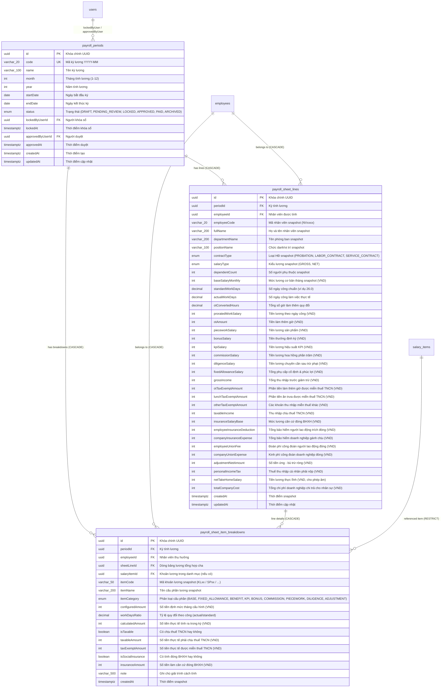

# Sơ Đồ Thực Thể Dữ Liệu: Phân Hệ Bảng Lương & Snapshot Cấu Phần (Payroll ERD)

> **Mã tài liệu**: `ERD-PAY-001`  
> **Phân hệ**: Bảng lương & Bộ tính toán lương (`payroll`)  
> **Trạng thái**: `approved`  
> **Tác giả**: Business Analyst  
> **Ngày phê duyệt**: 2026-09-06  
> **Tài liệu tham chiếu**: `docs/payroll/srs/payroll-spec.md`, `Backend/prisma/schema.prisma`  

---

## 1. Sơ đồ Thực thể Quan hệ (Mermaid ERD)

Sơ đồ thể hiện cấu trúc lưu trữ dữ liệu của Phân hệ Bảng lương, đặc biệt làm nổi bật quan hệ 1-N giữa Dòng bảng lương tổng hợp (`payroll_sheet_lines`) và Bảng snapshot chi tiết từng cấu phần lương (`payroll_sheet_item_breakdowns`):

---

## 2. Từ Điển Dữ Liệu Chi Tiết (Data Dictionary)

### 2.1. Bảng `payroll_sheet_lines` (Dòng Bảng Lương Tổng Hợp Snapshot)
Bảng lưu trữ kết quả tính toán cấp nhân viên của từng kỳ lương khi ở trạng thái `LOCKED`. Mỗi nhân viên chỉ có duy nhất 1 dòng trong 1 kỳ lương (`UNIQUE(periodId, employeeId)`).

| Tên Cột (Column) | Kiểu Dữ Liệu (PostgreSQL) | Ràng Buộc (Constraints) | Mô Tả Nghiệp Vụ & Quy Tắc |
|---|---|---|---|
| `id` | `UUID` | `PK, default(uuid())` | Định danh duy nhất của dòng bảng lương. |
| `period_id` | `UUID` | `FK -> payroll_periods(id), ON DELETE CASCADE` | Kỳ lương tương ứng. |
| `employee_id` | `UUID` | `FK -> employees(id), ON DELETE CASCADE` | Nhân viên được tính lương. |
| `employee_code` | `VARCHAR(20)` | `NOT NULL` | Mã nhân viên tại thời điểm chốt sổ (`NVxxxx`). |
| `full_name` | `VARCHAR(200)` | `NOT NULL` | Họ tên nhân viên snapshot. |
| `department_name` | `VARCHAR(200)` | `NULL` | Tên phòng ban nhân viên công tác lúc chốt sổ. |
| `position_name` | `VARCHAR(100)` | `NULL` | Vị trí/chức danh công việc snapshot. |
| `contract_type` | `VARCHAR(50)` | `NOT NULL, enum(ContractType)` | Loại hợp đồng (`PROBATION`, `LABOR_CONTRACT`, `SERVICE_CONTRACT`). |
| `salary_type` | `VARCHAR(20)` | `NOT NULL, enum(SalaryType)` | Kiểu thỏa thuận lương (`GROSS`, `NET`). |
| `dependent_count` | `INTEGER` | `NOT NULL, DEFAULT 0, CHECK >= 0` | Số lượng người phụ thuộc đăng ký giảm trừ gia cảnh. |
| `base_salary_monthly`| `INTEGER` | `NOT NULL, DEFAULT 0, CHECK >= 0` | Mức lương cơ bản thỏa thuận trên hợp đồng (VND). |
| `standard_work_days` | `NUMERIC(4, 2)` | `NOT NULL, CHECK > 0` | Số ngày công chuẩn của tháng (ví dụ: 26.00). |
| `actual_work_days` | `NUMERIC(4, 2)` | `NOT NULL, CHECK >= 0` | Số ngày công làm việc thực tế theo chấm công. |
| `ot_converted_hours` | `NUMERIC(6, 2)` | `NOT NULL, DEFAULT 0.00, CHECK >= 0`| Tổng số giờ làm thêm đã nhân hệ số (150% - 390%). |
| `prorated_work_salary`| `INTEGER` | `NOT NULL, DEFAULT 0, CHECK >= 0` | Tiền lương thời gian quy theo ngày công thực tế. |
| `ot_amount` | `INTEGER` | `NOT NULL, DEFAULT 0, CHECK >= 0` | Tổng tiền làm thêm giờ thực nhận trong kỳ. |
| `piecework_salary` | `INTEGER` | `NOT NULL, DEFAULT 0, CHECK >= 0` | Tiền lương sản phẩm nghiệm thu trong kỳ. |
| `bonus_salary` | `INTEGER` | `NOT NULL, DEFAULT 0, CHECK >= 0` | Tiền thưởng định kỳ trong kỳ. |
| `kpi_salary` | `INTEGER` | `NOT NULL, DEFAULT 0, CHECK >= 0` | Tiền lương hiệu suất theo chỉ tiêu KPI. |
| `commission_salary` | `INTEGER` | `NOT NULL, DEFAULT 0, CHECK >= 0` | Tiền lương hoa hồng phần trăm doanh số. |
| `diligence_salary` | `INTEGER` | `NOT NULL, DEFAULT 0, CHECK >= 0` | Tiền phụ cấp chuyên cần sau khi trừ phạt lỗi (chặn sàn $\ge 0$). |
| `fixed_allowance_salary`| `INTEGER` | `NOT NULL, DEFAULT 0, CHECK >= 0` | Tổng các khoản phụ cấp lương cố định & phúc lợi (`BR-pay-001`). |
| `gross_income` | `INTEGER` | `NOT NULL, DEFAULT 0, CHECK >= 0` | Tổng thu nhập trước thuế = tổng các cấu phần thu nhập. |
| `ot_tax_exempt_amount`| `INTEGER` | `NOT NULL, DEFAULT 0, CHECK >= 0` | Phần tiền OT trả thêm cao hơn giờ chuẩn được miễn thuế (`BR-pay-004`). |
| `lunch_tax_exempt_amount`| `INTEGER` | `NOT NULL, DEFAULT 0, CHECK >= 0` | Phần tiền ăn trưa được miễn thuế (tối đa 730k theo công, `BR-pay-003`). |
| `other_tax_exempt_amount`| `INTEGER` | `NOT NULL, DEFAULT 0, CHECK >= 0` | Các khoản miễn thuế khác (trang phục, công tác phí...). |
| `taxable_income` | `INTEGER` | `NOT NULL, DEFAULT 0, CHECK >= 0` | Thu nhập chịu thuế TNCN sau khi trừ các khoản miễn thuế. |
| `insurance_salary_base` | `INTEGER` | `NOT NULL, DEFAULT 0, CHECK >= 0` | Mức lương làm căn cứ trích đóng bảo hiểm. |
| `employee_insurance_deduction` | `INTEGER` | `NOT NULL, DEFAULT 0, CHECK >= 0` | Tiền bảo hiểm NLĐ đóng (tách 2 trần 46.8tr và 99.2tr, `BR-pay-006`). |
| `company_insurance_expense` | `INTEGER` | `NOT NULL, DEFAULT 0, CHECK >= 0` | Tiền bảo hiểm DN gánh chịu (tách 2 trần 46.8tr và 99.2tr). |
| `employee_union_fee` | `INTEGER` | `NOT NULL, DEFAULT 0, CHECK >= 0` | Đoàn phí công đoàn NLĐ đóng (trần tối đa 234.000đ, `BR-pay-007`). |
| `company_union_expense` | `INTEGER` | `NOT NULL, DEFAULT 0, CHECK >= 0` | Kinh phí công đoàn DN đóng (2% quỹ lương BHXH). |
| `adjustment_net_amount` | `INTEGER` | `NOT NULL, DEFAULT 0` | Số tiền bù trừ ròng = Tổng trừ - Tổng bù (số dương: bị trừ, số âm: nhận bù). |
| `personal_income_tax` | `INTEGER` | `NOT NULL, DEFAULT 0, CHECK >= 0` | Thuế TNCN (10% tại nguồn hoặc lũy tiến 7 bậc, `BR-pay-005`). |
| `net_take_home_salary` | `INTEGER` | `NOT NULL` **(CHO PHÉP SỐ ÂM)** | Tiền thực lĩnh chuyển khoản cho nhân viên (`BR-pay-008`). |
| `total_company_cost` | `INTEGER` | `NOT NULL, DEFAULT 0, CHECK >= 0` | Tổng chi phí doanh nghiệp = Gross + Bảo hiểm DN + KPCĐ DN. |
| `created_at` | `TIMESTAMPTZ(3)` | `NOT NULL, DEFAULT now()` | Thời điểm tạo bản ghi snapshot. |
| `updated_at` | `TIMESTAMPTZ(3)` | `NOT NULL` | Thời điểm cập nhật cuối cùng. |

---

### 2.2. Bảng Mới: `payroll_sheet_item_breakdowns` (Snapshot Chi Tiết Cấu Phần Lương)
Bảng snapshot chi tiết từng khoản thu nhập/khấu trừ con, phục vụ màn hình **Lương hỗ trợ (`luong-ho-tro`)**, phiếu lương cá nhân (Payslip), và giải trình thanh tra thuế/bảo hiểm.

| Tên Cột (Column) | Kiểu Dữ Liệu (PostgreSQL) | Ràng Buộc (Constraints) | Mô Tả Nghiệp Vụ & Quy Tắc |
|---|---|---|---|
| `id` | `UUID` | `PK, default(uuid())` | Định danh duy nhất của dòng breakdown. |
| `period_id` | `UUID` | `FK -> payroll_periods(id), ON DELETE CASCADE` | Kỳ lương tương ứng. |
| `employee_id` | `UUID` | `FK -> employees(id), ON DELETE CASCADE` | Nhân viên thụ hưởng. |
| `sheet_line_id` | `UUID` | `FK -> payroll_sheet_lines(id), ON DELETE CASCADE` | Khóa ngoại liên kết dòng bảng lương tổng hợp cha. |
| `salary_item_id`| `UUID` | `FK -> salary_items(id), ON DELETE RESTRICT, NULL` | Khoản lương tham chiếu từ danh mục (nếu có). |
| `item_code` | `VARCHAR(50)` | `NOT NULL` | Mã khoản lương snapshot (`KL01`, `KL02`, `SP01`, `KPI01`...). |
| `item_name` | `VARCHAR(200)` | `NOT NULL` | Tên khoản cấu phần snapshot (ví dụ: "Phụ cấp ăn trưa", "Thưởng năng suất"). |
| `item_category` | `VARCHAR(50)` | `NOT NULL` | Phân loại cấu phần (`BASE`, `FIXED_ALLOWANCE`, `BENEFIT`, `KPI`, `BONUS`, `PIECEWORK`, `COMMISSION`, `DILIGENCE`, `ADJUSTMENT`). |
| `configured_amount` | `INTEGER` | `NOT NULL, DEFAULT 0` | Số tiền định mức tháng đã thiết lập (VND). |
| `work_days_ratio` | `NUMERIC(5, 4)` | `NOT NULL, DEFAULT 1.0000` | Tỷ lệ quy đổi theo ngày công thực tế ($\min(1, \frac{\text{actual}}{\text{standard}})$). |
| `calculated_amount` | `INTEGER` | `NOT NULL, DEFAULT 0` | Số tiền thực tế tính ra trong kỳ lương sau khi quy đổi theo công (VND). |
| `is_taxable` | `BOOLEAN` | `NOT NULL, DEFAULT true` | Cờ xác định khoản này có tính chịu thuế TNCN hay không. |
| `taxable_amount` | `INTEGER` | `NOT NULL, DEFAULT 0, CHECK >= 0` | Số tiền thực tế phải chịu thuế TNCN (VND). |
| `tax_exempt_amount` | `INTEGER` | `NOT NULL, DEFAULT 0, CHECK >= 0` | Số tiền thực tế được miễn thuế TNCN (VND, ví dụ tiền ăn trưa $\le 730k$). |
| `is_social_insurance` | `BOOLEAN` | `NOT NULL, DEFAULT false` | Cờ xác định khoản này có làm căn cứ đóng BHXH hay không. |
| `insurance_amount` | `INTEGER` | `NOT NULL, DEFAULT 0, CHECK >= 0` | Số tiền thực tế đóng góp vào quỹ đóng BHXH (VND). |
| `note` | `VARCHAR(500)` | `NULL` | Ghi chú giải trình công thức hoặc căn cứ tính. |
| `created_at` | `TIMESTAMPTZ(3)` | `NOT NULL, DEFAULT now()` | Thời điểm tạo bản ghi snapshot. |

---

## 3. Chiến Lược Chỉ Mục & Tối Ưu Hiệu Năng (Indexing & Performance Strategy)

Để hỗ trợ truy vấn bảng lương tốc độ cao cho doanh nghiệp quy mô hàng nghìn nhân sự:

1. **Composite Indexes**:
   - `payroll_sheet_lines`:
     + `@@unique([periodId, employeeId])` — Chống trùng lặp dòng lương nhân viên trong kỳ.
     + `@@index([periodId])` — Tối ưu truy vấn toàn bộ bảng lương của một kỳ (render màn hình 18 cột và xuất Excel).
     + `@@index([employeeId])` — Tối ưu truy vấn lịch sử bảng lương của một nhân viên qua các tháng (Payslip).
   - `payroll_sheet_item_breakdowns`:
     + `@@index([sheetLineId])` — Tối ưu load toàn bộ chi tiết cấu phần khi xem chi tiết 1 nhân viên.
     + `@@index([periodId, itemCategory])` — Tối ưu lọc và tổng hợp cho tab **Lương hỗ trợ (`luong-ho-tro`)** theo từng khoản.
     + `@@index([periodId, employeeId])` — Tối ưu truy vấn cấu phần cá nhân theo kỳ.

2. **Foreign Key Cascading Rules**:
   - Khi một `PayrollPeriod` ở trạng thái nháp bị xóa hoặc được mở lại (`REOPEN`), toàn bộ các dòng con trong `payroll_sheet_lines` và `payroll_sheet_item_breakdowns` tự động bị xóa sạch (`ON DELETE CASCADE`) để bảo đảm không có dữ liệu mồ côi.
   - Khi xóa một `SalaryItem` trong danh mục cha, nếu đã có bản ghi snapshot trong `payroll_sheet_item_breakdowns` tham chiếu tới, hệ thống chặn xóa triệt để (`ON DELETE RESTRICT`) để bảo tồn toàn vẹn dữ liệu lịch sử kế toán.
