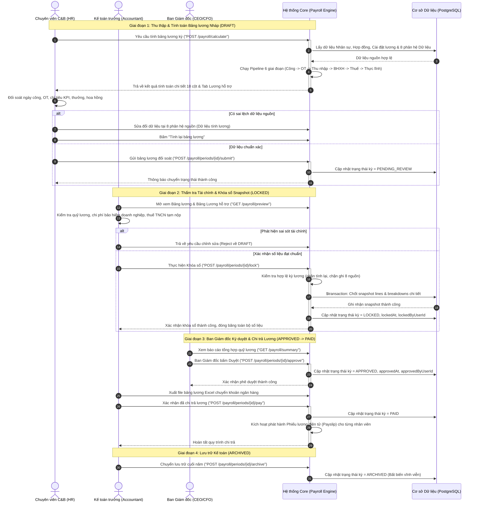
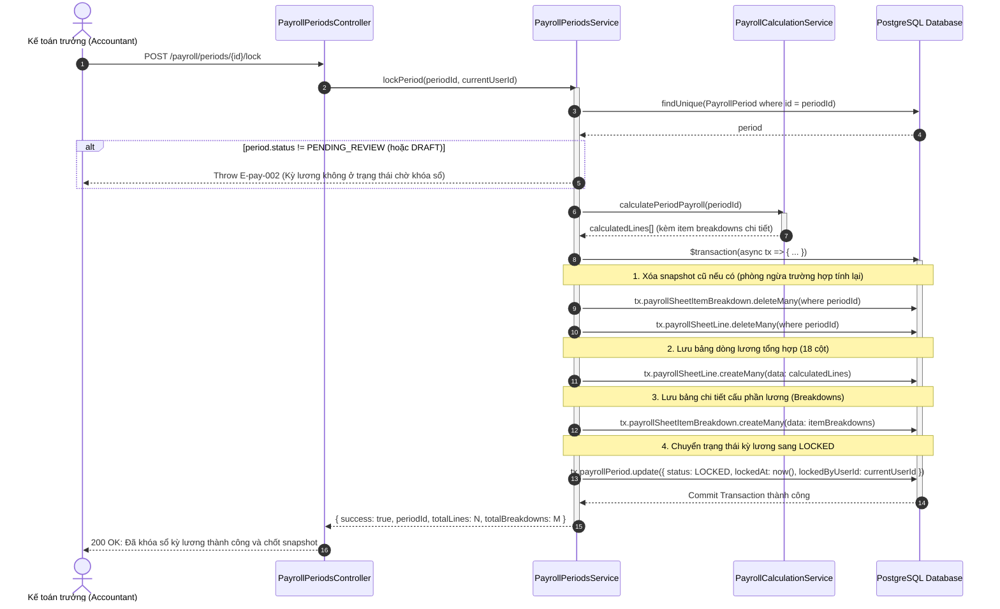
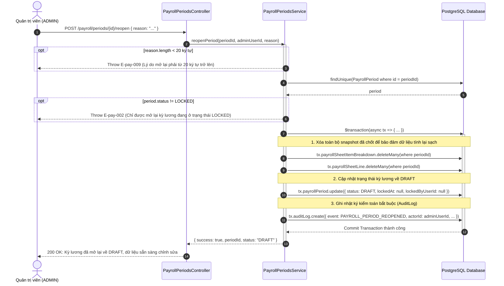

# Sơ đồ Luồng Nghiệp vụ & Tuần tự: Phân hệ Bảng Lương & Bộ Tính Toán Lương (Payroll Flows)

> **Mã tài liệu**: `FLOW-PAY-001`  
> **Phân hệ**: Bảng lương & Bộ tính toán lương (`payroll`)  
> **Trạng thái**: `approved`  
> **Tác giả**: Business Analyst  
> **Ngày phê duyệt**: 2026-09-06  
> **Tài liệu tham chiếu**: `docs/payroll/srs/payroll-spec.md`  

---

## 1. Sơ đồ Phân làn Nghiệp vụ Toàn trình (Swimlane / Activity Diagram)

Sơ đồ thể hiện sự phối hợp chặt chẽ giữa 4 chủ thể: **Chuyên viên C&B (HR)**, **Kế toán tiền lương & Kế toán trưởng (Accountant)**, **Ban Giám đốc (Management)**, và **Hệ thống Core (Payroll Engine)** từ khi bắt đầu tính lương đến khi lưu trữ chứng từ.



---

## 2. Sơ đồ Tuần tự Chi tiết: Động cơ Tính toán Lương (Calculation Pipeline)

Sơ đồ mô tả chi tiết quy trình xử lý dữ liệu của **`PayrollCalculationService`** chạy qua 6 bước khép kín theo đúng các quy tắc pháp lý chuẩn Việt Nam:

```mermaid
sequenceDiagram
    autonumber
    participant Client as Web Frontend / API Consumer
    participant Ctrl as PayrollCalculationController
    participant Svc as PayrollCalculationService
    participant Scope as PayrollScopeHelper
    participant DB as PostgreSQL Database

    Client->>Ctrl: GET /payroll/calculate?periodId={id}
    Ctrl->>Svc: calculatePeriodPayroll(periodId)
    activate Svc

    %% Bước 1: Kiểm tra trạng thái kỳ
    Svc->>DB: findUnique(PayrollPeriod where id = periodId)
    DB-->>Svc: period info (startDate, endDate, status)
    opt Trạng thái không phải DRAFT hoặc PENDING_REVIEW
        Svc-->>Client: Throw E-pay-002 (Kỳ lương đã khóa sổ)
    end

    %% Bước 2: Lọc nhân viên còn hợp đồng hiệu lực (RETRO-01 / BR-dltl-002)
    Svc->>Scope: filterActiveEmployeeIdsInPeriod(period.startDate, period.endDate)
    Scope->>DB: Query Contract.findMany (chỉ lấy NV còn HĐ bao phủ kỳ)
    DB-->>Scope: activeEmployeeIds[]
    Scope-->>Svc: activeEmployeeIds[]

    %% Bước 3: Lấy dữ liệu Cài đặt chung, Cài đặt lương & 8 nguồn biến động
    par Lấy cấu hình và nhân sự
        Svc->>DB: getGeneralSetting('DEFAULT') (lương cơ sở, vùng, thuế, OT, BH)
        Svc->>DB: Employee.findMany(where id in activeIds, include: Contract, Dependents, SalaryItems)
    and Lấy dữ liệu 8 phân hệ kỳ lương
        Svc->>DB: AttendanceRecord.findMany(periodId)
        Svc->>DB: OvertimeRecord.findMany(periodId)
        Svc->>DB: KpiRecord.findMany(periodId)
        Svc->>DB: BonusRecord.findMany(periodId)
        Svc->>DB: PieceworkRecord.findMany(periodId)
        Svc->>DB: CommissionRecord.findMany(periodId)
        Svc->>DB: DiligenceRecord.findMany(periodId)
        Svc->>DB: SalaryAdjustmentRecord.findMany(periodId)
    end
    DB-->>Svc: Trả về đầy đủ dữ liệu song song

    %% Bước 4: Vòng lặp tính toán từng nhân viên (6 Stages)
    loop Với từng Nhân viên đủ điều kiện
        Note over Svc: Stage 1: Lương Thời gian & Phụ cấp cố định (BR-pay-001)
        Svc->>Svc: Tính tỷ lệ công = actualWorkDays / standardWorkDays
        Svc->>Svc: Prorate lương cơ bản & các phụ cấp tính theo công
        Svc->>Svc: Giữ nguyên 100% các phụ cấp cố định trọn tháng

        Note over Svc: Stage 2: Tiền Làm thêm giờ & Bóc tách Miễn thuế (BR-pay-004)
        Svc->>Svc: donGiaGioChuan = baseSalary / (standardDays * standardHours)
        Svc->>Svc: otAmount = tổng tiền làm thêm theo các hệ số 150%-390%
        Svc->>Svc: otTaxExempt = otAmount - (donGiaGioChuan * otActualHours)

        Note over Svc: Stage 3: Thu nhập Biến động & Chặn sàn Chuyên cần (BR-pay-009)
        Svc->>Svc: Tính KPI, Lương sản phẩm, Lương % hoa hồng, Thưởng
        Svc->>Svc: Tính tiền chuyên cần = max(0, mucChuyenCan - min(tongPhat, mucChuyenCan))
        Svc->>Svc: Tổng hợp GrossIncome = Lương công + Phụ cấp + OT + SP + Thưởng + KPI + % + Chuyên cần

        Note over Svc: Stage 4: Tính Bảo hiểm theo 2 Trần Độc lập (BR-pay-006)
        Svc->>Svc: luongBH_BHYT = min(insuranceBase, 46.800.000) (NĐ 73/2024)
        Svc->>Svc: luongBHTN = min(insuranceBase, 99.200.000) (NĐ 74/2024)
        Svc->>Svc: BH_NV = luongBH_BHYT * 9.5% + luongBHTN * 1.0%
        Svc->>Svc: BH_CT = luongBH_BHYT * 20.5% + luongBHTN * 1.0%
        Svc->>Svc: Đoàn phí NV = min(luongBH_BHYT * 1%, 234.000); KPCĐ CT = luongBH_BHYT * 2%

        Note over Svc: Stage 5: Thuế TNCN & Phân loại Hợp đồng (BR-pay-003, BR-pay-005)
        Svc->>Svc: Miễn thuế ăn trưa = min(tienAnTrua, round(730.000 * tyLeCong))
        Svc->>Svc: ThuNhapChiuThue = Gross - otTaxExempt - Miễn thuế ăn trưa - Miễn thuế khác
        alt Hợp đồng Thử việc (PROBATION) / Dịch vụ (SERVICE_CONTRACT)
            Svc->>Svc: Thuế TNCN = round(ThuNhapChiuThue * 10%) (KHÔNG giảm trừ gia cảnh)
        else Hợp đồng Lao động chính thức (LABOR_CONTRACT >= 3 tháng)
            Svc->>Svc: GiamTru = 11.000.000 + soNPT * 4.400.000 + BH_NV + DoanPhi_NV
            Svc->>Svc: ThuNhapTinhThue = max(0, ThuNhapChiuThue - GiamTru)
            Svc->>Svc: Thuế TNCN = thueLuyTien7Bac(ThuNhapTinhThue)
        end

        Note over Svc: Stage 6: Bù trừ & Thực lĩnh (EC-pay-002)
        Svc->>Svc: adjustmentNet = tongTru - tongBu
        Svc->>Svc: thucLinh = Gross - BH_NV - DoanPhi_NV - Thuế TNCN - adjustmentNet (cho phép âm)
        Svc->>Svc: Build CalculatedPayrollLine & BreakdownItems[]
    end

    Svc-->>Ctrl: Danh sách CalculatedPayrollLine[] (18 cột + breakdowns)
    deactivate Svc
    Ctrl-->>Client: 200 OK (Bảng lương thời gian thực)
```

---

## 3. Sơ đồ Tuần tự: Khóa sổ Kỳ lương & Lưu trữ Snapshot Bất biến Đa tầng

Sơ đồ mô tả cơ chế ghi bất biến nguyên tử (`Prisma.$transaction`) bảo đảm tính toàn vẹn tuyệt đối khi kỳ lương chuyển sang `LOCKED`:



---

## 4. Sơ đồ Tuần tự: Mở lại Kỳ lương (Reopen) & Xóa Snapshot có Kiểm toán

Sơ đồ thể hiện quy trình quản lý rủi ro khi cần điều chỉnh kỳ lương đã khóa, bắt buộc thẩm quyền `ADMIN`, yêu cầu nhập lý do và ghi nhận `AuditLog`:


