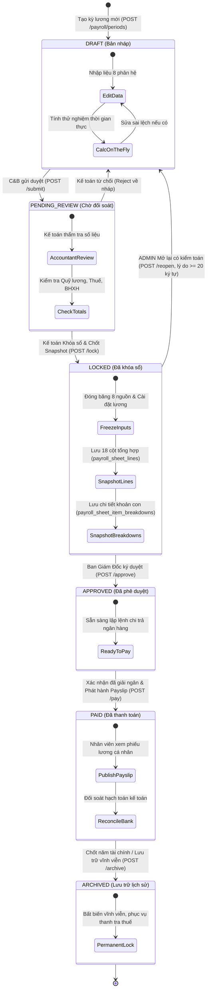

# Vòng Đời Trạng Thái & Quản Lý Chốt Sổ Kỳ Lương (Payroll States & Lifecycle)

> **Mã tài liệu**: `STATE-PAY-001`  
> **Phân hệ**: Bảng lương & Bộ tính toán lương (`payroll`)  
> **Trạng thái**: `approved`  
> **Tác giả**: Business Analyst  
> **Ngày phê duyệt**: 2026-09-06  
> **Tài liệu tham chiếu**: `docs/payroll/srs/payroll-spec.md`, `docs/payroll/srs/payroll-flows.md`  

---

## 1. Sơ đồ Máy Trạng thái (State Machine Diagram)

Vòng đời của Kỳ tính lương (`PayrollPeriod`) và Bảng lương tương ứng trải qua 6 trạng thái chuẩn mực, mô hình hóa sự luân chuyển giữa các phòng ban Nhân sự (C&B), Kế toán, Ban Giám đốc và Cơ quan kiểm toán:

---

## 2. Ma trận Chuyển đổi Trạng thái Chi tiết (State Transition Matrix)

| Trạng thái Nguồn (From) | Trạng thái Đích (To) | Hành động kích hoạt (Action) | Thẩm quyền (RBAC) | Điều kiện tiên quyết (Pre-conditions) | Hành vi Hệ thống & Tác động Dữ liệu (Post-conditions & Side-effects) |
|---|---|---|:---:|---|---|
| **[Khởi tạo]** | `DRAFT` | Tạo kỳ lương mới | `ADMIN`, `HR` | Chưa tồn tại kỳ lương trùng tháng/năm (`code` UNIQUE). | Tạo bản ghi `payroll_periods` mới với trạng thái `DRAFT`. Mở toàn quyền ghi cho 8 phân hệ nhập liệu. |
| `DRAFT` | `PENDING_REVIEW` | Gửi đối soát (`submit`) | `HR` | Đã có ít nhất 1 lần chạy tính bảng lương (`/calculate`) hợp lệ. | Cập nhật `status = PENDING_REVIEW`. Đánh dấu hoàn tất chuẩn bị dữ liệu C&B, chuyển quyền sang Kế toán. |
| `PENDING_REVIEW` | `DRAFT` | Trả về chỉnh sửa (`reject`) | `ACCOUNTANT`, `ADMIN` | Kế toán phát hiện sai lệch ngày công, OT, chỉ tiêu hoặc số tiền. | Cập nhật `status = DRAFT`. Cho phép C&B sửa lại dữ liệu nguồn ở 8 phân hệ. |
| `PENDING_REVIEW` | `LOCKED` | Khóa sổ kỳ lương (`lock`) | `ACCOUNTANT`, `ADMIN` | Dữ liệu đối soát tài chính đã chuẩn xác, không còn sai lệch. | 1. Đóng băng dữ liệu 8 phân hệ nguồn (`E-dltl-001`). 2. Chạy tính toán chốt sổ. 3. Tạo snapshot đa tầng nguyên tử vào `payroll_sheet_lines` và `payroll_sheet_item_breakdowns`. 4. Cập nhật `status = LOCKED`, `lockedAt = now()`, `lockedByUserId`. |
| `LOCKED` | `DRAFT` | Mở lại kỳ lương (`reopen`) | **CHỈ `ADMIN`** | Cung cấp lý do giải trình với độ dài tối thiểu 20 ký tự (`E-pay-009`). | 1. Mở lại trạng thái `status = DRAFT`. 2. Reset `lockedAt = null`, `lockedByUserId = null`. 3. Xóa sạch snapshot cũ trong `payroll_sheet_lines` và `breakdowns`. 4. Ghi `AuditLog` sự kiện `PAYROLL_PERIOD_REOPENED` kèm lý do. |
| `LOCKED` | `APPROVED` | Phê duyệt kỳ lương (`approve`) | **CHỈ `ADMIN`** (Ban Giám Đốc) | Kỳ lương đang ở trạng thái `LOCKED` và đã có snapshot đầy đủ. | Cập nhật `status = APPROVED`, `approvedAt = now()`, `approvedByUserId`. Cấp phép chi trả ngân quỹ. |
| `APPROVED` | `PAID` | Xác nhận chi trả (`pay`) | `ACCOUNTANT`, `ADMIN` | Đã thực hiện lệnh chuyển khoản ngân hàng qua file xuất Excel. | 1. Cập nhật `status = PAID`. 2. Tự động phát hành Phiếu lương điện tử (Payslip) cho từng nhân viên trên cổng thông tin cá nhân. |
| `PAID` | `ARCHIVED` | Đưa vào lưu trữ (`archive`) | `ACCOUNTANT`, `ADMIN` | Đã hoàn tất quyết toán thuế TNCN và chốt sổ tài chính năm. | Cập nhật `status = ARCHIVED`. Đóng băng vĩnh viễn, cấm mọi thao tác mở lại. |

---

## 3. Các Bất Biến Trạng Thái Cốt Lõi (State Invariants)

Hệ thống đặt ra 4 bức tường bảo vệ bất biến (Invariants) mà không bất kỳ nghiệp vụ nào được phép vi phạm:

### Bất biến 1: Đóng băng Dữ liệu Nguồn khi Khóa sổ (Write-freeze Invariant)
- **Quy tắc**: Ngay khi kỳ tính lương chuyển sang trạng thái `LOCKED`, `APPROVED`, `PAID`, hoặc `ARCHIVED`, cơ chế Guard (`PayrollPeriodLockGuard`) lập tức chặn đứng 100% các thao tác thêm, sửa, xóa (`POST`, `PUT`, `PATCH`, `DELETE`) trên toàn bộ 8 phân hệ Dữ liệu tính lương (Chấm công, Tăng ca, KPI, Thưởng, Lương SP, Lương %, Chuyên cần, Ứng/Bù trừ).
- **Mã lỗi kích hoạt**: Ném ngay lập tức `E-dltl-001` (400 Bad Request) với thông báo: *"Kỳ lương đã khóa sổ, không thể chỉnh sửa dữ liệu"*.

### Bất biến 2: Tính Bất biến của Snapshot Bảng lương (Snapshot Immutability Invariant)
- **Quy tắc**: Bảng lương được hiển thị và xuất báo cáo từ trạng thái `LOCKED` trở đi PHẢI được đọc trực tiếp từ 2 bảng snapshot: `payroll_sheet_lines` (dòng tổng 18 cột) và `payroll_sheet_item_breakdowns` (chi tiết từng khoản con).
- **Tuyệt đối không tính toán lại (On-the-fly)**: Mọi thay đổi trong danh mục `SalaryItem`, mức lương cơ bản trong `EmployeeSalary`, hay bảng thiết lập chung `GeneralSetting` sau thời điểm khóa sổ TUYỆT ĐỐI KHÔNG được làm sai lệch số liệu của kỳ đã khóa.

### Bất biến 3: Tính Nguyên tử của Thao tác Khóa sổ (Locking Atomicity Invariant)
- **Quy tắc**: Toàn bộ thao tác khóa sổ (xóa snapshot nháp cũ, tính toán lại lần cuối, chèn hàng loạt dòng tổng `payroll_sheet_lines`, chèn hàng loạt dòng con `breakdowns`, và cập nhật trạng thái `PayrollPeriod.status = LOCKED`) PHẢI được thực thi trong một Database Transaction duy nhất (`Prisma.$transaction`).
- **Xử lý lỗi**: Nếu bất kỳ dòng bản ghi nào bị lỗi kiểm tra ràng buộc (ví dụ: thiếu thông tin nhân viên, vi phạm CHECK constraint), toàn bộ Transaction bị Rollback $100\%$, không lưu dữ liệu dở dang (`E-pay-007`).

### Bất biến 4: Kiểm soát Nghiêm ngặt Thao tác Reopen (Reopen Auditability Invariant)
- **Quy tắc**:
  1. Chỉ duy nhất người dùng có vai trò `ADMIN` được phép mở lại kỳ lương (`E-pay-008`). Kế toán trưởng hay Trưởng phòng HR cũng không có quyền tự mở lại.
  2. Bắt buộc truyền tham số `reason` có độ dài tối thiểu 20 ký tự (`E-pay-009`).
  3. Bắt buộc ghi nhận bản ghi kiểm toán bất biến vào bảng `audit_logs` với sự kiện `PAYROLL_PERIOD_REOPENED`.
  4. Hệ thống phải xóa sạch dữ liệu snapshot cũ để tránh tình trạng "rác số liệu" khi tính toán lại.

---

## 4. Ma trận Phân quyền Theo Trạng thái (RBAC Matrix per State)

| Chức năng / Hành động | `DRAFT` | `PENDING_REVIEW` | `LOCKED` | `APPROVED` | `PAID` | `ARCHIVED` |
|---|:---:|:---:|:---:|:---:|:---:|:---:|
| **Nhập liệu 8 phân hệ** | HR, ADMIN | ❌ Chặn | ❌ Chặn | ❌ Chặn | ❌ Chặn | ❌ Chặn |
| **Tính thử nghiệm (`/calculate`)** | HR, ACCT, ADMIN | HR, ACCT, ADMIN | ❌ Chặn | ❌ Chặn | ❌ Chặn | ❌ Chặn |
| **Gửi duyệt (`/submit`)** | HR, ADMIN | ❌ | ❌ | ❌ | ❌ | ❌ |
| **Khóa sổ (`/lock`)** | ❌ | ACCT, ADMIN | ❌ | ❌ | ❌ | ❌ |
| **Mở lại (`/reopen`)** | ❌ | ❌ | **CHỈ ADMIN** | ❌ | ❌ | ❌ |
| **Phê duyệt (`/approve`)** | ❌ | ❌ | **CHỈ ADMIN** | ❌ | ❌ | ❌ |
| **Chi trả lương (`/pay`)** | ❌ | ❌ | ❌ | ACCT, ADMIN | ❌ | ❌ |
| **Lưu trữ (`/archive`)** | ❌ | ❌ | ❌ | ❌ | ACCT, ADMIN | ❌ |
| **Xem bảng lương tổng hợp** | HR, ACCT, ADMIN | HR, ACCT, ADMIN | HR, ACCT, ADMIN | HR, ACCT, ADMIN | HR, ACCT, ADMIN | HR, ACCT, ADMIN |
| **Xuất file Excel bảng lương** | HR, ACCT, ADMIN | HR, ACCT, ADMIN | HR, ACCT, ADMIN | HR, ACCT, ADMIN | HR, ACCT, ADMIN | HR, ACCT, ADMIN |
| **Nhân viên xem Phiếu lương** | ❌ | ❌ | ❌ | ❌ | **EMPLOYEE (Riêng cá nhân)** | **EMPLOYEE (Riêng cá nhân)** |
