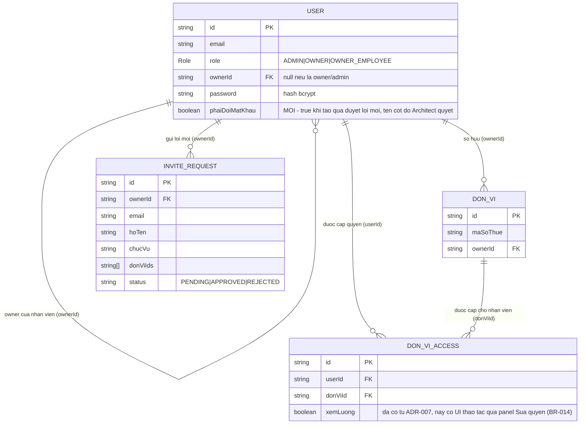

# ERD — Phân quyền nhân viên (mời qua email + đúng công ty được cấp)

> Không có entity mới. Chỉ cần 1 thuộc tính nghiệp vụ mới trên `User` (BR-006) — kiểu dữ liệu/tên cột cụ thể do Architect quyết định, ở đây chỉ mô tả ý nghĩa nghiệp vụ. Các entity khác liệt kê để thấy rõ quan hệ hiện có, KHÔNG đổi.

## Bảng đặc tả thuộc tính thay đổi

| Entity | Thuộc tính (mức nghiệp vụ) | Thay đổi | Kiểu (gợi ý) | Mặc định | Ghi chú |
|---|---|---|---|---|---|
| `User` | "phải đổi mật khẩu" | **MỚI** | boolean | `false` cho tài khoản hiện có; `true` khi tạo mới qua duyệt lời mời | Chỉ có ý nghĩa với tài khoản vừa tạo bằng mật khẩu ngẫu nhiên (BR-005, BR-006). Gỡ về `false` khi nhân viên đổi mật khẩu thành công lần đầu (FR-005). Không áp dụng cho luồng ADMIN đặt lại mật khẩu (BR-011, dùng cơ chế OTP riêng). |

Không có thay đổi nào khác trên schema — **KHÔNG** thêm `User.modules` (đã bỏ khỏi phạm vi), **KHÔNG** thêm cột trên `DonViAccess`, **KHÔNG** thêm bảng mới.

## Bảng entity liên quan (không đổi, liệt kê để đối chiếu quan hệ)

| Entity | Khoá chính | Thuộc tính liên quan feature này | Quan hệ |
|---|---|---|---|
| `User` | `id` | `role`, `ownerId`, `password` (hash), "phải đổi mật khẩu" (mới) | `ownerId` -> `User` (owner của chính nó, 1 user chỉ có 1 owner) |
| `DonVi` | `id` | `maSoThue`, `ownerId` | `ownerId` -> `User` (owner sở hữu) |
| `DonViAccess` | `id` (unique `userId`+`donViId`) | Nguồn quyết định "công ty nào nhân viên được thấy" (BR-002); `xemLuong` (đã có từ ADR-007) — không đổi schema, nay được thao tác qua panel Sửa quyền mới (US-04, BR-014 ⚠️ giả định) | `userId` -> `User`, `donViId` -> `DonVi` |
| `InviteRequest` | `id` | `donViIds`, `status`, `email`, `hoTen`, `chucVu` | `ownerId` -> `User` (owner mời) |
| `SubscriptionPlan` | `id` | `features` (module theo gói, không đổi trong feature này) | `Subscription.planId` -> `SubscriptionPlan` |

## Mermaid erDiagram

## Ghi chú thiết kế dữ liệu (mức nghiệp vụ, không phải quyết định kỹ thuật)

- "Phải đổi mật khẩu" là thuộc tính TÀI KHOẢN (không theo công ty) — chỉ có ý nghĩa lúc tài khoản vừa được tạo bằng mật khẩu do hệ thống sinh (BR-005, BR-006). Architect quyết định lưu bằng cột boolean riêng, hay suy ra từ 1 trường có sẵn khác (vd timestamp) — miễn đáp ứng đúng FR-004/FR-005.
- Không cần migration dữ liệu cho tài khoản hiện có: mặc định "bình thường" (không bắt đổi mật khẩu) cho mọi tài khoản đã tồn tại trước khi triển khai — không ai bị bắt đổi mật khẩu ngoài ý muốn.
- `DonViAccess` là nguồn quyết định DUY NHẤT cho "công ty nào nhân viên được thấy" (BR-002) — đã đúng từ trước, không cần thêm thuộc tính nào cho mục tiêu này.
- Không thêm bảng lịch sử riêng cho việc tạo mật khẩu — nhật ký `APPROVE_INVITE` (`SysLog`) hiện có đã đủ để truy vết "ai được duyệt lúc nào"; TUYỆT ĐỐI không ghi giá trị mật khẩu vào `chiTiet` (BR-007).
- **Cập nhật 2026-09-17 (OQ-4 đã chốt):** panel Sửa quyền (US-04) đọc/ghi `DonViAccess.xemLuong` qua `PUT /companies/employees/:userId/access` đã có sẵn — không cần cột/bảng mới. `xemLuong` vẫn đúng là thuộc tính theo CẶP (nhân viên, công ty), không phải theo tài khoản — khác hẳn "phải đổi mật khẩu" (theo tài khoản). BR-014 (ràng buộc "chỉ bật xem lương khi đã cấp quyền công ty đó") là quy tắc UI/nghiệp vụ mới, không cần ràng buộc CSDL riêng vì `setEmployeeAccess()` hiện tại vốn đã ghi `access` (kèm `xemLuong`) theo đúng tập công ty gửi lên — công ty không có trong `access` thì không còn cặp `DonViAccess` nào để mang `xemLuong`.
