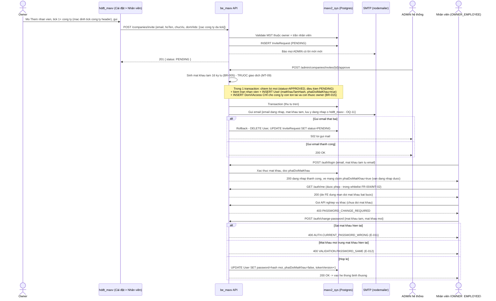
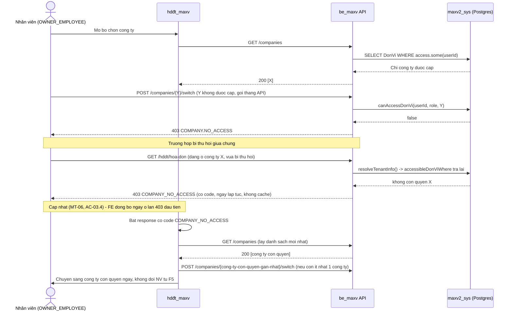
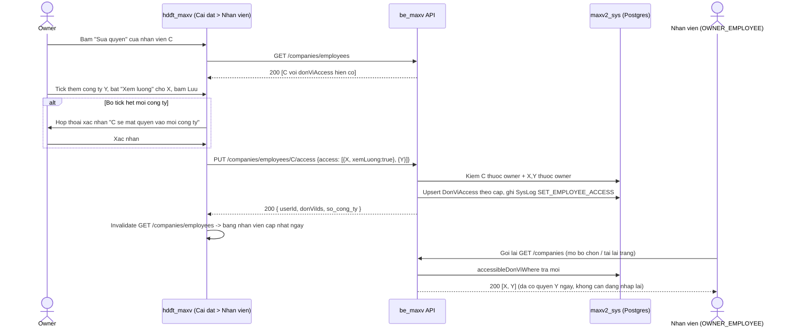

# Flows — Phân quyền nhân viên (mời qua email + đúng công ty được cấp)

## Flow: Owner mời nhân viên -> ADMIN duyệt -> nhận mật khẩu qua email -> đổi mật khẩu lần đầu

### Bảng phân vai (Actor/Role Matrix)

| Bước | Actor | Hành động | Route/Service |
|---|---|---|---|
| 1 | Owner (trong `hdđt_maxv`) | Mở Cài đặt -> Nhân viên -> Thêm nhân viên, điền họ tên/email/chức vụ, tick chọn 1 hoặc nhiều công ty (mặc định tick sẵn công ty đang chọn ở header) | UI mới (FR-001, FR-002 — đã chốt OQ-3: chọn nhiều công ty) |
| 2 | Owner | Gửi lời mời (công ty = danh sách đã tick) | `POST /companies/invite` (không đổi) |
| 3 | Hệ thống | Validate MST thuộc owner, chặn email đã có tài khoản hoặc đã có lời mời PENDING, kiểm trần nhân viên, tạo `InviteRequest` PENDING, báo mail mọi ADMIN | `inviteUserToCompany()` (không đổi) |
| 4 | ADMIN | Duyệt hoặc từ chối lời mời | `POST /admin/companies/invites/:id/approve\|reject` (không đổi cấu trúc, đổi bước sinh mật khẩu ở nhánh duyệt) |
| 5 | Hệ thống | Nếu duyệt: sinh mật khẩu ngẫu nhiên thật (BR-005), tạo `User` + `DonViAccess` cho từng MST được mời trong 1 giao dịch, đánh dấu "phải đổi mật khẩu", gửi email chứa email đăng nhập + mật khẩu | `adminApproveInvite()` (mở rộng, FR-003) |
| 6 | Hệ thống | Gửi email thất bại (SMTP lỗi) | Huỷ `User` vừa tạo, đưa lời mời về lại PENDING (rollback, BR-010, không đổi cơ chế) |
| 7 | Nhân viên | Đăng nhập lần đầu bằng email + mật khẩu nhận được | `POST /auth/login` (không đổi hình dạng response) |
| 8 | Hệ thống | Phát hiện tài khoản đang "phải đổi mật khẩu", chặn mọi request nghiệp vụ khác | Guard mới (FR-004, E-005) |
| 9 | Nhân viên | Đổi mật khẩu mới đạt chính sách | API đổi mật khẩu bắt buộc (mới, Architect thiết kế) |
| 10 | Hệ thống | Gỡ cờ "phải đổi mật khẩu", cho vào hệ thống bình thường | FR-005 |

### Sequence: Duyệt lời mời -> gửi mật khẩu -> đăng nhập lần đầu

## Flow: Nhân viên đăng nhập, phạm vi công ty tính thế nào (hành vi hiện có, xác nhận không đổi)

### Bảng phân vai

| Bước | Actor | Hành động |
|---|---|---|
| 1 | Nhân viên | Đăng nhập hoặc mở bộ chọn công ty ở header |
| 2 | Hệ thống | `GET /companies` lọc theo `accessibleDonViWhere(userId, role)` — nhân viên chỉ nhận công ty có `DonViAccess` |
| 3 | Nhân viên | Chọn 1 công ty trong danh sách, hệ thống gọi `POST /companies/{id}/switch` |
| 4 | Hệ thống | Kiểm `canAccessDonVi()` trước khi cấp lại token nhúng `donViId` mới; không có quyền -> 403 ngay |
| 5 | Nhân viên | Thao tác nghiệp vụ (xem hoá đơn, tờ khai, HRM...) trong công ty đang chọn |
| 6 | Hệ thống | Mọi route dữ liệu tenant gọi `resolveTenantDb`/`resolveTenantInfo`, tra lại `accessibleDonViWhere` mỗi request — quyền bị thu hồi thì request tiếp theo bị chặn ngay, không chờ nhân viên tải lại trang |

### Sequence: Chặn công ty không được cấp (regression, xác nhận đã đúng)

## Flow: Owner sửa quyền công ty + xem lương của nhân viên đã duyệt (MỚI — OQ-4)

### Bảng phân vai (Actor/Role Matrix)

| Bước | Actor | Hành động | Route/Service |
|---|---|---|---|
| 1 | Owner | Ở bảng nhân viên, bấm nút "Sửa quyền" của 1 nhân viên đã duyệt | UI mới (FR-009) |
| 2 | Hệ thống | Mở panel liệt kê toàn bộ công ty của owner, tick sẵn theo `DonViAccess` hiện có, ô "Xem lương" chỉ bật được khi công ty đó đang tick "Cấp quyền" | UI mới (FR-009, BR-014) |
| 3 | Owner | Tick thêm/bớt công ty, bật/tắt xem lương, bấm Lưu | — |
| 4 | Hệ thống | Nếu owner bỏ tick hết công ty: hiện hộp thoại xác nhận trước khi gửi | FR-010 |
| 5 | Hệ thống | Gọi `PUT /companies/employees/:userId/access` với `access` gồm các công ty đã tick kèm `xemLuong` | `setEmployeeAccess()` (không đổi backend, chỉ thêm UI gọi) |
| 6 | Hệ thống | Kiểm owner sở hữu nhân viên + mọi công ty gửi lên, ghi theo cặp (giữ `xemLuong` cũ nếu không gửi), ghi `SysLog` | `company.service.ts:397-471` (không đổi) |
| 7 | Nhân viên | Quyền có hiệu lực ngay ở API tiếp theo (không cần đăng nhập lại) | `resolveTenantInfo`/`accessibleDonViWhere` tra mới mỗi request |

### Sequence: Sửa quyền công ty + xem lương

