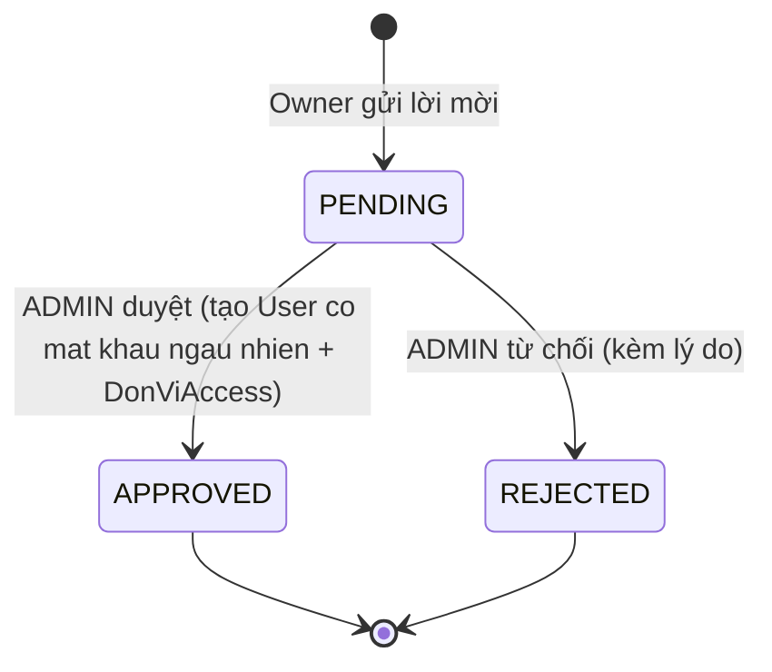
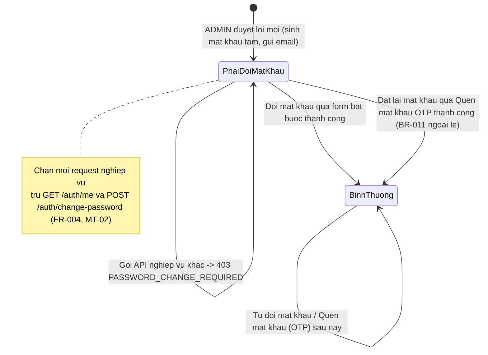
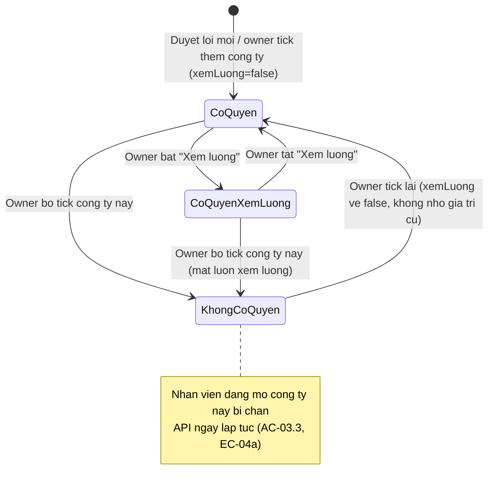

# States — Phân quyền nhân viên

## State: InviteRequest (vòng đời lời mời — KHÔNG đổi trong feature này, liệt kê để đối chiếu)

### Bảng chuyển đổi trạng thái

| Trạng thái hiện tại | Sự kiện | Trạng thái mới | Ai thực hiện |
|---|---|---|---|
| (chưa có) | Owner gửi `POST /companies/invite` | `PENDING` | Owner |
| `PENDING` | ADMIN `POST /admin/companies/invites/:id/approve` | `APPROVED` | ADMIN |
| `PENDING` | ADMIN `POST /admin/companies/invites/:id/reject` | `REJECTED` | ADMIN |
| `PENDING` | Owner muốn huỷ | Không có transition — chưa có endpoint owner tự huỷ (ngoài phạm vi, không đổi) | — |
| `APPROVED` | — | Trạng thái cuối; tạo `User` (mật khẩu ngẫu nhiên + cờ phải đổi, xem state dưới) + `DonViAccess` | Hệ thống |
| `REJECTED` | — | Trạng thái cuối, kèm `lyDoTuChoi` | Hệ thống |

## State: Trạng thái mật khẩu của tài khoản nhân viên mới tạo (MỚI trong feature này)

> ✅ Đã chốt 2026-09-17: anh @phamvinh203 xác nhận Phương án A (OQ-1) — trạng thái dưới đây áp dụng chính thức, không còn là đề xuất.

Đây là trạng thái nghiệp vụ mới do BR-006 yêu cầu — cách lưu trữ cụ thể (tên cột, kiểu dữ liệu) do Architect thiết kế; ở mức nghiệp vụ chỉ có 2 giá trị: "phải đổi mật khẩu" và "bình thường".

### Bảng chuyển đổi trạng thái

| Trạng thái hiện tại | Sự kiện | Trạng thái mới | Ai thực hiện |
|---|---|---|---|
| (chưa có `User`) | ADMIN duyệt lời mời — hệ thống sinh mật khẩu ngẫu nhiên, gửi email | `PhaiDoiMatKhau` | Hệ thống (BR-005, BR-006) |
| `PhaiDoiMatKhau` | Nhân viên đăng nhập thành công lần đầu, gọi API nghiệp vụ khác (chưa đổi mật khẩu) | Không đổi trạng thái — bị chặn 403 `PASSWORD_CHANGE_REQUIRED` (E-005) | Hệ thống |
| `PhaiDoiMatKhau` | Nhân viên đổi mật khẩu mới thành công qua `POST /auth/change-password` (đạt chính sách, khác mật khẩu hiện tại — E-011/E-012) | `BinhThuong` | Nhân viên |
| `PhaiDoiMatKhau` | ✅ **Cập nhật sau đối soát Architect (BR-011 ngoại lệ, MT-01):** nhân viên dùng "Quên mật khẩu" (OTP) đặt lại mật khẩu thành công, thay vì đổi qua form bắt buộc | `BinhThuong` | Nhân viên |
| `BinhThuong` | Nhân viên tự đổi mật khẩu sau này, hoặc dùng "Quên mật khẩu" (OTP) | `BinhThuong` (không quay lại `PhaiDoiMatKhau`) | Nhân viên |

**Ghi chú (cập nhật sau đối soát Architect):** luồng ADMIN đặt lại mật khẩu (`adminResetPassword`, ngoài phạm vi feature này) đặt mật khẩu về "không ai biết", buộc nhân viên tự dùng "Quên mật khẩu" (OTP) để lấy lại quyền truy cập — KHÔNG tự nó đụng tới trạng thái `PhaiDoiMatKhau` (BR-011). Còn chính `resetPasswordWithOtp` (bước 2 của "Quên mật khẩu") thì **CÓ** gỡ `PhaiDoiMatKhau` về `BinhThuong` nếu tài khoản đang ở trạng thái đó — vì nhân viên đã tự chọn mật khẩu mới qua đường này, coi như đã hoàn tất yêu cầu đổi mật khẩu (ngoại lệ của BR-011, phát hiện từ MT-01/SPEC-QA-003).

## State: Quyền của 1 nhân viên đối với 1 công ty cụ thể (DonViAccess, MỚI có UI trong feature này — OQ-4)

Mỗi cặp (nhân viên, công ty) có 2 trạng thái độc lập với các cặp khác của cùng nhân viên. "Xem lương" là trạng thái con, chỉ tồn tại khi đang ở `CoQuyen`.

### Bảng chuyển đổi trạng thái

| Trạng thái hiện tại | Sự kiện | Trạng thái mới | Ai thực hiện |
|---|---|---|---|
| (chưa có cặp) | ADMIN duyệt lời mời có công ty này, hoặc owner tick thêm công ty ở panel Sửa quyền | `CoQuyen` (`xemLuong=false` mặc định) | Hệ thống / Owner (FR-009) |
| `CoQuyen` | Owner bật ô "Xem lương" của công ty này và Lưu | `CoQuyen (xemLuong=true)` | Owner (FR-009, BR-014) |
| `CoQuyen (xemLuong=true)` | Owner bỏ tick "Cấp quyền" công ty này (kể cả khi đang bật xem lương) và Lưu | `KhongCoQuyen` — mất luôn quyền xem lương của công ty đó (BR-014) | Owner |
| `CoQuyen` | Owner bỏ tick "Cấp quyền" công ty này và Lưu | `KhongCoQuyen` | Owner |
| `KhongCoQuyen` | Owner tick lại công ty này ở panel Sửa quyền | `CoQuyen (xemLuong=false)` — không tự khôi phục `xemLuong` cũ | Owner |

**Ghi chú:** nếu 1 nhân viên bị `KhongCoQuyen` ở TẤT CẢ công ty (không còn cặp `CoQuyen` nào), tài khoản vẫn tồn tại bình thường, chỉ không đăng nhập được vào công ty nào (BR-013, EC-04b) — không phải trạng thái của tài khoản `User`, mà là hệ quả của việc không còn cặp `DonViAccess` nào ở trạng thái `CoQuyen`.

## Không còn state "Quyền module hiệu lực" (đã bỏ khỏi phạm vi)

Vòng 1 có state "quyền module hiệu lực theo nhân viên" (`User.modules`) — đã bị loại khỏi phạm vi theo quyết định 2026-09-17 (xem `CONTEXT_SUMMARY.md` Mục 0). Nhân viên tiếp tục dùng chung module theo gói owner, không có trạng thái riêng nào cần theo dõi.
