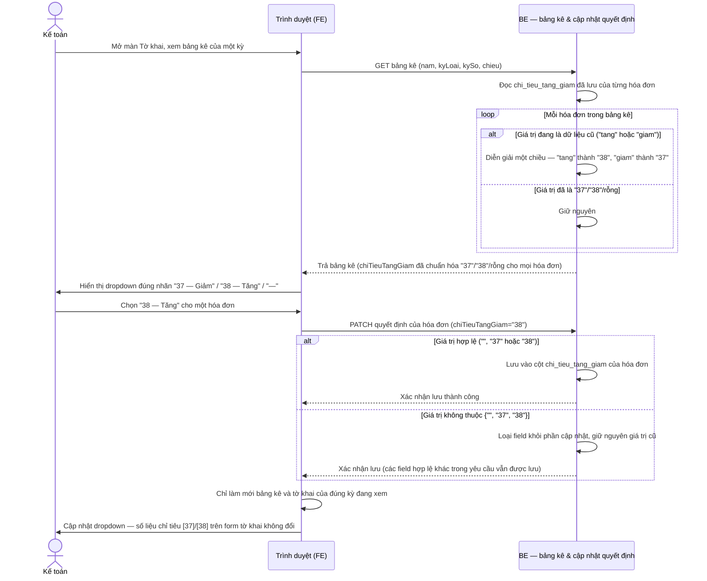

# Luồng nghiệp vụ: Xuất Excel kèm chi tiết hóa đơn & đổi mã "Chỉ tiêu tăng giảm"

## Flow: Xuất Excel tờ khai kèm 4 sheet bảng kê/chi tiết

Kế toán bấm "Xuất Excel" tại màn Tờ khai. Hệ thống gọi **hai lượt song song** tới endpoint chi tiết hóa đơn theo kỳ (`GET /api/v1/to-khai/hoa-don/chi-tiet`) — một lượt cho chiều mua vào, một lượt cho chiều bán ra. Mỗi lượt trả về đúng tập hóa đơn của kỳ + chiều đó (`layBangKeTheoKy`), kèm sẵn chi tiết hàng hóa/dịch vụ của từng hóa đơn (`chiTiet: object | null`). Sheet "HĐ..." và sheet "Chi tiết..." của cùng một chiều được dựng từ CÙNG một response — không cần lượt gọi riêng cho bảng kê. Nếu một trong hai lượt thất bại, toàn bộ thao tác xuất bị hủy — không tạo ra file thiếu sheet.

```mermaid
sequenceDiagram
    actor KT as Kế toán
    participant FE as Trình duyệt (FE)
    participant BE as BE — GET /to-khai/hoa-don/chi-tiet

    KT->>FE: Bấm "Xuất Excel"
    activate FE
    FE->>FE: Chuyển nút sang trạng thái đang xử lý, chụp kỳ (nam/kyLoai/kySo) tại thời điểm bấm
    FE->>FE: Dựng sẵn sheet "01-GTGT" (+ "PL 204-2025" nếu có phụ lục) từ dữ liệu tờ khai đang xem

    par Tải song song 2 chiều
        FE->>BE: GET /hoa-don/chi-tiet (nam, kyLoai, kySo, chieu=purchase)
        BE-->>FE: { total, datas, thayThe } — mỗi hóa đơn mua vào kèm chiTiet (object hoặc null)
    and
        FE->>BE: GET /hoa-don/chi-tiet (nam, kyLoai, kySo, chieu=sold)
        BE-->>FE: { total, datas, thayThe } — mỗi hóa đơn bán ra kèm chiTiet (object hoặc null)
    end

    alt Cả hai lượt đều thành công
        FE->>FE: Thêm sheet "HĐ mua vào" (rows = datas mua vào, STT theo vị trí trong mảng)
        FE->>FE: Thêm sheet "HĐ bán ra" (rows = datas bán ra, STT theo vị trí trong mảng)
        FE->>FE: Thêm sheet "Chi tiết mua vào" — mỗi hóa đơn i bung theo chiTiet; chiTiet là null thì vẫn 1 dòng lấy thông tin từ chính datas[i], cột hàng hóa để trống; STT = STT của datas[i] ở sheet "HĐ mua vào"
        FE->>FE: Thêm sheet "Chi tiết bán ra" — tương tự, dùng datas bán ra
        FE->>KT: Tải file .xlsx hoàn chỉnh (5 hoặc 6 sheet tùy có phụ lục)
    else Một trong hai lượt lỗi (mạng, máy chủ, quá số lượt/phút)
        FE->>KT: Toast nêu đúng chiều bị lỗi (vd "Không tải được dữ liệu hóa đơn bán ra")
        FE->>FE: Hủy thao tác xuất — không tạo file
    end

    FE->>FE: Trả nút "Xuất Excel" về trạng thái bình thường (trong finally, kể cả khi lỗi)
    deactivate FE
```

**Ghi chú luồng:**
- Hai lượt gọi ở nhánh `par` dùng chung định danh kỳ tờ khai (`nam`/`kyLoai`/`kySo`) đã chụp ngay khi bấm nút — tránh trường hợp kế toán đổi kỳ đang xem ngay lúc dữ liệu đang tải.
- Vì sheet "HĐ..." và sheet "Chi tiết..." của một chiều cùng dựng từ một response duy nhất, tập hóa đơn của hai sheet đó trùng nhau tuyệt đối theo đúng thiết kế (BR-to-khai-gtgt01-001), không phụ thuộc hai truy vấn riêng biệt có thể chạy ở hai thời điểm khác nhau.
- Nhánh lỗi áp dụng "tất cả hoặc không gì cả": không có trạng thái file xuất ra thiếu sheet hoặc sheet rỗng do lỗi tải dữ liệu — chỉ sheet rỗng do kỳ/chiều thực sự không có hóa đơn (BR-to-khai-gtgt01-005) mới được chấp nhận.
- Endpoint `GET /api/v1/to-khai/hoa-don/chi-tiet` là khả năng MỚI (Architect chốt tại `architecture/api-contract.md` Mục 2, `architecture/adr/ADR-001-chi-tiet-hoa-don-theo-ky.md`) — bắt buộc gọi nguyên `layBangKeTheoKy` để xác định tập hóa đơn, đúng theo Quyết định #1 đã chốt tại `CONTEXT_SUMMARY.md`.

## Flow: Chọn và lưu "Chỉ tiêu tăng giảm" — kèm diễn giải dữ liệu cũ khi đọc

Khi kế toán mở bảng kê, hệ thống đọc giá trị `chi_tieu_tang_giam` đã lưu; nếu là dữ liệu cũ (`"tang"`/`"giam"`), hệ thống tự diễn giải sang mã mới trước khi trả cho giao diện. Khi kế toán chọn và lưu một giá trị mới, hệ thống chỉ chấp nhận `"", "37", "38"`.



**Ghi chú luồng:**
- Bước diễn giải dữ liệu cũ nằm hoàn toàn ở phía BE, tại đúng nơi đang đọc `chi_tieu_tang_giam` để trả cho bảng kê — không có bước diễn giải nào ở FE, tránh phải lặp lại logic map ở nhiều nơi đọc (bảng kê hiển thị và sheet "HĐ..."/"Chi tiết..." khi xuất Excel đều đi qua cùng một chỗ đọc này).
- Việc PATCH quyết định của một hóa đơn không kéo theo bất kỳ thay đổi nào ở số liệu chỉ tiêu [37]/[38] của form tờ khai — hai luồng dữ liệu độc lập hoàn toàn (BR-to-khai-gtgt01-002).
