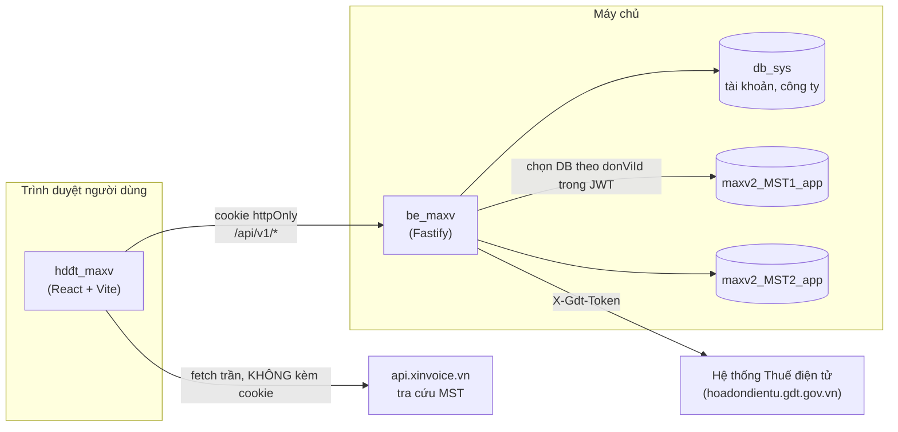

# 01 — Tổng quan & phạm vi hệ thống

## 1.1. Ứng dụng làm gì

`hdđt_maxv` là ứng dụng web giúp kế toán **lấy hóa đơn điện tử từ hệ thống Thuế điện tử của Tổng cục Thuế (gọi tắt là GDT) về lưu tại cơ sở dữ liệu riêng**, rồi tra cứu, xem, in và xuất ra Excel / HTML / XML / PDF.

Ba việc chính:

1. **Lấy dữ liệu** — đăng nhập GDT bằng MST + mật khẩu + captcha, quét danh sách hóa đơn theo khoảng ngày, tải chi tiết từng hóa đơn.
2. **Tra cứu** — đọc lại dữ liệu đã lưu bằng bộ lọc, không cần kết nối GDT.
3. **Kết xuất** — dựng tờ hóa đơn để xem/in, xuất Excel tổng hợp và file từng hóa đơn.

## 1.2. Sơ đồ ngữ cảnh



Ba điều rút ra từ sơ đồ:

- **Frontend không bao giờ gọi thẳng GDT.** Mọi lời gọi đi qua `be_maxv`, kèm token GDT ở header `X-Gdt-Token`.
- **Mỗi công ty một database riêng.** Backend chọn database theo `donViId` nhúng trong JWT. Frontend không chọn database — nó chỉ quyết định *đang làm việc với công ty nào*, và điều đó thay đổi cookie phiên.
- **Có đúng một dịch vụ bên thứ ba mà FE gọi trực tiếp:** API tra cứu người nộp thuế theo MST. Lý do nằm trong `src/config/api.ts`:

```ts
// API tra cứu người nộp thuế theo MST (dịch vụ ngoài, KHÔNG phải be_maxv).
// Bên họ trả 'Access-Control-Allow-Origin: *' nên FE gọi thẳng được, không cần BE proxy —
// và quan trọng hơn: rate limit của họ (10 lần/30s) tính theo IP, đi qua BE thì cả hệ thống
// dùng chung một hạn mức. Gọi bằng fetch trần, tuyệt đối không qua apiFetch (không gửi
// cookie phiên của app sang bên thứ 3).
export const TAX_PAYER_API_BASE =
  import.meta.env.VITE_TAX_PAYER_API_URL ?? 'https://api.xinvoice.vn/gdt-api'
```

Đây là ví dụ đầu tiên của một nguyên tắc xuyên suốt dự án: **quyết định kỹ thuật nào cũng có lý do được ghi lại ngay cạnh code**. Khi sửa, hãy đọc comment trước.

## 1.3. Ranh giới trách nhiệm FE / BE

| Việc | Ai làm | Ghi chú |
|---|---|---|
| Đăng nhập ứng dụng, cấp phiên | BE | Cookie httpOnly, FE không đọc được token |
| Đăng nhập GDT (captcha) | BE gọi GDT, FE hiển thị | FE giữ token GDT trong `sessionStorage` |
| Quét danh sách hóa đơn từ GDT | **BE**, chạy nền | FE chỉ khởi động rồi hỏi tiến độ |
| Tải chi tiết từng hóa đơn | **BE**, chạy nền | Có cơ chế giãn nhịp chống bị GDT chặn |
| Lưu hóa đơn vào DB | BE | |
| Lọc, phân trang, hiển thị bảng | **FE** | Phân trang phía client trên dữ liệu đã tải |
| Dựng HTML tờ hóa đơn | **FE** | `invoiceHtml.ts` |
| Lấy XML gốc đã ký số | **BE gọi GDT** | Tải ZIP từ cổng thuế rồi rút `invoice.xml` — không tự dựng |
| Sinh file Excel | **FE** | Thư viện `exceljs` chạy trong trình duyệt |
| Render PDF | **BE** | Chromium headless — FE gửi HTML lên, nhận PDF về |
| Ghi file xuống đĩa | **FE** | File System Access API (Chrome/Edge) |

Điểm dễ nhầm: **PDF render ở backend, Excel sinh ở frontend.** Lý do PDF phải ở BE — cần Chromium thật để ra PDF vector (chữ nét, chọn/tìm được), trong khi cách cũ dùng `html2canvas` cho ra ảnh raster mờ. Chi tiết ở [chương 11](11-pipeline-xuat-file.md).

## 1.4. Hai loại phiên đăng nhập

Đây là khái niệm gây nhầm lẫn nhiều nhất cho người mới. Ứng dụng có **hai phiên hoàn toàn độc lập**:

| | Phiên ứng dụng | Phiên Thuế điện tử (GDT) |
|---|---|---|
| Đăng nhập bằng | Email + mật khẩu | MST + mật khẩu + captcha |
| Token lưu ở | **Cookie httpOnly** — JS không đọc được | **`sessionStorage`**, khóa theo từng MST |
| Ai quản lý | `AuthContext` | `GdtSessionProvider` |
| Thời hạn | Access ngắn, refresh 7 ngày, tự làm mới | Rất ngắn (khoảng vài phút), không tự làm mới |
| Mất khi | Đăng xuất, hết refresh token | **Đóng tab**, đăng xuất |
| Gửi lên BE thế nào | Trình duyệt tự gửi cookie | Header `X-Gdt-Token`, code phải truyền tay |

Hệ quả thực tế: một người dùng có thể đang đăng nhập ứng dụng bình thường nhưng **không** có phiên GDT. Mọi thao tác cần dữ liệu mới từ cơ quan thuế đều phải kiểm tra token GDT trước, và mở form đăng nhập nếu thiếu.

## 1.5. Mô hình đa công ty

Một tài khoản quản lý nhiều công ty / hộ kinh doanh. Mỗi công ty:

- Có **một MST** — không sửa được sau khi tạo, vì MST gắn với tên database tenant.
- Có **database riêng** trên máy chủ.
- Có **token GDT riêng** trong `sessionStorage`.

Frontend luôn có khái niệm "**công ty đang chọn**" (`currentCompanyId`). Đổi công ty nghĩa là:

1. Gọi `POST /companies/:id/switch` → server cấp **cookie access mới** nhúng `donViId` mới.
2. Mọi `queryKey` gắn `currentCompanyId` tự đổi → TanStack Query fetch lại đúng dữ liệu công ty mới.
3. Mọi tiến trình đang chạy cho công ty cũ phải dừng.

Bước 3 là chỗ dễ sai nhất. Toàn bộ [chương 7](07-da-cong-ty-va-cach-ly-tenant.md) dành cho việc này.

## 1.6. Bản đồ tính năng theo màn hình

| Màn hình | Route | File gốc |
|---|---|---|
| Đăng nhập | `/login` | `pages/AuthPage.tsx` |
| Đăng ký | `/register` | `pages/RegisterPage.tsx` |
| Quên mật khẩu | `/forgot-password` | `pages/ForgotPasswordPage.tsx` |
| Hóa đơn điện tử (màn hình chính) | `/` | `pages/HomePage.tsx` |
| Cài đặt | `/settings` | `pages/settings/SettingsPage.tsx` |

Màn hình chính là nơi tập trung gần như toàn bộ nghiệp vụ. Cây component:

```
HomePage
├── AppHeader                     chọn công ty, đăng nhập GDT, menu người dùng
├── InvoiceListTabs               2 tab chiều hóa đơn
│   ├── InvoiceTablePanel ×2      mỗi chiều một instance, giữ state riêng
│   │   ├── InvoiceFilterPanel    bộ lọc + 3 nút hành động
│   │   ├── InvoiceDetailPanel    bảng tab "Chi tiết hóa đơn"
│   │   ├── InvoiceViewDialog     xem/in tờ hóa đơn
│   │   ├── InvoicePagination
│   │   └── DialogLoginHddt       mở khi thao tác thiếu token GDT
│   └── ExportFileDialog          xuất file cả 2 chiều
├── SyncInvoiceDialog             đồng bộ từ Thuế
└── CompanyFormDialog             mời tạo công ty đầu tiên
```

Lưu ý `InvoiceTablePanel` được **mount 2 lần** và tab không active bị ẩn bằng CSS chứ không unmount:

```tsx
{/* Mount cả 2 chiều, chỉ ẩn tab không active bằng CSS — giữ state tra cứu riêng cho mỗi
    chiều mà không mất dữ liệu khi chuyển qua lại (remount sẽ reset rows về rỗng). */}
<Box sx={{ display: tab === "purchase" ? "block" : "none" }}>
  <InvoiceTablePanel direction="purchase" active={tab === "purchase"} />
</Box>
<Box sx={{ display: tab === "sold" ? "block" : "none" }}>
  <InvoiceTablePanel direction="sold" active={tab === "sold"} />
</Box>
```

Prop `active` không dùng để ẩn hiện — nó dùng để **hoãn gọi API cho tab đang ẩn**. Xem `enabled` trong [chương 5](05-quan-ly-du-lieu-tanstack-query.md).

---

**Tiếp theo:** [02 — Cài đặt & chạy dự án](02-cai-dat-va-chay.md)
