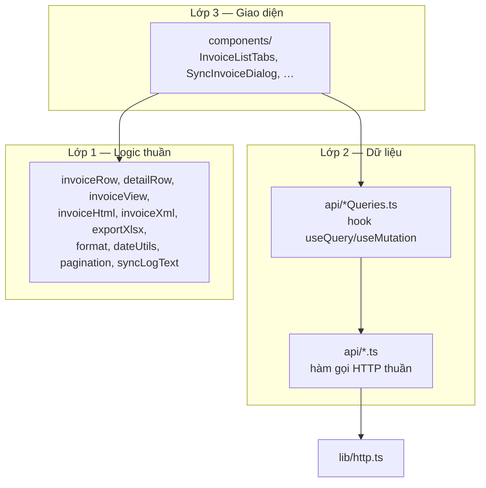
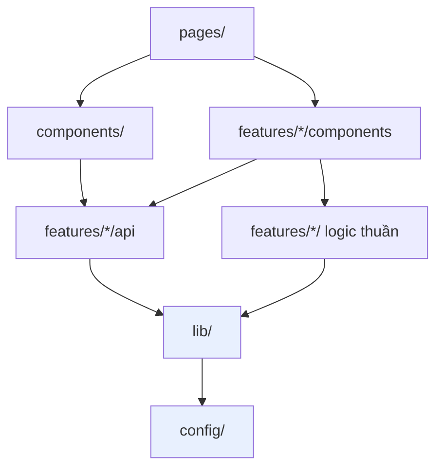

# 03 — Kiến trúc & quy ước thư mục

Chương này trả lời câu hỏi bạn sẽ gặp mỗi ngày: **code mới đặt ở đâu?**

## 3.1. Bản đồ thư mục

```
src/
├── main.tsx                    điểm vào — lắp các provider
├── App.tsx                     layout gốc của mọi route + ToastContainer
├── index.css
│
├── config/
│   └── api.ts                  URL backend + dịch vụ tra cứu MST
│
├── lib/                        HẠ TẦNG — không biết gì về nghiệp vụ
│   ├── http.ts                 apiFetch, ApiError, tự làm mới phiên
│   ├── errors.ts               getErrorMessage
│   ├── queryClient.ts          cấu hình TanStack Query
│   └── fileSystemAccess.ts     bọc File System Access API
│
├── components/                 COMPONENT DÙNG CHUNG — nhiều feature cùng dùng
│   ├── AppHeader.tsx
│   ├── FullScreenLoader.tsx
│   ├── PasswordField.tsx
│   └── dialogLoginHddt.tsx     form đăng nhập GDT
│
├── features/                   NGHIỆP VỤ — chia theo miền
│   ├── auth/
│   │   ├── api/authApi.ts
│   │   ├── components/         LoginForm, RegisterForm, ForgotPasswordForm
│   │   ├── validators/         rules.ts + validator từng form
│   │   ├── types/index.ts
│   │   ├── AuthContext.tsx     provider
│   │   ├── context.ts          createContext (tách riêng, xem 3.4)
│   │   ├── useAuth.ts
│   │   └── useActiveCompanyMst.ts
│   │
│   ├── company/
│   │   ├── api/                companyApi + companyQueries + taxPayerApi + taxPayerQueries
│   │   ├── components/         CompanyManagementTab, CompanyFormDialog, DeleteCompanyDialog
│   │   ├── hooks/useCompanySwitch.ts
│   │   ├── types/index.ts
│   │   └── mst.ts              quy tắc mã số thuế
│   │
│   └── hddt/                   miền lớn nhất — hóa đơn điện tử
│       ├── api/                gdt, invoiceDetail, sync, updateRun + các file *Queries
│       ├── components/         7 component màn hình hóa đơn
│       ├── gdtSession/         provider + context + 2 hook phiên GDT
│       ├── types/index.ts
│       └── (13 file tiện ích thuần — xem 3.3)
│
├── pages/                      LẮP RÁP — mỗi route một file
│   ├── AuthPage, RegisterPage, ForgotPasswordPage, HomePage
│   └── settings/               SettingsPage + 3 tab
│
├── routes/
│   ├── AppRouter.tsx           khai báo mọi path
│   └── ProtectedRoute.tsx
│
└── theme/
    ├── displaySettings.ts      kiểu, mặc định, buildTheme, context, hook
    └── DisplaySettingsProvider.tsx
```

## 3.2. Quy tắc "cái gì để đâu"

Đây là phần quan trọng nhất của chương. Khi thêm file mới, đi lần lượt từ trên xuống:

| Câu hỏi | Nếu đúng thì đặt ở |
|---|---|
| Có phụ thuộc vào nghiệp vụ nào không? Không — nó chỉ là kỹ thuật thuần (gọi HTTP, đọc file, format ngày) | `lib/` |
| Là hằng số cấu hình môi trường? | `config/` |
| Là component giao diện mà **từ 2 feature trở lên** cùng dùng? | `components/` |
| Là component chỉ một feature dùng? | `features/<miền>/components/` |
| Là hàm gọi API? | `features/<miền>/api/<tên>Api.ts` |
| Là hook TanStack Query bọc quanh hàm gọi API? | `features/<miền>/api/<tên>Queries.ts` |
| Là kiểu dữ liệu của miền? | `features/<miền>/types/index.ts` |
| Là hàm biến đổi dữ liệu thuần (không React, không API)? | `features/<miền>/<tên>.ts` ngay tại gốc feature |
| Là màn hình gắn với một route? | `pages/` |

### Ví dụ áp dụng

`AppHeader.tsx` nằm ở `components/` chứ không phải `features/auth/components/`, dù nó đọc `useAuth()`. Lý do: nó được cả `HomePage` lẫn `SettingsPage` dùng, và nó chạm vào ba miền cùng lúc (auth, company, hddt). Nó là component **của ứng dụng**, không của riêng miền nào.

`dialogLoginHddt.tsx` cũng ở `components/` vì được mở từ ba nơi thuộc hai miền khác nhau: `AppHeader`, `InvoiceTablePanel`, `SyncInvoiceDialog`.

Ngược lại, `CompanyFormDialog.tsx` nằm trong `features/company/components/` vì chỉ luồng quản lý công ty dùng nó.

## 3.3. Ba lớp bên trong một feature

Lấy `features/hddt` làm ví dụ — miền lớn nhất, có đủ ba lớp:



**Lớp 1 — logic thuần.** Không import React, không gọi API. Nhận dữ liệu vào, trả dữ liệu ra. Đây là lớp dễ đọc và dễ kiểm thử nhất:

```ts
// src/features/hddt/pagination.ts
/**
 * Kẹp `page` về khoảng hợp lệ khi tổng số dòng thay đổi (refetch trả ít dòng hơn) — tránh kẹt
 * ở trang trống. Tính lúc render (không setState); 2 bảng Tổng quát/Chi tiết dùng chung.
 */
export function clampPage(page: number, count: number, rowsPerPage: number): number {
  return Math.min(page, Math.max(0, Math.ceil(count / rowsPerPage) - 1));
}
```

Hàm bốn dòng nhưng giải quyết một lỗi thật: người dùng đang ở trang 5, dữ liệu được nạp lại và chỉ còn 2 trang, bảng sẽ trống trơn mà không hiểu vì sao. Tính toán lúc render thay vì `setState` trong effect — đây là mẫu lặp lại nhiều lần trong dự án, xem [chương 12](12-quy-uoc-lap-trinh.md).

**Lớp 2 — dữ liệu.** Chia đôi có chủ đích:

- `api/gdt.ts`, `api/sync.ts`, `api/invoiceDetail.ts`, `api/updateRun.ts` — hàm gọi HTTP thuần, **không biết React**. Gọi được từ bất cứ đâu, kể cả trong vòng lặp của `exportBundle.ts`.
- `api/invoiceQueries.ts`, `api/syncQueries.ts`, … — hook React bọc quanh hàm trên, gắn `queryKey` và điều kiện `enabled`.

Tách như vậy vì có chỗ cần gọi API **ngoài** vòng đời React. Ví dụ `exportBundle.ts` gọi thẳng `getSavedInvoices` và `getSavedDetails` trong một vòng lặp bất đồng bộ — không thể dùng hook ở đó.

**Lớp 3 — giao diện.** Component chỉ được import từ lớp 2 và lớp 1, không bao giờ gọi `fetch` trực tiếp.

## 3.4. Vì sao `context.ts` tách khỏi `AuthContext.tsx`

Bạn sẽ thấy mẫu này lặp ở cả hai context:

```
features/auth/
├── context.ts          <- chỉ có createContext
├── AuthContext.tsx     <- component AuthProvider
└── useAuth.ts          <- hook đọc context
```

```ts
// features/auth/context.ts — toàn bộ nội dung
import { createContext } from "react";
import type { AuthContextValue } from "./types";

export const AuthContext = createContext<AuthContextValue | null>(null);
```

Lý do là luật `react-refresh/only-export-components` (bật trong `eslint.config.js`): một file chứa component thì **chỉ nên export component**. Nếu `AuthContext.tsx` vừa export `AuthProvider` vừa export hằng `AuthContext`, Fast Refresh không thể thay nóng file đó — mỗi lần sửa sẽ mất toàn bộ state ứng dụng, phải đăng nhập lại.

Tách ba file làm mất một chút gọn gàng, đổi lại trải nghiệm phát triển không bị gián đoạn.

## 3.5. Phụ thuộc giữa các tầng



**Quy tắc: mũi tên chỉ đi xuống.** Cụ thể:

| Được phép | Không được phép |
|---|---|
| `pages/` import `features/` | `features/` import `pages/` |
| `features/` import `lib/`, `components/` | `lib/` import `features/` |
| `components/` import `features/*/api`, hook | `lib/` import React component |
| Feature này import **type** của feature kia | Feature này import component của feature kia |

Ngoại lệ duy nhất đang tồn tại và **được chấp nhận**: `features/company/types` import type từ `features/auth/types`, vì `CompanyDetail` mở rộng `AuthCompany`:

```ts
import type { AuthCompany } from "../../auth/types";

/** Chi tiết công ty dùng cho tab "Quản lý công ty/Hộ kinh doanh". */
export interface CompanyDetail extends AuthCompany {
  diaChi: string | null;
  sdt: string | null;
  loaiHinhKinhDoanh: string | null;
}
```

Import **type** giữa các feature không tạo phụ thuộc lúc chạy (TypeScript xóa nó khi biên dịch), nên chấp nhận được. Import **component** hay **hook** giữa các feature thì không — đó là dấu hiệu ranh giới miền đặt sai.

## 3.6. Quy ước đặt tên file

| Loại | Quy ước | Ví dụ |
|---|---|---|
| Component React | `PascalCase.tsx` | `InvoiceListTabs.tsx` |
| Hook | `useXxx.ts` | `useActiveGdtToken.ts` |
| Hàm gọi API | `<miền>Api.ts` hoặc tên miền | `companyApi.ts`, `gdt.ts` |
| Hook TanStack Query | `<miền>Queries.ts` | `invoiceQueries.ts` |
| Logic thuần | `camelCase.ts` | `invoiceRow.ts`, `exportXlsx.ts` |
| Kiểu dữ liệu | `types/index.ts` | |

Có một file lệch quy ước: `components/dialogLoginHddt.tsx` viết thường ở chữ đầu trong khi export component `DialogLoginHddt`. Đây là **di sản**, không phải mẫu để làm theo. File mới hãy đặt `PascalCase`.

## 3.7. Khi nào tách file

Tín hiệu cần tách:

- File component vượt **~400 dòng**.
- Một component giữ state của hai luồng không liên quan.
- Một hàm logic thuần được import từ 3 chỗ trở lên → tách ra file riêng ở gốc feature.

Ví dụ có thật: `DeleteCompanyDialog` được tách khỏi `CompanyManagementTab` với lý do ghi ngay trong đầu file:

```tsx
/**
 * Xác nhận XÓA VĨNH VIỄN một công ty (xem `deleteCompany` ở companyApi). Vì không có thùng rác và
 * không hoàn tác được, nút xóa chỉ bật khi gõ lại đúng MST — chuẩn quen thuộc của thao tác drop
 * database. Tách khỏi `CompanyManagementTab` để tab đó không ôm thêm state của luồng xác nhận.
 */
```

Ngược lại, `InvoiceListTabs.tsx` hiện gần 700 dòng — **đây là nợ kỹ thuật đã biết**. Nó chứa cả khai báo cột, logic poll hai loại tác vụ nền, và quản lý state bảng. Nếu bạn phải sửa lớn ở file này, cân nhắc tách phần khai báo cột và phần điều phối tác vụ nền ra trước.

---

**Trước:** [02 — Cài đặt & chạy](02-cai-dat-va-chay.md) · **Tiếp theo:** [04 — Tầng giao tiếp API](04-tang-giao-tiep-api.md)
