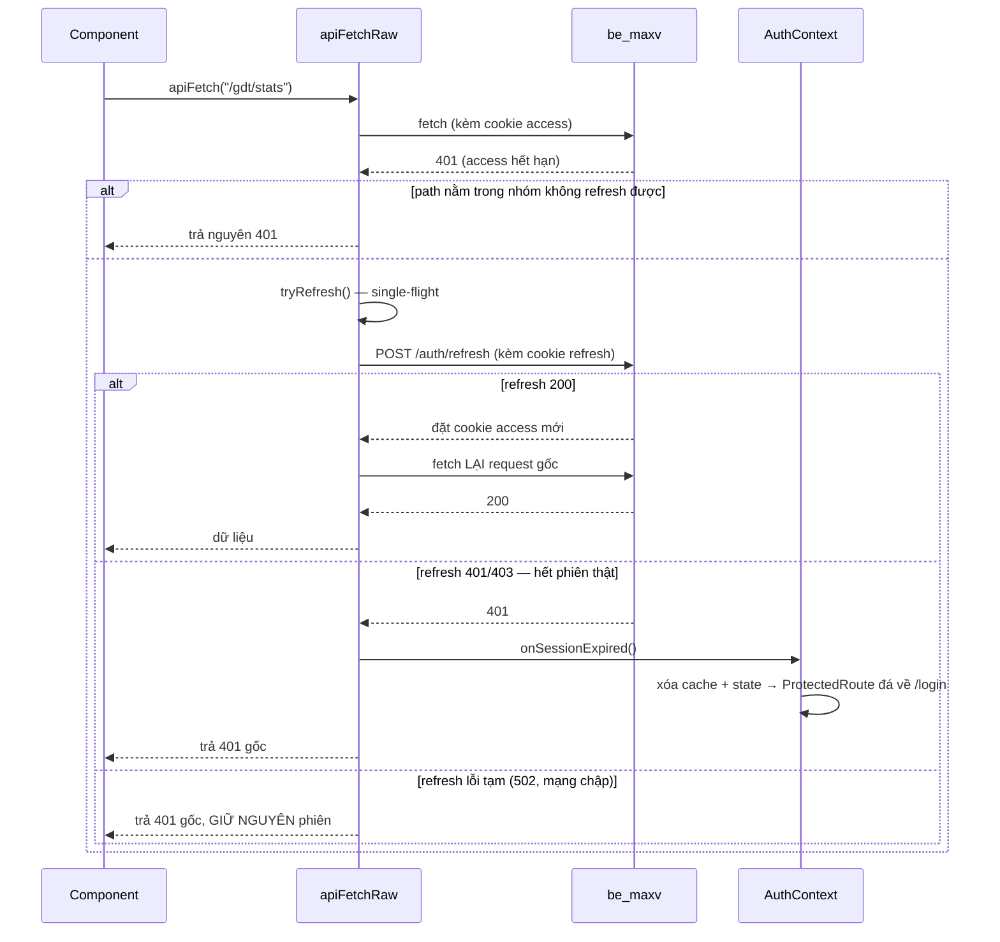

# 04 — Tầng giao tiếp API

Toàn bộ file: `src/lib/http.ts` (159 dòng). Mọi lời gọi tới `be_maxv` đều đi qua đây.

## 4.1. Bốn hàm xuất ra

| Hàm | Trả về | Dùng khi |
|---|---|---|
| `apiFetch<T>(path, options)` | `T` (JSON đã parse) | Endpoint trả JSON thô, không bọc envelope |
| `apiFetchData<T>(path, options, msg)` | `T` (đã bóc `data` khỏi envelope) | Endpoint trả `{success, data, message}` |
| `apiFetchBlob(path, options)` | `Blob` | Endpoint trả nhị phân (PDF) |
| `setSessionExpiredHandler(fn)` | — | `AuthContext` đăng ký callback khi hết phiên |

Cộng thêm lớp lỗi `ApiError`.

**Chọn `apiFetch` hay `apiFetchData`?** Phụ thuộc endpoint bên BE dùng helper nào:

- Route `auth` và `companies` dùng `sendOk`/`sendCreated` → trả envelope → dùng `apiFetchData`.
- Route `gdt/*` trả thẳng object → dùng `apiFetch`.

Không có cách đoán từ tên endpoint. Tra bảng ở [chương 14](14-hop-dong-api.md).

## 4.2. `ApiError` — vì sao cần status

```ts
export class ApiError extends Error {
  readonly status: number;

  constructor(message: string, status: number) {
    super(message);
    this.name = "ApiError";
    this.status = status;
  }
}
```

Comment đầu file giải thích lý do:

> Lỗi API kèm HTTP status — để caller phân biệt được loại lỗi (vd 409 email trùng → gắn lỗi vào đúng ô nhập thay vì Alert chung). Vẫn `extends Error` nên mọi chỗ đang bắt bằng `instanceof Error` / đọc `.message` không phải sửa.

Ví dụ dùng thật, trong `RegisterForm`:

```tsx
} catch (err) {
  // 409 = email đã tồn tại -> gắn vào đúng ô Email để người dùng biết sửa chỗ nào.
  if (err instanceof ApiError && err.status === 409) {
    setFieldErrors({ email: err.message });
  } else if (err instanceof ApiError && err.status === 400) {
    // Backend trả 400 kèm `errors` chi tiết nhưng KHÔNG có `message` (xem
    // errorHandler.plugin.ts) -> apiFetch chỉ có chuỗi "Yêu cầu thất bại (400)".
    // Xảy ra khi validate FE lỏng hơn zod (vd zod .email() chặt hơn regex ở đây).
    setError("Thông tin đăng ký không hợp lệ. Vui lòng kiểm tra lại email và số điện thoại.");
  } else {
    setError(getErrorMessage(err, "Đăng ký thất bại."));
  }
}
```

Nhánh 400 đáng chú ý: nó tồn tại vì **validate ở FE lỏng hơn zod ở BE**. Khi hai bên lệch, người dùng nhận thông báo vô nghĩa. Cách đúng là giữ hai bên khớp nhau (xem `validators/rules.ts`), nhánh này chỉ là lưới an toàn.

## 4.3. Cơ chế tự làm mới phiên khi gặp 401

Đây là phần tinh tế nhất của file. Đọc kỹ trước khi sửa.

### Sơ đồ vòng đời một request



### Code

```ts
async function apiFetchRaw(path: string, options: ApiFetchOptions = {}): Promise<Response> {
  const { headers, ...rest } = options;
  const init: RequestInit = {
    ...rest,
    credentials: "include",
    headers: {
      ...(rest.body ? { "Content-Type": "application/json" } : {}),
      ...headers,
    },
  };

  const res = await fetch(`${API_BASE}${path}`, init);
  if (res.status !== 401 || !canRefresh(path)) return res;

  let refreshed: boolean;
  try {
    refreshed = await tryRefresh();
  } catch {
    // Refresh lỗi tạm -> trả về đúng response 401 gốc, GIỮ NGUYÊN phiên để user thử lại.
    return res;
  }

  if (!refreshed) {
    onSessionExpired?.();
    return res;
  }
  return fetch(`${API_BASE}${path}`, init);
}
```

Bốn quyết định trong 25 dòng này:

**(1) `credentials: "include"` luôn bật.** Không có nó, cookie httpOnly không được gửi và mọi endpoint cần đăng nhập đều trả 401.

**(2) `Content-Type` chỉ đặt khi có body.** Đặt vô điều kiện sẽ khiến request GET có header thừa, và trong vài cấu hình CORS sẽ kích hoạt preflight không cần thiết.

**(3) Chỉ thử lại đúng một lần.** Không có vòng lặp. Nếu request thứ hai vẫn 401 thì trả về luôn — tránh vòng lặp vô hạn khi backend lỗi.

**(4) Thử lại an toàn kể cả với POST.** Comment giải thích:

> lặp lại request ĐÚNG 1 lần (an toàn kể cả POST vì 401 do `authenticate` chặn TRƯỚC khi handler chạy)

Nghĩa là khi nhận 401, handler nghiệp vụ **chưa** chạy, nên gọi lại không tạo bản ghi trùng. Nếu sau này BE có endpoint trả 401 *sau* khi đã ghi dữ liệu, giả định này vỡ và phải xử lý riêng.

### Chống "bão refresh"

Khi trang vừa tải, có thể có 4–5 query chạy song song và cùng nhận 401. Nếu mỗi request tự gọi `/auth/refresh` thì backend nhận 5 lời gọi refresh cùng lúc — với cơ chế xoay vòng refresh token, chỉ một cái thắng và bốn cái còn lại làm hỏng phiên.

Giải pháp là **single-flight**: giữ promise đang chạy và cho mọi request cùng chờ nó.

```ts
/**
 * Lời gọi /auth/refresh đang chạy (nếu có) — dùng chung cho mọi request cùng dính 401 một lúc,
 * để chỉ refresh MỘT lần thay vì mỗi request tự gọi (chống "refresh storm").
 */
let refreshPromise: Promise<boolean> | null = null;

function tryRefresh(): Promise<boolean> {
  if (!refreshPromise) {
    refreshPromise = fetch(`${API_BASE}/auth/refresh`, {
      method: "POST",
      credentials: "include",
    })
      .then((r) => {
        if (r.ok) return true;
        if (r.status === 401 || r.status === 403) return false;
        throw new Error(`Refresh lỗi tạm (${r.status})`);
      })
      .finally(() => {
        refreshPromise = null;
      });
  }
  return refreshPromise;
}
```

### Ba kết cục của `tryRefresh` — đừng gộp lại

Comment trong code nói rõ vì sao không được viết ngắn gọn thành `.then(r => r.ok)`:

```
 * - true  -> server đã đặt access cookie mới.
 * - false -> refresh cookie hết hạn/bị thu hồi (401/403) = hết phiên thật.
 * - ném lỗi -> sự cố TẠM THỜI (mạng chập, 502 lúc Node recycle sau IIS). KHÔNG phải hết
 *   phiên: nuốt thành false ở đây sẽ đá user về /login oan dù refresh cookie còn hạn.
 *
 * Lưu ý: fetch KHÔNG reject khi HTTP lỗi, nên `r.ok === false` gộp cả 401 lẫn 502 —
 * phải tự tách theo status, không được rút gọn thành `.then((r) => r.ok)`.
```

Đây là lỗi rất dễ mắc: `fetch` chỉ reject khi lỗi mạng, còn HTTP 500/502 vẫn resolve với `ok === false`. Gộp 502 vào nhóm "hết phiên" sẽ khiến người dùng bị đá ra màn hình đăng nhập mỗi lần backend khởi động lại.

### Nhóm path không refresh

```ts
/** Refresh không áp dụng cho chính các route auth này (tránh đệ quy / vô nghĩa). */
function canRefresh(path: string): boolean {
  return !(
    path.startsWith("/auth/refresh") ||
    path.startsWith("/auth/login") ||
    path.startsWith("/auth/logout")
  );
}
```

- `/auth/refresh` — nếu chính nó 401 mà lại gọi refresh thì đệ quy vô hạn.
- `/auth/login` — 401 ở đây nghĩa là **sai mật khẩu**, không phải hết phiên.
- `/auth/logout` — đang đăng xuất, làm mới phiên là vô nghĩa.

Chú ý `/auth/me` **không** nằm trong danh sách: nó cần được thử refresh, đó chính là cơ chế khôi phục phiên khi mở lại trình duyệt sau vài giờ.

## 4.4. Kết nối với `AuthContext`

`lib/http.ts` không được phép import `AuthContext` (vi phạm hướng phụ thuộc ở [chương 3](03-kien-truc-va-thu-muc.md#phụ-thuộc-giữa-các-tầng)). Giải pháp là **inversion of control** — `AuthContext` tự đăng ký callback:

```ts
// lib/http.ts
let onSessionExpired: (() => void) | null = null;
export function setSessionExpiredHandler(fn: (() => void) | null): void {
  onSessionExpired = fn;
}
```

```tsx
// features/auth/AuthContext.tsx
// apiFetch gọi handler này khi refresh cũng 401 (hết phiên hẳn) -> reset để ProtectedRoute về /login.
useEffect(() => {
  setSessionExpiredHandler(resetSession);
  return () => setSessionExpiredHandler(null);
}, [resetSession]);
```

Chuỗi sự kiện khi hết phiên hẳn:

```
apiFetchRaw thấy refresh trả 401
  → gọi onSessionExpired()
  → resetSession() xóa queryClient + đặt user = null
  → isAuthenticated thành false
  → ProtectedRoute render <Navigate to="/login" />
```

Không có `window.location.href` ở đâu cả — điều hướng đi qua React Router như bình thường.

## 4.5. Bóc envelope

Backend trả mọi response theo khuôn `{success, data, message}`. `apiFetchData` bóc lớp này:

```ts
/** Envelope chuẩn `{success, data, message}` mà be_maxv trả cho mọi response (sendOk/sendCreated). */
export interface ApiEnvelope<T> {
  success: boolean;
  data?: T;
  message?: string;
}

export async function apiFetchData<T>(
  path: string,
  options: ApiFetchOptions = {},
  fallbackMessage = "Yêu cầu thất bại",
): Promise<T> {
  const body = await apiFetch<ApiEnvelope<T>>(path, options);
  if (!body.data) throw new Error(body.message || fallbackMessage);
  return body.data;
}
```

Chú ý: hàm ném lỗi **kể cả khi HTTP 200** nếu thiếu `data`. Đó là chủ ý — một response 200 mà không có dữ liệu thì với người gọi cũng là thất bại.

> ⚠️ Hệ quả: endpoint nào trả `data` là số `0`, chuỗi rỗng hay mảng rỗng sẽ bị `!body.data` bắt nhầm thành lỗi. Hiện chưa có endpoint nào như vậy. Nếu bạn thêm, phải đổi điều kiện thành `body.data === undefined`.

## 4.6. Tải file nhị phân

```ts
export async function apiFetchBlob(path: string, options: ApiFetchOptions = {}): Promise<Blob> {
  const res = await apiFetchRaw(path, options);
  if (!res.ok) {
    const body = (await res.json().catch(() => ({}))) as ApiErrorBody;
    throw new ApiError(body.message || `Yêu cầu thất bại (${res.status})`, res.status);
  }
  return res.blob();
}
```

Đường thành công trả `Blob`; đường lỗi vẫn cố đọc JSON để lấy thông báo tiếng Việt của server. `.catch(() => ({}))` xử lý trường hợp server trả HTML lỗi thay vì JSON.

Chỉ một nơi dùng — render PDF, và nó tự đặt hạn thời gian:

```ts
export function renderInvoicePdf(html: string): Promise<Blob> {
  return apiFetchBlob("/gdt/render-pdf", {
    method: "POST",
    body: JSON.stringify({ html }),
    // Chặn 1 request treo làm kẹt cả lượt xuất (hàng trăm HĐ tuần tự) — 60s/hóa đơn là dư.
    signal: AbortSignal.timeout(60_000),
  });
}
```

Vì `apiFetchBlob` nhận nguyên `RequestInit`, bạn có thể truyền `signal` mà không phải sửa gì trong `lib/http.ts`.

## 4.7. Chuẩn hóa thông báo lỗi

`src/lib/errors.ts` chỉ có một hàm:

```ts
export function getErrorMessage(err: unknown, fallback: string): string {
  return err instanceof Error ? err.message : fallback;
}
```

Nhỏ nhưng dùng ở gần như mọi `catch` và `onError` trong dự án. Lý do tồn tại: TypeScript kiểu `catch (e)` là `unknown`, nên nếu không có hàm này thì mỗi chỗ bắt lỗi phải tự viết lại phép kiểm tra.

**Quy ước: luôn truyền `fallback` bằng tiếng Việt, mô tả đúng việc vừa thất bại.**

```ts
getErrorMessage(e, "Không tải được chi tiết hóa đơn.")   // tốt
getErrorMessage(e, "Lỗi")                                 // vô dụng với người dùng
```

## 4.8. Danh sách kiểm tra khi viết hàm gọi API mới

1. Đặt trong `features/<miền>/api/<tên>.ts`.
2. Chọn `apiFetch` hay `apiFetchData` theo việc endpoint có envelope không.
3. Viết JSDoc ghi rõ **method + path + ai gọi hàm này**. Toàn bộ dự án theo mẫu:
   ```ts
   /**
    * GET /gdt/stats — thống kê dữ liệu đã lưu của công ty (auth qua cookie httpOnly).
    */
   ```
4. Cần token GDT thì thêm header, **không** thêm vào query string:
   ```ts
   headers: { "X-Gdt-Token": gdtToken }
   ```
5. Không tự bắt lỗi trong hàm gọi API — để lỗi nổi lên cho `useQuery`/`useMutation` hoặc `catch` ở component xử lý.

---

**Trước:** [03 — Kiến trúc & thư mục](03-kien-truc-va-thu-muc.md) · **Tiếp theo:** [05 — Quản lý dữ liệu máy chủ](05-quan-ly-du-lieu-tanstack-query.md)
