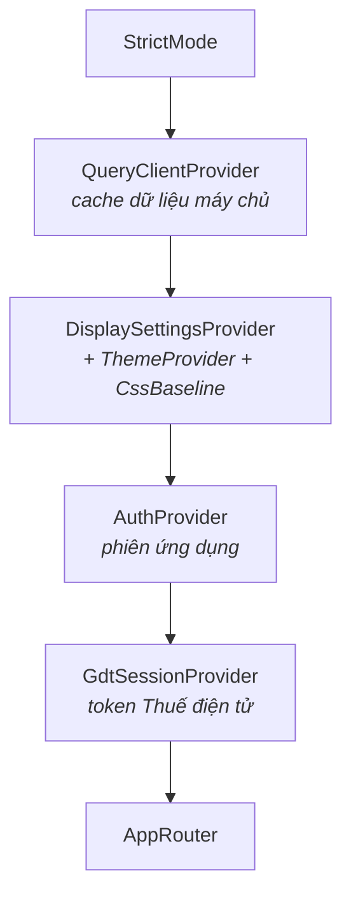

# 06 — Trạng thái toàn cục (Context)

Dự án có **ba** React Context. Không dùng Redux, Zustand hay thư viện state nào khác — dữ liệu máy chủ đã do TanStack Query lo, Context chỉ giữ những gì còn lại.

| Context | Giữ gì | Lưu ở đâu |
|---|---|---|
| `AuthContext` | Người dùng, danh sách công ty, công ty đang chọn | Không lưu — khôi phục từ cookie mỗi lần tải trang |
| `GdtSessionContext` | Token Thuế điện tử theo từng MST | `sessionStorage` |
| `DisplaySettingsContext` | Giao diện sáng/tối, màu, mật độ, cỡ chữ | `localStorage` |

Ba cách lưu khác nhau, mỗi cách có lý do riêng — mục 6.5 giải thích.

## 6.1. Cây provider



```tsx
// src/main.tsx
createRoot(document.getElementById("root")!).render(
  <StrictMode>
    <QueryClientProvider client={queryClient}>
      <DisplaySettingsProvider>
        <AuthProvider>
          <GdtSessionProvider>
            <AppRouter />
          </GdtSessionProvider>
        </AuthProvider>
      </DisplaySettingsProvider>
    </QueryClientProvider>
  </StrictMode>,
);
```

**Thứ tự lồng nhau không tùy tiện:**

- `QueryClientProvider` ngoài cùng vì `AuthProvider` gọi `queryClient.clear()` và `queryClient.fetchQuery()`.
- `DisplaySettingsProvider` bọc ngoài `AuthProvider` vì nó chứa `ThemeProvider` — màn hình đăng nhập cũng cần theme.
- `GdtSessionProvider` nằm trong `AuthProvider` vì hook `useActiveGdtToken` cần đọc `useAuth()` để biết MST công ty đang chọn.

Nếu bạn thêm provider mới, hãy đặt nó ở vị trí sao cho **mọi thứ nó cần đọc đều nằm phía trên**.

## 6.2. `AuthContext`

File: `features/auth/AuthContext.tsx` (128 dòng) + `context.ts` + `useAuth.ts`.

### Giá trị cung cấp

```ts
export interface AuthContextValue {
  user: AuthUser | null;
  /** Đã đăng nhập (có phiên hợp lệ) — thay cho việc đọc access token (giờ ở cookie httpOnly). */
  isAuthenticated: boolean;
  /** Đang kiểm tra phiên (GET /auth/me) lúc tải trang — chưa biết đăng nhập hay chưa. */
  hydrating: boolean;
  /** Công ty/MST user được phép thao tác — nạp lúc login/me, làm mới qua `refreshCompanies()`. */
  companies: AuthCompany[];
  /** Công ty đang active (nhúng trong cookie access token lúc login/switch). */
  currentCompanyId: string | null;
  login: (email: string, password: string) => Promise<void>;
  logout: () => Promise<void>;
  refreshCompanies: () => Promise<void>;
  switchCompany: (id: string) => Promise<void>;
  setActiveCompany: (id: string | null) => void;
}
```

### `hydrating` — cờ chống nháy màn hình

Đây là chi tiết dễ bỏ sót nhưng ảnh hưởng trực tiếp tới trải nghiệm.

Khi mở trang, ứng dụng **chưa biết** người dùng đã đăng nhập hay chưa — thông tin đó nằm trong cookie httpOnly mà JavaScript không đọc được. Cách duy nhất là hỏi server: `GET /auth/me`.

Trong khoảng vài trăm mili-giây chờ trả lời, `user` vẫn là `null`. Nếu `ProtectedRoute` chỉ kiểm tra `isAuthenticated` thì người dùng đã đăng nhập vẫn bị đá về `/login`, rồi vài trăm mili-giây sau lại bị đẩy ngược về trang chính — màn hình nháy.

`hydrating` giải quyết bằng cách thêm trạng thái thứ ba: "chưa biết".

```tsx
const [hydrating, setHydrating] = useState(true);

// Bootstrap phiên từ cookie khi tải trang: 200 -> khôi phục; lỗi/401 -> coi như chưa đăng nhập.
useEffect(() => {
  let alive = true;
  getMe()
    .then((data) => {
      if (!alive) return;
      setUser(data.user);
      setCompanies(data.companies);
      setCurrentCompanyId(data.activeDonViId);
    })
    .catch(() => {
      /* chưa đăng nhập — giữ state rỗng */
    })
    .finally(() => {
      if (alive) setHydrating(false);
    });
  return () => { alive = false; };
}, []);
```

Cờ `alive` chặn cảnh báo "setState trên component đã unmount" khi người dùng rời trang trong lúc request đang bay.

Cả hai route guard đều đọc `hydrating` **trước** `isAuthenticated`:

```tsx
// ProtectedRoute
if (hydrating) return <FullScreenLoader />;
if (!isAuthenticated) return <Navigate to="/login" replace />;
return <>{children}</>;
```

### `login` và `logout`

```tsx
const login = useCallback(async (email: string, password: string) => {
  const data = await loginApi(email, password); // server đặt cookie access + refresh
  queryClient.clear(); // xóa cache của phiên trước (nếu có)
  setUser(data.user);
  setCompanies(data.companies);
  setCurrentCompanyId(data.activeDonViId);
}, []);

const logout = useCallback(async () => {
  await logoutApi().catch(() => {}); // server xóa cookie
  resetSession();
}, [resetSession]);
```

`logout` **nuốt lỗi** của lời gọi API. Chủ ý: nếu mạng hỏng, người dùng vẫn phải đăng xuất được ở phía client. Cookie sẽ hết hạn theo thời gian, còn trải nghiệm "bấm đăng xuất mà không có gì xảy ra" thì không chấp nhận được.

### Đổi công ty

```tsx
const switchCompany = useCallback(async (id: string) => {
  const data = await switchCompanyApi(id); // server đặt cookie access mới nhúng donViId mới
  setCurrentCompanyId(data.activeDonViId);
}, []);

// POST /companies với activate=true đã kèm cookie mới trong response — chỉ cần đồng bộ state,
// không gọi API như `switchCompany`, nên dùng thẳng setter (identity đã ổn định sẵn).
const setActiveCompany = setCurrentCompanyId;
```

Hai hàm cho hai tình huống:

- `switchCompany(id)` — **gọi API** để server cấp cookie mới. Dùng khi người dùng chủ động chọn công ty khác.
- `setActiveCompany(id)` — **không gọi API**, chỉ đồng bộ state. Dùng khi server đã cấp cookie mới trong cùng response của một thao tác khác (tạo công ty đầu tiên, xóa công ty đang dùng).

Nhầm hai hàm này gây ra một trong hai lỗi: gọi thừa một request, hoặc `currentCompanyId` lệch với `donViId` trong cookie → mọi endpoint tenant trả 403.

Trường hợp xóa công ty minh họa rõ vì sao `setActiveCompany` bắt buộc phải có:

```ts
/**
 * `activeDonViId` trong response là công ty đang làm việc SAU khi xóa: nếu vừa xóa đúng công ty
 * đang dùng thì server đã đặt cookie access mới, ở đây chỉ đồng bộ state cho khớp. Thiếu bước này
 * thì `currentCompanyId` còn trỏ công ty đã biến mất và mọi endpoint theo tenant trả 403 — mà 403
 * thì `apiFetch` không refresh cũng không đăng xuất, user kẹt tới khi access token hết hạn.
 */
```

Câu cuối là điểm mấu chốt: **403 không nằm trong cơ chế tự phục hồi của `apiFetch`** (chỉ 401 mới kích hoạt refresh). Nên một `currentCompanyId` sai sẽ khiến người dùng kẹt hoàn toàn cho tới khi access token hết hạn tự nhiên.

### Hook đọc context

```ts
export function useAuth() {
  const ctx = useContext(AuthContext);
  if (!ctx) throw new Error("useAuth phải dùng bên trong AuthProvider");
  return ctx;
}
```

Ném lỗi thay vì trả `null` — biến một lỗi runtime mơ hồ ("không đọc được thuộc tính của null" ở đâu đó sâu trong cây component) thành thông báo chỉ đúng nguyên nhân. Cả ba context đều theo mẫu này.

## 6.3. `GdtSessionContext`

File: `features/hddt/gdtSession/GdtSessionProvider.tsx`.

### Cấu trúc dữ liệu: map theo MST

```tsx
// Token GDT sống ngắn (~5p ở backend) nên chỉ cần tồn tại trong tab hiện tại.
const GDT_TOKENS_KEY = "hddt_gdt_tokens";

function loadGdtTokens(): Record<string, string> {
  try {
    return JSON.parse(sessionStorage.getItem(GDT_TOKENS_KEY) ?? "{}");
  } catch {
    return {};
  }
}
```

Kiểu dữ liệu là `Record<mst, token>` — **không phải một token duy nhất**. Đây là quyết định thiết kế quan trọng nhất của module này, và comment nói rõ vì sao:

> Token dùng khi fetch/đồng bộ luôn chọn theo MST CÔNG TY ĐANG CHỌN (xem `useActiveGdtToken`), KHÔNG lưu "MST GDT hiện tại" ở đây — coupling đó từng gây rò rỉ dữ liệu giữa các tenant.

Nghĩa là: từng có phiên bản lưu thêm biến `currentGdtMst` ("MST vừa đăng nhập GDT gần nhất"). Biến đó **tách rời** khỏi công ty mà ứng dụng đang chọn, và khi hai thứ lệch nhau, hóa đơn của MST này bị ghi vào database của MST kia. Xem [chương 7](07-da-cong-ty-va-cach-ly-tenant.md).

### Bốn thao tác

```tsx
/** Lấy token GDT của 1 MST (undefined nếu chưa đăng nhập). */
const getGdtToken = useCallback((mst: string) => gdtTokens[mst], [gdtTokens]);

/** Lưu token GDT cho 1 MST. */
const setGdtToken = useCallback((mst: string, token: string) => {
  setGdtTokens((prev) => ({ ...prev, [mst]: token }));
}, []);

/** Bỏ token của ĐÚNG 1 MST — dùng khi công ty đó bị xóa vĩnh viễn. */
const removeGdtToken = useCallback((mst: string) => {
  setGdtTokens((prev) => {
    if (!(mst in prev)) return prev; // giữ nguyên identity -> khỏi ghi lại sessionStorage vô ích
    const rest = { ...prev };
    delete rest[mst];
    return rest;
  });
}, []);

/** Xóa toàn bộ phiên GDT (khi đăng xuất app). */
const clearGdtSession = useCallback(() => {
  setGdtTokens({});
}, []);
```

`removeGdtToken` trả về `prev` nguyên vẹn khi không có gì để xóa. Vì effect ghi `sessionStorage` phụ thuộc vào `gdtTokens`, giữ nguyên tham chiếu nghĩa là effect không chạy lại.

Lý do `removeGdtToken` tồn tại được ghi trong JSDoc:

> token của MST đã biến mất mà nằm lại sessionStorage thì vô dụng, và sẽ khớp nhầm nếu sau này MST đó được đăng ký lại (xóa cứng cho phép điều đó) trong khi tab chưa đóng.

### Ghi `sessionStorage` qua effect, không ghi trong updater

```tsx
// Đồng bộ sessionStorage qua effect (thay vì side effect ngay trong updater của
// setState, vốn có thể chạy 2 lần dưới StrictMode/concurrent rendering).
useEffect(() => {
  sessionStorage.setItem(GDT_TOKENS_KEY, JSON.stringify(gdtTokens));
}, [gdtTokens]);
```

React 19 dưới `StrictMode` gọi hàm updater của `setState` hai lần để phát hiện tác dụng phụ. Ghi `sessionStorage` bên trong updater sẽ chạy hai lần — ở đây thì vô hại, nhưng là thói quen xấu và sẽ gây lỗi thật với các tác dụng phụ khác. Quy tắc: **updater phải thuần khiết, tác dụng phụ đặt trong effect**.

## 6.4. `DisplaySettingsContext`

File: `theme/DisplaySettingsProvider.tsx` + `theme/displaySettings.ts`.

Context này khác hai cái trên ở chỗ nó **vừa giữ state vừa dựng MUI theme**:

```tsx
export function DisplaySettingsProvider({ children }: { children: ReactNode }) {
  const [settings, setSettings] = useState<DisplaySettings>(loadDisplaySettings);

  useEffect(() => {
    saveDisplaySettings(settings);
  }, [settings]);

  const prefersDark = useMediaQuery("(prefers-color-scheme: dark)", { noSsr: true });
  const theme = useMemo(() => buildTheme(settings, prefersDark), [settings, prefersDark]);

  const update = useCallback(
    (patch: Partial<DisplaySettings>) => setSettings((s) => ({ ...s, ...patch })),
    [],
  );
  const value = useMemo(() => ({ settings, update }), [settings, update]);

  return (
    <DisplaySettingsContext.Provider value={value}>
      <ThemeProvider theme={theme}>
        <CssBaseline />
        {children}
      </ThemeProvider>
    </DisplaySettingsContext.Provider>
  );
}
```

`useMediaQuery("(prefers-color-scheme: dark)")` cho phép chế độ "Theo hệ thống" phản ứng ngay khi người dùng đổi cài đặt hệ điều hành, không cần tải lại trang.

### `buildTheme` — bốn cài đặt ánh xạ vào theme

```ts
export function buildTheme(settings: DisplaySettings, prefersDark: boolean): Theme {
  const mode = settings.mode === "system" ? (prefersDark ? "dark" : "light") : settings.mode;
  const accent =
    ACCENT_COLORS.find((c) => c.key === settings.accent)?.value ?? ACCENT_COLORS[0].value;
  const cellPad = DENSITY_PAD[settings.density];

  return createTheme({
    palette: { mode, primary: { main: accent } },
    typography: {
      fontFamily: 'system-ui, -apple-system, "Segoe UI", Roboto, Helvetica, Arial, sans-serif',
      fontSize: FONT_BASE[settings.fontSize],
    },
    components: {
      // Mật độ hiển thị bảng — áp cho cả cell thường lẫn size="small" (bảng hóa đơn dùng small).
      MuiTableCell: {
        styleOverrides: { root: { padding: cellPad }, sizeSmall: { padding: cellPad } },
      },
    },
  });
}
```

Chú ý phải ghi đè **cả** `root` lẫn `sizeSmall`. Bảng hóa đơn dùng `<Table size="small">`, mà `sizeSmall` có độ ưu tiên cao hơn `root` — chỉ ghi đè `root` thì cài đặt mật độ không có tác dụng ở đúng nơi cần nó nhất.

Lưu ý `settings.accent` lưu **key** (`"blue"`) chứ không lưu mã màu (`"#0067e8"`). Nhờ vậy đổi bảng màu sau này không làm hỏng cài đặt đã lưu của người dùng, và có sẵn giá trị dự phòng nếu key không còn tồn tại.

### Đọc `localStorage` an toàn

```ts
export function loadDisplaySettings(): DisplaySettings {
  try {
    const raw = localStorage.getItem(STORAGE_KEY);
    if (!raw) return DEFAULT_DISPLAY_SETTINGS;
    return { ...DEFAULT_DISPLAY_SETTINGS, ...(JSON.parse(raw) as Partial<DisplaySettings>) };
  } catch {
    return DEFAULT_DISPLAY_SETTINGS;
  }
}
```

Trải mặc định lên trước dữ liệu đã lưu. Nghĩa là khi bạn **thêm một cài đặt mới** vào `DisplaySettings`, người dùng cũ (có JSON lưu từ trước, thiếu trường mới) vẫn nhận giá trị mặc định thay vì `undefined`.

## 6.5. Ba nơi lưu — vì sao khác nhau

| Dữ liệu | Nơi lưu | Lý do |
|---|---|---|
| Token phiên ứng dụng | **Cookie httpOnly** | JS không đọc được → mã độc XSS không lấy được token. Trình duyệt tự gửi kèm mỗi request |
| Người dùng + công ty | **Không lưu** | Khôi phục bằng `GET /auth/me` mỗi lần tải trang. Không có bản sao cục bộ nào để lệch với server |
| Token GDT | **`sessionStorage`** | Sống rất ngắn nên không đáng lưu lâu. `sessionStorage` mất khi đóng tab — đúng với vòng đời của nó |
| Cài đặt hiển thị | **`localStorage`** | Không nhạy cảm, và người dùng mong nó còn nguyên ở lần mở sau |

Nguyên tắc rút ra: **không bao giờ lưu thông tin nhận dạng người dùng vào `localStorage`.** Ứng dụng này cố tình không persist `user` và `companies` — nạp lại vài trăm mili-giây khi mở trang là cái giá rẻ để đổi lấy việc không có bản sao dữ liệu nào có thể lệch hoặc bị đánh cắp.

---

**Trước:** [05 — Quản lý dữ liệu máy chủ](05-quan-ly-du-lieu-tanstack-query.md) · **Tiếp theo:** [07 — Đa công ty & cách ly tenant](07-da-cong-ty-va-cach-ly-tenant.md)
