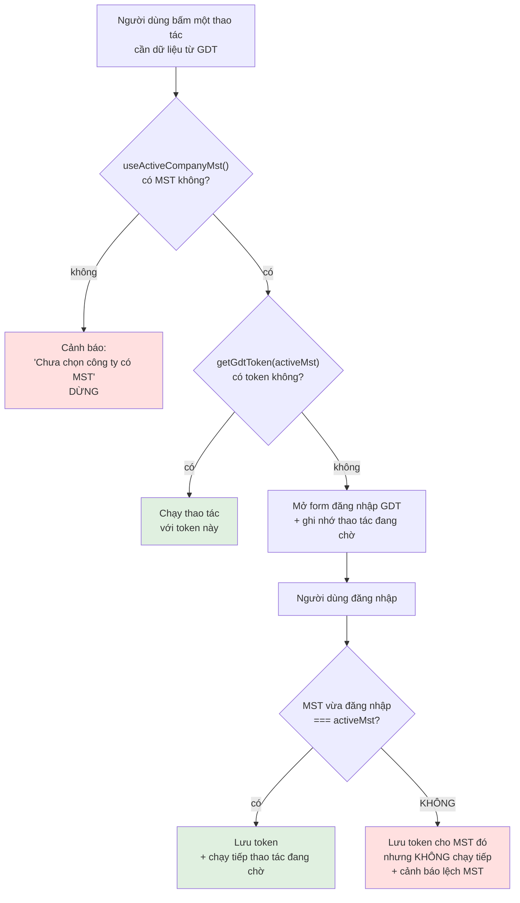

# 07 — Đa công ty & cách ly tenant

> ⚠️ **Chương bắt buộc đọc trước khi sửa bất cứ code nào chạm tới dữ liệu hóa đơn.**
>
> Lỗi ở đây không làm ứng dụng crash. Nó làm hóa đơn của công ty này bị ghi vào cơ sở dữ liệu của công ty khác — sai lệch sổ sách kế toán mà không ai phát hiện cho tới khi quyết toán thuế.

## 7.1. Vấn đề

Ba sự thật độc lập nhau tạo nên vấn đề:

1. **Ứng dụng có một "công ty đang chọn"** — `currentCompanyId` trong `AuthContext`. Nó quyết định backend ghi vào database nào (qua `donViId` nhúng trong JWT).
2. **Phiên GDT được lưu theo MST** — một tab có thể đang giữ token của nhiều MST cùng lúc.
3. **Người dùng đăng nhập GDT bằng cách gõ MST vào ô "Tên đăng nhập"** — họ hoàn toàn có thể gõ MST khác với công ty đang chọn.

Khi ba thứ này lệch nhau:

```
Công ty đang chọn:  Công ty A (MST 0101010101)  → backend ghi vào DB của A
Token GDT đang dùng: MST 0202020202 (công ty B) → GDT trả hóa đơn của B
Kết quả:             hóa đơn của B nằm trong DB của A
```

Không có thông báo lỗi. Dữ liệu vẫn lưu thành công. Chỉ là **sai công ty**.

## 7.2. Nguyên tắc nền tảng

> **Token GDT luôn được chọn theo MST của công ty đang chọn. Không có ngoại lệ.**

Nguyên tắc này được thực thi bằng **một điểm chọn token duy nhất** trong toàn bộ mã nguồn.

### Bước 1 — MST của công ty đang chọn

```ts
// src/features/auth/useActiveCompanyMst.ts
/**
 * MST của công ty đang chọn (đã trim) — nguồn chuẩn DUY NHẤT để chọn token GDT khi fetch/đồng bộ.
 *
 * QUAN TRỌNG: KHÔNG dùng `currentGdtMst` (MST đăng nhập GDT gần nhất) để quyết định fetch — nó
 * tách rời khỏi công ty app đang chọn. Nếu lệch, hóa đơn của MST khác sẽ bị ghi vào DB tenant hiện
 * tại (bug rò rỉ dữ liệu giữa các MST). Luôn lấy token theo MST công ty đang chọn: `getGdtToken(mst)`.
 *
 * `undefined` nếu chưa chọn công ty hoặc công ty chưa có MST.
 */
export function useActiveCompanyMst(): string | undefined {
  const { companies, currentCompanyId } = useAuth();
  return useMemo(
    () =>
      companies.find((c) => c.id === currentCompanyId)?.maSoThue?.trim() || undefined,
    [companies, currentCompanyId],
  );
}
```

### Bước 2 — Token của đúng MST đó

```ts
// src/features/hddt/gdtSession/useActiveGdtToken.ts
/**
 * Token GDT của ĐÚNG công ty đang chọn (theo MST) — ĐIỂM CHỌN TOKEN DUY NHẤT.
 *
 * Gom `getGdtToken(activeMst)` về một chỗ để không nơi nào tự ghép rồi lỡ dùng nhầm MST khác
 * (bug rò rỉ dữ liệu giữa tenant: fetch data MST này nhưng ghi vào DB tenant kia). Mọi luồng
 * fetch/đồng bộ phải lấy token qua hook này, KHÔNG dùng `currentGdtMst`.
 */
export function useActiveGdtToken(): { activeMst?: string; token?: string } {
  const activeMst = useActiveCompanyMst();
  const { getGdtToken } = useGdtSession();
  return useMemo(
    () => ({ activeMst, token: activeMst ? getGdtToken(activeMst) : undefined }),
    [activeMst, getGdtToken],
  );
}
```

### Sơ đồ quyết định chọn token



## 7.3. Cổng kiểm tra `requireGdtToken`

Toàn bộ nhánh trái của sơ đồ được gói trong một hàm, dùng chung cho mọi thao tác cần token:

```tsx
// src/features/hddt/components/InvoiceListTabs.tsx
/**
 * Token GDT của ĐÚNG công ty đang chọn (theo MST), KHÔNG mượn phiên MST khác — tránh fetch data
 * MST này rồi ghi vào DB tenant kia. Chưa đăng nhập GDT cho MST đó -> MỞ LUÔN form đăng nhập
 * (đỡ bắt người dùng tự đi tìm nút "Đăng nhập Thuế điện tử") và hẹn chạy lại `retry` sau khi
 * đăng nhập xong. Chưa chọn công ty có MST thì không có gì để đăng nhập -> chỉ cảnh báo.
 */
const requireGdtToken = (retry?: (gdtToken: string) => void): string | undefined => {
  if (activeGdtToken) return activeGdtToken;
  if (!activeMst) {
    toast.warning("Chưa chọn công ty có MST để đăng nhập Thuế điện tử.");
    return undefined;
  }
  pendingActionRef.current = retry ?? null;
  setLoginOpen(true);
  return undefined;
};
```

Cách dùng — nhất quán ở mọi nơi:

```tsx
const handleDownloadDetails = () => {
  const gdtToken = requireGdtToken((token) =>
    void pollDetailRun(token, buildQuery(appliedFilters), runIdRef.current),
  );
  if (!gdtToken) return;
  void pollDetailRun(gdtToken, buildQuery(appliedFilters), runIdRef.current);
};
```

Mẫu này thoạt nhìn có vẻ lặp — hàm `pollDetailRun` xuất hiện hai lần. Đó là chủ ý:

- **Có token sẵn** → `requireGdtToken` trả token, chạy ngay ở dòng cuối.
- **Chưa có token** → trả `undefined`, hàm thoát; callback `retry` đã được cất vào `pendingActionRef` và sẽ chạy sau khi đăng nhập xong.

Nhờ vậy người dùng bấm nút **một lần**, đăng nhập, rồi thao tác tự tiếp tục — thay vì phải bấm lại lần hai.

### Vì sao `retry` nhận token qua tham số

```tsx
/**
 * Việc đang chờ token: chạy lại NGAY sau khi đăng nhập xong để người dùng khỏi phải bấm nút lần
 * hai. Nhận token qua tham số (không đọc `activeGdtToken`) vì state chưa kịp cập nhật lúc đó.
 */
const pendingActionRef = useRef<((gdtToken: string) => void) | null>(null);
```

Khi form đăng nhập gọi `onLoginSuccess(token, mst)`, code gọi `setGdtToken(mst, token)` — nhưng đó là `setState`, giá trị mới **chưa** có trong biến `activeGdtToken` của lần render hiện tại. Nếu callback đọc `activeGdtToken` thì nó vẫn thấy `undefined` và thao tác không chạy. Truyền token qua tham số là cách duy nhất đúng ở đây.

## 7.4. Chốt chặn lệch MST

Đây là lớp phòng thủ cuối cùng, và là lớp quan trọng nhất:

```tsx
/** Đăng nhập xong: lưu token theo MST rồi chạy tiếp việc đang chờ. */
const handleLoginSuccess = (gdtToken: string, mst: string) => {
  setGdtToken(mst, gdtToken);
  const pending = pendingActionRef.current;
  pendingActionRef.current = null;
  // Đăng nhập bằng MST KHÁC công ty đang chọn -> không chạy tiếp (sẽ ghi data sang nhầm tenant).
  if (mst !== activeMst) {
    toast.warning(
      `Đã đăng nhập MST ${mst}, khác công ty đang chọn (${activeMst}) — không chạy tiếp thao tác.`,
    );
    return;
  }
  pending?.(gdtToken);
};
```

Chú ý thứ tự: token **vẫn được lưu** cho MST đó (người dùng có thể đã cố ý đăng nhập trước để dùng sau), nhưng thao tác đang chờ **không** chạy.

Dialog Đồng bộ có chốt chặn tương đương, chỉ khác cách hiển thị:

```tsx
/** Đăng nhập GDT xong (từ form mở bởi nút Đồng bộ): lưu token theo MST rồi đồng bộ luôn. */
const handleLoginSuccess = (gdtToken: string, mst: string) => {
  setGdtToken(mst, gdtToken);
  // Đăng nhập MST khác công ty đang chọn -> KHÔNG đồng bộ (sẽ ghi data sang nhầm tenant).
  if (mst !== activeMst) {
    setError(
      `Đã đăng nhập MST ${mst}, khác công ty đang chọn (${activeMst}) — chưa đồng bộ. ` +
        "Hãy đăng nhập đúng MST của công ty đang chọn.",
    );
    return;
  }
  runSyncWithToken(gdtToken);
};
```

> **Nếu bạn thêm một luồng mới cần token GDT, bạn PHẢI thêm chốt chặn này.** Không có cơ chế nào tự động áp dụng nó.

## 7.5. Đổi công ty giữa chừng

Vấn đề thứ hai: người dùng khởi động một tác vụ dài (đồng bộ, tải chi tiết) rồi **đổi sang công ty khác** trong lúc nó đang chạy.

Lúc này mọi thứ đều sai:

- ID hóa đơn đang xử lý thuộc về công ty cũ.
- Endpoint hỏi tiến độ trả về tiến độ của **công ty mới** (backend lấy theo phiên).
- Nếu vẫn tiếp tục `invalidateQueries`, ta làm mới dữ liệu công ty mới bằng tiến độ của công ty cũ.

### Cơ chế: bộ đếm lượt

```tsx
// Mỗi lần đổi bộ lọc/công ty tăng 1; vòng poll so khớp để tự dừng (chống chồng chéo lượt cũ).
const runIdRef = useRef(0);

// Đổi công ty giữa chừng -> hủy tiến trình đang chạy (id hóa đơn thuộc tenant cũ, sai ở tenant mới).
// Chỉ bump ref ở đây (không setState trong effect); nhánh hủy trong vòng lặp sẽ reset state.
useEffect(() => {
  runIdRef.current += 1;
}, [currentCompanyId]);
```

Mỗi lượt chạy **chụp lại** giá trị bộ đếm lúc bắt đầu, rồi so lại ở mỗi nhịp:

```tsx
const pollDetailRun = async (gdtToken: string, query: InvoiceQuery, startRun: number) => {
  setDetailRunning(true);
  const toastId = toast.loading("Đang tải chi tiết hóa đơn…");
  try {
    let status = await startDetailRun(direction, gdtToken, query);
    let lastDone = -1;
    for (;;) {
      if (runIdRef.current !== startRun) {
        toast.dismiss(toastId);
        return; // đổi bộ lọc/công ty -> ngừng poll (BE vẫn chạy nền)
      }
      /* … cập nhật toast, invalidate … */
      if (!status.active) break;
      await sleep(POLL_INTERVAL_MS);
      status = await getDetailRunStatus(direction);
    }
    /* … */
  }
};
```

Vì sao dùng `useRef` chứ không `useState`: giá trị phải đọc được **bên trong một vòng lặp bất đồng bộ đang chạy**. Biến state bị đóng băng trong closure của lần render tạo ra nó, còn `ref.current` luôn đọc ra giá trị mới nhất.

Dialog Đồng bộ dùng biến thể của cùng ý tưởng — so sánh trực tiếp ID công ty:

```tsx
// Ref theo dõi công ty hiện tại LIVE (cập nhật cả khi dialog đóng vì component vẫn mounted) — để
// vòng poll tải chi tiết chạy nền biết người dùng đã đổi công ty giữa chừng thì dừng, tránh lẫn tenant.
const companyIdRef = useRef(currentCompanyId);
useEffect(() => {
  companyIdRef.current = currentCompanyId;
}, [currentCompanyId]);

// … trong pollRun:
const startedCompanyId = currentCompanyId;
const isStale = () => companyIdRef.current !== startedCompanyId;
```

Hàm `isStale` được truyền xuống các hàm poll dùng chung như một tham số:

```ts
export async function pollUpdateRunToast(
  direction: InvoiceDirection,
  initial: UpdateRunStatus,
  opts: { isStale: () => boolean; onProgress: () => void; onFinish: () => void },
): Promise<void>
```

Nhờ vậy logic poll nằm ở tầng `api/` (không biết gì về React) vẫn hỏi được "người dùng đã đổi công ty chưa?".

### Dọn state giao diện khi đổi công ty

Ngoài việc dừng tiến trình, giao diện cũng phải quên đi lựa chọn cũ:

```tsx
// Đổi công ty -> bỏ hóa đơn đang chọn (id thuộc tenant cũ) và đóng dialog. Điều chỉnh state NGAY
// trong render theo mẫu "lưu giá trị trước" của React (tránh setState trong effect gây render dây
// chuyền — cùng lý do effect ở trên chỉ bump ref chứ không setState).
const prevCompanyRef = useRef(currentCompanyId);
if (prevCompanyRef.current !== currentCompanyId) {
  prevCompanyRef.current = currentCompanyId;
  if (selectedId !== null) setSelectedId(null);
  if (viewOpen) setViewOpen(false);
}
```

Đây là mẫu chính thức của React cho tình huống "điều chỉnh state khi prop thay đổi" — gọi `setState` **ngay trong thân render** (React sẽ render lại lập tức trước khi vẽ ra màn hình) thay vì trong `useEffect` (gây thêm một lượt vẽ trung gian với dữ liệu sai). Điều kiện `if (selectedId !== null)` tránh gọi `setState` vô ích.

Nếu không có đoạn này: người dùng chọn hóa đơn ở công ty A, đổi sang công ty B — ô tick vẫn còn, bấm "Xem hóa đơn" sẽ gọi API với ID không tồn tại ở B.

## 7.6. Dọn token khi xóa công ty

```ts
export function useDeleteCompanyMutation() {
  const { setActiveCompany } = useAuth();
  const { removeGdtToken } = useGdtSession();
  const invalidate = useInvalidateCompanies();

  return useMutation({
    mutationFn: (vars: { id: string; maSoThue: string }) =>
      deleteCompany(vars.id, vars.maSoThue),
    onSuccess: async (data, vars) => {
      setActiveCompany(data.activeDonViId);
      removeGdtToken(vars.maSoThue);
      await invalidate();
    },
  });
}
```

Ba việc phải làm đúng thứ tự:

1. `setActiveCompany` — đồng bộ công ty đang chọn với cookie mới server vừa cấp.
2. `removeGdtToken` — bỏ token của MST vừa bị xóa.
3. `invalidate` — nạp lại danh sách công ty.

Bước 2 chống một kịch bản hiếm nhưng có thật: MST bị xóa cứng, rồi ai đó đăng ký lại chính MST đó trong khi tab của bạn chưa đóng. Token cũ (đã vô hiệu ở phía GDT) sẽ khớp với MST mới và gây lỗi khó hiểu.

## 7.7. Cách ly ở tầng cache

`queryKey` gắn `currentCompanyId` là lớp cách ly thứ ba, độc lập với hai lớp trên. Xem chi tiết ở [chương 5, mục 5.2](05-quan-ly-du-lieu-tanstack-query.md#52-quy-ước-querykey--phần-quan-trọng-nhất).

Tóm tắt: cùng một URL endpoint phục vụ mọi công ty (backend chọn database theo JWT), nên nếu key không gắn công ty thì cache trả nhầm dữ liệu.

## 7.8. Tổng kết bốn lớp phòng thủ

| Lớp | Chống gì | Thực thi ở |
|---|---|---|
| 1. Điểm chọn token duy nhất | Dùng token của MST khác | `useActiveGdtToken` |
| 2. Chốt chặn lệch MST | Đăng nhập nhầm MST rồi chạy tiếp | `handleLoginSuccess` ở mỗi luồng |
| 3. Bộ đếm lượt / `isStale` | Đổi công ty giữa chừng tác vụ dài | `runIdRef`, `companyIdRef` |
| 4. `queryKey` gắn companyId | Cache trả nhầm dữ liệu | Mọi `*Keys` |

**Bốn lớp này độc lập.** Bỏ một lớp không làm ba lớp kia bù đắp được.

## 7.9. Những lỗi kinh điển — đừng viết code như thế này

### ❌ Tự ghép token

```tsx
// SAI — mượn token của MST bất kỳ đang có trong session
const { getGdtToken } = useGdtSession();
const token = getGdtToken(someMst);
```

```tsx
// ĐÚNG
const { activeMst, token } = useActiveGdtToken();
```

### ❌ Quên companyId trong queryKey

```tsx
// SAI — công ty A và B dùng chung entry cache
useQuery({ queryKey: ["invoices", direction], queryFn: … });
```

```tsx
// ĐÚNG
useQuery({ queryKey: invoiceKeys.saved(currentCompanyId, direction, query), queryFn: … });
```

### ❌ Vòng lặp bất đồng bộ không kiểm tra `isStale`

```tsx
// SAI — chạy tiếp dù người dùng đã đổi công ty
for (;;) {
  const st = await getStatus();
  invalidate();
  if (!st.active) break;
  await sleep(2000);
}
```

```tsx
// ĐÚNG
for (;;) {
  if (runIdRef.current !== startRun) return;
  const st = await getStatus();
  invalidate();
  if (!st.active) break;
  await sleep(2000);
}
```

### ❌ Đọc state trong callback sau đăng nhập

```tsx
// SAI — activeGdtToken chưa cập nhật tại thời điểm này
const handleLoginSuccess = () => {
  runFetch(activeGdtToken);
};
```

```tsx
// ĐÚNG — nhận token qua tham số
const handleLoginSuccess = (gdtToken: string, mst: string) => {
  if (mst !== activeMst) { /* cảnh báo, dừng */ return; }
  runFetch(gdtToken);
};
```

---

**Trước:** [06 — Trạng thái toàn cục](06-context-toan-cuc.md) · **Tiếp theo:** [08 — Tác vụ nền & theo dõi tiến độ](08-tac-vu-nen-va-poll.md)
