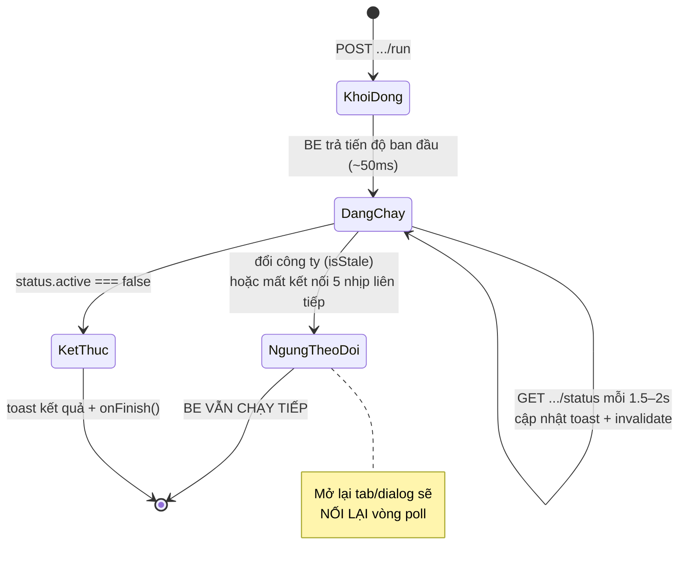

# 08 — Tác vụ nền & theo dõi tiến độ

## 8.1. Vì sao không gọi API kiểu thông thường

Một lượt đồng bộ hóa đơn có thể kéo dài **hàng chục phút**: quét nhiều trang từ GDT, mỗi trang phải chờ, gặp giới hạn tần suất thì phải lùi lại và thử lại.

Cách làm thông thường — gửi một request rồi chờ response — hỏng ở đây vì:

1. **Proxy cắt kết nối.** IIS hoặc bất kỳ reverse proxy nào cũng có hạn thời gian mặc định. Request treo quá lâu bị cắt thành lỗi 502, dù backend vẫn đang chạy tốt.
2. **Không có tiến độ.** Người dùng nhìn vòng xoay 20 phút mà không biết còn bao lâu.
3. **Rời trang là mất.** Đóng tab, nhấn F5, hay chỉ chuyển sang tab khác của ứng dụng — request bị hủy.

Comment trong `sync.ts` nói thẳng:

```ts
/**
 * POST /gdt/sync/run — bắt đầu lượt đồng bộ CHẠY NỀN ở BE, trả tiến độ NGAY (~50ms) thay vì chờ
 * hết lượt. FE poll `getSyncRunStatus` tới khi `active=false`: lượt đồng bộ dài hàng chục phút,
 * giữ một request mở lâu như vậy sẽ bị proxy cắt thành 502.
 */
```

## 8.2. Kiến trúc: trạng thái nằm ở backend

Điểm cốt lõi khiến mẫu này hoạt động: **frontend không giữ trạng thái của lượt chạy**. Backend giữ. Frontend chỉ là một người quan sát.

Hệ quả trực tiếp:

- Đóng tab → lượt vẫn chạy.
- Mở lại → hỏi backend "có lượt nào đang chạy không?" và **nối lại** thanh tiến độ.
- Mở ở tab thứ hai → cũng thấy đúng tiến độ đó.

### Vòng đời một lượt chạy nền



### Ba lượt chạy nền trong dự án

| Lượt | Khởi động | Hỏi tiến độ | Nhịp poll | Điều phối ở |
|---|---|---|:--:|---|
| Cập nhật từ Thuế điện tử | `POST /gdt/invoices/:direction/update-run` | `GET .../update-run/status` | 2s | `api/updateRun.ts` |
| Tải chi tiết | `POST /gdt/invoices/:direction/detail-run` | `GET .../detail-run/status` | 1.5s | `api/invoiceDetail.ts` |
| Đồng bộ | `POST /gdt/sync/run` | `GET /gdt/sync/run/status` | 2s | `SyncInvoiceDialog.tsx` |

Lượt đồng bộ còn có `POST /gdt/sync/run/cancel` để dừng.

## 8.3. Hình dạng của trạng thái tiến độ

Mỗi loại lượt có kiểu riêng, nhưng đều tuân theo cùng một khuôn: **một cờ `active` + các con số cộng dồn**.

```ts
// src/features/hddt/api/updateRun.ts
/**
 * Tiến độ lượt "Cập nhật từ Thuế điện tử" chạy nền ở BE (khớp `UpdateRunStatus` bên BE).
 * Một object cho CẢ HAI pha (danh sách -> chi tiết) nên FE chỉ cần một vòng poll và một toast.
 */
export interface UpdateRunStatus {
  active: boolean;
  /** Pha đang chạy; "" khi đã xong. */
  phase: "list" | "detail" | "";
  page: number;
  rows: number;
  saved: number;
  total: number;
  /** "thường" | "máy tính tiền" — nguồn GDT đang quét, chỉ để hiển thị. */
  source: string;
  partial: boolean;
  message: string;
  detail: { total: number; done: number; ok: number; err: number; authExpired?: boolean };
  startedAt: number;
  finishedAt?: number;
  error?: string;
}
```

Chú ý câu "**một object cho CẢ HAI pha**". Lượt cập nhật gồm hai giai đoạn nối tiếp (lấy danh sách → tải chi tiết), nhưng backend gộp chúng vào một trạng thái duy nhất. Nhờ vậy frontend chỉ cần một vòng poll và một thông báo, thay vì phải điều phối hai lượt liên tiếp.

Không có trường phần trăm ở đâu cả. Lý do ghi trong `SyncInvoiceDialog`:

```tsx
{/* Tiến độ lượt đồng bộ nền: lượt chạy ở BE nên đóng/mở lại dialog vẫn hiện đúng. GDT không
    cho biết tổng số trang -> thanh chạy vô định + số liệu cộng dồn, không phải %. */}
```

GDT không nói trước có bao nhiêu trang, nên không thể tính phần trăm. Giao diện dùng thanh chạy vô định kèm các con số cộng dồn.

## 8.4. Vòng poll — giải phẫu đầy đủ

Lấy `pollUpdateRunToast` làm mẫu vì nó đầy đủ nhất:

```ts
export async function pollUpdateRunToast(
  direction: InvoiceDirection,
  initial: UpdateRunStatus,
  opts: { isStale: () => boolean; onProgress: () => void; onFinish: () => void },
): Promise<void> {
  const toastId = toast.loading(renderProgress(direction, initial));
  let st = initial;
  let lastSeen = "";
  let fails = 0;
  try {
    for (;;) {
      if (opts.isStale()) {
        toast.dismiss(toastId);
        return;
      }
      toast.update(toastId, { render: renderProgress(direction, st) });
      // Chỉ invalidate khi CÓ số liệu mới (tránh refetch cả bảng mỗi 2s một cách vô ích).
      const seen = `${st.rows}/${st.saved}/${st.detail.done}`;
      if (seen !== lastSeen) {
        lastSeen = seen;
        opts.onProgress();
      }
      if (!st.active) break;
      await sleepMs(POLL_MS);
      try {
        st = await getUpdateRunStatus(direction);
        fails = 0;
      } catch (e) {
        fails += 1;
        console.warn(`[DEBUG-CAPNHAT][FE] Poll lỗi nhịp ${fails}/${MAX_POLL_FAILS}:`, e);
        if (fails >= MAX_POLL_FAILS) throw e;
      }
    }
    const { render, type } = renderFinal(direction, st);
    toast.update(toastId, { render, type, isLoading: false, autoClose: 5000 });
  } catch (e) {
    toast.update(toastId, {
      render: getErrorMessage(
        e,
        "Mất kết nối khi theo dõi tiến độ — lượt vẫn chạy ở máy chủ, mở lại tab để xem tiếp.",
      ),
      type: "error",
      isLoading: false,
      autoClose: 4000,
    });
  } finally {
    opts.onFinish();
  }
}
```

Sáu chi tiết đáng chú ý:

### (1) Kiểm tra `isStale` ở **đầu** mỗi vòng

Không phải cuối. Vì sau `await sleepMs(2000)`, người dùng đã có 2 giây để đổi công ty — phải kiểm tra ngay khi tỉnh dậy, trước khi làm bất cứ việc gì khác.

### (2) Vào vòng lặp trước rồi mới `sleep`

Trạng thái ban đầu (`initial`) đến từ response của `POST`, đã có sẵn dữ liệu. Hiển thị nó ngay thay vì bắt người dùng chờ 2 giây mới thấy thông báo đầu tiên.

### (3) Chỉ `invalidate` khi số liệu thật sự đổi

```ts
const seen = `${st.rows}/${st.saved}/${st.detail.done}`;
if (seen !== lastSeen) {
  lastSeen = seen;
  opts.onProgress();
}
```

Ghép ba con số thành một chuỗi để so sánh. Nếu backend đang chờ giới hạn tần suất của GDT, các con số đứng yên hàng chục nhịp — không có lý do gì nạp lại bảng hàng nghìn dòng.

### (4) Chịu đựng lỗi mạng thoáng qua

```ts
/**
 * Số nhịp poll LỖI LIÊN TIẾP tối đa trước khi bỏ cuộc (~10s). Chập mạng 1-2 nhịp là chuyện thường
 * nên phải bỏ qua, nhưng BE chết/mất mạng hẳn mà cứ `continue` thì vòng lặp không bao giờ thoát:
 * toast "Đang tải…" treo vĩnh viễn và FE poll mãi. Bỏ cuộc rồi báo lỗi, lượt vẫn chạy ở BE và
 * người dùng mở lại tab là nối lại được.
 */
const MAX_POLL_FAILS = 5;
```

Đây là cân bằng giữa hai lỗi đối nghịch: bỏ cuộc quá sớm (một nhịp mạng chập làm mất theo dõi cả lượt 20 phút) và không bao giờ bỏ cuộc (vòng lặp vĩnh cửu, thông báo treo mãi). `fails = 0` sau mỗi lần thành công — ngưỡng tính theo lỗi **liên tiếp**, không phải tổng số lỗi.

### (5) `finally` luôn gọi `onFinish`

Kể cả khi ném lỗi. Nơi gọi dùng nó để hạ cờ "đang chạy" và mở khóa nút:

```tsx
try {
  await pollUpdateRunToast(direction, started, { … });
} finally {
  updatePollingRef.current = false;
  setUpdateRunning(false);
}
```

Thiếu `finally`, một lỗi mạng sẽ khóa nút vĩnh viễn cho tới khi F5.

### (6) Một thông báo duy nhất, cập nhật dần

`toast.loading()` trả về ID, `toast.update(id, …)` sửa nội dung tại chỗ. Người dùng thấy **một** thông báo chuyển từ "đang chạy" sang "kết quả", thay vì hàng chục thông báo chồng lên nhau.

## 8.5. Nối lại lượt đang chạy

Đây là tính năng khiến toàn bộ kiến trúc này đáng giá.

### Ở bảng hóa đơn

```tsx
/**
 * Lượt chạy ở BE nên rời trang / F5 / chuyển tab vẫn còn: hỏi BE xem chiều này có lượt nào đang
 * chạy không rồi NỐI LẠI toast + vòng poll, thay vì tưởng là không có gì đang chạy. Khai báo SAU
 * `watchUpdateRun` (đọc biến trước khi khai báo là lỗi react-hooks/immutability).
 */
useEffect(() => {
  if (!active || !currentCompanyId) return;
  let dropped = false;
  const startRun = runIdRef.current;
  void (async () => {
    try {
      const status = await getUpdateRunStatus(direction);
      if (dropped || !status.active) return;
      await watchUpdateRun(status, startRun);
    } catch {
      // Không đọc được tiến độ (mạng/chưa chọn công ty) -> bỏ qua, nút vẫn dùng được.
    }
  })();
  return () => { dropped = true; };
  // Chỉ chạy khi mở tab / đổi công ty; `watchUpdateRun` tự chặn trùng bằng ref.
  // eslint-disable-next-line react-hooks/exhaustive-deps
}, [active, currentCompanyId, direction]);
```

Effect chạy khi: mở tab, đổi công ty, hoặc component mount lần đầu (bao gồm sau F5). Nó hỏi backend một câu duy nhất — "có lượt nào đang chạy không?" — và nếu có thì bám theo.

`catch` rỗng là có chủ ý: không đọc được tiến độ **không phải lỗi cần báo cho người dùng**, chỉ là không có gì để nối lại.

### Ở dialog Đồng bộ

```tsx
useEffect(() => {
  if (!open) return;
  let dropped = false;
  void (async () => {
    try {
      const status = await getSyncRunStatus();
      if (dropped || !status.active) return;
      setRunStatus(status);
      void pollRun(activeGdtToken ?? "");
    } catch { /* … */ }
  })();
  return () => { dropped = true; };
}, [open]);
```

Chú ý `activeGdtToken ?? ""` — sau khi F5, token GDT có thể đã mất (nó nằm ở `sessionStorage`, chỉ mất khi đóng tab, nhưng có thể đã hết hạn). Truyền chuỗi rỗng và xử lý riêng ở bước sau:

```tsx
// Nối lại tiến độ sau khi F5 thì không còn token GDT trong tay -> bỏ qua phần chi tiết, người
// dùng bấm "Tải chi tiết" ở bảng hóa đơn sau (danh sách đã lưu xong nên không mất gì).
if (!gdtToken) {
  toast.info("Đã đồng bộ xong danh sách. Bấm \"Tải chi tiết\" ở bảng hóa đơn để tải chi tiết.");
  return;
}
```

Xuống cấp có kiểm soát: phần đã hoàn thành vẫn được giữ, phần cần token thì hướng dẫn người dùng làm tiếp bằng tay.

## 8.6. Chống chạy trùng vòng poll

Nếu người dùng đóng rồi mở lại dialog trong lúc lượt đang chạy, effect nối lại sẽ chạy lần nữa — và ta có **hai** vòng poll cùng bám một lượt: hai thông báo, hai lần invalidate mỗi nhịp.

Chặn bằng một cờ ref:

```tsx
/** Đang có vòng poll chạy — chặn poll trùng khi mở lại dialog lúc lượt còn chạy. */
const pollingRef = useRef(false);

const pollRun = async (gdtToken: string) => {
  if (pollingRef.current) return; // đã có vòng poll (vd mở lại dialog) -> không chạy 2 vòng
  pollingRef.current = true;
  /* … */
  try {
    for (;;) { /* … */ }
  } finally {
    pollingRef.current = false;
  }
};
```

Bảng hóa đơn dùng cùng mẫu với `updatePollingRef`. Lưu ý cờ này khác `runIdRef`:

| | Mục đích |
|---|---|
| `pollingRef` | Chặn **hai vòng poll cùng lúc** |
| `runIdRef` | Dừng vòng poll khi **bối cảnh đã đổi** (đổi công ty / đổi bộ lọc) |

## 8.7. Nhịp invalidate — vì sao ba con số khác nhau

Ba lượt dùng ba nhịp làm mới bảng khác nhau. Không phải tùy tiện:

| Lượt | Nhịp poll | Nhịp invalidate | Lý do |
|---|:--:|:--:|---|
| Tải chi tiết | 1.5s | mỗi khi `done` đổi | Bảng đã lọc theo khoảng, không quá nặng |
| Cập nhật từ Thuế | 2s | **giãn 10s** | Bảng đọc toàn bộ danh sách, rất nặng |
| Đồng bộ | 2s | chỉ khi kết thúc | Dialog không có bảng để cập nhật |

Trường hợp giãn 10 giây được giải thích dài trong code:

```tsx
// Bảng đọc TOÀN BỘ danh sách (không giới hạn dòng) nên mỗi lần invalidate là một lượt refetch
// + map lại vài nghìn dòng. Tiến độ đổi liên tục -> invalidate mỗi nhịp 2s sẽ nạp lại bảng hàng
// nghìn lần cho một lượt dài. Giãn ra 10s: cột "T.thái tải" vẫn điền dần, và `onFinish` luôn
// nạp lại lần cuối nên không bỏ sót kết quả.
let lastInvalidateAt = 0;
try {
  await pollUpdateRunToast(direction, started, {
    isStale: () => runIdRef.current !== startRun,
    onProgress: () => {
      if (Date.now() - lastInvalidateAt < 10_000) return;
      lastInvalidateAt = Date.now();
      invalidateSavedList();
    },
    onFinish: () => {
      if (runIdRef.current === startRun) invalidateSavedAll();
    },
  });
}
```

Câu chốt: "**`onFinish` luôn nạp lại lần cuối nên không bỏ sót kết quả**". Giãn nhịp chỉ ảnh hưởng tới độ mượt của phản hồi trung gian, không ảnh hưởng tới tính đúng đắn của kết quả cuối.

## 8.8. Hai mức làm mới

```tsx
/** Nạp lại DANH SÁCH đã lưu (bảng Tổng quát) — dùng trong lúc poll khi có hóa đơn vừa tải xong. */
const invalidateSavedList = () => {
  qc.invalidateQueries({
    queryKey: invoiceKeys.savedByDirection(currentCompanyId, direction),
  });
};

/** Nạp lại cả danh sách + CHI TIẾT (payload nặng `hdhhdvu`) — chỉ dùng khi KẾT THÚC lượt. */
const invalidateSavedAll = () => {
  invalidateSavedList();
  qc.invalidateQueries({
    queryKey: detailKeys.byDirection(currentCompanyId, direction),
  });
};
```

Trong lúc chạy chỉ làm mới danh sách (nhẹ). Chi tiết — mỗi hóa đơn là một khối JSON lớn — chỉ nạp lại đúng một lần lúc kết thúc.

## 8.9. Danh sách kiểm tra khi thêm một tác vụ nền mới

1. **Backend giữ trạng thái**, không phải frontend. Cần cặp endpoint `POST .../run` + `GET .../run/status`.
2. Trạng thái phải có cờ `active` và các con số cộng dồn.
3. Vòng poll:
   - Kiểm tra `isStale()` ở **đầu** mỗi vòng.
   - Đếm lỗi **liên tiếp**, bỏ cuộc sau ngưỡng.
   - `try/finally` để `onFinish` luôn chạy.
   - Chỉ invalidate khi số liệu đổi.
4. Cờ `pollingRef` chặn chạy trùng.
5. Effect nối lại lượt khi component mount / mở dialog.
6. Một `toast.loading` + `toast.update`, không tạo thông báo mới mỗi nhịp.
7. Trạng thái "đang chạy" phải khóa nút, và **phải được hạ trong `finally`**.

---

**Trước:** [07 — Đa công ty & cách ly tenant](07-da-cong-ty-va-cach-ly-tenant.md) · **Tiếp theo:** [09 — Định tuyến & bảo vệ route](09-dinh-tuyen.md)
