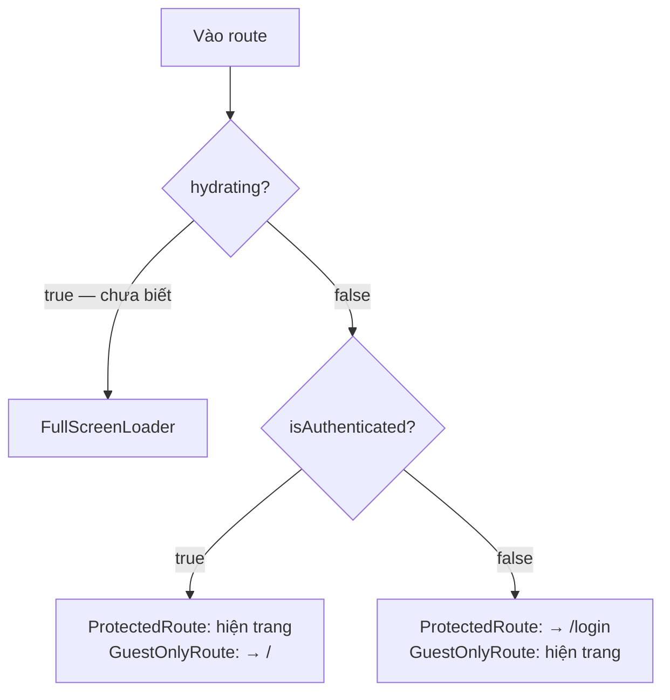

# 09 — Định tuyến & bảo vệ route

## 9.1. Toàn bộ route

Khai báo tập trung ở `src/routes/AppRouter.tsx`:

```tsx
export default function AppRouter() {
  return (
    <BrowserRouter>
      <Routes>
        <Route element={<App />}>
          <Route path="login" element={<GuestOnlyRoute><AuthPage /></GuestOnlyRoute>} />
          <Route path="register" element={<GuestOnlyRoute><RegisterPage /></GuestOnlyRoute>} />
          <Route path="forgot-password" element={<GuestOnlyRoute><ForgotPasswordPage /></GuestOnlyRoute>} />
          <Route index element={<ProtectedRoute><HomePage /></ProtectedRoute>} />
          <Route path="settings" element={<ProtectedRoute><SettingsPage /></ProtectedRoute>} />
          <Route path="hrm" element={<ProtectedRoute><HrmPage /></ProtectedRoute>}>
            <Route index element={<Navigate to="dashboard" replace />} />
            <Route path="dashboard" element={<DashboardPage />} />
            <Route path="danh-muc" element={<DanhMucPage />}>
              <Route index element={<Navigate to="phong-ban" replace />} />
              <Route path="phong-ban" element={<PhongBanPage />} />
              <Route path="nhan-vien" element={<NhanVienPage />} />
              <Route path="nguoi-phu-thuoc" element={<NguoiPhuThuocPage />} />
            </Route>
            <Route path="cau-hinh" element={<CauHinhPage />}>
              <Route index element={<Navigate to="thiet-lap-chung" replace />} />
              <Route path="thiet-lap-chung" element={<ThietLapChungPage />} />
              <Route path="lich-ngay-le" element={<LichNgayLePage />} />
            </Route>
            <Route path="cai-dat-luong" element={<CaiDatLuongPage />} />
            <Route path="du-lieu-luong" element={<DuLieuLuongPage />}>
              <Route index element={<Navigate to="cham-cong" replace />} />
              <Route path="cham-cong" element={<ChamCongPage />} />
              {/* 7 màn hình còn lại dùng chung DuLieuLuongChuaDungPage */}
            </Route>
          </Route>
          {/* Bắt mọi path không khớp, tránh màn hình trắng khi gõ sai URL */}
          <Route path="*" element={<Navigate to="/" replace />} />
        </Route>
      </Routes>
    </BrowserRouter>
  );
}
```

| Path | Component | Bảo vệ |
|---|---|---|
| `/` | `HomePage` | Cần đăng nhập |
| `/settings` | `SettingsPage` | Cần đăng nhập |
| `/hrm` | `HrmPage` (layout) → chuyển về `/hrm/dashboard` | Cần đăng nhập |
| `/hrm/dashboard` | `DashboardPage` | Cần đăng nhập |
| `/hrm/danh-muc` | `DanhMucPage` (layout) → chuyển về `/hrm/danh-muc/phong-ban` | Cần đăng nhập |
| `/hrm/danh-muc/phong-ban` | `PhongBanPage` | Cần đăng nhập |
| `/hrm/danh-muc/nhan-vien` | `NhanVienPage` | Cần đăng nhập |
| `/hrm/danh-muc/nguoi-phu-thuoc` | `NguoiPhuThuocPage` | Cần đăng nhập |
| `/hrm/cau-hinh` | `CauHinhPage` (layout) → chuyển về `/hrm/cau-hinh/thiet-lap-chung` | Cần đăng nhập |
| `/hrm/cau-hinh/thiet-lap-chung` | `ThietLapChungPage` | Cần đăng nhập |
| `/hrm/cau-hinh/lich-ngay-le` | `LichNgayLePage` | Cần đăng nhập |
| `/hrm/cai-dat-luong` | `CaiDatLuongPage` (layout) → chuyển về `/hrm/cai-dat-luong/danh-muc-khoan` | Cần đăng nhập |
| `/hrm/cai-dat-luong/danh-muc-khoan` | `DanhMucKhoanLuongPage` | Cần đăng nhập |
| `/hrm/cai-dat-luong/set-luong` | `SetLuongPage` | Cần đăng nhập |
| `/hrm/du-lieu-luong` | `DuLieuLuongPage` (layout) → chuyển về `/hrm/du-lieu-luong/cham-cong` | Cần đăng nhập |
| `/hrm/du-lieu-luong/cham-cong` | `ChamCongPage` | Cần đăng nhập |
| `/hrm/du-lieu-luong/<7 màn còn lại>` | `DuLieuLuongChuaDungPage` | Cần đăng nhập |
| `/login` | `AuthPage` | Chỉ khách |
| `/register` | `RegisterPage` | Chỉ khách |
| `/forgot-password` | `ForgotPasswordPage` | Chỉ khách |
| mọi path khác | → chuyển về `/` | |

**Vì sao HRM dùng route con mà `SettingsPage` thì không** (xem mục 9.7): HRM là một
**cụm màn hình** chứ không phải một trang nhiều tab. Cần gửi được link tới đúng màn hình,
F5 phải giữ nguyên vị trí, và thêm màn hình mới (Chấm công, Bảng lương) chỉ việc thêm
route. Quy ước 9.7 vẫn áp dụng cho **các tab bên trong** dialog hồ sơ nhân viên — chúng
dùng state cục bộ, không tạo route.

Route bắt-tất-cả chuyển về `/` chứ không hiện trang 404. Với ứng dụng nội bộ, gõ sai URL thì đưa về trang chính hữu ích hơn là báo lỗi. Nếu người dùng chưa đăng nhập, `ProtectedRoute` ở `/` sẽ tiếp tục đẩy họ tới `/login`.

## 9.2. Route gốc `<App />` — layout dùng chung

Mọi route đều lồng trong một route cha không có `path`:

```tsx
// src/App.tsx
/** Root layout của toàn bộ route — nơi gắn provider/UI dùng chung cho mọi trang khi cần. */
function App() {
  return (
    <>
      <Outlet />
      <ToastContainer
        position="top-right"
        autoClose={3000}
        newestOnTop
        theme="colored"
      />
    </>
  );
}
```

`<Outlet />` là chỗ route con render vào. `<ToastContainer />` đặt ở đây để **tồn tại xuyên suốt mọi điều hướng** — một thông báo bật lên ở trang chính vẫn hiển thị nếu người dùng chuyển sang trang Cài đặt. Đây là điều kiện cần cho các tác vụ nền ở [chương 8](08-tac-vu-nen-va-poll.md): thông báo tiến độ phải sống lâu hơn màn hình khởi động nó.

## 9.3. Hai guard

### `ProtectedRoute`

```tsx
/** Bọc quanh route cần đăng nhập — chưa có user thì đá về /login. */
export default function ProtectedRoute({ children }: Props) {
  const { isAuthenticated, hydrating } = useAuth();
  // Đang khôi phục phiên từ cookie — chờ xong rồi mới quyết, tránh nháy về /login.
  if (hydrating) {
    return <FullScreenLoader />;
  }
  if (!isAuthenticated) {
    return <Navigate to="/login" replace />;
  }
  return <>{children}</>;
}
```

### `GuestOnlyRoute`

```tsx
/** Route chỉ dành cho khách (login/register) — đã đăng nhập thì tự chuyển về trang chính. */
function GuestOnlyRoute({ children }: { children: ReactNode }) {
  const { isAuthenticated, hydrating } = useAuth();
  // Chờ khôi phục phiên xong rồi mới quyết — tránh lộ form đăng nhập khi thực ra đã đăng nhập.
  if (hydrating) return <FullScreenLoader />;
  if (isAuthenticated) return <Navigate to="/" replace />;
  return <>{children}</>;
}
```

Hai guard đối xứng nhau, và **cả hai đều kiểm tra `hydrating` trước**.

Ba trạng thái, không phải hai:



Bỏ nhánh `hydrating` sẽ gây hai lỗi cụ thể:

- **Ở `ProtectedRoute`:** người dùng đã đăng nhập mở `/` → trong lúc chờ `GET /auth/me`, `isAuthenticated` còn là `false` → bị đá về `/login` → vài trăm mili-giây sau `/auth/me` trả về → bị đẩy ngược về `/`. Màn hình nháy.
- **Ở `GuestOnlyRoute`:** form đăng nhập hiện ra trong tích tắc cho người thực ra đã đăng nhập.

Chi tiết cơ chế `hydrating` ở [chương 6, mục 6.2](06-context-toan-cuc.md#hydrating--cờ-chống-nháy-màn-hình).

## 9.4. Vì sao chặn bằng component chứ không bằng loader

React Router v7 hỗ trợ `loader` chạy **trước** khi route render, và nhiều dự án dùng nó để kiểm tra quyền. Dự án này cố tình không dùng.

Lý do: trạng thái đăng nhập nằm trong React Context (`AuthContext`), mà `loader` chạy **ngoài** cây React — nó không đọc được context. Muốn dùng `loader` thì phải:

1. Đưa trạng thái auth ra ngoài React (biến module, store riêng), hoặc
2. Cho `loader` tự gọi `GET /auth/me` mỗi lần điều hướng.

Cách 1 làm mất tính phản ứng — đăng xuất sẽ không tự đẩy người dùng ra khỏi trang đang xem. Cách 2 thêm một request mỗi lần chuyển trang.

Chặn bằng component giữ mọi thứ trong một nguồn sự thật duy nhất và **phản ứng tự động**: khi phiên hết hạn giữa chừng, `apiFetch` gọi `onSessionExpired` → `AuthContext` đặt `user = null` → `ProtectedRoute` render lại và trả về `<Navigate>`. Không cần `window.location`, không cần điều hướng thủ công.

## 9.5. Truyền dữ liệu giữa các route

React Router cho phép gắn state vào lần điều hướng. Dự án dùng đúng một lần — chuyển email từ form đăng ký sang form đăng nhập:

```tsx
// RegisterForm — sau khi đăng ký thành công
await register({ hoTen: …, email, sdt: …, password: form.password });
navigate("/login", { replace: true, state: { registered: true, email } });
```

```tsx
// LoginForm — đọc state
interface LoginLocationState {
  registered?: boolean;
  email?: string;
}

// Đọc 1 lần lúc mount; effect bên dưới xóa state ngay sau đó nên giá trị này không đổi.
const [fromRegister] = useState(() => (location.state ?? null) as LoginLocationState | null);

const [email, setEmail] = useState(fromRegister?.email ?? "");
// Email đã điền sẵn -> focus thẳng vào ô mật khẩu thay vì ô email.
const prefilled = !!fromRegister?.email;
```

Và ngay sau đó **xóa state đi**:

```tsx
// Xóa state điều hướng sau khi đã đọc — nếu không, React Router giữ nó trong history
// entry nên F5 (hoặc bấm Back về đây) sẽ hiện lại thông báo cũ và lộ email lần trước.
useEffect(() => {
  if (location.state) {
    navigate(location.pathname, { replace: true, state: null });
  }
}, [location.state, location.pathname, navigate]);
```

Đây là chi tiết dễ bỏ sót. `location.state` được lưu vào history entry của trình duyệt, nên nó **sống qua F5**. Không dọn thì email của người đăng ký trước còn nằm đó cho người tiếp theo mở máy.

Mẫu `useState(() => …)` với hàm khởi tạo lười đảm bảo giá trị được đọc **đúng một lần lúc mount**, trước khi effect xóa nó.

> **Quy ước: `location.state` chỉ dùng cho dữ liệu dùng một lần, và phải dọn ngay sau khi đọc.** Đừng dùng nó thay cho state ứng dụng.

## 9.6. Điều hướng trong component

Dùng `useNavigate`:

```tsx
const navigate = useNavigate();

// Logo và nút trên header
onClick={() => navigate("/")}

// Menu người dùng
onClick={() => { setUserMenuEl(null); navigate("/settings"); }}
```

Dùng `<Link component={RouterLink}>` cho liên kết thật (giữ được chuột giữa, Ctrl+click, menu chuột phải):

```tsx
<Link component={RouterLink} to="/forgot-password" variant="body2">
  Quên mật khẩu?
</Link>
```

**Quy tắc:** hành động (bấm nút, chọn menu) → `navigate()`. Liên kết (người dùng mong đó là một đường dẫn) → `<Link>`.

## 9.7. Điều hướng bên trong trang — không dùng route

Trang Cài đặt có 4 tab nhưng **không** tạo route con. Chúng là state cục bộ:

```tsx
type SettingsTab = "company" | "sync-schedule" | "display" | "system-data";

export default function SettingsPage() {
  const [tab, setTab] = useState<SettingsTab>("company");
  /* … */
      {/* Giữ mount cả 4 tab, chỉ ẩn bằng CSS — tránh remount + gọi lại API mỗi lần đổi tab. */}
      <Box sx={{ display: tab === "company" ? "block" : "none" }}>
        <CompanyManagementTab />
      </Box>
      <Box sx={{ display: tab === "sync-schedule" ? "block" : "none" }}>
        <SyncScheduleTab />
      </Box>
      {/* … */}
}
```

Đánh đổi có ý thức:

| | Được | Mất |
|---|---|---|
| Tab là state | Không remount, không gọi lại API khi đổi tab | Không chia sẻ link tới tab cụ thể, nút Back không quay lại tab trước |

Với trang Cài đặt thì đánh đổi này hợp lý — không ai gửi link tới một tab cài đặt. Nếu sau này cần link được, hãy chuyển sang route con hoặc tham số query.

Cùng lý do và cùng mẫu với 2 tab chiều hóa đơn ở màn hình chính (xem [chương 1, mục 1.6](01-tong-quan.md#16-bản-đồ-tính-năng-theo-màn-hình)).

## 9.8. Thêm một route mới

1. Tạo component màn hình trong `src/pages/`.
2. Thêm `<Route>` vào `AppRouter.tsx`, **bọc guard phù hợp**:
   ```tsx
   <Route path="bao-cao" element={<ProtectedRoute><BaoCaoPage /></ProtectedRoute>} />
   ```
3. Đặt route trước `<Route path="*">` — route bắt-tất-cả phải luôn ở cuối.
4. Nếu màn hình cần thanh header, tự render `<AppHeader />` bên trong page. `App.tsx` **không** chứa header, vì các trang đăng nhập không có nó.

---

**Trước:** [08 — Tác vụ nền & theo dõi tiến độ](08-tac-vu-nen-va-poll.md) · **Tiếp theo:** [10 — Luồng nghiệp vụ chính](10-luong-nghiep-vu.md)
