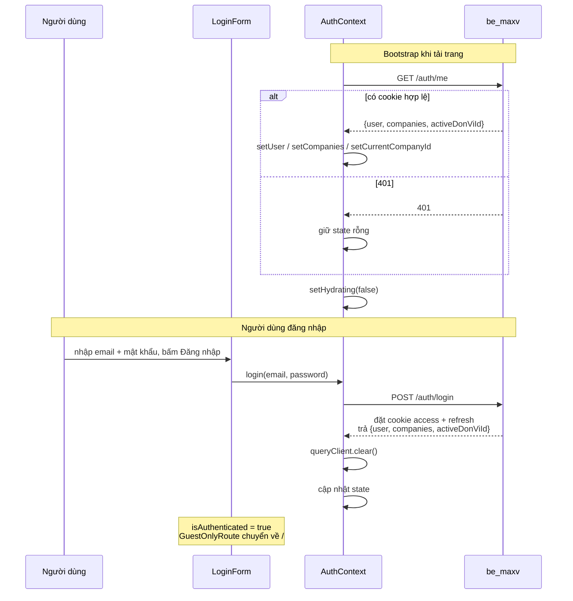
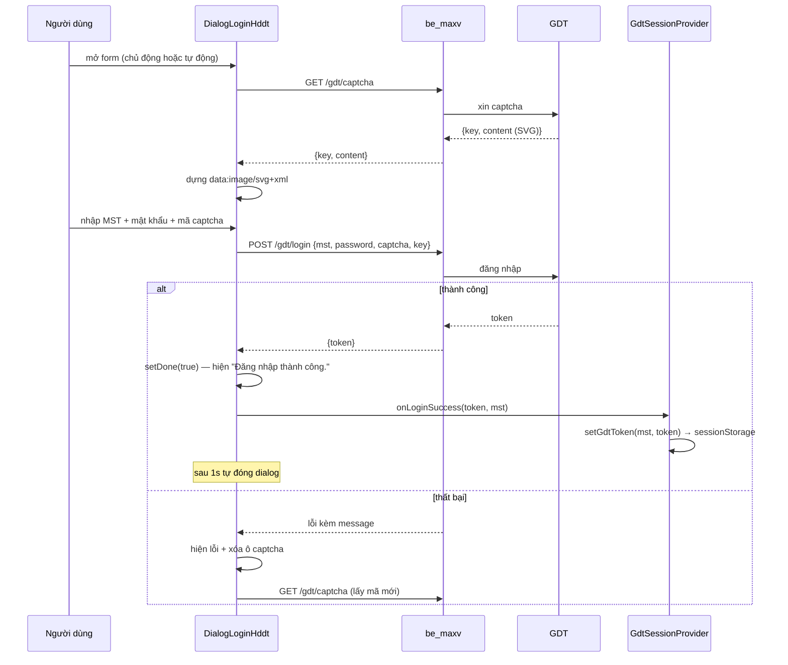
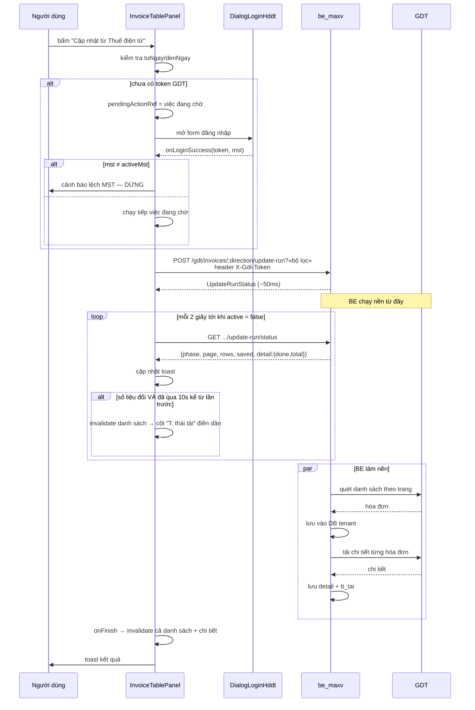
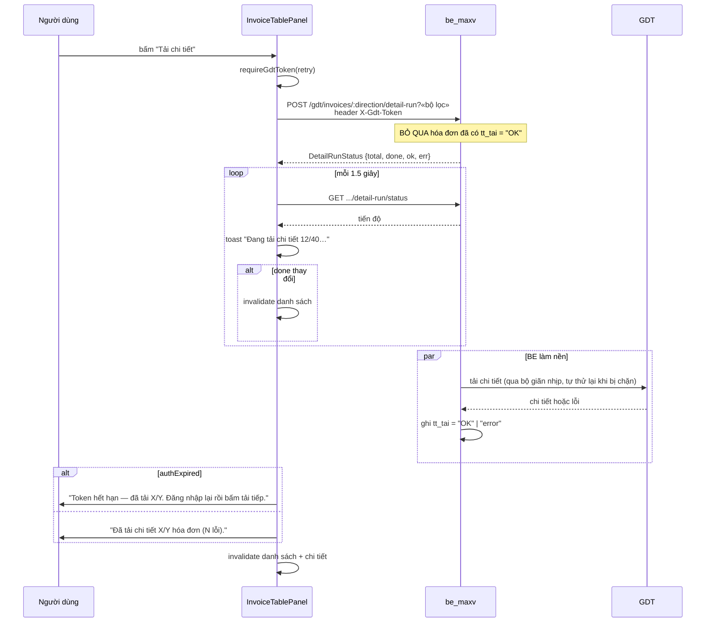
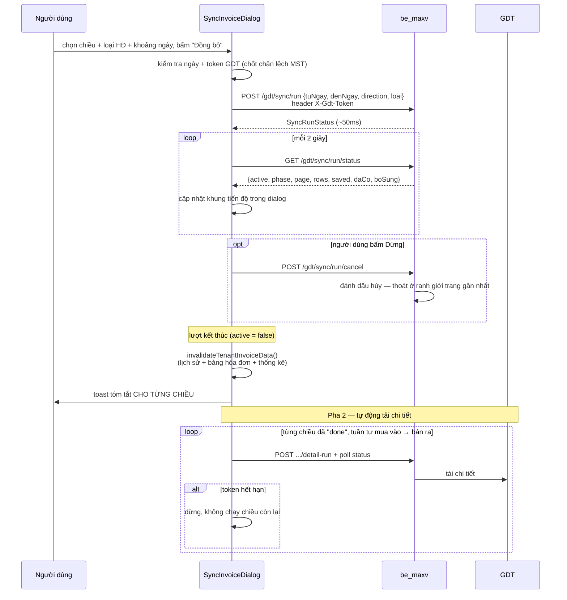
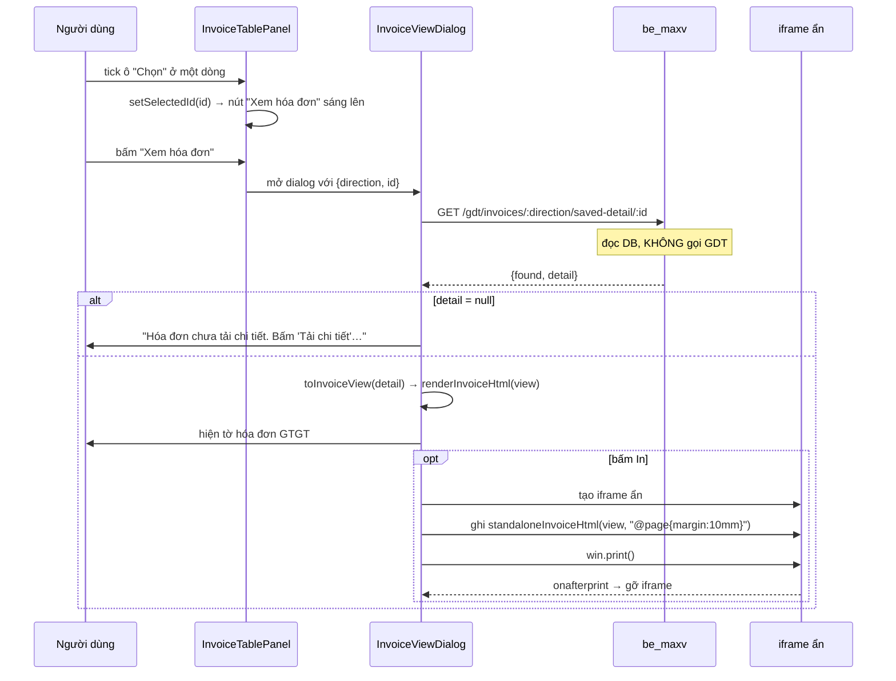
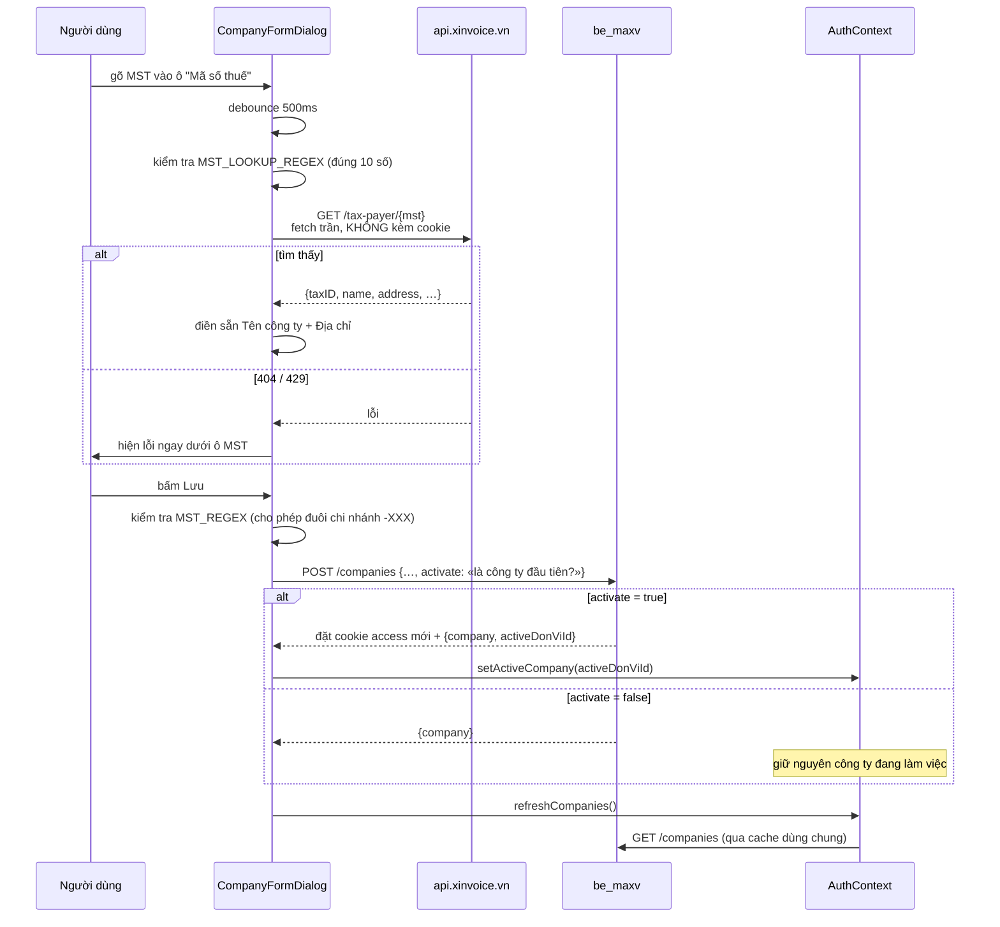

# 10 — Luồng nghiệp vụ chính

Bảy sơ đồ tuần tự cho bảy luồng quan trọng nhất. Dùng chương này khi cần lần theo một lỗi từ thao tác người dùng tới lời gọi API.

Ký hiệu chung:

- **U** — người dùng
- **FE** — component đang xử lý
- **BE** — `be_maxv`
- **GDT** — hệ thống Thuế điện tử

---

## 10.1. Đăng nhập ứng dụng & khôi phục phiên



**Điểm cần nhớ:** `queryClient.clear()` nằm giữa lời gọi API và việc cập nhật state. Nếu đặt sau, có khoảnh khắc `currentCompanyId` đã là công ty mới trong khi cache còn dữ liệu người dùng cũ.

---

## 10.2. Đăng nhập Thuế điện tử (GDT) với captcha



Captcha luôn được lấy mới sau mỗi lần đăng nhập thất bại — captcha đã dùng thì không dùng lại được:

```tsx
onError: (e) => {
  setError(getErrorMessage(e, "Đăng nhập thất bại."));
  setCaptchaInput("");
  void captchaQuery.refetch(); // sai captcha/thông tin -> lấy captcha mới
},
```

Việc dialog chờ 1 giây rồi mới đóng cũng là chủ ý:

```tsx
/** Giữ dialog thêm 1s sau khi đăng nhập thành công để người dùng kịp thấy báo thành công. */
const SUCCESS_CLOSE_DELAY_MS = 1000;
```

Và `onClose` được gọi qua ref chứ không đưa vào mảng phụ thuộc:

```tsx
/**
 * Gọi `onClose` qua ref, KHÔNG để nó vào deps: nơi gọi thường truyền arrow inline (đổi định danh
 * mỗi lần cha re-render, vd dialog Đồng bộ poll tiến độ 2s/lần) -> effect chạy lại và reset timer
 * liên tục, dialog có thể không bao giờ tự đóng.
 */
const onCloseRef = useRef(onClose);
useEffect(() => { onCloseRef.current = onClose; });
useEffect(() => {
  if (!done) return;
  const timer = setTimeout(() => onCloseRef.current(), SUCCESS_CLOSE_DELAY_MS);
  return () => clearTimeout(timer);
}, [done]);
```

Đây là lỗi thật đã xảy ra: dialog mở từ `SyncInvoiceDialog` (đang poll 2 giây một lần) không bao giờ tự đóng, vì mỗi lần cha render lại thì `onClose` là hàm mới → effect chạy lại → timer bị hủy và đặt lại.

---

## 10.3. Cập nhật từ Thuế điện tử



Lượt này gồm **hai pha trong một lượt** (`phase: "list"` rồi `"detail"`), nên chỉ cần một vòng poll. Chi tiết ở [chương 8](08-tac-vu-nen-va-poll.md).

---

## 10.4. Tải chi tiết (tải lại hóa đơn lỗi)



**Đặc điểm quan trọng:** backend bỏ qua hóa đơn đã có `tt_tai = "OK"`. Nhờ đó nút này vừa là "tải lần đầu" vừa là "thử lại phần lỗi" — bấm bao nhiêu lần cũng chỉ xử lý phần còn thiếu.

---

## 10.5. Đồng bộ từ Thuế



Vòng lặp cuối có ba điều kiện lọc, mỗi cái có lý do riêng:

```tsx
for (const res of results) {
  if (res.trang_thai !== "done") continue;          // chiều lỗi -> danh sách chưa đủ, tải chi tiết vô nghĩa
  if (res.direction !== "purchase" && res.direction !== "sold") continue;  // bỏ dòng tổng hợp "all"
  if (isStale()) break;                              // đổi công ty giữa chừng
  const authExpired = await pollDetailRunToast(res.direction, gdtToken, range, { … });
  if (authExpired) break; // token hết hạn -> chiều còn lại cũng lỗi y hệt, dừng
}
```

---

## 10.6. Xem và in hóa đơn



Việc in dùng iframe ẩn thay vì `window.print()` trực tiếp, để bản in chỉ chứa tờ hóa đơn — không có thanh header, không có bảng phía sau:

```tsx
// Đợi layout trong iframe xong rồi in; gỡ iframe sau khi in (afterprint hoặc timeout dự phòng).
win.focus();
win.onafterprint = () => document.body.removeChild(iframe);
setTimeout(() => {
  win.print();
  // Dự phòng nếu onafterprint không bắn (một số trình duyệt): gỡ sau vài giây.
  setTimeout(() => {
    if (iframe.parentNode) document.body.removeChild(iframe);
  }, 1000);
}, 150);
```

Hai lớp dọn dẹp — `onafterprint` và hẹn giờ dự phòng — vì không phải trình duyệt nào cũng bắn sự kiện `afterprint`. Thiếu lớp thứ hai thì mỗi lần in để lại một iframe rác trong DOM.

Bản xem trên màn hình và bản in dùng **cùng một hàm dựng HTML**, nên chúng luôn giống nhau. Xem [chương 11](11-pipeline-xuat-file.md).

---

## 10.7. Thêm công ty với tra cứu MST



### Hai biểu thức MST khác nhau

```ts
/** MST hợp lệ để LƯU: 10 số, kèm đuôi chi nhánh `-XXX` tùy chọn. */
export const MST_REGEX = /^[0-9]{10}(-[0-9]{3})?$/;

/**
 * MST hợp lệ để TRA CỨU tại api.xinvoice.vn: đúng 10 số, không đuôi chi nhánh — API đó trả 404 cho
 * dạng `0201964163-001`, nên bắn đi là chắc chắn phí một lượt trong hạn mức 10 lần/30 giây.
 */
export const MST_LOOKUP_REGEX = /^[0-9]{10}$/;
```

Hai luật cho hai mục đích. Lưu thì chấp nhận MST chi nhánh; tra cứu thì không, vì dịch vụ bên ngoài không hỗ trợ và mỗi lời gọi hỏng đều đốt hạn mức chung.

### Cờ `activate` — vì sao quan trọng

```ts
/**
 * `activate: true` (công ty ĐẦU TIÊN): server đặt cookie access mới nhúng `donViId` và trả
 * `activeDonViId`. Bắt buộc phải có, vì `resolveTenantDb` bên BE đọc `donViId` từ token —
 * thiếu nó thì mọi endpoint theo tenant (hóa đơn, đồng bộ...) trả 403.
 *
 * `activate: false` (thêm MST từ màn Cài đặt, owner đang làm việc ở MST khác): KHÔNG đụng
 * token/refresh cookie hiện tại — tránh cửa sổ đua khi FE phải switch-back thủ công.
 */
```

Cờ được tính ở tầng hook, không phải ở form:

```ts
const isFirstCompany = companies.length === 0;

return useMutation({
  mutationFn: (payload: CreateCompanyPayload) => createCompany(payload, isFirstCompany),
  /* … */
});
```

### Ghi đè dữ liệu người dùng gõ tay

```tsx
useEffect(() => {
  if (!taxPayer) return;
  // Ghi đè cả khi người dùng đã gõ tay — dữ liệu cơ quan thuế là nguồn chuẩn.
  // eslint-disable-next-line react-hooks/set-state-in-effect
  setTenCongTy(taxPayer.name);
  setDiaChi(taxPayer.address);
}, [taxPayer]);
```

Quyết định nghiệp vụ, không phải kỹ thuật: tên và địa chỉ theo đăng ký thuế phải khớp với cơ quan thuế, nên kết quả tra cứu luôn thắng. Người dùng vẫn sửa được sau đó nếu thật sự cần.

---

## 10.8. Bảng tra nhanh: thao tác → endpoint

| Thao tác trên giao diện | Endpoint | Cần token GDT? |
|---|---|:--:|
| Mở trang (khôi phục phiên) | `GET /auth/me` | ✖ |
| Đăng nhập ứng dụng | `POST /auth/login` | ✖ |
| Đổi công ty | `POST /companies/:id/switch` | ✖ |
| Mở form đăng nhập GDT | `GET /gdt/captcha` | ✖ |
| Đăng nhập GDT | `POST /gdt/login` | ✖ |
| Nút **Tìm kiếm** | `GET /gdt/invoices/:direction/saved` | ✖ |
| Mở tab **Chi tiết hóa đơn** | `GET /gdt/invoices/:direction/saved-details` | ✖ |
| Nút **Cập nhật từ Thuế điện tử** | `POST /gdt/invoices/:direction/update-run` | ✔ |
| Nút **Tải chi tiết** | `POST /gdt/invoices/:direction/detail-run` | ✔ |
| Nút **Đồng bộ** | `POST /gdt/sync/run` | ✔ |
| Nút **Xem hóa đơn** | `GET /gdt/invoices/:direction/saved-detail/:id` | ✖ |
| Mở dialog **Xuất file** | `GET /gdt/invoices/:direction/detail-complete` | ✖ |
| Nút **Xuất file** | `POST /gdt/render-pdf` (mỗi hóa đơn) | ✖ |
| Tab **Dữ liệu hệ thống** | `GET /gdt/stats` | ✖ |

Quy tắc chung: **chỉ thao tác lấy dữ liệu mới từ cơ quan thuế mới cần token GDT.** Mọi việc đọc lại dữ liệu đã lưu chỉ cần phiên ứng dụng.

---

**Trước:** [09 — Định tuyến](09-dinh-tuyen.md) · **Tiếp theo:** [11 — Pipeline xuất file](11-pipeline-xuat-file.md)
