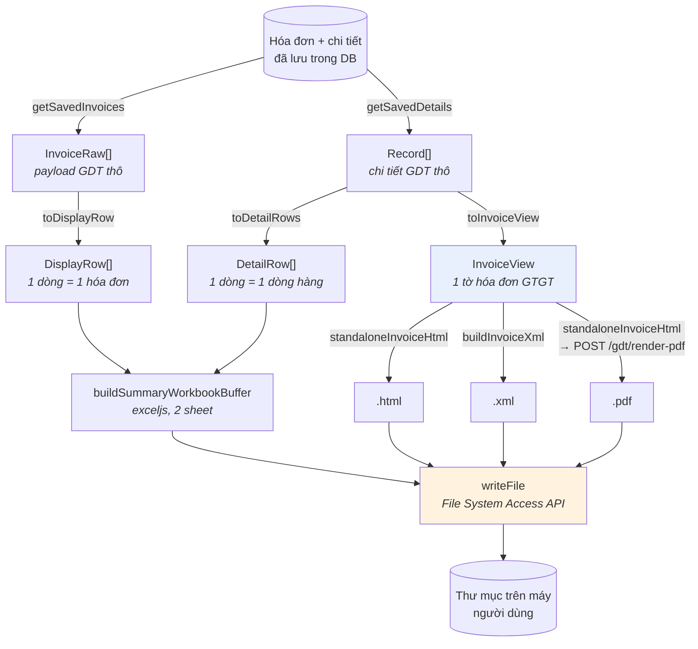

# 11 — Pipeline xuất file

Chức năng "Xuất file excel tổng hợp và hóa đơn" sinh ra, trong một lượt: **2 file Excel** + **3 file cho mỗi hóa đơn** (HTML, XML, PDF) của **cả hai chiều**, ghi thẳng vào thư mục người dùng chọn trên máy.

Đây là phần phức tạp nhất của frontend. Chương này đi từ dữ liệu thô tới file trên đĩa.

## 11.1. Chuỗi biến đổi dữ liệu



Ba nhánh biến đổi từ **cùng một nguồn**:

| Nguồn | Hàm biến đổi | Kết quả | Dùng cho |
|---|---|---|---|
| Danh sách đã lưu | `toDisplayRow` | `DisplayRow` — 1 dòng/hóa đơn | Bảng "Tổng quát" + sheet Excel 1 |
| Chi tiết đã lưu | `toDetailRows` | `DetailRow` — 1 dòng/dòng hàng | Bảng "Chi tiết" + sheet Excel 2 |
| Chi tiết đã lưu | `toInvoiceView` | `InvoiceView` — 1 tờ hóa đơn | HTML / XML / PDF / xem trên màn hình |

**`InvoiceView` là trung tâm.** Bốn đầu ra khác nhau (xem trên màn hình, in, .html, .pdf) đều đi qua nó, nên chúng luôn giống hệt nhau. Nếu bạn sửa cách hiển thị một trường, cả bốn cùng đổi.

## 11.2. `InvoiceView` — lớp chuẩn hóa

Payload GDT không có lược đồ ổn định: cùng một thông tin có thể nằm ở nhiều tên trường khác nhau tùy loại hóa đơn. `toInvoiceView` gánh toàn bộ sự bất định đó:

```ts
/** Map 1 phần tử mảng hàng hóa `hdhhdvu` -> dòng hiển thị. */
function toItem(raw: unknown): InvoiceViewItem {
  const it = (raw ?? {}) as Record<string, unknown>;
  return {
    tinhChat: s(pick(it, "tchat", "tinhchat")),
    loaiDacTrung: s(pick(it, "lthhdv", "loaihhdv", "ldactrung")),
    tenHang: s(pick(it, "ten", "thang")),
    dvt: s(pick(it, "dvtinh", "dvt")),
    soLuong: num(pick(it, "sluong", "soluong")),
    donGia: num(pick(it, "dgia", "dongia")),
    chietKhau: num(pick(it, "stckhau", "tienck", "stchietkhau")),
    thueSuat: s(pick(it, "ltsuat", "tsuat", "thuesuat")),
    thanhTien: num(pick(it, "thtien", "thanhtien")),
  };
}
```

`pick(obj, ...tên)` trả về giá trị đầu tiên tìm thấy. Ví dụ tên hàng hóa có thể là `ten` hoặc `thang`.

Và JSDoc của `toInvoiceView` là **bản đồ ánh xạ** đầy đủ — tài liệu quan trọng nhất về cấu trúc dữ liệu GDT trong toàn dự án:

```ts
/**
 * GHI CHÚ ÁNH XẠ (chỉnh Ở ĐÂY nếu tên field GDT thực tế lệch):
 *  - Header: khmshdon (mẫu số), khhdon (ký hiệu), shdon (số), tdlap (ngày lập), nky (ngày ký),
 *    mhso/mcqt (mã CQT).
 *  - Bên bán: nbten, nbmst, nbdchi, nbsdthoai, nbstkhoan; mã/tên cửa hàng thường rỗng.
 *  - Bên mua: nmten (đơn vị), nmtnmua (người mua), nmmst, nmdchi, nmstkhoan; ĐVQHNS/CCCD/hộ chiếu
 *    thường rỗng.
 *  - Thanh toán/tiền tệ: thtttoan, dvtte, tgia; bảng kê thường rỗng.
 *  - Tổng: tgtcthue, tgtthue, tgtphi, ttcktmai, tgtttbso, tgtttbchu (bằng chữ).
 *  - Mảng: hdhhdvu (hàng hóa: tchat, ten, dvtinh, sluong, dgia, stckhau, ltsuat, thtien),
 *    thttltsuat (tổng hợp theo thuế suất).
 */
```

> **Khi gặp hóa đơn hiển thị thiếu trường, hãy sửa ở `toInvoiceView` — đừng vá ở nơi hiển thị.** Vá ở chỗ hiển thị chỉ sửa được một trong bốn đầu ra.

Một chi tiết đáng chú ý:

```ts
/** Số tiền viết bằng chữ (GDT trả sẵn — không tự tính). */
bangChu: string;
```

Số tiền bằng chữ **lấy từ GDT**, không tự sinh. Đây là con số có giá trị pháp lý trên hóa đơn; tự chuyển số sang chữ sẽ có nguy cơ lệch với bản gốc do khác quy tắc làm tròn hoặc cách đọc.

## 11.3. Sinh HTML

`invoiceHtml.ts` có ba thứ được export:

| | Vai trò |
|---|---|
| `INVOICE_CSS` | Chuỗi CSS của tờ hóa đơn |
| `renderInvoiceHtml(view)` | Phần thân HTML, **không** có `<html>`/`<head>` |
| `standaloneInvoiceHtml(view, extraCss)` | Tài liệu HTML hoàn chỉnh |

```ts
/**
 * Tài liệu HTML ĐỘC LẬP (có sẵn CSS) — cho file .html xuất ra, cho in (truyền `extraCss` @page), và
 * cho container offscreen render PDF.
 */
export function standaloneInvoiceHtml(view: InvoiceView, extraCss = ""): string {
  return (
    `<!doctype html><html><head><meta charset="utf-8"><title>Hóa đơn ${esc(view.soHd)}</title>` +
    `<style>${extraCss}${INVOICE_CSS}</style></head>` +
    `<body>${renderInvoiceHtml(view)}</body></html>`
  );
}
```

Tách đôi vì ba nơi dùng cần ba dạng khác nhau:

```tsx
// Xem trên màn hình — nhúng vào cây React đang có
<Box sx={{ overflowX: "auto" }}>
  <style>{INVOICE_CSS}</style>
  {/* HTML do renderInvoiceHtml dựng (giá trị động đã escape) — an toàn để nhúng. */}
  <div dangerouslySetInnerHTML={{ __html: renderInvoiceHtml(view) }} />
</Box>
```

```tsx
// In — tài liệu độc lập + quy tắc khổ giấy
doc.write(standaloneInvoiceHtml(view, "@page{margin:10mm;}body{margin:0;}"));
```

```ts
// Render PDF ở backend — tài liệu độc lập, nền trắng
return renderInvoicePdf(standaloneInvoiceHtml(view, "body{margin:0;background:#fff;}"));
```

### Về `dangerouslySetInnerHTML`

Dùng nó luôn cần lý do. Ở đây lý do là: HTML do **chính code này dựng**, và mọi giá trị động đều đi qua hàm `esc()` trước khi ghép chuỗi. Không có nội dung nào từ bên ngoài lọt vào nguyên vẹn.

> ⚠️ Nếu bạn thêm trường mới vào `renderInvoiceHtml`, **bắt buộc** bọc nó bằng `esc()`. Một trường quên escape là một lỗ XSS — và dữ liệu ở đây đến từ hệ thống bên ngoài.

## 11.4. Sinh XML

```ts
/**
 * Dựng XML "thể hiện dữ liệu" của 1 hóa đơn từ `InvoiceView` (bản dựng lại từ chi tiết đã đồng bộ —
 * KHÔNG phải bản XML ký số gốc của Tổng cục Thuế). Dùng cho nút "Xuất file tổng hợp + hóa đơn".
 * Cấu trúc phẳng, dễ đối chiếu; nếu sau cần chuẩn TĐiệp ký số thì phải lấy bản gốc từ GDT.
 */
```

**Đọc kỹ câu này.** File XML xuất ra **không phải** hóa đơn điện tử có giá trị pháp lý — nó là bản thể hiện dữ liệu, dựng lại từ những gì đã tải về. Bản gốc có chữ ký số nằm ở GDT. Nếu có yêu cầu nghiệp vụ cần bản gốc, phải lấy từ GDT chứ không sinh ở đây.

Hai lớp làm sạch trước khi ghép chuỗi:

```ts
/**
 * Bỏ ký tự điều khiển C0 bị cấm trong XML 1.0 (mã dưới 0x20, trừ 0x09 tab / 0x0A LF / 0x0D CR).
 * Duyệt theo mã ký tự để KHÔNG viết ký tự điều khiển thô trong regex/nguồn.
 */
function stripXmlCtrl(s: string): string {
  let out = "";
  for (const ch of s) {
    const c = ch.codePointAt(0) ?? 0;
    if (c >= 0x20 || c === 0x09 || c === 0x0a || c === 0x0d) out += ch;
  }
  return out;
}

/** Escape ký tự đặc biệt XML + lọc ký tự điều khiển cấm. */
function xesc(v: string): string {
  return stripXmlCtrl(String(v))
    .replace(/&/g, "&amp;")
    .replace(/</g, "&lt;")
    /* … */;
}
```

Ký tự điều khiển thỉnh thoảng lọt vào tên hàng hóa từ phần mềm phát hành hóa đơn. Không lọc thì file XML sinh ra **không parse được** — và lỗi chỉ lộ ra khi ai đó mở file, rất lâu sau khi xuất.

## 11.5. Sinh Excel

```ts
export async function buildSummaryWorkbookBuffer(
  overviewRows: DisplayRow[],
  detailRows: DetailRow[],
  direction: InvoiceDirection,
): Promise<ArrayBuffer> {
  const { Workbook } = await import("exceljs");
  const { text } = DIR_LABEL[direction];
  const wb = new Workbook();
  addStyledSheet(wb, `Tổng quát ${text}`, overviewColumns(direction), overviewRows);
  addStyledSheet(wb, `Chi tiết ${text}`, detailColumns(), detailRows);
  return (await wb.xlsx.writeBuffer()) as ArrayBuffer;
}
```

Chú ý `await import("exceljs")` — **nhập động**. `exceljs` là thư viện nặng; nhập động khiến Vite tách nó thành gói riêng, chỉ tải khi người dùng thực sự xuất file. Người chỉ tra cứu hóa đơn không phải tải nó.

### Định nghĩa cột

Cột Excel khai báo theo cùng mẫu với cột bảng trên màn hình:

```ts
/** 1 cột xuất Excel: tiêu đề + độ rộng + (tuỳ chọn) định dạng số + hàm lấy giá trị ô. */
interface XlsxColumn<T> {
  header: string;
  width: number;
  /** numFmt kiểu Excel cho cột số (vd "#,##0"); bỏ trống nếu là chữ. */
  numFmt?: string;
  value: (row: T, index: number) => string | number;
}
```

```ts
/** Cột bảng "Tổng quát" (khớp cột đang hiển thị, bỏ cột checkbox "Chọn"). */
function overviewColumns(direction: InvoiceDirection): XlsxColumn<DisplayRow>[] {
  const isPurchase = direction === "purchase";
  return [
    { header: "STT", width: 6, value: (_r, i) => i + 1 },
    { header: "T. thái tải", width: 11, value: (r) => ttTaiLabel(r.ttTai) },
    /* … */
    { header: "Tổng tiền chưa thuế", width: 17, numFmt: MONEY_FMT, value: (r) => r.tienChuaThue ?? "" },
    /* … */
  ];
}
```

> ⚠️ **Cột Excel và cột bảng trên màn hình là hai danh sách riêng biệt.** Thêm cột vào bảng mà quên thêm vào Excel là lỗi thường gặp nhất khi mở rộng tính năng này. Xem quy trình đầy đủ ở [chương 13](13-huong-dan-mo-rong.md).

Các ô số truyền **số thật** kèm `numFmt`, không truyền chuỗi đã định dạng — để người dùng còn tính toán được trong Excel.

## 11.6. Render PDF

PDF là đầu ra duy nhất **không** sinh ở frontend:

```ts
/**
 * Render 1 tờ hóa đơn ra PDF VECTOR: gửi HTML tờ hóa đơn (tự chứa) lên BE, Chromium headless
 * (puppeteer) render -> PDF chuẩn (chữ nét, chọn/tìm được). Thay cách cũ dùng html2canvas (ảnh raster
 * mờ + dính lỗi màu oklch của app).
 */
async function invoiceToPdfBlob(view: InvoiceView): Promise<Blob> {
  return renderInvoicePdf(standaloneInvoiceHtml(view, "body{margin:0;background:#fff;}"));
}
```

Hai lý do bỏ cách làm hoàn toàn ở frontend:

1. **`html2canvas` cho ra ảnh raster.** Chữ mờ khi phóng to, không chọn được, không tìm kiếm được — không chấp nhận với chứng từ kế toán.
2. **Lỗi màu `oklch`.** MUI v9 sinh màu ở không gian `oklch`, mà `html2canvas` không hiểu định dạng đó.

Gửi HTML lên Chromium thật giải quyết cả hai.

## 11.7. Ghi file xuống đĩa

`src/lib/fileSystemAccess.ts` bọc File System Access API với type tự khai báo:

```ts
/**
 * Lớp mỏng cho File System Access API (Chrome/Edge) — chọn thư mục + ghi file vào thư mục người dùng
 * chọn. Tách khỏi feature để tái dùng + không rải cast `window as ...` khắp nơi. Khai báo type tối
 * thiểu (lib.dom chưa chắc có `showDirectoryPicker` theo phiên bản TS).
 */
export function supportsDirectoryPicker(): boolean {
  return typeof (window as unknown as { showDirectoryPicker?: unknown }).showDirectoryPicker === "function";
}

export async function pickDirectory(): Promise<FsDirHandle | null> {
  const picker = (window as unknown as { showDirectoryPicker?: ShowDirPicker }).showDirectoryPicker;
  if (!picker) throw new Error("Trình duyệt không hỗ trợ chọn thư mục (dùng Chrome/Edge).");
  try {
    return await picker({ mode: "readwrite" });
  } catch (e) {
    // Người dùng bấm Hủy hộp chọn -> AbortError, coi như không chọn (không phải lỗi).
    if (e instanceof DOMException && e.name === "AbortError") return null;
    throw e;
  }
}
```

Hai chi tiết:

- **`AbortError` không phải lỗi.** Người dùng bấm Hủy là hành vi bình thường; ném lỗi ở đây sẽ hiện thông báo đỏ vô nghĩa.
- **`pickDirectory` phải chạy trong một cử chỉ người dùng.** Trình duyệt chỉ cho mở hộp chọn thư mục ngay trong trình xử lý sự kiện click. Gọi nó sau một `await` dài sẽ bị chặn.

## 11.8. Điều phối toàn bộ lượt xuất

`exportBundle.ts` ghép mọi thứ lại.

### Cấu trúc thư mục kết quả

```ts
/**
 * Chạy lượt xuất CẢ 2 CHIỀU vào cấu trúc:
 *   <MST người nhập>/<khoảng ngày>/
 *     purchase/{html,xml,pdf}/<ký hiệu>-<số HĐ>.<ext>
 *     sold/{html,xml,pdf}/...
 *     Tong-hop-dau-vao-<khoảng>.xlsx
 *     Tong-hop-dau-ra-<khoảng>.xlsx
 * Bỏ qua + đếm lỗi từng hóa đơn (không kẹt cả lượt). Trả số liệu tổng kết để FE toast.
 */
```

### Đọc dữ liệu hai chiều song song

```ts
// Đọc dữ liệu 2 chiều (song song) trước để biết tổng số HĐ cho progress.
const perDir = await Promise.all(
  directions.map(async (direction) => {
    const [saved, details] = await Promise.all([
      getSavedInvoices(direction, query),
      getSavedDetails(direction, query),
    ]);
    const views = details
      .map((d) => toInvoiceView(d))
      .filter((v): v is InvoiceView => v !== null);
    return { direction, saved, details, views };
  }),
);
```

Bốn lời gọi API chạy song song. Phải đọc hết trước khi bắt đầu ghi vì cần biết tổng số hóa đơn để báo tiến độ.

`filter((v): v is InvoiceView => v !== null)` là **type predicate** — nó vừa lọc `null` vừa nói cho TypeScript biết mảng kết quả không còn `null`.

### Tên file phải kèm MST người bán

```ts
// Gắn MST người bán để KHÔNG trùng tên: chiều mua vào gộp HĐ của nhiều người bán, `kyHieu-soHd`
// chỉ unique theo từng người bán -> thiếu MST sẽ ghi đè lẫn nhau (mất file).
const base = safeName(`${t.view.seller.mst}-${t.view.kyHieu}-${t.view.soHd}`);
```

Lỗi tinh vi: hai nhà cung cấp khác nhau hoàn toàn có thể cùng phát hành hóa đơn số `00000123` ký hiệu `C25TAA`. Không có MST trong tên file, file thứ hai ghi đè file thứ nhất — **mất dữ liệu im lặng**.

```ts
/** Bỏ ký tự không hợp lệ trong tên file (Windows/khác), gộp khoảng trắng. */
function safeName(raw: string): string {
  return (raw || "hoa-don").replace(/[\\/:*?"<>|]+/g, "_").replace(/\s+/g, " ").trim();
}
```

### Giới hạn số việc chạy song song

```ts
/**
 * Số hóa đơn xử lý ĐỒNG THỜI — khớp `MAX_CONCURRENT_RENDERS` ở BE (pdfRenderer): mỗi PDF là 1 round-trip
 * tới puppeteer. Đúng bằng cap BE để lấp đủ 2 slot mà KHÔNG xếp hàng thừa trên semaphore (tránh chạm
 * timeout 60s/HĐ khi bị nghẽn).
 */
const PDF_CONCURRENCY = 2;

/** Chạy `worker` trên `items` với tối đa `limit` việc đồng thời (bounded pool, không phụ thuộc lib ngoài). */
async function runPool<T>(
  items: T[],
  limit: number,
  worker: (item: T) => Promise<void>,
): Promise<void> {
  let next = 0;
  const runners = Array.from({ length: Math.min(limit, items.length) }, async () => {
    // `next++` đọc + tăng trong 1 tick (không await xen giữa) nên mỗi runner lấy 1 index riêng — an toàn.
    while (next < items.length) await worker(items[next++]);
  });
  await Promise.all(runners);
}
```

**Con số 2 không tùy tiện — nó khớp với giới hạn render đồng thời ở backend.**

- Đặt thấp hơn → lãng phí năng lực backend, xuất chậm.
- Đặt cao hơn → request thừa xếp hàng chờ semaphore ở backend, và có thể chạm hạn 60 giây mỗi hóa đơn rồi thất bại.

> Nếu backend đổi `MAX_CONCURRENT_RENDERS`, **phải đổi con số này theo**. Hai hằng số ở hai repo khác nhau nhưng ràng buộc với nhau.

Chú thích về `next++` giải thích vì sao pool này an toàn dù JavaScript không có khóa: `next++` là một phép toán đồng bộ, không có `await` xen vào giữa đọc và tăng, nên hai runner không thể lấy trùng chỉ số.

### Một hóa đơn lỗi không làm hỏng cả lượt

```ts
await runPool(tasks, PDF_CONCURRENCY, async (t) => {
  const base = safeName(`${t.view.seller.mst}-${t.view.kyHieu}-${t.view.soHd}`);
  try {
    if (t.htmlDir) await writeFile(t.htmlDir, `${base}.html`, standaloneInvoiceHtml(t.view));
    if (t.xmlDir) await writeFile(t.xmlDir, `${base}.xml`, buildInvoiceXml(t.view));
    if (t.pdfDir) await writeFile(t.pdfDir, `${base}.pdf`, await invoiceToPdfBlob(t.view));
    ok += 1;
  } catch (e) {
    // 1 hóa đơn lỗi -> bỏ qua; KHÔNG nuốt im lặng: log + giữ lỗi đầu tiên để FE hiện.
    err += 1;
    const msg = e instanceof Error ? e.message : String(e);
    if (!firstError) firstError = msg;
    console.error(
      `[exportBundle] Lỗi xuất hóa đơn ${t.direction}/${base} | message: ${msg}\n`,
      e instanceof Error ? e.stack : e,
    );
  }
  done += 1;
  onProgress?.(done, total);
});
```

Với lượt xuất hàng trăm hóa đơn, để một lỗi làm hỏng cả lượt là không chấp nhận được. Nhưng nuốt lỗi im lặng cũng không được — nên code **giữ lại thông báo lỗi đầu tiên** và trả về cho giao diện hiển thị:

```tsx
render:
  res.err > 0
    ? `Đã xuất ${res.ok}/${res.total} hóa đơn (${res.err} lỗi) + Excel vào "${dir.name}".` +
      (res.firstError ? ` Lỗi: ${res.firstError}` : "")
    : `Đã xuất ${res.ok} hóa đơn (2 chiều) + Excel vào thư mục "${dir.name}".`,
```

## 11.9. Điều kiện cho phép xuất

Dialog chặn xuất khi dữ liệu chưa đầy đủ:

```tsx
const purchaseComplete = useDetailCompleteQuery("purchase", query, open);
const soldComplete = useDetailCompleteQuery("sold", query, open);
const pData = purchaseComplete.data;
const sData = soldComplete.data;

const bothLoaded = !!pData && !!sData;
const synced = bothLoaded && pData.missing === 0 && sData.missing === 0;
const canExport =
  canPick && !!dir && !!activeMst && anyFormat && hasRange && synced && !exporting;
```

Sáu điều kiện:

| Điều kiện | Vì sao |
|---|---|
| `canPick` | Trình duyệt hỗ trợ chọn thư mục |
| `!!dir` | Người dùng đã chọn thư mục |
| `!!activeMst` | Cần MST để đặt tên thư mục gốc |
| `anyFormat` | Tick ít nhất một định dạng |
| `hasRange` | Đủ khoảng ngày |
| `synced` | **Mọi hóa đơn đã có chi tiết** |

Điều kiện cuối quan trọng nhất: không có chi tiết thì không dựng được `InvoiceView`, hóa đơn đó sẽ bị bỏ qua **im lặng** khỏi kết quả xuất. Người dùng nhận một thư mục thiếu file mà không biết.

Kiểm tra này dùng endpoint riêng, chỉ đếm chứ không tải dữ liệu:

```ts
/** Số HĐ + số HĐ CHƯA có chi tiết trong khoảng — gate cho nút "Xuất file tổng hợp + hóa đơn". */
export interface DetailCompleteStatus {
  total: number;
  missing: number;
}
```

Và thông báo cho người dùng biết cụ thể còn thiếu bao nhiêu:

```tsx
{bothLoaded && !synced && (
  <Alert severity="warning" sx={{ mt: 1 }}>
    Còn hóa đơn chưa tải chi tiết — Mua vào: {pData.missing}/{pData.total}, Bán ra:{" "}
    {sData.missing}/{sData.total}. Hãy đồng bộ hoàn thành cả 2 chiều trước khi xuất.
  </Alert>
)}
```

## 11.10. Sao lưu CSV — luồng đơn giản hơn

Tab Cài đặt › Dữ liệu hệ thống có nút "Xuất / Sao lưu dữ liệu" dùng luồng khác hẳn: **một file CSV, tải qua trình duyệt**, không cần chọn thư mục.

```ts
/**
 * Ghi mảng dòng CSV ra file + kích hoạt tải về. Có BOM UTF-8 để Excel hiển thị đúng tiếng Việt.
 */
function downloadCsv(lines: string[], filename: string): void {
  const bom = String.fromCharCode(0xfeff);
  const blob = new Blob([bom + lines.join("\r\n")], { type: "text/csv;charset=utf-8;" });
  const url = URL.createObjectURL(blob);
  const link = document.createElement("a");
  link.href = url;
  link.download = filename;
  document.body.appendChild(link);
  link.click();
  document.body.removeChild(link);
  URL.revokeObjectURL(url);
}
```

Hai chi tiết dễ quên:

- **BOM UTF-8** (``) ở đầu file. Không có nó, Excel trên Windows đọc CSV bằng bảng mã hệ thống và tiếng Việt hiện thành ký tự lạ.
- **`URL.revokeObjectURL`** sau khi click. Thiếu nó thì blob nằm lại trong bộ nhớ tới khi đóng tab.

Luồng này chạy được trên **mọi trình duyệt**, khác với luồng xuất bộ file ở trên.

---

**Trước:** [10 — Luồng nghiệp vụ chính](10-luong-nghiep-vu.md) · **Tiếp theo:** [12 — Quy ước lập trình & lint](12-quy-uoc-lap-trinh.md)
