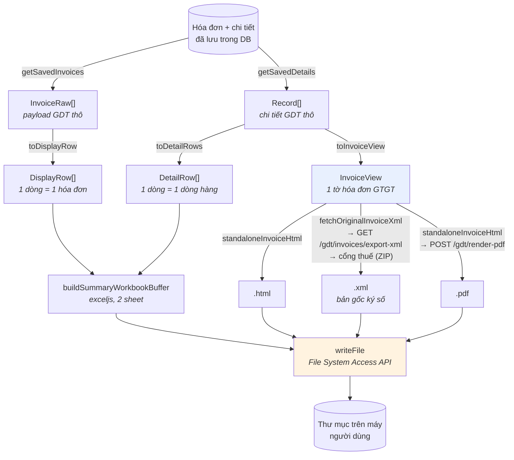

# 11 — Pipeline xuất file

Chức năng "Xuất file excel tổng hợp và hóa đơn" sinh ra, trong một lượt: **2 file Excel** + **3 file cho mỗi hóa đơn** (HTML, XML, PDF) của **cả hai chiều**, ghi thẳng vào thư mục người dùng chọn trên máy.

Đây là phần phức tạp nhất của frontend. Chương này đi từ dữ liệu thô tới file trên đĩa.

## 11.1. Chuỗi biến đổi dữ liệu



Ba nhánh biến đổi từ **cùng một nguồn**:

| Nguồn | Hàm biến đổi | Kết quả | Dùng cho |
|---|---|---|---|
| Danh sách đã lưu | `toDisplayRow` | `DisplayRow` — 1 dòng/hóa đơn | Bảng "Tổng quát" + sheet Excel 1 |
| Chi tiết đã lưu | `toDetailRows` | `DetailRow` — 1 dòng/dòng hàng | Bảng "Chi tiết" + sheet Excel 2 |
| Chi tiết đã lưu | `toInvoiceView` | `InvoiceView` — 1 tờ hóa đơn | HTML / PDF / xem trên màn hình; và định danh hóa đơn để xin XML gốc |

**`InvoiceView` là trung tâm.** Bốn đầu ra khác nhau (xem trên màn hình, in, .html, .pdf) đều đi qua nó, nên chúng luôn giống hệt nhau. Nếu bạn sửa cách hiển thị một trường, cả bốn cùng đổi.

**File `.xml` là ngoại lệ duy nhất**: nó không dựng từ `InvoiceView` mà tải nguyên bản từ cổng thuế — `InvoiceView` chỉ cung cấp bốn tham số định danh (`seller.mst`, `kyHieu`, `soHd`, `mauSo`). Xem 11.4.

## 11.2. `InvoiceView` — lớp chuẩn hóa

Payload GDT không có lược đồ ổn định: cùng một thông tin có thể nằm ở nhiều tên trường khác nhau tùy loại hóa đơn. `toInvoiceView` gánh toàn bộ sự bất định đó:

```ts
/** Map 1 phần tử mảng hàng hóa `hdhhdvu` -> dòng hiển thị. */
function toItem(raw: unknown): InvoiceViewItem {
  const it = (raw ?? {}) as Record<string, unknown>;
  return {
    tinhChat: s(pick(it, "tchat", "tinhchat")),
    loaiDacTrung: s(pick(it, "lthhdv", "loaihhdv", "ldactrung")),
    tenHang: s(pick(it, "ten", "thang")),
    dvt: s(pick(it, "dvtinh", "dvt")),
    soLuong: num(pick(it, "sluong", "soluong")),
    donGia: num(pick(it, "dgia", "dongia")),
    chietKhau: num(pick(it, "stckhau", "tienck", "stchietkhau")),
    thueSuat: s(pick(it, "ltsuat", "tsuat", "thuesuat")),
    thanhTien: num(pick(it, "thtien", "thanhtien")),
  };
}
```

`pick(obj, ...tên)` trả về giá trị đầu tiên tìm thấy. Ví dụ tên hàng hóa có thể là `ten` hoặc `thang`.

Và JSDoc của `toInvoiceView` là **bản đồ ánh xạ** đầy đủ — tài liệu quan trọng nhất về cấu trúc dữ liệu GDT trong toàn dự án:

```ts
/**
 * GHI CHÚ ÁNH XẠ (chỉnh Ở ĐÂY nếu tên field GDT thực tế lệch):
 *  - Header: khmshdon (mẫu số), khhdon (ký hiệu), shdon (số), tdlap (ngày lập), nky (ngày ký),
 *    mhso/mcqt (mã CQT).
 *  - Bên bán: nbten, nbmst, nbdchi, nbsdthoai, nbstkhoan; mã/tên cửa hàng thường rỗng.
 *  - Bên mua: nmten (đơn vị), nmtnmua (người mua), nmmst, nmdchi, nmstkhoan; ĐVQHNS/CCCD/hộ chiếu
 *    thường rỗng.
 *  - Thanh toán/tiền tệ: thtttoan, dvtte, tgia; bảng kê thường rỗng.
 *  - Tổng: tgtcthue, tgtthue, tgtphi, ttcktmai, tgtttbso, tgtttbchu (bằng chữ).
 *  - Mảng: hdhhdvu (hàng hóa: tchat, ten, dvtinh, sluong, dgia, stckhau, ltsuat, thtien),
 *    thttltsuat (tổng hợp theo thuế suất).
 */
```

> **Khi gặp hóa đơn hiển thị thiếu trường, hãy sửa ở `toInvoiceView` — đừng vá ở nơi hiển thị.** Vá ở chỗ hiển thị chỉ sửa được một trong bốn đầu ra.

Một chi tiết đáng chú ý:

```ts
/** Số tiền viết bằng chữ (GDT trả sẵn — không tự tính). */
bangChu: string;
```

Số tiền bằng chữ **lấy từ GDT**, không tự sinh. Đây là con số có giá trị pháp lý trên hóa đơn; tự chuyển số sang chữ sẽ có nguy cơ lệch với bản gốc do khác quy tắc làm tròn hoặc cách đọc.

## 11.3. Sinh HTML

`invoiceHtml.ts` export:

| | Vai trò |
|---|---|
| `INVOICE_CSS` | Chuỗi CSS của tờ hóa đơn (không chứa đường dẫn ảnh) |
| `invoiceAssetCss(assets)` | Hai biến CSS trỏ tới ảnh nền + dấu chữ ký |
| `renderInvoiceHtml(view)` | Phần thân HTML, **không** có `<html>`/`<head>` |
| `standaloneInvoiceHtml(view, opts)` | Tài liệu HTML hoàn chỉnh |

Tách vì ba nơi dùng cần ba dạng khác nhau:

```tsx
// Xem trên màn hình — nhúng vào cây React đang có, ảnh lấy từ public/
<Box sx={{ overflowX: "auto" }}>
  <style>{INVOICE_CSS + invoiceAssetCss(PUBLIC_INVOICE_ASSETS)}</style>
  {/* HTML do renderInvoiceHtml dựng (giá trị động đã escape) — an toàn để nhúng. */}
  <div dangerouslySetInnerHTML={{ __html: renderInvoiceHtml(view) }} />
</Box>
```

```tsx
// In — tài liệu độc lập + quy tắc khổ giấy (iframe cùng origin nên vẫn thấy public/)
doc.write(standaloneInvoiceHtml(view, {
  extraCss: "@page{margin:8mm;}body{margin:0;}",
  assets: PUBLIC_INVOICE_ASSETS,
}));
```

```ts
// Render PDF ở backend — ảnh BẮT BUỘC nhúng base64 (xem 11.3.1)
return renderInvoicePdf(standaloneInvoiceHtml(view, {
  extraCss: "@page{margin:8mm;}body{margin:0;background:#fff;}",
  assets: await loadInlineInvoiceAssets(),
}));
```

### 11.3.1. Hai ảnh của tờ hóa đơn, ba nguồn khác nhau

Bố cục bám theo `invoice.html` trong gói `export-xml` của cổng thuế, gồm hai ảnh lấy từ chính gói đó và đặt trong `public/`: `viewinvoice-bg.jpg` (nền vân) và `sign-check.jpg` (dấu kiểm trong ô chữ ký). Đường dẫn tới chúng **phải đổi theo nơi HTML được đọc**, nên truyền qua biến CSS thay vì viết cứng:

| Ngữ cảnh | Nguồn ảnh | Vì sao |
|---|---|---|
| Xem / In trong app | `/viewinvoice-bg.jpg` (public) | Cùng origin, trình duyệt tự tải |
| File `.html` xuất ra | `viewinvoice-bg.jpg` (cạnh file) | `exportBundle` ghi kèm 2 ảnh vào thư mục `html/` **một lần cho cả lượt** — 500 hóa đơn tốn 11KB/file + 165KB ảnh dùng chung, thay vì 231KB/file nếu nhúng base64 vào từng cái |
| PDF | `data:image/jpeg;base64,…` | Backend nhận HTML qua `setContent`, **không có thư mục gốc nào** để phân giải đường dẫn tương đối — trỏ đường dẫn thường là mất sạch nền và dấu |

Ảnh nạp hỏng thì bỏ ảnh chứ không bỏ cả lượt xuất: tờ hóa đơn thiếu nền vẫn đọc được, dừng lượt vì cái nền thì không đáng.

### 11.3.2. `@media print` — vì sao phải có

Đo trên hóa đơn mẫu: không có khối print, một hóa đơn một dòng hàng ra **3 trang A4**, trong khi bản gốc của cổng thuế ra 2. Hai nguyên nhân, cả hai đều phải sửa mới đủ:

1. `.fd-end { padding-top: 120px }` — khoảng thở cho bản xem trên màn hình, khi in thì đẩy hẳn dòng cuối sang tờ mới. Bản gốc cũng đặt `padding-top: 0` khi in.
2. Bảng tổng cộng cao 518px (bản gốc 350px) vì cột nhãn quá hẹp làm chữ xuống dòng bốn lần. Khối đó không lọt phần cuối trang 1, và `page-break-inside: avoid` đẩy **nguyên khối** sang trang sau, để lại một trang gần như trống. Sửa bằng cách cho bảng thuế suất co theo nội dung (`flex: 0 1 auto`) và dồn chỗ còn lại cho bảng tổng (`flex: 1 1 auto; min-width: 0`).

Khác bản gốc một điểm có chủ đích: họ đặt `background: none; border: none` khi in, ở đây **giữ nền và viền** để bản PDF lưu trữ trông đúng như bản xem trên màn hình.

> Sửa CSS tờ hóa đơn xong phải đếm lại số trang PDF, đừng chỉ nhìn ảnh chụp màn hình. `white-space: nowrap` cho tiêu đề bảng thuế suất trông đẹp hơn nhưng làm bảng bên phải hẹp lại và tràn về 3 trang — đã thử và bỏ.

### 11.3.3. Mã QR và tên ngân hàng — hai thứ chỉ có trong XML gốc

Payload chi tiết của cổng thuế **không** mang chuỗi mã QR: nó do bên phát hành hóa đơn sinh và chỉ nằm ở `<DLQRCode>` trong XML. Tên ngân hàng (`<TNHang>`, in cạnh số tài khoản) cũng vậy. Không có cách nào dựng lại đúng chuỗi QR, nên chỉ có hai lựa chọn: lấy từ XML gốc, hoặc chấp nhận tờ hóa đơn không có QR.

Vì thế trong `exportBundle`, **XML được lấy trước HTML/PDF** — không chỉ để ghi file mà còn để `readOriginalXmlExtras` bóc hai trường này ra bổ sung vào `InvoiceView`:

```ts
const extras = readOriginalXmlExtras(xml);
view = {
  ...view,
  qrData: view.qrData || extras.qrData,           // payload chi tiết ưu tiên, XML bù chỗ thiếu
  seller: { ...view.seller, tenNganHang: view.seller.tenNganHang || extras.sellerBankName },
  buyer:  { ...view.buyer,  tenNganHang: view.buyer.tenNganHang  || extras.buyerBankName  },
};
```

Hệ quả cần biết: **không tick XML thì không có QR**, và dialog "Xem hóa đơn" cũng không có (nó đọc DB, không gọi cổng thuế). Thiếu QR không làm hỏng gì — `.inv-qr` giữ chỗ cố định 80px nên bố cục vẫn cân.

QR sinh ra **SVG tĩnh** bằng `qrcode-generator` (0 dependency) ngay lúc dựng HTML, không vẽ bằng canvas lúc chạy như bản gốc. Bản gốc phải kèm `details.js` 110KB cho mỗi hóa đơn chỉ để vẽ QR; SVG dựng sẵn thì file `.html` không cần JS, in ra nét vì là vector, và **PDF cũng có QR** — cả ba điều đó đều không đạt được nếu vẽ bằng canvas.

> Đã kiểm bằng cách quét ngược: QR dựng ra, render thành ảnh rồi giải mã bằng jsQR, chuỗi thu được **khớp từng ký tự** với `<DLQRCode>` trong XML gốc. Bản thể hiện của cổng thuế cũng nhúng đúng chuỗi đó vào ô ẩn `qrcodeContent`. Nhìn thấy ô QR không chứng minh nó mã hóa đúng — phải quét lại mới biết.

### Về `dangerouslySetInnerHTML`

Dùng nó luôn cần lý do. Ở đây lý do là: HTML do **chính code này dựng**, và mọi giá trị động đều đi qua hàm `esc()` trước khi ghép chuỗi. Không có nội dung nào từ bên ngoài lọt vào nguyên vẹn.

> ⚠️ Nếu bạn thêm trường mới vào `renderInvoiceHtml`, **bắt buộc** bọc nó bằng `esc()`. Một trường quên escape là một lỗ XSS — và dữ liệu ở đây đến từ hệ thống bên ngoài.

## 11.4. Lấy XML gốc

File `.xml` **không được sinh ra ở frontend**. Nó là bản gốc đã ký số, tải nguyên vẹn từ cổng thuế:

```
FE  fetchOriginalInvoiceXml({ nbmst, khhdon, shdon, khmshdon, cashRegister }, gdtToken)
 └→ BE  GET /gdt/invoices/export-xml
     └→ cổng thuế  /query/invoices/export-xml   (hoặc /sco-query/... nếu hóa đơn máy tính tiền)
         └→ ZIP → readZipEntry(zip, "invoice.xml") → application/xml
```

Cổng thuế trả về **file ZIP** gồm 5 thành phần; backend chỉ rút `invoice.xml` rồi bỏ phần còn lại:

| Trong ZIP | Nội dung | Có dùng không |
|---|---|---|
| `invoice.xml` | Bản chuẩn TT78: `<HDon><DLHDon PBan=2.1.0>`, `<MCCQT>`, `<DLQRCode>`, `<DSCKS>` với chữ ký người bán + chữ ký Cục Thuế | ✔ ghi ra `xml/`, **và** bóc `<DLQRCode>` + `<TNHang>` cho tờ hóa đơn (xem 11.3.3) |
| `invoice.html` | Bản thể hiện do nhà cung cấp HĐĐT **của người bán** tạo | ✖ — app dựng bản riêng **bám theo đúng bố cục này** (xem 11.3), để mọi hóa đơn trông thống nhất dù đến từ nhà cung cấp nào |
| `details.js`, `sign-check.jpg`, `viewinvoice-bg.jpg` | jQuery + script hiện tên người ký, ảnh nền/dấu — `invoice.html` phụ thuộc ba file này qua đường dẫn tương đối | ✖ |

**Vì sao lấy bản gốc thay vì tự dựng.** Trước đây `invoiceXml.ts` tự ghép một cấu trúc `<HoaDon>` phẳng từ `InvoiceView`. Bản đó không theo chuẩn TT78 và không có chữ ký số, nên không import được vào phần mềm kế toán khác và không dùng được để chứng minh với cơ quan thuế — tức là gần như vô dụng đúng ở tình huống người ta cần file XML. Module đó đã bị xóa.

**Hệ quả cần biết:**

- Tick "Hóa đơn XML gốc (ký số)" thì lượt xuất **cần token GDT** của MST đang chọn; dialog chặn trước bằng `needsGdtLogin`.
- Mỗi hóa đơn tốn một lượt gọi cổng thuế, đi qua **pacer** làn `detail` — chung hàng đợi với luồng tải chi tiết, nên tăng concurrency ở frontend không làm nhanh hơn.
- Token hết hạn giữa chừng → `exportBundle` bật cờ `authExpired`, **bỏ phần XML** của các hóa đơn còn lại nhưng vẫn xuất tiếp HTML/PDF (hai thứ đó không cần token).

### Cổng thuế hay "nuốt" request — phải cắt sớm và thử lại

`export-xml` mắc đúng bệnh đã ghi ở `GDT_LIST_TIMEOUT_MS`: thỉnh thoảng cổng thuế nhận kết nối rồi **không trả một byte header nào** cho tới khi hết timeout. Đo thực tế trên một lượt 19 hóa đơn: call thành công mất 2,4–3,5 giây, còn call bị nuốt treo trọn 30 giây rồi hỏng — trong khi hóa đơn có số liền kề ngay sau đó lấy về bình thường trong 2,4 giây.

Hai hằng số sinh ra từ phép đo đó:

| Hằng số | Giá trị | Lý do |
|---|---|---|
| `GDT_EXPORT_XML_TIMEOUT_MS` | 10s | ~3 lần mức chậm nhất quan sát được. Để 30s thì mỗi lần bị nuốt đốt 30 giây **và** chặn hàng đợi pacer (concurrency 1/MST) — đo được một hóa đơn hỏng làm hóa đơn kế tiếp chờ 28 giây. |
| `EXPORT_XML_RETRY_BUDGET_MS` | 45s | Với backoff 1s→2s→4s cho ~4 lần thử. Không cần kiên nhẫn hàng phút như phân trang danh sách vì các hóa đơn độc lập — bỏ một cái không mất những cái sau. |

Chỉ lỗi **transient** mới thử lại. Phân loại do `classifyGdtError` đảm nhiệm, và điều này đã được kiểm: `TimeoutError` → `transient`, `401` → `auth` (dừng ngay, retry vô nghĩa), `404` → `permanent`.

> Nếu thấy log `[DEBUG-XML] ... lỗi TẠM THỜI` tăng vọt kèm mốc ~10000ms ở `[DEBUG-GDT]`, nghĩa là timeout đang cắt oan call hợp lệ — nới `GDT_EXPORT_XML_TIMEOUT_MS` lên.

Hạn thời gian phía FE (`fetchOriginalInvoiceXml`) là **120 giây** — phải rộng hơn hẳn ngân sách 45s của backend cộng thời gian nằm chờ hàng đợi pacer. Cắt sớm ở FE là vứt bỏ toàn bộ công sức retry của BE rồi vẫn mất file.

Bộ đọc ZIP là `be_maxv/src/helpers/zip.ts` — viết trên `zlib` có sẵn của Node, không thêm dependency. Nó chỉ đọc một entry và **cố tình không** hỗ trợ ZIP64/entry mã hóa: gặp thì ném lỗi rõ ràng thay vì trả dữ liệu sai.

### 11.4.1. Ba lớp tránh gọi lại cổng thuế

Mỗi call `export-xml` tốn **~3 giây** (đo thực tế: 2,4–3,5s) và cần một call cho MỖI hóa đơn. Đó là toàn bộ chi phí của tính năng này — 500 hóa đơn tuần tự là 25 phút. Vì hóa đơn đã ký số là **bất biến**, cách tăng tốc đúng không phải gọi nhanh hơn mà là **đừng gọi lại**:

| Lớp | Ở đâu | Có tác dụng khi |
|---|---|---|
| 1. File đã có trong thư mục đích | `exportBundle` đọc bằng `readFileText` | Xuất lại vào **cùng thư mục** (bù mấy hóa đơn lỗi lượt trước) |
| 2. Cột `xml_goc` trong DB tenant | `getCachedOriginalXml` / `saveOriginalXml` | Xuất ra **thư mục khác**, máy khác, hoặc sau khi restart |
| 3. Chạy 2 call song song | `QUEUE_CONCURRENCY.xml` ở gdtPacer | Chỉ còn lần **tải mới thật sự** |

Lớp 2 tốn ~13KB mỗi hóa đơn (Postgres tự nén cột text nên thực tế thấp hơn); 60.000 hóa đơn khoảng 320MB. Con số này nhỏ hơn nhiều so với việc lưu cả gói ZIP (310KB/hóa đơn) — chỉ giữ `invoice.xml`, bỏ `invoice.html` và ảnh.

> Cột `xml_goc` thêm vào `vct50view`/`vct60view` cần chạy `npm run sync:tenants` để đẩy xuống mọi DB tenant. **Chưa chạy cũng không vỡ**: `getCachedOriginalXml` bọc try/catch nên lỗi "column does not exist" chỉ làm mất cache, lượt xuất vẫn tải từ cổng thuế như trước.

## 11.5. Sinh Excel

```ts
export async function buildSummaryWorkbookBuffer(
  overviewRows: DisplayRow[],
  detailRows: DetailRow[],
  direction: InvoiceDirection,
): Promise<ArrayBuffer> {
  const { Workbook } = await import("exceljs");
  const { text } = DIR_LABEL[direction];
  const wb = new Workbook();
  addStyledSheet(wb, `Tổng quát ${text}`, overviewColumns(direction), overviewRows);
  addStyledSheet(wb, `Chi tiết ${text}`, detailColumns(direction), detailRows);
  return (await wb.xlsx.writeBuffer()) as ArrayBuffer;
}
```

Chú ý `await import("exceljs")` — **nhập động**. `exceljs` là thư viện nặng; nhập động khiến Vite tách nó thành gói riêng, chỉ tải khi người dùng thực sự xuất file. Người chỉ tra cứu hóa đơn không phải tải nó.

### Định nghĩa cột — folder `templates/`

Cột **không** khai trong `exportXlsx.ts`. Chúng nằm ở `features/hddt/templates/`, và **bảng trên màn hình dùng chung chính mảng đó**:

```ts
/** 1 cột hóa đơn. Kênh nào cần thuộc tính gì thì đọc thuộc tính đó. */
export interface InvoiceColumn<T> {
  key: string;
  header: string;
  /** Độ rộng cột Excel (đơn vị ký tự). Web bỏ qua. */
  width: number;
  align?: "right" | "center";
  numFmt?: string;
  /** Giá trị THÔ — Excel/CSV dùng thẳng; web format lại theo numFmt. */
  value: (row: T, stt: number) => string | number | undefined;
  /** Ghi đè cách render trên web (ô có màu, dấu "—"…). */
  cell?: (row: T, stt: number) => ReactNode;
  /** Chỉ hiện trên web, không xuất ra file (cột checkbox "Chọn"). */
  webOnly?: boolean;
}
```

**Mỗi chiều hóa đơn một file**, mỗi file giữ trọn bộ cột của chiều đó:

| File | Cột của |
|---|---|
| `templates/dauVao.ts` | Bảng Tổng quát + Bảng Chi tiết của chiều MUA VÀO (= 2 sheet của `Tong-hop-dau-vao-*.xlsx`) |
| `templates/dauRa.ts` | Bảng Tổng quát + Bảng Chi tiết của chiều BÁN RA (= 2 sheet của `Tong-hop-dau-ra-*.xlsx`) |
| `templates/backupColumns.ts` | CSV sao lưu (chung cả hai chiều) |
| `templates/cells.tsx` | Ô render riêng cho web (`ttTaiCell`) |
| `templates/index.ts` | `overviewColumns(direction)` / `detailColumns(direction)` — chỉ chọn bộ cột theo chiều |

Hai chiều **cố ý không dùng chung** danh sách cột: yêu cầu kế toán cho đầu vào và đầu ra tách nhau dần theo thời gian, và sửa một chiều thì không được rủi ro làm hỏng chiều kia. Đánh đổi: cột dùng chung (các cột tiền, trạng thái…) phải sửa ở **cả hai** file.

`exportXlsx.ts` chỉ còn lo dựng file (style sheet, workbook, tên file) và gọi `fileColumns()` để bỏ cột `webOnly`.

> Trước đây cột Excel và cột bảng là hai danh sách riêng biệt — thêm cột vào bảng mà quên thêm vào Excel là lỗi thường gặp nhất, và đã từng khiến sheet "Tổng quát đầu ra" lấy nhầm trường. Gom về `templates/` là để lỗi đó không lặp lại. Xem quy trình thêm cột ở [chương 13](13-huong-dan-mo-rong.md).

Các ô số truyền **số thật** kèm `numFmt`, không truyền chuỗi đã định dạng — để người dùng còn tính toán được trong Excel. Ô không có dữ liệu trả `undefined` để Excel ghi ô **trống** thay vì `0`.

### Khác biệt giữa hai chiều

| | Mua vào (`dauVao.ts`) | Bán ra (`dauRa.ts`) |
|---|---|---|
| Tổng quát | 22 cột web / **21 cột trong file** — MST, Tên người bán (= nhà cung cấp) | 23 cột web / **22 cột trong file** — MST người mua, Tên công ty người mua, **Địa chỉ người mua** |
| Chi tiết | 27 cột (web và file như nhau) | 28 cột (thêm Địa chỉ người mua) |

Bảng Tổng quát lệch 1 cột giữa web và file vì cột checkbox "Chọn" mang cờ `webOnly`.

Mỗi chiều hiện **bên đối tác**: mua vào hiện người bán (nhà cung cấp), bán ra hiện người mua (khách hàng) — bên còn lại vốn đã là công ty đang chọn nên lặp y hệt ở mọi dòng, không mang thông tin gì. Địa chỉ bên mua lấy từ `nmdchi`, trường đã có sẵn trong `SAVED_LIST_SELECT` của backend (không cần sửa BE).

Hóa đơn bán lẻ/cá nhân không có tên đơn vị (`nmten` rỗng) — cột "Tên công ty người mua" fallback sang `nmtnmua` (họ tên người mua hàng). Fallback này chỉ ăn ở bảng **Chi tiết**, vì payload `/detail` có `nmtnmua` còn `vct50view` thì không có cột đó; ở bảng Tổng quát các hóa đơn này vẫn trống tên.

## 11.6. Render PDF

PDF là đầu ra duy nhất **không** sinh ở frontend:

```ts
/**
 * Render 1 tờ hóa đơn ra PDF VECTOR: gửi HTML tờ hóa đơn (tự chứa) lên BE, Chromium headless
 * (puppeteer) render -> PDF chuẩn (chữ nét, chọn/tìm được). Thay cách cũ dùng html2canvas (ảnh raster
 * mờ + dính lỗi màu oklch của app).
 */
async function invoiceToPdfBlob(view: InvoiceView): Promise<Blob> {
  return renderInvoicePdf(standaloneInvoiceHtml(view, "body{margin:0;background:#fff;}"));
}
```

Hai lý do bỏ cách làm hoàn toàn ở frontend:

1. **`html2canvas` cho ra ảnh raster.** Chữ mờ khi phóng to, không chọn được, không tìm kiếm được — không chấp nhận với chứng từ kế toán.
2. **Lỗi màu `oklch`.** MUI v9 sinh màu ở không gian `oklch`, mà `html2canvas` không hiểu định dạng đó.

Gửi HTML lên Chromium thật giải quyết cả hai.

## 11.7. Ghi file xuống đĩa

`src/lib/fileSystemAccess.ts` bọc File System Access API với type tự khai báo:

```ts
/**
 * Lớp mỏng cho File System Access API (Chrome/Edge) — chọn thư mục + ghi file vào thư mục người dùng
 * chọn. Tách khỏi feature để tái dùng + không rải cast `window as ...` khắp nơi. Khai báo type tối
 * thiểu (lib.dom chưa chắc có `showDirectoryPicker` theo phiên bản TS).
 */
export function supportsDirectoryPicker(): boolean {
  return typeof (window as unknown as { showDirectoryPicker?: unknown }).showDirectoryPicker === "function";
}

export async function pickDirectory(): Promise<FsDirHandle | null> {
  const picker = (window as unknown as { showDirectoryPicker?: ShowDirPicker }).showDirectoryPicker;
  if (!picker) throw new Error("Trình duyệt không hỗ trợ chọn thư mục (dùng Chrome/Edge).");
  try {
    return await picker({ mode: "readwrite" });
  } catch (e) {
    // Người dùng bấm Hủy hộp chọn -> AbortError, coi như không chọn (không phải lỗi).
    if (e instanceof DOMException && e.name === "AbortError") return null;
    throw e;
  }
}
```

Hai chi tiết:

- **`AbortError` không phải lỗi.** Người dùng bấm Hủy là hành vi bình thường; ném lỗi ở đây sẽ hiện thông báo đỏ vô nghĩa.
- **`pickDirectory` phải chạy trong một cử chỉ người dùng.** Trình duyệt chỉ cho mở hộp chọn thư mục ngay trong trình xử lý sự kiện click. Gọi nó sau một `await` dài sẽ bị chặn.

## 11.8. Điều phối toàn bộ lượt xuất

`exportBundle.ts` ghép mọi thứ lại.

### Cấu trúc thư mục kết quả

```
<MST người nhập>/<khoảng ngày>/
  purchase/
    html/  <MST bán>-<ký hiệu>-<số HĐ>.html
           viewinvoice-bg.jpg + sign-check.jpg   ← ghi 1 lần, mọi file .html dùng chung
    xml/   <MST bán>-<ký hiệu>-<số HĐ>.xml       ← bản gốc ký số từ cổng thuế
    pdf/   <MST bán>-<ký hiệu>-<số HĐ>.pdf
  sold/    …
  Tong-hop-dau-vao-<khoảng>.xlsx
  Tong-hop-dau-ra-<khoảng>.xlsx
```

Tên file có **MST người bán** ở đầu vì chiều mua vào gộp hóa đơn của nhiều người bán — `kyHieu-soHd` chỉ duy nhất trong phạm vi một người bán, thiếu MST là các file ghi đè lẫn nhau.

### Đọc dữ liệu hai chiều song song

```ts
// Đọc dữ liệu 2 chiều (song song) trước để biết tổng số HĐ cho progress.
const perDir = await Promise.all(
  directions.map(async (direction) => {
    const [saved, details] = await Promise.all([
      getSavedInvoices(direction, query),
      getSavedDetails(direction, query),
    ]);
    const views = details
      .map((d) => toInvoiceView(d))
      .filter((v): v is InvoiceView => v !== null);
    return { direction, saved, details, views };
  }),
);
```

Bốn lời gọi API chạy song song. Phải đọc hết trước khi bắt đầu ghi vì cần biết tổng số hóa đơn để báo tiến độ.

`filter((v): v is InvoiceView => v !== null)` là **type predicate** — nó vừa lọc `null` vừa nói cho TypeScript biết mảng kết quả không còn `null`.

### Tên file phải kèm MST người bán

```ts
// Gắn MST người bán để KHÔNG trùng tên: chiều mua vào gộp HĐ của nhiều người bán, `kyHieu-soHd`
// chỉ unique theo từng người bán -> thiếu MST sẽ ghi đè lẫn nhau (mất file).
const base = safeName(`${t.view.seller.mst}-${t.view.kyHieu}-${t.view.soHd}`);
```

Lỗi tinh vi: hai nhà cung cấp khác nhau hoàn toàn có thể cùng phát hành hóa đơn số `00000123` ký hiệu `C25TAA`. Không có MST trong tên file, file thứ hai ghi đè file thứ nhất — **mất dữ liệu im lặng**.

```ts
/** Bỏ ký tự không hợp lệ trong tên file (Windows/khác), gộp khoảng trắng. */
function safeName(raw: string): string {
  return (raw || "hoa-don").replace(/[\\/:*?"<>|]+/g, "_").replace(/\s+/g, " ").trim();
}
```

### Giới hạn số việc chạy song song

```ts
/** Lượt có gọi BE (PDF và/hoặc XML gốc). */
const REMOTE_CONCURRENCY = 2;
/** Lượt chỉ xuất HTML — thuần dựng chuỗi + ghi file, không có gì để điều tiết. */
const LOCAL_CONCURRENCY = 8;

const concurrency = formats.pdf || formats.xml ? REMOTE_CONCURRENCY : LOCAL_CONCURRENCY;

/** Chạy `worker` trên `items` với tối đa `limit` việc đồng thời (bounded pool, không phụ thuộc lib ngoài). */
async function runPool<T>(
  items: T[],
  limit: number,
  worker: (item: T) => Promise<void>,
): Promise<void> {
  let next = 0;
  const runners = Array.from({ length: Math.min(limit, items.length) }, async () => {
    // `next++` đọc + tăng trong 1 tick (không await xen giữa) nên mỗi runner lấy 1 index riêng — an toàn.
    while (next < items.length) await worker(items[next++]);
  });
  await Promise.all(runners);
}
```

**Con số 2 không tùy tiện — nó khớp với giới hạn render đồng thời ở backend.**

- Đặt thấp hơn → lãng phí năng lực backend, xuất chậm.
- Đặt cao hơn → request thừa xếp hàng chờ semaphore ở backend, và có thể chạm hạn 60 giây mỗi hóa đơn rồi thất bại.

> Nếu backend đổi `MAX_CONCURRENT_RENDERS`, **phải đổi con số này theo**. Hai hằng số ở hai repo khác nhau nhưng ràng buộc với nhau.

Số worker phải đủ **lấp hết slot của backend**, không phải để dội cho nhiều. Backend cấp 2 slot PDF (`MAX_CONCURRENT_RENDERS`) và 2 slot XML (`QUEUE_CONCURRENCY.xml`):

| Lượt xuất | Worker | Vì sao |
|---|---|---|
| Có cả XML và PDF | 4 | 2 worker đang chờ cổng thuế trả XML (~3 giây) thì 2 worker kia vẫn render PDF, thay vì cả lượt đứng chờ mạng |
| Chỉ một trong hai | 2 | Đúng bằng số slot, thêm nữa chỉ làm hàng đợi dài |
| Chỉ HTML | 8 | Không chạm mạng, thuần dựng chuỗi + ghi file |

Chú thích về `next++` giải thích vì sao pool này an toàn dù JavaScript không có khóa: `next++` là một phép toán đồng bộ, không có `await` xen vào giữa đọc và tăng, nên hai runner không thể lấy trùng chỉ số.

### Một hóa đơn lỗi không làm hỏng cả lượt — và lỗi được đếm theo từng định dạng

Ba định dạng của cùng một hóa đơn là ba việc độc lập, nên mỗi cái có `try` riêng qua hàm `step`:

```ts
const step = async (kind: keyof ExportFormats, run: () => Promise<void>) => {
  try {
    await run();
  } catch (e) {
    missedHere = true;
    failed[kind] += 1;
    if (e instanceof ApiError && e.status === 401) authExpired = true;
    const msg = e instanceof Error ? e.message : String(e);
    if (!firstError) firstError = msg;
    console.error(`[exportBundle] Lỗi xuất ${kind} hóa đơn ${t.direction}/${base} …`, e);
  }
};
```

Thứ tự chạy là **XML → HTML → PDF** (xem 11.3.3: XML cấp mã QR và tên ngân hàng cho hai bước sau).

Gói cả ba vào một `try` chung là sai ở hai điểm: một cú PDF timeout sẽ **bỏ luôn** XML/PDF phía sau của cùng hóa đơn, và con số báo về chỉ nói "n hóa đơn lỗi" mà không nói hỏng ở khâu nào.

### Pha vá: hóa đơn lỗi được làm lại, không bỏ qua

Lỗi ở pha chính **không** kết luận hóa đơn đó thiếu file. Mỗi hóa đơn giữ một `pending: {html, xml, pdf}`; định dạng nào ghi được thì xóa khỏi đó, còn lại nằm chờ **pha vá** sau khi đã đi hết một lượt:

```ts
for (let round = 1; round <= MISSING_RETRY_ROUNDS; round += 1) {
  const remaining = stillMissing();
  if (remaining.length === 0 || authExpired) break;
  await sleepMs(round * RETRY_ROUND_PAUSE_MS);       // nghỉ 5s → 10s → 15s
  await runPool(remaining, concurrency, processTask);
  const fixed = remaining.length - stillMissing().length;
  if (fixed === 0) break;                            // không tiến bộ -> thôi
}
```

Bốn quyết định trong đó, mỗi cái có lý do riêng:

- **Vá sau cả lượt, không thử lại ngay tại chỗ.** Nguyên nhân gần như luôn là cổng thuế nghẹn tạm thời. Để nó nghỉ trong lúc mình chạy các hóa đơn khác thì lần thử sau khả năng thành công cao hơn nhiều là bấu lại ngay. Backend cũng đã tự retry ~4 lần trong 45 giây trước khi báo lỗi về đây.
- **Nghỉ tăng dần trước mỗi vòng** (5s → 10s → 15s): cổng thuế vừa từ chối thì cần thời gian mới hồi.
- **Vòng nào không vá thêm được cái nào thì dừng.** Vấn đề không còn là tạm thời — thử nữa chỉ đốt thời gian của người dùng đang ngồi chờ.
- **Token hết hạn thì bỏ hẳn pha vá.** Vá bằng cùng token sẽ hỏng y hệt; phải để người dùng đăng nhập lại.

Một điểm dễ bỏ sót: **vá được XML thì phải dựng lại HTML/PDF.** Hai file đó đã ghi ở pha chính khi chưa có XML nên thiếu mã QR — nên nhánh XML thành công sẽ bật lại `pending.html`/`pending.pdf`.

Kết quả trả về tách rõ hai con số: `recovered` (lỗi ở pha chính nhưng vá được) và `err` (vẫn thiếu sau mọi vòng). Người dùng thấy toast "đang tải lại" nên cần biết kết cục của nó. Với XML gốc — thứ phụ thuộc mạng và token — điều này càng quan trọng: người dùng cần biết mình đang thiếu 380 file XML chứ không phải mất trắng 380 hóa đơn.

Kết quả trả về mang cả `failed` tách theo định dạng lẫn `firstError`, để giao diện nói rõ thiếu gì:

```tsx
`Đã xuất ${res.ok}/${res.total} hóa đơn + Excel vào "${dir.name}". Thiếu: ${missing}.`
```

## 11.9. Điều kiện cho phép xuất

Dialog chặn xuất khi dữ liệu chưa đầy đủ:

```tsx
const purchaseComplete = useDetailCompleteQuery("purchase", query, open);
const soldComplete = useDetailCompleteQuery("sold", query, open);
const pData = purchaseComplete.data;
const sData = soldComplete.data;

const bothLoaded = !!pData && !!sData;
const synced = bothLoaded && pData.missing === 0 && sData.missing === 0;
// XML gốc tải từ cổng thuế -> thiếu token thì chặn ngay, đừng để chạy rồi hỏng từng hóa đơn một.
const needsGdtLogin = formats.xml && !gdtToken;
const canExport =
  canPick && !!dir && !!activeMst && anyFormat && hasRange && synced && !needsGdtLogin && !exporting;
```

Sáu điều kiện:

| Điều kiện | Vì sao |
|---|---|
| `canPick` | Trình duyệt hỗ trợ chọn thư mục |
| `!!dir` | Người dùng đã chọn thư mục |
| `!!activeMst` | Cần MST để đặt tên thư mục gốc |
| `anyFormat` | Tick ít nhất một định dạng |
| `hasRange` | Đủ khoảng ngày |
| `synced` | **Mọi hóa đơn đã có chi tiết** |

Điều kiện cuối quan trọng nhất: không có chi tiết thì không dựng được `InvoiceView`, hóa đơn đó sẽ bị bỏ qua **im lặng** khỏi kết quả xuất. Người dùng nhận một thư mục thiếu file mà không biết.

Kiểm tra này dùng endpoint riêng, chỉ đếm chứ không tải dữ liệu:

```ts
/** Số HĐ + số HĐ CHƯA có chi tiết trong khoảng — gate cho nút "Xuất file tổng hợp + hóa đơn". */
export interface DetailCompleteStatus {
  total: number;
  missing: number;
}
```

Và thông báo cho người dùng biết cụ thể còn thiếu bao nhiêu:

```tsx
{bothLoaded && !synced && (
  <Alert severity="warning" sx={{ mt: 1 }}>
    Còn hóa đơn chưa tải chi tiết — Mua vào: {pData.missing}/{pData.total}, Bán ra:{" "}
    {sData.missing}/{sData.total}. Hãy đồng bộ hoàn thành cả 2 chiều trước khi xuất.
  </Alert>
)}
```

## 11.10. Sao lưu CSV — luồng đơn giản hơn

Tab Cài đặt › Dữ liệu hệ thống có nút "Xuất / Sao lưu dữ liệu" dùng luồng khác hẳn: **một file CSV, tải qua trình duyệt**, không cần chọn thư mục.

```ts
/**
 * Ghi mảng dòng CSV ra file + kích hoạt tải về. Có BOM UTF-8 để Excel hiển thị đúng tiếng Việt.
 */
function downloadCsv(lines: string[], filename: string): void {
  const bom = String.fromCharCode(0xfeff);
  const blob = new Blob([bom + lines.join("\r\n")], { type: "text/csv;charset=utf-8;" });
  const url = URL.createObjectURL(blob);
  const link = document.createElement("a");
  link.href = url;
  link.download = filename;
  document.body.appendChild(link);
  link.click();
  document.body.removeChild(link);
  URL.revokeObjectURL(url);
}
```

Hai chi tiết dễ quên:

- **BOM UTF-8** (``) ở đầu file. Không có nó, Excel trên Windows đọc CSV bằng bảng mã hệ thống và tiếng Việt hiện thành ký tự lạ.
- **`URL.revokeObjectURL`** sau khi click. Thiếu nó thì blob nằm lại trong bộ nhớ tới khi đóng tab.

Luồng này chạy được trên **mọi trình duyệt**, khác với luồng xuất bộ file ở trên.

---

**Trước:** [10 — Luồng nghiệp vụ chính](10-luong-nghiep-vu.md) · **Tiếp theo:** [12 — Quy ước lập trình & lint](12-quy-uoc-lap-trinh.md)
